## 1. Triage: turning "the app is slow" into a measurable problem

### Defining "slow": which page, which users, which percentile

**What it is:** Before you open any tool, you turn a vague complaint into a precise statement: "The `/transactions` page has a p95 LCP of 4.8 s for mobile users in India since Tuesday's release." That sentence names a page, a metric, a percentile, a user segment and a start time. Think of it like a doctor asking "where does it hurt, since when, and does it hurt all the time?"

**Why it's used:** "Slow" can mean five different things: the first paint is late, the page loads but clicks lag, an API is slow, the whole site is down-ish, or one customer has a huge account. Each has a different owner and a different tool. Without a precise statement you will profile the wrong thing for a day.

**How it works:**

1. **Which experience?** Loading (blank screen, spinner), interacting (typing or clicking lags), or a specific action (export takes 40 s).
2. **Which page or endpoint?** Get the URL or route, not "the dashboard".
3. **Which users?** Device class, browser, country, account size, plan, feature flags, logged in or not.
4. **Which percentile?** The **p50** (median) tells you about the typical user. The **p95** or **p99** tells you about the worst 5% or 1%. Averages hide problems: if 95 requests take 100 ms and 5 take 10 s, the average is about 600 ms, which describes nobody.
5. **Since when?** Line up the start of the problem with deploys, feature flag flips, traffic spikes, data migrations and cron jobs.
6. **Is it real?** Confirm with data (RUM, APM, logs) before you trust a single screenshot.

| Pattern | Likely meaning |
|---|---|
| p50 and p95 both jumped | Something global: a deploy, a dependency, infrastructure |
| p50 fine, p95 terrible | A subset: big accounts, cold cache, cold starts, one region, lock contention |
| Only one region | Network distance, CDN misconfiguration, a regional dependency |
| Only one device class | Main-thread CPU cost: too much JavaScript, heavy rendering |
| Only at certain times | Batch jobs, traffic peaks, cache expiry, backups |

**Pros:**
- Narrows the search to one layer quickly.
- Gives you a number to prove the fix with later.

**Cons / limits:**
- Needs some telemetry already in place (RUM, APM, logs). Without it, your first job is adding it.
- Percentiles from small samples are noisy. 50 page views is not enough for a p95.

**Use it when / avoid when:**
- Use it at the start of every performance ticket or incident.
- Do not skip it because "I already know it's the table". You often don't.

> **Interview tip:** Saying "first I'd find out which percentile and which users are affected" in the first sentence signals seniority more than naming any tool.

### The request timeline: where the milliseconds go

**What it is:** Every page load is a sequence of phases. If you know which phase is long, you know which layer is guilty. The browser records these phases for you in the Navigation Timing and Resource Timing APIs, and you can see them in the Network panel's Timing tab.

**Why it's used:** A 4-second page load could be 3 s of server time (TTFB), 3 s of downloading a 2 MB bundle on 3G, or 3 s of JavaScript running on a slow phone. Splitting the timeline tells you which.

**How it works:**

| Phase | What happens | Usual culprit when long |
|---|---|---|
| Redirects | 301/302 hops | Old URLs, `http` to `https`, auth redirects |
| DNS | Name to IP lookup | No DNS caching, many third-party domains |
| TCP + TLS | Connection setup | Far-away server, no CDN, no HTTP/2 or HTTP/3 reuse |
| TTFB | Server thinks, first byte arrives | Slow SSR, slow API or DB, cold start, cache miss |
| Download | HTML, JS, CSS bytes transfer | Big bundles, no compression, slow network |
| Parse and compile | Browser parses JS | Too much JavaScript |
| Hydrate | React attaches to server HTML | Too many client components, big props |
| Render and paint | Layout and painting | Huge DOM, layout thrashing, big images |
| Interaction | Clicks and typing respond | Long tasks, expensive re-renders |

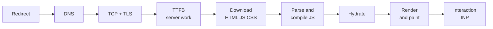

You can read the phases for the current page in the console:

```ts
const [nav] = performance.getEntriesByType('navigation') as PerformanceNavigationTiming[];
console.table({
  redirect: nav.redirectEnd - nav.redirectStart,
  dns: nav.domainLookupEnd - nav.domainLookupStart,
  connectAndTls: nav.connectEnd - nav.connectStart,
  ttfb: nav.responseStart - nav.requestStart,
  download: nav.responseEnd - nav.responseStart,
  domInteractive: nav.domInteractive - nav.startTime,
  loadEvent: nav.loadEventEnd - nav.startTime,
});
```

The server can add its own breakdown with the `Server-Timing` response header. The Network panel shows it under Timing, and RUM tools can collect it.

```ts
// Next.js route handler or any Node server
res.setHeader('Server-Timing', 'auth;dur=12, db;dur=340;desc="transactions query", render;dur=85');
```

**Pros:**
- Built into every browser. No setup.
- Turns "slow" into "TTFB is 3.1 s of 3.6 s", which points straight at the backend.

**Cons / limits:**
- Cross-origin resources hide detail unless the server sends `Timing-Allow-Origin`.
- Client-side navigations in a single-page app do not create a new navigation entry. You need soft-navigation tracking in your RUM tool.

**Use it when / avoid when:**
- Use it for any "page loads slowly" complaint.
- It does not help with "typing lags" problems. Those are interaction problems, covered by INP.

### Core Web Vitals as symptom labels

**What it is:** Google's Core Web Vitals are three user-centred metrics. **LCP** (Largest Contentful Paint): when the main content appears. **INP** (Interaction to Next Paint): how long the page takes to visibly respond to clicks, taps and key presses. **CLS** (Cumulative Layout Shift): how much the layout jumps. **TTFB** and **FCP** are supporting metrics.

**Why it's used:** They give a shared language. "INP is 600 ms on the Pay button" is a precise bug report. They also map neatly to layers.

**How it works:** "Good" thresholds measured at the 75th percentile of page views: LCP at most 2.5 s, INP at most 200 ms, CLS at most 0.1. A commonly used TTFB target is under 800 ms.

| Bad metric | Look first at |
|---|---|
| TTFB | Server rendering, data fetching, cold starts, CDN cache misses, distance |
| LCP with good TTFB | Render-blocking CSS and JS, late-discovered hero image, fonts, client-side data fetching |
| INP | Long tasks on the main thread, expensive React renders, third-party scripts |
| CLS | Images without dimensions, late-loading banners, font swaps, hydration changing layout |

LCP itself can be split into four parts: TTFB, resource load delay, resource load duration and element render delay. The `web-vitals` attribution build reports these parts for you.

**Pros:** Standard, measurable in the field, tracked by Google Search Console and CrUX.

**Cons / limits:** They measure the page, not your business flow. A 5-second "Export CSV" action has no Web Vital. Add custom timings (`performance.mark` and `performance.measure`) for those.

**Use it when / avoid when:** Use them as the first symptom label. Avoid treating a lab Lighthouse score as the same thing as the field Web Vitals.

### The layer decision tree: frontend, network, backend or database?

**What it is:** A short sequence of yes/no checks that tells you which layer to investigate first. You run it in the first 15 minutes.

**Why it's used:** Each layer has different tools and often a different team. Starting in the wrong layer wastes the most time.

**How it works:**

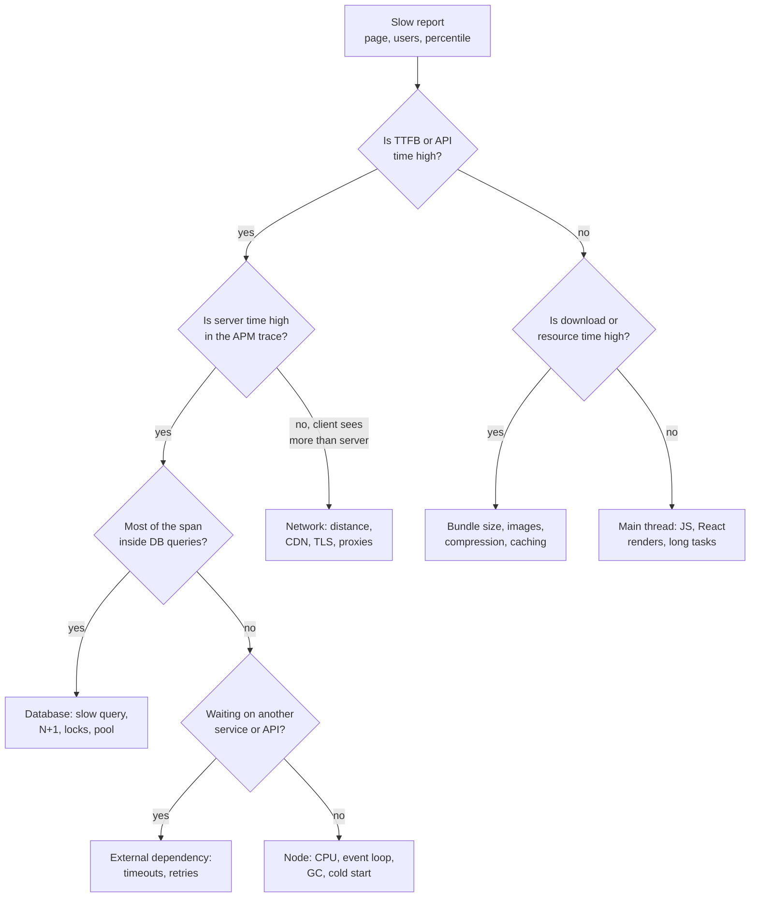

The key comparison is **what the browser sees vs what the server measured**. If the browser sees a 3 s TTFB but the server span is 150 ms, the time is lost between them: network, queueing at a load balancer, a cold start before your code runs, or a proxy.

**Pros:** Fast, works for any stack, easy to explain in an interview.

**Cons / limits:** Real incidents can involve two layers at once (a slow query that also causes pool exhaustion that also causes 504s). Re-run the tree after each fix.

**Use it when / avoid when:** Use it first, every time. Skip it only when the signal is already unambiguous, such as an APM alert that names one SQL statement.

#### Q: [Mid] A product manager messages you: "The app is really slow today." You have 30 minutes before a standup. What do you do?

**Short answer:** I turn the complaint into a measurable statement first: which page, which action, which users, since when. Then I check our dashboards (RUM for Web Vitals, APM for API latency and errors) to confirm it is real and see which layer moved. Only then do I open a profiler on the specific page.

**Clarify first:**
- Which page and which action? Loading, clicking, or a specific button?
- Is it everyone, or one customer, browser, device or region?
- When did it start? Was there a deploy or feature flag change today?
- Is it slow or broken (errors, timeouts)? Errors change the priority.

**Diagnose:**
1. Open the deploy history and the feature flag audit log. Note anything in the last 24 hours.
2. Open the RUM dashboard (for example Datadog RUM, Sentry, or your own `web-vitals` data). Filter by the page. Compare today's p75 LCP and INP with last week. Split by device and country.
3. Open the APM service overview. Look at p95 latency, error rate and throughput per endpoint. Sort endpoints by "total time" (latency multiplied by calls) to find the one that moved.
4. If an endpoint moved, open a few slow traces and see which span grew.
5. If no backend metric moved but RUM got worse, it is frontend or network. Record a Chrome Performance profile of that page with 4x CPU throttling.
6. Reproduce once yourself with DevTools open, so you have a concrete example to share.

**Solution:** At standup, report facts and a next step, not a guess: "p95 of `GET /api/transactions` went from 250 ms to 2.1 s at 10:40, which matches the 10:35 deploy. Traces show a new query in the response path. I'm checking whether to roll back." If you cannot find any signal, say so and ask the PM for an example (URL, time, user ID) so you can look up that exact session.

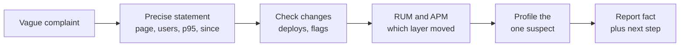

**Trade-offs:** Checking dashboards first feels slower than opening the code, but it avoids optimizing something that did not change. If there is no telemetry, the honest answer is "I can't tell yet; I'll reproduce it and add RUM so next time we can".

**What interviewers listen for:**
- You ask "since when" and check deploys first. Most production regressions come from a change.
- You distinguish slow from broken.
- You use percentiles and segments, not "it felt slow".
- Red flag: jumping straight to "I'd add `useMemo` everywhere" or "we should add a cache".

#### Q: [Senior] Our API dashboard shows the average latency for `GET /api/portfolio` is 180 ms and healthy, but support keeps getting complaints that the portfolio page is slow. How do you reconcile this?

**Short answer:** The average is hiding the tail. I would look at p95 and p99 and the latency distribution, then split by customer attributes, because a small group of slow requests can be invisible in the mean. I would also check that the complaint is about the API at all: the page could be slow in the browser while the API is fine.

**Clarify first:**
- Are the complaints from particular customers? Large portfolios, a specific region, a specific browser?
- Is the dashboard measuring server time only, or what the client sees?
- What does "slow" mean to the users: blank screen, spinner, or laggy interaction?

**Diagnose:**
1. In the APM tool, switch the latency graph from average to p50, p95 and p99. A p99 of 6 s with an average of 180 ms is common.
2. Open the latency distribution (histogram) for the endpoint. Two humps mean two populations, for example cached and uncached, or small and large accounts.
3. Group slow traces by a tag such as `account.positions_count`, `tenant.id` or `region`. If your traces do not have these tags, add them.
4. Compare server time with the client-side timing for the same requests (RUM resource timing). A big gap means network or queueing.
5. Open the RUM session for one complaining user. Look at the waterfall and long tasks on their device.

**Solution:** Fix depends on the finding. If big accounts are slow: paginate or aggregate on the server, add the right index, cache per-account summaries. If the gap is network: CDN, regional deployment, smaller payloads. If it is frontend: profile the page with that user's data volume. Then change the dashboard and the alert to use p95 and p99, never only the average.

```ts
// Add business attributes to the active span so you can group traces later
import { trace } from '@opentelemetry/api';

const span = trace.getActiveSpan();
span?.setAttribute('account.positions_count', positions.length);
span?.setAttribute('tenant.plan', tenant.plan);
```

**Trade-offs:** High-cardinality tags (user ID, account ID) make traces very useful but can be expensive in some APM pricing models. Use buckets ("positions_bucket: 1k-10k") for metrics and keep exact IDs on traces only.

**What interviewers listen for:**
- You say "averages hide the tail" without being prompted.
- You look at distributions and segments.
- You check whether server time and client experience match.
- Red flag: accepting the average as proof that there is no problem.

## 2. Frontend diagnosis tools

### Chrome Performance panel

**What it is:** A recorder that captures everything the browser's main thread did over a few seconds: JavaScript, style calculation, layout, paint, network requests and frames. It shows the result as a timeline and a flame chart. It is the single most important tool for "the page lags".

**Why it's used:** When typing in a filter feels sticky, you need to see what ran between the key press and the next frame. The Performance panel shows the exact function and how long it took.

**How it works:**

1. Open DevTools, go to **Performance**. The landing view shows live local LCP, CLS and INP as you interact (recent Chrome versions).
2. In the capture settings (gear icon), set **CPU: 4x or 6x slowdown** to approximate a mid-range phone, and optionally **Network: Fast 4G**. Recent Chrome versions can also calibrate CPU throttling to match low-tier and mid-tier mobile devices.
3. Click **Record**, do the slow action once (type 5 characters, click the button), click **Stop**. For load problems use **Record and reload**.
4. Read the tracks from top to bottom:
   - **Frames** and **Interactions** track: each interaction shows as a bar. Long ones are flagged.
   - **Main** track: the flame chart. Width is time. Bars with a red triangle and red stripes are **long tasks** (over 50 ms).
   - **Network** track: requests over time.
5. Click a long task. The **Bottom-Up** tab lists functions sorted by self time. **Call Tree** shows the top-down path. **Event Log** lists events in order.
6. Look at the **Summary** donut: Scripting (yellow), Rendering (purple, style and layout), Painting (green), System, Idle.
7. Check the **Insights** sidebar (recent Chrome versions). It points at things like LCP breakdown, render-blocking requests, layout shift culprits and forced reflow.

What the colours tell you:

| What dominates | Likely cause |
|---|---|
| Mostly yellow (Scripting) | Your JavaScript or a library: React renders, JSON parsing, sorting |
| Mostly purple (Rendering) | Style recalculation and layout: huge DOM, layout thrashing, expensive CSS selectors |
| Purple "Layout" with a red corner inside JS | Forced synchronous layout: reading `offsetHeight` after writing styles |
| Green (Painting) | Big paint areas, heavy shadows and filters, large images |

React 19.2 and later add custom **Performance Tracks** (Scheduler and Components) in development builds and profiling builds, so you can see React's render and commit phases and which components rendered, inside the same timeline. Hedge: details depend on your React and Chrome versions.

You can add your own markers, which appear in the **Timings** track:

```ts
performance.mark('filter-start');
const rows = applyFilter(allRows, query);
performance.mark('filter-end');
performance.measure('filter transactions', 'filter-start', 'filter-end');
```

**Pros:**
- Shows the real cause at function level.
- Works for any framework.
- Throttling makes desktop problems visible that only phones show in production.

**Cons / limits:**
- A lab recording on your machine, with your data. It may not match a real user's device or account size.
- Development builds of React are much slower than production builds. Profile a production build (`next build && next start`) before drawing conclusions.
- Minified function names in production. Enable source maps locally for readable names.

**Use it when / avoid when:**
- Use it for any lag, jank, slow interaction or slow load you can reproduce.
- Avoid it for server-side slowness. A flame chart full of "Idle" while waiting for a fetch means the problem is not in the browser.

> **Gotcha:** Browser extensions run on the main thread too. Profile in an Incognito window or a clean Chrome profile.

### Lighthouse vs field data (CrUX, web-vitals, RUM)

**What it is:** **Lab data** is a test you run in a controlled setup (Lighthouse, PageSpeed Insights lab section, WebPageTest). **Field data** is collected from real users (Chrome UX Report, your own RUM such as Datadog RUM or Sentry, or the `web-vitals` library sending to your analytics).

**Why it's used:** Lab data is repeatable and great for catching regressions. Field data tells you what users actually experience on their devices, networks and with their data. They often disagree, and the field is the truth.

**How it works:**

| | Lighthouse (lab) | CrUX (field) | Your RUM (field) |
|---|---|---|---|
| Source | One simulated load | Opted-in Chrome users | Every user you instrument |
| Measures INP? | No (uses Total Blocking Time as a proxy) | Yes | Yes |
| Granularity | One URL, one run | Origin or URL, 28-day rolling | Any page, any segment, real-time |
| Logged-in pages | Only if you script it | Yes, aggregated | Yes |
| Best for | Pre-merge checks, CI | SEO, broad trends | Debugging, segmenting, alerts |

Collecting field data yourself with the `web-vitals` attribution build:

```ts
// app/web-vitals.tsx  (a client component rendered once in the root layout)
'use client';
import { useEffect } from 'react';
import { onINP, onLCP, onCLS, onTTFB } from 'web-vitals/attribution';

function send(metric: { name: string; value: number; rating: string; attribution: unknown }) {
  const body = JSON.stringify({
    name: metric.name,
    value: Math.round(metric.value),
    rating: metric.rating,
    page: location.pathname,
    attribution: metric.attribution,
  });
  navigator.sendBeacon?.('/api/vitals', body) ||
    fetch('/api/vitals', { method: 'POST', body, keepalive: true });
}

export function WebVitals() {
  useEffect(() => {
    onINP(send);
    onLCP(send);
    onCLS(send);
    onTTFB(send);
  }, []);
  return null;
}
```

Next.js also provides a `useReportWebVitals` hook from `next/web-vitals` that does similar work without the attribution detail.

**Pros:** Lab is free and repeatable. Field is real and segmentable.

**Cons / limits:**
- Lighthouse runs on a fresh cache, a simulated device and no user data. A 98 score does not mean users are happy.
- CrUX needs enough traffic and is delayed (28-day window). It cannot see a regression from this morning.
- RUM costs money or engineering time, and sampling can hide rare problems.

**Use it when / avoid when:**
- Use Lighthouse in CI and for quick checks of public pages.
- Use RUM to decide what to fix and to confirm fixes.
- Avoid presenting a Lighthouse score as proof that a production complaint is wrong.

### Debugging INP with the Long Animation Frames API

**What it is:** INP measures the delay from a user's input to the next frame that shows a result. Each interaction has three parts: **input delay** (the main thread was busy when the click came in), **processing duration** (your event handlers ran) and **presentation delay** (rendering and painting the result). The **Long Animation Frames API** (LoAF, available in Chromium-based browsers) reports frames that took more than 50 ms and, crucially, which scripts ran inside them.

**Why it's used:** A field INP of 600 ms tells you something is wrong but not what. LoAF entries tell you "a script from `chunk-4f2a.js`, function `handleSubmit`, invoked by a `click` listener, ran for 420 ms, with 90 ms of forced layout". That is enough to find the code.

**How it works:**

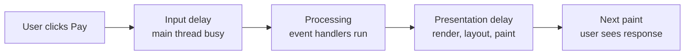

The `web-vitals` attribution build exposes the three parts and the matching LoAF entries:

```ts
import { onINP } from 'web-vitals/attribution';

onINP(({ value, attribution }) => {
  const {
    interactionTarget,       // CSS selector of the element, e.g. "button#pay"
    inputDelay,
    processingDuration,
    presentationDelay,
    longAnimationFrameEntries,
  } = attribution;

  const scripts = longAnimationFrameEntries.flatMap((frame) =>
    frame.scripts.map((s) => ({
      source: s.sourceURL,
      fn: s.sourceFunctionName,
      invoker: s.invoker,          // e.g. "BUTTON#pay.onclick" or a listener name
      duration: Math.round(s.duration),
      forcedLayout: Math.round(s.forcedStyleAndLayoutDuration),
    })),
  );

  report({ value, interactionTarget, inputDelay, processingDuration, presentationDelay, scripts });
});
```

You can also observe LoAF directly:

```ts
new PerformanceObserver((list) => {
  for (const entry of list.getEntries()) {
    if (entry.duration > 150) console.log('Long frame', entry);
  }
}).observe({ type: 'long-animation-frame', buffered: true });
```

How to read the result:

| Biggest part | Meaning | Typical fix |
|---|---|---|
| Input delay | Something else was running: hydration, a timer, analytics | Break up long tasks, defer third parties |
| Processing duration | Your handler is slow | Do less synchronously, yield, move work off the main thread |
| Presentation delay | The render after the handler is slow | Smaller re-render, virtualize, `startTransition` |

**Pros:** Points to the script and function from real users, in production.

**Cons / limits:**
- Chromium only. Safari and Firefox users are not covered (hedge: support may change).
- Script attribution is at the entry point level. You see `onClick` in chunk X, not every function it called. Use a local Performance recording for the deep call tree.
- Cross-origin scripts without CORS show limited detail.

**Use it when / avoid when:** Use it whenever field INP is poor and you cannot reproduce it locally. Avoid relying only on Lighthouse for interaction problems: Lighthouse does not measure INP.

### React DevTools Profiler

**What it is:** A tab in the React DevTools browser extension that records React **commits** (each time React applies an update to the DOM) and shows which components rendered, how long each took, and why.

**Why it's used:** The Chrome Performance panel shows "React took 300 ms". The React Profiler shows that 280 of those milliseconds were 2,000 `TransactionRow` components re-rendering because a parent passed a new `onSelect` function every time.

**How it works:**

1. Open React DevTools, **Profiler** tab. Click the gear and enable **"Record why each component rendered while profiling"**. In the Components tab settings, you can also enable **"Highlight updates when components render"** to see flashes on screen.
2. Click record, do the slow action, stop.
3. The top-right bar chart shows one bar per commit. Tall, yellow bars are slow commits. Click one.
4. The **Flamegraph** view shows the component tree for that commit. Width is render time including children. Grey components did not render. Yellow and orange components were slow.
5. The **Ranked** view sorts components by their own render time.
6. Click a component. The right sidebar shows **"Why did this render?"**: "Props changed: (onSelect)", "Hook 3 changed", "Parent component rendered", "Context changed".

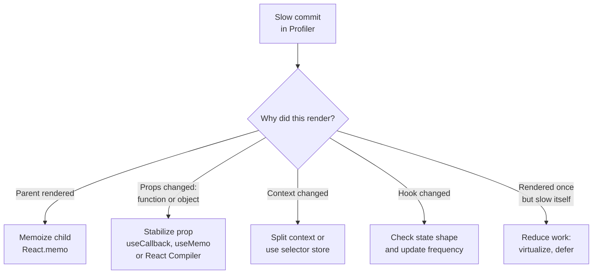

**Pros:** Shows React-level cause, not just "scripting time". The "why" sidebar answers the most common question directly.

**Cons / limits:**
- Profiling adds overhead. Absolute numbers are inflated, especially in development builds. Compare relative sizes.
- Production builds do not support profiling unless you use a profiling build (in Next.js, `next build --profile`).
- It does not show time spent outside React (layout, paint, your own non-React code).
- With the React Compiler, many manual memoization fixes are automatic. The Profiler still shows what rendered.

**Use it when / avoid when:** Use it when the Performance panel shows the time is in React rendering. Avoid it when the flame chart shows layout, a JSON parse or a third-party script.

### React Scan and why-did-you-render

**What it is:** Two developer tools that point out unnecessary re-renders without a manual recording. **React Scan** draws outlines around components on screen as they render, with render counts, and has a toolbar to inspect them. **why-did-you-render** (`@welldone-software/why-did-you-render`) patches React in development and logs to the console when a component re-renders with props that are deep-equal but not reference-equal.

**Why it's used:** In a real app it is hard to know where to start the Profiler. React Scan lets you just use the page and see the whole table light up when you type one character. That is your lead.

**How it works:**

React Scan (one option is a script loaded only in development):

```tsx
// app/layout.tsx
export default function RootLayout({ children }: { children: React.ReactNode }) {
  return (
    <html lang="en">
      <head>
        {process.env.NODE_ENV === 'development' && (
          <script src="https://unpkg.com/react-scan/dist/auto.global.js" async />
        )}
      </head>
      <body>{children}</body>
    </html>
  );
}
```

It can also be run against any URL with `npx react-scan@latest http://localhost:3000`. Check the React Scan docs for the current Next.js setup; it has changed between versions.

why-did-you-render:

```ts
// wdyr.ts, imported first in a client entry, development only
import React from 'react';
import whyDidYouRender from '@welldone-software/why-did-you-render';

if (process.env.NODE_ENV === 'development') {
  whyDidYouRender(React, { trackAllPureComponents: true });
}

// On a specific component:
TransactionRow.whyDidYouRender = true;
// Console: "TransactionRow re-rendered because props.onSelect changed: different functions with the same name"
```

**Pros:** Zero-effort discovery. Good for teaching a team what "unnecessary render" looks like.

**Cons / limits:**
- A render is not always a problem. A component that renders 50 times in 0.1 ms each is fine. Confirm cost with the Profiler.
- why-did-you-render hooks into React internals. Support for the newest React versions and for Server Components setups can lag; check its compatibility notes before relying on it.
- Neither tool tells you about layout, paint or network.

**Use it when / avoid when:** Use them as a quick scan of a laggy screen. Avoid treating "it re-rendered" as a bug without measuring the time.

### Memory panel: heap snapshots, detached nodes, allocation timeline

**What it is:** The **Memory** tab in DevTools takes **heap snapshots** (a full picture of every JavaScript object and what keeps it alive), records an **allocation timeline** (which objects were created over time and whether they were freed), and runs **allocation sampling** (a cheap profile of which functions allocate most).

**Why it's used:** If a trading dashboard's tab crashes after two hours, something is growing that never gets freed: a subscription not cleaned up, a growing array of price ticks, detached DOM nodes from rows that were removed but are still referenced.

**How it works:** The three-snapshot technique:

1. Load the page. Open **Memory**, click the trash-can icon to force garbage collection, take **Snapshot 1**.
2. Do the suspected action several times (open and close a modal 10 times, or let the price feed run for 5 minutes).
3. Force GC, take **Snapshot 2**. Repeat the action, force GC, take **Snapshot 3**.
4. Select Snapshot 3, change the view to **Comparison** against Snapshot 2. Sort by **# Delta** or **Size Delta**. Objects that grow by the same amount each round are your leak.
5. In the **Class filter**, type `Detached` to find **detached DOM nodes**: elements removed from the page but still referenced by JavaScript.
6. Click an object. The **Retainers** panel at the bottom shows the chain of references keeping it alive. Follow it up until you find your code: a closure in an event listener, a module-level `Map`, a store, a timer.

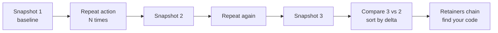

The **Performance monitor** panel (More tools, Performance monitor) shows live JS heap size, DOM node count and event listener count. A sawtooth that returns to the same floor is healthy. A floor that keeps rising is a leak.

**Pros:** Shows exactly what is retained and why.

**Cons / limits:**
- Snapshots of large heaps are slow and can freeze the tab.
- Retainer chains through React internals (`FiberNode`, `memoizedProps`) take practice to read.
- Some growth is caches by design. A leak is growth without a bound.

**Use it when / avoid when:** Use it for growing memory, tabs crashing, or slowdowns that get worse over time. Avoid it for one-off slowness.

### Network panel: waterfall and throttling

**What it is:** The **Network** tab lists every request with its timing, size, priority and initiator, drawn as a **waterfall**. Throttling presets (Fast 4G, Slow 4G, 3G, offline, custom) slow the connection to match real users.

**Why it's used:** A waterfall shows dependency chains. If the bundle loads, then it fetches `/api/me`, then `/api/accounts`, then `/api/transactions`, you have a client-side request waterfall that adds three round trips before anything useful appears.

**How it works:**

1. Open **Network**, tick **Disable cache** to simulate a first visit, choose a throttling preset.
2. Reload. Look at the shape of the waterfall: long staircases mean sequential requests.
3. Hover a request's bar to see the **Timing** breakdown: Queueing, Stalled, DNS, Initial connection, SSL, Request sent, **Waiting for server response (TTFB)**, Content Download.
4. Add columns by right-clicking the header: **Priority**, **Protocol** (h2, h3), **Initiator**.
5. Click the **Initiator** column to see what triggered a request. The initiator chain shows who requested whom.
6. Filter by `larger-than:200k` to find heavy files. Check the **Size** column: transferred size vs resource size tells you if compression is on.
7. For server timing, open a request and check **Timing**: `Server-Timing` entries appear at the bottom.

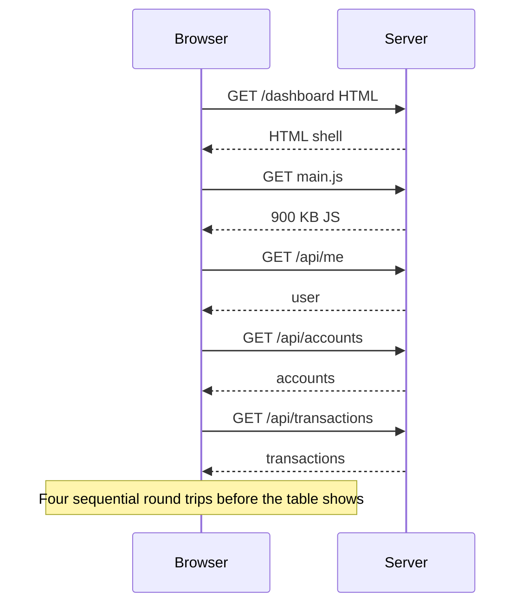

**Pros:** Fast to read. Shows dependency chains and missing compression immediately.

**Cons / limits:**
- DevTools throttling adds latency per request at the browser level; it is an approximation of a real mobile network. Tools like WebPageTest on real devices are more accurate.
- HTTP/2 and HTTP/3 multiplexing can make the waterfall look parallel even when the server processes requests in series.

**Use it when / avoid when:** Use it for slow loads, blank screens and "spinner then another spinner". Avoid it for interaction lag that happens after everything has loaded.

### Coverage tab

**What it is:** A DevTools panel (More tools, **Coverage**) that records which bytes of each JS and CSS file actually ran during a session.

**Why it's used:** If 70% of a 600 KB bundle is unused on the login page, you have code that should be split or loaded later.

**How it works:**

1. Open Coverage, click the reload button to start recording with a page load.
2. The table lists files with **Total bytes**, **Unused bytes** and a red/blue bar.
3. Click a file to see unused lines highlighted red in the Sources panel.
4. Interact with the page to see which code gets used later. Code used only after a click is a candidate for `dynamic()` or `import()`.

**Pros:** Concrete numbers per file. Finds dead CSS too.

**Cons / limits:**
- "Unused on this page" is not "unused". Code may be needed on another route or interaction.
- Works on bundled output, so mapping back to your modules requires source maps or a bundle analyzer.

**Use it when / avoid when:** Use it when parse and compile time or download size is high. Avoid using it alone to delete code.

### Bundle analyzers (@next/bundle-analyzer and friends)

**What it is:** Tools that draw a treemap of your production bundles so you can see which packages and modules take the most space.

**Why it's used:** You learn that `moment` with all locales is 300 KB, or that a chart library is in the shared chunk that every page loads, or that a server-only library leaked into a client component.

**How it works:**

```ts
// next.config.ts
import type { NextConfig } from 'next';
import bundleAnalyzer from '@next/bundle-analyzer';

const withBundleAnalyzer = bundleAnalyzer({ enabled: process.env.ANALYZE === 'true' });

const nextConfig: NextConfig = {};
export default withBundleAnalyzer(nextConfig);
```

```bash
ANALYZE=true next build
```

It opens HTML reports for the client, the Node.js server and the Edge bundles. Look at the **client** report. Large rectangles in chunks loaded by every page are the first targets.

> **Gotcha:** `@next/bundle-analyzer` is a webpack plugin. Next.js 16 builds with Turbopack by default, so you may need `next build --webpack` for this report. Newer Next.js versions also ship an experimental Turbopack-native analyzer (`next experimental-analyze`). Check the docs for your version.

Other options: `source-map-explorer` on the built chunks, and the `optimizePackageImports` setting in `next.config` for icon and utility libraries that ship many modules.

**Pros:** Visual, fast, finds surprises.

**Cons / limits:** Shows size, not runtime cost. A small module can still be the slowest code on the page.

**Use it when / avoid when:** Use it when download or parse time is high, or on every major dependency change. Avoid it for interaction lag that is caused by rendering.

#### Q: [Senior] On the transactions page, typing in the filter box lags. Each key press takes about half a second to appear. The table shows 5,000 rows. How do you find the cause and fix it?

**Short answer:** I'd record the typing in the Chrome Performance panel with CPU throttling and see what runs on each key press, then use the React Profiler to see which components re-render and why. The usual cause is that every key press synchronously filters and re-renders all 5,000 rows. The fix is to keep the input update urgent and make the filtering and table render cheap or deferred: `useDeferredValue`, memoized rows, and virtualization.

**Clarify first:**
- Is the filtering done on the client or does each key press call the API?
- How many rows are rendered in the DOM at once? Is the table virtualized?
- Which devices complain? Does it lag on a fast laptop too?
- Is the filter state stored in the URL, a global store or local state?

**Diagnose:**
1. Run React Scan or turn on "Highlight updates". Type one letter. If the whole table flashes, every row re-renders.
2. Performance panel, CPU 4x, record while typing 5 characters. Open the **Interactions** track: each `keydown`/`keypress` interaction shows its duration. Click the long one.
3. In the Main track under that interaction, look at the flame chart. Typical findings: a long yellow block under React's `performWorkOnRoot` (rendering) and maybe a `filter` or `toLowerCase` hotspot in Bottom-Up, then a purple Layout block for 5,000 rows.
4. Open the React Profiler, record typing, click the slow commit. The Ranked view shows `TransactionRow` x 5,000. The sidebar says "Props changed: (onSelect, formatAmount)" or "Parent rendered".
5. Check the DOM size: `document.querySelectorAll('tr').length` in the console. 5,000 rows means a big layout cost on every change.
6. If the URL updates on every key press, check whether a router navigation runs per key: in Next.js App Router, `router.push` on each key press can trigger a server request.

**Solution:**

Step 1: keep the input urgent, defer the expensive part.

```tsx
'use client';
import { useDeferredValue, useMemo, useState, memo } from 'react';

export function TransactionsTable({ rows }: { rows: Transaction[] }) {
  const [query, setQuery] = useState('');
  const deferredQuery = useDeferredValue(query);

  const filtered = useMemo(() => {
    const q = deferredQuery.trim().toLowerCase();
    if (!q) return rows;
    return rows.filter((r) => r.searchText.includes(q)); // precomputed lowercase field
  }, [rows, deferredQuery]);

  const isStale = query !== deferredQuery;

  return (
    <>
      <input value={query} onChange={(e) => setQuery(e.target.value)} aria-label="Filter transactions" />
      <div style={{ opacity: isStale ? 0.6 : 1 }}>
        <VirtualRows rows={filtered} />
      </div>
    </>
  );
}
```

Step 2: precompute the search text once when data arrives (`searchText = [merchant, memo, amount].join(' ').toLowerCase()`), instead of lowercasing 5,000 strings on every key press.

Step 3: virtualize, so only about 30 rows are in the DOM.

```tsx
import { useVirtualizer } from '@tanstack/react-virtual';
import { useRef } from 'react';

function VirtualRows({ rows }: { rows: Transaction[] }) {
  const parentRef = useRef<HTMLDivElement>(null);
  const virtualizer = useVirtualizer({
    count: rows.length,
    getScrollElement: () => parentRef.current,
    estimateSize: () => 44,
    overscan: 10,
  });

  return (
    <div ref={parentRef} style={{ height: 600, overflow: 'auto' }}>
      <div style={{ height: virtualizer.getTotalSize(), position: 'relative' }}>
        {virtualizer.getVirtualItems().map((item) => (
          <Row key={rows[item.index].id} tx={rows[item.index]} top={item.start} />
        ))}
      </div>
    </div>
  );
}

const Row = memo(function Row({ tx, top }: { tx: Transaction; top: number }) {
  return (
    <div style={{ position: 'absolute', top, height: 44, width: '100%' }}>
      {tx.merchant} {formatCents(tx.amountCents)}
    </div>
  );
});
```

Step 4: if the filter updates the URL, debounce the URL write (for example 300 ms) and use `router.replace` with `{ scroll: false }`, or keep the filter in local state and sync later.

Step 5: if the data set grows to 100k+, move filtering to the server with an indexed search endpoint.

**Confirm the fix:** re-record with the same throttling. The keydown interaction should drop below 100 ms. The React Profiler should show the input commit is tiny and the table commit renders about 40 rows. In production, watch field INP for that page.

**Trade-offs:** `useDeferredValue` keeps typing responsive but the table briefly shows stale results; the opacity hint makes that honest. Virtualization breaks browser find-in-page (Ctrl+F) and needs care for accessibility (row counts, `aria-rowcount`). Debouncing adds deliberate delay. Server-side filtering adds network latency per query but scales.

**What interviewers listen for:**
- You measure before fixing, and you name both tools: Performance panel for "what is slow", React Profiler for "why React rendered".
- You separate urgent updates (the input) from non-urgent ones (the results).
- You mention DOM size, not just React renders.
- Red flag: "wrap everything in `useMemo`" without knowing what re-rendered.

#### Q: [Senior] Field data shows an INP of 600 ms on the "Pay" button of the payment form, mostly on Android. You can't reproduce it on your laptop. How do you debug it?

**Short answer:** I would use field attribution to find which part of the interaction is slow (input delay, processing or presentation) and which script ran, using the `web-vitals` attribution build with Long Animation Frame entries. Then I'd reproduce locally with heavy CPU throttling and the same data, and fix the specific cause, usually too much synchronous work in the click handler or a big re-render before the next paint.

**Clarify first:**
- Is the 600 ms the p75 for all users or a subset (device model, form size, saved payees count)?
- What does the click do: validation, analytics, a fetch, a state update that shows a spinner?
- Are there third-party scripts on the page (fraud detection, analytics, chat widgets)?

**Diagnose:**
1. In RUM, filter INP events by `interactionTarget` = the Pay button. Look at the attribution split. Example finding: input delay 40 ms, processing 480 ms, presentation 80 ms. Processing dominates, so the click handler is slow.
2. Look at `longAnimationFrameEntries[].scripts`. Example: `invoker: "BUTTON#pay.onclick"`, `sourceURL: /_next/static/chunks/payment-form.js`, `sourceFunctionName: handleSubmit`, duration 410 ms, `forcedStyleAndLayoutDuration` 120 ms. Also check for scripts from a fraud SDK or analytics.
3. Locally: production build, Performance panel, **CPU 6x slowdown** (or a calibrated low-tier mobile preset if available), fill the form with realistic data, click Pay, stop. Find the click interaction in the **Interactions** track.
4. Bottom-Up on that task. Common culprits: synchronous schema validation of a large form, `JSON.stringify` of form state for analytics, a fraud SDK collecting device data, reading `getBoundingClientRect` after setting styles (forced layout), and a state update that re-renders the whole form.
5. For real-device confirmation, use **remote debugging**: plug in an Android phone, open `chrome://inspect` on your desktop, and record a Performance profile on the device itself.

**Solution:** The goal is to paint feedback first, then do the work.

```tsx
'use client';
import { useState, useTransition } from 'react';

// Yield to the browser so it can paint before heavy work continues.
function yieldToMain(): Promise<void> {
  // scheduler.yield() is available in recent Chromium. Fall back to setTimeout.
  const s = (globalThis as any).scheduler;
  if (s?.yield) return s.yield();
  return new Promise((resolve) => setTimeout(resolve, 0));
}

export function PayButton({ form }: { form: PaymentFormState }) {
  const [submitting, setSubmitting] = useState(false);
  const [, startTransition] = useTransition();

  async function handleClick() {
    setSubmitting(true);           // urgent: show the spinner
    await yieldToMain();           // let the browser paint it

    const errors = validatePayment(form); // keep this cheap; validate fields incrementally on blur
    if (errors.length) {
      startTransition(() => showErrors(errors));
      setSubmitting(false);
      return;
    }

    // Analytics is not urgent: run it when the browser is idle (fallback for browsers without it).
    const idle = globalThis.requestIdleCallback ?? ((cb: () => void) => setTimeout(cb, 1));
    idle(() => analytics.track('pay_clicked', { amountCents: form.amountCents }));

    await submitPayment(form);     // network, does not block the main thread
  }

  return (
    <button id="pay" onClick={handleClick} disabled={submitting} aria-busy={submitting}>
      {submitting ? 'Processing…' : 'Pay'}
    </button>
  );
}
```

Other fixes depending on the finding:
- Move heavy validation into field-level validation on blur, so submit only checks a summary.
- Load the fraud or analytics SDK with `next/script` `strategy="lazyOnload"` and call it after paint.
- Remove forced layout: batch DOM reads before writes, or avoid measuring at all.
- If presentation delay dominates, shrink the re-render: the button state should not re-render the whole form. Split state or use a form library with field-level subscriptions.

**Confirm the fix:** local recording shows the click interaction under 200 ms on 6x throttling; then watch field INP for the Pay button target over a few days (p75 under 200 ms).

**Trade-offs:** Yielding makes the work slightly longer overall but the user sees feedback immediately. Deferring analytics risks losing events if the page navigates away; use `sendBeacon`. `scheduler.yield` is not in every browser, so keep the fallback.

**What interviewers listen for:**
- You know INP's three phases and use them to direct the search.
- You use field attribution (LoAF) when local reproduction fails.
- You know how to profile a real Android device.
- Finance angle: the button must also be protected against double submission (disabled state plus an idempotency key on the server), because a slow click invites a second click.
- Red flag: "Lighthouse says 99 so it's fine". Lighthouse does not measure INP.

> **Finance tip:** A laggy Pay button causes double clicks. Always pair INP work with an idempotency key on the payment request so a second submit cannot charge twice.

#### Q: [Senior] Users of the live portfolio dashboard report that after about two hours the tab gets slower and slower and finally crashes with "Aw, Snap! Out of memory". How do you find the leak?

**Short answer:** I'd confirm growth with the Performance monitor (JS heap, DOM nodes, listeners), then use the three-snapshot technique in the Memory panel to find objects that grow on every cycle and follow their retainer chain back to our code. For a live price feed, the usual suspects are unbounded arrays of ticks, subscriptions or intervals not cleaned up on unmount, and detached DOM nodes from chart redraws.

**Clarify first:**
- What updates live: WebSocket prices, polling, charts redrawing?
- Does it happen if the user just leaves the tab open, or only when they navigate between views?
- Which chart library? Does it create new instances on each update?

**Diagnose:**
1. Open **Performance monitor**. Leave the dashboard running for 10 minutes. Watch **JS heap size**, **DOM Nodes**, **JS event listeners**. Rising DOM nodes and listeners point to components or charts not being destroyed. A rising heap with flat DOM points to data accumulating.
2. Speed it up: if the leak is per navigation, script a loop that switches tabs 20 times. If it is per tick, increase the feed rate in a test environment.
3. Memory panel: force GC, Snapshot 1; wait 5 minutes; force GC, Snapshot 2; wait; Snapshot 3. Compare 3 to 2.
4. Sort by **Size Delta**. Example finding: `(array)` +40 MB, `Object` with shape `{symbol, priceCents, ts}` +300k instances. Click one, read **Retainers**: `ticks` in a closure in `usePriceFeed`, or a module-level `priceHistory` map.
5. Filter by `Detached`. If you see `Detached HTMLCanvasElement` or `Detached HTMLDivElement` growing, a chart library instance was not destroyed, or a ref is still held.
6. Use **Allocation instrumentation on timeline** for a minute: blue bars that stay blue (not grey) are allocations still alive at the end.

**Solution:** Typical fixes:

```tsx
'use client';
import { useEffect, useRef, useState } from 'react';

const MAX_POINTS = 500; // bounded history

export function usePriceFeed(symbol: string) {
  const [points, setPoints] = useState<PricePoint[]>([]);

  useEffect(() => {
    const ws = new WebSocket(`${WS_URL}/prices?symbol=${symbol}`);
    const onMessage = (e: MessageEvent) => {
      const p: PricePoint = JSON.parse(e.data);
      setPoints((prev) => {
        const next = prev.length >= MAX_POINTS ? prev.slice(prev.length - MAX_POINTS + 1) : prev.slice();
        next.push(p);
        return next;
      });
    };
    ws.addEventListener('message', onMessage);

    return () => {               // cleanup on unmount or symbol change
      ws.removeEventListener('message', onMessage);
      ws.close();
    };
  }, [symbol]);

  return points;
}

export function PriceChart({ data }: { data: PricePoint[] }) {
  const el = useRef<HTMLDivElement>(null);
  const chartRef = useRef<ChartInstance | null>(null);

  useEffect(() => {
    chartRef.current = createChart(el.current!);
    return () => {
      chartRef.current?.destroy();   // releases canvas, listeners, observers
      chartRef.current = null;
    };
  }, []);

  useEffect(() => {
    chartRef.current?.update(data);  // update in place, do not recreate
  }, [data]);

  return <div ref={el} />;
}
```

Other common leaks: `setInterval` without `clearInterval`; `window.addEventListener('resize', ...)` without removal; a global store that caches every query result forever (set a cache time); logging libraries keeping every log entry in memory; `console.log` of large objects with DevTools open (DevTools retains them).

**Confirm the fix:** run the same scenario for 30 minutes with the Performance monitor; the heap should show a sawtooth with a flat floor. Repeat the three-snapshot comparison: deltas near zero.

**Trade-offs:** Bounded history means old points need to come from an API if the user scrolls back. Destroying and recreating charts is simpler but slower than updating in place.

**What interviewers listen for:**
- A systematic method: confirm growth, snapshots, compare, retainers.
- You know about detached DOM nodes and effect cleanup.
- You set bounds on anything that grows with time.
- Red flag: "just reload the page every hour".

#### Q: [Mid] The account overview page is fast on your MacBook and in Lighthouse on desktop, but users on low-end Android phones say it takes 8 seconds to become usable. How do you approach this?

**Short answer:** That gap is almost always main-thread cost: too much JavaScript to download, parse and execute, plus hydration, on a CPU that is 4 to 8 times slower than a laptop. I'd profile with CPU and network throttling (or on a real device), look at bundle size and long tasks during load, and cut the JavaScript that runs before the page is usable.

**Clarify first:**
- What is "usable": can they see the balance, and can they tap?
- Do we have RUM split by device? What are LCP and INP for mobile vs desktop?
- How big is the JavaScript for this route?

**Diagnose:**
1. RUM: compare p75 LCP and INP for mobile vs desktop on this page.
2. Performance panel, **Record and reload** with CPU 6x and Slow 4G. In the Main track during load, find long tasks: "Evaluate script" (parse and compile), React hydration, and your effects.
3. Lighthouse in **mobile** mode, look at "Reduce JavaScript execution time" and "Minimize main-thread work". Total Blocking Time is a lab proxy for poor interactivity.
4. Coverage tab: how much of the loaded JS is unused on this page.
5. Bundle analyzer: what is in the shared chunk? Common offenders: a date library with all locales, a full icon set, a chart library on a page that shows no chart above the fold, a rich text editor.
6. Test on a real cheap phone via `chrome://inspect` remote debugging if you can.

**Solution:**
- Make more of the page server components so their code never ships to the browser. Keep client components small and at the leaves.
- Lazy-load below-the-fold widgets with `next/dynamic` (for example the chart).
- Replace heavy dependencies (`moment` to `date-fns` or `Intl`, import icons individually).
- Defer third-party scripts with `next/script` `strategy="lazyOnload"`.
- Break up long effects that run on mount.

```tsx
import dynamic from 'next/dynamic';

const PortfolioChart = dynamic(() => import('./PortfolioChart'), {
  loading: () => <div className="chart-skeleton" style={{ height: 320 }} />,
});
```

**Confirm the fix:** compare before and after recordings at the same throttling (Total Blocking Time, long task count, script evaluation time), then watch mobile RUM.

**Trade-offs:** Lazy loading shifts the cost to later; the user may tap the chart and wait. Moving to server components means more server work and requires care with interactive pieces.

**What interviewers listen for:**
- You explain the CPU gap, not only the network gap.
- You use throttling or real devices, and look at main-thread time.
- Red flag: "it's fast for me" or only checking desktop Lighthouse.

## 3. Next.js-specific diagnosis

### Slow TTFB from dynamic rendering

**What it is:** In the App Router, a route is either prerendered at build time (static, served from cache) or rendered on every request (dynamic). A route becomes dynamic when it reads request data: `cookies()`, `headers()`, `searchParams`, uncached `fetch`, `connection()`, or a segment config like `export const dynamic = 'force-dynamic'`. Dynamic routes cannot send the first byte until the server has started rendering, so their TTFB includes your data fetching unless you stream.

**Why it's used:** "Dashboard TTFB is 6 s" usually means the whole page waits on the slowest data call before sending anything. Knowing which routes are dynamic, and why, is the first step.

**How it works:**
- In Next.js 15 and later, `fetch` is not cached by default, and GET route handlers are not cached by default. Code that relied on old implicit caching becomes dynamic and slow after an upgrade.
- With Cache Components (Next.js 16, `cacheComponents: true`), you mark cacheable work with `'use cache'`, `cacheLife` and `cacheTag`, and anything dynamic must sit inside a `<Suspense>` boundary. The static shell is sent immediately and dynamic parts stream in (Partial Prerendering).
- Without streaming, the page's TTFB equals the slowest awaited call at the top of the tree.

```tsx
// Streaming: the shell and header go out immediately; the slow part streams in later.
import { Suspense } from 'react';

export default function DashboardPage() {
  return (
    <>
      <DashboardHeader />
      <Suspense fallback={<BalancesSkeleton />}>
        <Balances />            {/* async server component, awaits its own data */}
      </Suspense>
      <Suspense fallback={<ActivitySkeleton />}>
        <RecentActivity />
      </Suspense>
    </>
  );
}
```

**Pros:** Streaming turns a 6 s blank page into a 200 ms shell plus progressive content. Static routes have near-zero server cost.

**Cons / limits:** Streaming does not make the data faster; total time to full content can be the same. Some platforms or proxies buffer responses and break streaming (check `Transfer-Encoding: chunked` and that bytes arrive progressively).

**Use it when / avoid when:** Use it for any personalized page with slow data. Avoid making a page dynamic just to read one cookie that could be read in a small client component or in a Suspense-wrapped child.

### Request waterfalls in server components

**What it is:** A waterfall happens when async work runs in series even though it does not depend on each other. In server components, this is easy to write by accident: `await getUser()` then `await getAccounts()` then `await getTransactions()`. It also happens across components: a parent awaits data, then renders a child that awaits its own data.

**Why it's used:** Three 300 ms calls in series take 900 ms; in parallel they take about 300 ms. This is the most common cause of slow TTFB in App Router apps.

**How it works:**

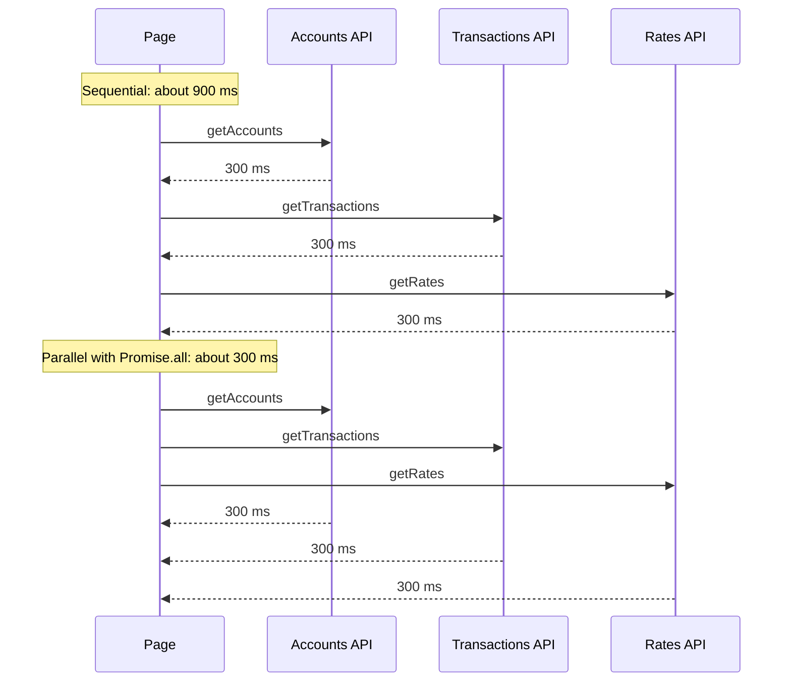

```tsx
// Before: sequential
const accounts = await getAccounts(userId);
const transactions = await getTransactions(userId);
const rates = await getRates();

// After: start all, then await together
const [accounts, transactions, rates] = await Promise.all([
  getAccounts(userId),
  getTransactions(userId),
  getRates(),
]);
```

When one call depends on another (you need `user.id` first), start the independent ones before awaiting the dependent one, or push each into its own Suspense-wrapped component so they render in parallel and stream independently. Use React `cache()` to deduplicate the same call made from several components in one request.

To find waterfalls: look at a trace (OpenTelemetry spans for each fetch appear as a staircase), or add timing logs around awaits.

**Pros:** Often the biggest TTFB win for the least code.

**Cons / limits:** `Promise.all` fails fast: one rejection rejects all. Use `Promise.allSettled` when partial data is acceptable. Parallel calls increase peak load on downstream services.

**Use it when / avoid when:** Use it whenever traces show a staircase of independent calls. Avoid parallelizing calls that really depend on each other.

### RSC payload size and hydration cost

**What it is:** The **RSC payload** is the serialized output of server components that Next.js sends to the browser (inline in the HTML on first load, and as a separate fetch on client navigation). **Hydration** is React attaching event handlers to the server-rendered HTML for every client component. Both scale with what you pass across the server-to-client boundary.

**Why it's used:** If a server component passes the full list of 10,000 transactions as props to a `'use client'` table, that data is serialized into the payload (often twice: once as HTML, once as RSC data), downloaded, parsed and hydrated. A page can be fast on the server and still slow in the browser.

**How it works:**
- Find big payloads: in the Network panel, filter by `?_rsc=` (or the `RSC` request header) on client navigations and check sizes. On the first load, view source and search for the `self.__next_f.push` script chunks; their size is the inline payload.
- Find hydration cost: Performance panel, record and reload, look for a long task early in load under React's hydrate work. React Performance Tracks (React 19.2+) label these phases.
- Count client components: search the code for `'use client'`. A `'use client'` at the top of a layout makes everything it imports a client component.

Fixes:
- Pass only what the client component needs (ids and display fields, not full records). Paginate on the server.
- Push `'use client'` down to the leaves: the table body can stay a server component while only the sort header and row menu are client components.
- Pass server components as `children` into client components instead of importing them inside.

**Pros:** Smaller payloads help every device and both first load and navigation.

**Cons / limits:** Splitting components along the client boundary makes the code structure less obvious. Some libraries force client components.

**Use it when / avoid when:** Use it when the server is fast but LCP or TBT is high, or when client navigations are slow. Avoid passing whole API responses through as props.

### Cache misses after deploy

**What it is:** A deploy can empty caches: the Next.js data cache and full route cache (stored per deployment on many platforms), CDN caches keyed on build IDs, your Redis cache if keys include a version, and the JS assets cached in users' browsers (new hashes mean new downloads).

**Why it's used:** "It's slow for 20 minutes after every deploy" is a classic symptom. The first requests after a deploy all miss and hit the origin and database at once (a **cache stampede**).

**How it works:**
- Check CDN cache headers on responses: `x-vercel-cache: MISS/HIT/STALE`, `cf-cache-status`, `x-cache` for CloudFront, `age`.
- Graph the cache hit ratio and database QPS around the deploy time. A dip in hit ratio and spike in DB load confirms it.
- Look at ISR settings: `revalidate` values, on-demand `revalidateTag` calls, and whether your platform keeps the cache across deployments.

Fixes: warm critical routes after deploy (a script that requests the top 50 URLs), use stale-while-revalidate so a miss returns stale content and refreshes in the background, coalesce concurrent misses (single-flight), and avoid version-prefixed cache keys unless the data shape changed.

**Pros:** Fixes are cheap and the symptom is easy to confirm.

**Cons / limits:** Warming adds deploy time. Serving stale data must be acceptable for that data (fine for exchange rates with a timestamp, not for a balance right after a transfer).

**Use it when / avoid when:** Suspect it whenever slowness correlates with deploys and fades on its own.

### Middleware (proxy) latency

**What it is:** Next.js middleware runs before every matched request: auth checks, redirects, A/B tests, geolocation. In Next.js 16 the file convention is renamed from `middleware.ts` to `proxy.ts` (with Node.js runtime by default); the role is the same.

**Why it's used:** Anything slow here is added to every page and often every asset request that matches. A middleware that calls an auth API or a feature-flag service on each request can add 100 to 300 ms to every navigation.

**How it works:**
- Check the `matcher` config. Without one, middleware runs for static files and images too.
- Time it: add a `Server-Timing` header from middleware, or look for its span in your traces.
- Avoid network calls inside it. Verify JWTs locally with a cached JWKS (for example with `jose`) instead of calling the identity provider. Read flags from a fast edge config or cookie.

```ts
// proxy.ts (middleware.ts before Next.js 16)
export const config = {
  matcher: ['/((?!_next/static|_next/image|favicon.ico|api/health).*)'],
};
```

**Pros:** Fixing it speeds up every request.

**Cons / limits:** Local JWT verification cannot see revoked sessions immediately; keep tokens short-lived.

**Use it when / avoid when:** Suspect it when every route has a similar extra delay, including simple pages.

### Cold starts on serverless

**What it is:** On serverless platforms, a new function instance must start (load the runtime, your bundle and dependencies, open DB connections) before handling its first request. That first request is slower: often hundreds of milliseconds, sometimes seconds for large bundles.

**Why it's used:** It explains "p50 is fine, p99 is terrible" and "first request in the morning is slow" and "low-traffic regions are slow".

**How it works:**
- In traces, cold starts appear as a gap before your first span, or as an `init` span (AWS Lambda reports `Init Duration` in its logs).
- Log a module-level flag: `let warm = false;` set it in the handler, and tag the trace with `cold_start: true` on the first call.
- Reduce cost: smaller server bundles (avoid importing a whole SDK), lazy-import rarely used libraries, reuse DB connections across invocations through a pooler (RDS Proxy, PgBouncer, Prisma Accelerate or similar), and platform features such as provisioned concurrency or Vercel's Fluid compute that keep instances warm and reuse them across requests (hedge: details vary by platform and plan).

**Pros:** Scale-to-zero saves money for spiky traffic.

**Cons / limits:** Keeping instances warm costs money. Each instance opening its own DB connections can exhaust the database at scale.

**Use it when / avoid when:** Suspect it for tail latency on low-traffic routes. It is rarely the cause of consistently slow p50.

### Image and font issues

**What it is:** The LCP element is often an image (hero banner, logo, chart screenshot) or a large block of text that waits for a web font.

**Why it's used:** A 1.5 MB uncompressed hero image or a lazily loaded LCP image can add seconds to LCP even when the server is fast.

**How it works:**
- Performance panel, LCP insight or the **LCP by phase** breakdown: TTFB, load delay, load duration, render delay. A long **load delay** means the browser found the image late (CSS background, client-rendered, or `loading="lazy"`).
- Fixes: use `next/image` with correct `sizes`, add `priority` (or `preload` and `fetchPriority="high"` in newer versions; check your version's API) to the LCP image only, never lazy-load it, and give width and height to avoid CLS.
- Fonts: `next/font` self-hosts and preloads fonts and generates a size-adjusted fallback to reduce layout shift. Check the Network panel for fonts loaded from third-party domains late in the waterfall.

**Pros:** Large LCP wins with small changes.

**Cons / limits:** Marking many images as high priority defeats the purpose.

**Use it when / avoid when:** Use it when LCP is high but TTFB is fine.

### Reading `next build` output

**What it is:** At the end of `next build`, Next.js prints every route with a symbol: `○` static, `◐` partial prerender (static shell with dynamic holes), `ƒ` dynamic (server-rendered on demand). Older versions also printed per-route size and "First Load JS" columns; Next.js 16 removed those size columns because they were misleading with Server Components (hedge: check your version).

**Why it's used:** It shows when a change accidentally turned a static route into a dynamic one, which increases TTFB and server cost.

**How it works:** Save the build output in CI and diff it between the main branch and the pull request. If `/pricing` changes from `○` to `ƒ`, find the new dynamic API use (`cookies()`, `headers()`, `searchParams`, uncached fetch). For bundle size, use the analyzer or a size-limit check instead of the build table.

**Pros:** Free, every build.

**Cons / limits:** Coarse. It says a route is dynamic, not why.

**Use it when / avoid when:** Use it in every PR review for routes that should be static.

### OpenTelemetry with `instrumentation.ts`

**What it is:** Next.js calls the `register()` function exported from `instrumentation.ts` (in the project root or `src/`) once when a server instance starts. You use it to start OpenTelemetry. Next.js then emits spans for incoming requests, route rendering, `fetch` calls and more, and you can add your own.

**Why it's used:** It turns "the dashboard is slow" into a trace showing that 4.2 s of a 4.5 s request was one `fetch` to the accounts service.

**How it works:**

```ts
// instrumentation.ts
import { registerOTel } from '@vercel/otel';

export function register() {
  registerOTel({ serviceName: 'web-dashboard' });
}
```

```ts
// Custom span around business logic
import { trace } from '@opentelemetry/api';

const tracer = trace.getTracer('web-dashboard');

export async function getPortfolio(userId: string) {
  return tracer.startActiveSpan('getPortfolio', async (span) => {
    try {
      span.setAttribute('user.id', userId);
      return await loadPortfolio(userId);
    } finally {
      span.end();
    }
  });
}
```

Set the exporter with standard environment variables (`OTEL_EXPORTER_OTLP_ENDPOINT`) to send to Datadog, Honeycomb, Grafana Tempo, Jaeger or any OTLP-compatible backend. `NEXT_OTEL_VERBOSE=1` makes Next.js emit more detailed spans. If the backend services are also instrumented, the trace context propagates through `fetch` headers and you get one trace across the whole stack.

**Pros:** Vendor-neutral, one trace from the Next.js server to the database.

**Cons / limits:** Spans cost money at high volume; use sampling. Edge runtime support is more limited than Node.

**Use it when / avoid when:** Set it up before you need it. Trying to add tracing during an incident is too late.

#### Q: [Senior] The dashboard has a 6-second TTFB in production, but locally it's around 400 ms. What do you check?

**Short answer:** Local and production differ in data size, network distance to dependencies, caching and cold starts. I would get a production trace of a slow request to see where the 6 seconds go, check whether the route is dynamic and whether its data calls run in series, and compare database and API latency from the production region. The most common causes are a server component waterfall against slower production dependencies, a slow query on production-sized data, and missing caches.

**Clarify first:**
- Is it 6 s for every request or only some (first request, certain users)?
- Where does production run relative to the database and APIs (same region or not)?
- Is the local environment using mocked or small data?

**Diagnose:**
1. Check the response headers in the browser: `Server-Timing`, `x-vercel-cache` or equivalent. Confirm the 6 s is server time, not network (compare Network panel "Waiting for server response" with the trace duration).
2. Open a slow trace in the APM tool. Look at the shape:
   - A **staircase** of fetch spans one after another: a waterfall.
   - One **long DB span**: slow query on production data size.
   - A **gap before the first span**: cold start or queueing.
   - Many short repeated spans: N+1.
3. Check the build output: is `/dashboard` `ƒ` (dynamic)? Should it be?
4. Check region: run a quick `curl -w "%{time_total}\n"` against the dependency from a production shell or a function in the same region.
5. If no tracing exists, add `Server-Timing` or temporary timing logs around each `await` and deploy to a staging environment with production-like data.

**Solution:**

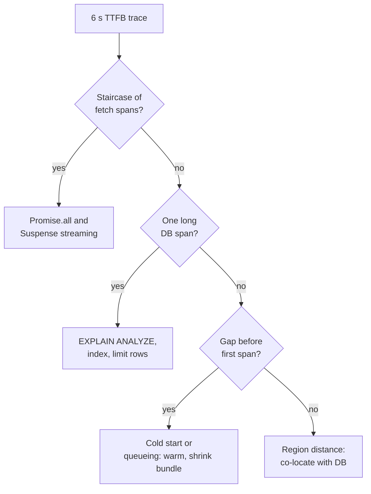

Example: the trace showed `getUser` 200 ms, then `getAccounts` 900 ms, then `getHoldings` 2.4 s, then `getRates` 1.8 s, all sequential, and the server ran in a different region from the database (about 80 ms per query round trip in production vs 1 ms locally). Fixes: run the three independent calls in parallel, wrap holdings in Suspense to stream it, cache rates for 60 s with `'use cache'` and `cacheLife`, and move the function region next to the database. TTFB dropped to about 300 ms for the shell; holdings streamed in at about 1.5 s.

**Trade-offs:** Streaming improves perceived speed but the slow part is still slow; fix the query too. Caching rates means they can be up to 60 s old; show an "as of" timestamp. Moving regions can increase latency for users far from the new region; a CDN for static assets helps.

**What interviewers listen for:**
- "Locally fast, production slow" makes you think of data size, region and caching, not code.
- You read trace shapes.
- You know Next.js specifics: dynamic rendering, streaming, `Promise.all`.
- Red flag: "add more servers". More servers do not fix a waterfall.

#### Q: [Mid] After a deploy, the console shows "Hydration failed because the server rendered HTML didn't match the client" and the balance card visibly jumps. How do you find and fix it?

**Short answer:** A hydration mismatch means the HTML the server rendered differs from what the client renders on first pass, so React patches or re-renders that part, which causes extra work and layout shift. I'd read the diff React logs in development, find the non-deterministic value (dates, time zones, `Math.random`, `window` checks, locale formatting), and make the first client render match the server.

**Clarify first:**
- Did the deploy change formatting, time zones or a library version?
- Is it on every page load or only for some users (locale, time zone)?
- Is there a browser extension involved? Extensions that modify the DOM cause mismatches too.

**Diagnose:**
1. Reproduce in development: React 19 logs a diff showing the server value and client value for the mismatched element.
2. Common sources in finance UIs: `new Date().toLocaleString()` (server in UTC, browser in user time zone), `Intl.NumberFormat` without an explicit locale, `typeof window !== 'undefined'` branches, reading `localStorage` during render, random ids instead of `useId`.
3. For layout shift, use the Performance panel's **Layout shifts** track or the CLS insight, which lists the shifted elements. Field CLS attribution from `web-vitals` gives the largest shift target.

**Solution:**

```tsx
// Bad: server formats in UTC and en-US, client in the user's locale and zone
<span>{new Date(tx.postedAt).toLocaleString()}</span>

// Good: format deterministically with explicit locale and time zone
const fmt = new Intl.DateTimeFormat('en-GB', { timeZone: user.timeZone, dateStyle: 'medium', timeStyle: 'short' });
<span>{fmt.format(new Date(tx.postedAt))}</span>
```

For values that can only be known in the browser, render a stable placeholder first and fill it in after mount, reserving space so nothing shifts:

```tsx
'use client';
import { useEffect, useState } from 'react';

export function LocalTime({ iso }: { iso: string }) {
  const [text, setText] = useState<string | null>(null);
  useEffect(() => setText(new Date(iso).toLocaleTimeString()), [iso]);
  return <span style={{ display: 'inline-block', minWidth: '8ch' }}>{text ?? ' '}</span>;
}
```

Use `suppressHydrationWarning` only for a single text node you know will differ (like a timestamp), not to hide real bugs.

**Trade-offs:** Client-only rendering of a value adds a tiny delay and must reserve space. Passing the user's time zone to the server needs a cookie or profile setting.

**What interviewers listen for:**
- You know the causes of mismatch, especially dates and locales.
- You connect the mismatch to CLS and extra rendering cost.
- Red flag: sprinkling `suppressHydrationWarning` or disabling SSR for the whole page.

#### Q: [Mid] In a pull request, the `next build` output shows `/statements` changed from `○` (static) to `ƒ` (dynamic). Why does it matter and how do you find what caused it?

**Short answer:** A static route is rendered once and served from cache; a dynamic route renders on every request, so TTFB and server cost go up. Something in the change started reading request-time data. I'd look at the diff for `cookies()`, `headers()`, `searchParams`, uncached `fetch`, or a new import that does one of those, and move it behind a Suspense boundary or into a client component.

**Clarify first:**
- Should this route be static at all? If it shows per-user data, dynamic may be correct.
- Which files changed in the route's tree, including shared layouts and imported helpers?

**Diagnose:**
1. Search the diff for dynamic APIs. Check shared helpers: a new `getLocale()` that reads `headers()` makes every route that calls it dynamic.
2. Look at layouts. A `cookies()` call in the root layout makes every route under it dynamic.
3. With Cache Components enabled, the build errors or warns with the location of uncached data accessed outside Suspense, which points straight at the cause.

**Solution:** Move the dynamic read into a small component inside `<Suspense>`, so the rest stays in the static shell; or read the value on the client (theme, locale preference from a cookie); or cache the data with `'use cache'` if it is not per-user. Add a CI check that diffs the build route table and fails if listed routes become dynamic.

**Trade-offs:** Keeping routes static sometimes means a small client-side flash for personalized bits. That is usually better than making the whole page wait.

**What interviewers listen for:**
- You know which APIs opt into dynamic rendering, including from layouts and helpers.
- You think of a CI guard, not only the fix.

## 4. Backend, Node and database diagnosis

### APM and distributed tracing: reading a trace

**What it is:** APM (application performance monitoring) tools such as Datadog APM, New Relic, Honeycomb, Grafana Tempo or Jaeger collect **traces**. A trace is one request's journey; each step is a **span** with a start time, duration, service name and attributes. OpenTelemetry is the vendor-neutral standard for producing them.

**Why it's used:** Logs tell you that a request was slow. A trace tells you which step was slow, in which service, and whether steps ran in series or in parallel.

**How it works:** Reading a trace (flame or waterfall view):

1. Find the **root span** (for example `GET /api/transactions`, 3.1 s).
2. Look for the **widest child**. That is where the time went.
3. Look at **gaps**: time in the parent not covered by any child is your own code running (CPU) or waiting on something not instrumented.
4. Look at **shape**: a staircase means sequential calls; 200 identical thin spans means N+1; one long `pg.query` means a slow query; a long `pool.connect` or "acquire connection" span means pool exhaustion.
5. Read **attributes**: SQL text, HTTP status, retry count, row count, tenant id.

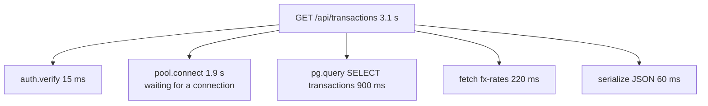

Instrument Node with the OpenTelemetry Node SDK and auto-instrumentations (HTTP, Express or Nest, `pg`, `ioredis`, Prisma has its own instrumentation), or with a vendor agent such as `dd-trace`. The agent must load before other modules: for example `node --import ./otel.mjs server.js` or `require('dd-trace').init()` as the first line.

**Pros:** The fastest way to locate backend latency. Works across services.

**Cons / limits:** Sampling may drop the one slow trace you need; use tail-based sampling or always keep slow and error traces. Uninstrumented work shows as gaps.

**Use it when / avoid when:** Use it for any backend latency question. It will not show browser main-thread problems.

### Event-loop lag

**What it is:** Node runs your JavaScript on one main thread. If one piece of code runs for 200 ms (parsing a huge JSON, a sync crypto call, a big loop), every other request waits. The delay between when a timer should fire and when it actually fires is **event-loop lag**.

**Why it's used:** When every endpoint gets slow at the same time, including `/health`, and the database is fine, the event loop is blocked.

**How it works:**

```ts
import { monitorEventLoopDelay } from 'node:perf_hooks';

const h = monitorEventLoopDelay({ resolution: 20 });
h.enable();

setInterval(() => {
  // Values are in nanoseconds
  metrics.gauge('node.eventloop.p99_ms', h.percentile(99) / 1e6);
  metrics.gauge('node.eventloop.max_ms', h.max / 1e6);
  h.reset();
}, 10_000);
```

Healthy is a p99 of a few milliseconds to tens of milliseconds. Hundreds of milliseconds means blocking work. Most APM agents also report event-loop metrics.

**Pros:** Cheap, always-on, clear signal.

**Cons / limits:** Tells you that the loop is blocked, not by what. Use a CPU profile next.

**Use it when / avoid when:** Alert on it for every Node service.

### CPU profiling: --cpu-prof, clinic.js, 0x

**What it is:** A CPU profiler samples the call stack many times per second and shows which functions use the most CPU, usually as a flame graph.

**Why it's used:** To find what is blocking the event loop or burning 100% CPU.

**How it works:**
- `node --cpu-prof server.js` writes a `.cpuprofile` file when the process exits (use `--cpu-prof-dir`). Open it in Chrome DevTools (Performance panel, load profile) or speedscope.
- `node --inspect server.js`, then open `chrome://inspect`, click **inspect**, and use the **Performance** (or Profiler) tab to record while you send load. In production, only enable the inspector on a private port, through an SSH tunnel.
- `clinic doctor -- node server.js` runs your app and suggests whether the problem is CPU, I/O or the event loop; `clinic flame` produces a flame graph. Note: clinic.js maintenance has slowed, so check it works with your Node version.
- `npx 0x server.js` produces an interactive flame graph.
- Many APMs offer a continuous profiler (for example Datadog Continuous Profiler) that profiles production with low overhead.

In a flame graph, width is CPU time. Look for wide plateaus at the top: that is the function actually burning CPU. Typical findings: `JSON.parse`/`JSON.stringify` of large payloads, regular expressions with catastrophic backtracking, `bcrypt` sync calls, sorting large arrays per request, a logger serializing big objects.

**Pros:** Precise. Shows the function, not a guess.

**Cons / limits:** You need load during the recording. Profilers add some overhead.

**Use it when / avoid when:** Use it when CPU is high or event-loop lag is high. Not useful when the service is idle and waiting on I/O.

### Memory leaks in Node

**What it is:** Memory that grows with time or traffic and is never freed: a module-level cache without a size limit, listeners added per request, closures holding request objects, unbounded queues.

**Why it's used:** A leaking service slows down as garbage collection works harder, then crashes with `JavaScript heap out of memory` or gets OOM-killed by the container, often at night or at peak.

**How it works:**
1. Graph RSS and heap used per instance over days. A sawtooth with a flat floor is healthy; a rising floor that resets at each restart is a leak.
2. Take heap snapshots from the running process: `node --heapsnapshot-signal=SIGUSR2 server.js`, then `kill -USR2 <pid>`, or call `v8.writeHeapSnapshot()` from an admin endpoint, or connect with `--inspect` and use the Memory tab.
3. Take one snapshot, send traffic for 10 minutes, take another. Load both in Chrome DevTools Memory and use **Comparison**. Follow retainers to your code.
4. Common Node finding: `Map` in a module used as a cache with no eviction; use an LRU with a max size.

**Pros:** Same tooling as the browser.

**Cons / limits:** Snapshots pause the process and need memory roughly equal to the heap size. Take them on an instance removed from the load balancer.

**Use it when / avoid when:** Use it when memory rises steadily. Restarting on a schedule hides the bug; use it only as a temporary measure.

### GC pauses

**What it is:** V8's garbage collector pauses JavaScript to clean memory. Short pauses are normal. Long or frequent major GCs (mark-compact) cause latency spikes.

**Why it's used:** It explains p99 spikes that do not match slow queries, especially in services allocating lots of short-lived objects or close to their heap limit.

**How it works:** `node --trace-gc` logs every collection with duration. Programmatically, observe `gc` entries with `PerformanceObserver` from `node:perf_hooks`. APM runtime metrics usually include GC pause time. Fixes: allocate less per request (stream large responses instead of building giant arrays), fix leaks, and set `--max-old-space-size` to fit the container memory.

**Pros:** Explains mysterious tail latency.

**Cons / limits:** Rarely the root cause on its own; usually a symptom of too much allocation or a leak.

**Use it when / avoid when:** Check it when p99 spikes look periodic and unrelated to dependencies.

### Connection pool exhaustion

**What it is:** Apps keep a pool of database connections (for example `pg.Pool` with `max: 10`, or Prisma's pool). If all connections are busy, new queries wait in a queue. If they wait too long, they time out.

**Why it's used:** It looks like "the database is slow", but the database is idle; the app is waiting for a connection. Causes: slow queries holding connections, long transactions, leaked connections not released, too many serverless instances each with their own pool, or a pool that is too small for the traffic.

**How it works:**
- Signals: traces show long "acquire connection" or `pool.connect` spans; errors like "timeout exceeded when trying to connect" (pg) or "Timed out fetching a new connection from the connection pool" (Prisma, P2024).
- Metrics: `pool.totalCount`, `pool.idleCount`, `pool.waitingCount` for `pg`; database-side, `SELECT state, count(*) FROM pg_stat_activity GROUP BY state;` and watch for many `idle in transaction`.
- Fixes: shorten what holds connections (faster queries, no network calls inside a transaction), always release in `finally`, size pools so that `instances x pool size` stays below the database's `max_connections`, and use a pooler (PgBouncer, RDS Proxy) for serverless.

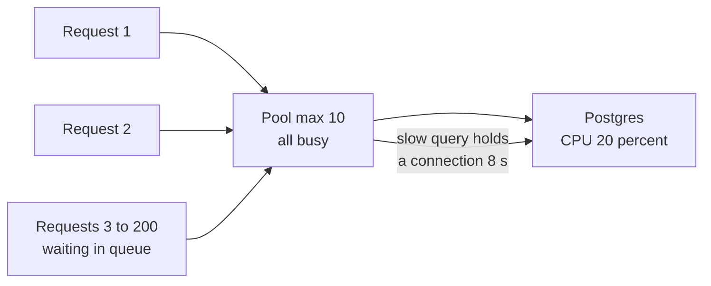

**Pros:** Easy to confirm with metrics once you know to look.

**Cons / limits:** Raising the pool size can just move the bottleneck to the database.

**Use it when / avoid when:** Suspect it when latency spikes but DB CPU is low, and errors mention connection timeouts.

### N+1 queries

**What it is:** Loading a list with one query, then running one more query per item: 1 query for 50 accounts, then 50 queries for each account's balance. Total: 51 queries.

**Why it's used:** It is fast with 5 test rows and slow with 500 production rows. Each query is quick, so slow-query logs do not show it; the trace shows dozens of identical thin spans.

**How it works:** Detect with traces (repeated spans), Prisma query logging, or by counting queries per request. Fix with a join, an `IN (...)` query, Prisma `include`/`select` (which batches relations), or a DataLoader for GraphQL resolvers.

```ts
// Prisma: log every query with its duration
const prisma = new PrismaClient({ log: [{ emit: 'event', level: 'query' }] });
prisma.$on('query', (e) => {
  if (e.duration > 50) logger.warn({ ms: e.duration, query: e.query }, 'slow query');
});

// N+1
const accounts = await prisma.account.findMany({ where: { userId } });
for (const a of accounts) {
  a.balance = await prisma.ledgerEntry.aggregate({ where: { accountId: a.id }, _sum: { amountCents: true } });
}

// Fixed: one grouped query
const sums = await prisma.ledgerEntry.groupBy({
  by: ['accountId'],
  where: { accountId: { in: accounts.map((a) => a.id) } },
  _sum: { amountCents: true },
});
```

**Pros:** Huge wins, often 10x to 50x on list endpoints.

**Cons / limits:** Eager loading everything can over-fetch. Load only what the endpoint returns.

**Use it when / avoid when:** Check for it on every list endpoint whose latency grows with the number of rows.

### Slow queries: pg_stat_statements and EXPLAIN ANALYZE

**What it is:** `pg_stat_statements` is a Postgres extension that aggregates statistics for every normalized query: number of calls, total and mean execution time, rows. `EXPLAIN ANALYZE` runs one query and shows the actual plan with timings per step.

**Why it's used:** First find which queries cost the most in total, then find out why one is slow.

**How it works:**

```sql
-- Top queries by total time (Postgres 13+ column names)
SELECT calls, round(total_exec_time) AS total_ms, round(mean_exec_time, 1) AS mean_ms, rows, query
FROM pg_stat_statements
ORDER BY total_exec_time DESC
LIMIT 10;

-- Why is this one slow?
EXPLAIN (ANALYZE, BUFFERS)
SELECT id, amount_cents, posted_at
FROM transactions
WHERE account_id = $1 AND posted_at >= now() - interval '90 days'
ORDER BY posted_at DESC
LIMIT 50;
```

Reading the plan: look for `Seq Scan` on a big table where you expected an index, a large gap between estimated `rows` and actual rows (stale statistics, run `ANALYZE`), `Sort` with `external merge Disk` (not enough `work_mem` or a missing index for the order), and high `Buffers: shared read` (data not in memory). A composite index matching the filter and sort fixes the example: `CREATE INDEX CONCURRENTLY ON transactions (account_id, posted_at DESC);`

`EXPLAIN ANALYZE` actually executes the query. Do not run it on `UPDATE`/`DELETE` in production without wrapping in a transaction you roll back. Managed tools (RDS Performance Insights, Datadog DBM, pganalyze) show the same data with history.

**Pros:** Precise and free.

**Cons / limits:** Plans depend on parameters; test with a big account's id, not a small one. Indexes speed reads but slow writes.

**Use it when / avoid when:** Use it whenever a DB span dominates a trace.

### External API latency

**What it is:** Calls to other services (payment provider, FX rates, KYC, your own microservices) that your request waits on.

**Why it's used:** A third party going from 100 ms to 5 s can take your service down if every request waits on it, ties up connections and retries aggressively.

**How it works:** Each outbound call gets a span with the host and status. Track p95 per dependency. Defend with timeouts on every call (`AbortSignal.timeout(2000)` with `fetch`), retries only for safe and idempotent calls with backoff and jitter, circuit breakers, caching where data allows, and moving non-critical calls off the request path (queue them).

**Pros:** Makes your latency independent of others' bad days.

**Cons / limits:** Timeouts and fallbacks need product decisions (what to show without FX rates).

**Use it when / avoid when:** Use timeouts always. Retries never for non-idempotent payment calls without an idempotency key.

### Load testing to reproduce: k6 and autocannon

**What it is:** Tools that send controlled traffic to reproduce performance problems before or after a fix. **k6** scripts realistic scenarios in JavaScript with thresholds; **autocannon** is a quick HTTP benchmarking CLI for Node.

**Why it's used:** Many problems only appear under concurrency: pool exhaustion, lock contention, event-loop blocking. You need to reproduce them in staging to prove a fix.

**How it works:**

```js
// k6 script: ramp to 200 virtual users and fail if p95 exceeds 500 ms
import http from 'k6/http';
import { check, sleep } from 'k6';

export const options = {
  stages: [
    { duration: '2m', target: 200 },
    { duration: '5m', target: 200 },
    { duration: '1m', target: 0 },
  ],
  thresholds: { http_req_duration: ['p(95)<500'], http_req_failed: ['rate<0.01'] },
};

export default function () {
  const res = http.get(`${__ENV.BASE_URL}/api/transactions?accountId=${__ENV.BIG_ACCOUNT}`, {
    headers: { Authorization: `Bearer ${__ENV.TOKEN}` },
  });
  check(res, { 'status 200': (r) => r.status === 200 });
  sleep(1);
}
```

```bash
npx autocannon -c 100 -d 30 http://localhost:3000/api/health
```

**Pros:** Reproducible, measurable, gates releases.

**Cons / limits:** Unrealistic data or traffic mixes give false comfort. Never load test production or third parties without agreement.

**Use it when / avoid when:** Use it to reproduce concurrency problems and to verify capacity before known peaks (month-end, market open).

#### Q: [Senior] After Tuesday's release, p95 of `GET /api/transactions` jumped from 200 ms to 3 s. p50 barely moved. What do you do?

**Short answer:** First I limit the damage: if the release is the clear cause and rollback is safe, roll back or turn off the flag. Then I compare slow traces before and after the release to see which span grew, and look at what changed in the diff for that path. A p95-only jump points to something that affects a subset: big accounts, a new query without an index, a new external call, or pool waiting under load.

**Clarify first:**
- Does the timing line up exactly with the deploy? Any migration in the release?
- Error rate changed too? Throughput?
- Is the release behind a flag?

**Diagnose:**
1. APM: overlay the deploy marker on p95. Open 5 slow traces after the deploy and 5 normal ones before. Compare spans side by side.
2. Example finding: new span `pg.query SELECT ... FROM ledger_entries WHERE account_id = $1 ORDER BY created_at` of 2.6 s, only for accounts with more than 50k entries.
3. `pg_stat_statements`: the new query is first by total time. `EXPLAIN (ANALYZE, BUFFERS)` with a big account id: `Seq Scan` and `Sort Method: external merge Disk`.
4. Check the migration: the release added a column and sort order, but no index.
5. Check side effects: pool `waitingCount` also rose, because slow queries hold connections, which slows other endpoints too.

**Solution:** Roll back or disable the flag to recover. Then add the index concurrently (`CREATE INDEX CONCURRENTLY ON ledger_entries (account_id, created_at DESC);`), make sure the endpoint paginates (keyset pagination with `LIMIT`), re-run `EXPLAIN ANALYZE` to confirm an `Index Scan`, and load test with a big account in staging before re-releasing.

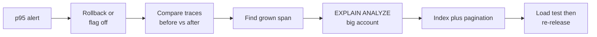

**Trade-offs:** Rolling back loses the feature temporarily; that is usually right for a user-facing latency regression. `CREATE INDEX CONCURRENTLY` is slower and cannot run inside a transaction, but it does not block writes.

**What interviewers listen for:**
- Mitigate first, investigate second.
- Before/after trace comparison.
- Testing with large accounts, not average ones.
- Red flag: "increase the instance size" before knowing the cause.

#### Q: [Senior] One Node API process sits at 100% CPU and all its endpoints slow down, including `/health`. Database metrics look normal. How do you find the cause?

**Short answer:** All endpoints slowing together, with a healthy database, means the event loop is blocked by CPU work in our process. I'd confirm with event-loop lag metrics, take a CPU profile under real traffic, and look for the wide plateau in the flame graph. Typical causes are large JSON serialization, a bad regex, sync crypto or compression, or sorting and mapping big arrays per request.

**Clarify first:**
- One instance or all? Started at a deploy, or with a traffic pattern or a specific customer?
- Does CPU stay at 100% with no traffic (a runaway loop) or only under load?

**Diagnose:**
1. Check event-loop p99 lag: hundreds of ms confirms blocking.
2. Find the trigger: correlate the CPU spike with request logs. Which endpoint and which parameters were being called? A single request for `?limit=100000` can block the loop for seconds.
3. Profile: on a canary instance taken out of the load balancer, or with the APM continuous profiler, record a CPU profile. Locally, `node --cpu-prof` while replaying the suspect request with autocannon.
4. Read the flame graph: a wide plateau in `JSON.stringify` under `res.json` means huge responses; `RegExp` in a validation function means catastrophic backtracking; `pbkdf2Sync` or `zlib.gzipSync` means sync crypto or compression.

**Solution:** Depends on the finding: cap `limit` and paginate; stream big responses; replace the vulnerable regex (or use a linear-time engine such as `re2`); use the async versions of crypto and zlib (they run on the libuv thread pool); move heavy CPU work (PDF statements, CSV exports) to a worker thread or a background job. Add event-loop lag alerts and a request-size limit.

```ts
// Move CPU-heavy work off the event loop
import { Worker } from 'node:worker_threads';

export function renderStatementPdf(input: StatementInput): Promise<Buffer> {
  return new Promise((resolve, reject) => {
    const worker = new Worker(new URL('./statement-worker.js', import.meta.url), { workerData: input });
    worker.once('message', resolve);
    worker.once('error', reject);
  });
}
```

**Trade-offs:** Worker threads add complexity and memory; a job queue adds latency but survives restarts and scales separately.

**What interviewers listen for:**
- You know "everything slow including health" means event-loop blocking.
- You profile instead of guessing.
- You find the triggering input.
- Red flag: "Node is single-threaded so just add more instances". That spreads the pain but the slow request still blocks its instance.

#### Q: [Senior] The account page is fast for most customers but takes 15 seconds for a handful of large business accounts. How do you diagnose it?

**Short answer:** That is a data-volume problem: something scales with the account's size. I'd reproduce with one of those accounts (or a synthetic one of the same size) and trace the request end to end, checking for N+1 queries, missing pagination, unindexed sorts, large payloads and heavy client-side rendering. Then I make every layer bounded: paginate, aggregate on the server, and virtualize on the client.

**Clarify first:**
- How large: 500 sub-accounts, 2 million transactions?
- Is the slow part the API, the page render, or both?
- Can we use a real account's data in a safe environment, or do we need a synthetic copy?

**Diagnose:**
1. Tag traces with size (`account.tx_count_bucket`). Filter slow traces by the big accounts.
2. Typical trace shape: 500 thin `SELECT balance` spans (N+1), then a 4 s query sorting all 2 million rows, then 3 s of JSON serialization for a 20 MB response.
3. In the browser: Network panel shows a 20 MB response; Performance panel shows a long `JSON.parse` task and hydration of thousands of rows.
4. `EXPLAIN ANALYZE` the heaviest query with that account id.

**Solution:** Replace N+1 with grouped queries; precompute balances or summaries (a materialized view or a summary table updated on write); paginate with keyset pagination (`WHERE (posted_at, id) < ($1, $2) ORDER BY posted_at DESC, id DESC LIMIT 50`); return only visible fields; virtualize the table; move "export everything" into an async job that emails or notifies when the file is ready.

**Trade-offs:** Summary tables must be kept consistent with the ledger; update them in the same transaction or with an event and accept small lag. Keyset pagination cannot jump to page 400 directly.

**What interviewers listen for:**
- You look for anything unbounded.
- You use a realistic large account to test, and add size to your telemetry.
- Red flag: optimizing for the average account only.

#### Q: [Staff] Every month-end, between 23:00 and 01:00, we get intermittent 504 Gateway Timeouts from the statements and payments APIs. The rest of the month is fine. How do you investigate and prevent it?

**Short answer:** A 504 means the load balancer or gateway gave up waiting for our service. Month-end means a predictable traffic and batch-job peak: statement generation, interest calculation, reconciliation, plus users checking balances. I'd line up traffic, batch job schedules, DB load, pool usage and lock waits for that window, find which resource saturates first, then separate batch work from interactive traffic and load test the peak before the next month-end.

**Clarify first:**
- What runs at month-end: statement batch, interest accrual, exports, partner file uploads?
- Timeouts at each layer: load balancer idle timeout, app server timeout, DB statement timeout?
- Do batch jobs share the same database and service instances as user traffic?

**Diagnose:**
1. Build one timeline for last month-end: request rate, p95, 504 count, CPU, event-loop lag, pool waiting count, DB CPU, DB active connections, lock waits, and batch job start and end times.
2. In Postgres during the window: `pg_stat_activity` for long-running queries and `wait_event_type = 'Lock'`; `pg_locks` joined to find blockers. Batch jobs that update many rows in one transaction often block user writes.
3. Traces of failed requests: are they waiting on `pool.connect`, on a lock, or on an external provider?
4. Check that timeouts are ordered correctly: the gateway timeout should be longer than the app's request timeout, which should be longer than the DB statement timeout. Otherwise the gateway returns 504 while the app keeps working and holding resources.

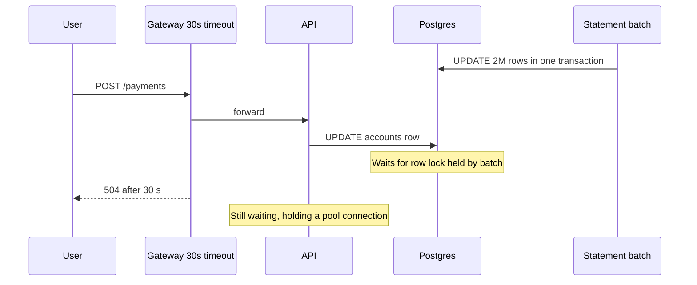

**Solution:**
- Batch in small chunks (1,000 rows per transaction) with short transactions, run on a read replica where it only reads, and schedule or throttle it away from the user peak.
- Separate resources: dedicated workers and a separate connection pool, or a separate service for batch work, so it cannot consume the interactive pool.
- Set `statement_timeout` and `lock_timeout` for interactive queries, and a request deadline in the app shorter than the gateway timeout, so requests fail fast with a clear error.
- Scale ahead of the known peak (scheduled scaling).
- Load test the month-end scenario in staging with k6, running the batch at the same time.
- Alert on pool waiting and lock waits, not just on 504s.

**Trade-offs:** Chunked batches take longer overall and need to be restartable (track progress, idempotent chunks). Separate pools need a careful total connection budget.

**What interviewers listen for:**
- You treat month-end as a predictable peak and reproduce it.
- You understand timeout ordering across layers.
- You isolate batch from interactive work.
- Finance angle: payments that timed out at the gateway may have succeeded in the backend; clients must retry with the same idempotency key.

#### Q: [Staff] Database CPU goes to 90% every weekday at 9:00 and the app is slow for about 40 minutes. How do you find what is doing it?

**Short answer:** A daily, time-aligned spike is either a scheduled job or a traffic pattern (everyone logs in at 9). I'd use the database's own statistics to find the top queries by total time during that window, then trace who issues them. The fix is usually an index or a cheaper query for the top statement, caching the hot read, and moving or spreading scheduled work.

**Clarify first:**
- Does traffic also spike at 9? Any cron jobs, report generation, cache expiry at that time?
- Is it the primary or a replica?

**Diagnose:**
1. Use RDS Performance Insights, Datadog DBM, or `pg_stat_statements` snapshots before and after 9:00 to get the queries with the most total time in the window. Look at "load by waits": CPU versus I/O versus locks.
2. Example finding: a dashboard summary query `SELECT sum(amount_cents) ... GROUP BY category` called 40,000 times between 9:00 and 9:40, each scanning 90 days of transactions. Plus a nightly cache with a 24-hour TTL that expires at 9:00 because it was first filled at 9:00.
3. Find the caller with `application_name` in the connection string, query comments (tools such as sqlcommenter add the route to the SQL), or APM traces linked to DB spans.

**Solution:** Index for the query, or precompute the summary into a table updated on write or every few minutes. Add jitter to cache TTLs so they do not all expire at once, and use stale-while-revalidate. Move scheduled reports to a read replica and outside business hours. Add a database CPU alert that links to the top-queries view.

**Trade-offs:** Precomputed summaries are slightly stale; show "updated at". Read replicas have replication lag, so do not read from them right after a write.

**What interviewers listen for:**
- You use database-side statistics, not app guesses.
- You notice synchronized cache expiry as a cause.
- You trace the query back to the caller.

## 5. Network incidents and preventing regressions

### Performance budgets, CI checks and latency alerts

**What it is:** Agreed limits that fail a build or page someone when crossed: bundle size per route, Lighthouse scores or metric thresholds in CI, field Web Vitals targets, and p95 latency SLOs per endpoint.

**Why it's used:** Performance degrades a few kilobytes and milliseconds at a time. Without automatic guards, nobody notices until users complain.

**How it works:**
- **Pre-merge:** size limits on client bundles (`size-limit` or a script over build output), Lighthouse CI (`@lhci/cli`) with assertions on a few key public pages, a build route-table diff for unexpected `ƒ` routes, and a k6 smoke test with thresholds against staging.
- **Post-deploy:** RUM dashboards per release (tag events with the build id), APM p95 per endpoint with deploy markers, automatic canary analysis (compare canary p95 and errors to baseline before full rollout).
- **Alerts:** on symptoms users feel (p95 latency, error rate, field INP and LCP p75) with a sustained window (for example 10 minutes) to avoid noise, plus saturation signals (pool waiting, event-loop lag, DB CPU).

```json
{
  "ci": {
    "collect": { "url": ["http://localhost:3000/login", "http://localhost:3000/pricing"], "numberOfRuns": 3 },
    "assert": {
      "assertions": {
        "largest-contentful-paint": ["error", { "maxNumericValue": 2500 }],
        "total-blocking-time": ["error", { "maxNumericValue": 300 }],
        "cumulative-layout-shift": ["error", { "maxNumericValue": 0.1 }]
      }
    }
  }
}
```

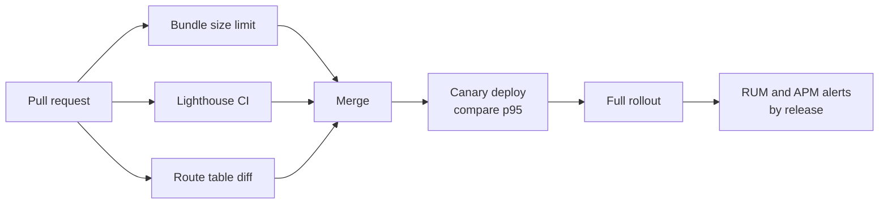

**Pros:** Catches regressions at the cheapest point. Makes performance a shared, visible number.

**Cons / limits:** Lab checks in CI are noisy; use several runs and a median, and set thresholds with headroom. Budgets that always fail get ignored.

**Use it when / avoid when:** Use them on every product with users who care about speed. Start with a few routes and endpoints rather than everything.

#### Q: [Senior] Server metrics look fine (p95 of 120 ms everywhere), but users in Singapore and Sydney say the app takes 5 to 6 seconds to load. Users in London are fine. What's going on?

**Short answer:** The server is fast but far away. Each round trip from Asia to a European origin costs roughly 150 to 300 ms, and a page load needs many: DNS, TCP, TLS, HTML, then JS, then several API calls in series. I'd confirm with RUM split by country and a test from that region, then cut round trips and move content closer: CDN for static assets and cacheable pages, connection reuse, fewer sequential calls, and possibly a regional deployment.

**Clarify first:**
- Where are the origin and the database? Is there a CDN in front of static assets and of HTML?
- What share of users is in Asia-Pacific? Any data residency rules?

**Diagnose:**
1. RUM: TTFB, LCP and resource timings by country. TTFB of 1.2 s in Singapore vs 150 ms in London, with the same server time, is distance.
2. Run WebPageTest (or a synthetic monitor) from a Singapore location and look at the waterfall: count round trips before LCP; check DNS, connect and TLS times; check the `cf-cache-status` or `x-cache` headers to see whether assets are cache hits at the edge.
3. Look for sequential API calls from the client and for redirects (`/` to `/en` to `/login` to `/dashboard`), each a full round trip.

**Solution:** Serve all static assets (and static or ISR pages) from a CDN with long `Cache-Control` for hashed files; make sure the CDN is actually caching (hit ratio per region). Remove redirects. Replace client-side request chains with one server-side fetch near the data, or parallel calls. Use HTTP/2 or HTTP/3 and `preconnect` to API origins. If authenticated API latency is still the problem, deploy the app and a read replica in an Asia-Pacific region, keeping writes in the primary region.

**Trade-offs:** Multi-region adds operational cost, replication lag and data residency questions. Edge caching of personalized pages is risky; cache only public or per-segment content.

**What interviewers listen for:**
- You compare server time with what users see and identify distance.
- You count round trips.
- Red flag: "scale the servers". The servers are not the problem.

#### Q: [Mid] Lighthouse gives our login page a 98, but RUM shows a p75 LCP of 4.2 s. Who is right?

**Short answer:** Both measure different things; the field data describes real users, so it is the one to act on. Lighthouse ran one load on a simulated device with an empty cache and no real data; real users have slower devices and networks, extensions, third-party scripts that load conditionally, redirects from SSO, and personalized content.

**Clarify first:**
- Which segments have the worst LCP: device, country, browser, first visit vs return?
- Do real users arrive via a redirect (for example from an Okta login flow) that Lighthouse skips?

**Diagnose:** Split RUM LCP by device and country. Use the `web-vitals` attribution to get the LCP element and its four phases (TTFB, load delay, load duration, render delay). If TTFB dominates for real users, look at redirects and server time; if load delay dominates, the LCP image or font is discovered late; if render delay dominates, JavaScript is blocking. Then reproduce with matching throttling or WebPageTest from that region.

**Solution:** Fix the phase that dominates in the field, then add the field metric to your dashboards and alerts. Keep Lighthouse in CI as a regression guard, not as proof of user experience.

**Trade-offs:** RUM costs money and needs privacy review; sampling keeps cost down but hides rare segments.

**What interviewers listen for:** You know lab vs field, and you use LCP attribution phases to direct the fix.

#### Q: [Senior] First load of the dashboard is fine, but clicking between tabs (Accounts, Transactions, Statements) takes 2 to 3 seconds each time with nothing happening on screen. How do you diagnose it?

**Short answer:** In the App Router, a client navigation fetches the RSC payload for the new route from the server, so a dynamic route with slow data makes every click wait. With no `loading.tsx` or Suspense boundary, nothing shows until the payload is ready. I'd check the `_rsc` request in the Network panel and its server trace, then add loading states, prefetching and faster or cached data.

**Clarify first:** Are the routes dynamic? Are links rendered with `<Link>` (prefetch) or with `router.push` from buttons? Is there a `loading.tsx`?

**Diagnose:**
1. Network panel, click a tab, find the request with `?_rsc=`. Its "Waiting for server response" is the server time; its size is the payload size.
2. Open its trace: same tools as a slow TTFB (waterfalls, slow queries).
3. Check prefetching: in production, `<Link>` prefetches visible links; dynamic routes are only partially prefetched (up to the nearest loading boundary), so without `loading.tsx` there is nothing to show instantly.
4. Check if a layout above the tabs is re-rendering or refetching on every navigation.

**Solution:** Add `loading.tsx` (or Suspense boundaries) per tab so a skeleton appears immediately; use `<Link>` for tabs; parallelize and cache the data; shrink the payload; and keep shared data in the layout so it is not refetched.

**Trade-offs:** More prefetching means more server requests, some never used. Skeletons improve perception but must not hide slow data forever.

**What interviewers listen for:** You know that RSC navigations hit the server, and you check the `_rsc` request.

#### Q: [Staff] We fixed three performance regressions this quarter, each found by customers. How would you set up the team so regressions are caught before customers notice?

**Short answer:** Make performance measurable at every stage: budgets in CI, canary comparison at deploy, field RUM and APM tagged by release, and alerts on user-facing percentiles with clear owners. Then make it cultural: a performance section in the definition of done, a dashboard reviewed in a weekly ops review, and a blameless write-up for each regression that adds a guard.

**Clarify first:** What telemetry exists today? Who owns which routes and services? How often do we deploy, and can we canary?

**Diagnose:** Review the three regressions: where could each have been caught? Typical answer: a bundle size jump (CI size check), a missing index (staging load test with big accounts, slow-query alert), a waterfall in a new page (trace review or TTFB alert by route).

**Solution:**
- **Budgets:** client JS per route, LCP and TBT in Lighthouse CI for 5 key pages, p95 per critical endpoint (for example `POST /payments` under 500 ms).
- **CI:** size-limit, Lighthouse CI, build route diff, k6 smoke test with thresholds against a seeded large account.
- **Deploy:** canary with automatic rollback when p95 or error rate exceeds the baseline by a margin.
- **Production:** RUM and APM dashboards with release markers, alerts on p75 INP and LCP per key page and p95 per endpoint, plus saturation alerts (event-loop lag, pool waiting, DB CPU). Each alert links to a runbook.
- **Process:** performance owner per area, a monthly review of the slowest pages and endpoints, and a rule that every regression post-mortem adds an automated check.

**Trade-offs:** Too many alerts cause fatigue; start with a few symptom-based alerts. CI checks add minutes to builds. Strict budgets can block urgent features; allow explicit, reviewed exceptions.

**What interviewers listen for:**
- Layered guards: pre-merge, deploy, production.
- Alerts on percentiles users feel, with owners and runbooks.
- Turning each incident into a permanent check.
- Red flag: "we'll do a performance sprint once a quarter".
