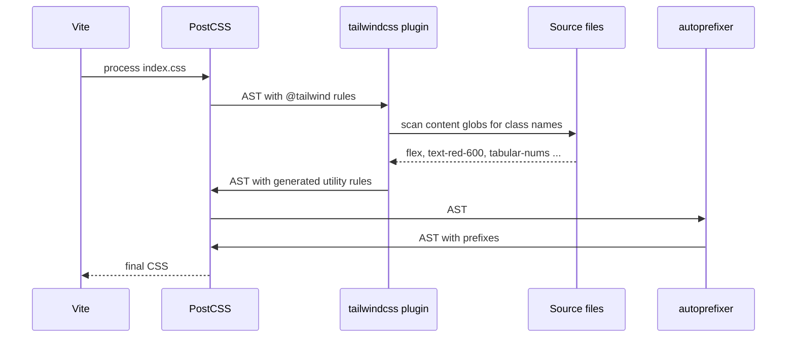
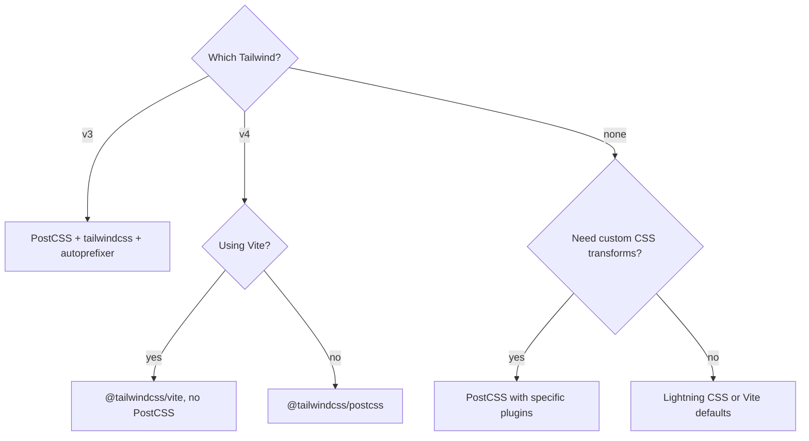

## 1. What it is

**PostCSS is a JavaScript tool that parses CSS into a tree, runs plugins over that tree, and prints CSS back out. Autoprefixer is its most famous plugin: it adds vendor prefixes based on which browsers you support.**

Think of PostCSS as Babel for CSS. On its own it does nothing visible: it reads CSS and writes the same CSS. The value comes from plugins, like apps on a phone. Autoprefixer, Tailwind v3, nesting, minifiers: each is a plugin that edits the tree.

The problem it solves: browsers support CSS features at different times, sometimes behind prefixes like `-webkit-`. Writing those by hand is error-prone and goes stale. PostCSS lets you write modern standard CSS and have tools transform it for your real browser targets, and lets frameworks like Tailwind generate CSS at build time.

## 2. Core concepts

### [Beginner] CSS as an AST

PostCSS turns CSS text into an Abstract Syntax Tree (AST): a tree of objects you can walk and edit in code.

```css
/* input */
.balance { display: flex; user-select: none; }
```

```ts
// Roughly what PostCSS builds (simplified)
const ast = {
  type: 'root',
  nodes: [
    {
      type: 'rule',
      selector: '.balance',
      nodes: [
        { type: 'decl', prop: 'display', value: 'flex' },
        { type: 'decl', prop: 'user-select', value: 'none' },
      ],
    },
  ],
};
```

Node types: `Root`, `Rule` (selector + block), `AtRule` (`@media`, `@tailwind`), `Declaration` (`prop: value`), `Comment`.

> **Why:** Editing CSS with regex breaks on comments, strings, and nesting. A tree lets plugins make precise, safe changes, the same reason Babel and ESLint use ASTs for JS.

### [Beginner] The plugin pipeline


Order matters. Each plugin receives the tree the previous one produced. Autoprefixer usually goes last so it sees the final declarations, including ones Tailwind generated.

```ts
// Running PostCSS by hand to see the pipeline
import postcss from 'postcss';
import autoprefixer from 'autoprefixer';

const result = await postcss([autoprefixer({ overrideBrowserslist: ['safari 12'] })])
  .process('.row { user-select: none; }', { from: 'input.css' });

console.log(result.css);
// .row { -webkit-user-select: none; user-select: none; }
```

### [Beginner] Autoprefixer and browserslist

Autoprefixer looks up each property in the Can I Use database and adds only the prefixes your target browsers need. Targets come from **browserslist**, a shared config also read by Babel, Lightning CSS and some linters.

```json
// package.json
{
  "browserslist": [
    "> 0.5%",
    "last 2 versions",
    "not dead",
    "not op_mini all"
  ]
}
```

```bash
npx browserslist          # print the exact browsers your query resolves to
npx update-browserslist-db@latest   # refresh the caniuse-lite data
```

> **Why:** Prefixing is data-driven, not hard-coded. When a browser drops the need for a prefix, updating the database removes it from your output. You never touch your CSS.

> **Gotcha:** Autoprefixer only adds prefixes. It does not polyfill features. If Safari lacks a feature entirely, a prefix will not save you.

### [Intermediate] Writing a tiny plugin

A PostCSS 8 plugin is a function returning an object with `postcssPlugin` and visitor methods.

```ts
// postcss-plugins/no-important-in-money.ts
// Flag !important in money-display styles (it hides cascade bugs)
import type { PluginCreator } from 'postcss';

const noImportantInMoney: PluginCreator<{ prefix?: string }> = (opts = {}) => {
  const prefix = opts.prefix ?? '.money';
  return {
    postcssPlugin: 'no-important-in-money',
    Declaration(decl, { result }) {
      const rule = decl.parent;
      if (rule?.type === 'rule' && (rule as any).selector.startsWith(prefix) && decl.important) {
        decl.warn(result, `Avoid !important in ${prefix} styles`);
      }
    },
  };
};
noImportantInMoney.postcss = true; // marks it as a PostCSS 8 plugin
export default noImportantInMoney;
```

Visitors (`Declaration`, `Rule`, `AtRule`, `Once`, `OnceExit`) let PostCSS walk the tree once and call every plugin per node, which is faster than each plugin walking separately.

### [Intermediate] How Tailwind v3 runs as a PostCSS plugin

Tailwind v3 is a PostCSS plugin. It finds `@tailwind` at-rules, scans your source files for class names, and replaces those at-rules with generated CSS.

```css
/* src/index.css */
@tailwind base;
@tailwind components;
@tailwind utilities;

@layer components {
  .amount-negative { @apply text-red-600 tabular-nums; }
}
```



> **Why:** Tailwind only emits classes it finds in your files (JIT). That is why the `content` globs must cover every file that contains class names, and why dynamic class strings like `` `text-${color}-600` `` do not work.

### [Advanced] The industry is removing the PostCSS step

Two shifts:

- **Lightning CSS** (Rust, by the Parcel team) parses, prefixes, transpiles nesting and modern color syntax, and minifies in one fast pass. It reads browserslist targets. Vite supports it via `css.transformer: 'lightningcss'`.
- **Tailwind CSS v4** (released January 2025) ships its own engine (Oxide) with Lightning CSS built in. It handles imports, prefixing and nesting itself, configures via CSS (`@theme`), and offers `@tailwindcss/vite`, so no `postcss.config.js` and no separate Autoprefixer are needed.

```ts
// vite.config.ts -- Tailwind v4, no PostCSS config at all
import { defineConfig } from 'vite';
import react from '@vitejs/plugin-react';
import tailwindcss from '@tailwindcss/vite';

export default defineConfig({ plugins: [react(), tailwindcss()] });
```

```css
/* src/index.css -- Tailwind v4 */
@import "tailwindcss";
@theme {
  --color-gain: oklch(0.65 0.17 150);
  --color-loss: oklch(0.6 0.2 25);
}
```

> **Outdated:** `@tailwind base; @tailwind components; @tailwind utilities;` plus `tailwind.config.js` plus `autoprefixer` is the v3 setup. In v4 the PostCSS route still exists as `@tailwindcss/postcss`, but the `tailwindcss` package itself is no longer a PostCSS plugin.

## 3. Why it's used in this project

- **Tailwind v3 styling.** If the app is on Tailwind v3, PostCSS is how Tailwind runs at all.
- **Supported browser policy.** Banks and brokerages often have a published supported-browser list (including older Safari on iPads used by advisors). browserslist encodes that policy once and Autoprefixer applies it.
- **Consistent number rendering.** Utilities like `tabular-nums` and `font-variant-numeric` keep columns of balances aligned; prefixing keeps that consistent across browsers.
- **Design tokens.** Plugins like `postcss-custom-properties` or `postcss-preset-env` let the team write modern CSS (nesting, custom media) while still shipping to the supported list.

> **Finance tip:** Write your browserslist to match the support policy in your contract or compliance docs, and run `npx browserslist` in review. "We support Safari 15+" should be visible in config, not tribal knowledge.

## 4. Setup & configuration

```bash
# Tailwind v3 + PostCSS + Autoprefixer
npm install -D tailwindcss@3 postcss autoprefixer
npx tailwindcss init -p   # creates tailwind.config.js and postcss.config.js
```

```js
// postcss.config.js  (Vite picks this up automatically; no Vite config needed)
export default {
  plugins: {
    // Object form: key = plugin package name, value = its options ({} = defaults)
    'postcss-import': {},          // optional: inline @import files first
    'tailwindcss/nesting': {},     // optional: CSS nesting before Tailwind
    tailwindcss: {},               // generate utilities from @tailwind rules
    autoprefixer: {},              // last: add vendor prefixes for browserslist targets
    ...(process.env.NODE_ENV === 'production' ? { cssnano: {} } : {}), // minify (Vite already minifies; usually unnecessary)
  },
};
```

```js
// tailwind.config.js (v3)
/** @type {import('tailwindcss').Config} */
export default {
  // Every file that may contain class names. Missing a path = missing styles in prod.
  content: ['./index.html', './src/**/*.{ts,tsx}'],
  theme: {
    extend: {
      colors: { gain: '#15803d', loss: '#b91c1c' },
      fontFamily: { mono: ['"IBM Plex Mono"', 'monospace'] },
    },
  },
  plugins: [],
};
```

```json
// package.json -- targets read by Autoprefixer (and Babel, Lightning CSS)
{
  "browserslist": {
    "production": [">0.3%", "not dead", "safari >= 15", "ios_saf >= 15"],
    "development": ["last 1 chrome version", "last 1 safari version"]
  }
}
```

Autoprefixer options you may see:

```js
autoprefixer({
  grid: 'autoplace', // add old IE grid prefixes (only if you still target IE, which you should not)
  flexbox: 'no-2009', // skip ancient flexbox syntax
  remove: true,       // remove outdated prefixes you wrote by hand (default true)
});
```

## 5. Key features we use

### [Beginner] Write standard CSS, ship prefixed CSS

```css
/* you write */
.statement-sheet { backdrop-filter: blur(4px); user-select: none; }

/* output for safari >= 15 */
.statement-sheet {
  -webkit-backdrop-filter: blur(4px);
  backdrop-filter: blur(4px);
  -webkit-user-select: none;
  user-select: none;
}
```

### [Beginner] Disable prefixing for one line

```css
.print-only {
  /* autoprefixer: ignore next */
  user-select: text;
}
```

### [Intermediate] postcss-preset-env for future CSS

```js
// postcss.config.js
export default {
  plugins: {
    'postcss-preset-env': {
      stage: 2,                         // which proposal stage to enable
      features: { 'nesting-rules': true },
      // includes autoprefixer internally
    },
  },
};
```

```css
.account-row {
  & .amount { font-variant-numeric: tabular-nums; }
  &:hover { background: color-mix(in srgb, white 90%, blue); }
}
```

### [Intermediate] Inline PostCSS config in Vite

```ts
// vite.config.ts -- alternative to postcss.config.js
import tailwindcss from 'tailwindcss';
import autoprefixer from 'autoprefixer';

export default defineConfig({
  css: { postcss: { plugins: [tailwindcss(), autoprefixer()] } },
});
```

### [Advanced] Lightning CSS in Vite instead of PostCSS

```ts
import { browserslistToTargets } from 'lightningcss';
import browserslist from 'browserslist';

export default defineConfig({
  css: {
    transformer: 'lightningcss',
    lightningcss: { targets: browserslistToTargets(browserslist('safari >= 15')) },
  },
  build: { cssMinify: 'lightningcss' },
});
```



## 6. Interview questions

#### Q: What is PostCSS, and how is it different from Sass?

PostCSS is a tool for transforming CSS with JavaScript plugins. It parses CSS into an AST, runs plugins, and prints CSS. By itself it adds no features. Sass is a preprocessor with its own language (variables, mixins, functions) compiled to CSS. They solve different problems and were often used together: Sass for authoring, PostCSS (Autoprefixer) for post-processing. Today native CSS has variables and nesting, so many teams drop Sass.

#### Q: How does Autoprefixer decide which prefixes to add?

It reads your browserslist targets (from `package.json`, `.browserslistrc`, or options), then checks each property and value against the Can I Use data in `caniuse-lite`. It adds only the prefixes those browsers need and, by default, removes outdated prefixes you wrote manually. Updating `caniuse-lite` changes the output without touching CSS.

#### Q: Why does plugin order matter in postcss.config.js?

Each plugin receives the AST produced by the previous one. `postcss-import` must run first so imported files are inlined before others process them. Tailwind must run before Autoprefixer so the utilities it generates get prefixed. Putting Autoprefixer first would leave Tailwind's output unprefixed.

#### Q: How does Tailwind v3 integrate with the build, and why do dynamic class names fail?

Tailwind v3 is a PostCSS plugin. It replaces `@tailwind` directives with CSS for only the classes it finds by scanning the files in `content` as plain text. It does not execute your code, so `` `bg-${status}-500` `` never appears as a complete string and no CSS is generated. Use full class names in a lookup map, or safelist them.

#### Q: What changed with Tailwind v4 and Lightning CSS?

Tailwind v4 has its own Rust-based engine and uses Lightning CSS internally for imports, nesting, prefixing and minification. Config moved into CSS (`@import "tailwindcss"`, `@theme`), content detection is automatic, and the Vite plugin removes the need for PostCSS and Autoprefixer. Lightning CSS can also replace PostCSS in Vite for non-Tailwind projects. PostCSS remains for custom plugins and older setups.

## 7. Drawbacks & pain points

- **Plugin sprawl.** A config with 8 plugins in a specific order is fragile and slow on big stylesheets compared with Rust tools.
- **JavaScript speed.** Parsing and walking the AST in JS is slower than Lightning CSS.
- **Invisible config.** browserslist can live in `package.json`, `.browserslistrc`, or env-specific keys. Teams often do not know which one wins.
- **Stale caniuse data.** You see "Browserslist: caniuse-lite is outdated" warnings; output drifts until updated.
- **Version mismatch errors** when a plugin still uses the PostCSS 7 API.

Gotchas that trip devs up:

```tsx
// Tailwind v3: dynamic class is never generated
const color = delta < 0 ? 'red' : 'green';
<span className={`text-${color}-600`}>{formatted}</span> // no styles in prod

// Fix: complete class names in source
const deltaClass = delta < 0 ? 'text-red-600' : 'text-green-700';
<span className={deltaClass}>{formatted}</span>
```

```js
// Installing Tailwind v4 but keeping the v3 config
export default { plugins: { tailwindcss: {}, autoprefixer: {} } };
// Error: tailwindcss is not a PostCSS plugin anymore -> use '@tailwindcss/postcss' or the Vite plugin
```

> **Gotcha:** A `postcss.config.js` in a parent folder can be picked up unexpectedly in a monorepo. If styles change mysteriously, check for stray configs up the tree.

## 8. Better alternatives

| Tool | Speed | Boilerplate | Prefixing | Nesting / modern syntax | Learning curve | When it wins |
| --- | --- | --- | --- | --- | --- | --- |
| PostCSS + Autoprefixer | moderate | medium, plugin list | yes | via plugins | low | custom transforms, Tailwind v3 |
| Lightning CSS | ~very fast, Rust | low | yes, built in | built in | low | new projects wanting one fast step |
| Tailwind v4 + Vite plugin | fast | ~none | built in | built in | low | Tailwind projects in 2026 |
| esbuild CSS | fast | low | limited | some lowering | low | simple bundling |
| Sass | moderate | medium | no, still needs Autoprefixer | its own syntax | medium | existing Sass codebases |

## 9. When NOT to use it

- **Tailwind v4 with Vite**: use `@tailwindcss/vite`; adding PostCSS and Autoprefixer is redundant.
- **Only targeting evergreen browsers** with no Tailwind v3: Vite's defaults or Lightning CSS cover you.
- **CSS-in-JS runtime libraries** that already prefix at runtime (styled-components, Emotion).
- **When you want fewer moving parts**: replacing a long plugin chain with Lightning CSS reduces config and build time.

## Cheatsheet

| Item | Value |
| --- | --- |
| Install (Tailwind v3) | `npm i -D tailwindcss@3 postcss autoprefixer` |
| Config file | `postcss.config.js` (auto-detected by Vite) |
| Order | import, nesting, tailwind, autoprefixer, minifier |
| Targets | `browserslist` in package.json or `.browserslistrc` |
| See targets | `npx browserslist` |
| Update data | `npx update-browserslist-db@latest` |
| Ignore line | `/* autoprefixer: ignore next */` |
| Tailwind v4 Vite | `@tailwindcss/vite` + `@import "tailwindcss";` |
| Tailwind v4 PostCSS | `@tailwindcss/postcss` |
| Lightning CSS in Vite | `css.transformer: 'lightningcss'` |

```js
// postcss.config.js (v3 stack)
export default { plugins: { 'postcss-import': {}, tailwindcss: {}, autoprefixer: {} } };

// plugin skeleton
const p = () => ({ postcssPlugin: 'name', Declaration(decl) {}, Rule(rule) {}, AtRule: { media(at) {} } });
p.postcss = true;
```
