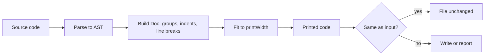
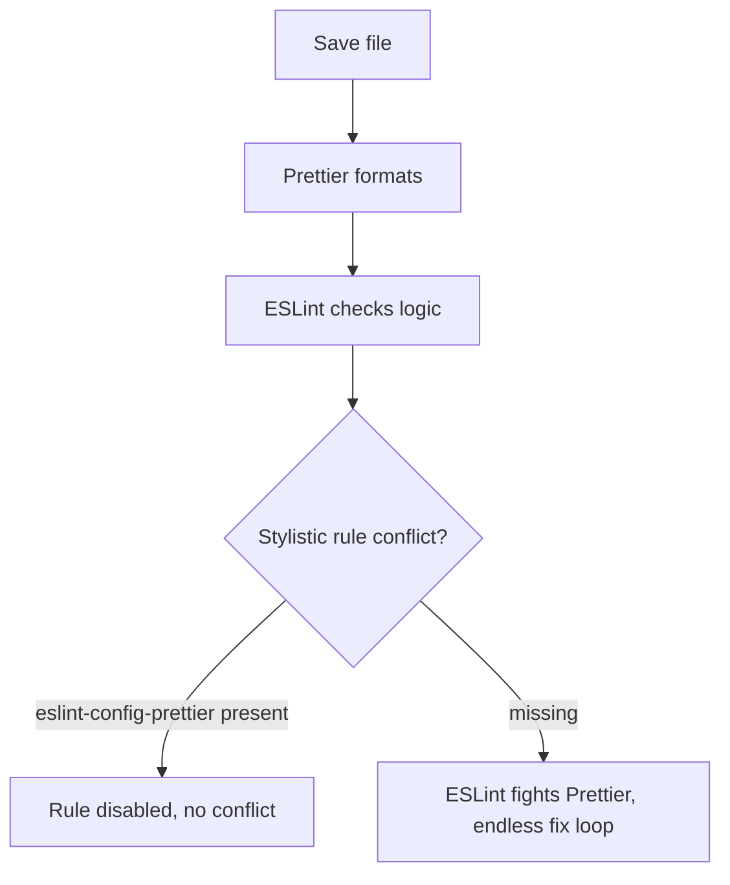

## 1. What it is

**Prettier is an opinionated code formatter: it parses your code and reprints it from scratch in a consistent style, ignoring how you originally laid it out.**

Analogy: a newspaper typesetter. Reporters hand in articles typed however they like; the typesetter re-lays everything in the paper's house style. Readers never see the reporter's spacing. Prettier is the typesetter for your codebase.

The problem it solves: style debates (tabs vs spaces, quote style, where to break long lines) waste review time and create noisy diffs. Prettier removes the choice. Code looks the same no matter who wrote it, and reviews focus on behavior.

## 2. Core concepts

### [Beginner] Parse and reprint, not patch

Prettier does not tweak your whitespace. It builds an AST, throws away your formatting, and prints the code again using its algorithm. That is why output is deterministic.

```ts
// before
const fee = calculateFee( { amountCents:150000,currency:"USD", tier : 'gold' } )
// after `prettier --write`
const fee = calculateFee({ amountCents: 150000, currency: 'USD', tier: 'gold' });
```



### [Beginner] Opinionated on purpose

Prettier has few options, deliberately. Each option is a new debate, so the team says "use the defaults" and stops arguing.

> **Why:** The value of a formatter is consistency, not any specific style. A slightly worse but universal style beats a perfect style that half the team does not follow.

### [Intermediate] printWidth is a target, not a hard limit

Prettier tries to fit each "group" on one line. If it does not fit in `printWidth` (default 80), it breaks the outermost group first, then inner ones.

```ts
// fits in 80 -> one line
const total = sumCents(transactions);

// too long -> arguments broken onto separate lines
const statement = await generateStatement(accountId, startDate, endDate, {
  includePending: true,
  currency: 'USD',
});
```

> **Gotcha:** Long strings and URLs are never broken, so lines can exceed `printWidth`. That is expected.

### [Intermediate] Preserved choices

Prettier keeps a few things from your input: blank lines (collapsed to at most one), and whether an object literal starts on a new line after `{` (`objectWrap: "preserve"`, the default). Everything else is reprinted.

```ts
// Multiline object stays multiline because of the newline after {
const limits = {
  dailyCents: 500000,
};
```

## 3. Why it's used in this project

- **Clean diffs in audited code.** Changes to transfer or fee logic show only real edits, not whitespace churn. Reviewers and auditors see what changed.
- **Many contributors.** Multiple teams touch shared `@acme/money` and `@acme/ui`; one format means no merge conflicts over style.
- **Tailwind class order.** `prettier-plugin-tailwindcss` sorts long className strings on dashboards, so diffs of styled components stay readable.
- **Formats more than TS.** JSON configs, Markdown runbooks, YAML CI pipelines and CSS all follow one standard.

## 4. Setup & configuration

```bash
npm i -D --save-exact prettier         # pin exact: formatting can change between versions
npm i -D eslint-config-prettier prettier-plugin-tailwindcss
```

```json
// .prettierrc
{
  "printWidth": 100,          // target line length (default 80)
  "tabWidth": 2,              // spaces per indent level
  "useTabs": false,           // spaces, not tabs
  "semi": true,               // add semicolons
  "singleQuote": true,        // 'x' instead of "x" (JSX attributes still use jsxSingleQuote)
  "jsxSingleQuote": false,    // <Input label="Amount" />
  "trailingComma": "all",     // default in v3: trailing commas everywhere valid (smaller diffs)
  "bracketSpacing": true,     // { a } not {a}
  "bracketSameLine": false,   // closing > of multi-line JSX on its own line
  "arrowParens": "always",    // (x) => x
  "endOfLine": "lf",          // consistent line endings across Windows/macOS
  "plugins": ["prettier-plugin-tailwindcss"]
}
```

```text
# .prettierignore  (also respects .gitignore by default in v3)
dist
coverage
pnpm-lock.yaml
yarn.lock
src/generated/
```

```json
// package.json
{
  "scripts": {
    "format": "prettier . --write",
    "format:check": "prettier . --check"
  }
}
```

```json
// .vscode/settings.json -- format on save
{
  "editor.defaultFormatter": "esbenp.prettier-vscode",
  "editor.formatOnSave": true,
  "prettier.requireConfig": true
}
```

> **Gotcha:** JSON does not allow comments; the comments above are for explanation. In a real `.prettierrc` remove them, or use `.prettierrc.json5` / `prettier.config.js`.

## 5. Key features we use

### [Beginner] Check in CI, write locally

```bash
npx prettier . --check   # exit 1 if any file is unformatted (CI)
npx prettier . --write   # fix (local)
npx prettier src/App.tsx --write
```

### [Beginner] Ignore one block

```tsx
// prettier-ignore
const FEE_TABLE = [
  [0,       100_000, 0.0],
  [100_000, 500_000, 0.25],
];
```

Keep hand-aligned tables (fee tiers, matrices) readable with `// prettier-ignore`.

### [Intermediate] eslint-config-prettier integration

```js
// eslint.config.js -- put prettier LAST so it turns off conflicting ESLint rules
import prettier from 'eslint-config-prettier';
export default [/* ...other configs */, prettier];
```



> **Interview tip:** `eslint-config-prettier` disables rules. `eslint-plugin-prettier` runs Prettier inside ESLint. The first is recommended; the second is slower and noisy.

### [Intermediate] Tailwind class sorting

```tsx
// before
<div className="text-right p-4 tabular-nums flex font-mono text-red-600">
// after prettier-plugin-tailwindcss (Tailwind's recommended order)
<div className="flex p-4 text-right font-mono text-red-600 tabular-nums">
```

```json
{
  "plugins": ["prettier-plugin-tailwindcss"],
  "tailwindFunctions": ["clsx", "cn", "cva"],
  "tailwindStylesheet": "./src/index.css"
}
```

`tailwindStylesheet` is for Tailwind v4 (CSS config); v3 uses `tailwindConfig`.

### [Intermediate] Per-file overrides

```json
{
  "singleQuote": true,
  "overrides": [
    { "files": "*.md", "options": { "proseWrap": "always" } },
    { "files": "*.json", "options": { "printWidth": 120 } }
  ]
}
```

## 6. Interview questions

#### Q: Why use an opinionated formatter instead of configurable lint rules?

Because the goal is consistency with zero discussion. Prettier reprints from the AST, so the output is deterministic and independent of the author. Few options means few debates. Lint rules for style only report problems and can be argued over or disabled; Prettier simply fixes everything. Reviews then focus on logic.

#### Q: How do Prettier and ESLint divide responsibilities?

Prettier owns formatting (whitespace, line breaks, quotes, semicolons). ESLint owns code quality (bugs, hooks rules, unsafe patterns). `eslint-config-prettier` goes last in the ESLint config to disable stylistic rules that would conflict. Run them separately: Prettier on save and in lint-staged, ESLint in the editor and CI.

#### Q: Why pin Prettier with an exact version?

Prettier can change output between minor versions. If developers have different versions, files get reformatted back and forth, causing noisy diffs and CI `--check` failures. `--save-exact` and a lockfile keep everyone on the same output.

#### Q: How does Prettier decide where to break a line?

It converts the AST into an intermediate "Doc" made of groups, indents and possible line breaks. For each group it first tries to print it flat on one line. If it exceeds `printWidth`, it breaks that group (and only then considers inner groups). It is a best effort, so long strings can still exceed the limit.

#### Q: How would you introduce Prettier to an existing large codebase?

Agree on a config, then run `prettier --write .` in one dedicated commit with no logic changes. Add that commit hash to `.git-blame-ignore-revs` so `git blame` skips it. Then enforce with format on save, lint-staged in pre-commit, and `prettier --check` in CI.

## 7. Drawbacks & pain points

- **Few choices.** If you dislike a decision, you mostly cannot change it.
- **Big reformat diffs** when introduced or when upgrading versions.
- **Speed.** JavaScript-based; very large repos take a while (Biome is much faster).
- **Plugin conflicts.** Only some plugins compose well; multiple plugins that touch the same language can clash.
- **Markdown and prose** formatting can surprise people (`proseWrap`).

Gotchas that trip devs up:

```bash
# Editor uses a different Prettier than the project
# -> "works on my machine" formatting. Fix: install locally, enable prettier.requireConfig.
```

```js
// Prettier v3 config files can be ESM; plugins must be listed explicitly
// v2 auto-loaded plugins from node_modules. v3 does not.
export default { plugins: ['prettier-plugin-tailwindcss'] };
```

> **Outdated:** Prettier 2 defaulted to `trailingComma: "es5"`. Prettier 3 defaults to `"all"`, so upgrading creates many diffs.

## 8. Better alternatives

| Tool | Speed | Config | Language coverage | Prettier compatibility | Popularity | When it wins |
| --- | --- | --- | --- | --- | --- | --- |
| Prettier 3 | ~baseline | minimal | very wide, plugins | 100% | dominant | default, plugin needs like Tailwind |
| Biome formatter | ~20-35x faster | `biome.json` | JS, TS, JSX, JSON, CSS, GraphQL | ~97% compatible | growing fast | speed, one tool for lint + format |
| dprint | fast | `dprint.json` | via Wasm plugins | configurable | niche | monorepos wanting speed and flexibility |
| oxc formatter (oxfmt) | very fast | small | JS/TS focus | aims for Prettier compat | early | watch this space, verify maturity |
| ESLint Stylistic | slow | many rules | JS/TS | n/a | niche | teams wanting lint-based style control |

## 9. When NOT to use it

- **Generated files** (OpenAPI clients, lockfiles, minified assets): ignore them.
- **Hand-aligned data tables** where alignment carries meaning: use `// prettier-ignore`.
- **Projects already on Biome**: running both formatters causes fights.
- **Languages Prettier does not support well** without plugins (for example SQL, Java): use dedicated tools.

## Cheatsheet

| Task | Command / option |
| --- | --- |
| Install | `npm i -D --save-exact prettier` |
| Write all | `prettier . --write` |
| Check (CI) | `prettier . --check` |
| List unformatted | `prettier . --list-different` |
| Ignore file | `.prettierignore` |
| Ignore node | `// prettier-ignore` |
| Line length | `printWidth` (80) |
| Quotes | `singleQuote` (false) |
| Semicolons | `semi` (true) |
| Trailing commas | `trailingComma` ("all") |
| Line endings | `endOfLine` ("lf") |
| ESLint integration | `eslint-config-prettier` last |
| Tailwind sort | `prettier-plugin-tailwindcss` |
| Blame skip | `.git-blame-ignore-revs` |

```json
{ "printWidth": 100, "singleQuote": true, "trailingComma": "all", "plugins": ["prettier-plugin-tailwindcss"] }
```
