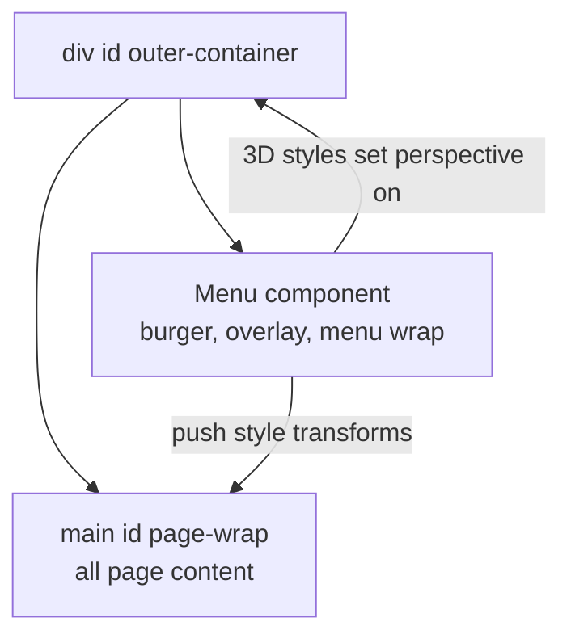
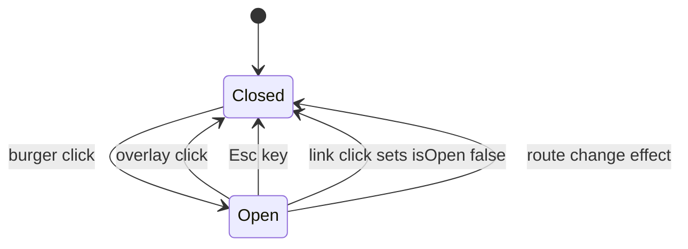

## 1. What it is

**react-burger-menu is a React component library for off-canvas sidebar navigation: a "burger" button opens a side panel that slides, pushes or scales in with one of about ten built-in animations.**

Think of a sliding drawer in a desk. The burger icon is the handle. Pull it and the drawer (your navigation) slides out from the side. Some animation styles slide only the drawer; others push the whole desk over to make room.

The problem it solves: on phones there is no room for a full navigation bar, so menus move into a hidden side panel. Building one by hand means handling open/close state, an overlay, escape-key closing, body scroll and CSS animations. This library packaged all of that before headless UI libraries existed.

> **Outdated:** The library is in maintenance-only mode. Releases are rare, it predates modern accessibility-first primitives, and it was built for older React versions. For new work, prefer an accessible dialog/sheet primitive (Radix, Headless UI, React Aria) styled with Tailwind. Learn this library to maintain existing code.

## 2. Core concepts

### [Beginner] Choosing an animation by import name

Each animation style is a separate named export. You alias it to `Menu`.

```tsx
import { slide as Menu } from "react-burger-menu";
// Other styles: stack, elastic, bubble, push, pushRotate,
//               scaleDown, scaleRotate, fallDown, reveal

export function AppNav() {
  return (
    <Menu>
      <a className="menu-item" href="/dashboard">Dashboard</a>
      <a className="menu-item" href="/accounts">Accounts</a>
      <a className="menu-item" href="/transfers">Transfers</a>
      <a className="menu-item" href="/statements">Statements</a>
    </Menu>
  );
}
```

The component renders: a burger button, an overlay, and a fixed-position menu wrapper containing your children inside a `<nav>`.

> **Why separate exports:** `elastic` and `bubble` animate an SVG shape and pull in an extra SVG animation dependency. Separate exports let you import only the style you use.

### [Beginner] Styling: you must provide the CSS

The library ships behavior and animation transforms, but the look of the button and panel is up to you. You style its fixed class names (or pass a `styles` object).

```css
/* Position and size the burger button */
.bm-burger-button { position: fixed; width: 32px; height: 28px; left: 16px; top: 16px; }
.bm-burger-bars { background: #1f2937; }
.bm-cross { background: #f9fafb; }
.bm-menu-wrap { position: fixed; height: 100%; }       /* do not remove */
.bm-menu { background: #111827; padding: 2rem 1rem; }
.bm-item-list { display: flex; flex-direction: column; gap: 0.75rem; }
.bm-item { color: #f9fafb; text-decoration: none; }
.bm-overlay { background: rgba(0, 0, 0, 0.4); }
```

> **Gotcha:** If nothing appears, it is usually missing CSS. Without a size and position on `.bm-burger-button`, the button is invisible or in a strange place.

### [Intermediate] Animation styles and page wrappers

Styles fall into two groups: those that only move the menu, and those that also move the page content.

| Style | What moves |
| --- | --- |
| `slide` | Menu slides over the page |
| `stack` | Menu slides with stacked item animation |
| `elastic`, `bubble` | Menu with an animated SVG shape edge |
| `push` | Menu slides in and pushes the page over |
| `pushRotate` | Push with a 3D rotation of the page |
| `scaleDown`, `scaleRotate` | Page shrinks (and rotates) away from the menu |
| `fallDown` | Menu drops from the top |
| `reveal` | Page slides away to reveal a menu underneath |

Styles that transform the page need to know which element is the page. You give that element an id and pass `pageWrapId`. Some also transform an outer container (for 3D perspective), so you pass `outerContainerId`.

```tsx
import { push as Menu } from "react-burger-menu";

export function App() {
  return (
    <div id="outer-container">
      <Menu pageWrapId="page-wrap" outerContainerId="outer-container">
        <a href="/dashboard">Dashboard</a>
        <a href="/accounts">Accounts</a>
      </Menu>
      <main id="page-wrap">{/* routes render here */}</main>
    </div>
  );
}
```



> **Gotcha:** The page wrapper must come **after** the menu, and `position: fixed` elements inside a transformed page wrapper break, because a CSS `transform` creates a new containing block. A fixed header inside `#page-wrap` will scroll away or jump when the menu opens.

### [Intermediate] Controlled state: isOpen and onStateChange

By default the menu manages its own open state. To close it after a link click, or open it from elsewhere, control it.

```tsx
import { useState } from "react";
import { slide as Menu } from "react-burger-menu";
import { NavLink } from "react-router-dom";

const links = [
  { to: "/dashboard", label: "Dashboard" },
  { to: "/accounts", label: "Accounts" },
  { to: "/transfers", label: "Transfers" },
];

export function MobileNav() {
  const [open, setOpen] = useState(false);

  return (
    <Menu
      isOpen={open}
      // Fires on every internal change: burger click, overlay click, Esc key
      onStateChange={(state) => setOpen(state.isOpen)}
    >
      {links.map((l) => (
        <NavLink key={l.to} to={l.to} onClick={() => setOpen(false)}>
          {l.label}
        </NavLink>
      ))}
    </Menu>
  );
}
```



> **Why `onStateChange` is required in controlled mode:** if you pass `isOpen` but ignore `onStateChange`, the internal burger click and Esc key try to change state while your prop keeps forcing the old value. The menu appears stuck or out of sync. This is the classic controlled-component rule: whoever owns state must receive every change.

### [Advanced] Closing on route change and session timeout

```tsx
import { useEffect, useState } from "react";
import { useLocation } from "react-router-dom";

export function useMenuState() {
  const [open, setOpen] = useState(false);
  const { pathname } = useLocation();

  // Close whenever the route changes (back button, programmatic navigation)
  useEffect(() => setOpen(false), [pathname]);

  return { open, setOpen };
}
```

### [Advanced] Accessibility issues

This is the biggest reason teams replace the library.

- **No focus trap.** When the menu is open, Tab can move focus to the page behind the overlay. Accessible modal navigation should keep focus inside until closed.
- **Focus return** to the burger button after closing is not guaranteed in all versions.
- **Background not made inert.** Screen readers can still reach page content behind the menu.
- **Burger button labeling** is generic by default; you need to verify the accessible name ("Open menu") and `aria-expanded` behavior in your version.
- **Animations** ignore `prefers-reduced-motion` unless you add CSS yourself.

```css
@media (prefers-reduced-motion: reduce) {
  .bm-menu-wrap, .bm-overlay, #page-wrap { transition: none !important; }
}
```

> **Interview tip:** When asked "what would you replace this with?", mention WCAG and focus management: a modal side sheet needs a focus trap, `aria-modal`, Esc to close, focus return, and an inert background. Radix Dialog and Headless UI Dialog do all of that for you.

## 3. Why it's used in this project

- **Mobile navigation** for the banking/portfolio web app: Dashboard, Accounts, Transfers, Statements, Settings, Sign out.
- It was likely added years ago because it gave a polished animated drawer with a few lines of code.
- **Finance-specific needs** that the menu must support: closing on session timeout, hiding balances in the menu header when PII masking is on, and a clear "Sign out" item.

```tsx
import { slide as Menu } from "react-burger-menu";

type Props = { open: boolean; setOpen: (v: boolean) => void; onSignOut: () => void; maskPii: boolean; availableCents: number };

export function BankMenu({ open, setOpen, onSignOut, maskPii, availableCents }: Props) {
  return (
    <Menu isOpen={open} onStateChange={(s) => setOpen(s.isOpen)} right width={300}>
      <p className="text-sm text-gray-400">Available</p>
      <p className="mb-4 text-xl tabular-nums text-white">
        {maskPii ? "****" : (availableCents / 100).toLocaleString("en-US", { style: "currency", currency: "USD" })}
      </p>
      <a href="/accounts">Accounts</a>
      <a href="/transfers">Transfers</a>
      <button type="button" onClick={onSignOut}>Sign out</button>
    </Menu>
  );
}
```

> **Finance tip:** When an idle session timeout fires (common compliance requirement), close every overlay, including this menu, before showing the "session expired" dialog. Otherwise sensitive navigation or balances may remain visible behind the timeout prompt.

## 4. Setup & configuration

### [Beginner] Install

```bash
npm install react-burger-menu
npm install -D @types/react-burger-menu   # community types, may lag behind
```

> **Gotcha:** On React 18/19 you may see peer dependency warnings because the package's declared React range is old. It often still works, but test it, and treat the warning as a maintenance signal.

### [Intermediate] All the common props, commented

```tsx
import { slide as Menu } from "react-burger-menu";

<Menu
  id="main-menu"                 // id for the menu wrapper
  isOpen={open}                  // controlled open state
  onStateChange={(s) => setOpen(s.isOpen)} // sync internal changes
  onOpen={() => track("menu_open")}        // fired when opening
  onClose={() => track("menu_close")}      // fired when closing
  right                          // open from the right edge
  width={300}                    // number (px) or string like "80%"
  pageWrapId="page-wrap"         // required by page-moving animations
  outerContainerId="outer-container" // required by 3D animations
  noOverlay={false}              // true removes the dark overlay
  disableOverlayClick={false}    // true: overlay click does not close
  disableCloseOnEsc={false}      // true: Esc does not close
  disableAutoFocus={false}       // true: do not move focus into menu on open
  customBurgerIcon={<span aria-hidden="true">Menu</span>} // element, or false to hide
  customCrossIcon={false}        // false hides the close X
  itemListElement="div"          // wrapper element for items (default nav)
  className="app-menu"           // class on the menu wrap
  menuClassName="app-menu-inner"
  overlayClassName="app-overlay"
  burgerButtonClassName="app-burger"
>
  {/* items */}
</Menu>;
```

```tsx
// Inline styles alternative to global CSS
const styles = {
  bmBurgerButton: { position: "fixed", width: "32px", height: "28px", left: "16px", top: "16px" },
  bmBurgerBars: { background: "#1f2937" },
  bmMenu: { background: "#111827", padding: "2rem 1rem" },
  bmOverlay: { background: "rgba(0,0,0,0.4)" },
} as const;

<Menu styles={styles}>{/* items */}</Menu>;
```

## 5. Key features we use

### [Beginner] Opening the menu from a custom header button

```tsx
export function Header({ onMenu }: { onMenu: () => void }) {
  return (
    <header className="flex items-center justify-between p-4">
      <button type="button" aria-label="Open menu" onClick={onMenu}>
        <span aria-hidden="true">&#9776;</span>
      </button>
      <span className="font-semibold">Acme Bank</span>
    </header>
  );
}

// Parent: <Menu customBurgerIcon={false} isOpen={open} onStateChange={(s) => setOpen(s.isOpen)} />
//         <Header onMenu={() => setOpen(true)} />
```

### [Intermediate] Showing it only on mobile

```tsx
// Render the burger menu on small screens, a normal sidebar on desktop
<div className="md:hidden"><MobileNav /></div>
<aside className="hidden md:block w-64">{/* desktop nav */}</aside>
```

> **Gotcha:** CSS-hiding the wrapper with `md:hidden` does not unmount the menu. If it was open when the window was resized, its state stays `true`. Close it in a resize or media query listener, or render conditionally with `matchMedia`.

## 6. Interview questions

#### Q: How do you control react-burger-menu from outside, for example to close it after clicking a link?

Pass `isOpen` from your state and always pass `onStateChange={(s) => setOpen(s.isOpen)}` so internal changes (burger click, overlay click, Esc) update your state. Then set it to `false` in link `onClick` handlers or in an effect that watches the route. Without `onStateChange`, internal and external state drift apart.

#### Q: What are `pageWrapId` and `outerContainerId` for?

Animations like `push`, `pushRotate`, `scaleDown`, `scaleRotate` and `reveal` move or transform the page itself, so the library needs to know which element is the page (`pageWrapId`, an element placed after the menu that wraps all content). 3D animations also set perspective on an element containing everything (`outerContainerId`). Simple overlay styles like `slide` do not need them.

#### Q: Why might a fixed header break when using the push animation?

The library applies a CSS `transform` to the page wrapper. Any element with a transform becomes the containing block for its `position: fixed` descendants, so fixed elements inside behave like absolutely positioned ones and move with the page. Fix by moving fixed elements outside the page wrapper or using a non-page-moving style.

#### Q: What accessibility problems does it have and how would you address them?

No focus trap while open, background content not made inert, focus return and burger labeling that need verification, and no reduced-motion handling. You could patch with a focus trap library, `inert` on the page wrapper, explicit labels and reduced-motion CSS, but the better fix is migrating to an accessible dialog primitive (Radix Dialog / shadcn Sheet, Headless UI Dialog, React Aria Modal) that handles focus, `aria-modal`, Esc and scroll locking.

#### Q: Would you choose this library for a new project in 2026? Why or why not?

No. It is in maintenance mode with old peer dependencies, ships opinionated animations but weak accessibility, and couples styling to fixed global class names. Modern headless primitives give correct accessibility and full styling control with Tailwind, and CSS transitions cover the animation needs. I would keep it in a legacy app only if it works and there is no accessibility audit pressure, and plan a migration.

## 7. Drawbacks & pain points

- **Maintenance status**: infrequent releases, old React peer ranges, community-maintained types.
- **Accessibility gaps**: no focus trap, background not inert.
- **Global CSS class names** (`.bm-*`) do not fit CSS Modules or Tailwind well.
- **Transforms on the page wrapper** break `position: fixed` and sometimes `position: sticky` descendants.
- **Extra dependencies** for SVG-based styles (`elastic`, `bubble`).
- **Body scroll** behind the menu is not locked by default on all browsers.

Gotchas that trip devs up:

```tsx
// 1. Controlled without onStateChange: Esc/overlay do nothing useful
<Menu isOpen={open} />                              // stuck state

// 2. Page wrapper before the menu or missing id
<main id="page-wrap" /><Menu pageWrapId="page-wrap" /> // must be after Menu

// 3. Forgot CSS: burger invisible
// .bm-burger-button needs position, width, height

// 4. Menu stays open after navigation
// add useEffect(() => setOpen(false), [pathname])
```

## 8. Better alternatives

The industry has moved to **headless, accessible primitives** styled with Tailwind:

- **Radix UI Dialog** (and shadcn/ui's **Sheet** built on it): side panels with focus trap, `aria-modal`, Esc, scroll lock and portal rendering; animate with Tailwind `data-[state=open]:` variants.
- **Headless UI Dialog** (by the Tailwind team): similar guarantees plus `Transition` helpers.
- **React Aria Components** `Modal`/`Dialog`: very strong accessibility, from Adobe.
- **Vaul**: a drawer with touch gestures, good for mobile bottom sheets.
- **Custom** with the native `<dialog>` element and `showModal()`, which gives a top-layer modal with built-in Esc handling and inert background.

```tsx
// shadcn/ui Sheet (built on Radix Dialog)
import { Sheet, SheetContent, SheetTrigger, SheetTitle } from "@/components/ui/sheet";

export function MobileNav() {
  return (
    <Sheet>
      <SheetTrigger aria-label="Open menu">Menu</SheetTrigger>
      <SheetContent side="left">
        <SheetTitle>Navigation</SheetTitle>
        <nav className="mt-4 flex flex-col gap-3">
          <a href="/accounts">Accounts</a>
          <a href="/transfers">Transfers</a>
        </nav>
      </SheetContent>
    </Sheet>
  );
}
```

| Option | Bundle (~gzip) | Boilerplate | Devtools | Learning curve | TS support | Popularity | When it wins |
| --- | --- | --- | --- | --- | --- | --- | --- |
| react-burger-menu | ~10-15 kB (+ SVG lib for elastic/bubble) | Low, but global CSS | None | Low | Community types | Declining | Legacy apps already using it |
| Radix Dialog / shadcn Sheet | ~10 kB | Low-medium | None | Low | Excellent | Very high | New Tailwind/React apps |
| Headless UI Dialog | ~10-15 kB | Low | None | Low | Excellent | High | Tailwind ecosystem |
| React Aria Modal | ~20+ kB | Medium | None | Medium | Excellent | Medium | Strict accessibility needs |
| Native `<dialog>` + Tailwind | 0 kB | Medium (own animations) | Browser | Low-medium | n/a | Growing | Minimal dependencies |

## 9. When NOT to use it

- Any new project.
- Apps that must pass a WCAG 2.1/2.2 AA audit (common for banks and regulated finance) without extra patching.
- Layouts with fixed or sticky headers inside the page content and a page-moving animation.
- Codebases using Tailwind or CSS Modules exclusively, where global `.bm-*` styles do not fit.
- When you need gestures (swipe to close) or bottom sheets: use Vaul or similar.

## Cheatsheet

| Prop | Purpose |
| --- | --- |
| `isOpen` + `onStateChange` | Controlled open state (always use together) |
| `onOpen` / `onClose` | Side-effect callbacks |
| `right` / `width` | Side and size |
| `pageWrapId` / `outerContainerId` | Required for page-moving / 3D styles |
| `noOverlay` / `disableOverlayClick` / `disableCloseOnEsc` | Closing behavior |
| `disableAutoFocus` | Do not focus the menu on open |
| `customBurgerIcon` / `customCrossIcon` | Element or `false` |
| `styles` / `className` / `menuClassName` / `overlayClassName` | Styling hooks |
| CSS classes | `.bm-burger-button .bm-burger-bars .bm-cross-button .bm-cross .bm-menu-wrap .bm-menu .bm-item-list .bm-item .bm-overlay` |

```tsx
import { slide as Menu } from "react-burger-menu";

const [open, setOpen] = useState(false);

<div id="outer-container">
  <Menu isOpen={open} onStateChange={(s) => setOpen(s.isOpen)} pageWrapId="page-wrap" outerContainerId="outer-container" right>
    <a href="/accounts" onClick={() => setOpen(false)}>Accounts</a>
  </Menu>
  <main id="page-wrap">{/* app */}</main>
</div>;
```
