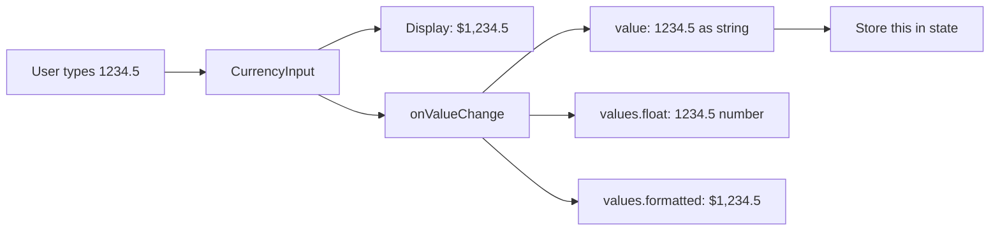
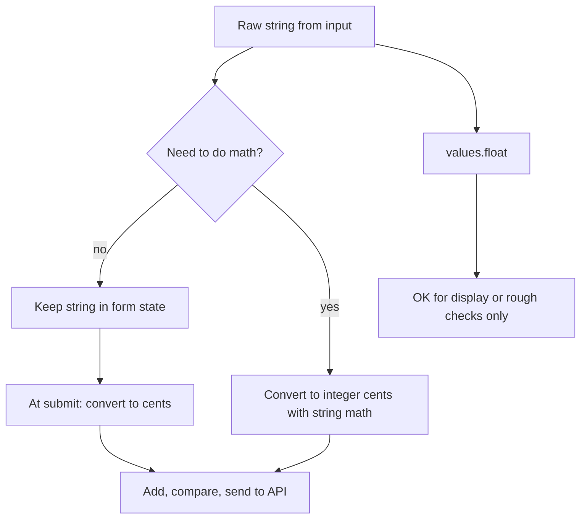
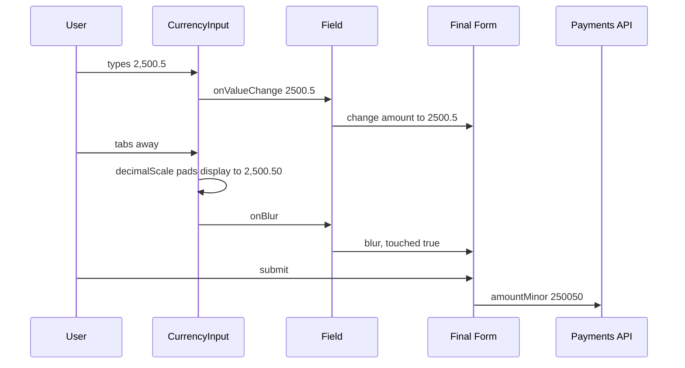

## 1. What it is

**`react-currency-input-field` provides a `<CurrencyInput>` component that shows a nicely formatted amount like `$1,234.56` while giving your code the raw value `"1234.56"` as a string.**

Analogy: it is a cashier's calculator display. You press keys, it shows commas and the currency symbol, but when you hit "total" the machine works with the plain number underneath, not the pretty text.

The problem it solves: a plain `<input>` shows exactly what the user typed. Formatting it yourself on every keystroke (adding commas, limiting decimals, keeping the caret in the right place, handling paste, negatives and different locales) is surprisingly hard. This package handles formatting and caret position, and exposes the unformatted value separately.

> **Why a separate raw value:** Display text depends on locale (`1.234,56 €` in Germany vs `€1,234.56` in Ireland). Business logic must not depend on display text. Splitting "what you see" from "what you store" keeps logic locale-independent.

## 2. Core concepts

### [Beginner] Basic usage and onValueChange

```tsx
import { useState } from 'react';
import CurrencyInput from 'react-currency-input-field';

export function AmountField() {
  const [amount, setAmount] = useState<string | undefined>('');

  return (
    <>
      <label htmlFor="amount">Amount</label>
      <CurrencyInput
        id="amount"
        name="amount"
        placeholder="$0.00"
        prefix="$"
        decimalsLimit={2}
        value={amount}
        onValueChange={(value, name, values) => {
          // value:  "1234.5"  (string | undefined, unformatted)
          // name:   "amount"
          // values: { float: 1234.5, formatted: "$1,234.5", value: "1234.5" }
          setAmount(value);
        }}
      />
    </>
  );
}
```



> **Gotcha:** Use `onValueChange`, not `onChange`. `onChange` is the normal DOM event and `event.target.value` is the **formatted** text (`"$1,234.5"`), which is useless for logic.

### [Beginner] Key props

```tsx
<CurrencyInput
  prefix="$"                // shown before the number (ignored if intlConfig supplies a symbol)
  suffix=" USD"             // shown after
  decimalsLimit={2}         // max decimals the user can TYPE (default 2)
  decimalScale={2}          // pad to 2 decimals on BLUR: "5" -> "5.00", "1.5" -> "1.50"
  allowDecimals             // default true; false for whole units like share counts
  allowNegativeValue={false} // default true! Disable for payment amounts
  disableAbbreviations      // otherwise "1k" -> 1000, "2m" -> 2000000
  maxLength={12}            // max digits, excluding formatting
  step={10}                 // arrow up/down increments
/>
```

- `decimalsLimit` limits **input**.
- `decimalScale` formats **output on blur**.
- Use both for money: `decimalsLimit={2} decimalScale={2}`.

> **Finance tip:** Turn off abbreviations for payment amounts. A user typing "5k" by accident into a transfer field should not produce `5000` silently.

### [Intermediate] intlConfig for locale-aware formatting

`intlConfig` uses `Intl.NumberFormat` under the hood, so separators and symbols follow the locale and currency.

```tsx
<CurrencyInput intlConfig={{ locale: 'en-US', currency: 'USD' }} decimalScale={2} onValueChange={setAmount} />
// displays $1,234.56

<CurrencyInput intlConfig={{ locale: 'de-DE', currency: 'EUR' }} decimalScale={2} onValueChange={setAmount} />
// displays 1.234,56 €   onValueChange still gives "1234.56"

<CurrencyInput intlConfig={{ locale: 'ja-JP', currency: 'JPY' }} decimalsLimit={0} allowDecimals={false} onValueChange={setAmount} />
// yen has no minor units
```

> **Why the raw value stays the same:** Regardless of `,` or `.` as the decimal separator on screen, the value you receive uses `.` as the decimal point. Your conversion code never has to know the locale.

> **Gotcha:** Currencies have different minor units: JPY has 0, USD has 2, BHD and KWD have 3. Do not hard-code `decimalsLimit={2}` for every currency. Derive it:

```ts
const minorUnits = (currency: string) =>
  new Intl.NumberFormat('en', { style: 'currency', currency }).resolvedOptions().maximumFractionDigits ?? 2;
```

### [Intermediate] Why the value is a string, not a float

```ts
0.1 + 0.2;            // 0.30000000000000004
1.005 * 100;          // 100.49999999999999
Math.round(1.005 * 100); // 100, not 101!
```

Binary floating point cannot represent most decimal fractions exactly. The string `"1.005"` is exact. While typing, intermediate states like `"12."` or `"0.0"` also only make sense as strings; a float would turn `"12."` into `12` and the user could never type the decimal.



### [Intermediate] Converting to cents safely

Convert the string to integer minor units by splitting on the decimal point. No float multiplication.

```ts
/** "1234.5" -> 123450, "-0.07" -> -7, "" -> null. Assumes "." as the decimal point. */
export function toMinorUnits(value: string | undefined, decimals = 2): number | null {
  if (!value) return null;
  const negative = value.startsWith('-');
  const [whole = '0', frac = ''] = value.replace('-', '').split('.');
  if (!/^\d*$/.test(whole) || !/^\d*$/.test(frac)) return null;
  const fracPadded = (frac + '0'.repeat(decimals)).slice(0, decimals);
  const units = Number(whole || '0') * 10 ** decimals + Number(fracPadded || '0');
  if (!Number.isSafeInteger(units)) return null; // too large for exact integer math
  return negative ? -units : units;
}

/** 123450 -> "1234.50" for feeding back into the input */
export function fromMinorUnits(units: number, decimals = 2): string {
  const sign = units < 0 ? '-' : '';
  const abs = Math.abs(units).toString().padStart(decimals + 1, '0');
  return decimals === 0 ? `${sign}${abs}` : `${sign}${abs.slice(0, -decimals)}.${abs.slice(-decimals)}`;
}

toMinorUnits('1.005', 2); // 100 (third decimal ignored; decimalsLimit prevents it anyway)
toMinorUnits('1234.5');   // 123450
fromMinorUnits(123450);   // "1234.50"
```

> **Interview tip:** Say "store money as integer minor units or as a decimal string, and use a decimal library (dinero.js, big.js) when you need multiplication like FX or interest." That signals you know the real-world rule.

### [Advanced] Integration with React Final Form

Keep the raw string in form state. Map `onValueChange` to `input.onChange`, and forward `onBlur` so `touched` works.

```tsx
import { Field } from 'react-final-form';
import CurrencyInput from 'react-currency-input-field';

const required = (v?: string) => (v ? undefined : 'Required');
const positive = (v?: string) => (v && Number(v) > 0 ? undefined : 'Must be greater than 0');
const compose = (...fns: Array<(v?: string) => string | undefined>) => (v?: string) =>
  fns.reduce<string | undefined>((err, fn) => err ?? fn(v), undefined);

export function AmountFieldRff({ name, currency }: { name: string; currency: string }) {
  return (
    <Field<string> name={name} validate={compose(required, positive)} parse={(v) => v} /* keep '' as '' */>
      {({ input, meta }) => {
        const error = meta.touched ? meta.error ?? meta.submitError : undefined;
        return (
          <div>
            <label htmlFor={name}>Amount ({currency})</label>
            <CurrencyInput
              id={name}
              name={input.name}
              value={input.value}
              onValueChange={(value) => input.onChange(value ?? '')}
              onBlur={input.onBlur}
              onFocus={input.onFocus}
              intlConfig={{ locale: 'en-US', currency }}
              decimalsLimit={minorUnits(currency)}
              decimalScale={minorUnits(currency)}
              allowNegativeValue={false}
              disableAbbreviations
              inputMode="decimal"
              aria-invalid={!!error}
              aria-describedby={error ? `${name}-error` : undefined}
            />
            {error && <span id={`${name}-error`} role="alert">{error}</span>}
          </div>
        );
      }}
    </Field>
  );
}

// onSubmit: convert at the boundary
const onSubmit = async (values: { amount: string; currency: string }) => {
  await api.post('/payments', {
    amountMinor: toMinorUnits(values.amount, minorUnits(values.currency)),
    currency: values.currency,
  });
};
```



> **Gotcha:** Do not pass React Final Form's `format`/`formatOnBlur` to this field. CurrencyInput already formats; doing it twice fights over the displayed text and moves the caret.

## 3. Why it's used in this project

- **Transfer, payment and deposit forms** need a familiar `$1,234.56` display while keeping exact values.
- **Multi-currency accounts** use `intlConfig` so EUR, GBP and JPY inputs display correctly.
- **Limits and fees** compare amounts in integer cents against API-provided limits.
- **Investment orders** use it for dollar amounts, with `allowDecimals={false}` variants for share counts where fractional shares are not allowed.
- **Accessibility**: a real `<input>` with `inputMode="decimal"` shows the numeric keypad on mobile.

> **Finance tip:** Show the currency code (USD, EUR) somewhere near the input, not only a symbol. `$` is used by USD, CAD, AUD and others.

## 4. Setup & configuration

```bash
npm install react-currency-input-field
```

```tsx
// components/MoneyInput.tsx: project defaults in one place
import CurrencyInput, { CurrencyInputProps } from 'react-currency-input-field';

export function MoneyInput({ currency, locale = 'en-US', ...rest }: CurrencyInputProps & { currency: string; locale?: string }) {
  const digits = minorUnits(currency);
  return (
    <CurrencyInput
      intlConfig={{ locale, currency }}  // symbol and separators from Intl
      decimalsLimit={digits}             // can't type more decimals than the currency has
      decimalScale={digits}              // pad on blur for a consistent look
      allowNegativeValue={false}         // payments are positive; refunds use a separate flow
      disableAbbreviations               // no "1k" shortcuts for money
      maxLength={15}                     // keep within safe integer range after conversion
      inputMode="decimal"                // numeric keypad on mobile
      autoComplete="off"
      {...rest}
    />
  );
}
```

The package also exports a `formatValue` helper to format a raw value the same way outside an input (for example on a review screen):

```ts
import { formatValue } from 'react-currency-input-field';
formatValue({ value: '2500.5', intlConfig: { locale: 'en-US', currency: 'USD' }, decimalScale: 2 }); // "$2,500.50"
```

## 5. Key features we use

### [Beginner] Prefilled value from the API (cents to string)

```tsx
<MoneyInput currency="USD" defaultValue={fromMinorUnits(limit.dailyMinor)} onValueChange={setAmount} />
```

### [Beginner] Placeholder that matches format

```tsx
<MoneyInput currency="EUR" locale="de-DE" placeholder="0,00 €" onValueChange={setAmount} />
```

### [Intermediate] "Use max" button

```tsx
<button type="button" onClick={() => setAmount(fromMinorUnits(availableMinor))}>Use available balance</button>
```

### [Intermediate] Custom input component

```tsx
<CurrencyInput customInput={TextFieldFromDesignSystem} prefix="$" onValueChange={setAmount} />
```

## 6. Interview questions

#### Q: Why does onValueChange give you a string instead of a number?

Because money must be exact and floats are not (`0.1 + 0.2 !== 0.3`). A string also preserves in-progress input like `"12."` that a number would lose. You keep the string in state and convert to integer minor units with string math at the API boundary. `values.float` exists but is for display or rough checks only.

#### Q: What is the difference between decimalsLimit and decimalScale?

`decimalsLimit` caps how many decimal digits the user can type. `decimalScale` pads or rounds the formatted display to that many decimals on blur (`"5"` becomes `"5.00"`). For money, set both to the currency's minor units.

#### Q: How do you handle multiple currencies and locales?

Pass `intlConfig={{ locale, currency }}` so symbol and separators come from `Intl.NumberFormat`. Derive decimal places from the currency (JPY 0, USD 2, KWD 3) via `resolvedOptions().maximumFractionDigits`. The raw value always uses `.` as the decimal separator, so conversion code is locale independent.

#### Q: How do you convert "1234.5" to cents without float errors?

Split on `.`, pad the fractional part to the number of minor digits, then compute `whole * 10^digits + fraction` as integers. Avoid `Math.round(parseFloat(v) * 100)`, which fails on values like `1.005`. Check `Number.isSafeInteger` for very large values, or use a decimal library.

#### Q: How do you wire it into React Final Form?

Inside a `<Field>` render, set `value={input.value}`, `onValueChange={(v) => input.onChange(v ?? '')}`, and forward `onBlur`/`onFocus` so `touched` works. Do not also use RFF `format`, since the component formats itself. Validate the raw string and convert to minor units in `onSubmit`.

## 7. Drawbacks & pain points

- **Negative values allowed by default**; easy to forget for payment inputs.
- **Abbreviations on by default** (`k`, `m`, `b`).
- **Controlled `value` expects the raw string**, not a formatted one or a number; passing `1234.5` as a number or `"$1,234.50"` misbehaves.
- **Locale edge cases**: some locales use non-breaking spaces as group separators, which breaks naive tests and string comparisons.
- **Small maintainer team**; check issues before upgrading.
- Not a decimal math library; it formats, it does not calculate.

Gotchas that trip devs up:

```tsx
// 1. Reading the DOM event
<CurrencyInput onChange={(e) => setAmount(e.target.value)} /> // "$1,234.56" formatted text

// 2. Float conversion
const cents = Math.round(Number(value) * 100); // wrong for some values like "1.005"; use toMinorUnits

// 3. Passing a number as value
<CurrencyInput value={1234.5} /> // pass "1234.5" (string)

// 4. Testing with Testing Library
expect(input).toHaveValue('1.234,56 €'); // may fail: the space before € can be a non-breaking space
```

## 8. Better alternatives

| Library | Bundle (gzip) | Boilerplate | Devtools | Learning curve | TypeScript | Popularity | When it wins |
| --- | --- | --- | --- | --- | --- | --- | --- |
| react-currency-input-field | ~5 kB | Low | N/A | Low | Good | High for this niche | Simple money inputs with Intl |
| react-number-format (NumericFormat) | ~8-10 kB | Low-medium | N/A | Low | Good | Very high | Money plus phone, card masks and patterns |
| Maskito / react-imask | ~8-15 kB | Medium | N/A | Medium | Good | Medium | Complex masks across frameworks |
| Native input + Intl on blur | 0 kB | Medium (your code) | N/A | Low | N/A | Universal | Minimal deps, format only on blur |
| Design-system NumberField (React Aria, MUI) | varies | Low | N/A | Low-medium | Excellent | Growing | Strong a11y and i18n built in |

React Aria's `NumberField` with `formatOptions={{ style: 'currency', currency: 'EUR' }}` is a strong modern choice if your design system is built on React Aria. `react-number-format` is the most common general alternative.

## 9. When NOT to use it

- Share quantities, percentages or plain integers: a simple number input or `NumericFormat` is clearer.
- When you need input masks for card numbers, phone numbers or IBANs: use a masking library.
- When the design system already provides a number/currency field.
- When you need calculations: pair the input with dinero.js or big.js; the input itself does not do math.
- Read-only amount display: use `Intl.NumberFormat` directly, not an input.

## Cheatsheet

| Prop | Meaning |
| --- | --- |
| `value` / `defaultValue` | Raw string like `"1234.5"` |
| `onValueChange(value, name, values)` | `value` string or undefined, `values = { float, formatted, value }` |
| `prefix`, `suffix` | Text around the number |
| `intlConfig={{ locale, currency }}` | Intl-driven symbol and separators |
| `decimalsLimit` | Max decimals typed |
| `decimalScale` | Pad decimals on blur |
| `fixedDecimalLength` | Force exact decimals (digits shift into decimals) |
| `allowDecimals`, `allowNegativeValue` | Allow `.` and `-` |
| `disableAbbreviations`, `disableGroupSeparators` | Turn off `k/m/b` and commas |
| `decimalSeparator`, `groupSeparator` | Manual separators |
| `maxLength`, `step` | Digit cap, arrow-key step |
| `customInput` | Render your own input component |
| `formatValue(options)` | Format a raw value outside an input |

```tsx
<CurrencyInput
  id="amount"
  name="amount"
  value={amount}
  onValueChange={(v) => setAmount(v ?? '')}
  intlConfig={{ locale: 'en-US', currency: 'USD' }}
  decimalsLimit={2}
  decimalScale={2}
  allowNegativeValue={false}
  disableAbbreviations
  inputMode="decimal"
/>
// submit: { amountMinor: toMinorUnits(amount, 2), currency: 'USD' }
```
