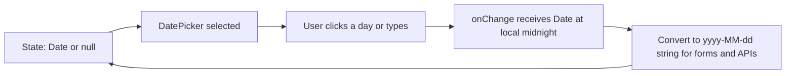
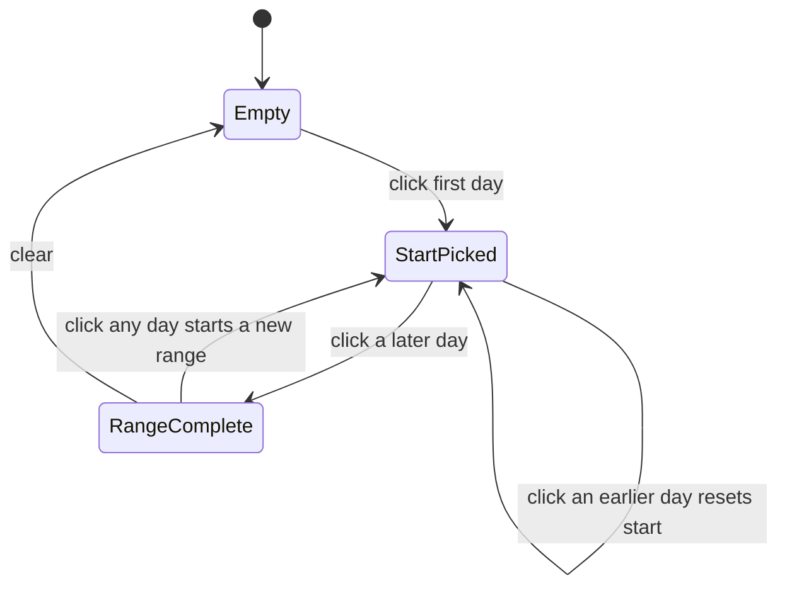
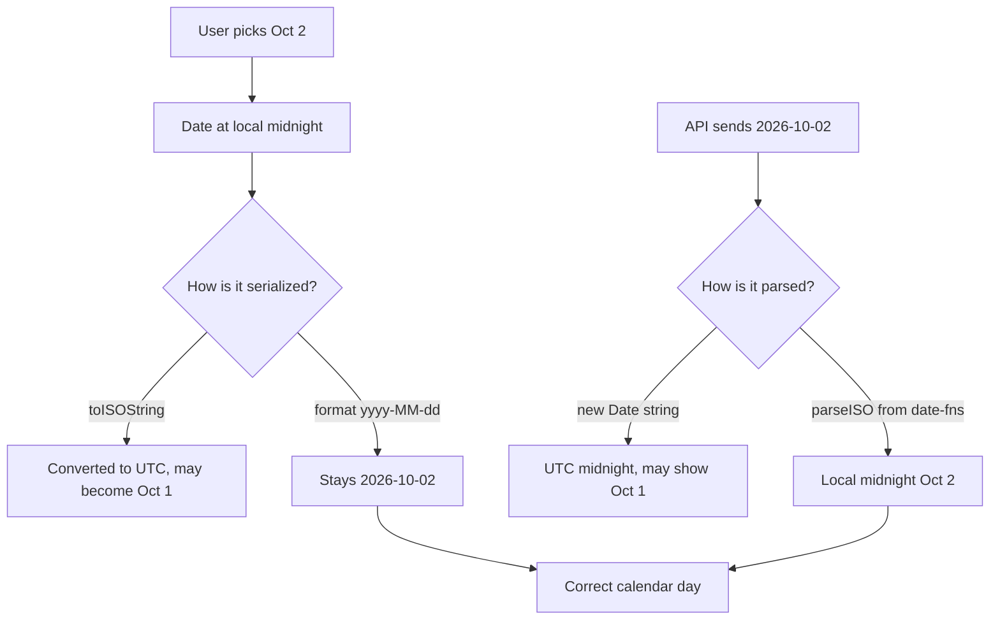

## 1. What it is

**React Datepicker is a controlled React component that renders a text input with a popup calendar and gives you back JavaScript `Date` objects for single dates, date ranges and times.**

Analogy: it is a wall calendar attached to a text box. You can type a date or click a day on the calendar. The calendar does not know or care about time zones; it just hands you "the day the user pointed at", stored the way JavaScript stores dates.

The problem it solves: the native `<input type="date">` looks different in every browser, cannot do ranges in one control, has limited styling and limited control over formats and disabled days. Statement filters, transaction search and scheduled payments need ranges, min/max limits, excluded holidays and a consistent look. React Datepicker covers these with one component.

> **Why this matters before anything else:** A `Date` in JavaScript is an **instant in time** (milliseconds since 1970 UTC), not a calendar day. Most date bugs in finance UIs come from treating "October 2" (a calendar day) as an instant. Keep that in mind through this whole doc.

## 2. Core concepts

### [Beginner] Controlled selected and onChange

```tsx
import { useState } from 'react';
import DatePicker from 'react-datepicker';
import 'react-datepicker/dist/react-datepicker.css';

export function PaymentDateField() {
  const [paymentDate, setPaymentDate] = useState<Date | null>(new Date());

  return (
    <>
      <label htmlFor="payment-date">Payment date</label>
      <DatePicker
        id="payment-date"
        selected={paymentDate}
        onChange={(date: Date | null) => setPaymentDate(date)}
        dateFormat="MM/dd/yyyy"
        placeholderText="MM/DD/YYYY"
      />
    </>
  );
}
```

`selected` is the current value (`Date | null`). `onChange` receives the new `Date` (or `null` when cleared). The component holds no source of truth itself; your state does.



### [Beginner] dateFormat uses date-fns tokens

```tsx
<DatePicker selected={d} onChange={setD} dateFormat="dd/MM/yyyy" />    // 02/10/2026
<DatePicker selected={d} onChange={setD} dateFormat="MMM d, yyyy" />   // Oct 2, 2026
<DatePicker selected={d} onChange={setD} dateFormat={['MM/dd/yyyy', 'M/d/yyyy']} /> // accept several when typing
```

> **Gotcha:** date-fns tokens are case sensitive. `yyyy` is the calendar year; `YYYY` is the ISO week-numbering year and gives wrong results near New Year. `dd` is day of month; `DD` is day of year. `MM` is month; `mm` is minutes.

### [Beginner] Min and max dates, excluded and filtered days

```tsx
import { addDays, isWeekend } from 'date-fns';

const today = new Date();
const bankHolidays = [new Date(2026, 10, 26), new Date(2026, 11, 25)]; // months are 0-based!

<DatePicker
  selected={scheduledDate}
  onChange={setScheduledDate}
  minDate={addDays(today, 1)}          // payments must be scheduled for tomorrow or later
  maxDate={addDays(today, 365)}        // up to one year ahead
  excludeDates={bankHolidays}          // greyed out
  filterDate={(d) => !isWeekend(d)}    // return false to disable a day
  placeholderText="Select a business day"
/>;
```

> **Gotcha:** `new Date(2026, 10, 26)` is **November** 26. JavaScript months are 0-based. Prefer `parseISO('2026-11-26')` from date-fns to avoid this.

> **Finance tip:** The calendar's disabled days are a UX hint, not a rule. The payments API must still reject weekends, holidays and past cut-off times, because the user's clock and time zone can differ from the bank's.

### [Intermediate] Date ranges with selectsRange

For a statement or transaction filter, use one picker in range mode. `onChange` receives a tuple `[start, end]`.

```tsx
export function StatementRangePicker() {
  const [[startDate, endDate], setRange] = useState<[Date | null, Date | null]>([null, null]);

  return (
    <DatePicker
      selectsRange
      startDate={startDate}
      endDate={endDate}
      onChange={(dates: [Date | null, Date | null]) => setRange(dates)}
      maxDate={new Date()}            // no future statements
      monthsShown={2}
      isClearable
      placeholderText="Select statement period"
      dateFormat="MMM d, yyyy"
    />
  );
}
```



While only the start is picked, `endDate` is `null`. Only fetch data when both are set.

The older pattern uses **two pickers** with `selectsStart` / `selectsEnd`:

```tsx
<DatePicker selected={startDate} onChange={setStartDate} selectsStart startDate={startDate} endDate={endDate} />
<DatePicker selected={endDate} onChange={setEndDate} selectsEnd startDate={startDate} endDate={endDate} minDate={startDate ?? undefined} />
```

### [Intermediate] customInput with forwardRef

To use your design-system input or a button, pass `customInput`. React Datepicker clones it and injects `value`, `onClick`, `onChange` and a `ref` (it needs the ref to position the popup and manage focus), so your component must forward the ref.

```tsx
import { forwardRef } from 'react';

interface DateButtonProps {
  value?: string;          // formatted string injected by the datepicker
  onClick?: () => void;    // opens the calendar
  label: string;
}

const DateButton = forwardRef<HTMLButtonElement, DateButtonProps>(({ value, onClick, label }, ref) => (
  <button type="button" ref={ref} onClick={onClick} aria-label={`${label}: ${value || 'not set'}`} className="date-btn">
    {value || 'Select date'}
  </button>
));
DateButton.displayName = 'DateButton';

<DatePicker selected={d} onChange={setD} customInput={<DateButton label="Statement date" />} />;
```

> **Why forwardRef:** Without it, the ref the datepicker passes is dropped. The popup cannot find its anchor element and focus returns to nowhere when it closes. In React 19, function components can accept `ref` as a normal prop, but `forwardRef` still works and is clearer for shared components.

### [Advanced] Timezone pitfalls (the big one)

React Datepicker returns `Date` objects at **local midnight** of the picked day. Problems start when you serialize them.

```ts
// User in Asia/Kathmandu (UTC+05:45) picks October 2, 2026
const picked = new Date(2026, 9, 2); // local midnight
picked.toISOString(); // "2026-10-01T18:15:00.000Z"  -> the API sees October 1!

// User in America/New_York (UTC-04:00) loads a statement date from the API
new Date('2026-10-02');          // parsed as UTC midnight
// displays as Oct 1, 2026 8:00 PM local -> the picker highlights October 1!
```



The fix: treat **calendar dates** (statement dates, value dates, birth dates, scheduled payment dates) as `YYYY-MM-DD` strings everywhere outside the picker. Convert only at the picker boundary.

```ts
import { format, parseISO } from 'date-fns';

// Date -> API string (local calendar day, no time zone shift)
export const toIsoDate = (d: Date | null): string | null => (d ? format(d, 'yyyy-MM-dd') : null);

// API string -> Date for the picker (date-only ISO strings are parsed as LOCAL midnight by parseISO)
export const fromIsoDate = (s: string | null | undefined): Date | null => (s ? parseISO(s) : null);
```

> **Finance tip:** Distinguish **calendar dates** from **timestamps**. "Statement period Oct 1 to Oct 31" and "payment value date" are calendar dates: send `YYYY-MM-DD`. "Transaction posted at" is an instant: send full ISO with offset and display it in the user's (or the bank's) time zone. Mixing the two causes off-by-one-day statements, which customers notice and auditors flag.

> **Gotcha:** react-datepicker has no real time zone support. If you must show dates in a specific time zone (for example the bank's New York cut-off), convert with `date-fns-tz` or `@date-fns/tz` before and after the picker. The upcoming `Temporal.PlainDate` API models calendar dates correctly; until it is everywhere, use strings.

### [Advanced] Locales with date-fns

```tsx
import DatePicker, { registerLocale, setDefaultLocale } from 'react-datepicker';
import { enGB } from 'date-fns/locale/en-GB';
import { de } from 'date-fns/locale/de';

registerLocale('en-GB', enGB);
registerLocale('de', de);
setDefaultLocale('en-GB'); // optional global default

<DatePicker
  selected={d}
  onChange={setD}
  locale="de"                  // month and weekday names, week start day
  dateFormat="P"               // localized short date token: 02.10.2026 in de
  calendarStartDay={1}         // Monday (locale may already set this)
/>;
```

> **Why register:** Locales are separate imports so you only bundle the languages you use.

## 3. Why it's used in this project

- **Statement and transaction filters** use `selectsRange` with `maxDate={today}`.
- **Scheduled payments and transfers** use `minDate`, `excludeDates` for bank holidays and `filterDate` for weekends.
- **Date of birth and ID expiry** on KYC forms use `showYearDropdown` and `showMonthDropdown`.
- **Report exports** use month pickers (`showMonthYearPicker`) for monthly statements.
- **Consistent look** across browsers matters for customer-facing banking portals.

```tsx
<DatePicker
  selected={month}
  onChange={setMonth}
  showMonthYearPicker
  dateFormat="MMMM yyyy"
  maxDate={new Date()}
/>
```

## 4. Setup & configuration

```bash
npm install react-datepicker date-fns
# types are bundled since v7; remove @types/react-datepicker if present
```

```tsx
// components/AppDatePicker.tsx: project wrapper with safe defaults
import DatePicker, { DatePickerProps } from 'react-datepicker';
import 'react-datepicker/dist/react-datepicker.css'; // or your own styles

export function AppDatePicker(props: DatePickerProps) {
  return (
    <DatePicker
      dateFormat="MM/dd/yyyy"        // US banking default; date-fns tokens
      placeholderText="MM/DD/YYYY"
      autoComplete="off"             // stop browser autofill dropdown covering the calendar
      showPopperArrow={false}
      popperPlacement="bottom-start" // where the calendar opens
      shouldCloseOnSelect            // close after picking a single date
      strictParsing                  // typed text must match dateFormat exactly
      portalId="datepicker-portal"   // render popup in a portal (avoid overflow clipping)
      {...props}
    />
  );
}
```

> **Outdated:** Before v7, types came from `@types/react-datepicker` and many props differed (for example range `onChange` typing). Older v4 versions used date-fns v2. Check that your date-fns major version matches the peer dependency.

## 5. Key features we use

### [Beginner] Date and time

```tsx
<DatePicker selected={d} onChange={setD} showTimeSelect timeIntervals={15} dateFormat="MM/dd/yyyy h:mm aa" />
```

### [Beginner] Inline calendar (no popup)

```tsx
<DatePicker selected={d} onChange={setD} inline />
```

### [Intermediate] Inside React Final Form with ISO strings

```tsx
<Field<string> name="executeOn">
  {({ input, meta }) => (
    <>
      <DatePicker
        id={input.name}
        selected={fromIsoDate(input.value)}
        onChange={(d) => input.onChange(toIsoDate(d) ?? '')}
        onBlur={() => input.onBlur()}
        minDate={addDays(new Date(), 1)}
      />
      {meta.touched && meta.error && <span role="alert">{meta.error}</span>}
    </>
  )}
</Field>
```

### [Intermediate] Highlighting dates (e.g. scheduled payments)

```tsx
<DatePicker selected={d} onChange={setD} highlightDates={scheduledPaymentDates.map(parseISO)} />
```

## 6. Interview questions

#### Q: A user picks October 2 and the server stores October 1. Why?

The picker returns a `Date` at local midnight. `toISOString()` (or `JSON.stringify`, which calls it) converts to UTC. For users east of UTC, local midnight is the previous day in UTC. Fix by sending the calendar date as `format(date, 'yyyy-MM-dd')` and parsing API date-only strings with `parseISO`, not `new Date(string)`.

#### Q: How do you build a date range filter?

Use `selectsRange` with `startDate`, `endDate`, and an `onChange` that receives `[start, end]`. Store both, fetch only when both are non-null, set `maxDate` to today for historic data, and serialize each as `YYYY-MM-DD`. Alternatively use two pickers with `selectsStart`/`selectsEnd` and `minDate={startDate}` on the end picker.

#### Q: Why must a customInput use forwardRef?

React Datepicker clones the custom input and attaches a ref so it can position the popup and manage focus. A plain function component (pre React 19) drops refs, so the popup positions wrongly and focus handling breaks. `forwardRef` passes the ref to the underlying DOM element.

#### Q: What is the difference between YYYY and yyyy in dateFormat?

They are date-fns tokens. `yyyy` is the calendar year. `YYYY` is the local week-numbering year, which differs around late December / early January (Dec 29, 2025 can show 2026). date-fns throws or warns unless you opt in. Always use `yyyy`, `MM`, `dd`.

#### Q: How do you support multiple languages?

Import the date-fns locale (`date-fns/locale/de`), call `registerLocale('de', de)`, then pass `locale="de"`. Use localized format tokens like `P` so the order (day/month vs month/day) follows the locale. Only import locales you need to keep the bundle small.

## 7. Drawbacks & pain points

- **No real time zone support**; everything is local `Date`.
- **Accessibility is decent but not best-in-class**; screen reader announcements for grid navigation are weaker than React Aria's.
- **Default CSS** is dated and must be overridden; class names are global (`.react-datepicker__day--selected`).
- **Bundle**: ~25-35 kB gzip plus date-fns functions and locales.
- **Typing a date** has quirks: partial input, `strictParsing`, and multiple formats can confuse users.
- **Mobile** UX is often worse than the native date input.

Gotchas that trip devs up:

```tsx
// 1. Storing Date objects in form state and comparing with ===
new Date(2026, 9, 2) === new Date(2026, 9, 2); // false: different objects
isSameDay(a, b); // use date-fns

// 2. Range picker onChange typed as single
<DatePicker selectsRange onChange={(d: Date | null) => {}} /> // wrong: receives [start, end]

// 3. maxDate with time component
maxDate={new Date()} // includes current time; fine for days, but with showTimeSelect future hours are blocked too

// 4. Popup clipped inside a modal or table
// use portalId or popperProps/strategy fixed, and a z-index above the modal
```

## 8. Better alternatives

For new work, teams choose between **react-day-picker** (headless-friendly, used by shadcn/ui's Calendar), **React Aria DatePicker** (best accessibility, uses `@internationalized/date` with real calendar-date types), and **MUI X Date Pickers** in MUI apps. For simple forms on mobile, the **native date input** is often the best UX and returns a `YYYY-MM-DD` string, which avoids the time zone trap entirely.

| Library | Bundle (gzip) | Boilerplate | Devtools | Learning curve | TypeScript | Popularity | When it wins |
| --- | --- | --- | --- | --- | --- | --- | --- |
| react-datepicker | ~25-35 kB | Low | N/A | Low | Good | Very high | Quick full-featured popup picker |
| react-day-picker v9 | ~10-15 kB | Medium (bring your popover) | N/A | Low-medium | Excellent | Very high | shadcn/Tailwind design systems |
| React Aria DatePicker | ~20-30 kB | Medium | N/A | Medium | Excellent | Growing | Strict a11y, real calendar-date types |
| MUI X Date Pickers | ~40 kB+ | Low in MUI apps | N/A | Medium | Excellent | High | Apps already on MUI |
| Native input type=date | 0 kB | None | N/A | None | N/A | Universal | Mobile-first, simple single dates |

```tsx
// Native: value is already a "YYYY-MM-DD" string
<input type="date" min="2026-10-03" max="2027-10-02" value={executeOn} onChange={(e) => setExecuteOn(e.target.value)} />
```

## 9. When NOT to use it

- Mobile-first flows where the native date input gives the OS picker and better accessibility.
- When dates must be displayed and edited in a specific non-local time zone (bank time): use a library with time zone support or convert carefully.
- Design systems built on shadcn/Radix or React Aria: use their calendar components.
- Simple year-only or month-only inputs: a select is clearer.
- When you need non-Gregorian calendars (Nepali Bikram Sambat, Hijri): React Aria's `@internationalized/date` supports multiple calendar systems.

## Cheatsheet

| Prop | Purpose |
| --- | --- |
| `selected`, `onChange` | Controlled single date |
| `selectsRange`, `startDate`, `endDate` | Range in one picker, `onChange([s, e])` |
| `selectsStart` / `selectsEnd` | Two-picker range |
| `minDate`, `maxDate`, `excludeDates`, `includeDates`, `filterDate` | Limits |
| `dateFormat` | date-fns tokens: `yyyy-MM-dd`, `MM/dd/yyyy`, `P` |
| `customInput={<Comp />}` | Custom trigger (forwardRef) |
| `showTimeSelect`, `timeIntervals`, `showTimeSelectOnly` | Time |
| `showMonthYearPicker`, `showYearDropdown`, `showMonthDropdown` | Month/year modes |
| `locale`, `registerLocale`, `setDefaultLocale`, `calendarStartDay` | i18n |
| `inline`, `monthsShown`, `isClearable`, `placeholderText` | UI |
| `portalId`, `withPortal`, `popperPlacement` | Positioning |
| `highlightDates`, `todayButton`, `openToDate` | Extras |

```tsx
import DatePicker from 'react-datepicker';
import { format, parseISO } from 'date-fns';

const toIso = (d: Date | null) => (d ? format(d, 'yyyy-MM-dd') : null);
const fromIso = (s?: string | null) => (s ? parseISO(s) : null);

<DatePicker
  selectsRange
  startDate={fromIso(range.from)}
  endDate={fromIso(range.to)}
  onChange={([s, e]) => setRange({ from: toIso(s), to: toIso(e) })}
  maxDate={new Date()}
  dateFormat="MMM d, yyyy"
  isClearable
/>
```
