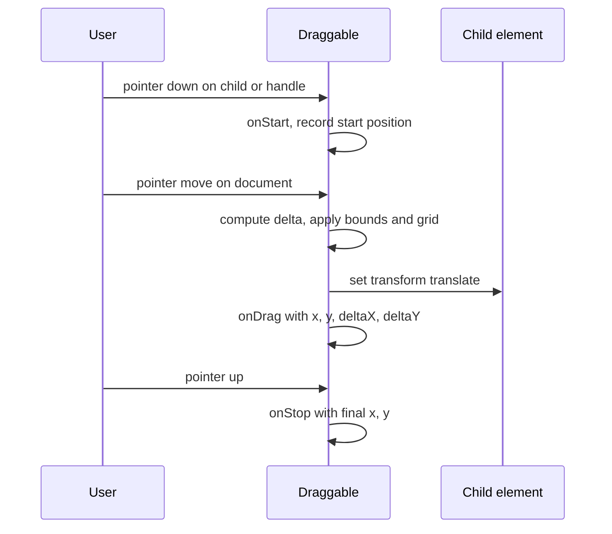
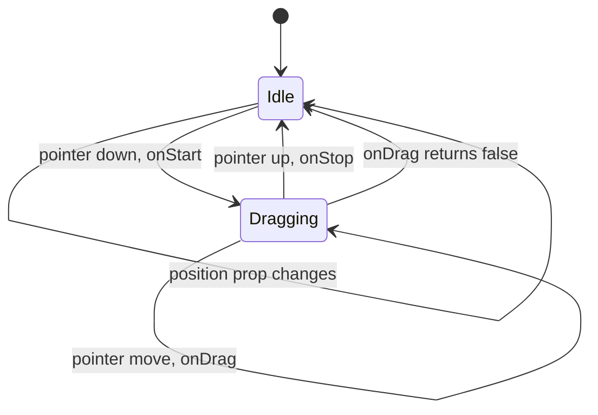
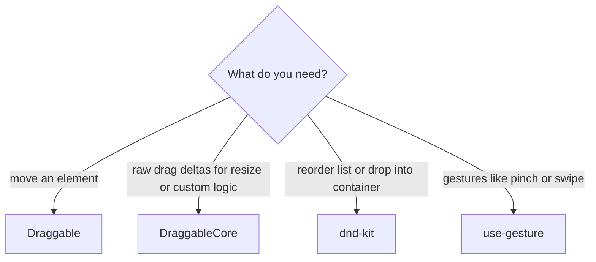

## 1. What it is

**react-draggable is a React component that makes a single element freely movable with mouse or touch by applying a CSS transform as the pointer moves.**

Think of a fridge magnet. You can pick it up and put it anywhere on the fridge door, but not off the edge of the door. react-draggable turns an element into a magnet: it follows your pointer, can be limited to a region (`bounds`), to one direction (`axis`), or to snap points (`grid`).

The problem it solves: dragging by hand means listening to `mousedown`, then `mousemove` and `mouseup` on the whole document, handling touch events separately, preventing text selection while dragging, computing deltas, clamping to bounds and applying transforms. react-draggable packages that into one wrapper component with callbacks.

> **Important:** this is for **moving an element** (a floating widget, a dialog). It is not a list reordering or drag-and-drop between containers library. For sortable lists or kanban boards, use dnd-kit.

## 2. Core concepts

### [Beginner] Draggable wraps one child and moves it with transform

```tsx
import { useRef } from 'react';
import Draggable from 'react-draggable';

export function FloatingCalculator() {
  const nodeRef = useRef<HTMLDivElement>(null);
  return (
    <Draggable nodeRef={nodeRef}>
      <div ref={nodeRef} className="fixed bottom-4 right-4 w-64 rounded bg-white p-3 shadow-lg">
        Loan calculator
      </div>
    </Draggable>
  );
}
```

Draggable adds `transform: translate(x px, y px)` to the child. The element stays in the same place in the layout; only its painted position moves.

> **Why transform:** Changing `transform` does not trigger layout recalculation for other elements, and browsers can composite it on the GPU. Changing `top/left` would force layout on every mouse move and feel janky.



### [Beginner] nodeRef and the findDOMNode deprecation

Older react-draggable used `ReactDOM.findDOMNode` to find the child's DOM node. `findDOMNode` was deprecated (StrictMode warns about it) and **removed in React 19**. The fix is `nodeRef`: create a ref, pass it to Draggable, and attach the same ref to the child DOM element.

```tsx
const nodeRef = useRef<HTMLDivElement>(null);
<Draggable nodeRef={nodeRef}>
  <div ref={nodeRef}>Drag me</div>
</Draggable>;
```

> **Outdated:** Code without `nodeRef` logs "findDOMNode is deprecated in StrictMode" on React 18 and breaks on React 19. Always pass `nodeRef`. If the child is a custom component, it must forward the ref to a DOM element.

### [Beginner] axis, bounds and grid

```tsx
<Draggable
  nodeRef={nodeRef}
  axis="x"                        // 'both' | 'x' | 'y' | 'none'
  bounds="parent"                 // 'parent' | CSS selector | { left, top, right, bottom }
  grid={[25, 25]}                 // snap every 25px
>
  <div ref={nodeRef}>Slider knob</div>
</Draggable>
```

- `bounds="parent"` keeps the element inside its offset parent.
- `bounds="body"` or any selector uses that element's box.
- An object `{ left: 0, top: 0, right: 300, bottom: 200 }` is in pixels relative to the starting position.

### [Intermediate] handle and cancel

Usually you want to drag a dialog only by its header, so users can still select text and click inputs in the body.

```tsx
<Draggable nodeRef={nodeRef} handle=".drag-handle" cancel="button, input">
  <div ref={nodeRef} className="rounded bg-white shadow-xl">
    <header className="drag-handle cursor-move p-2">Quick transfer</header>
    <form className="p-3">
      <input aria-label="Amount" />
      <button type="submit">Send</button>
    </form>
  </div>
</Draggable>
```

### [Intermediate] Callbacks: onStart, onDrag, onStop

Each callback gets the event and a `DraggableData` object: `{ node, x, y, deltaX, deltaY, lastX, lastY }`. Returning `false` from `onStart` or `onDrag` cancels the drag.

```tsx
import Draggable, { type DraggableData, type DraggableEvent } from 'react-draggable';

function handleStop(_e: DraggableEvent, data: DraggableData) {
  savePosition({ x: data.x, y: data.y });
}

function handleStart(_e: DraggableEvent) {
  if (isLocked) return false; // cancels dragging
}

<Draggable nodeRef={nodeRef} onStart={handleStart} onStop={handleStop}>
  <div ref={nodeRef}>Widget</div>
</Draggable>;
```

### [Intermediate] Uncontrolled vs controlled position

- **Uncontrolled:** Draggable keeps position in its own state. Use `defaultPosition` for the start.
- **Controlled:** you pass `position` and update it in `onDrag`/`onStop`. Use this when you need to persist, reset, or move the element programmatically.

```tsx
type Pos = { x: number; y: number };

export function PersistentWidget() {
  const nodeRef = useRef<HTMLDivElement>(null);
  const [pos, setPos] = useState<Pos>(() => loadPosition() ?? { x: 0, y: 0 });

  return (
    <>
      <button type="button" onClick={() => setPos({ x: 0, y: 0 })}>Reset position</button>
      <Draggable
        nodeRef={nodeRef}
        position={pos}                                  // controlled
        onDrag={(_e, d) => setPos({ x: d.x, y: d.y })}  // must update, or it snaps back
        onStop={(_e, d) => savePosition({ x: d.x, y: d.y })}
        bounds="body"
      >
        <div ref={nodeRef} className="fixed left-4 top-24 w-72 rounded bg-white p-3 shadow">
          Watchlist
        </div>
      </Draggable>
    </>
  );
}
```

> **Gotcha:** In controlled mode, if you pass `position` but do not update it in `onDrag`, the element moves during the drag and then jumps back. That is controlled behaviour working as designed: your state is the truth.



### [Advanced] DraggableCore: callbacks without movement

`DraggableCore` handles the pointer tracking and gives you callbacks, but it does not hold state and does not apply any transform. You decide what dragging means: resize a panel, move an SVG point, scrub a chart range.

```tsx
import { DraggableCore, type DraggableData, type DraggableEvent } from 'react-draggable';

export function ResizablePanel({ children }: { children: React.ReactNode }) {
  const handleRef = useRef<HTMLDivElement>(null);
  const [width, setWidth] = useState(360);

  const onDrag = (_e: DraggableEvent, d: DraggableData) => {
    setWidth((w) => Math.min(720, Math.max(240, w + d.deltaX)));
  };

  return (
    <div style={{ width }} className="relative">
      {children}
      <DraggableCore nodeRef={handleRef} onDrag={onDrag}>
        <div ref={handleRef} className="absolute right-0 top-0 h-full w-1 cursor-col-resize" />
      </DraggableCore>
    </div>
  );
}
```



## 3. Why it's used in this project

- **Floating tools:** a loan or FX calculator, a quick-transfer panel or a support chat that users can move away from the data they are reading.
- **Draggable modals:** a transaction detail dialog moved aside so users can compare it with the table behind it.
- **Resizable panels:** with DraggableCore, a split view between the transaction list and detail pane.
- **Persisted layouts:** dashboard widget positions saved per user.

> **Finance tip:** Never make a draggable element the only way to complete a task (for example, "drag to confirm payment"). Keyboard and screen reader users cannot drag. Always provide a button alternative; WCAG 2.2 (2.5.7 Dragging Movements) requires a single-pointer alternative to dragging.

## 4. Setup & configuration

```bash
npm i react-draggable
```

```tsx
import Draggable from 'react-draggable';

<Draggable
  nodeRef={nodeRef}                // required in practice: avoids findDOMNode (removed in React 19)
  axis="both"                      // 'both' | 'x' | 'y' | 'none'
  handle=".drag-handle"            // only this selector starts a drag
  cancel=".no-drag"                // this selector never starts a drag
  bounds="parent"                  // limit movement area
  grid={[10, 10]}                  // snap step in px
  defaultPosition={{ x: 0, y: 0 }} // uncontrolled starting offset
  position={undefined}             // set to make it controlled
  positionOffset={{ x: 0, y: 0 }}  // extra offset, accepts '%' strings
  scale={1}                        // set if a parent is CSS-scaled, so deltas are correct
  disabled={false}                 // turn dragging off
  defaultClassName="react-draggable"
  defaultClassNameDragging="react-draggable-dragging" // class while dragging, for styling
  onStart={() => {}}
  onDrag={() => {}}
  onStop={() => {}}
>
  <div ref={nodeRef}>...</div>
</Draggable>
```

```css
/* Prevent text selection and show feedback while dragging */
.react-draggable-dragging { cursor: grabbing; user-select: none; opacity: 0.95; }
.drag-handle { cursor: grab; touch-action: none; } /* stop mobile scroll from stealing the drag */
```

## 5. Key features we use

### [Intermediate] Draggable modal by header

```tsx
export function DraggableDialog({ title, onClose, children }: { title: string; onClose: () => void; children: React.ReactNode }) {
  const nodeRef = useRef<HTMLDivElement>(null);
  return createPortal(
    <div className="fixed inset-0 bg-black/30">
      <Draggable nodeRef={nodeRef} handle=".dialog-title" bounds="parent" cancel="button">
        <div ref={nodeRef} role="dialog" aria-modal="true" aria-labelledby="dlg-title" className="absolute left-1/3 top-24 w-[28rem] rounded bg-white shadow-2xl">
          <div className="dialog-title flex cursor-move justify-between p-3">
            <h2 id="dlg-title">{title}</h2>
            <button type="button" onClick={onClose} aria-label="Close">x</button>
          </div>
          <div className="p-3">{children}</div>
        </div>
      </Draggable>
    </div>,
    document.body,
  );
}
```

### [Intermediate] Keyboard alternative

```tsx
const STEP = 20;
function onKeyDown(e: React.KeyboardEvent) {
  const moves: Record<string, Pos> = {
    ArrowLeft: { x: -STEP, y: 0 }, ArrowRight: { x: STEP, y: 0 },
    ArrowUp: { x: 0, y: -STEP }, ArrowDown: { x: 0, y: STEP },
  };
  const m = moves[e.key];
  if (m) { e.preventDefault(); setPos((p) => ({ x: p.x + m.x, y: p.y + m.y })); }
}
// On the handle: tabIndex={0} onKeyDown={onKeyDown} aria-label="Move widget with arrow keys"
```

## 6. Interview questions

#### Q: What is the difference between Draggable and DraggableCore?

`Draggable` is stateful: it tracks position, applies a `transform: translate` to the child, and supports `bounds`, `axis`, `grid`, `defaultPosition` and controlled `position`. `DraggableCore` only tracks the pointer and calls `onStart/onDrag/onStop` with deltas; it moves nothing and holds no state. Use Core when dragging means something other than moving, like resizing or scrubbing.

#### Q: Why do you need nodeRef?

Without it, react-draggable calls `ReactDOM.findDOMNode` to locate the child DOM node. That API breaks component encapsulation, is deprecated, warns under StrictMode, and was removed in React 19. Passing a `nodeRef` and attaching it to the child gives the library the node directly.

#### Q: Controlled vs uncontrolled position: when do you use each?

Uncontrolled (`defaultPosition`) when you only need free movement and do not care where it ends. Controlled (`position` plus updating state in `onDrag`/`onStop`) when you need to persist the position, reset it, sync it with other UI, or move it from code. In controlled mode your state is the source of truth, so forgetting to update it makes the element snap back.

#### Q: Why does react-draggable use CSS transform instead of top and left?

Transform changes do not affect layout of other elements and can be composited on the GPU, so the browser skips layout and often paint on each move, giving smooth 60fps dragging. top/left changes trigger layout. A side effect: the element's layout box stays at its original place, which matters for hit-testing and `bounds` calculations.

#### Q: Would you use react-draggable for a sortable list of payees?

No. It moves one element freely but has no concept of drop targets, sorting, collision detection, auto-scroll, keyboard sorting or screen reader announcements. dnd-kit provides those with sensors, collision strategies and accessibility built in. react-draggable fits floating widgets and draggable dialogs.

## 7. Drawbacks & pain points

- **Old architecture:** class components, findDOMNode legacy, slow maintenance; check React 19 compatibility of the version you install.
- **No accessibility:** no keyboard movement or announcements.
- **Single element only:** no drop zones, sorting or multiple items coordination.
- **Transforms conflict** with your own `transform` on the same element (Draggable overwrites it). Put your transform on an inner element.
- **CSS scale parents** need the `scale` prop, or movement is wrong.

Gotchas that trip devs up:

```tsx
// 1. No nodeRef: StrictMode warning in React 18, crash in React 19
<Draggable><div>Drag</div></Draggable> // BAD

// 2. Your own transform gets overwritten
<Draggable nodeRef={r}><div ref={r} style={{ transform: 'rotate(2deg)' }} /></Draggable> // rotation lost
// GOOD: wrap an inner element with the rotation

// 3. Controlled position without updating
<Draggable nodeRef={r} position={pos}><div ref={r} /></Draggable> // snaps back after drag

// 4. Mobile: page scrolls instead of dragging
// Add touch-action: none on the handle

// 5. Child component that does not forward its ref
<Draggable nodeRef={r}><Card ref={r} /></Draggable> // Card must pass ref to a DOM node
```

## 8. Better alternatives

The ecosystem has moved to **dnd-kit** for drag-and-drop interactions and **@use-gesture/react** for gesture-driven movement (often paired with react-spring or Motion). Motion (formerly Framer Motion) also has a `drag` prop for simple draggable elements.

| Library | Bundle (gzip) | Boilerplate | Accessibility | Learning curve | TypeScript | Popularity | When it wins |
|---|---|---|---|---|---|---|---|
| react-draggable | ~6-8 KB | Low | None | Low | Good | High (legacy) | Simple floating widgets and dialogs |
| dnd-kit | ~10-20 KB core plus sortable | Medium | Keyboard sensor, screen reader announcements | Medium | Very good | Very high | Sortable lists, kanban, drop zones |
| @use-gesture/react | ~8-10 KB | Medium | None (you add it) | Medium | Very good | High | Drag, pinch, wheel, swipe with physics |
| Motion drag prop | ~large if not already used | Very low | Minimal | Low | Very good | Very high | Already using Motion for animation |
| Pragmatic drag and drop (Atlassian) | ~small core | Medium | Guidance and add-ons | Medium | Very good | Growing | Large lists, cross-window, native DnD |

```tsx
// @use-gesture equivalent of a draggable widget
import { useDrag } from '@use-gesture/react';
const [pos, setPos] = useState({ x: 0, y: 0 });
const bind = useDrag(({ offset: [x, y] }) => setPos({ x, y }));
<div {...bind()} style={{ transform: `translate(${pos.x}px, ${pos.y}px)`, touchAction: 'none' }} />;
```

## 9. When NOT to use it

- Reordering lists, moving items between columns, file-like drag and drop: use dnd-kit or Pragmatic drag and drop.
- Multi-touch gestures (pinch zoom on charts, swipe): use @use-gesture.
- Critical flows (confirming payments) where dragging is the only input method.
- Already using Motion: its `drag` prop avoids another dependency.
- Charts with zoom and pan: use the chart library's built-in interactions.

## Cheatsheet

| Prop / API | Meaning |
|---|---|
| `nodeRef` | ref to the child DOM node, always pass it |
| `axis` | `both`, `x`, `y`, `none` |
| `bounds` | `'parent'`, selector, or `{ left, top, right, bottom }` |
| `handle` / `cancel` | selectors that start / never start a drag |
| `grid` | `[x, y]` snap steps |
| `defaultPosition` | uncontrolled start |
| `position` | controlled, update in onDrag |
| `onStart / onDrag / onStop` | `(e, { x, y, deltaX, deltaY, node })`, return false to cancel |
| `scale` | parent CSS scale factor |
| `DraggableCore` | callbacks only, no transform |

```tsx
const nodeRef = useRef<HTMLDivElement>(null);
const [pos, setPos] = useState({ x: 0, y: 0 });

<Draggable
  nodeRef={nodeRef}
  handle=".drag-handle"
  bounds="body"
  position={pos}
  onDrag={(_e, d) => setPos({ x: d.x, y: d.y })}
  onStop={(_e, d) => savePosition({ x: d.x, y: d.y })}
>
  <div ref={nodeRef} className="fixed right-4 top-24 w-72 rounded bg-white shadow">
    <div className="drag-handle cursor-grab p-2" style={{ touchAction: 'none' }}>Quick transfer</div>
    <div className="p-3">...</div>
  </div>
</Draggable>;
```
