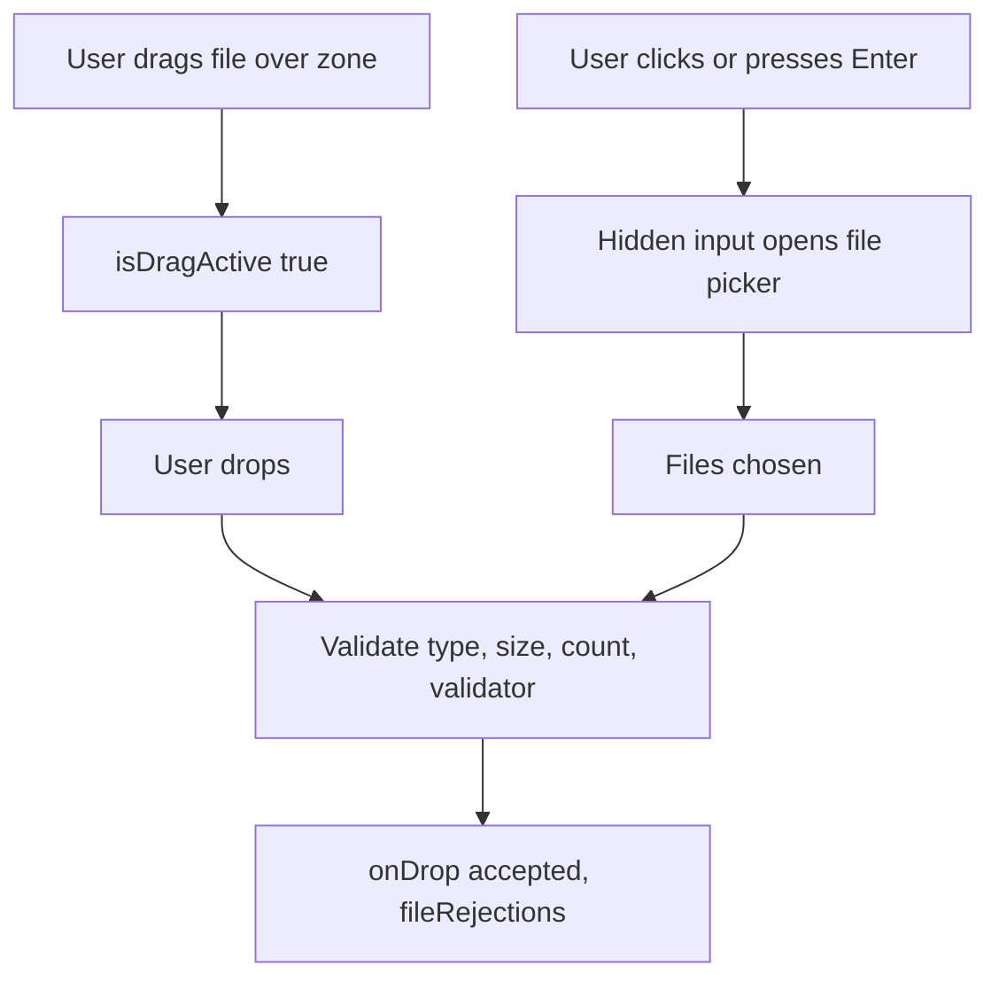
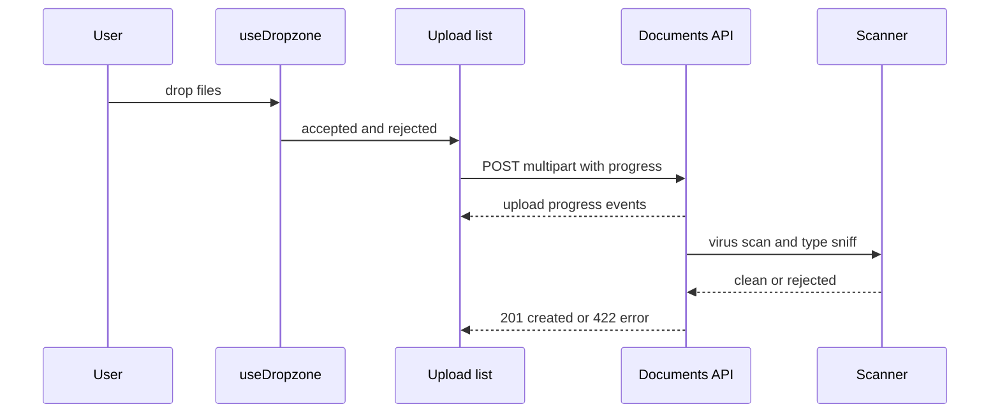

## 1. What it is

**react-dropzone is a headless React hook (`useDropzone`) that adds drag-and-drop and click-to-browse file selection to any element, with built-in type, size and count checks.**

Think of a mail slot in a door. The slot does not care what the door looks like; it just accepts envelopes and can reject parcels that are too big. `useDropzone` is the slot. You decide what the door (your UI) looks like; the hook handles accepting files, rejecting the wrong ones, and telling you what happened.

The problem it solves: native drag-and-drop is awkward. You must handle `dragenter`, `dragover`, `dragleave` and `drop`, call `preventDefault` in the right places, track nested drag events (dragleave fires when moving over a child), connect a hidden `<input type="file">` for click and keyboard users, and validate MIME types and sizes. react-dropzone does all of that and returns props you spread onto your elements.

## 2. Core concepts

### [Beginner] useDropzone, getRootProps and getInputProps

The hook returns **prop getters**. `getRootProps()` returns event handlers and attributes for the drop area. `getInputProps()` returns props for a hidden file input, used for clicking and keyboard access.

```tsx
import { useCallback } from 'react';
import { useDropzone } from 'react-dropzone';

export function ReceiptDrop() {
  const onDrop = useCallback((acceptedFiles: File[]) => {
    console.log(acceptedFiles.map((f) => `${f.name} ${f.size}B ${f.type}`));
  }, []);

  const { getRootProps, getInputProps, isDragActive } = useDropzone({ onDrop });

  return (
    <div {...getRootProps({ className: 'rounded border-2 border-dashed p-6 text-center' })}>
      <input {...getInputProps()} />
      {isDragActive ? <p>Drop the files here</p> : <p>Drag receipts here, or click to choose</p>}
    </div>
  );
}
```

> **Why prop getters:** You may need your own `onClick` or `className` on the same element. Passing them into `getRootProps({ onClick })` lets the library merge your handlers with its own instead of one overwriting the other.



### [Beginner] Drag state flags

```tsx
const { isDragActive, isDragAccept, isDragReject, isFocused } = useDropzone({ accept: { 'application/pdf': ['.pdf'] } });

const border = isDragReject ? 'border-red-500' : isDragAccept ? 'border-green-500' : isFocused ? 'border-blue-500' : 'border-slate-300';
```

> **Gotcha:** During a drag, browsers often do not expose file names, and on some platforms not even reliable MIME types. `isDragReject` is a best-effort hint. The real check happens on drop.

### [Beginner] The accept MIME map

Since v14, `accept` is an object: keys are MIME types (wildcards allowed), values are file extensions. The extensions are used for the file picker filter and as a fallback check.

```ts
const accept = {
  'application/pdf': ['.pdf'],
  'image/png': ['.png'],
  'image/jpeg': ['.jpg', '.jpeg'],
  'text/csv': ['.csv'],
};
```

> **Outdated:** v13 and earlier accepted a string or array like `accept: 'image/*,.pdf'`. In v14 that logs a warning and does not filter as expected. Use the object form.

> **Gotcha:** `file.type` comes from the operating system, usually based on the file extension. Windows may report CSV files as `application/vnd.ms-excel`. Add every MIME type your users' machines might report, or validate by extension in a custom validator.

### [Intermediate] maxSize, minSize, maxFiles, multiple

```ts
useDropzone({
  accept,
  maxSize: 10 * 1024 * 1024, // bytes: 10 MB
  minSize: 1,                // reject empty files
  maxFiles: 5,               // more than 5 dropped: ALL rejected with too-many-files
  multiple: true,            // false allows one file only
});
```

> **Gotcha:** `maxFiles` does not keep the first 5 of 8 files. It rejects all of them with `too-many-files`. It also only counts the current drop, not files the user added earlier. Track the running total yourself.

### [Intermediate] onDrop: accepted files and fileRejections

`onDrop(acceptedFiles, fileRejections, event)` is called on every drop or selection. Each rejection has the file and a list of errors with a `code` and `message`.

```tsx
import { ErrorCode, type FileRejection } from 'react-dropzone';

const messages: Record<string, string> = {
  [ErrorCode.FileInvalidType]: 'Only PDF, PNG or JPG files are allowed.',
  [ErrorCode.FileTooLarge]: 'Files must be 10 MB or smaller.',
  [ErrorCode.FileTooSmall]: 'The file is empty.',
  [ErrorCode.TooManyFiles]: 'You can upload up to 5 files at a time.',
};

function onDrop(accepted: File[], rejections: FileRejection[]) {
  setFiles((prev) => [...prev, ...accepted]);
  setErrors(
    rejections.map(({ file, errors }) => `${file.name}: ${errors.map((e) => messages[e.code] ?? e.message).join(' ')}`),
  );
}
```

There are also `onDropAccepted(files)` and `onDropRejected(rejections)` if you prefer separate callbacks.

### [Intermediate] Custom validator

`validator(file)` runs after built-in checks for each file. Return `null` if valid, or an error object (or array) to reject.

```ts
import type { FileError } from 'react-dropzone';

const FORBIDDEN_CHARS = /[<>:"/\\|?*]/;

function statementValidator(file: File): FileError | null {
  if (FORBIDDEN_CHARS.test(file.name)) {
    return { code: 'invalid-name', message: 'File name contains invalid characters.' };
  }
  if (file.name.length > 120) {
    return { code: 'name-too-long', message: 'File name must be 120 characters or fewer.' };
  }
  return null;
}
```

> **Gotcha:** The validator is synchronous. You cannot `await` reading the file contents inside it. For content checks (for example reading the first bytes to confirm a PDF signature), do them after `onDrop` and move failures into your own error list.

### [Advanced] Previews with URL.createObjectURL and revoke

`URL.createObjectURL(file)` creates a temporary `blob:` URL pointing to the file in memory, usable as an ``. The browser keeps that memory alive until you call `URL.revokeObjectURL`, or the page unloads.

```tsx
import { useEffect, useMemo } from 'react';

function Previews({ files }: { files: File[] }) {
  const previews = useMemo(
    () => files.map((file) => ({ file, url: file.type.startsWith('image/') ? URL.createObjectURL(file) : null })),
    [files],
  );

  useEffect(() => {
    // Cleanup runs when files change or the component unmounts
    return () => previews.forEach((p) => p.url && URL.revokeObjectURL(p.url));
  }, [previews]);

  return (
    <ul className="grid grid-cols-4 gap-2">
      {previews.map(({ file, url }) => (
        <li key={`${file.name}-${file.lastModified}`}>
          {url ?  : <span>{file.name}</span>}
        </li>
      ))}
    </ul>
  );
}
```

> **Why revoke:** Each blob URL pins the whole file in memory. A user adding and removing twenty 8 MB phone photos leaks 160 MB if you never revoke.

### [Advanced] Uploading with axios progress

The dropzone only selects files. Uploading is your job. Use `FormData`, axios `onUploadProgress`, and `AbortController` for cancel.

```tsx
import axios, { type AxiosProgressEvent } from 'axios';

type UploadState = { file: File; progress: number; status: 'queued' | 'uploading' | 'done' | 'error'; controller?: AbortController };

async function uploadDocument(accountId: string, item: UploadState, onProgress: (pct: number) => void) {
  const form = new FormData();
  form.append('file', item.file);
  form.append('documentType', 'proof-of-address');

  const controller = new AbortController();
  item.controller = controller;

  await api.post(`/accounts/${accountId}/documents`, form, {
    signal: controller.signal,
    // Do NOT set Content-Type manually: the browser adds the multipart boundary
    onUploadProgress: (e: AxiosProgressEvent) => {
      if (e.total) onProgress(Math.round((e.loaded / e.total) * 100));
    },
  });
}
```



## 3. Why it's used in this project

- **KYC and onboarding:** users upload ID documents and proof of address.
- **Transaction disputes:** attach receipts and screenshots to a dispute.
- **Bulk imports:** CSV of payees or transactions for business accounts.
- **Consistent UX:** one `FileDropzone` component with our styling, error messages and limits, reused across forms.
- **Accessibility:** the hidden input keeps keyboard and screen reader users able to pick files.

> **Finance tip:** Uploaded documents contain PII (passport numbers, addresses). Never log file contents, keep previews in memory only (blob URLs, not localStorage), revoke them when the form closes, and do not send files to third-party analytics or error tools.

## 4. Setup & configuration

```bash
npm i react-dropzone
```

There is no global config. Wrap the hook in a shared component with your defaults.

```tsx
// src/components/FileDropzone.tsx
import { useDropzone, type Accept, type FileRejection } from 'react-dropzone';

type Props = {
  onFiles: (files: File[]) => void;
  onRejected: (rejections: FileRejection[]) => void;
  accept?: Accept;
  maxSizeBytes?: number;
  maxFiles?: number;
  disabled?: boolean;
  label: string;
};

export function FileDropzone({
  onFiles,
  onRejected,
  accept = { 'application/pdf': ['.pdf'], 'image/png': ['.png'], 'image/jpeg': ['.jpg', '.jpeg'] },
  maxSizeBytes = 10 * 1024 * 1024,
  maxFiles = 5,
  disabled = false,
  label,
}: Props) {
  const { getRootProps, getInputProps, isDragActive, isDragReject, open } = useDropzone({
    accept,                 // MIME map; extensions also filter the OS picker
    maxSize: maxSizeBytes,  // bytes
    maxFiles,               // over the limit: whole drop rejected
    multiple: maxFiles > 1, // single vs multi select
    disabled,               // ignore drops and clicks
    noClick: false,         // true: clicking the zone does nothing, use open() from a button
    noKeyboard: false,      // true: Enter/Space do not open the picker
    preventDropOnDocument: true, // dropping outside the zone does not navigate to the file
    onDropAccepted: onFiles,
    onDropRejected: onRejected,
  });

  return (
    <div
      {...getRootProps({
        'aria-label': label,
        className: `rounded border-2 border-dashed p-6 ${isDragReject ? 'border-red-500' : isDragActive ? 'border-blue-500' : 'border-slate-300'}`,
      })}
    >
      <input {...getInputProps()} />
      <p>{isDragActive ? 'Release to add files' : 'Drag files here'}</p>
      <button type="button" onClick={open}>Browse files</button>
    </div>
  );
}
```

> **Gotcha:** If the dropzone sits inside a `<form>`, a plain `<button>` defaults to `type="submit"`. Always set `type="button"` on the browse button.

## 5. Key features we use

### [Beginner] Single-file mode for a CSV import

```tsx
const { getRootProps, getInputProps, acceptedFiles } = useDropzone({
  accept: { 'text/csv': ['.csv'], 'application/vnd.ms-excel': ['.csv'] },
  multiple: false,
  maxSize: 2 * 1024 * 1024,
});
const csv = acceptedFiles[0];
```

### [Intermediate] Running total limit across drops

```tsx
const MAX_TOTAL = 5;
function onDrop(accepted: File[]) {
  setFiles((prev) => {
    const room = MAX_TOTAL - prev.length;
    if (accepted.length > room) setError(`You can add ${room} more file(s).`);
    return [...prev, ...accepted.slice(0, Math.max(0, room))];
  });
}
```

### [Intermediate] Basic magic-byte check after drop

```ts
async function looksLikePdf(file: File): Promise<boolean> {
  const head = new Uint8Array(await file.slice(0, 5).arrayBuffer());
  return String.fromCharCode(...head) === '%PDF-';
}
```

This improves UX (fast feedback) but is still client-side. The server must repeat it.

## 6. Interview questions

#### Q: What do getRootProps and getInputProps do, and why are they functions?

`getRootProps` returns drag-and-drop handlers, click and keyboard handlers, `tabIndex` and `role` for the drop area. `getInputProps` returns props for a hidden `<input type="file">` (accept, multiple, onChange, style) that powers the native picker. They are functions (prop getters) so you can pass your own props in and have handlers composed and attributes merged, instead of your `onClick` silently replacing the library's.

#### Q: Why is client-side file validation not security?

Everything in the browser is controlled by the user. `file.type` is derived from the file extension by the OS, so renaming `malware.exe` to `statement.pdf` passes the `accept` check. An attacker can also skip the UI entirely and POST to the API with curl. Client validation is for user experience: fast feedback and fewer wasted uploads. The server must enforce size limits, sniff content (magic bytes), virus-scan, strip metadata if needed, store files outside the web root with random names, and serve them with safe `Content-Type` and `Content-Disposition` headers.

#### Q: How do you show image previews without leaking memory?

Use `URL.createObjectURL(file)` for an ``, and call `URL.revokeObjectURL(url)` when the file is removed or the component unmounts, typically in a `useEffect` cleanup tied to the list of previews. Blob URLs keep the file in memory until revoked or the document unloads.

#### Q: How do you implement upload progress and cancel?

Build `FormData` with the file, send with axios `post`, use `onUploadProgress` (`loaded / total`) to update per-file progress state, and pass an `AbortController.signal` so a cancel button can call `controller.abort()`. Do not set `Content-Type` manually; the browser must add the multipart boundary. Upload files independently so one failure does not block others, and limit concurrency (for example 3 at a time).

#### Q: How does maxFiles behave, and what are the error codes?

If a drop has more files than `maxFiles`, every file in that drop is rejected with `too-many-files`; it does not truncate. It counts the current drop only. Other codes: `file-invalid-type`, `file-too-large`, `file-too-small`, plus any custom codes your `validator` returns. They are available as the `ErrorCode` enum.

> **Interview tip:** Saying "the accept prop is UX, the server is the security boundary" unprompted is a strong signal, especially for a financial company.

## 7. Drawbacks & pain points

- **No upload logic,** retry, chunking or resumable uploads; you build them or use a library like Uppy.
- **MIME types are unreliable** across operating systems (CSV and HEIC are common pain points).
- **maxFiles semantics** surprise people (rejects all, per drop only).
- **Folder drops** and very large file counts behave differently across browsers.
- **Testing** drag-and-drop in jsdom requires crafting `DataTransfer`-like events; using `userEvent.upload` on the hidden input is easier.

Gotchas that trip devs up:

```tsx
// 1. Old accept format in v14
useDropzone({ accept: 'image/*' });                // BAD: warning, no filtering
useDropzone({ accept: { 'image/*': [] } });        // GOOD

// 2. Forgetting getInputProps: click and keyboard do nothing
<div {...getRootProps()}>Drop here</div>           // BAD: no <input {...getInputProps()} />

// 3. Putting the input props on a visible input you also style: fine,
//    but do not add your own onChange that ignores the library's; pass it into getInputProps({ onChange })

// 4. Setting Content-Type for FormData
api.post(url, form, { headers: { 'Content-Type': 'multipart/form-data' } }); // boundary missing in some setups
api.post(url, form);                                                        // GOOD: let the browser set it

// 5. Never revoking preview URLs
const url = URL.createObjectURL(file); // must be paired with URL.revokeObjectURL(url)
```

## 8. Better alternatives

| Option | Bundle (gzip) | Boilerplate | Features | Learning curve | TypeScript | Popularity | When it wins |
|---|---|---|---|---|---|---|---|
| react-dropzone | ~8-10 KB | Low | Selection, validation, drag states | Low | Good | Very high | Custom-styled drop areas in forms |
| Native input type file | ~0 | Very low | Picker only | Very low | n/a | Universal | Simple single-file fields |
| Uppy | ~large (modular) | Medium | Full UI, resumable (tus), S3, retries | Medium | Good | Medium-high | Big files, resumable, multi-source uploads |
| FilePond (react-filepond) | ~20-30 KB | Low | UI, previews, image transforms | Low | Fair | Medium | Polished out-of-the-box uploader UI |
| UI kit components (Mantine Dropzone, MUI-based) | ~varies | Low | Styled wrapper, often on react-dropzone | Low | Good | Medium | Already using that kit |

## 9. When NOT to use it

- A single, simple file field where `<input type="file" accept=".pdf">` is enough.
- Very large files (hundreds of MB) needing chunked or resumable uploads: use Uppy with tus or direct-to-S3 multipart.
- When you think it secures uploads: it does not; server validation is mandatory regardless.
- Mobile-first flows that mostly use the camera; a native input with `capture` may be simpler.

## Cheatsheet

| Option / return | Meaning |
|---|---|
| `accept` | `{ 'application/pdf': ['.pdf'] }` MIME map |
| `maxSize` / `minSize` | bytes |
| `maxFiles` / `multiple` | count limit (rejects whole drop) / single vs multi |
| `validator(file)` | return `null` or `{ code, message }` |
| `onDrop(accepted, rejections, event)` | every drop or selection |
| `onDropAccepted` / `onDropRejected` | split callbacks |
| `noClick`, `noKeyboard`, `disabled` | interaction toggles |
| `getRootProps()`, `getInputProps()` | spread on zone and hidden input |
| `isDragActive`, `isDragAccept`, `isDragReject`, `isFocused` | UI state |
| `open()` | open picker from your own button |
| `acceptedFiles`, `fileRejections` | last result |
| Error codes | `file-invalid-type`, `file-too-large`, `file-too-small`, `too-many-files` |

```tsx
const { getRootProps, getInputProps, isDragActive, open } = useDropzone({
  accept: { 'application/pdf': ['.pdf'], 'image/*': ['.png', '.jpg', '.jpeg'] },
  maxSize: 10 * 1024 * 1024,
  maxFiles: 5,
  validator: (f) => (f.name.length > 120 ? { code: 'name-too-long', message: 'Name too long' } : null),
  onDrop: (accepted, rejections) => { addFiles(accepted); showErrors(rejections); },
  noClick: true,
});

<div {...getRootProps()}>
  <input {...getInputProps()} />
  <p>{isDragActive ? 'Drop here' : 'Drag files'}</p>
  <button type="button" onClick={open}>Browse</button>
</div>;
```
