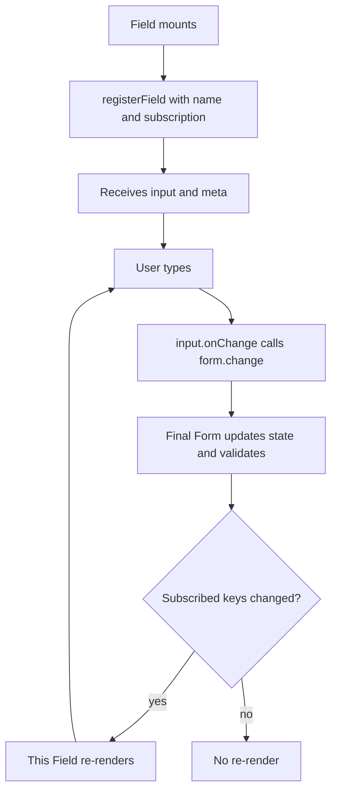
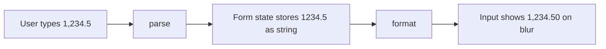
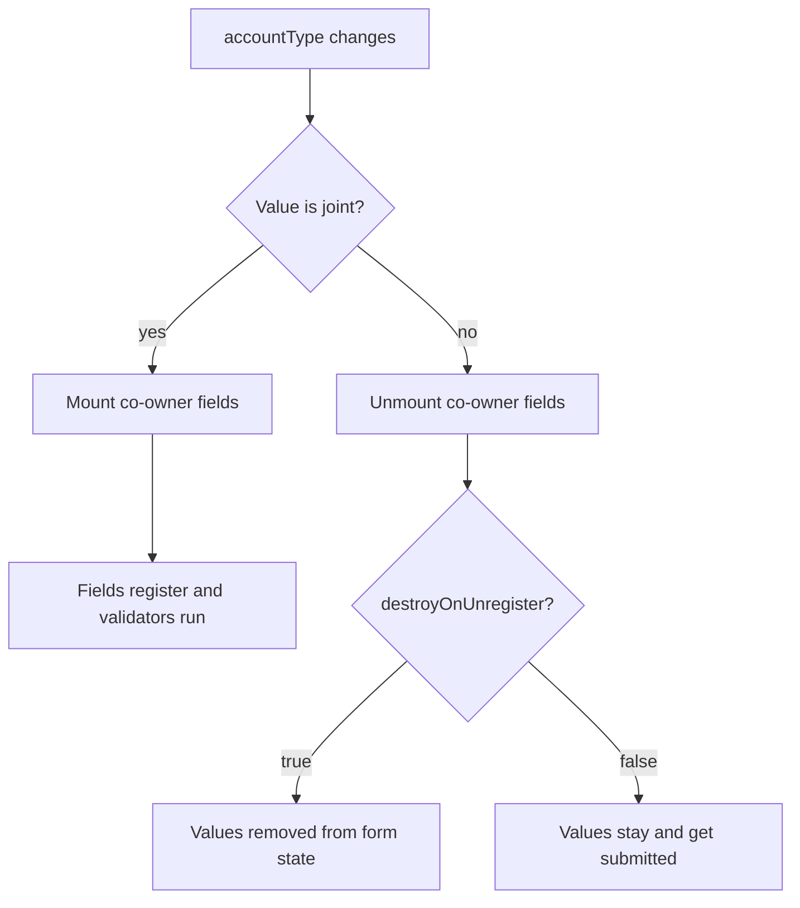
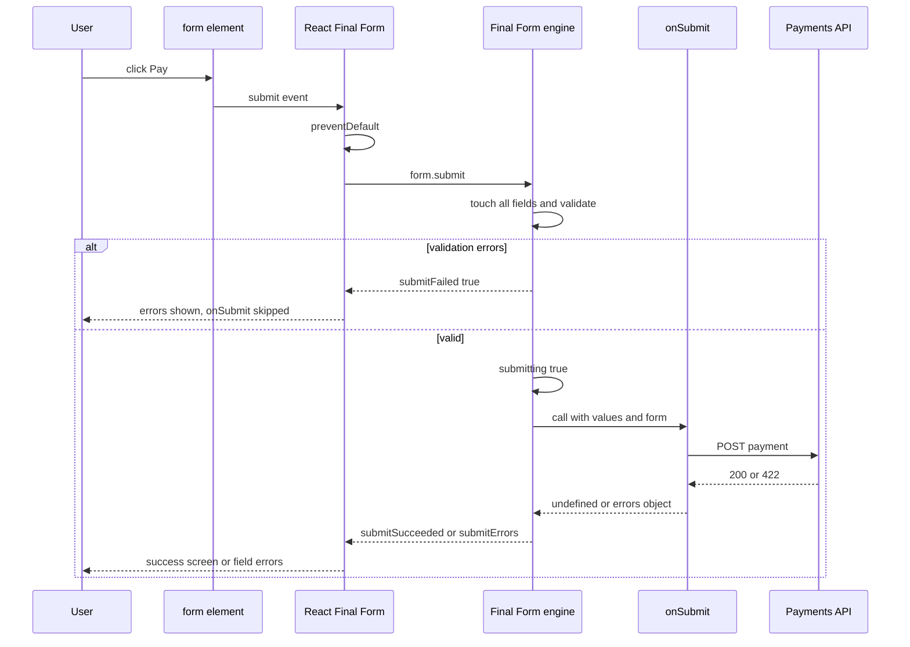

## 1. What it is

**React Final Form (RFF) is a thin React binding for the Final Form engine: `<Form>` creates the engine, `<Field>` subscribes one input to it, and hooks let any component read or drive form state.**

Analogy: Final Form is the bank's core ledger system. React Final Form is the set of teller windows. Each window (a `Field`) only shows the account it is serving. The ledger does the bookkeeping. The windows just display and collect.

The problem it solves: wiring inputs to form state by hand means writing `value`, `onChange`, `onBlur`, error display and touched tracking for every input, and usually re-rendering the whole form on every keystroke. RFF gives each field a ready-made `input` object (spread it onto your `<input>`) and a `meta` object (errors, touched, dirty), and it keeps re-renders local to the field that changed.

> **Why:** RFF itself holds almost no logic. All the state rules (pristine, touched, validation order, submission) come from `final-form`. If you understand the engine, RFF is just "subscribe on mount, unsubscribe on unmount, re-render when notified."

## 2. Core concepts

### [Beginner] The `<Form>` component and the render prop

`<Form>` creates a Final Form instance once (on mount) and passes form state to a render function. You must render a `<form>` yourself and connect `handleSubmit`.

```tsx
import { Form } from 'react-final-form';

interface PaymentValues {
  payeeName: string;
  amount: string;
  reference?: string;
}

export function PaymentForm({ onPay }: { onPay: (v: PaymentValues) => Promise<void> }) {
  return (
    <Form<PaymentValues>
      onSubmit={onPay}
      initialValues={{ payeeName: '', amount: '' }}
      render={({ handleSubmit, submitting, pristine }) => (
        <form onSubmit={handleSubmit} noValidate>
          {/* fields go here */}
          <button type="submit" disabled={submitting || pristine}>
            {submitting ? 'Sending...' : 'Pay'}
          </button>
        </form>
      )}
    />
  );
}
```

`handleSubmit` does three things: calls `event.preventDefault()`, calls `form.submit()`, and returns the submit promise (if `onSubmit` is async). You can also use `children` as a function instead of `render`; they are equivalent.

> **Gotcha:** Forgetting `onSubmit={handleSubmit}` on the `<form>` element makes the browser do a full page POST/GET. In a finance app this can leak values into the URL query string.

### [Beginner] `<Field>`: input and meta

`<Field name="...">` registers a field with the engine and gives you two objects:

- `input`: `{ name, value, onChange, onBlur, onFocus, checked?, type?, multiple? }`. Spread it onto a DOM input.
- `meta`: `{ error, touched, dirty, pristine, active, visited, submitError, submitting, valid, invalid, validating, initial, modified, dirtySinceLastSubmit }`.

```tsx
import { Field } from 'react-final-form';

<Field<string> name="payeeName">
  {({ input, meta }) => (
    <div>
      <label htmlFor="payeeName">Payee name</label>
      <input {...input} id="payeeName" type="text" autoComplete="off" />
      {meta.touched && meta.error && <span role="alert">{meta.error}</span>}
    </div>
  )}
</Field>
```

There are three ways to render a field, in order of precedence: `render` prop, `children` as a function, or `component`.

```tsx
// 1. component: a string tag or your own component
<Field name="reference" component="input" type="text" placeholder="Reference" />

// 2. render prop
<Field name="reference" render={({ input }) => <input {...input} />} />

// 3. children function (shown above)
```

```tsx
import type { FieldRenderProps } from 'react-final-form';

// A reusable text field component used with `component=`
function TextInput({ input, meta, label }: FieldRenderProps<string> & { label: string }) {
  const error = meta.touched && (meta.error || (!meta.dirtySinceLastSubmit && meta.submitError));
  return (
    <label>
      {label}
      <input {...input} aria-invalid={!!error} />
      {error && <span role="alert">{error}</span>}
    </label>
  );
}

<Field name="payeeName" component={TextInput} label="Payee name" />;
```

> **Why:** Extra props passed to `<Field>` (like `label`) are forwarded to your component. That is how you build a design-system field once and reuse it everywhere.

### [Beginner] Checkbox, radio and select fields

Pass `type` so RFF knows to use `checked` instead of `value`.

```tsx
<Field name="acceptTerms" type="checkbox">
  {({ input }) => <input {...input} id="terms" />}{/* input.checked is set */}
</Field>

<Field name="accountType" type="radio" value="individual" component="input" />
<Field name="accountType" type="radio" value="joint" component="input" />

<Field name="currency" component="select">
  <option value="USD">USD</option>
  <option value="EUR">EUR</option>
</Field>
```



### [Intermediate] Field-level validation and compose helpers

`validate` on a field receives `(value, allValues, meta)` and returns an error or `undefined`. To run several rules, write a tiny `composeValidators` helper. The first error wins.

```tsx
type Validator<T = string> = (value: T, allValues: object) => string | undefined;

const required: Validator = (v) => (v ? undefined : 'Required');
const isAmount: Validator = (v) =>
  /^\d+(\.\d{1,2})?$/.test(v ?? '') ? undefined : 'Use up to 2 decimals';
const minAmount =
  (min: number): Validator =>
  (v) =>
    Number(v) >= min ? undefined : `Minimum is ${min.toFixed(2)}`;
const maxAmount =
  (max: number): Validator =>
  (v) =>
    Number(v) <= max ? undefined : `Maximum is ${max.toFixed(2)}`;

const composeValidators =
  <T,>(...validators: Validator<T>[]): Validator<T> =>
  (value, allValues) =>
    validators.reduce<string | undefined>(
      (error, validator) => error ?? validator(value, allValues),
      undefined,
    );

<Field
  name="amount"
  validate={composeValidators(required, isAmount, minAmount(0.01), maxAmount(10_000))}
  component={TextInput}
  label="Amount"
/>;
```

> **Gotcha:** Do not create the composed validator inline if it depends on props that change every render. RFF re-registers the validator when the function identity changes, which re-runs validation. Hoist it or wrap it in `useMemo`.

### [Intermediate] Record-level validation on `<Form>`

```tsx
const validate = (v: TransferValues) => {
  const errors: Partial<Record<keyof TransferValues, string>> = {};
  if (v.fromAccountId && v.fromAccountId === v.toAccountId) {
    errors.toAccountId = 'Choose a different account';
  }
  return errors;
};

<Form<TransferValues> onSubmit={onSubmit} validate={validate} render={/* ... */} />;
```

Use this for cross-field rules or a single schema (Zod) for the whole form.

### [Intermediate] parse and format (currency parsing)

`parse` runs on the way **in** (input to form state). `format` runs on the way **out** (form state to input). This lets the stored value differ from what the user sees.



```tsx
// Strip everything except digits and one decimal point. Keep it a STRING.
const parseMoney = (raw: string): string => {
  if (!raw) return '';
  const cleaned = raw.replace(/[^\d.]/g, '');
  const [whole, ...rest] = cleaned.split('.');
  return rest.length ? `${whole}.${rest.join('').slice(0, 2)}` : whole;
};

const usd = new Intl.NumberFormat('en-US', { minimumFractionDigits: 2, maximumFractionDigits: 2 });
const formatMoney = (value: string | undefined): string =>
  value ? usd.format(Number(value)) : '';

<Field<string>
  name="amount"
  parse={parseMoney}
  format={formatMoney}
  formatOnBlur // only format when the user leaves the field
>
  {({ input, meta }) => (
    <div>
      <span aria-hidden>$</span>
      <input {...input} inputMode="decimal" aria-label="Amount in US dollars" />
      {meta.touched && meta.error && <span role="alert">{meta.error}</span>}
    </div>
  )}
</Field>;
```

> **Why `formatOnBlur`:** If `format` runs on every keystroke, typing "1234" instantly becomes "1,234.00" and the caret jumps to the end. Formatting only on blur lets the user type freely, then shows a clean value.

> **Finance tip:** Store the parsed value as a decimal **string** (`"1234.50"`), and convert to integer cents (`123450`) only at the API boundary. Floats like `0.1 + 0.2` produce `0.30000000000000004`.

> **Gotcha:** The default `parse` converts an empty string to `undefined`. So a cleared optional field disappears from `values` rather than being `''`. If your API expects `''` or `null`, pass `parse={(v) => v}` or use `allowNull`.

```ts
// At the API boundary
const toCents = (decimal: string): number => {
  const [whole, frac = ''] = decimal.split('.');
  return Number(whole) * 100 + Number(frac.padEnd(2, '0').slice(0, 2));
};
toCents('1234.5'); // 123450
```

### [Intermediate] The `subscription` prop

By default, `<Form>` and `<Field>` subscribe to **everything**. That means the `<Form>` render function re-runs on every keystroke because `values` changed. Narrow it.

```tsx
<Form<PaymentValues>
  onSubmit={onPay}
  subscription={{ submitting: true, pristine: true, submitError: true }}
  render={({ handleSubmit, submitting, pristine, submitError }) => (
    <form onSubmit={handleSubmit}>
      <Field name="payeeName" subscription={{ value: true, error: true, touched: true }}>
        {({ input, meta }) => <TextBox input={input} meta={meta} />}
      </Field>
      {submitError && <div role="alert">{submitError}</div>}
      <button disabled={submitting || pristine}>Pay</button>
    </form>
  )}
/>
```

Now typing in `payeeName` re-renders only that field. The `<Form>` render function re-runs only when `submitting`, `pristine` or `submitError` change.

> **Interview tip:** Mention that the default "subscribe to all" is chosen for convenience, and that you narrow subscriptions as a performance optimization on large forms. Measure with React DevTools Profiler first.

### [Intermediate] FormSpy

`<FormSpy>` subscribes to form state anywhere inside `<Form>` without registering a field. Use it for live previews, autosave, or debug output.

```tsx
import { FormSpy } from 'react-final-form';

<FormSpy<PaymentValues> subscription={{ values: true }}>
  {({ values }) => (
    <p>
      You are sending <strong>{values.amount ? usd.format(Number(values.amount)) : '0.00'}</strong> to{' '}
      {values.payeeName || '...'}
    </p>
  )}
</FormSpy>

{/* onChange mode: no rendering, just side effects */}
<FormSpy<PaymentValues>
  subscription={{ values: true, dirty: true }}
  onChange={({ values, dirty }) => {
    if (dirty) saveDraft(values); // debounce in real code
  }}
/>
```

### [Intermediate] Hooks: useField, useForm, useFormState

Hooks are the modern way to write custom field components.

```tsx
import { useField, useForm, useFormState } from 'react-final-form';

function AmountInput({ name }: { name: string }) {
  const { input, meta } = useField<string>(name, {
    parse: parseMoney,
    format: formatMoney,
    formatOnBlur: true,
    validate: composeValidators(required, isAmount),
    subscription: { value: true, error: true, touched: true, submitError: true },
  });
  return (
    <>
      <input {...input} inputMode="decimal" />
      {meta.touched && (meta.error || meta.submitError) && (
        <span role="alert">{meta.error ?? meta.submitError}</span>
      )}
    </>
  );
}

function ClearButton() {
  const form = useForm<PaymentValues>(); // FormApi, never re-renders by itself
  return <button type="button" onClick={() => form.reset()}>Clear</button>;
}

function SubmitBar() {
  const { submitting, invalid } = useFormState({ subscription: { submitting: true, invalid: true } });
  return <button type="submit" disabled={submitting || invalid}>Submit</button>;
}
```

> **Gotcha:** `useFormState()` with no subscription subscribes to everything, so the component re-renders on every keystroke. Always pass a subscription.

### [Advanced] initialValues and keepDirtyOnReinitialize

When the `initialValues` prop changes (compared shallowly by default), RFF calls `form.initialize(newValues)`. This resets the form to the new values.

```tsx
function EditAccountForm({ accountId }: { accountId: string }) {
  const { data: account } = useAccount(accountId); // server data, refetches in background

  // Memoize so a new object is not created every render
  const initialValues = useMemo(
    () => (account ? { nickname: account.nickname, alertsEmail: account.alertsEmail } : undefined),
    [account],
  );

  return (
    <Form
      onSubmit={saveAccount}
      initialValues={initialValues}
      keepDirtyOnReinitialize // a background refetch will not wipe what the user is typing
      render={/* ... */}
    />
  );
}
```

> **Gotcha:** Passing `initialValues={{ address: { line1: '' } }}` inline creates a new nested object each render. The shallow comparison sees a different `address` reference and re-initializes, wiping user input. Use `useMemo` or pass `initialValuesEqual` with a deep-equal function.

### [Advanced] Conditional fields

Show fields based on other values. Pair this with `destroyOnUnregister` so hidden values are not submitted.

```tsx
function Condition({ when, is, children }: { when: string; is: unknown; children: React.ReactNode }) {
  const { input } = useField(when, { subscription: { value: true } });
  return input.value === is ? <>{children}</> : null;
}

<Form<AccountOpeningValues>
  onSubmit={openAccount}
  destroyOnUnregister // unmounted fields lose their value
  render={({ handleSubmit }) => (
    <form onSubmit={handleSubmit}>
      <Field name="accountType" component="select">
        <option value="individual">Individual</option>
        <option value="joint">Joint</option>
      </Field>

      <Condition when="accountType" is="joint">
        <Field name="coOwnerName" component={TextInput} label="Co-owner name" validate={required} />
        <Field name="coOwnerSsnLast4" component={TextInput} label="Co-owner SSN (last 4)" />
      </Condition>
    </form>
  )}
/>;
```



> **Finance tip:** For PII such as SSNs or tax IDs, leftover hidden values are a compliance problem, not just a bug. Use `destroyOnUnregister` or explicitly strip hidden sections in `onSubmit`.

### [Advanced] The submit flow end to end



```tsx
import { FORM_ERROR } from 'final-form';

const onPay = async (values: PaymentValues) => {
  try {
    await api.post('/payments', { ...values, amountCents: toCents(values.amount) });
  } catch (err) {
    if (isApiError(err) && err.status === 422) {
      return { amount: err.body.message }; // shows under the Amount field
    }
    return { [FORM_ERROR]: 'Payment could not be sent. You were not charged.' };
  }
  return undefined;
};
```

## 3. Why it's used in this project

- **Long onboarding and KYC forms** (personal details, address history, employment, beneficiaries) stay responsive because each field subscribes only to itself.
- **Money inputs** use `parse`/`format` to keep a clean decimal string in state while showing formatted currency.
- **Server rejections** (insufficient funds, daily limit, duplicate payment) map to field errors via submission errors, and `FORM_ERROR` handles generic failures.
- **Edit forms with background refetch** use `keepDirtyOnReinitialize` so a cache refresh does not wipe what an operator is typing.
- **Conditional PII sections** (joint owner, trust details) use `destroyOnUnregister` to avoid submitting hidden sensitive data.
- **Unsaved-changes prompts** before session timeout read `dirty` via `useFormState`.

> **Finance tip:** For a session-timeout warning, subscribe to `dirty` only and show "You have unsaved changes; your session expires in 60 seconds." Never auto-submit a money movement on timeout.

## 4. Setup & configuration

```bash
npm install final-form react-final-form
# optional
npm install final-form-arrays react-final-form-arrays final-form-focus final-form-calculate
```

> **Outdated:** react-final-form 6.5.x declared peer dependencies up to React 18. On React 19, check for a newer release or use `overrides` in `package.json`. The runtime API works the same.

```tsx
import { Form } from 'react-final-form';
import arrayMutators from 'final-form-arrays';
import createFocusDecorator from 'final-form-focus';

const focusOnError = createFocusDecorator(); // create ONCE, outside the component

<Form<AccountValues>
  // Required. Return undefined, an errors object, or a Promise of either.
  onSubmit={onSubmit}
  // Starting values. Shallow-compared on every render.
  initialValues={initialValues}
  // Custom comparison to avoid unwanted re-initialize.
  initialValuesEqual={(a, b) => JSON.stringify(a) === JSON.stringify(b)}
  // Keep user edits when initialValues change.
  keepDirtyOnReinitialize
  // Record-level validation.
  validate={validateAccount}
  // Mutators (array helpers, custom setters).
  mutators={{ ...arrayMutators }}
  // Decorators. Must be stable references.
  decorators={[focusOnError]}
  // Remove values of unmounted fields.
  destroyOnUnregister
  // What the render function needs. Default: everything.
  subscription={{ submitting: true, pristine: true, submitError: true }}
  render={({ handleSubmit }) => <form onSubmit={handleSubmit}>{/* ... */}</form>}
/>;
```

## 5. Key features we use

### [Beginner] Showing errors only after touch or failed submit

```tsx
const showError = (meta: FieldMetaState<unknown>) =>
  (meta.touched || meta.submitFailed) && (meta.error || (!meta.dirtySinceLastSubmit && meta.submitError));
```

### [Beginner] Typed values with generics

```tsx
<Form<PaymentValues> onSubmit={onPay} render={({ values }) => <pre>{values.amount}</pre>} />
<Field<string> name="amount" />
```

### [Intermediate] Changing a field from outside

```tsx
function UseMaxButton({ available }: { available: string }) {
  const form = useForm();
  return (
    <button type="button" onClick={() => form.change('amount', available)}>
      Use full balance
    </button>
  );
}
```

### [Intermediate] Resetting after a successful submit

```tsx
render={({ handleSubmit, form }) => (
  <form
    onSubmit={async (e) => {
      await handleSubmit(e);
      // handleSubmit also resolves to undefined when validation blocked submit,
      // so check the state flag rather than the return value
      if (form.getState().submitSucceeded) form.restart(); // clear values AND touched state
    }}
  >
```

### [Intermediate] Expensive validator that should not re-run on other fields

```tsx
<Field name="iban" validate={ibanValidator} validateFields={[]} component={TextInput} label="IBAN" />
```

`validateFields={[]}` means "when this field changes, only re-run this field's validator", not every validator in the form.

### [Advanced] Wrapping a third-party input (react-select)

```tsx
<Field<string> name="currency">
  {({ input }) => (
    <Select
      inputId="currency"
      options={currencyOptions}
      value={currencyOptions.find((o) => o.value === input.value) ?? null}
      onChange={(opt) => input.onChange(opt?.value ?? '')}
      onBlur={() => input.onBlur()}
    />
  )}
</Field>
```

> **Why:** Third-party inputs rarely accept a DOM event. `input.onChange` accepts either an event or a raw value, so you can pass the value directly.

## 6. Interview questions

#### Q: Why does `<Form>` re-render on every keystroke by default, and how do you stop it?

Its default subscription is "all form state", which includes `values`. Any change to any value notifies it. Pass a narrow `subscription` prop (for example `{ submitting: true, pristine: true }`) so the render function only re-runs for those keys. Then each `<Field>` handles its own updates, and components that need values use `FormSpy` or `useFormState` with targeted subscriptions.

#### Q: Explain parse and format. How would you build a currency field?

`parse(value, name)` transforms what the input emits before storing it. `format(value, name)` transforms the stored value before giving it to the input. For currency: `parse` strips symbols and commas and limits to two decimals, storing a decimal string like `"1234.50"`. `format` uses `Intl.NumberFormat` to show `1,234.50`. Use `formatOnBlur` so the caret does not jump while typing. Convert to integer cents only at the API boundary. Never store a float.

#### Q: What happens if `initialValues` changes after the form mounts?

RFF shallow-compares the new `initialValues` with the previous ones. If different, it calls `form.initialize`, which replaces values and resets pristine/dirty. That can wipe in-progress edits, so either memoize `initialValues`, provide `initialValuesEqual`, or set `keepDirtyOnReinitialize` to keep fields the user changed.

#### Q: How do you implement conditional fields correctly?

Read the controlling value with `useField(name, { subscription: { value: true } })` or a `Field` render, and mount the dependent fields only when the condition is met. Because field-level validators only run while a field is registered, hidden fields do not block submit. Hidden values remain in state unless you set `destroyOnUnregister` or clear them, which matters for PII.

#### Q: Walk through what happens when the user clicks submit.

`handleSubmit` prevents default and calls `form.submit()`. Final Form marks all registered fields as touched and checks validation. If there are errors, it sets `submitFailed` and does not call `onSubmit`. Otherwise it sets `submitting: true`, calls `onSubmit(values, form)`, and awaits the result. `undefined` means success (`submitSucceeded`). An object means submission errors, shown via `meta.submitError` or `submitError` (from `FORM_ERROR`). `submitting` goes back to `false` and subscribers re-render.

## 7. Drawbacks & pain points

- **Default subscriptions are wasteful.** Many codebases never narrow them and suffer slow large forms.
- **String field names.** `name="amout"` silently creates a new field. No compile-time path checking.
- **Weak TypeScript for nested paths and errors.** `FieldRenderProps` generics help with the value, but the name and error shapes are not checked.
- **Validator identity matters.** Inline validators that change identity cause re-registration.
- **Slow maintenance.** Fewer releases, React 19 peer dependency friction in older versions.
- **Hidden values survive** unless you opt into `destroyOnUnregister`.

Gotchas that trip devs up:

```tsx
// 1. Number inputs and parse
<Field name="quantity" component="input" type="number" />
// value is still a STRING "3". Parse it if you need a number:
<Field name="quantity" component="input" type="number" parse={(v) => (v === '' ? undefined : Number(v))} />

// 2. Decorators created inside the component
function Bad() {
  const focus = createFocusDecorator(); // new decorator every render: breaks
  return <Form decorators={[focus]} onSubmit={submit} render={/* */} />;
}

// 3. Reading `values` from Form render without subscribing to it
<Form subscription={{ submitting: true }} render={({ values }) => values.amount} />
// values is undefined because it was not subscribed.

// 4. Submit button outside <form>
<button onClick={handleSubmit}>Pay</button> // works, but Enter key will not submit
```

## 8. Better alternatives

**React Hook Form** is the dominant choice for new React apps. It registers uncontrolled inputs via refs, so the default re-render surface is already tiny, and it integrates with Zod via `zodResolver`. **TanStack Form** offers fully typed field paths and a framework-agnostic core with first-class async validation and debouncing. For simple server-submitted forms, React 19 Actions (`useActionState`, `useFormStatus`) need no library.

| Library | Bundle (gzip) | Boilerplate | Devtools | Learning curve | TypeScript | Popularity | When it wins |
| --- | --- | --- | --- | --- | --- | --- | --- |
| React Final Form | ~3 kB + ~5 kB core | Medium | None | Medium | OK | Declining | Existing apps already on it |
| React Hook Form | ~10 kB | Low | Yes | Low | Good, typed paths | Very high | Default for new React forms |
| TanStack Form | ~10-13 kB | Medium | Yes | Medium | Excellent | Growing | Complex typed forms, multi-framework |
| Formik | ~13 kB | Medium-high | None | Low | OK | Stagnant | Never for new work |
| React 19 Actions | 0 kB | Low | React DevTools | Low | Good | New | Simple forms, server actions |

```tsx
// Same field in React Hook Form for comparison
const { register, handleSubmit, formState: { errors } } = useForm<PaymentValues>({
  resolver: zodResolver(paymentSchema),
});
<input {...register('payeeName')} />;
{errors.payeeName && <span>{errors.payeeName.message}</span>}
```

## 9. When NOT to use it

- New greenfield projects where React Hook Form or TanStack Form fits and the team has no RFF history.
- Tiny forms (login, search, newsletter signup).
- When you need compile-time-checked nested field names.
- Progressive-enhancement forms that must work without JavaScript.
- React Native projects where a simpler controlled-state approach or React Hook Form is more common.

## Cheatsheet

| API | Use |
| --- | --- |
| `<Form onSubmit initialValues validate mutators decorators subscription render>` | Create form |
| `render={({ handleSubmit, form, submitting, pristine, values }) => ...}` | Render prop |
| `<Field name component/render/children validate parse format formatOnBlur subscription type value>` | One field |
| `({ input, meta }) => ...` | Field render args |
| `<FormSpy subscription onChange>` | Observe form state |
| `useField(name, config)` | Field hook |
| `useForm()` | FormApi (change, reset, submit, mutators) |
| `useFormState({ subscription })` | Form state hook |
| `keepDirtyOnReinitialize`, `initialValuesEqual` | Safe reinitialize |
| `destroyOnUnregister` | Drop hidden field values |
| `validateFields={[]}` | Limit validator re-runs |
| `FORM_ERROR` (from final-form) | Form-level submit error |

```tsx
<Form<PaymentValues>
  onSubmit={onPay}
  subscription={{ submitting: true, submitError: true }}
  render={({ handleSubmit, submitting, submitError }) => (
    <form onSubmit={handleSubmit} noValidate>
      <Field name="amount" parse={parseMoney} format={formatMoney} formatOnBlur
        validate={composeValidators(required, isAmount)}
        subscription={{ value: true, error: true, touched: true, submitError: true }}>
        {({ input, meta }) => (
          <>
            <input {...input} inputMode="decimal" />
            {meta.touched && (meta.error || meta.submitError)}
          </>
        )}
      </Field>
      {submitError && <p role="alert">{submitError}</p>}
      <button disabled={submitting}>Pay</button>
    </form>
  )}
/>
```
