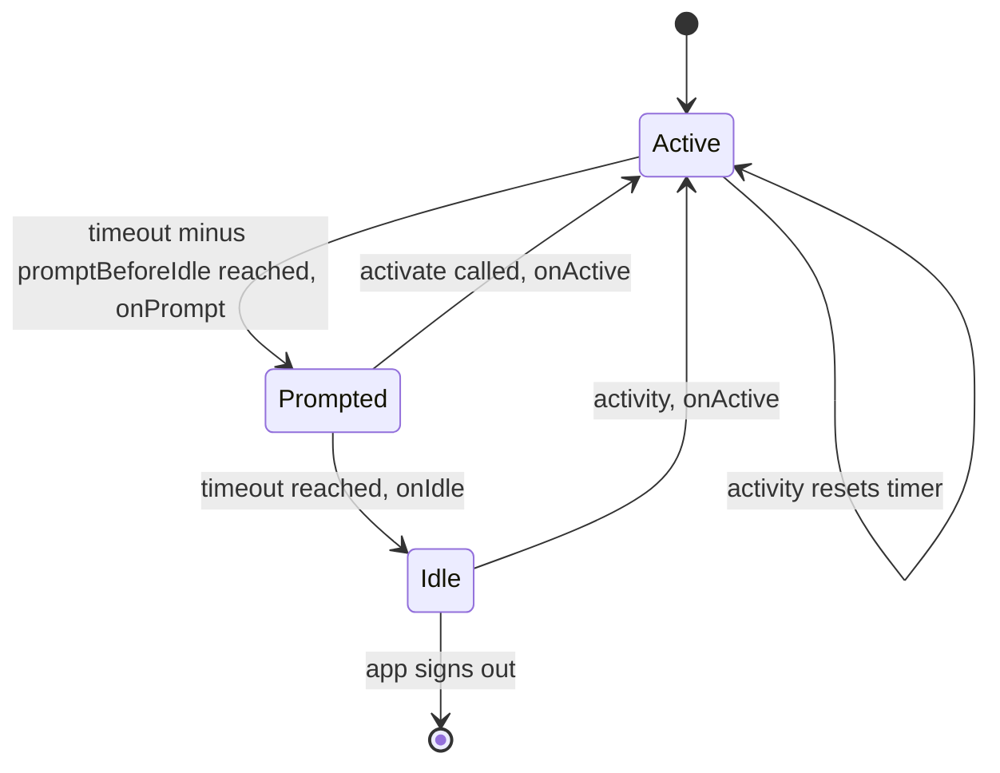
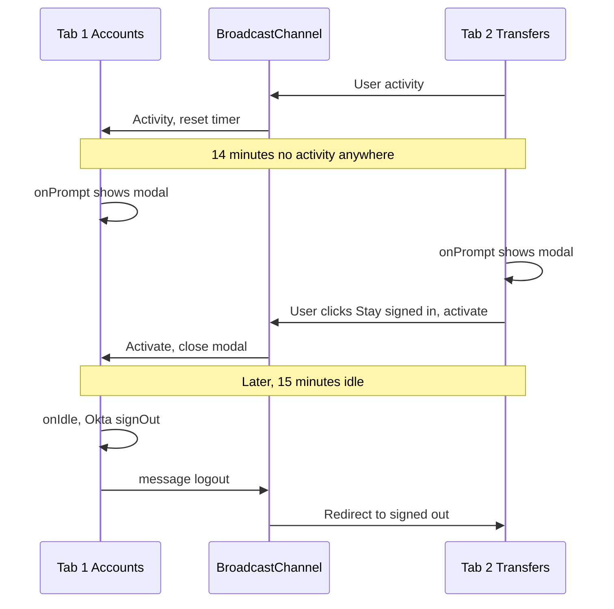
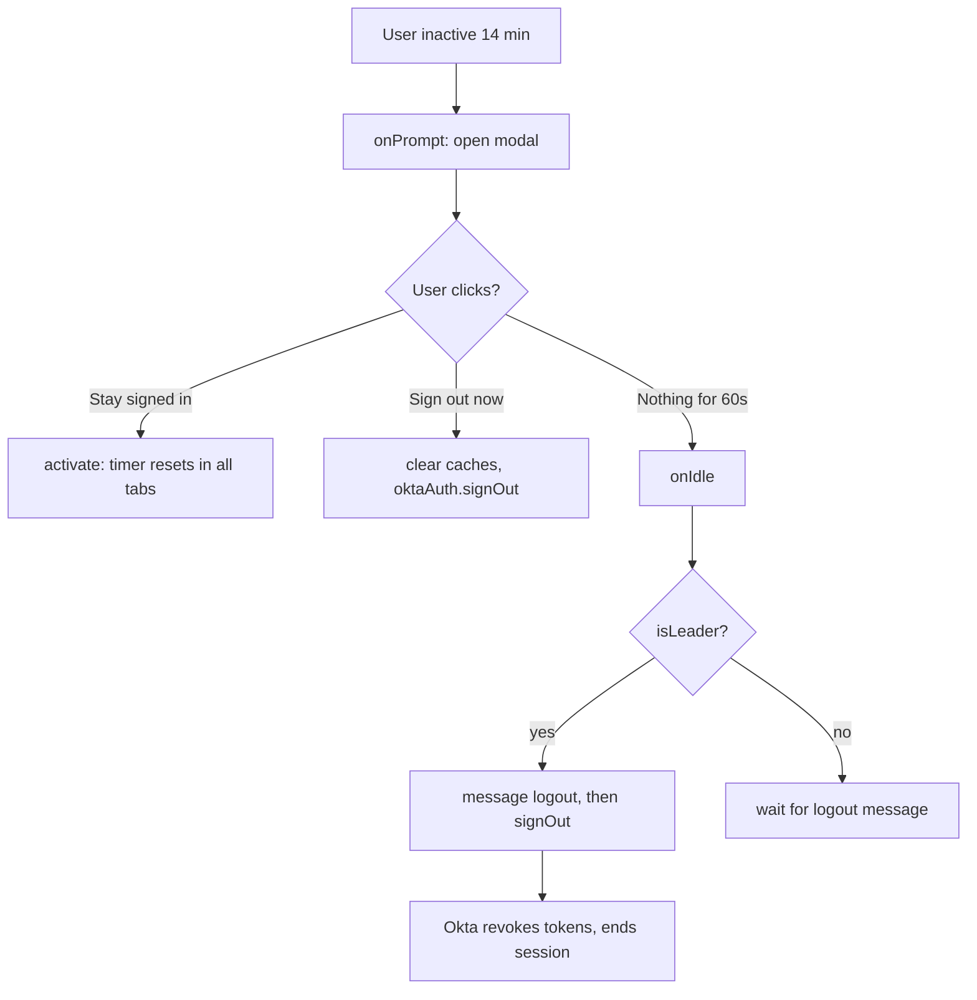

## 1. What it is

**`react-idle-timer` is a React hook library that watches user activity (mouse, keyboard, touch, scroll, visibility) and calls your functions when the user goes idle, is about to go idle, or becomes active again, optionally synchronised across browser tabs.**

Analogy: like the screen lock on your phone. If you do not touch it for a while, it dims (the warning prompt), then locks (logout). Touching it at any point resets the countdown.

The problem it solves: banking and trading apps must not stay signed in on an unattended screen. Writing this yourself means attaching many event listeners, throttling them, handling timers that pause in background tabs, and keeping several open tabs in agreement. The library handles all of that.

## 2. Core concepts

### [Beginner] useIdleTimer basics

```tsx
import { useIdleTimer } from "react-idle-timer";

export function IdleWatcher() {
  useIdleTimer({
    timeout: 15 * 60 * 1000, // ms of inactivity before "idle"
    onIdle: () => console.log("User is idle"),
    onActive: () => console.log("User is back"),
  });
  return null;
}
```

> **Why milliseconds everywhere:** All options and getters use ms, like `setTimeout`. A frequent bug is passing `15` and logging users out after 15 ms.

### [Beginner] Prompt before idle

`promptBeforeIdle` says how many ms **before** `timeout` the `onPrompt` callback fires. The total time is still `timeout`.

```tsx
useIdleTimer({
  timeout: 15 * 60_000,        // idle (logout) at 15 minutes
  promptBeforeIdle: 60_000,    // warn at 14 minutes
  onPrompt: () => setShowWarning(true),
  onIdle: () => logout(),
});
```



> **Gotcha:** While the prompt is showing, normal activity (mouse moves) does **not** reset the timer. That is deliberate: a user nudging the mouse should not silently dismiss a security warning. The user must click "Stay signed in", which calls `activate()`.

> **Outdated:** Older 5.x releases used `promptTimeout` (time *after* timeout). It was deprecated in favour of `promptBeforeIdle`. Many blog posts still show `promptTimeout`.

### [Intermediate] Reading the countdown

The hook returns methods, not state. Call them on an interval for a live countdown.

```tsx
const { getRemainingTime, isPrompted, activate } = useIdleTimer({
  timeout: 15 * 60_000,
  promptBeforeIdle: 60_000,
  onPrompt: () => setOpen(true),
  onIdle: () => logout(),
});

const [secondsLeft, setSecondsLeft] = useState(0);

useEffect(() => {
  const id = setInterval(() => {
    setSecondsLeft(Math.ceil(getRemainingTime() / 1000)); // ms until idle
  }, 500);
  return () => clearInterval(id);
}, [getRemainingTime]);
```

> **Why methods:** Returning live state would re-render your component on every mouse move. Methods let you decide when to read the value, so the timer itself causes zero re-renders.

### [Intermediate] activate vs reset vs other controls

```ts
const timer = useIdleTimer({ timeout: 15 * 60_000 });

timer.activate(); // reset timer AND fire onActive, leave prompted/idle state (use for "Stay signed in")
timer.reset();    // reset timer to initial state, does NOT fire onActive
timer.pause();    // stop counting (e.g. during a long PDF export the user is watching)
timer.resume();   // continue counting
timer.start();    // start manually (with startManually: true)

timer.isIdle();          // boolean
timer.isPrompted();      // boolean
timer.getElapsedTime();  // ms since start
timer.getLastActiveTime(); // Date | null
```

### [Intermediate] events and throttle

```ts
useIdleTimer({
  timeout: 15 * 60_000,
  // Which DOM events count as activity (defaults include mouse, keyboard, touch, wheel, visibilitychange, focus)
  events: ["mousemove", "keydown", "wheel", "mousedown", "touchstart", "touchmove", "visibilitychange"],
  eventsThrottle: 200, // ms: how often activity events are processed internally
  onAction: () => {
    // fires on activity, rate limited by throttle below
  },
  throttle: 1000,      // ms: rate limit for onAction
});
```

> **Why throttle:** `mousemove` can fire 60+ times a second. Without throttling, each event would reset timers and maybe call your callback, wasting CPU and hurting INP on heavy dashboards.

### [Advanced] Cross-tab synchronisation

Users open many tabs. Idle in one tab while working in another must not log them out, and logout in one tab must log out all.

```ts
const { message, isLeader } = useIdleTimer({
  timeout: 15 * 60_000,
  promptBeforeIdle: 60_000,
  crossTab: true,        // share activity and state between tabs via BroadcastChannel
  syncTimers: 200,       // ms: throttle for syncing timer state across tabs
  name: "wealth-idle",   // channel name; separate apps on one origin should differ
  leaderElection: true,  // one tab is elected leader
  onIdle: () => logout(),
  onMessage: (data: { type: "logout" }) => {
    if (data.type === "logout") window.location.assign("/signed-out");
  },
});

// Broadcast to other tabs (emitSelf = false by default)
function logoutEverywhere() {
  message({ type: "logout" }, true); // true = also deliver to this tab
}
```



> **Why leader election:** Without it, every tab would call `oktaAuth.signOut()` at the same moment, racing token revocation and redirects. With `isLeader()`, only one tab does the network work and others just clear UI.

## 3. Why it's used in this project

- **Compliance auto-logout.** Security policy (often driven by PCI DSS, FFIEC-style guidance or internal policy) requires logging out unattended sessions, commonly after 10 to 15 minutes in banking.
- **Warning modal.** Users get a 60-second countdown with "Stay signed in" so they do not lose a half-filled transfer form.
- **Okta integration.** On idle we call `oktaAuth.signOut()`, which revokes tokens and ends the Okta session, not just a local redirect.
- **Multi-tab advisors.** Advisors work across many client tabs; `crossTab` keeps them in sync and logs all out together.
- **Data hygiene.** Logout clears React Query and Redux caches holding balances.

> **Finance tip:** Client-side idle logout is a UX and defence-in-depth control. Okta's session and token lifetimes must enforce the same limit server-side, because a user can disable JavaScript timers.

## 4. Setup & configuration

```bash
npm install react-idle-timer
```

```tsx
// src/session/IdleSessionProvider.tsx
import { IdleTimerProvider } from "react-idle-timer";

export function IdleSessionProvider({ children }: { children: React.ReactNode }) {
  return (
    <IdleTimerProvider
      timeout={15 * 60_000}        // total inactivity before idle, ms
      promptBeforeIdle={60_000}    // show warning this long before idle, ms
      crossTab                     // sync across tabs
      syncTimers={200}             // ms between cross-tab timer syncs
      name="wealth-web-idle"       // BroadcastChannel name
      leaderElection               // one tab performs the logout
      startOnMount                 // default true
      stopOnIdle={false}           // keep listening after idle so onActive can fire
      eventsThrottle={200}         // internal event processing throttle, ms
      disabled={false}             // set true for unauthenticated pages
      onPrompt={() => {}}          // usually handled in a child via the context hook
      onIdle={() => {}}
    >
      {children}
    </IdleTimerProvider>
  );
}

// In children: const timer = useIdleTimerContext();
```

> **Gotcha:** Only enable the timer when the user is authenticated (`disabled={!authState?.isAuthenticated}`), or the login page itself will try to log users out.

## 5. Key features we use

### [Intermediate] Financial compliance auto-logout with Okta and a countdown modal

```tsx
// src/session/SessionTimeout.tsx
import { useEffect, useState } from "react";
import { useIdleTimer } from "react-idle-timer";
import { useOktaAuth } from "@okta/okta-react";
import { useQueryClient } from "@tanstack/react-query";

const TIMEOUT_MS = 15 * 60_000;
const PROMPT_MS = 60_000;

export function SessionTimeout() {
  const { oktaAuth, authState } = useOktaAuth();
  const queryClient = useQueryClient();
  const [open, setOpen] = useState(false);
  const [secondsLeft, setSecondsLeft] = useState(PROMPT_MS / 1000);

  const logout = async (reason: "idle" | "manual") => {
    queryClient.clear(); // remove cached balances and transactions
    await oktaAuth.signOut({
      postLogoutRedirectUri: `${window.location.origin}/signed-out?reason=${reason}`,
    });
  };

  const { activate, getRemainingTime, isLeader, message } = useIdleTimer({
    timeout: TIMEOUT_MS,
    promptBeforeIdle: PROMPT_MS,
    crossTab: true,
    leaderElection: true,
    disabled: !authState?.isAuthenticated,
    onPrompt: () => setOpen(true),
    onActive: () => setOpen(false), // fires in all tabs when one tab activates
    onIdle: () => {
      setOpen(false);
      if (isLeader()) {
        message({ type: "logout" });        // tell followers
        void logout("idle");                // leader revokes tokens
      }
    },
    onMessage: (data: { type: string }) => {
      if (data.type === "logout") {
        queryClient.clear();
        window.location.assign("/signed-out?reason=idle");
      }
    },
  });

  useEffect(() => {
    if (!open) return;
    const id = setInterval(() => setSecondsLeft(Math.ceil(getRemainingTime() / 1000)), 500);
    return () => clearInterval(id);
  }, [open, getRemainingTime]);

  if (!open) return null;
  return (
    <div role="alertdialog" aria-modal="true" aria-labelledby="idle-title" aria-describedby="idle-desc">
      <h2 id="idle-title">Are you still there?</h2>
      <p id="idle-desc" aria-live="polite">
        For your security, you will be signed out in {secondsLeft} seconds.
      </p>
      <button onClick={() => activate()} autoFocus>Stay signed in</button>
      <button onClick={() => logout("manual")}>Sign out now</button>
    </div>
  );
}
```



> **Why `activate()` and not `reset()`:** `activate()` fires `onActive` and syncs to other tabs, so every tab closes its modal. `reset()` resets silently, which can leave other tabs showing a stale warning.

### [Intermediate] Pause during long, user-watched tasks

```ts
const timer = useIdleTimerContext();
async function exportYearlyStatement() {
  timer.pause();
  try { await downloadStatement("2025"); } finally { timer.resume(); }
}
```

## 6. Interview questions

#### Q: How do `timeout` and `promptBeforeIdle` relate?

`timeout` is the total inactivity time until `onIdle`. `promptBeforeIdle` is how long before that point `onPrompt` fires. With `timeout: 15 min` and `promptBeforeIdle: 1 min`, the prompt appears at 14 minutes and idle fires at 15. During the prompt, ordinary activity does not reset the timer; the user must explicitly confirm, which calls `activate()`.

#### Q: What is the difference between `activate()` and `reset()`?

Both restart the countdown. `activate()` also moves the timer out of prompted or idle state, fires `onActive`, and with `crossTab` propagates that to other tabs. `reset()` returns to the initial state without firing `onActive`. Use `activate()` for "Stay signed in" buttons.

#### Q: How do you handle multiple tabs?

Enable `crossTab: true` so activity in any tab resets all tabs via BroadcastChannel. Use `leaderElection` and `isLeader()` so only one tab performs `oktaAuth.signOut()`, and use `message()` / `onMessage` to tell followers to clear state and redirect. Give the channel a unique `name` per app on the same origin.

#### Q: Why is a client-side idle timer not enough for compliance?

The browser is under the user's control: JS can be disabled, timers throttled in background tabs, or the device put to sleep. The server must enforce matching limits: short access tokens, refresh token idle lifetime and Okta session idle timeout. The client timer gives a good UX (warning modal) and clears sensitive data from memory, but the server is the real enforcement.

#### Q: Why does the hook return functions like `getRemainingTime()` instead of state?

To avoid re-renders. Activity events fire constantly. If the hook exposed remaining time as state, the host component would re-render on every tick or mouse move. Methods let you read on demand, for example on a 500 ms interval only while the modal is open.

## 7. Drawbacks & pain points

- **Background tab throttling.** Browsers delay timers in hidden tabs. The library measures elapsed time from timestamps, so idle detection is still correct, but callbacks may fire late until the tab wakes.
- **Device sleep.** A laptop closed for an hour fires `onIdle` only when it wakes; the server-side session must already be dead.
- **Not all activity is DOM events.** Watching a live price ticker without touching anything counts as idle. That is often correct for compliance but annoys traders.
- **Iframes** (embedded statements, third-party widgets) do not bubble events to the parent, so activity inside them may not count.

Gotchas that trip devs up:

```ts
// 1. Seconds instead of ms
useIdleTimer({ timeout: 900 }); // 0.9 seconds, not 15 minutes

// 2. Using promptTimeout semantics with promptBeforeIdle
useIdleTimer({ timeout: 60_000, promptBeforeIdle: 15 * 60_000 }); // prompt longer than timeout: invalid

// 3. Timer running on the login page
useIdleTimer({ timeout, onIdle: () => oktaAuth.signOut() }); // signOut loop when not authenticated

// 4. Every tab calling signOut at once
onIdle: () => oktaAuth.signOut(); // use leader election with crossTab
```

## 8. Better alternatives

There is no strong industry move away from this library for React; it is the de facto choice. Alternatives are a small custom hook, or relying on the identity provider's session policies. Browsers also offer the Idle Detection API, but it requires a permission prompt and is Chromium-only, so it is unsuitable for most banking apps.

| Option | Bundle (gzip) | Boilerplate | Cross-tab | Prompt support | TypeScript | When it wins |
|---|---|---|---|---|---|---|
| react-idle-timer | ~5 to 8 KB | Low | Built in | Built in | Good | Most React apps needing compliance logout |
| Custom hook + BroadcastChannel | ~1 KB | Medium | Manual | Manual | Your own | Minimal needs, no dependency allowed |
| @mantine/hooks useIdle | ~1 KB if already using Mantine | Very low | No | No | Good | Simple "is idle" flag in Mantine apps |
| IdP session policy only (Okta) | 0 KB | None | n/a | No | n/a | Server-side enforcement, no UX warning |
| Idle Detection API | 0 KB | Medium | No | Manual | Partial | Kiosks on Chromium with permission granted |

## 9. When NOT to use it

- Public, unauthenticated pages (nothing to protect).
- As the only enforcement of session timeout (server must enforce too).
- Kiosk or wallboard dashboards meant to stay on without interaction; use a dedicated read-only session instead.
- When the identity provider or BFF already handles idle logout and shows its own warning.
- Inside many components at once; use one provider at the app root.

## Cheatsheet

| Option | Meaning |
|---|---|
| `timeout` | ms of inactivity until `onIdle` |
| `promptBeforeIdle` | ms before `timeout` to call `onPrompt` |
| `onIdle` / `onPrompt` / `onActive` / `onAction` | lifecycle callbacks |
| `events` | DOM events counted as activity |
| `eventsThrottle` / `throttle` | throttle event processing / `onAction` |
| `crossTab` / `syncTimers` / `name` | multi-tab sync |
| `leaderElection` / `onMessage` | one tab leads, receive messages |
| `disabled` / `startManually` / `stopOnIdle` | control lifecycle |

| Method | Does |
|---|---|
| `activate()` | reset plus `onActive`, closes prompt in all tabs |
| `reset()` | silent reset |
| `pause()` / `resume()` / `start()` | control counting |
| `getRemainingTime()` | ms until idle |
| `isIdle()` / `isPrompted()` / `isLeader()` | state checks |
| `message(data, emitSelf?)` | broadcast to tabs |

```tsx
const { activate, getRemainingTime, isLeader, message } = useIdleTimer({
  timeout: 15 * 60_000, promptBeforeIdle: 60_000, crossTab: true, leaderElection: true,
  onPrompt: () => setOpen(true),
  onActive: () => setOpen(false),
  onIdle: () => { if (isLeader()) { message({ type: "logout" }); oktaAuth.signOut(); } },
  onMessage: (d) => d.type === "logout" && location.assign("/signed-out"),
});
```
