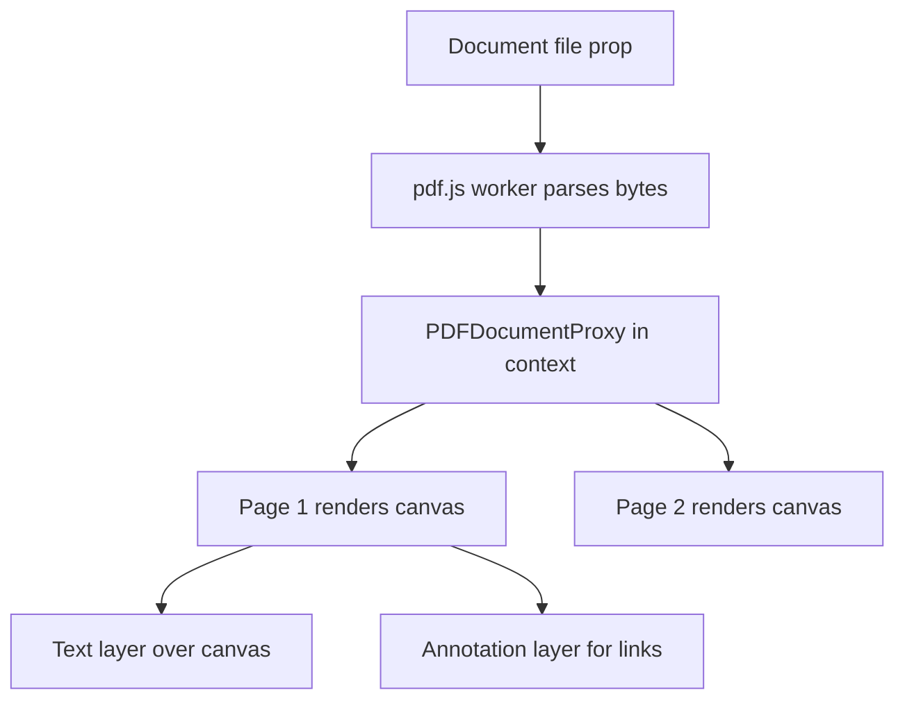
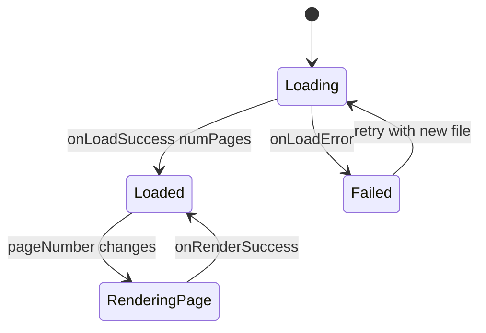
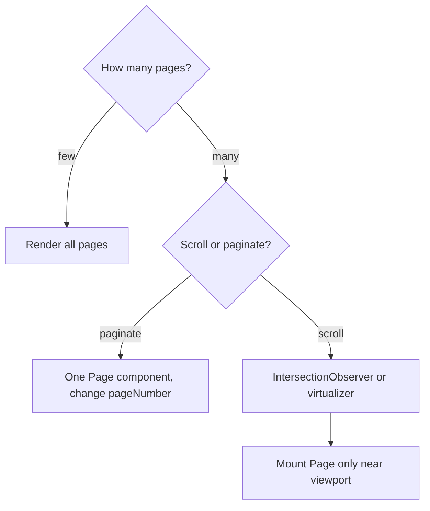
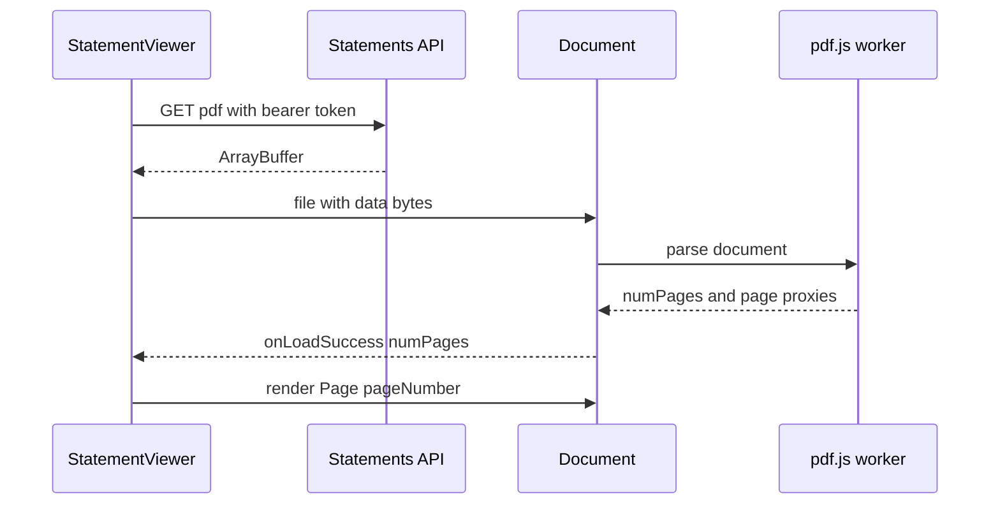

## 1. What it is

**react-pdf (by wojtekmaj) is a set of React components that display existing PDF files in the browser using Mozilla's PDF.js engine.**

Think of PDF.js as a projector and react-pdf as the remote control. PDF.js does the hard work: it parses the PDF file and paints each page onto a canvas. react-pdf gives you simple React components (`<Document>`, `<Page>`) so you can say "show page 3 at 800px wide" without touching the projector's internals.

The problem it solves: browsers can show PDFs natively in an iframe, but you cannot style that viewer, control paging, track which page the user read, add your own toolbar, or keep the experience consistent across browsers and mobile. react-pdf renders pages as regular elements inside your app, so the viewer looks and behaves like the rest of your UI.

### Two different libraries with similar names

| Package | What it does | Typical use |
|---|---|---|
| `react-pdf` (wojtekmaj) | **Views** existing PDFs (PDF.js) | Statement viewer, document preview |
| `@react-pdf/renderer` (diegomura) | **Generates** new PDFs from React components (`<Document><Page><Text>`) | Export a report or invoice as PDF |

> **Gotcha:** Both export components named `Document` and `Page`. Copying code from the wrong library's docs is the most common confusion. Check the import path.

This document focuses on **viewing** with `react-pdf`.

## 2. Core concepts

### [Beginner] Document and Page

`<Document>` loads and parses the file once. `<Page>` renders one page of the loaded document. Pages must be inside a Document because they read the parsed document from React context.

```tsx
import { Document, Page } from 'react-pdf';

export function SimpleViewer({ url }: { url: string }) {
  return (
    <Document file={url}>
      <Page pageNumber={1} width={800} />
    </Document>
  );
}
```



### [Beginner] The worker, and why it must be configured

PDF parsing is CPU-heavy. PDF.js runs it in a **Web Worker** (a background thread) so the main thread stays responsive. You must tell PDF.js where the worker script is. With Vite, `new URL(..., import.meta.url)` makes Vite copy the worker file into the build and gives you its final URL.

```ts
// src/pdf/setupPdfWorker.ts - import once, before any Document renders
import { pdfjs } from 'react-pdf';

pdfjs.GlobalWorkerOptions.workerSrc = new URL(
  'pdfjs-dist/build/pdf.worker.min.mjs',
  import.meta.url,
).toString();
```

> **Why:** A worker is loaded from a separate URL, not imported like a module. Bundlers do not know they need to ship it unless you reference it with `new URL(path, import.meta.url)`, which Vite recognises as an asset reference.

> **Gotcha:** The worker version must exactly match the `pdfjs-dist` version react-pdf uses. Install no separate `pdfjs-dist` unless it matches, or you get "The API version does not match the Worker version". Older guides use `pdf.worker.min.js` (pdfjs 3.x); newer versions ship `.mjs`.

> **Outdated:** Loading the worker from a CDN like `//unpkg.com/pdfjs-dist@${pdfjs.version}/build/pdf.worker.min.mjs` works but adds a third-party dependency and may break a strict Content Security Policy. Bundle it locally in financial apps.

### [Beginner] onLoadSuccess and numPages

The Document tells you when parsing finishes and how many pages exist. You store `numPages` in state to render pages or a pager.

```tsx
import { useState } from 'react';
import { Document, Page } from 'react-pdf';
import type { PDFDocumentProxy } from 'pdfjs-dist';

export function PagedViewer({ url }: { url: string }) {
  const [numPages, setNumPages] = useState(0);
  const [page, setPage] = useState(1);

  function handleLoad({ numPages }: PDFDocumentProxy) {
    setNumPages(numPages);
    setPage(1);
  }

  return (
    <div>
      <Document file={url} onLoadSuccess={handleLoad} onLoadError={(e) => console.error(e)}>
        <Page pageNumber={page} width={800} />
      </Document>
      <button disabled={page <= 1} onClick={() => setPage((p) => p - 1)}>Previous</button>
      <span>Page {page} of {numPages}</span>
      <button disabled={page >= numPages} onClick={() => setPage((p) => p + 1)}>Next</button>
    </div>
  );
}
```



### [Intermediate] The file prop and memoization

`file` accepts a URL string, an object `{ url, httpHeaders, withCredentials }`, `{ data }` (bytes), an `ArrayBuffer`, a `Blob`/`File`, or a base64 data URI.

```tsx
const file = useMemo(
  () => ({ url: `/api/statements/${statementId}.pdf`, withCredentials: true }),
  [statementId],
);
<Document file={file} />;
```

> **Gotcha:** If you pass a new object literal every render (`file={{ url }}`), react-pdf sees a new file and reloads the whole document, causing flicker and repeated downloads. Memoize objects passed to `file` and `options`. react-pdf logs a warning about this.

### [Intermediate] Text and annotation layers

On top of each canvas, react-pdf can render:

- **Text layer:** invisible, positioned text spans matching the drawn text, so users can select, copy and search (Ctrl+F) text.
- **Annotation layer:** clickable links and form widgets from the PDF.

Both need CSS to position correctly. Without it, text appears as a visible jumble under the page.

```ts
import 'react-pdf/dist/Page/TextLayer.css';
import 'react-pdf/dist/Page/AnnotationLayer.css';
```

```tsx
// Turn layers off when you only need a picture (thumbnails), it is faster
<Page pageNumber={1} width={120} renderTextLayer={false} renderAnnotationLayer={false} />
```

> **Outdated:** react-pdf 6 and earlier used paths like `react-pdf/dist/esm/Page/TextLayer.css`. Versions 7+ use `react-pdf/dist/Page/...`.

### [Advanced] Fonts and cMaps

Some PDFs use non-embedded standard fonts or CJK character maps. PDF.js needs those data files. Copy them from `pdfjs-dist` into your public folder (for example with `vite-plugin-static-copy`) and point `options` at them.

```tsx
const pdfOptions = {
  cMapUrl: '/cmaps/',               // character maps for CJK text
  standardFontDataUrl: '/standard_fonts/', // fonts not embedded in the PDF
};

// Module-level constant so the reference never changes
<Document file={file} options={pdfOptions} />;
```

### [Advanced] Performance: render only what is visible

Each Page is a canvas with millions of pixels. A 60-page statement rendered all at once uses lots of memory and blocks scrolling. Strategies:

1. **Paginate:** show one page at a time (cheapest).
2. **Lazy render:** render a placeholder of the right height and only mount `<Page>` when it scrolls into view (IntersectionObserver).
3. **Virtualize:** use `@tanstack/react-virtual` or `react-window` so only nearby pages exist in the DOM.
4. **Fix width:** pass `width` matching the container so canvases are not oversized. Device pixel ratio is handled for you; avoid huge `scale` values.

```tsx
import { useEffect, useRef, useState } from 'react';
import { Page } from 'react-pdf';

function LazyPage({ pageNumber, width }: { pageNumber: number; width: number }) {
  const ref = useRef<HTMLDivElement>(null);
  const [visible, setVisible] = useState(false);

  useEffect(() => {
    const el = ref.current;
    if (!el) return;
    const io = new IntersectionObserver(
      ([entry]) => setVisible(entry.isIntersecting),
      { rootMargin: '600px 0px' }, // start rendering slightly before it is on screen
    );
    io.observe(el);
    return () => io.disconnect();
  }, []);

  // Letter-size aspect ratio placeholder keeps scroll height stable
  return (
    <div ref={ref} style={{ minHeight: width * 1.294 }}>
      {visible && <Page pageNumber={pageNumber} width={width} />}
    </div>
  );
}
```



## 3. Why it's used in this project

- **Statements and tax documents:** monthly account statements, trade confirmations and 1099 forms are generated server-side as PDFs. Users view them in-app instead of downloading.
- **Consistent, branded viewer:** our toolbar, page count, download and print buttons, and the app's layout around the document.
- **Authenticated download:** statements sit behind Okta-protected APIs. We fetch with the access token and pass bytes or a Blob to react-pdf, rather than exposing a public URL.
- **Audit trail:** we can log "statement viewed" events and which pages were opened.
- **Selectable text:** users copy account numbers or amounts thanks to the text layer.

> **Finance tip:** Do not put access tokens in PDF URLs as query strings; they leak into logs and browser history. Use `httpHeaders` in the `file` object or fetch the bytes yourself with your authenticated client.

## 4. Setup & configuration

```bash
npm i react-pdf
# pdfjs-dist is a dependency of react-pdf, do not install another version
```

```ts
// src/pdf/setupPdfWorker.ts
import { pdfjs } from 'react-pdf';
import 'react-pdf/dist/Page/TextLayer.css';       // positions selectable text
import 'react-pdf/dist/Page/AnnotationLayer.css'; // positions links and form fields

// Vite turns this into a hashed asset URL and copies the worker into dist/
pdfjs.GlobalWorkerOptions.workerSrc = new URL(
  'pdfjs-dist/build/pdf.worker.min.mjs',
  import.meta.url,
).toString();
```

```ts
// src/main.tsx
import './pdf/setupPdfWorker'; // side-effect import, once at startup
```

```ts
// vite.config.ts - optional: copy cMaps and standard fonts for unusual PDFs
import { defineConfig } from 'vite';
import react from '@vitejs/plugin-react';
import { viteStaticCopy } from 'vite-plugin-static-copy';

export default defineConfig({
  plugins: [
    react(),
    viteStaticCopy({
      targets: [
        { src: 'node_modules/pdfjs-dist/cmaps', dest: '' },          // served at /cmaps
        { src: 'node_modules/pdfjs-dist/standard_fonts', dest: '' }, // served at /standard_fonts
      ],
    }),
  ],
});
```

> **Gotcha:** In tests (Vitest with jsdom), there is no canvas or worker. Mock `react-pdf` in unit tests, and test the real viewer in Playwright.

## 5. Key features we use

### [Intermediate] Statement viewer with authenticated fetch

```tsx
import { useMemo, useState } from 'react';
import { useQuery } from '@tanstack/react-query';
import { Document, Page } from 'react-pdf';
import { api } from '../api/client'; // axios instance with Okta token interceptor

type Props = { accountId: string; statementId: string };

export function StatementViewer({ accountId, statementId }: Props) {
  const [numPages, setNumPages] = useState(0);
  const [page, setPage] = useState(1);
  const [width, setWidth] = useState(800);

  const { data: bytes, isLoading, error } = useQuery({
    queryKey: ['statement-pdf', accountId, statementId],
    queryFn: async () => {
      const res = await api.get<ArrayBuffer>(
        `/accounts/${accountId}/statements/${statementId}/pdf`,
        { responseType: 'arraybuffer' },
      );
      return res.data;
    },
    staleTime: Infinity, // statements are immutable once issued
  });

  // pdf.js may transfer (detach) the buffer to the worker, so give it a copy
  const file = useMemo(() => (bytes ? { data: new Uint8Array(bytes.slice(0)) } : null), [bytes]);

  if (isLoading) return <p>Loading statement...</p>;
  if (error || !file) return <p role="alert">Could not load the statement. Try again later.</p>;

  return (
    <section aria-label="Account statement">
      <div className="toolbar">
        <button onClick={() => setPage((p) => Math.max(1, p - 1))} disabled={page <= 1}>Previous</button>
        <span aria-live="polite">Page {page} of {numPages || '-'}</span>
        <button onClick={() => setPage((p) => Math.min(numPages, p + 1))} disabled={page >= numPages}>Next</button>
        <button onClick={() => setWidth((w) => Math.min(w + 100, 1400))}>Zoom in</button>
        <button onClick={() => setWidth((w) => Math.max(w - 100, 400))}>Zoom out</button>
      </div>
      <Document
        file={file}
        onLoadSuccess={({ numPages }) => setNumPages(numPages)}
        loading={<p>Rendering...</p>}
        error={<p role="alert">This file is not a valid PDF.</p>}
      >
        <Page pageNumber={page} width={width} />
      </Document>
    </section>
  );
}
```

### [Intermediate] Fit to container width

```tsx
function useElementWidth<T extends HTMLElement>() {
  const ref = useRef<T>(null);
  const [width, setWidth] = useState(0);
  useEffect(() => {
    if (!ref.current) return;
    const ro = new ResizeObserver(([e]) => setWidth(Math.floor(e.contentRect.width)));
    ro.observe(ref.current);
    return () => ro.disconnect();
  }, []);
  return [ref, width] as const;
}

const [containerRef, width] = useElementWidth<HTMLDivElement>();
<div ref={containerRef}>{width > 0 && <Page pageNumber={page} width={width} />}</div>;
```

### [Beginner] Thumbnails

```tsx
{Array.from({ length: numPages }, (_, i) => (
  <button key={i} onClick={() => setPage(i + 1)} aria-label={`Go to page ${i + 1}`}>
    <Page pageNumber={i + 1} width={100} renderTextLayer={false} renderAnnotationLayer={false} />
  </button>
))}
```



## 6. Interview questions

#### Q: What is the difference between react-pdf and @react-pdf/renderer?

`react-pdf` (wojtekmaj) displays existing PDFs in the browser using PDF.js; components are `Document` and `Page` that render to canvas plus text and annotation layers. `@react-pdf/renderer` creates new PDF files from React components (`Document`, `Page`, `View`, `Text`, `StyleSheet`) and can run in the browser or Node. Use the first for a statement viewer and the second to generate an exportable report.

#### Q: Why does react-pdf need a worker, and how do you set it up with Vite?

PDF parsing and rendering is expensive. PDF.js does it in a Web Worker so the main thread (UI, scrolling, input) stays responsive. Set `pdfjs.GlobalWorkerOptions.workerSrc = new URL('pdfjs-dist/build/pdf.worker.min.mjs', import.meta.url).toString()`. Vite treats `new URL(..., import.meta.url)` as an asset reference and bundles the file. The worker version must match the bundled pdfjs-dist version.

#### Q: The PDF keeps reloading and flickering. Why?

Usually the `file` or `options` prop is a new object each render (`file={{ url }}`), so react-pdf thinks it is a different document. Memoize with `useMemo` or define constants outside the component. Also check the parent is not remounting the Document via a changing `key`.

#### Q: How would you display a 200-page document efficiently?

Do not render 200 canvases. Paginate, or lazy-render pages with IntersectionObserver or a virtualizer so only pages near the viewport mount; use placeholders with the right height to keep scroll position stable. Pass a sensible `width` instead of large `scale`. Disable text/annotation layers for thumbnails. Cache the downloaded bytes (React Query with `staleTime: Infinity` for immutable statements).

#### Q: How do you load a PDF that requires authentication?

Either pass `file={{ url, httpHeaders: { Authorization: 'Bearer ...' } }}` (memoized), or fetch the bytes yourself with the authenticated HTTP client (`responseType: 'arraybuffer'` or `'blob'`) and pass `{ data }` or a Blob. Avoid putting tokens in query strings. Consider `withCredentials` for cookie-based sessions. Handle 401 by refreshing the token through your usual interceptor.

## 7. Drawbacks & pain points

- **Worker setup is fragile** across bundlers and versions; mismatched versions break at runtime, not build time.
- **Large bundle.** pdfjs-dist and its worker are big (worker alone is around 1 MB minified, less gzipped). Lazy-load the viewer route with `React.lazy`.
- **Memory heavy.** Canvases for many or large pages can crash mobile Safari tabs.
- **No built-in toolbar**, search UI, zoom controls or virtualization. You build them.
- **SSR unfriendly.** It needs browser APIs; in Next.js load it client-only.
- **Major version churn** follows PDF.js (ESM-only from v9, newer browser requirements in recent versions).

Gotchas that trip devs up:

```tsx
// 1. Inline objects cause reloads
<Document file={{ url }} options={{ cMapUrl: '/cmaps/' }} /> // BAD
// GOOD: useMemo for file, module constant for options

// 2. Missing layer CSS: text appears as visible garbage below the page
import 'react-pdf/dist/Page/TextLayer.css';

// 3. Reusing an ArrayBuffer: pdf.js can transfer it to the worker, leaving it detached
// Pass a copy if you keep bytes in a cache: { data: new Uint8Array(buffer.slice(0)) }

// 4. Page outside Document: throws, Page needs the document context
<Page pageNumber={1} /> // BAD on its own
```

## 8. Better alternatives

| Option | Bundle (gzip) | Boilerplate | Features | Learning curve | TypeScript | Popularity | When it wins |
|---|---|---|---|---|---|---|---|
| react-pdf (wojtekmaj) | ~pdf.js size, worker separate | Medium | Viewing primitives only | Low-medium | Good | High | Custom in-app viewer with your own UI |
| Native browser viewer (iframe or object) | ~0 | Very low | Full viewer, no control | Very low | n/a | Universal | Quick preview, download-first flows |
| pdfjs-dist directly | ~same | High | Full control | High | Good | High | Very custom rendering, workers, search |
| @react-pdf-viewer/core | ~larger | Low | Toolbar, search, zoom plugins | Low | Good | Medium (maintenance has slowed) | Full-featured viewer fast |
| Commercial SDKs (PSPDFKit/Nutrient, Apryse) | ~MBs | Low | Annotation, signing, forms | Medium | Very good | Enterprise | Annotations, e-signature, redaction |
| @react-pdf/renderer | ~large | Medium | Generates PDFs | Medium | Good | High | Creating PDFs, not viewing |

> **Finance tip:** If users only need to view and download a statement, `<iframe src={blobUrl}>` or a download link may be enough and avoids shipping pdf.js. Choose react-pdf when you need a controlled, branded, mobile-consistent experience.

## 9. When NOT to use it

- You need to generate PDFs: use `@react-pdf/renderer` or server-side generation.
- You need annotation, form filling with save-back, signatures or redaction: use a commercial SDK.
- Download-only flows where an iframe or link is enough.
- Server-side rendering of PDF content to HTML.
- Very low-end mobile targets with huge, image-heavy PDFs; consider server-rendered page images.

## Cheatsheet

| Need | Code |
|---|---|
| Worker (Vite) | `pdfjs.GlobalWorkerOptions.workerSrc = new URL('pdfjs-dist/build/pdf.worker.min.mjs', import.meta.url).toString()` |
| Layer CSS | `import 'react-pdf/dist/Page/TextLayer.css'` and `AnnotationLayer.css` |
| Load | `<Document file={memoFile} onLoadSuccess={({ numPages }) => ...} onLoadError={...}>` |
| Render | `<Page pageNumber={n} width={w} />` |
| Faster thumbnail | `renderTextLayer={false} renderAnnotationLayer={false}` |
| Auth | `file={{ url, httpHeaders: { Authorization } }}` or `{ data: bytes }` |
| Fonts | `options={{ cMapUrl: '/cmaps/', standardFontDataUrl: '/standard_fonts/' }}` |
| Fallbacks | `loading={...}`, `error={...}`, `noData={...}` |

```tsx
import { Document, Page, pdfjs } from 'react-pdf';
import 'react-pdf/dist/Page/TextLayer.css';
import 'react-pdf/dist/Page/AnnotationLayer.css';

pdfjs.GlobalWorkerOptions.workerSrc = new URL('pdfjs-dist/build/pdf.worker.min.mjs', import.meta.url).toString();

function Viewer({ url }: { url: string }) {
  const [numPages, setNumPages] = useState(0);
  const file = useMemo(() => ({ url, withCredentials: true }), [url]);
  return (
    <Document file={file} onLoadSuccess={({ numPages }) => setNumPages(numPages)}>
      {Array.from({ length: numPages }, (_, i) => <LazyPage key={i} pageNumber={i + 1} width={800} />)}
    </Document>
  );
}
```
