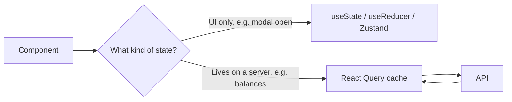
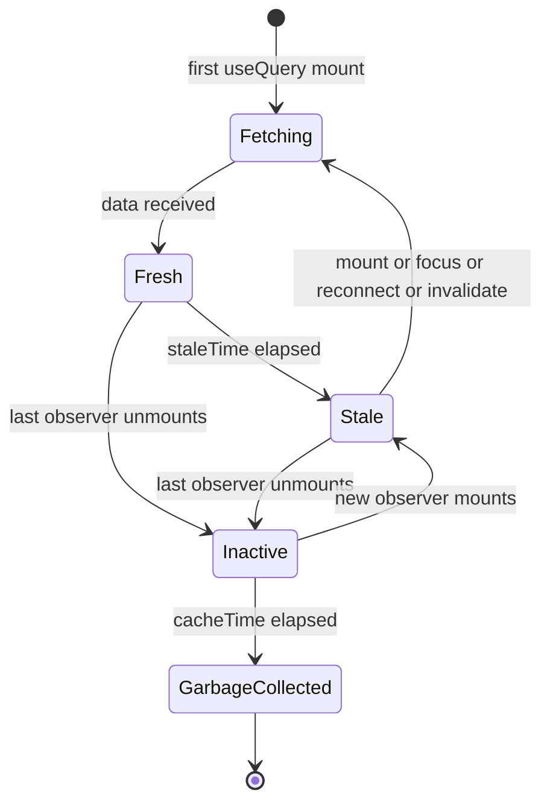
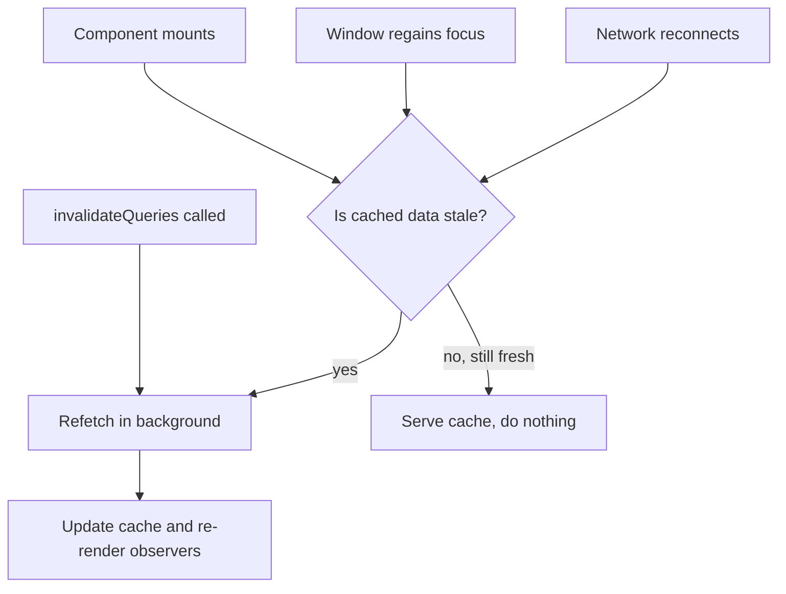
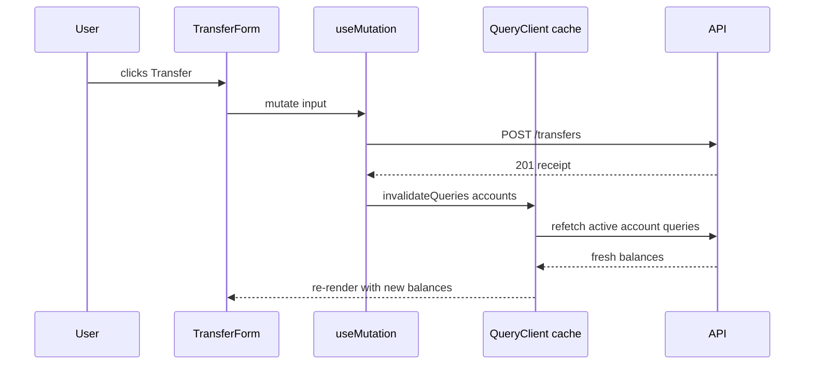
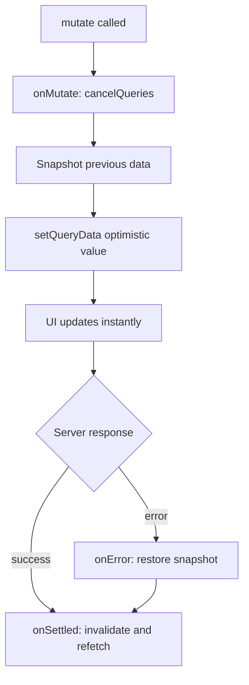

## 1. What it is

**React Query v3 is a server-state cache for React: you tell it how to fetch data and under which key to store it, and it handles loading states, caching, deduplication, background refetching and invalidation for you.**

Think of it like a smart receptionist in front of your API. When a component asks for "account 42", the receptionist first checks a filing cabinet (the cache). If a recent copy is there, it hands it over instantly. If the copy is old, it still hands it over, but quietly phones the server for an update and swaps the file when the answer arrives. If ten components ask for the same file at the same time, the receptionist makes only one phone call.

The problem it solves: data from a server is not really "your" state. It lives somewhere else, other people can change it, and your copy goes out of date. Before React Query, teams stored server data in Redux or `useState` and hand-wrote `useEffect` fetches, loading flags, error flags, retry logic and "refresh after save" code in every screen. React Query replaces all of that with one declarative hook and a shared cache.

> **Outdated:** v3 is legacy. The package was renamed to `@tanstack/react-query` in v4 (2022), and v5 (late 2023) is the current major line. v3 receives no new features. You should know v3 because many existing financial codebases still run it, but new code should use v5. Most v3 concepts carry over; the API surface changed (object-only signatures, `gcTime`, `isPending`, no `onSuccess` on queries).

## 2. Core concepts

### [Beginner] Server state vs client state

There are two very different kinds of state in a frontend app.

- **Client state** is owned by the browser: is the sidebar open, which tab is selected, what the user typed into a form that is not submitted yet. Only your app changes it. It is always "correct".
- **Server state** is owned by a remote system: account balances, transactions, portfolio holdings. Your app only has a **snapshot**. Someone else (a batch job, another user, a payment processor) can change the truth at any moment.

```tsx
// Client state: owned by the UI. useState is perfect.
const [isFilterPanelOpen, setFilterPanelOpen] = useState(false);

// Server state: a snapshot of the bank's database.
// It can be stale the moment it arrives. It needs caching,
// deduplication, refetching and invalidation. useState is NOT enough.
const { data: account } = useQuery(['account', accountId], () =>
  fetchAccount(accountId)
);
```

> **Why:** Server state has problems client state does not: it is asynchronous, shared across many components, can go stale, and must be re-synced after mutations. Putting it into Redux forces you to re-implement a cache by hand. React Query treats it as a cache from the start.



### [Beginner] The manual way, and why it hurts

Before writing any React Query code, look at what it replaces.

```tsx
// Hand-rolled fetching. Every screen ends up with this.
function AccountSummary({ accountId }: { accountId: string }) {
  const [account, setAccount] = useState<Account | null>(null);
  const [isLoading, setIsLoading] = useState(true);
  const [error, setError] = useState<Error | null>(null);

  useEffect(() => {
    let cancelled = false; // avoid setting state after unmount / id change
    setIsLoading(true);
    fetchAccount(accountId)
      .then((a) => !cancelled && setAccount(a))
      .catch((e) => !cancelled && setError(e))
      .finally(() => !cancelled && setIsLoading(false));
    return () => {
      cancelled = true;
    };
  }, [accountId]);

  // Missing: caching, dedup across components, retries,
  // refetch on focus, refresh after a transfer, stale handling...
  if (isLoading) return <Spinner />;
  if (error) return <ErrorBanner error={error} />;
  return <h2>{account?.name}</h2>;
}
```

With React Query v3 the same component becomes:

```tsx
function AccountSummary({ accountId }: { accountId: string }) {
  const { data, isLoading, isError, error } = useQuery<Account, Error>(
    ['account', accountId],
    () => fetchAccount(accountId)
  );

  if (isLoading) return <Spinner />;
  if (isError) return <ErrorBanner error={error} />;
  return <h2>{data!.name}</h2>;
}
```

> **Why:** The hook is declarative: you describe *what* data you need (the key) and *how* to get it (the function). The library decides *when* to fetch, and every component that uses the same key shares one cache entry and one network request.

### [Beginner] QueryClient and QueryClientProvider

`QueryClient` is the object that owns the cache. `QueryClientProvider` puts it into React context so every hook can reach it.

```tsx
// src/main.tsx
import { QueryClient, QueryClientProvider } from 'react-query';

// Create it ONCE, outside of any component.
const queryClient = new QueryClient();

ReactDOM.render(
  <QueryClientProvider client={queryClient}>
    <App />
  </QueryClientProvider>,
  document.getElementById('root')
);
```

> **Gotcha:** Creating `new QueryClient()` inside a component body makes a brand-new, empty cache on every render. All your caching silently disappears. Create it at module level, or with `useState(() => new QueryClient())` if you need one per app instance (tests, SSR).

```tsx
// Correct pattern when it must live inside a component
function AppProviders({ children }: { children: React.ReactNode }) {
  const [queryClient] = useState(() => new QueryClient());
  return <QueryClientProvider client={queryClient}>{children}</QueryClientProvider>;
}
```

### [Beginner] Query keys

A query key is the cache address of a piece of data. In v3 it can be a string or an array. Strings are converted into one-element arrays internally, so `'accounts'` and `['accounts']` are the same key.

```ts
useQuery('accounts', fetchAccounts);                 // same as ['accounts']
useQuery(['account', accountId], () => fetchAccount(accountId));
useQuery(
  ['transactions', accountId, { page, status: 'posted' }],
  () => fetchTransactions(accountId, page, 'posted')
);
```

Rules that matter:

- **Everything the fetch depends on must be in the key.** If `accountId` changes but is not in the key, React Query thinks it is the same data and shows the wrong account.
- Keys are **hashed deterministically**. Object property order does not matter: `{ page: 1, status: 'posted' }` equals `{ status: 'posted', page: 1 }`. Array order does matter.
- Keys are **hierarchical** for invalidation. Invalidating `['transactions', accountId]` also hits `['transactions', accountId, { page: 2 }]`.

```ts
// A key factory keeps keys consistent across the codebase.
export const accountKeys = {
  all: ['accounts'] as const,
  detail: (id: string) => ['accounts', id] as const,
  transactions: (id: string, filters: TxFilters) =>
    ['accounts', id, 'transactions', filters] as const,
};
```

> **Interview tip:** Say "the query key is a dependency array for the fetch". Interviewers want to hear that missing a variable from the key is the number one cause of "shows the wrong data" bugs.

### [Beginner] useQuery and its status flags

`useQuery(key, fetcher, options?)` returns an object with data and flags. In v3 `status` is one of `'idle' | 'loading' | 'error' | 'success'`.

```tsx
const {
  data,        // the resolved value, or undefined
  error,       // the thrown error, or null
  status,      // 'idle' | 'loading' | 'error' | 'success'
  isIdle,      // query is disabled (enabled: false) and has no data
  isLoading,   // NO data yet AND a fetch is in progress (first load)
  isFetching,  // ANY fetch in progress, including background refetches
  isError,
  isSuccess,
  refetch,     // manual trigger
  dataUpdatedAt,
} = useQuery<Portfolio, Error>(['portfolio', portfolioId], () =>
  fetchPortfolio(portfolioId)
);
```

The key difference is `isLoading` vs `isFetching`:

| Situation | isLoading | isFetching | What to show |
|---|---|---|---|
| First visit, nothing cached | true | true | Full skeleton |
| Cached data shown, background refresh | false | true | Data + small "refreshing" indicator |
| Cached data, nothing happening | false | false | Data |
| Error, no data | false | false | Error banner |

```tsx
function PortfolioCard({ portfolioId }: { portfolioId: string }) {
  const { data, isLoading, isFetching, isError, error } = useQuery<Portfolio, Error>(
    ['portfolio', portfolioId],
    () => fetchPortfolio(portfolioId)
  );

  if (isLoading) return <CardSkeleton />;          // first load only
  if (isError) return <ErrorBanner error={error} />;

  return (
    <Card>
      <h3>{data!.name}</h3>
      <Money amountCents={data!.totalValueCents} currency={data!.currency} />
      {isFetching && <small aria-live="polite">Updating prices...</small>}
    </Card>
  );
}
```

> **Gotcha:** Showing a full-page spinner on `isFetching` makes the screen flash every time the window regains focus. Use `isLoading` for skeletons and `isFetching` only for subtle indicators.

> **Outdated:** In v4 the `idle` status was removed and a separate `fetchStatus` was added. In v5 `isLoading` was renamed to `isPending`, and a new `isLoading` means `isPending && isFetching`.

### [Intermediate] staleTime vs cacheTime

These two options are the most misunderstood part of React Query.

- **`staleTime`** (default `0`): how long fetched data counts as **fresh**. While fresh, React Query never refetches it automatically. Once stale, it is still shown, but the next trigger (mount, focus, reconnect) causes a background refetch.
- **`cacheTime`** (default `5 * 60 * 1000`, five minutes): how long data stays in memory **after no component is using it** (the query is "inactive"). When the timer runs out, the entry is garbage collected.

```ts
useQuery(['fx-rates', 'USD'], fetchFxRates, {
  staleTime: 30_000,       // rates are "fresh enough" for 30s: no refetch on remount
  cacheTime: 10 * 60_000,  // keep in memory 10 min after the last user unmounts
});
```

> **Why:** `staleTime` answers "should I ask the server again?". `cacheTime` answers "should I keep this in memory at all?". They are independent. The default `staleTime: 0` means "always assume data might be outdated", which is safe but chatty. Default `cacheTime` of five minutes means going back to a recently visited screen shows data instantly instead of a spinner.

The lifecycle of a single cache entry:



Reading the diagram in plain words: data is fresh, then turns stale after `staleTime`. While stale it is still returned, and any trigger refetches it. When no component uses it any more, it becomes inactive and the `cacheTime` countdown starts. If someone mounts it again before the countdown ends, they get the cached value instantly (and a background refetch if it is stale). If not, it is deleted.

> **Gotcha:** `staleTime` longer than `cacheTime` is legal but confusing: the entry can be garbage collected while still "fresh". Keep `cacheTime >= staleTime`.

> **Finance tip:** Pick `staleTime` per data type. Static reference data (currency list, country codes) can be `Infinity`. Account balances might be `0` to `10s`. Live market quotes usually belong to a WebSocket, with React Query only for the initial snapshot.

### [Intermediate] Refetch triggers

A stale query refetches automatically on these events (all default `true`):

```ts
useQuery(['balances', accountId], () => fetchBalances(accountId), {
  refetchOnMount: true,          // a new component mounts and data is stale
  refetchOnWindowFocus: true,    // user tabs back into the browser window
  refetchOnReconnect: true,      // network comes back online
  refetchInterval: false,        // polling interval in ms, or false
  refetchIntervalInBackground: false, // keep polling when tab is hidden
  retry: 3,                      // failed fetches retry 3 times...
  retryDelay: (attempt) => Math.min(1000 * 2 ** attempt, 30_000), // ...with exponential backoff
});
```

Each of these can also be `'always'` (refetch even if fresh) or a function.



> **Why:** Refetch-on-focus is what makes React Query apps feel "live" without WebSockets. A user leaves a dashboard open, goes to their email, comes back, and balances quietly update.

> **Gotcha:** During development, refetch-on-focus fires every time you click into DevTools and back. It looks like a bug. It is not. Do not disable it globally just because of this.

### [Intermediate] useMutation

Queries read. Mutations write (POST, PUT, PATCH, DELETE). In v3 the signature is `useMutation(mutationFn, options?)`.

```tsx
type TransferInput = {
  fromAccountId: string;
  toAccountId: string;
  amountCents: number;
  currency: 'USD' | 'EUR' | 'GBP';
  idempotencyKey: string;
};

function TransferForm() {
  const mutation = useMutation<TransferReceipt, ApiError, TransferInput>(
    (input) => api.post('/transfers', input).then((r) => r.data)
  );

  const onSubmit = (values: TransferInput) => {
    mutation.mutate(values, {
      onSuccess: (receipt) => toast.success(`Transfer ${receipt.id} submitted`),
    });
  };

  return (
    <form onSubmit={handleSubmit(onSubmit)}>
      {/* fields */}
      <button disabled={mutation.isLoading}>
        {mutation.isLoading ? 'Submitting...' : 'Transfer'}
      </button>
      {mutation.isError && <ErrorBanner error={mutation.error} />}
    </form>
  );
}
```

Key facts:

- Mutations **do not run automatically**. You call `mutate()` (fire-and-forget, errors go to callbacks) or `mutateAsync()` (returns a promise you must `try/catch`).
- Mutations are **not cached by key** and **not retried by default** (`retry: 0`).
- Status flags in v3: `isIdle`, `isLoading`, `isError`, `isSuccess`.

> **Finance tip:** Never retry a money-moving mutation blindly. If you must retry, send an idempotency key so the server can deduplicate. Disable the submit button while `isLoading` to prevent double transfers.

### [Intermediate] Invalidation in onSuccess

After a write, the cache holds outdated data. `invalidateQueries` marks matching queries as stale and refetches the ones currently on screen.

```tsx
function useCreateTransfer() {
  const queryClient = useQueryClient();

  return useMutation(createTransfer, {
    onSuccess: (_receipt, variables) => {
      // Both accounts' balances and transaction lists are now wrong.
      queryClient.invalidateQueries(['accounts', variables.fromAccountId]);
      queryClient.invalidateQueries(['accounts', variables.toAccountId]);
      queryClient.invalidateQueries('portfolio-summary');
    },
  });
}
```



> **Why:** Invalidation is safer than manually editing the cache, because the server is the source of truth. It computes fees, FX conversion and holds. Let it tell you the new balance rather than guessing.

You can also write the server's response directly into the cache when it returns the full updated entity:

```ts
onSuccess: (updatedAccount) => {
  queryClient.setQueryData(['accounts', updatedAccount.id], updatedAccount);
},
```

> **Gotcha:** `invalidateQueries` returns a promise. If you `return` it from `onSuccess`, the mutation stays in `isLoading` until the refetch finishes. That is useful when the next screen needs fresh data, and surprising when you did not mean it.

### [Advanced] Optimistic updates with rollback

An optimistic update changes the UI **before** the server confirms. If the server fails, you roll back. The pattern uses three callbacks: `onMutate`, `onError`, `onSettled`.

```tsx
type Payee = { id: string; nickname: string; isFavorite: boolean };

function useToggleFavoritePayee() {
  const queryClient = useQueryClient();
  const key = ['payees'];

  return useMutation(
    (payee: Payee) =>
      api.patch(`/payees/${payee.id}`, { isFavorite: !payee.isFavorite }),
    {
      // 1. Runs before the mutationFn
      onMutate: async (payee) => {
        // Stop in-flight refetches so they don't overwrite our optimistic value
        await queryClient.cancelQueries(key);

        // Snapshot the current value for rollback
        const previous = queryClient.getQueryData<Payee[]>(key);

        // Optimistically update
        queryClient.setQueryData<Payee[]>(key, (old = []) =>
          old.map((p) => (p.id === payee.id ? { ...p, isFavorite: !p.isFavorite } : p))
        );

        // Whatever you return becomes `context`
        return { previous };
      },

      // 2. On failure, restore the snapshot
      onError: (_err, _payee, context) => {
        if (context?.previous) queryClient.setQueryData(key, context.previous);
        toast.error('Could not update payee');
      },

      // 3. Success or failure: re-sync with the server
      onSettled: () => {
        queryClient.invalidateQueries(key);
      },
    }
  );
}
```



> **Why `cancelQueries`:** If a background refetch started before your optimistic write, its old response could land after your write and overwrite it. Cancelling first prevents that race.

> **Finance tip:** Use optimistic updates for low-risk, reversible actions: starring a payee, renaming a nickname, dismissing a notification. Do **not** optimistically show a transfer as complete or a balance as reduced. Users and auditors must see confirmed server state for money movement.

### [Advanced] Dependent queries

Sometimes query B needs the result of query A. Use `enabled` to hold B until A has data.

```tsx
function PrimaryAccountTransactions({ customerId }: { customerId: string }) {
  const customerQuery = useQuery(['customer', customerId], () =>
    fetchCustomer(customerId)
  );

  const primaryAccountId = customerQuery.data?.primaryAccountId;

  const txQuery = useQuery(
    ['transactions', primaryAccountId],
    () => fetchTransactions(primaryAccountId!),
    {
      enabled: !!primaryAccountId, // does not run until we have the id
    }
  );

  // In v3, txQuery.isIdle is true while it waits
  if (customerQuery.isLoading || txQuery.isIdle || txQuery.isLoading) return <Spinner />;
  return <TransactionList items={txQuery.data!} />;
}
```

> **Gotcha:** Dependent queries create a **request waterfall**: A must finish before B starts. If the backend can return both in one call, or if you can know the id from the URL, prefer that.

### [Advanced] Pagination with keepPreviousData

With page numbers in the key, every page is a different cache entry. Without help, moving from page 1 to page 2 shows a loading state because page 2 has no data yet. `keepPreviousData: true` keeps showing page 1's data until page 2 arrives.

```tsx
function TransactionsTable({ accountId }: { accountId: string }) {
  const [page, setPage] = useState(1);

  const { data, isLoading, isFetching, isPreviousData } = useQuery(
    ['transactions', accountId, { page }],
    () => fetchTransactionsPage(accountId, page), // returns { items, hasMore }
    { keepPreviousData: true }
  );

  if (isLoading) return <TableSkeleton />;

  return (
    <>
      <Table rows={data!.items} dimmed={isPreviousData} />
      <button onClick={() => setPage((p) => Math.max(1, p - 1))} disabled={page === 1}>
        Previous
      </button>
      <button
        onClick={() => setPage((p) => p + 1)}
        disabled={isPreviousData || !data?.hasMore}
      >
        Next
      </button>
      {isFetching && <span>Loading page {page}...</span>}
    </>
  );
}
```

> **Why:** Without `keepPreviousData`, the table collapses to a skeleton and back on every page change. The layout jumps, and the "Next" button moves under the cursor.

> **Outdated:** In v5, `keepPreviousData` is gone. You write `placeholderData: keepPreviousData` (an imported helper) and read `isPlaceholderData` instead of `isPreviousData`.

### [Advanced] Infinite queries

For "Load more" or infinite scroll, `useInfiniteQuery` stores a list of pages under one key.

```tsx
type TxPage = { items: Transaction[]; nextCursor: string | null };

function TransactionFeed({ accountId }: { accountId: string }) {
  const {
    data,
    fetchNextPage,
    hasNextPage,
    isFetchingNextPage,
    isLoading,
  } = useInfiniteQuery<TxPage, Error>(
    ['transactions-feed', accountId],
    ({ pageParam = null }) => fetchTxByCursor(accountId, pageParam), // pageParam is undefined on the first page
    {
      getNextPageParam: (lastPage) => lastPage.nextCursor ?? undefined, // undefined => no more pages
    }
  );

  if (isLoading) return <Spinner />;

  return (
    <>
      {data!.pages.flatMap((page) => page.items).map((tx) => (
        <TransactionRow key={tx.id} tx={tx} />
      ))}
      <button onClick={() => fetchNextPage()} disabled={!hasNextPage || isFetchingNextPage}>
        {isFetchingNextPage ? 'Loading...' : hasNextPage ? 'Load more' : 'No more transactions'}
      </button>
    </>
  );
}
```

`data` has the shape `{ pages: TxPage[], pageParams: unknown[] }`.

> **Gotcha:** When an infinite query refetches (focus, invalidation), v3 refetches **every loaded page in sequence**, starting from the first. After a user scrolls through 40 pages, a focus event triggers 40 requests. v5 added `maxPages` to cap this.

> **Finance tip:** Use cursor-based pagination for transaction feeds. Offset pagination breaks when new transactions post while the user is scrolling: items shift between pages and appear twice or not at all.

### [Advanced] Prefetching

Prefetching loads data into the cache before a component asks for it, so the next screen renders instantly.

```tsx
function AccountListItem({ account }: { account: AccountSummary }) {
  const queryClient = useQueryClient();

  const prefetch = () => {
    // Only fetches if there is no fresh data already
    queryClient.prefetchQuery(
      ['accounts', account.id],
      () => fetchAccount(account.id),
      { staleTime: 30_000 }
    );
  };

  return (
    <Link to={`/accounts/${account.id}`} onMouseEnter={prefetch} onFocus={prefetch}>
      {account.nickname}
    </Link>
  );
}
```

You can also seed a detail cache from a list response with `initialData` or `setQueryData`:

```ts
useQuery(['accounts', id], () => fetchAccount(id), {
  initialData: () =>
    queryClient.getQueryData<Account[]>('accounts')?.find((a) => a.id === id),
  // Treat seeded data as being as old as the list it came from
  initialDataUpdatedAt: () => queryClient.getQueryState('accounts')?.dataUpdatedAt,
});
```

> **Why `initialDataUpdatedAt`:** Without it, seeded data is treated as brand new, so `staleTime` starts counting from now and you may show an outdated balance for longer than intended.

### [Advanced] Devtools

v3 ships devtools inside the same package.

```tsx
import { ReactQueryDevtools } from 'react-query/devtools';

<QueryClientProvider client={queryClient}>
  <App />
  {/* Excluded from production builds automatically (process.env.NODE_ENV check) */}
  <ReactQueryDevtools initialIsOpen={false} position="bottom-right" />
</QueryClientProvider>
```

The panel shows every key, its status (fresh, fetching, stale, inactive), observer count, last updated time and the cached data. You can manually refetch, invalidate or remove entries. It is the fastest way to answer "why did this refetch?" or "why is this stale?".

> **Finance tip:** The devtools panel displays raw cached responses, including account numbers and PII. Confirm it is not bundled into production or demo builds that real customers can reach.

## 3. Why it's used in this project

- **Many screens read the same data.** The dashboard header, the account switcher and the transfer form all need the account list. With one key, they share one request and one cache entry.
- **Balances go stale.** Card authorizations, ACH settlements and scheduled payments change balances in the background. Refetch-on-focus and invalidation after transfers keep the UI close to the truth without hand-written refresh code.
- **Post-transfer consistency.** After a transfer, invalidating both accounts, the transaction list and the portfolio summary refreshes every affected widget from one place.
- **Large transaction histories.** `keepPreviousData` for paged tables and `useInfiniteQuery` for activity feeds handle thousands of transactions without layout jumps.
- **Okta session expiry.** A 401 from an expired token surfaces as a query error. Combined with an Axios interceptor and a global `onError` on the `QueryCache`, the app can redirect to login in one place.
- **Logout hygiene.** `queryClient.clear()` on logout wipes every cached balance and transaction from memory, which matters on shared machines and for compliance reviews.
- **Legacy reality.** The codebase was started when v3 was current. Understanding v3 lets you maintain it and plan the migration to v5.

> **Finance tip:** Call `queryClient.clear()` on logout and on Okta session timeout. Otherwise the next person who logs in on the same tab could briefly see the previous user's cached accounts.

## 4. Setup & configuration

```bash
npm install react-query@3
# devtools are included in v3: import from 'react-query/devtools'
```

```tsx
// src/lib/queryClient.ts
import { QueryClient, QueryCache, MutationCache } from 'react-query';
import { isAxiosError } from 'axios';

export const queryClient = new QueryClient({
  // Global error handling for ALL queries (fires once per failed query, not per component)
  queryCache: new QueryCache({
    onError: (error, query) => {
      if (isAxiosError(error) && error.response?.status === 401) {
        // Token expired or revoked: send the user back to Okta
        window.location.assign('/login');
      }
      // Only toast background refetch failures if we already showed data
      if (query.state.data !== undefined) {
        toast.error('Could not refresh data. Showing last known values.');
      }
    },
  }),
  mutationCache: new MutationCache({
    onError: (error) => reportToMonitoring(error), // e.g. Sentry
  }),
  defaultOptions: {
    queries: {
      staleTime: 10_000,              // 10s: avoid refetch storms when many widgets mount
      cacheTime: 5 * 60_000,          // 5 min: default, keep inactive data for back-navigation
      retry: (failureCount, error) => {
        // Do not retry auth or client errors: they will not fix themselves
        if (isAxiosError(error) && error.response && error.response.status < 500) return false;
        return failureCount < 2;      // retry server/network errors twice
      },
      refetchOnWindowFocus: true,     // keep balances live when user returns to the tab
      refetchOnReconnect: true,       // re-sync after the laptop wakes up
      refetchOnMount: true,           // refetch stale data when a new screen mounts
      keepPreviousData: false,        // opt in per paginated query instead of globally
      useErrorBoundary: false,        // true would throw errors to the nearest error boundary
      suspense: false,                // experimental in v3; leave off
    },
    mutations: {
      retry: 0,                       // never auto-retry money-moving writes
    },
  },
});
```

```tsx
// src/main.tsx
import { QueryClientProvider } from 'react-query';
import { ReactQueryDevtools } from 'react-query/devtools';
import { queryClient } from './lib/queryClient';

ReactDOM.render(
  <QueryClientProvider client={queryClient}>
    <App />
    <ReactQueryDevtools initialIsOpen={false} />
  </QueryClientProvider>,
  document.getElementById('root')
);
```

```ts
// src/test/utils.tsx — a fresh client per test so caches never leak between tests
import { QueryClient, setLogger } from 'react-query';

// v3: silence expected error logs in tests (global; v4+ moved this to a client option)
setLogger({ log: console.log, warn: console.warn, error: () => {} });

export function createTestQueryClient() {
  return new QueryClient({
    defaultOptions: {
      queries: { retry: false, cacheTime: Infinity }, // no retries = fast failing tests
    },
  });
}
```

> **Gotcha:** Tests that share one `QueryClient` leak cached data between test cases, so a test can pass only because a previous test filled the cache. Always create a new client per test.

## 5. Key features we use

### [Beginner] Custom hooks per resource

Never call `useQuery` with raw strings in components. Wrap each resource in a hook so key, fetcher and options live in one place.

```ts
// src/features/accounts/hooks.ts
export function useAccount(accountId: string) {
  return useQuery<Account, ApiError>(
    accountKeys.detail(accountId),
    () => api.get<Account>(`/accounts/${accountId}`).then((r) => r.data),
    { staleTime: 15_000, enabled: Boolean(accountId) }
  );
}

export function useAccounts() {
  return useQuery<AccountSummary[], ApiError>(accountKeys.all, fetchAccounts);
}
```

### [Beginner] select to derive data

`select` transforms cached data for one component without changing the cache. The component only re-renders when the selected value changes.

```ts
export function useTotalBalanceCents() {
  return useQuery(accountKeys.all, fetchAccounts, {
    select: (accounts) =>
      accounts
        .filter((a) => a.currency === 'USD')
        .reduce((sum, a) => sum + a.availableBalanceCents, 0),
  });
}
```

### [Intermediate] Polling for pending transfers

```ts
export function useTransferStatus(transferId: string) {
  return useQuery(['transfer', transferId], () => fetchTransfer(transferId), {
    // Poll every 3s until the transfer reaches a final state
    refetchInterval: (data) =>
      data && ['COMPLETED', 'FAILED', 'REVERSED'].includes(data.status) ? false : 3000,
  });
}
```

### [Intermediate] Parallel queries with useQueries

```ts
// v3.6+: array signature. v5 uses useQueries({ queries: [...] })
const results = useQueries(
  accountIds.map((id) => ({
    queryKey: ['accounts', id],
    queryFn: () => fetchAccount(id),
  }))
);
const allLoaded = results.every((r) => r.isSuccess);
```

### [Intermediate] Clearing the cache on logout

```ts
export async function logout(oktaAuth: OktaAuth) {
  queryClient.clear();          // wipe every cached query and mutation
  await oktaAuth.signOut();     // end the Okta session
}
```

### [Advanced] Per-component callbacks (v3 only)

v3 lets you attach `onSuccess`/`onError` directly to `useQuery`. They fire per component instance, which is why they were removed in v5.

```ts
useQuery(['statement', statementId], fetchStatement, {
  onSuccess: (statement) => analytics.track('statement_viewed', { id: statement.id }),
  onError: (err) => toast.error(err.message),
});
```

> **Outdated:** This pattern is the biggest source of migration work. If three components use the same query, the toast fires three times. In v5 use the global `QueryCache` `onError`, or derive UI from `isError`.

## 6. Interview questions

#### Q: What is the difference between server state and client state, and why does it matter?

Client state is owned by the browser (modal open, selected tab, unsaved form input). It is synchronous and always correct. Server state is a snapshot of data owned by a remote system. It is asynchronous, shared across components, can be changed by others, and goes stale. That means it needs caching, request deduplication, background refetching, retries and invalidation after writes. Redux or `useState` give you none of that, so teams re-implement it badly. React Query treats server state as a cache, which removes most fetching boilerplate and many race-condition bugs.

#### Q: Explain staleTime vs cacheTime.

- `staleTime` (default 0): how long data counts as fresh. Fresh data is never refetched automatically. Stale data is still shown but refetched on mount, focus, reconnect or invalidation.
- `cacheTime` (default 5 minutes, renamed `gcTime` in v5): how long an **inactive** query (no mounted observers) stays in memory before garbage collection.

Lifecycle: fresh, then stale, then inactive when the last observer unmounts, then garbage collected when `cacheTime` expires. `staleTime` controls network traffic. `cacheTime` controls memory and instant back-navigation.

#### Q: What is the difference between isLoading and isFetching in v3?

`isLoading` is true only when there is no cached data and a fetch is running: the first load. `isFetching` is true for any running fetch, including background refetches when data is already shown. Use `isLoading` for skeletons and `isFetching` for a small "refreshing" indicator. In v5, the "no data yet" state is `isPending`, and `isLoading` means `isPending && isFetching`.

#### Q: Walk me through an optimistic update with rollback.

1. In `onMutate`, call `cancelQueries` for the key so an in-flight refetch cannot overwrite the optimistic value.
2. Snapshot the current data with `getQueryData`.
3. Write the optimistic value with `setQueryData`.
4. Return `{ previous }` as context.
5. In `onError`, restore `context.previous`.
6. In `onSettled`, `invalidateQueries` to re-sync with the server either way.

In a financial app I would only do this for reversible, low-risk actions (favoriting a payee), never for money movement, where users must see confirmed state.

#### Q: What changed from v3 to v5, and how would you migrate?

Main changes: package renamed to `@tanstack/react-query` (v4). Query keys must be arrays (v4). Object-only signatures: `useQuery({ queryKey, queryFn })` (v5). `cacheTime` renamed `gcTime`. `isLoading` renamed `isPending` and `status: 'loading'` became `'pending'`. `keepPreviousData` replaced by `placeholderData: keepPreviousData`. `onSuccess`/`onError`/`onSettled` removed from `useQuery` (still on mutations). `useErrorBoundary` renamed `throwOnError`. Infinite queries require `initialPageParam`. Suspense moved to `useSuspenseQuery`. React 18+ required.

Migration path: go v3 to v4 first (rename imports, array keys, there is a codemod), then v4 to v5 (codemod for the object signature, then manual work to remove query callbacks and rename flags). Use key factories and resource hooks first so most changes happen in a few files.

> **Interview tip:** Mention that you would remove `onSuccess` side effects from queries *before* the upgrade, because that is the part codemods cannot fix.

## 7. Drawbacks & pain points

- **It is legacy.** No new features, and bug fixes are unlikely. Some newer ecosystem libraries only integrate with `@tanstack/react-query`.
- **React 18 concurrency.** v3 predates `useSyncExternalStore` (adopted in v4). Later v3 patch releases accept React 18 as a peer dependency, but v4+ is the version built for concurrent rendering. Hedge: check your exact patch version.
- **Overloaded signatures.** `useQuery(key, fn, options)`, `useQuery(key, options)` and `useQuery(options)` all work, which makes TypeScript inference and code review harder. v5 removed this.
- **`idle` vs `loading` confusion.** Disabled queries report `idle`, which many devs forget to handle.
- **Per-observer callbacks fire multiple times.** `onSuccess` on `useQuery` runs once per mounted component.
- **Infinite query refetch cost.** All loaded pages refetch sequentially.
- **Not a client state manager.** Teams sometimes put form drafts or UI flags into the cache with `setQueryData`. That fights refetches.

Gotchas that trip devs up:

```ts
// 1. Missing variable in the key: shows account A's data for account B
useQuery('account', () => fetchAccount(accountId));       // BAD
useQuery(['account', accountId], () => fetchAccount(accountId)); // GOOD

// 2. fetch() does not throw on HTTP errors, so React Query sees "success"
useQuery(['account', id], () => fetch(`/api/accounts/${id}`).then((r) => r.json())); // BAD
useQuery(['account', id], async () => {
  const r = await fetch(`/api/accounts/${id}`);
  if (!r.ok) throw new Error(`HTTP ${r.status}`); // GOOD: throw so isError works
  return r.json();
});

// 3. Mutating cached data in place: observers don't re-render, cache is corrupted
queryClient.setQueryData<Account[]>('accounts', (old) => {
  old!.push(newAccount); // BAD: same reference
  return old!;
});
queryClient.setQueryData<Account[]>('accounts', (old = []) => [...old, newAccount]); // GOOD

// 4. Copying query data into useState: the copy never updates on refetch
const { data } = useQuery(['account', id], fetchAccountFn);
const [account, setAccount] = useState(data); // BAD: frozen at first render
```

> **Gotcha:** Copying query data into `useState` "so I can edit it" is a classic bug. For edit forms, pass `data` as the form's default values and key the form by `data.id` or `dataUpdatedAt` if it must reset.

## 8. Better alternatives

The industry moved to **TanStack Query v5** (same authors, same mental model, cleaner API). Alongside it: **SWR** for simpler needs, **RTK Query** for Redux-heavy apps, **Apollo/urql/Relay** for GraphQL, and framework loaders (React Router v7 / Remix loaders, Next.js Server Components) that fetch on the server and reduce client caching needs.

| Option | Bundle (gzip) | Boilerplate | Devtools | Learning curve | TypeScript | Popularity | When it wins |
|---|---|---|---|---|---|---|---|
| React Query v3 | ~12 KB | Low | Built-in | Medium | Good, overloads hurt inference | Declining, legacy | Maintaining an existing v3 app |
| TanStack Query v5 | ~13 KB | Low | Separate package, excellent | Medium | Excellent (`queryOptions`) | Very high, de facto standard | New React apps with REST APIs |
| SWR 2 | ~5 KB | Very low | Community only | Low | Good | High | Simple read-heavy apps, Next.js |
| RTK Query | ~10 KB on top of RTK | Medium | Redux DevTools | Medium-high | Excellent, codegen from OpenAPI | High in Redux shops | Apps already on Redux Toolkit |
| Apollo Client | ~30+ KB | Medium | Excellent | High | Good with codegen | High for GraphQL | GraphQL backends with normalized cache |
| Router loaders / RSC | ~0 extra | Low | Framework tools | Medium | Good | Growing fast | Route-level data, SSR-first apps |

> **Why v5 wins for this project:** same concepts, so the team's knowledge transfers. Better TypeScript, `useSuspenseQuery`, `useMutationState`, `maxPages`, and active maintenance.

## 9. When NOT to use it

- **New projects.** Use TanStack Query v5 instead of starting on v3.
- **Pure client state.** Theme, open modals, wizard step: use `useState`, context or Zustand.
- **Real-time streams.** Live order books or tick-by-tick prices belong to a WebSocket store. React Query can hold the initial snapshot, but pushing every tick through `setQueryData` is wasteful.
- **GraphQL with heavy normalization needs.** Apollo or urql understand entity IDs across queries. React Query caches per key, not per entity.
- **Route-level data in a framework with loaders.** If React Router v7 or Next.js already fetches on the server, adding a second client cache can be redundant.
- **One-off fire-and-forget calls.** An analytics ping does not need a cache.

## Cheatsheet

| API (v3) | Purpose | v5 equivalent |
|---|---|---|
| `new QueryClient({ defaultOptions })` | Create the cache | Same |
| `<QueryClientProvider client>` | Provide cache to React | Same |
| `useQuery(key, fn, opts)` | Read server data | `useQuery({ queryKey, queryFn, ...opts })` |
| `status: 'idle' \| 'loading' \| 'error' \| 'success'` | Query state | `'pending' \| 'error' \| 'success'` + `fetchStatus` |
| `isLoading` / `isFetching` | First load / any fetch | `isPending` / `isFetching` |
| `staleTime` (default 0) | Freshness window | Same |
| `cacheTime` (default 5 min) | Inactive GC timer | `gcTime` |
| `enabled: false` | Dependent / manual query | Same (or `skipToken`) |
| `keepPreviousData: true` | Smooth pagination | `placeholderData: keepPreviousData` |
| `select` | Derive data per component | Same |
| `useMutation(fn, opts)` | Writes | `useMutation({ mutationFn, ...opts })` |
| `invalidateQueries(key)` | Mark stale + refetch active | `invalidateQueries({ queryKey })` |
| `setQueryData(key, updater)` | Write cache directly | Same |
| `cancelQueries(key)` | Abort in-flight fetches | `cancelQueries({ queryKey })` |
| `prefetchQuery(key, fn)` | Load ahead of time | `prefetchQuery({ queryKey, queryFn })` |
| `useInfiniteQuery(key, fn, { getNextPageParam })` | Load-more lists | Requires `initialPageParam` |
| `useQueries([...])` | Dynamic parallel queries | `useQueries({ queries: [...] })` |
| `queryClient.clear()` | Wipe everything (logout) | Same |
| `react-query/devtools` | Devtools | `@tanstack/react-query-devtools` |

```tsx
// v3 in one block
const qc = useQueryClient();
const accounts = useQuery(['accounts'], fetchAccounts, { staleTime: 10_000 });
const txPage = useQuery(['tx', id, { page }], () => fetchTx(id, page), { keepPreviousData: true });
const feed = useInfiniteQuery(['feed', id], ({ pageParam }) => fetchFeed(id, pageParam), {
  getNextPageParam: (last) => last.nextCursor ?? undefined,
});
const transfer = useMutation(createTransfer, {
  onSuccess: () => qc.invalidateQueries(['accounts']),
});
transfer.mutate({ fromAccountId, toAccountId, amountCents, currency, idempotencyKey });
```
