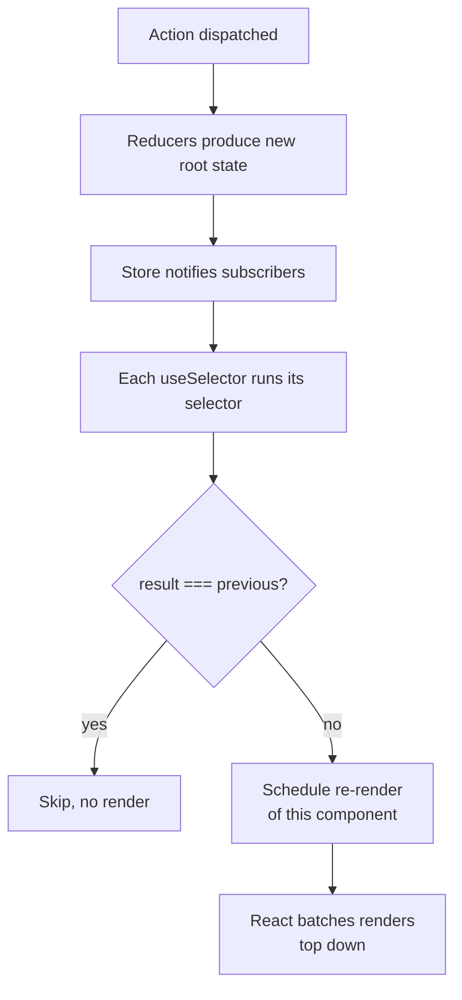
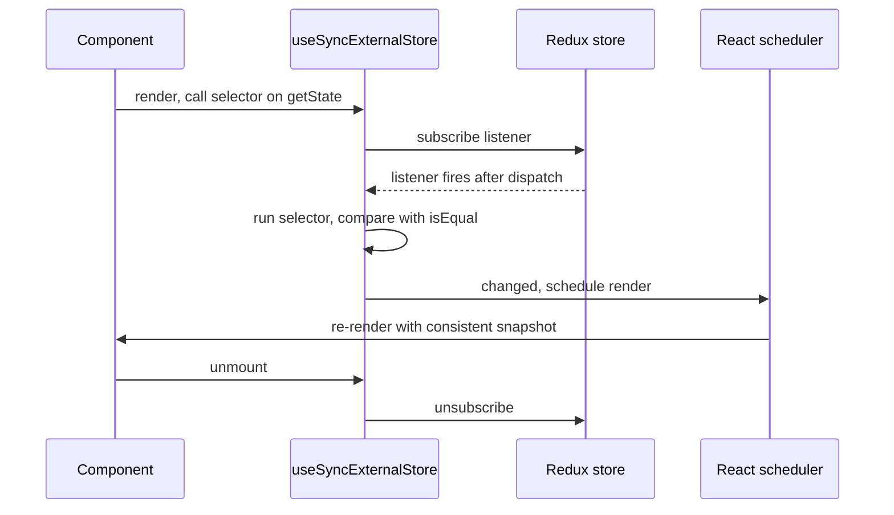

## 1. What it is

**React Redux is the official binding library that connects a Redux store to React components through a Provider and hooks (`useSelector`, `useDispatch`, `useStore`), plus the legacy `connect()` HOC.**

Picture the Redux store as a radio station broadcasting "state changed" all day. React Redux is the radio in each component. `Provider` puts the station on the air for the whole app. `useSelector` tunes a component to one frequency, and the radio only makes noise (re-renders) when the content on that frequency actually changes. `useDispatch` is the call-in line back to the station.

The problem it solves: Redux itself knows nothing about React. Without a binding you would subscribe manually in every component, compare old and new values yourself, handle unsubscribe on unmount, and deal with concurrent-rendering "tearing". React Redux does all of that efficiently and correctly.

## 2. Core concepts

### [Beginner] `Provider`: making the store available

`Provider` puts the store into React Context once, at the top of the tree. Every hook below reads it from there.

```tsx
// src/main.tsx
import { createRoot } from 'react-dom/client';
import { Provider } from 'react-redux';
import { store } from '@/app/store';
import { App } from './App';

createRoot(document.getElementById('root')!).render(
  <Provider store={store}>
    <App />
  </Provider>,
);
```

> **Why Context does not cause re-render storms here:** The Context value is the **store object**, whose reference never changes. State updates do not flow through Context. Each component subscribes to the store directly and decides for itself whether to re-render. This is the key difference from putting state itself into Context.

### [Beginner] `useSelector`: reading state

```tsx
import { useSelector } from 'react-redux';
import type { RootState } from '@/app/store';

function DisplayCurrency() {
  const currency = useSelector((state: RootState) => state.preferences.displayCurrency);
  return <span>{currency}</span>;
}
```

The selector runs on every dispatched action. React Redux compares the new result with the previous one using **strict reference equality (`===`)**. Equal: no re-render. Different: re-render.



### [Beginner] `useDispatch`: sending actions

```tsx
import { useDispatch } from 'react-redux';
import { currencyChanged } from '@/features/preferences/preferencesSlice';

function CurrencyPicker() {
  const dispatch = useDispatch();
  return (
    <select onChange={(e) => dispatch(currencyChanged(e.target.value as 'USD' | 'EUR'))}>
      <option>USD</option>
      <option>EUR</option>
    </select>
  );
}
```

`dispatch` is stable for the lifetime of the store, so it is safe in dependency arrays and does not need `useCallback` wrapping.

### [Intermediate] Reference equality and re-render behavior

Because the check is `===`, what your selector **returns** decides performance.

```tsx
// Re-renders only when this number changes
const balance = useSelector((s: RootState) => s.accounts.entities[id]?.balanceCents);

// Re-renders on EVERY action: a new object each time
const summary = useSelector((s: RootState) => ({
  count: s.transactions.ids.length,
  currency: s.preferences.displayCurrency,
}));

// Re-renders on EVERY action: filter returns a new array each time
const pending = useSelector((s: RootState) =>
  Object.values(s.transactions.entities).filter((t) => t?.status === 'pending'),
);
```

Three fixes, in order of preference:

```tsx
// 1. Call useSelector several times, one primitive each
const count = useSelector((s: RootState) => s.transactions.ids.length);
const currency = useSelector((s: RootState) => s.preferences.displayCurrency);

// 2. Memoize derived data with createSelector (returns the same ref if inputs unchanged)
const pending2 = useSelector(selectPendingTransactions);

// 3. Pass shallowEqual as the equality function for small objects
import { shallowEqual } from 'react-redux';
const summary2 = useSelector(
  (s: RootState) => ({ count: s.transactions.ids.length, currency: s.preferences.displayCurrency }),
  shallowEqual,
);
```

> **Why:** `shallowEqual` compares each top-level key with `===`. It returns "equal" for a new object whose fields are all the same values, so the re-render is skipped. It does not help with arrays of new objects (e.g. `.map(t => ({ ...t }))`).

> **Gotcha:** In development, React Redux 8.1+ runs your selector twice on first call and warns if it returns a different reference for the same state ("Selector unknown returned a different result when called with the same parameters"). That warning means your selector creates new objects; memoize it.

```tsx
// Per-hook options in v9
const value = useSelector(selectX, {
  equalityFn: shallowEqual,
  devModeChecks: { stabilityCheck: 'once', identityFunctionCheck: 'once' },
});
```

### [Intermediate] Selecting with props and memoized selectors

```tsx
import { createSelector } from '@reduxjs/toolkit';

const selectTxEntities = (s: RootState) => s.transactions.entities;

export const selectTxForAccount = createSelector(
  [selectTxEntities, (_s: RootState, accountId: string) => accountId],
  (entities, accountId) => Object.values(entities).filter((t) => t?.accountId === accountId),
);

function AccountLedger({ accountId }: { accountId: string }) {
  const txs = useSelector((s: RootState) => selectTxForAccount(s, accountId));
  return <TransactionTable rows={txs} />;
}
```

### [Intermediate] `useStore`: the raw store

`useStore` returns the store itself. It does **not** subscribe; reading `store.getState()` in render will not re-render when state changes. Use it in callbacks or for advanced cases like injecting reducers.

```tsx
import { useStore } from 'react-redux';

function ExportCsvButton() {
  const store = useStore<RootState>();
  const onExport = () => {
    // Read the latest state at click time without subscribing the component
    const txs = Object.values(store.getState().transactions.entities);
    downloadCsv(txs);
  };
  return <button onClick={onExport}>Export CSV</button>;
}
```

### [Intermediate] Typed hooks with `withTypes`

Define typed hooks once and use them everywhere, so you never annotate `state: RootState` again and `dispatch` understands thunks.

```ts
// src/app/hooks.ts
import { useDispatch, useSelector, useStore } from 'react-redux';
import type { AppDispatch, AppStore, RootState } from './store';

// React Redux 9.1+
export const useAppDispatch = useDispatch.withTypes<AppDispatch>();
export const useAppSelector = useSelector.withTypes<RootState>();
export const useAppStore = useStore.withTypes<AppStore>();
```

```tsx
const hide = useAppSelector((s) => s.preferences.hideBalances); // s is RootState
const dispatch = useAppDispatch();
dispatch(fetchAccounts({ customerId })).unwrap();               // typed thunk promise
```

> **Outdated:** Before 9.1 the pattern was `export const useAppSelector: TypedUseSelectorHook<RootState> = useSelector` and `export const useAppDispatch = () => useDispatch<AppDispatch>()`. You will see this in many codebases; it is equivalent.

### [Intermediate] Batching

When several actions are dispatched in one event, you want one render, not one per action. React 18+ batches all state updates automatically, including in promises, timeouts and native handlers.

```ts
function onLogout() {
  dispatch(loggedOut());
  dispatch(bankApi.util.resetApiState());
  dispatch(toastShown('Signed out'));
  // React 18+: one render pass for all three
}
```

> **Outdated:** In React 17 and below, updates outside React event handlers (e.g. after `await`) were not batched, so React Redux exported `batch(() => { ... })`. In React Redux 9 `batch` is deprecated: it is effectively a no-op wrapper because React does it for you.

### [Advanced] `useSyncExternalStore` under the hood

React 18 introduced concurrent rendering: React can pause a render and resume later. If an external store changes mid-render, two components could show different versions of the state. This is called **tearing**. `useSyncExternalStore` is React's official API for external stores: it guarantees a consistent snapshot and forces a synchronous re-render if the store changed during rendering.

React Redux 8+ builds `useSelector` on `useSyncExternalStoreWithSelector`, which adds selector and equality support on top.

```ts
// Simplified mental model of useSelector (not the real source)
import { useSyncExternalStoreWithSelector } from 'use-sync-external-store/with-selector';

function useSelectorSketch<T>(selector: (s: RootState) => T, isEqual = refEquality) {
  const store = useContext(ReactReduxContext).store;
  return useSyncExternalStoreWithSelector(
    store.subscribe,   // how to listen for changes
    store.getState,    // how to read the current snapshot
    store.getState,    // server snapshot (SSR)
    selector,          // derive what this component needs
    isEqual,           // decide whether derived value changed
  );
}
const refEquality = (a: unknown, b: unknown) => a === b;
```



> **Interview tip:** Mentioning tearing and `useSyncExternalStore` shows you understand why React Redux 8 needed a rewrite for React 18, and why Zustand and Jotai use the same primitive.

> **Why top-down updates:** Older versions (v7) used nested `Subscription` objects so parents updated before children, avoiding "zombie children" (a child selector running for an item the parent just removed). With `useSyncExternalStore`, React handles render ordering, but selectors should still guard against missing data: `s.entities[id]?.balanceCents`.

### [Advanced] `connect()`: reading legacy code

Before hooks (2019), components were wrapped with the `connect` higher-order component. It still works in v9 and is still supported, but new code should use hooks.

```tsx
import { connect, type ConnectedProps } from 'react-redux';
import { hideBalancesToggled } from '@/features/preferences/preferencesSlice';
import { fetchAccounts } from '@/features/accounts/accountsThunks';

interface OwnProps { customerId: string }

// 1. mapStateToProps: (state, ownProps) => props derived from the store
const mapStateToProps = (state: RootState, ownProps: OwnProps) => ({
  accounts: state.accounts.items,
  hideBalances: state.preferences.hideBalances,
  isLoading: state.accounts.status === 'loading',
});

// 2. mapDispatchToProps: object shorthand auto-wraps each action creator in dispatch
const mapDispatchToProps = {
  onToggleHide: hideBalancesToggled,
  loadAccounts: fetchAccounts,
};

const connector = connect(mapStateToProps, mapDispatchToProps);
type PropsFromRedux = ConnectedProps<typeof connector>;

function AccountsPanel({ accounts, hideBalances, isLoading, onToggleHide, loadAccounts, customerId }: PropsFromRedux & OwnProps) {
  useEffect(() => { loadAccounts({ customerId }); }, [customerId, loadAccounts]);
  /* render */
  return null;
}

export default connector(AccountsPanel);
```

How to read it:

- `mapStateToProps` is like one big `useSelector`. It runs on every store change; the returned object is **shallow-compared** to the previous one. If equal, the wrapped component does not re-render.
- `connect` also wraps the component in something like `React.memo`: it re-renders only if merged props (own + state + dispatch) change shallowly.
- `mapDispatchToProps` as an **object** binds each action creator to `dispatch`. As a **function** `(dispatch, ownProps) => ({ ... })` it lets you build custom callbacks.
- If you omit `mapDispatchToProps`, the component gets `props.dispatch`.

Converting to hooks:

```tsx
function AccountsPanel({ customerId }: OwnProps) {
  const accounts = useAppSelector((s) => s.accounts.items);
  const hideBalances = useAppSelector((s) => s.preferences.hideBalances);
  const isLoading = useAppSelector((s) => s.accounts.status === 'loading');
  const dispatch = useAppDispatch();
  useEffect(() => { dispatch(fetchAccounts({ customerId })); }, [customerId, dispatch]);
  return null;
}
```

> **Gotcha:** `mapStateToProps` returning a new array (`state.tx.filter(...)`) breaks the shallow compare and re-renders on every action, exactly like `useSelector`. Old code often fixed this with reselect "selector factories" (`makeMapStateToProps`).

## 3. Why it's used in this project

- **It is how React talks to the Redux store.** Every accounts dashboard, ledger table and transfer form reads Redux state through `useAppSelector` and sends events through `useAppDispatch`.
- **Fine-grained renders on data-heavy screens.** A ledger with thousands of rows and a live price ticker stays responsive because each row's `useSelector` returns a primitive or a single entity, and unrelated actions skip it.
- **Privacy mode across the app.** A single `hideBalances` flag read with `useAppSelector` toggles masking in headers, tables and charts at once.
- **Legacy screens.** Older parts of a long-lived financial codebase often still use `connect()`. You must be able to read, debug and safely migrate them.
- **Concurrency safety.** With React 18/19 features (transitions for filtering large tables), `useSyncExternalStore` prevents tearing, so a total in the header never disagrees with the rows below it within a frame.

> **Finance tip:** Masking should happen at render (`hideBalances ? '••••' : format(amount)`), not by removing data from the store, so toggling does not refetch. But never log full state with PII to analytics or error trackers; sanitize first.

## 4. Setup & configuration

```bash
npm install react-redux @reduxjs/toolkit
# React Redux 9 requires React 18+. TypeScript types are bundled (no @types package needed).
```

```tsx
// src/main.tsx
import { StrictMode } from 'react';
import { createRoot } from 'react-dom/client';
import { Provider } from 'react-redux';
import { store } from '@/app/store';
import { App } from './App';

createRoot(document.getElementById('root')!).render(
  <StrictMode>
    <Provider
      store={store}                 // required: the Redux store
      // serverState={preloaded}    // SSR: snapshot used during hydration
      // context={CustomContext}    // rare: multiple stores / micro-frontends
      stabilityCheck="once"         // dev: warn if selectors return unstable refs (default 'once')
      identityFunctionCheck="once"  // dev: warn if a selector returns the whole state (default 'once')
    >
      <App />
    </Provider>
  </StrictMode>,
);
```

```ts
// src/app/hooks.ts — the only place that imports raw hooks
import { useDispatch, useSelector, useStore } from 'react-redux';
import type { AppDispatch, AppStore, RootState } from './store';

export const useAppDispatch = useDispatch.withTypes<AppDispatch>();
export const useAppSelector = useSelector.withTypes<RootState>();
export const useAppStore = useStore.withTypes<AppStore>();
```

Enforce it with ESLint so nobody imports untyped hooks:

```js
// eslint.config.js (flat config) excerpt
{
  rules: {
    'no-restricted-imports': ['error', {
      paths: [{ name: 'react-redux', importNames: ['useSelector', 'useDispatch'],
        message: 'Use useAppSelector / useAppDispatch from @/app/hooks' }],
    }],
  },
}
```

## 5. Key features we use

### [Beginner] Masked money component

```tsx
export function Balance({ accountId }: { accountId: string }) {
  const cents = useAppSelector((s) => s.accounts.entities[accountId]?.balanceCents);
  const currency = useAppSelector((s) => s.accounts.entities[accountId]?.currency ?? 'USD');
  const hide = useAppSelector((s) => s.preferences.hideBalances);
  if (cents === undefined) return <Skeleton width={80} />;
  if (hide) return <span aria-label="Balance hidden">••••</span>;
  return <span>{new Intl.NumberFormat('en-US', { style: 'currency', currency }).format(cents / 100)}</span>;
}
```

### [Intermediate] Virtualized ledger: list selects IDs, rows select entities

```tsx
function LedgerList() {
  const ids = useAppSelector(selectTransactionIds); // stable array ref unless ids change
  return <VirtualList count={ids.length} renderRow={(i) => <LedgerRow key={ids[i]} id={ids[i]} />} />;
}

const LedgerRow = memo(function LedgerRow({ id }: { id: string }) {
  const tx = useAppSelector((s) => selectTransactionById(s, id)); // same ref unless this tx changed
  if (!tx) return null;
  return <div role="row">{tx.postedAt} {tx.amountCents}</div>;
});
```

### [Intermediate] Submit with `unwrap` and navigate

```tsx
function TransferSubmit({ draft }: { draft: NewTransfer }) {
  const dispatch = useAppDispatch();
  const navigate = useNavigate();
  const [error, setError] = useState<string | null>(null);

  async function onSubmit() {
    try {
      const { transferId } = await dispatch(submitTransfer(draft)).unwrap();
      navigate(`/transfers/${transferId}`);
    } catch (e) {
      setError((e as { message?: string }).message ?? 'Transfer failed');
    }
  }
  return <button onClick={onSubmit}>Confirm transfer</button>;
}
```

### [Advanced] Test helper with a real store

```tsx
export function renderWithProviders(ui: ReactElement, { preloadedState = {}, store = makeStore(preloadedState) } = {}) {
  return { store, ...render(<Provider store={store}>{ui}</Provider>) };
}

test('masks balance', () => {
  renderWithProviders(<Balance accountId="a1" />, {
    preloadedState: { preferences: { displayCurrency: 'USD', hideBalances: true } },
  });
  expect(screen.getByLabelText('Balance hidden')).toBeInTheDocument();
});
```

## 6. Interview questions

#### Q: When does a component using `useSelector` re-render?

After every dispatched action, the selector runs with the new state. The result is compared with the previous result using `===` by default (or a custom `equalityFn`). The component re-renders only if they differ, or if its parent re-renders it for other reasons. So selectors returning primitives or existing references are cheap; selectors returning new objects or arrays (`{...}`, `.map`, `.filter`) cause a re-render on every action unless memoized with `createSelector` or compared with `shallowEqual`.

#### Q: Why doesn't `Provider` cause the whole app to re-render on every state change like a normal Context would?

Because the Context value is the store object, which never changes. State is not passed through Context. Each `useSelector` subscribes to the store directly (via `useSyncExternalStore`) and only re-renders its own component when its selected value changes. Plain Context with state inside re-renders every consumer whenever the value object changes.

#### Q: What is `useSyncExternalStore` and why does React Redux use it?

It is a React 18 hook for subscribing to stores that live outside React. It takes `subscribe` and `getSnapshot` and guarantees all components see the same snapshot during a concurrent render, preventing tearing. React Redux 8+ uses `useSyncExternalStoreWithSelector` so `useSelector` is concurrency-safe and gets selector plus equality support. Version 9 uses React's built-in hook directly and requires React 18+.

#### Q: How would you convert a `connect()` component to hooks?

Replace each field of `mapStateToProps` with a `useSelector` call (preferably one per value, or a memoized selector), replace `mapDispatchToProps` with `const dispatch = useDispatch()` and call `dispatch(actionCreator(...))` in handlers, remove the `connect(...)` wrapper, and add `React.memo` if the old component relied on connect's shallow prop comparison to skip renders caused by its parent. Keep `ownProps` as normal props. Test that render counts and behavior match.

#### Q: What is the difference between `useSelector`, `useStore` and `store.getState()`?

`useSelector` subscribes: the component re-renders when the selected value changes. `useStore` returns the store instance and does not subscribe, so reading `getState()` from it in render gives a stale snapshot on later renders unless something else re-renders the component. Use `useStore` (or the imported store) only inside event handlers, effects, or for advanced APIs like reducer injection. In components, always render from `useSelector`.

## 7. Drawbacks & pain points

- **Selector discipline.** Easy to accidentally return new references and re-render on every action. The dev-mode stability check helps but only warns.
- **Every action runs every selector.** With thousands of mounted `useSelector`s and frequent actions (price ticks), the selector runs themselves can cost time. Keep selectors cheap and memoize heavy ones.
- **Provider required.** Unlike Zustand, components cannot read state without a Provider ancestor, which adds test setup.
- **Legacy `connect` code.** HOC layers, `mapStateToProps` factories and `ownProps` make old code hard to follow and type.
- **Typing boilerplate** before 9.1 (`TypedUseSelectorHook`), still seen in many repos.
- **No built-in derived-state memoization** beyond the equality function; you must bring `createSelector`.

Gotchas that trip devs up:

```tsx
// 1. Returning the whole state or a big slice: re-renders on any change inside it
const accounts = useAppSelector((s) => s.accounts); // re-renders when status flips too

// 2. Default value creates a new array each time
const list = useAppSelector((s) => s.watchlist.items ?? []); // new [] when undefined
const EMPTY: string[] = [];
const list2 = useAppSelector((s) => s.watchlist.items ?? EMPTY);

// 3. Reading state via useStore in render: not reactive
const store = useAppStore();
const hide = store.getState().preferences.hideBalances; // stale after toggle

// 4. Inline selector with createSelector inside the component: new memo cache per render
const txs = useAppSelector(createSelector([selectAll], (a) => a.filter(isPending))); // BAD
// Define selectors at module scope (or useMemo for per-instance factories)

// 5. Async thunk result without unwrap
const res = await dispatch(fetchAccounts(arg)); // resolves even on failure
```

## 8. Better alternatives

React Redux is the only sensible binding if you use Redux, so the real choice is whether to use Redux at all. The industry trend is to keep server data in a query cache and use lighter client stores. Libraries like Zustand and Jotai use the same `useSyncExternalStore` primitive without a Provider (Zustand) or with atom-level subscriptions (Jotai).

| Option | Bundle (gzip, approx) | Boilerplate | Devtools | Learning curve | TS support | Community | When it wins |
|---|---|---|---|---|---|---|---|
| React Redux hooks + RTK | ~5 KB + ~14 KB | Medium | Redux DevTools | Medium | Excellent (withTypes) | Very large | Already on Redux, large teams |
| React Redux `connect` | same | High | Redux DevTools | Medium-high | Awkward (ConnectedProps) | Legacy | Only maintaining old code |
| Zustand hooks | ~1 KB | Very low | Redux DevTools via middleware | Low | Good | Very large | Simple global client state, no Provider |
| Jotai | ~3-4 KB | Low | Jotai DevTools | Low-medium | Excellent | Large | Atomic, derived state graphs |
| TanStack Query hooks | ~13 KB | Low | Dedicated devtools | Medium | Excellent | Very large | Server state |
| React Context + hooks | 0 KB | Low-medium | React DevTools | Low | Good | Built in | Rarely changing values |

## 9. When NOT to use it

- **The app does not use Redux.** React Redux has no purpose without a Redux store.
- **New components in a hooks codebase:** do not write new `connect()` components.
- **Local or form state:** keep it in `useState` or the form library instead of selecting from Redux.
- **Reading state in non-React modules** (API clients, timers): import the store and call `store.getState()`; hooks only work in components.
- **Per-widget isolated state** that should not be global: use `useReducer` or a scoped store.
- **Multiple independent stores** in one app: possible via the `context` prop, but usually a design smell; prefer one store with slices.

## Cheatsheet

| Task | API |
|---|---|
| Provide store | `<Provider store={store}>` |
| Read state | `useAppSelector((s) => s.x.y)` |
| Custom equality | `useSelector(sel, shallowEqual)` or `useSelector(sel, { equalityFn })` |
| Dispatch | `const dispatch = useAppDispatch(); dispatch(action())` |
| Thunk result | `await dispatch(thunk(arg)).unwrap()` |
| Raw store | `useAppStore().getState()` (non-reactive) |
| Typed hooks | `useSelector.withTypes<RootState>()`, `useDispatch.withTypes<AppDispatch>()`, `useStore.withTypes<AppStore>()` |
| Legacy typed hooks | `TypedUseSelectorHook<RootState>` |
| Batching | Automatic in React 18+; `batch()` deprecated |
| Legacy HOC | `connect(mapState, mapDispatch)(Component)`, `ConnectedProps<typeof connector>` |
| Dev checks | `Provider stabilityCheck` / `identityFunctionCheck`: `'once' | 'always' | 'never'` |

```tsx
import { Provider, useSelector, useDispatch, useStore, shallowEqual, connect } from 'react-redux';

export const useAppSelector = useSelector.withTypes<RootState>();
export const useAppDispatch = useDispatch.withTypes<AppDispatch>();

function Header() {
  const hide = useAppSelector((s) => s.preferences.hideBalances);             // primitive
  const { name, tier } = useAppSelector(
    (s) => ({ name: s.session.displayName, tier: s.session.tier }), shallowEqual,
  );                                                                            // small object
  const dispatch = useAppDispatch();
  return <button onClick={() => dispatch(hideBalancesToggled())}>{hide ? 'Show' : 'Hide'}</button>;
}
```
