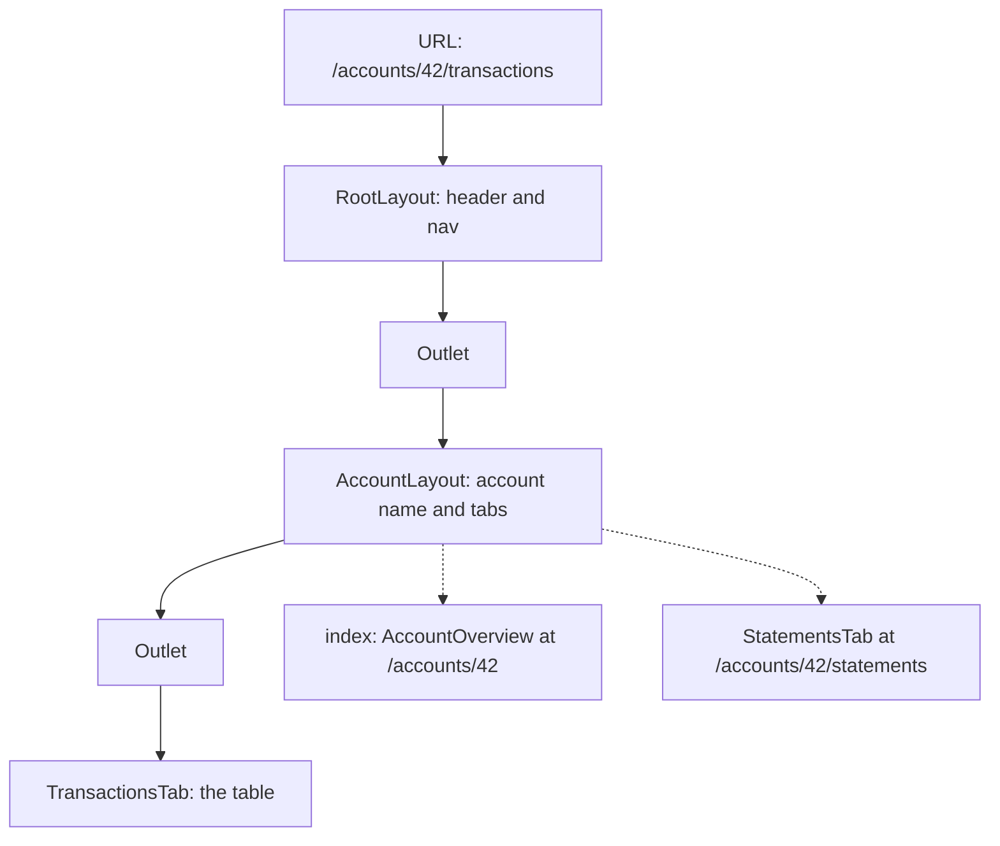
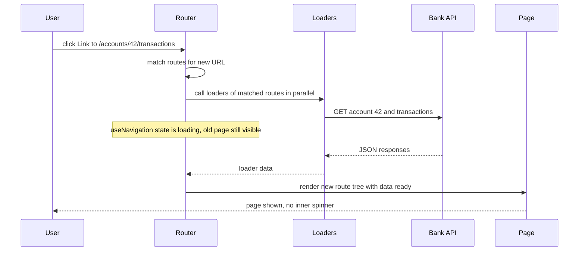
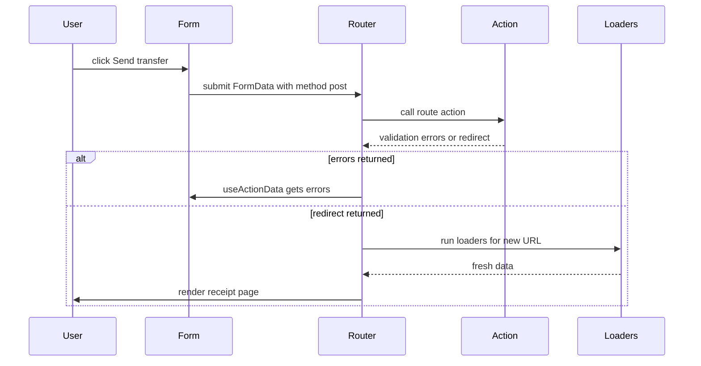
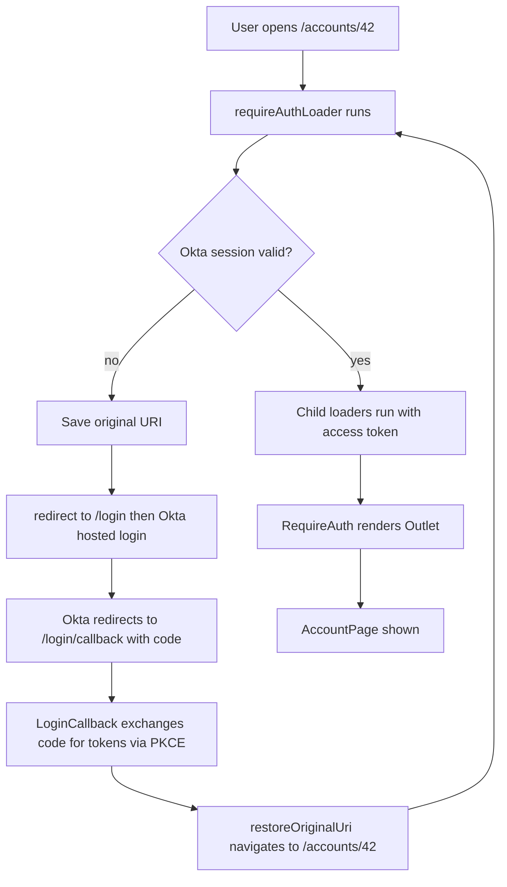

## 1. What it is

**React Router is the standard client-side routing library for React: it decides which components render for the current URL and changes the URL without a full page reload.**

Think of a building directory in an office lobby. The URL is the address you ask for ("Floor 3, Accounts, Room 42"). The router reads it, sends you to the right floor (layout), the right department (nested route), and the right room (the page), and it does this without demolishing and rebuilding the building every time you move.

The problem it solves: a single-page app has one HTML file, but users still expect real URLs. They want to bookmark `/accounts/42/transactions?type=debit`, use the Back button, share links, and refresh without losing their place. React Router keeps the URL and the UI in sync, and since v6.4 it also loads data and handles form submissions per route.

## 2. Core concepts

### [Beginner] Client-side routing and the History API

Without a router, clicking `<a href="/accounts">` makes the browser request a new HTML page from the server. The whole app reloads and all in-memory state is lost.

A client-side router intercepts the click, calls `history.pushState()` to change the URL, and re-renders the matching components. No server round trip for HTML.

```ts
// What React Router does under the hood, simplified
window.history.pushState({}, "", "/accounts/42"); // URL changes, no reload
window.addEventListener("popstate", () => {
  // Back/Forward pressed: re-read window.location and render the matching route
});
```

> **Why:** This is why the server must be configured to return `index.html` for every unknown path (a "SPA fallback"). If a user refreshes on `/accounts/42`, the server receives that path, and only the JS app knows what it means.

### [Beginner] createBrowserRouter and RouterProvider

Since v6.4 the recommended setup is a **data router**: you define routes as plain objects, create the router once, and render it with `RouterProvider`.

```tsx
// src/router.tsx
import { createBrowserRouter } from "react-router-dom";
import { RootLayout } from "./layouts/RootLayout";
import { DashboardPage } from "./pages/DashboardPage";
import { AccountsPage } from "./pages/AccountsPage";
import { NotFoundPage } from "./pages/NotFoundPage";

export const router = createBrowserRouter([
  {
    path: "/",
    element: <RootLayout />,
    errorElement: <NotFoundPage />,
    children: [
      { index: true, element: <DashboardPage /> },     // renders at exactly "/"
      { path: "accounts", element: <AccountsPage /> }, // renders at "/accounts"
    ],
  },
]);

// src/main.tsx
import { createRoot } from "react-dom/client";
import { RouterProvider } from "react-router-dom";
import { router } from "./router";

createRoot(document.getElementById("root")!).render(<RouterProvider router={router} />);
```

Other router factories: `createHashRouter` (URLs like `/#/accounts`, for hosts where you cannot configure a SPA fallback) and `createMemoryRouter` (no browser URL, used in tests and Storybook).

> **Outdated:** `<BrowserRouter><Routes><Route .../></Routes></BrowserRouter>` still works, but it cannot use loaders, actions, `useFetcher`, or `errorElement`. Treat it as the "declarative" legacy style. In v5 you also had `<Switch>`, `component={}`, `useHistory()` and `exact`. All of those are gone in v6.

### [Beginner] Route objects and matching

A route object says "for this path pattern, render this element". Paths are matched by **ranking**, not by order: v6 picks the most specific match automatically, so `/accounts/new` beats `/accounts/:accountId` regardless of which is listed first.

```tsx
const routes = [
  { path: "accounts/new", element: <NewAccountPage /> },          // static segment: most specific
  { path: "accounts/:accountId", element: <AccountPage /> },       // dynamic segment
  { path: "reports/*", element: <ReportsSection /> },              // splat: matches anything below
  { path: "*", element: <NotFoundPage /> },                        // catch-all 404
];
```

Key route object fields:

| Field | Purpose |
| --- | --- |
| `path` | URL pattern. Relative to the parent unless it starts with `/`. |
| `element` | What to render when matched. |
| `children` | Nested routes rendered into this route's `<Outlet />`. |
| `index` | `true` means "render at the parent's exact path". Has no `path` and no `children`. |
| `loader` | Function that loads data before render. |
| `action` | Function that handles form submissions (non-GET). |
| `errorElement` | Rendered when this route's loader, action or render throws. |
| `lazy` | Function that imports the route module on demand (v6.9+). |
| `id` | Stable id, used with `useRouteLoaderData`. |
| `handle` | Arbitrary data, e.g. breadcrumb labels, read via `useMatches`. |

### [Beginner] Nested routes and Outlet

Nested routes mirror nested UI. A parent route renders shared chrome (header, sidebar) and an `<Outlet />` where the matched child appears.

```tsx
// layouts/RootLayout.tsx
import { NavLink, Outlet } from "react-router-dom";

export function RootLayout() {
  return (
    <div className="app-shell">
      <header>FinApp</header>
      <nav>
        <NavLink to="/" end>Dashboard</NavLink>
        <NavLink to="/accounts">Accounts</NavLink>
        <NavLink to="/reports">Reports</NavLink>
      </nav>
      <main>
        <Outlet /> {/* the matched child route renders here */}
      </main>
    </div>
  );
}
```

URL `/accounts/42/transactions` with this config renders three levels at once:

```tsx
{
  path: "/", element: <RootLayout />,
  children: [{
    path: "accounts/:accountId", element: <AccountLayout />,   // tabs: Overview | Transactions
    children: [
      { index: true, element: <AccountOverview /> },          // /accounts/42
      { path: "transactions", element: <TransactionsTab /> }, // /accounts/42/transactions
      { path: "statements", element: <StatementsTab /> },     // /accounts/42/statements
    ],
  }],
}
```



> **Why:** Nesting means switching from the Transactions tab to Statements only re-renders the innermost part. The header, nav and account summary stay mounted and keep their state, and their loaders do not re-run unless their params changed.

### [Beginner] Index routes and layout routes

- An **index route** is the default child: what shows at the parent's own URL. `{ index: true, element: <AccountOverview /> }`.
- A **layout route** has an `element` and `children` but **no `path`**. It wraps a group of routes in shared UI or logic without adding a URL segment. Perfect for auth guards.

```tsx
createBrowserRouter([
  {
    element: <PublicLayout />,                 // layout route: no path
    children: [
      { path: "/login", element: <LoginPage /> },
      { path: "/login/callback", element: <LoginCallback /> },
    ],
  },
  {
    element: <RequireAuth />,                  // layout route: guards everything below
    children: [
      { path: "/", element: <DashboardPage /> },
      { path: "/accounts", element: <AccountsPage /> },
    ],
  },
]);
```

### [Intermediate] Reading the URL: useParams, useSearchParams, useLocation

```tsx
import { useLocation, useParams, useSearchParams } from "react-router-dom";

function TransactionsTab() {
  // Path params: /accounts/:accountId/transactions
  const { accountId } = useParams<{ accountId: string }>(); // always string | undefined

  // Query string: ?type=debit&from=2026-09-01
  const [searchParams] = useSearchParams();
  const type = searchParams.get("type") ?? "all";

  // Full location: pathname, search, hash, state, key
  const location = useLocation();

  return <p>{accountId} {type} {location.pathname}</p>;
}
```

> **Gotcha:** `useParams` values are always strings (or `undefined`). `accountId === 42` is always false. Validate and convert: `Number(accountId)` or parse with Zod.

### [Intermediate] Filters in the URL with useSearchParams

For transaction lists, put filters, sort and page in the **query string**, not in `useState`.

```tsx
type TxType = "all" | "debit" | "credit";

export function TransactionFilters() {
  const [params, setParams] = useSearchParams();
  const type = (params.get("type") as TxType | null) ?? "all";
  const from = params.get("from") ?? "";
  const page = Number(params.get("page") ?? "1");

  function update(key: string, value: string) {
    setParams((prev) => {
      const next = new URLSearchParams(prev);
      if (value) next.set(key, value); else next.delete(key);
      if (key !== "page") next.delete("page");     // changing a filter resets to page 1
      return next;
    }, { replace: true });                          // do not flood history with every keystroke
  }

  return (
    <div className="filters">
      <select value={type} onChange={(e) => update("type", e.target.value)}>
        <option value="all">All</option>
        <option value="debit">Debits</option>
        <option value="credit">Credits</option>
      </select>
      <input type="date" value={from} onChange={(e) => update("from", e.target.value)} />
      <button onClick={() => update("page", String(page + 1))}>Next page</button>
    </div>
  );
}
```

> **Why:** URL state survives refresh, can be bookmarked and shared ("look at these flagged debits"), works with Back/Forward, and makes the loader the single place that reads filters. `useState` filters vanish on refresh and cannot be linked.

> **Finance tip:** Never put PII or account numbers in query strings. URLs end up in browser history, server logs, analytics and `Referer` headers. Use opaque ids (`accountId=acc_8f3k`) and keep filters non-sensitive.

### [Intermediate] Navigation: Link, NavLink, useNavigate

```tsx
import { Link, NavLink, useNavigate } from "react-router-dom";

// Link: an <a> that navigates client-side. Use it for anything the user clicks to go somewhere.
<Link to={`/accounts/${account.id}`}>{account.name}</Link>
<Link to="transactions">Relative to the current route</Link>
<Link to="..">Up one route level</Link>

// NavLink: adds active styling and aria-current="page" automatically
<NavLink to="/reports" className={({ isActive }) => (isActive ? "nav active" : "nav")}>
  Reports
</NavLink>
// `end` makes "/" active only on exactly "/", not on every page
<NavLink to="/" end>Dashboard</NavLink>

// useNavigate: imperative navigation after something happens in code
function TransferSuccessButton({ transferId }: { transferId: string }) {
  const navigate = useNavigate();
  return (
    <button onClick={() => navigate(`/transfers/${transferId}`, { replace: true, state: { fromWizard: true } })}>
      View receipt
    </button>
  );
}
// navigate(-1) goes back one entry
```

> **Gotcha:** Do not use `navigate()` for plain links. A `<Link>` is a real `<a href>`: users can middle-click to open in a new tab, screen readers announce it as a link, and it is crawlable. `<button onClick={() => navigate(...)}>` breaks all of that.

> **Gotcha:** Calling `navigate()` during render logs a warning and may not work. Call it in an event handler or effect, or better, `redirect()` from a loader.

### [Intermediate] Loaders and useLoaderData

A **loader** is a function attached to a route that runs **before** the route renders. The router calls it on navigation, waits for it, then renders the page with data ready. No loading spinners inside the page, no `useEffect` fetch, no race conditions.

```tsx
// routes/account.tsx
import { useLoaderData, type LoaderFunctionArgs } from "react-router-dom";

interface Account { id: string; name: string; balanceCents: number; currency: string }

export async function accountLoader({ params, request }: LoaderFunctionArgs) {
  const res = await fetch(`/api/accounts/${params.accountId}`, {
    signal: request.signal,           // the router aborts this if the user navigates away
  });
  if (res.status === 404) {
    throw new Response("Account not found", { status: 404 }); // goes to errorElement
  }
  if (!res.ok) throw new Error("Failed to load account");
  return (await res.json()) as Account;
}

export function AccountPage() {
  const account = useLoaderData() as Awaited<ReturnType<typeof accountLoader>>;
  return <h1>{account.name}</h1>;
}

// route config
{ path: "accounts/:accountId", element: <AccountPage />, loader: accountLoader, errorElement: <AccountError /> }
```

Loaders also read search params, which is how URL filters drive data:

```tsx
export async function transactionsLoader({ params, request }: LoaderFunctionArgs) {
  const url = new URL(request.url);
  const query = new URLSearchParams({
    type: url.searchParams.get("type") ?? "all",
    from: url.searchParams.get("from") ?? "",
    page: url.searchParams.get("page") ?? "1",
  });
  const res = await fetch(`/api/accounts/${params.accountId}/transactions?${query}`, { signal: request.signal });
  if (!res.ok) throw new Response("Could not load transactions", { status: res.status });
  return res.json() as Promise<{ rows: Transaction[]; total: number }>;
}
```



> **Why:** Loaders for all matched nested routes run **in parallel**, not as a waterfall. With `useEffect` fetching, the parent renders, then fetches, then renders the child, which then fetches. That is a network waterfall. Loaders start everything at once as soon as the URL is known.

`useNavigation()` exposes the global pending state, so you can show a top progress bar while loaders run:

```tsx
function GlobalProgress() {
  const navigation = useNavigation();
  return navigation.state !== "idle" ? <div className="progress-bar" role="progressbar" /> : null;
}
```

> **Gotcha:** `useLoaderData` is not generic in v6; you cast the result. TypeScript cannot check that the cast matches what the loader returns. React Router v7 (framework mode) generates route types to fix this.

### [Intermediate] Actions and Form

An **action** handles a mutation (POST, PUT, PATCH, DELETE) for a route. `<Form>` is a progressively enhanced `<form>`: instead of a full page POST, the router serializes the fields to `FormData`, calls the route's action, then **automatically re-runs all loaders on the page** so the UI shows fresh data.

```tsx
import { useState } from "react";
import { Form, redirect, useActionData, useNavigation, type ActionFunctionArgs } from "react-router-dom";

type ActionErrors = { amount?: string; toAccountId?: string };

export async function transferAction({ request, params }: ActionFunctionArgs) {
  const form = await request.formData();
  const toAccountId = String(form.get("toAccountId") ?? "");
  const amountCents = Math.round(Number(form.get("amount")) * 100);

  const errors: ActionErrors = {};
  if (!toAccountId) errors.toAccountId = "Choose a destination account";
  if (!Number.isFinite(amountCents) || amountCents <= 0) errors.amount = "Enter an amount above 0";
  if (Object.keys(errors).length) return errors;         // returned to useActionData

  const res = await fetch("/api/transfers", {
    method: "POST",
    headers: { "Content-Type": "application/json", "Idempotency-Key": String(form.get("idempotencyKey")) },
    body: JSON.stringify({ fromAccountId: params.accountId, toAccountId, amountCents }),
  });
  if (!res.ok) return { amount: "Transfer failed, please try again" } satisfies ActionErrors;
  const { transferId } = await res.json();
  return redirect(`/transfers/${transferId}`);           // navigate after success
}

export function TransferPage() {
  const errors = useActionData() as ActionErrors | undefined;
  const navigation = useNavigation();
  const submitting = navigation.state === "submitting";
  const [idempotencyKey] = useState(() => crypto.randomUUID()); // created once per form instance

  return (
    <Form method="post">
      <input type="hidden" name="idempotencyKey" value={idempotencyKey} />
      <select name="toAccountId" defaultValue="">
        <option value="" disabled>Select account</option>
        <option value="acc_savings">Savings</option>
      </select>
      {errors?.toAccountId && <p role="alert">{errors.toAccountId}</p>}
      <input name="amount" inputMode="decimal" />
      {errors?.amount && <p role="alert">{errors.amount}</p>}
      <button disabled={submitting}>{submitting ? "Sending…" : "Send transfer"}</button>
    </Form>
  );
}
```



> **Gotcha:** Writing `value={crypto.randomUUID()}` directly would create a new key on every render, so a retry after a re-render would look like a brand-new transfer. The lazy `useState` initializer creates it once, so a double click or retry sends the same key and the server can reject the duplicate.

> **Finance tip:** Disable the submit button while `navigation.state === "submitting"` and send an idempotency key. Duplicate payments are one of the most expensive frontend bugs in finance.

### [Intermediate] useFetcher: mutations and loads without navigation

`useFetcher` calls a loader or action **without changing the URL**. Use it for inline interactions: flag a transaction, toggle a favorite payee, load a popover's details, autosave.

```tsx
import { useFetcher } from "react-router-dom";

function FlagButton({ tx }: { tx: { id: string; flagged: boolean } }) {
  const fetcher = useFetcher();
  // Optimistic UI: show the submitted value while the request is in flight
  const flagged = fetcher.formData ? fetcher.formData.get("flagged") === "true" : tx.flagged;

  return (
    <fetcher.Form method="post" action={`/transactions/${tx.id}/flag`}>
      <input type="hidden" name="flagged" value={String(!flagged)} />
      <button aria-pressed={flagged}>{flagged ? "Flagged" : "Flag"}</button>
    </fetcher.Form>
  );
}

// Load data on demand without navigating
function PayeeLookup() {
  const fetcher = useFetcher<{ name: string }[]>();
  return (
    <>
      <input onChange={(e) => fetcher.load(`/payees/search?q=${encodeURIComponent(e.target.value)}`)} />
      {fetcher.state === "loading" && <span>Searching…</span>}
      <ul>{fetcher.data?.map((p) => <li key={p.name}>{p.name}</li>)}</ul>
    </>
  );
}
```

Each fetcher has its own `state` (`idle`, `loading`, `submitting`) and `data`, so ten rows can each flag independently. After a fetcher action completes, page loaders revalidate, just like with `<Form>`.

### [Intermediate] errorElement and useRouteError

When a loader, action, or component render throws, React Router renders the closest route's `errorElement` instead of the route's `element`. The parent layout keeps rendering, so the user still has navigation.

```tsx
import { isRouteErrorResponse, useRouteError, Link } from "react-router-dom";

export function AccountError() {
  const error = useRouteError();

  if (isRouteErrorResponse(error)) {          // something threw `new Response(...)`
    if (error.status === 404) return <p>This account does not exist or you do not have access.</p>;
    if (error.status === 403) return <p>You are not authorized to view this account.</p>;
    return <p>Error {error.status}: {error.statusText}</p>;
  }
  // Unexpected error: do not show raw messages (may contain internal details)
  return (
    <div role="alert">
      <p>Something went wrong loading this account.</p>
      <Link to="/accounts">Back to accounts</Link>
    </div>
  );
}
```

> **Why:** Throwing a `Response` from a loader is control flow: "stop rendering this route, show the error UI with this status". It keeps loaders clean: no `{ data, error }` unions that every component has to check.

> **Gotcha:** Without any `errorElement`, React Router shows its default dev error screen ("Unexpected Application Error"). Always put one on the root route, and add more on important sub-routes so an error in one tab does not wipe the whole layout.

### [Intermediate] redirect()

`redirect(url)` creates a `302` Response. Return or throw it from a loader or action to navigate before anything renders.

```tsx
import { redirect } from "react-router-dom";

// Old URL kept working after a restructure
{ path: "statements", loader: () => redirect("/reports/statements") }

// After creating something
return redirect(`/accounts/${newAccount.id}`);

// Guard: throw so the rest of the loader never runs
if (!user.canViewReports) throw redirect("/");
```

### [Advanced] Protected routes with Okta

Two layers protect a route: a **component guard** for rendering, and a **loader guard** so protected data is never even requested without a session. (The real security boundary is always the API validating the access token. Frontend guards are UX.)

`@okta/okta-react` ships `SecureRoute`, but it was built for React Router v5 and does not work with v6. With v6 you write a small layout-route guard using `useOktaAuth`.

```tsx
// auth/oktaAuth.ts
import { OktaAuth, toRelativeUrl } from "@okta/okta-auth-js";

export const oktaAuth = new OktaAuth({
  issuer: import.meta.env.VITE_OKTA_ISSUER,         // https://yourorg.okta.com/oauth2/default
  clientId: import.meta.env.VITE_OKTA_CLIENT_ID,
  redirectUri: `${window.location.origin}/login/callback`,
  scopes: ["openid", "profile", "email", "offline_access"],
  pkce: true,                                        // required for SPAs: no client secret in the browser
});
export { toRelativeUrl };
```

```tsx
// layouts/AuthRoot.tsx: Security must be INSIDE the router so it can use useNavigate
import { Security } from "@okta/okta-react";
import { Outlet, useNavigate } from "react-router-dom";
import { oktaAuth, toRelativeUrl } from "../auth/oktaAuth";

export function AuthRoot() {
  const navigate = useNavigate();
  const restoreOriginalUri = async (_oktaAuth: unknown, originalUri: string | undefined) => {
    navigate(toRelativeUrl(originalUri || "/", window.location.origin), { replace: true });
  };
  return (
    <Security oktaAuth={oktaAuth} restoreOriginalUri={restoreOriginalUri}>
      <Outlet />
    </Security>
  );
}
```

```tsx
// auth/RequireAuth.tsx: component guard as a layout route
import { useEffect } from "react";
import { useOktaAuth } from "@okta/okta-react";
import { toRelativeUrl } from "@okta/okta-auth-js";
import { Outlet } from "react-router-dom";

export function RequireAuth() {
  const { oktaAuth, authState } = useOktaAuth();

  useEffect(() => {
    if (authState && !authState.isAuthenticated) {
      // Remember where the user was going, then send them to Okta
      oktaAuth.setOriginalUri(toRelativeUrl(window.location.href, window.location.origin));
      void oktaAuth.signInWithRedirect();
    }
  }, [authState, oktaAuth]);

  if (!authState || !authState.isAuthenticated) return <FullPageSpinner label="Checking session" />;
  return <Outlet />;
}
```

```tsx
// Loader guard: block data loading before render
import { redirect, type LoaderFunctionArgs } from "react-router-dom";
import { oktaAuth } from "./auth/oktaAuth";

export async function requireAuthLoader({ request }: LoaderFunctionArgs) {
  if (!(await oktaAuth.isAuthenticated())) {
    const url = new URL(request.url);
    oktaAuth.setOriginalUri(url.pathname + url.search);
    throw redirect("/login");                         // LoginPage calls signInWithRedirect
  }
  return null;
}

// router.tsx
import { LoginCallback } from "@okta/okta-react";

export const router = createBrowserRouter([
  {
    element: <AuthRoot />,                                  // provides Okta context to everything
    errorElement: <AppError />,
    children: [
      { path: "/login", element: <LoginPage /> },
      { path: "/login/callback", element: <LoginCallback /> }, // exchanges the code for tokens
      {
        element: <RequireAuth />,                              // guard layout route, no path
        loader: requireAuthLoader,
        children: [
          { path: "/", element: <DashboardPage /> },
          { path: "/accounts/:accountId", element: <AccountPage />, loader: accountLoader },
        ],
      },
    ],
  },
]);
```



Role-based access follows the same pattern: read claims from the ID token (`authState.idToken?.claims.groups`) and `throw redirect("/")` or `throw new Response("Forbidden", { status: 403 })`.

> **Gotcha:** Parent loaders and child loaders run **in parallel**. A guard on the parent does not stop child loaders from starting. Child loaders must also fail safely: send the access token and let the API return 401, or call a shared `await requireAuth()` helper at the top of each sensitive loader.

> **Finance tip:** Pair the guard with an idle-timeout watcher that calls `oktaAuth.signOut()` after N minutes of inactivity. Many financial regulators and internal policies require automatic session timeout.

### [Advanced] Lazy routes and code splitting

The `lazy` property (v6.9+) loads a route's code only when the route is first matched. The module can export `Component`, `loader`, `action`, `ErrorBoundary`, and other route fields.

```tsx
// router.tsx
{
  path: "reports",
  lazy: () => import("./routes/reports"),   // separate chunk, downloaded on first visit
}

// routes/reports.tsx
export async function loader() {
  return fetch("/api/reports/summary").then((r) => r.json());
}
export function Component() {                 // named "Component", not default export
  const summary = useLoaderData() as ReportSummary;
  return <ReportsDashboard summary={summary} />;
}
export function ErrorBoundary() {
  return <p>Reports are temporarily unavailable.</p>;
}
Component.displayName = "ReportsRoute";
```

> **Why:** `lazy` lets the router download the route code **and** start the loader in parallel as soon as navigation begins. Using `React.lazy` inside `element` instead means the loader cannot be split out, and you get a waterfall: download component, render, then fetch.

### [Advanced] Deferred data with defer and Await (v6)

Sometimes part of a page is slow (a 5-year performance chart) and should not block the rest.

```tsx
import { defer, Await, useLoaderData } from "react-router-dom";
import { Suspense } from "react";

export async function portfolioLoader({ params }: LoaderFunctionArgs) {
  const summary = await fetchSummary(params.portfolioId!);       // fast: awaited
  const history = fetchFiveYearHistory(params.portfolioId!);     // slow: NOT awaited
  return defer({ summary, history });
}

export function PortfolioPage() {
  const { summary, history } = useLoaderData() as { summary: Summary; history: Promise<HistoryPoint[]> };
  return (
    <>
      <SummaryCards summary={summary} />
      <Suspense fallback={<ChartSkeleton />}>
        <Await resolve={history} errorElement={<p>Chart unavailable.</p>}>
          {(points: HistoryPoint[]) => <PerformanceChart points={points} />}
        </Await>
      </Suspense>
    </>
  );
}
```

> **Outdated:** In v7, `defer()` and `json()` are deprecated. Loaders return plain objects, and any promise inside is streamed automatically.

## 3. Why it's used in this project

- **Deep-linkable financial views.** Support staff and users share URLs like `/accounts/acc_8f3k/transactions?type=debit&from=2026-09-01`. Filters in the URL mean the link opens the exact same view.
- **Nested account layouts.** An account page has persistent header data (name, masked number, balance) with tabs for overview, transactions, statements. Nested routes keep the header mounted while tabs switch.
- **Auth guard for everything behind login.** A pathless `RequireAuth` layout route plus loader guards ensure no account data is fetched for anonymous users, and Okta restores the original URL after login.
- **Forms with server validation.** Transfers, payee creation and profile updates use actions: validation errors come back via `useActionData`, success redirects to a receipt, and loaders revalidate so balances are fresh.
- **Inline actions in big tables.** Flagging or categorizing a transaction uses `useFetcher` so the list does not navigate or lose scroll position.
- **Per-route bundles.** Rarely used admin and reporting screens are `lazy` routes, keeping the initial dashboard bundle small.
- **Contained failures.** Per-route `errorElement`s mean a failing statements API shows an error in that tab, not a blank app.

## 4. Setup & configuration

```bash
npm install react-router-dom@6         # v6 line; v7 installs as "react-router"
npm install @okta/okta-auth-js @okta/okta-react
```

```tsx
// src/router.tsx
import { createBrowserRouter } from "react-router-dom";

export const router = createBrowserRouter(
  [
    {
      id: "root",                          // lets children call useRouteLoaderData("root")
      path: "/",
      element: <AuthRoot />,
      errorElement: <AppError />,          // catch-all for errors anywhere below
      loader: rootLoader,                  // e.g. current user profile and feature flags
      children: [/* ... */],
    },
  ],
  {
    basename: "/banking",                  // app served under example.com/banking
    future: {
      // Opt into v7 behavior early, so the eventual upgrade is a no-op
      v7_relativeSplatPath: true,          // relative links inside splat routes resolve like v7
      v7_fetcherPersist: true,             // fetchers stay alive until idle, even after unmount
      v7_normalizeFormMethod: true,        // formMethod is uppercase ("POST") like fetch
      v7_skipActionErrorRevalidation: true // do not revalidate loaders when an action returns 4xx/5xx
    },
  },
);
```

```tsx
// src/main.tsx
import { RouterProvider } from "react-router-dom";

createRoot(document.getElementById("root")!).render(
  <React.StrictMode>
    <RouterProvider
      router={router}
      fallbackElement={<FullPageSpinner />}      // shown while the first loaders run (v6)
      future={{ v7_startTransition: true }}      // wrap state updates in startTransition like v7
    />
  </React.StrictMode>,
);
```

Server and hosting config: every unknown path must return `index.html` (SPA fallback), for example Nginx `try_files $uri /index.html;`, or a rewrite rule on S3/CloudFront, Netlify, or Vercel.

```ts
// Testing a route in isolation with createMemoryRouter (Vitest + Testing Library)
import { createMemoryRouter, RouterProvider } from "react-router-dom";
import { render, screen } from "@testing-library/react";

test("shows account name", async () => {
  const router = createMemoryRouter(
    [{ path: "/accounts/:accountId", element: <AccountPage />, loader: () => ({ id: "a1", name: "Checking" }) }],
    { initialEntries: ["/accounts/a1"] },
  );
  render(<RouterProvider router={router} />);
  expect(await screen.findByText("Checking")).toBeInTheDocument();
});
```

## 5. Key features we use

### [Beginner] Breadcrumbs from route handle

```tsx
// route config
{ path: "accounts/:accountId", handle: { crumb: (data: Account) => data.name }, loader: accountLoader }

function Breadcrumbs() {
  const matches = useMatches();
  return (
    <nav aria-label="Breadcrumb">
      {matches
        .filter((m) => (m.handle as { crumb?: unknown } | undefined)?.crumb)
        .map((m) => (
          <Link key={m.id} to={m.pathname}>
            {(m.handle as { crumb: (d: unknown) => string }).crumb(m.data)}
          </Link>
        ))}
    </nav>
  );
}
```

### [Intermediate] Sharing parent loader data

```tsx
// Any child can read the root loader's data (current user) without prop drilling
const { user } = useRouteLoaderData("root") as { user: { name: string; roles: string[] } };
```

### [Intermediate] Warn before leaving an unsaved form

```tsx
import { useBlocker } from "react-router-dom";   // v6.19+

function EditPayeeForm({ dirty }: { dirty: boolean }) {
  const blocker = useBlocker(({ currentLocation, nextLocation }) =>
    dirty && currentLocation.pathname !== nextLocation.pathname);
  return blocker.state === "blocked" ? (
    <ConfirmDialog onConfirm={() => blocker.proceed()} onCancel={() => blocker.reset()} />
  ) : null;
}
```

### [Intermediate] Scroll restoration

```tsx
import { ScrollRestoration } from "react-router-dom";
// Put once in the root layout: restores scroll on Back, scrolls to top on new pages
<ScrollRestoration getKey={(location) => location.pathname} />
```

## 6. Interview questions

#### Q: What is the difference between BrowserRouter with Routes and createBrowserRouter with RouterProvider?

`<BrowserRouter>` + `<Routes>` is the declarative component API: routes are discovered while rendering. `createBrowserRouter` (v6.4+) creates a **data router**: routes are known up front as objects, so the router can match a URL and run loaders **before** rendering, handle actions, track navigation state (`useNavigation`), support `useFetcher`, `errorElement`, `lazy` routes, and `defer`. The data APIs only work with data routers. New code should use `createBrowserRouter`.

#### Q: How do nested routes, Outlet, index routes and layout routes relate?

A nested route's element renders inside its parent's `<Outlet />`, so URL nesting mirrors UI nesting. An **index route** (`index: true`) is what renders in the outlet when the URL matches the parent exactly. A **layout route** has an element and children but no path: it adds shared UI or logic (like an auth guard) without adding a URL segment. Parent layouts stay mounted when switching between children, preserving their state.

#### Q: Why use loaders instead of fetching in useEffect?

Loaders run as soon as the URL is known, before render, and all matched routes' loaders run in parallel, which avoids render-then-fetch waterfalls. The router handles race conditions (it aborts stale requests via `request.signal`), exposes global pending state, keeps the old page visible until data is ready, sends thrown errors to `errorElement`, and revalidates automatically after actions. With `useEffect` you handle loading, errors, aborts and refetching yourself in every component. Trade-off: loaders do not cache across navigations, so many teams pair them with TanStack Query (`queryClient.ensureQueryData` inside the loader).

#### Q: How would you implement a protected route with Okta in v6?

Okta's `SecureRoute` only supports React Router v5. In v6: create the `OktaAuth` instance with PKCE; render `<Security>` inside a root layout route so `restoreOriginalUri` can call `useNavigate`; add `/login/callback` with `<LoginCallback />`; wrap protected routes in a pathless `RequireAuth` layout route that checks `authState.isAuthenticated`, saves the original URI and calls `signInWithRedirect()`, rendering `<Outlet />` only when authenticated. Add a loader guard (`await oktaAuth.isAuthenticated()` then `throw redirect`) so data is not requested before auth, remembering that sibling and child loaders run in parallel. The API must still verify the token; client guards are UX, not security.

#### Q: Why put list filters in search params rather than component state, and what are the pitfalls?

Search params make the view shareable, bookmarkable, refresh-safe, and Back-button friendly, and the loader can read them from `request.url` as a single source of truth. Pitfalls: values are always strings (parse and validate them); use `{ replace: true }` for rapid changes like typing so history is not flooded; reset `page` when a filter changes; preserve other params by updating from `prev`; and never put sensitive data in the URL because it leaks into logs and analytics.

## 7. Drawbacks & pain points

- **Breaking major versions.** v5 to v6 changed nearly every API (`Switch` to `Routes`, `useHistory` to `useNavigate`, no `exact`). v6.4 then added a second, data-router style. Codebases often mix both.
- **Weak type safety in v6.** `useParams` returns `string | undefined`, `useLoaderData` must be cast, and route paths are plain strings: a typo in `to="/acount"` compiles fine.
- **No data cache.** Loaders refetch on every navigation to the route. For caching, deduping and background refresh you add TanStack Query.
- **Revalidation surprises.** After any action, all active loaders re-run by default. On a dashboard with many loaders that can mean many requests; you tune it with `shouldRevalidate`.
- **Parallel loaders vs guards.** A parent loader cannot block its children's loaders.
- **Docs churn.** Many tutorials show v5 or pre-6.4 patterns; v6 docs moved behind v7 docs on the website.

Gotchas that trip devs up:

```tsx
// 1. Absolute vs relative paths in children
{ path: "/accounts", children: [{ path: "/details", element: <D /> }] } // "/details" is absolute: error
{ path: "/accounts", children: [{ path: "details", element: <D /> }] }  // relative: /accounts/details

// 2. Forgetting <Outlet /> in a parent: children match but never appear
function AccountLayout() { return <h1>Account</h1>; }  // missing <Outlet />

// 3. NavLink "/" is always active without `end`
<NavLink to="/">Home</NavLink>        // active on every page
<NavLink to="/" end>Home</NavLink>    // active only on "/"

// 4. Using hooks outside the router
createRoot(el).render(<><Header /><RouterProvider router={router} /></>);
// Header calls useNavigate -> "useNavigate() may be used only in the context of a <Router>"
// Fix: render Header inside a layout route element.

// 5. Plain <form> instead of <Form>: full page reload and action never runs
<form method="post">...</form>   // browser POSTs to the server
<Form method="post">...</Form>   // router calls the route action
```

## 8. Better alternatives

**React Router v7 (the current version).** Released in November 2024, v7 merged Remix into React Router. It offers three modes:

- **Declarative mode**: `<BrowserRouter>` + `<Routes>`, same as before.
- **Data mode**: `createBrowserRouter` + `RouterProvider`, essentially the v6.4+ API you learned here.
- **Framework mode**: a Vite plugin (`@react-router/dev`) with file-based or config-based routes, SSR, SSG, streaming, code splitting by default, and **generated route types** (`Route.LoaderArgs`, `Route.ComponentProps`) that fix v6's weak typing. This is what Remix v2 became.

Other v7 changes: install `react-router` (the `react-router-dom` package only re-exports it); `json()` and `defer()` deprecated in favor of returning plain objects; React 18+ required. If you enabled all v6 `future` flags, upgrading data mode is mostly changing the import path.

> **Outdated:** Remix as a separate React framework is effectively folded into React Router v7. ("Remix 3" was announced as a different, non-React direction; hedge, details still evolving.)

**TanStack Router.** Built TypeScript-first: route paths, params and **search params are fully type-checked** and validated (with Zod or Valibot schemas), with built-in loader caching (SWR-style), and first-class integration with TanStack Query. TanStack Start adds SSR as a full-stack framework. Smaller community than React Router, but popular for data-heavy apps with complex URL state, such as filterable financial tables.

**Next.js App Router.** If you want SSR and React Server Components, routing comes from the framework's file system. Heavier and server-oriented.

**Wouter.** A tiny (~2 KB) hook-based router for small apps that only need path matching.

| | React Router v6 | React Router v7 | TanStack Router | Next.js App Router | Wouter |
| --- | --- | --- | --- | --- | --- |
| Bundle size (gzip) | ~20 KB | ~20 KB (data mode) | ~15-20 KB | framework | ~2 KB |
| Boilerplate | medium | low-medium (framework mode) | medium (route tree setup) | low (file-based) | very low |
| DevTools | none official | none official | excellent official devtools | Next devtools | none |
| Learning curve | medium | medium-high (modes) | medium-high | high (RSC) | low |
| TypeScript | weak (casts) | strong (generated types) | best (fully inferred) | good | basic |
| Search param typing | strings only | strings only | validated and typed | strings only | strings only |
| Data caching | none | none | built-in SWR cache | built-in (fetch cache) | none |
| Community | very large | very large | growing fast | very large | small |
| When it wins | existing SPAs | new React apps, SSR optional | type-safe complex URL state | SSR/RSC-first apps | tiny apps |

## 9. When NOT to use it

- **Single-screen widgets or embeds** (a loan calculator, an exchange-rate badge): no routing needed.
- **Next.js or another framework that owns routing**: use its router; adding React Router on top causes conflicts.
- **You need fully type-safe URLs and search params across a large app**: TanStack Router (or v7 framework mode types) avoids a class of runtime bugs.
- **Static, content-only sites**: real HTML pages with server routing (Astro, plain HTML) are simpler and better for SEO.
- **Starting a brand-new app in 2026**: start on v7 (data or framework mode) rather than v6, so you are not planning a migration from day one.

## Cheatsheet

| API | What it does |
| --- | --- |
| `createBrowserRouter(routes, opts)` | create a data router (History API URLs) |
| `<RouterProvider router={r} />` | render the router |
| `{ path, element, children, index }` | route object basics |
| `<Outlet />` | where child routes render |
| `loader({ params, request })` | load data before render |
| `useLoaderData()` / `useRouteLoaderData(id)` | read loader data (own route / another route) |
| `action({ request, params })` | handle form mutations |
| `<Form method="post">` | submit to route action, then revalidate |
| `useActionData()` | value returned by the action |
| `useNavigation()` | `idle` / `loading` / `submitting` |
| `useFetcher()` | load/submit without navigation |
| `redirect(url)` | return/throw from loader or action |
| `errorElement` + `useRouteError()` | per-route error UI |
| `isRouteErrorResponse(e)` | was a `Response` thrown? |
| `useParams()` | path params (strings) |
| `useSearchParams()` | read/write query string |
| `useLocation()` | pathname, search, hash, state |
| `useNavigate()` | imperative navigation |
| `<Link to>` / `<NavLink to end>` | navigation links (NavLink adds active state) |
| `lazy: () => import(...)` | code-split route module (v6.9+) |
| `useBlocker(fn)` | block navigation (unsaved changes) |
| `<ScrollRestoration />` | restore scroll position |

```tsx
createBrowserRouter([
  { element: <AuthRoot />, errorElement: <AppError />, children: [
    { path: "/login/callback", element: <LoginCallback /> },
    { element: <RequireAuth />, loader: requireAuthLoader, children: [
      { path: "/", element: <Dashboard /> },
      { path: "accounts/:accountId", element: <AccountLayout />, loader: accountLoader, children: [
        { index: true, element: <Overview /> },
        { path: "transactions", element: <Transactions />, loader: transactionsLoader },
        { path: "transfer", element: <TransferPage />, action: transferAction },
      ]},
      { path: "reports", lazy: () => import("./routes/reports") },
    ]},
  ]},
]);
```
