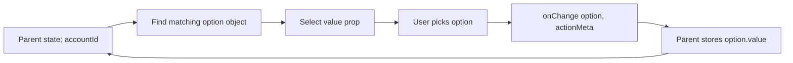
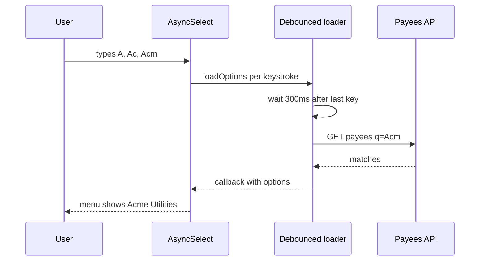
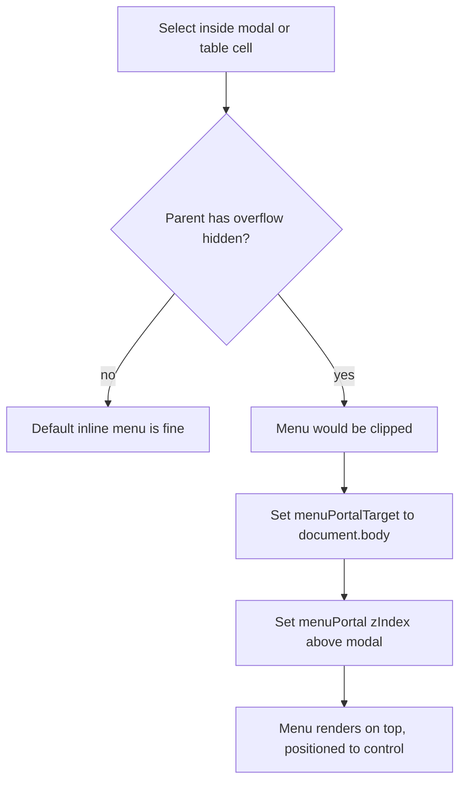

## 1. What it is

**React Select is a fully featured select/combobox component: a text input with a filterable dropdown menu, keyboard navigation, multi-select chips, async option loading and deep styling hooks.**

Analogy: the native `<select>` is a vending machine with a fixed set of buttons. React Select is a shop assistant: you start typing "Sav" and they bring you "Savings ****4821" and "Savings Plus ****9930", let you pick several, and can even look things up in the back room (an API) while you wait.

The problem it solves: native `<select>` cannot search, cannot show rich content (account number, balance, icon), cannot multi-select nicely, cannot load options from a server as you type, and is hard to style consistently. Building an accessible combobox yourself is genuinely hard (focus management, ARIA roles, screen reader announcements). React Select packages all of that.

## 2. Core concepts

### [Beginner] Controlled value, onChange and the options shape

Options are objects. By default React Select reads `label` (what to show) and `value` (what identifies it). The `value` prop must be the **option object**, not the raw value string.

```tsx
import Select, { SingleValue } from 'react-select';

interface AccountOption {
  value: string;   // accountId
  label: string;   // "Checking ****4821"
  balanceCents: number;
}

const options: AccountOption[] = [
  { value: 'ACC-001', label: 'Checking ****4821', balanceCents: 1_250_00 },
  { value: 'ACC-002', label: 'Savings ****9930', balanceCents: 18_400_00 },
];

export function FromAccountSelect({ accountId, onAccountChange }: {
  accountId: string | null;
  onAccountChange: (id: string | null) => void;
}) {
  const selected = options.find((o) => o.value === accountId) ?? null; // map id -> option object

  return (
    <>
      <label htmlFor="from-account">From account</label>
      <Select<AccountOption, false>
        inputId="from-account"
        options={options}
        value={selected}
        onChange={(opt: SingleValue<AccountOption>) => onAccountChange(opt?.value ?? null)}
        isClearable
        placeholder="Select an account"
      />
    </>
  );
}
```

`onChange(newValue, actionMeta)` gives you the new option (or `null` when cleared) and `actionMeta.action` such as `'select-option'`, `'clear'`, `'remove-value'`, `'create-option'`.



> **Gotcha:** Passing `value="ACC-001"` (a string) shows nothing. React Select compares option objects. Always map your id back to the option object.

### [Beginner] getOptionValue and getOptionLabel

If your data is not `{ value, label }`, tell React Select how to read it instead of reshaping it.

```tsx
interface Account { accountId: string; nickname: string; last4: string }

<Select<Account, false>
  options={accounts}
  getOptionValue={(a) => a.accountId}            // used for keys and equality
  getOptionLabel={(a) => `${a.nickname} ****${a.last4}`} // used for display and filtering
  value={accounts.find((a) => a.accountId === selectedId) ?? null}
  onChange={(a) => setSelectedId(a?.accountId ?? null)}
/>;
```

> **Why `getOptionValue` matters:** React Select uses it to decide whether an option is selected. If you skip it and your objects lack `value`, every option looks unselected and multi-select duplicates appear.

### [Beginner] Multi-select

```tsx
import Select, { MultiValue } from 'react-select';

interface CategoryOption { value: string; label: string }

<Select<CategoryOption, true>
  isMulti
  options={categoryOptions}
  value={categoryOptions.filter((o) => selectedCategories.includes(o.value))}
  onChange={(opts: MultiValue<CategoryOption>) => setSelectedCategories(opts.map((o) => o.value))}
  closeMenuOnSelect={false}
  placeholder="Filter by category"
/>;
```

`MultiValue<T>` is a readonly array. When everything is removed, you get an empty array, not `null`.

### [Intermediate] AsyncSelect with debounced loadOptions

`AsyncSelect` calls `loadOptions(inputValue)` and expects a Promise of options (or calls a callback). Use it for payee search, security/ticker lookup or large account lists.

```tsx
import AsyncSelect from 'react-select/async';
import debounce from 'lodash.debounce';
import { useMemo } from 'react';

interface PayeeOption { value: string; label: string }

async function searchPayees(q: string): Promise<PayeeOption[]> {
  const res = await fetch(`/api/payees?q=${encodeURIComponent(q)}`);
  const data = (await res.json()) as { id: string; name: string }[];
  return data.map((p) => ({ value: p.id, label: p.name }));
}

export function PayeeSelect({ value, onChange }: {
  value: PayeeOption | null;
  onChange: (v: PayeeOption | null) => void;
}) {
  // Callback form: debounce works correctly because we do not return a promise
  const loadOptions = useMemo(
    () =>
      debounce((input: string, callback: (opts: PayeeOption[]) => void) => {
        if (input.trim().length < 2) return callback([]);
        searchPayees(input).then(callback).catch(() => callback([]));
      }, 300),
    [],
  );

  return (
    <AsyncSelect<PayeeOption, false>
      inputId="payee"
      cacheOptions            // cache results per input string
      defaultOptions={false}  // or true to load on mount, or an array of recent payees
      loadOptions={loadOptions}
      value={value}
      onChange={onChange}
      noOptionsMessage={({ inputValue }) => (inputValue.length < 2 ? 'Type at least 2 characters' : 'No payees found')}
      loadingMessage={() => 'Searching...'}
    />
  );
}
```



> **Gotcha:** Debouncing a function that **returns a Promise** breaks AsyncSelect: lodash `debounce` returns the previous call's result (often `undefined`) to every caller but the last. Use the callback signature `(input, callback)` as shown, or a debounce helper designed for promises.

### [Intermediate] Creatable

`CreatableSelect` lets users add an option that does not exist, for example a new transaction tag.

```tsx
import CreatableSelect from 'react-select/creatable';

<CreatableSelect<CategoryOption, true>
  isMulti
  options={tagOptions}
  value={selectedTags}
  onChange={(v) => setSelectedTags([...v])}
  onCreateOption={async (label) => {
    const created = await api.post('/tags', { label }); // persist first
    const opt = { value: created.id, label: created.label };
    setTagOptions((prev) => [...prev, opt]);
    setSelectedTags((prev) => [...prev, opt]);
  }}
  formatCreateLabel={(input) => `Create tag "${input}"`}
  isValidNewOption={(input) => input.trim().length >= 2 && input.length <= 30}
/>;
```

There is also `react-select/async-creatable` combining both.

### [Intermediate] formatOptionLabel and custom components

`formatOptionLabel(option, { context })` renders custom content. `context` is `'menu'` in the dropdown and `'value'` in the control, so you can show more detail in the menu.

```tsx
const money = new Intl.NumberFormat('en-US', { style: 'currency', currency: 'USD' });

<Select<AccountOption, false>
  options={options}
  formatOptionLabel={(o, { context }) =>
    context === 'menu' ? (
      <div className="flex justify-between">
        <span>{o.label}</span>
        <span className="tabular-nums">{money.format(o.balanceCents / 100)}</span>
      </div>
    ) : (
      o.label
    )
  }
/>;
```

For deeper control, replace internal components. Always spread the original props and render the default component so behavior and ARIA stay intact.

```tsx
import Select, { components, OptionProps, SingleValueProps } from 'react-select';

const AccountOptionRow = (props: OptionProps<AccountOption, false>) => (
  <components.Option {...props}>
    <div>{props.data.label}</div>
    <small>Available {money.format(props.data.balanceCents / 100)}</small>
  </components.Option>
);

const AccountValue = (props: SingleValueProps<AccountOption, false>) => (
  <components.SingleValue {...props}>
    {props.data.label}
  </components.SingleValue>
);

<Select<AccountOption, false>
  options={options}
  components={{ Option: AccountOptionRow, SingleValue: AccountValue }}
/>;
```

> **Gotcha:** Define custom components **outside** the parent component (or memoize them). Defining them inline creates a new component type every render, which remounts the menu and loses focus.

### [Advanced] Styling: styles vs classNames vs unstyled

```tsx
import Select, { StylesConfig } from 'react-select';

// 1. styles: functions that receive the default CSS object and state
const styles: StylesConfig<AccountOption, false> = {
  control: (base, state) => ({
    ...base,
    borderColor: state.isFocused ? 'var(--color-primary)' : 'var(--color-border)',
    boxShadow: state.isFocused ? '0 0 0 2px var(--color-primary-ring)' : 'none',
    minHeight: 40,
  }),
  option: (base, state) => ({
    ...base,
    backgroundColor: state.isSelected ? 'var(--color-primary)' : state.isFocused ? 'var(--color-muted)' : 'transparent',
  }),
  menuPortal: (base) => ({ ...base, zIndex: 50 }),
};

// 2. classNames: return class strings (works well with Tailwind)
<Select
  unstyled // drop all default styles, then style from scratch
  classNames={{
    control: ({ isFocused }) => `border rounded-md px-2 ${isFocused ? 'ring-2 ring-blue-500' : 'border-gray-300'}`,
    menu: () => 'mt-1 border rounded-md bg-white shadow-lg',
    option: ({ isFocused, isSelected }) => `px-3 py-2 ${isSelected ? 'bg-blue-600 text-white' : isFocused ? 'bg-gray-100' : ''}`,
  }}
/>;

// 3. classNamePrefix: stable class names to target from global CSS
<Select classNamePrefix="rs" /> // .rs__control, .rs__menu, .rs__option
```

### [Advanced] menuPortalTarget (menus inside modals and tables)

A menu inside a container with `overflow: hidden` (modals, table cells, cards) gets clipped. Render it into `document.body` instead.

```tsx
<Select
  options={options}
  menuPortalTarget={typeof document !== 'undefined' ? document.body : null} // SSR safe
  menuPosition="fixed"
  styles={{ menuPortal: (base) => ({ ...base, zIndex: 1000 }) }}
/>
```



> **Gotcha:** Portalled menus escape the modal's DOM. Some focus-trap libraries then treat a click in the menu as "outside" and close the modal. Configure the focus trap to allow the portal or use the modal library's own portal container.

### [Advanced] Accessibility

React Select implements the combobox pattern and announces changes through an ARIA live region.

```tsx
<label id="currency-label" htmlFor="currency-input">Currency</label>
<Select
  inputId="currency-input"          // connects the <label htmlFor>
  aria-labelledby="currency-label"   // or aria-label when there is no visible label
  aria-invalid={!!error}
  aria-errormessage={error ? 'currency-error' : undefined}
  options={currencyOptions}
  ariaLiveMessages={{
    onChange: ({ label }) => `Selected currency ${label}`,
  }}
/>
{error && <span id="currency-error" role="alert">{error}</span>}
```

- Always provide `inputId` + `<label htmlFor>` or `aria-label`.
- Keep `isSearchable` on for long lists; typing is the fastest keyboard path.
- Do not rely on color alone for selected or error states.

## 3. Why it's used in this project

- **Account pickers** for transfers show nickname, masked number and available balance per option.
- **Payee and security search** uses `AsyncSelect` against APIs with thousands of results.
- **Transaction filters** (categories, merchants, tags) use multi-select with chips.
- **User-defined tags** use Creatable to add new labels on the fly.
- **Selects inside modals and data tables** need `menuPortalTarget`.

> **Finance tip:** Only show masked account numbers (`****4821`) in option labels. Labels end up in the DOM, screen-reader announcements, and sometimes analytics or session-replay tools.

## 4. Setup & configuration

```bash
npm install react-select
# types are bundled in v5; no @types package needed
```

```tsx
// components/AppSelect.tsx: a project wrapper with consistent defaults
import Select, { Props as SelectProps, GroupBase } from 'react-select';

export function AppSelect<Option, IsMulti extends boolean = false, Group extends GroupBase<Option> = GroupBase<Option>>(
  props: SelectProps<Option, IsMulti, Group>,
) {
  return (
    <Select<Option, IsMulti, Group>
      classNamePrefix="app-select"                 // stable CSS hooks
      menuPortalTarget={typeof document !== 'undefined' ? document.body : null}
      menuPosition="fixed"                          // works inside scroll containers
      styles={{ menuPortal: (b) => ({ ...b, zIndex: 1000 }) }}
      isClearable={false}                           // explicit per usage
      noOptionsMessage={() => 'No matches'}
      {...props}                                    // caller overrides last
    />
  );
}
```

> **Gotcha:** React Select uses Emotion for its default styles. With a strict Content Security Policy you may need a nonce (pass a custom Emotion cache) or use `unstyled` + `classNames`.

## 5. Key features we use

### [Beginner] Disabled options

```tsx
<Select options={options} isOptionDisabled={(o) => o.balanceCents <= 0} />
```

### [Beginner] Grouped options

```tsx
const grouped = [
  { label: 'Checking', options: checkingOptions },
  { label: 'Savings', options: savingsOptions },
];
<Select options={grouped} />;
```

### [Intermediate] Custom filtering

```tsx
import { createFilter } from 'react-select';
<Select options={options} filterOption={createFilter({ ignoreAccents: true, matchFrom: 'any', stringify: (o) => `${o.label} ${o.value}` })} />;
```

### [Intermediate] Inside React Final Form

```tsx
<Field<string> name="fromAccountId">
  {({ input, meta }) => (
    <Select<AccountOption, false>
      inputId={input.name}
      options={options}
      value={options.find((o) => o.value === input.value) ?? null}
      onChange={(o) => input.onChange(o?.value ?? '')}
      onBlur={() => input.onBlur()}
      aria-invalid={meta.touched && !!meta.error}
    />
  )}
</Field>
```

## 6. Interview questions

#### Q: Why does passing a string to the value prop show nothing?

React Select's `value` must be the selected option object (or array for multi). It identifies selection by comparing `getOptionValue(option)` across objects. Store the id in your state, then compute the object with `options.find(o => o.value === id) ?? null`.

#### Q: How do you debounce AsyncSelect correctly?

Use the callback form of `loadOptions(input, callback)` wrapped in a debounce created once (`useMemo`/`useRef`). A debounced function that returns a Promise breaks, because callers that get debounced away receive `undefined` or a stale result. Also use `cacheOptions`, require a minimum input length, and handle errors by calling back with `[]`.

#### Q: When do you need menuPortalTarget?

When the select lives inside an element with `overflow: hidden/auto` or a stacking context, like a modal, a table cell or a card. The menu gets clipped. Portalling it to `document.body` with `menuPosition="fixed"` and a high `zIndex` on `menuPortal` fixes it. Watch for focus traps treating the portal as outside.

#### Q: What is the difference between formatOptionLabel and replacing the Option component?

`formatOptionLabel` changes only the label content and knows whether it renders in the menu or as the value. Replacing `components.Option` controls the whole option element; you must spread props and render `components.Option` to keep keyboard behavior and ARIA. Prefer `formatOptionLabel` when it is enough.

#### Q: How would you make React Select accessible?

Associate a label via `inputId` and `<label htmlFor>` (or `aria-label`/`aria-labelledby`), expose error state with `aria-invalid` and `aria-errormessage`, keep it searchable, customize `ariaLiveMessages` for clear announcements, and do not convey state only by color. React Select already implements the combobox and listbox roles and keyboard navigation.

## 7. Drawbacks & pain points

- **Bundle size**: ~25-30 kB gzip including Emotion. Heavy for one dropdown.
- **Emotion dependency** complicates strict CSP and conflicts with some Tailwind-only setups.
- **Generics are verbose**: `Select<Option, IsMulti, Group>` must be specified for good types.
- **Object-based value** confuses newcomers.
- **Styling depth**: many internal parts (control, valueContainer, indicatorsContainer, menuList...).
- Mobile: the text input can open the keyboard even when you only want to pick.

Gotchas that trip devs up:

```tsx
// 1. Inline custom components cause remounts
<Select components={{ Option: (p) => <components.Option {...p} /> }} /> // new type every render

// 2. Debounced promise loader
const load = debounce(async (q: string) => search(q), 300); // returns undefined to most callers
<AsyncSelect loadOptions={load} />

// 3. onChange types for multi
onChange={(v) => setValues(v)} // v is readonly MultiValue<T>; spread to a mutable array: [...v]

// 4. defaultOptions confusion
<AsyncSelect defaultOptions loadOptions={load} /> // true = calls loadOptions('') on mount
```

## 8. Better alternatives

The industry trend is **headless** components: logic and ARIA from a library, markup and styling from you (usually Tailwind or a design system). That avoids the CSS-in-JS runtime and fits design systems better.

| Library | Bundle (gzip) | Boilerplate | Devtools | Learning curve | TypeScript | Popularity | When it wins |
| --- | --- | --- | --- | --- | --- | --- | --- |
| React Select | ~25-30 kB | Low | N/A | Low | Good (verbose generics) | Very high | Feature-rich select fast |
| Downshift (useCombobox) | ~8-10 kB | High (you render all) | N/A | Medium | Good | High | Full control, custom design system |
| Headless UI Combobox | ~10 kB (part of package) | Medium | N/A | Low-medium | Good | High in Tailwind apps | Tailwind projects |
| Radix / shadcn Select + Combobox | ~5-10 kB | Medium | N/A | Low-medium | Good | Very high | shadcn/ui design systems |
| cmdk | ~5 kB | Medium | N/A | Low | Good | High | Command palettes, quick search |
| React Aria ComboBox | ~15 kB+ | Medium | N/A | Medium | Excellent | Growing | Strict accessibility needs |
| Native select | 0 kB | None | N/A | None | N/A | Universal | Short static lists, mobile |

## 9. When NOT to use it

- Short, static lists (3-10 currencies, states): native `<select>` is faster, accessible and mobile-friendly.
- A strict design system built on Radix/shadcn or React Aria: use their combobox for consistency.
- Strict CSP without nonce support where Emotion cannot inject styles.
- Command palettes or global search: `cmdk` fits better.
- Lists of tens of thousands of items without async loading: you need virtualization (React Select does not virtualize by default).

## Cheatsheet

| Prop / API | Purpose |
| --- | --- |
| `options`, `value`, `onChange(v, meta)` | Controlled usage (value is an option object) |
| `isMulti`, `closeMenuOnSelect={false}` | Multi select |
| `isClearable`, `isSearchable`, `isDisabled`, `isLoading` | Behavior flags |
| `getOptionValue`, `getOptionLabel` | Custom data shape |
| `formatOptionLabel(o, { context })` | Custom label, menu vs value |
| `components={{ Option, SingleValue, MultiValueLabel, DropdownIndicator }}` | Replace parts |
| `styles`, `classNames`, `unstyled`, `classNamePrefix` | Styling |
| `menuPortalTarget`, `menuPosition="fixed"` | Escape overflow clipping |
| `isOptionDisabled`, `filterOption`, `createFilter` | Filtering |
| `noOptionsMessage`, `loadingMessage`, `placeholder` | Copy |
| `inputId`, `aria-label`, `aria-labelledby`, `ariaLiveMessages` | Accessibility |
| `react-select/async`: `loadOptions`, `cacheOptions`, `defaultOptions` | Async |
| `react-select/creatable`: `onCreateOption`, `formatCreateLabel`, `isValidNewOption` | Create |

```tsx
import Select from 'react-select';
import AsyncSelect from 'react-select/async';

<Select<Opt, false>
  inputId="acct"
  options={opts}
  value={opts.find((o) => o.value === id) ?? null}
  onChange={(o) => setId(o?.value ?? null)}
  getOptionValue={(o) => o.value}
  formatOptionLabel={(o, { context }) => (context === 'menu' ? <Rich o={o} /> : o.label)}
  menuPortalTarget={document.body}
  styles={{ menuPortal: (b) => ({ ...b, zIndex: 1000 }) }}
/>

<AsyncSelect cacheOptions loadOptions={debouncedCallbackLoader} />
```
