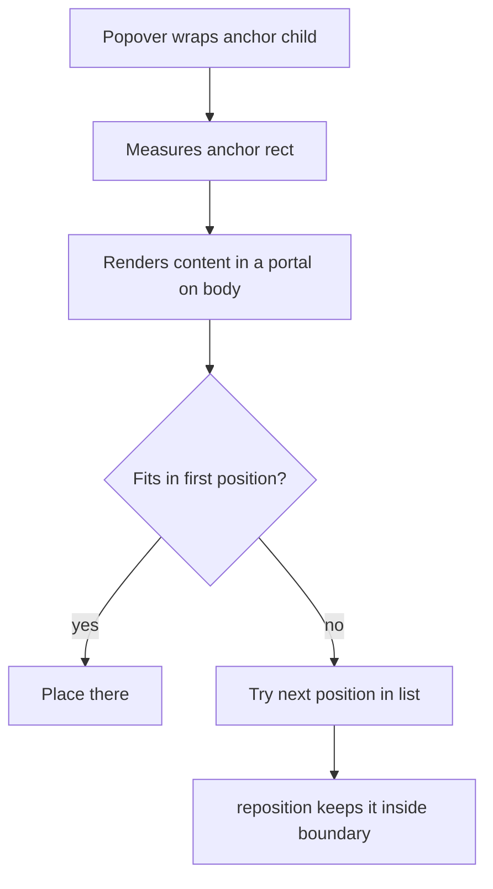
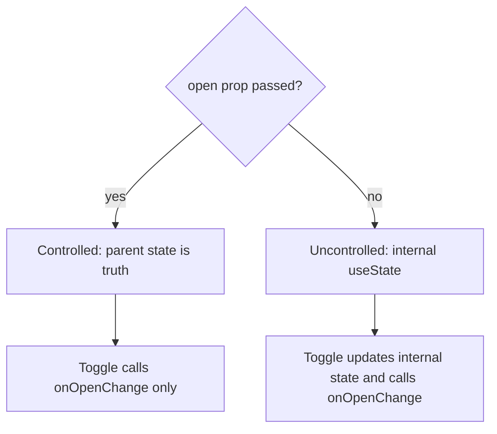

## 1. What it is

**react-tiny-popover is a lightweight, unstyled React component that positions a floating content box (a popover) next to a target element and renders it in a portal.**

Think of a sticky note you attach to a page in a book. The note is not part of the page's text, it floats on top, and it is placed right next to the word it explains. If there is no room on the right edge, you stick it on the left instead. A popover does the same: it floats above the layout, near its anchor, and flips to a side that fits.

The problem it solves: positioning floating UI is tricky. It must not be clipped by `overflow: hidden` parents, must follow the anchor on scroll and resize, must flip when near the viewport edge, and must close when you click elsewhere. Writing that by hand is fiddly; react-tiny-popover handles it with a tiny API.

## 2. Core concepts

### [Beginner] Popover, isOpen and content

`Popover` wraps exactly one child (the anchor, often a button). You control visibility with `isOpen`, and pass what to show in `content`.

```tsx
import { useState } from 'react';
import { Popover } from 'react-tiny-popover';

export function FeeInfo() {
  const [isOpen, setIsOpen] = useState(false);

  return (
    <Popover
      isOpen={isOpen}
      content={<div className="rounded bg-white p-3 shadow">A $2.50 fee applies to wire transfers.</div>}
    >
      <button type="button" onClick={() => setIsOpen((o) => !o)} aria-expanded={isOpen}>
        Fee details
      </button>
    </Popover>
  );
}
```



> **Why a portal:** If the popover rendered inside a table cell with `overflow: hidden`, it would be cut off. A portal renders the DOM at the end of `body` while keeping it in the same React tree (context and events still work).

### [Beginner] It is controlled only

The library does not hold open state. You do. That is the "controlled" pattern: the parent owns `isOpen` and decides when it changes.

### [Beginner] positions, padding, align

```tsx
<Popover
  isOpen={isOpen}
  positions={['bottom', 'top', 'right', 'left']} // preference order; first that fits wins
  padding={8}                                   // gap in px between anchor and popover
  align="start"                                 // 'start' | 'center' | 'end' along the side
  content={<FeeBreakdown />}
>
  <button type="button" onClick={toggle}>Fees</button>
</Popover>
```

> **Outdated:** v4 and earlier used `position` (singular) and `disableReposition`. v5+ uses `positions` (array) and `reposition` (boolean, default true).

### [Intermediate] onClickOutside

Called when the user clicks anywhere outside both the anchor and the popover content. You close the popover there.

```tsx
<Popover
  isOpen={isOpen}
  onClickOutside={() => setIsOpen(false)}
  content={<AccountActionsMenu onSelect={() => setIsOpen(false)} />}
>
  <button type="button" onClick={() => setIsOpen((o) => !o)}>Actions</button>
</Popover>
```

> **Gotcha:** Clicking the anchor button is not "outside", so your toggle handles it. If you also closed in onClickOutside for anchor clicks you would get close-then-reopen flicker. The library excludes the anchor for you.

### [Intermediate] Child ref requirement and forwardRef

The popover measures its child with a ref. The child must be a DOM element or a component that forwards its ref to a DOM element. A plain function component without `forwardRef` (React 18) receives no ref, so positioning breaks or throws.

```tsx
import { forwardRef, type ButtonHTMLAttributes } from 'react';

type IconButtonProps = ButtonHTMLAttributes<HTMLButtonElement> & { label: string };

// React 18: forwardRef is required
export const IconButton = forwardRef<HTMLButtonElement, IconButtonProps>(function IconButton(
  { label, ...rest },
  ref,
) {
  return <button ref={ref} type="button" aria-label={label} {...rest}>i</button>;
});

<Popover isOpen={isOpen} content={<Tip />}>
  <IconButton label="More info" onClick={toggle} />
</Popover>;
```

> **Outdated:** In React 19, `ref` is a normal prop for function components, so `forwardRef` is no longer needed. You must still pass the `ref` through to the DOM element.

### [Intermediate] Content as a function and ArrowContainer

`content` can be a function receiving position info. Combine it with `ArrowContainer` to draw a pointer arrow toward the anchor.

```tsx
import { ArrowContainer, Popover } from 'react-tiny-popover';

<Popover
  isOpen={isOpen}
  positions={['top', 'bottom']}
  padding={6}
  onClickOutside={() => setIsOpen(false)}
  content={({ position, childRect, popoverRect }) => (
    <ArrowContainer
      position={position}
      childRect={childRect}
      popoverRect={popoverRect}
      arrowColor="#0f172a"
      arrowSize={8}
    >
      <div className="rounded bg-slate-900 px-3 py-2 text-sm text-white">
        Available balance excludes pending holds.
      </div>
    </ArrowContainer>
  )}
>
  <button type="button" onClick={() => setIsOpen((o) => !o)}>Available</button>
</Popover>
```

### [Advanced] Uncontrolled wrapper pattern

Because the library is controlled-only, teams usually build a small wrapper that holds state for the simple cases and still accepts external control when needed.

```tsx
import { useState, type ReactElement, type ReactNode } from 'react';
import { Popover, type PopoverPosition } from 'react-tiny-popover';

type Props = {
  trigger: ReactElement;               // must accept ref and onClick
  children: ReactNode | ((close: () => void) => ReactNode);
  open?: boolean;                      // controlled if provided
  onOpenChange?: (open: boolean) => void;
  positions?: PopoverPosition[];
};

export function AppPopover({ trigger, children, open, onOpenChange, positions = ['bottom', 'top'] }: Props) {
  const [internalOpen, setInternalOpen] = useState(false);
  const isControlled = open !== undefined;
  const isOpen = isControlled ? open : internalOpen;

  const setOpen = (next: boolean) => {
    if (!isControlled) setInternalOpen(next);
    onOpenChange?.(next);
  };
  const close = () => setOpen(false);

  return (
    <Popover
      isOpen={isOpen}
      positions={positions}
      padding={8}
      onClickOutside={close}
      content={<div role="dialog" className="rounded bg-white p-3 shadow-lg">{typeof children === 'function' ? children(close) : children}</div>}
    >
      <span onClick={() => setOpen(!isOpen)}>{trigger}</span>
    </Popover>
  );
}
```

> **Why:** This is the same controlled/uncontrolled pattern React uses for `<input value>` vs `<input defaultValue>`. If the parent passes `open`, it owns the state; otherwise the component manages its own.



## 3. Why it's used in this project

- **Info tooltips** next to financial terms: "Available balance", "APY", "Pending hold".
- **Row action menus** in transaction tables (Dispute, Download receipt, Categorize) where the table has `overflow: auto`; the portal escapes clipping.
- **Fee breakdowns** on the transfer review screen.
- **Tiny footprint and no styling,** so it matches our design system without overriding a theme.

> **Finance tip:** Do not hide mandatory disclosures (fees, exchange rates, terms) only inside a popover. Regulations often require them to be clearly visible. Popovers are for supplementary detail.

## 4. Setup & configuration

```bash
npm i react-tiny-popover
```

No global config. Typical prop set, commented:

```tsx
<Popover
  isOpen={isOpen}                          // required: visibility, you own it
  content={<Menu />}                       // node or function ({ position, childRect, popoverRect })
  positions={['bottom', 'top']}            // preferred sides in order
  align="end"                              // start | center | end
  padding={8}                              // gap from anchor in px
  reposition={true}                        // keep inside boundary when it would overflow
  onClickOutside={() => setIsOpen(false)}  // close on outside click
  clickOutsideCapture={false}              // listen in capture phase (helps when children stopPropagation)
  containerClassName="z-50"                // class on the portal container, set z-index here
  parentElement={document.body}            // where the portal mounts
  boundaryElement={document.body}          // element used for overflow detection
  boundaryInset={8}                        // keep this many px away from boundary edges
>
  <button type="button" onClick={toggle}>Open</button>
</Popover>
```

> **Gotcha:** The popover can render behind modals or sticky headers. Set a `z-index` via `containerClassName` that fits your layering scale.

## 5. Key features we use

### [Beginner] Close on Escape

The library does not handle keyboard dismissal. Add it.

```tsx
useEffect(() => {
  if (!isOpen) return;
  const onKey = (e: KeyboardEvent) => e.key === 'Escape' && setIsOpen(false);
  document.addEventListener('keydown', onKey);
  return () => document.removeEventListener('keydown', onKey);
}, [isOpen]);
```

### [Intermediate] Row actions menu in a table

```tsx
function TransactionActions({ txn }: { txn: Transaction }) {
  const [open, setOpen] = useState(false);
  return (
    <Popover
      isOpen={open}
      positions={['bottom', 'top']}
      align="end"
      onClickOutside={() => setOpen(false)}
      content={
        <ul role="menu" className="rounded bg-white py-1 shadow">
          <li role="menuitem"><button onClick={() => { openDispute(txn.id); setOpen(false); }}>Dispute</button></li>
          <li role="menuitem"><button onClick={() => { downloadReceipt(txn.id); setOpen(false); }}>Receipt</button></li>
        </ul>
      }
    >
      <button type="button" aria-haspopup="menu" aria-expanded={open} onClick={() => setOpen((o) => !o)}>
        Actions
      </button>
    </Popover>
  );
}
```

> **Gotcha:** The library gives no focus management or ARIA roles. For a real menu, you must add arrow-key navigation, focus the first item on open, and return focus to the trigger on close. This is the main reason teams move to Radix.

## 6. Interview questions

#### Q: Why must the Popover child accept a ref?

The library measures the anchor's position with `getBoundingClientRect()` on a DOM node it gets via ref. Native elements accept refs. Function components only do if they forward the ref (with `forwardRef` in React 18, or by passing the `ref` prop through in React 19). Without it, the popover cannot position itself.

#### Q: What is the difference between controlled and uncontrolled components, applied to a popover?

Controlled: the parent holds `isOpen` in state and passes it down; the component just reflects it, and changes go through callbacks. Uncontrolled: the component keeps its own state internally. react-tiny-popover is controlled-only. A common pattern is a wrapper that is uncontrolled by default but becomes controlled when an `open` prop is supplied, calling `onOpenChange` in both cases.

#### Q: Why render popovers in a portal?

To escape ancestor clipping (`overflow: hidden/auto`) and stacking contexts (`transform`, `z-index`) so the popover is not cut off or hidden. React portals keep the component in the same React tree, so context and synthetic events still propagate as usual, even though the DOM lives elsewhere.

#### Q: What accessibility work does a popover need?

Trigger: `aria-expanded`, `aria-haspopup` or `aria-controls`. Content: an appropriate role (`dialog`, `menu`, `tooltip`). Keyboard: open with Enter/Space, close with Escape, focus moves into interactive content and returns to the trigger on close, arrow keys for menus. Tooltips should also open on focus, not only hover. react-tiny-popover provides positioning only, so you add all of this.

#### Q: How does repositioning work and when does it fail?

The library tries each entry in `positions` and checks whether the popover fits within the boundary; with `reposition` it nudges it to stay inside. It can fail when the boundary is wrong (a scroll container other than body), when the content size changes after opening (async content), or with very small viewports. Floating UI handles these cases more robustly with middleware like `flip`, `shift` and `size` and `autoUpdate`.

## 7. Drawbacks & pain points

- **No accessibility built in:** no focus trap, no keyboard handling, no ARIA roles.
- **Controlled-only,** so every usage repeats `useState` and toggle boilerplate.
- **Limited positioning engine** compared with Floating UI (no virtual elements, fewer edge-case strategies).
- **Small community** and slower maintenance; fewer examples.
- **Ref requirement** catches people using custom button components.

Gotchas that trip devs up:

```tsx
// 1. Non-forwarding child component (React 18)
const MyButton = (props: ButtonProps) => <button {...props} />; // ref lost
<Popover isOpen content={<X />}><MyButton /></Popover>;        // broken positioning

// 2. Multiple children
<Popover isOpen content={<X />}>
  <button>A</button>
  <button>B</button> {/* BAD: exactly one child element */}
</Popover>

// 3. Missing type="button" inside a form: toggling submits the form
<button onClick={toggle}>Info</button> // defaults to submit inside <form>

// 4. Inline content recreated each render is fine, but heavy content should be memoized
```

## 8. Better alternatives

The industry has standardised on **Floating UI** (the successor to Popper.js) for positioning, and on **Radix UI / React Aria / Ariakit** for accessible popover behaviour. shadcn/ui's Popover is Radix underneath.

| Library | Bundle (gzip) | Boilerplate | Accessibility | Learning curve | TypeScript | Popularity | When it wins |
|---|---|---|---|---|---|---|---|
| react-tiny-popover | ~3-5 KB | Low-medium | None built in | Low | Good | Low-medium | Very simple floating boxes |
| Floating UI (@floating-ui/react) | ~10-15 KB | Medium | Interaction hooks help (useDismiss, useRole, FloatingFocusManager) | Medium | Very good | Very high | Precise positioning and custom components |
| Radix Popover | ~10 KB | Low | Full: focus, Escape, ARIA | Low | Very good | Very high | Design systems, shadcn/ui |
| React Aria (Adobe) | ~varies | Medium | Best in class | Medium-high | Very good | Medium-high | Strict a11y requirements |
| Native Popover API (popover attribute) | ~0 | Low | Light dismiss and top layer built in | Low | n/a | Growing | Simple cases in modern browsers (anchor positioning support still uneven) |

```tsx
// Radix equivalent
<Popover.Root>
  <Popover.Trigger asChild><button>Fees</button></Popover.Trigger>
  <Popover.Portal>
    <Popover.Content side="bottom" sideOffset={8}>A $2.50 fee applies.<Popover.Arrow /></Popover.Content>
  </Popover.Portal>
</Popover.Root>
```

## 9. When NOT to use it

- Menus, comboboxes or dialogs that need full keyboard and screen reader support: use Radix, React Aria or Floating UI interactions.
- Content that must be visible for compliance (fees, terms).
- Complex positioning: virtual anchors (text selection), nested scroll containers, size-constrained dropdowns.
- Simple hover hints on desktop where a native `title` or a CSS tooltip is enough.
- New projects already using a component library that ships a popover.

## Cheatsheet

| Prop | Meaning |
|---|---|
| `isOpen` | required visibility |
| `content` | node or `({ position, childRect, popoverRect }) => node` |
| `positions` | `['top','bottom','left','right']` preference order |
| `align` | `start`, `center`, `end` |
| `padding` | gap in px |
| `reposition` | keep in boundary (default true) |
| `onClickOutside` | close handler |
| `containerClassName` | style portal container, z-index |
| `parentElement` / `boundaryElement` / `boundaryInset` | portal target and overflow box |
| `ArrowContainer` | `position childRect popoverRect arrowColor arrowSize` |

```tsx
const [open, setOpen] = useState(false);

<Popover
  isOpen={open}
  positions={['bottom', 'top']}
  padding={8}
  align="center"
  onClickOutside={() => setOpen(false)}
  content={({ position, childRect, popoverRect }) => (
    <ArrowContainer position={position} childRect={childRect} popoverRect={popoverRect} arrowColor="white" arrowSize={8}>
      <div role="dialog" className="rounded bg-white p-3 shadow">Details</div>
    </ArrowContainer>
  )}
>
  <button type="button" aria-expanded={open} onClick={() => setOpen((o) => !o)}>Info</button>
</Popover>;
```
