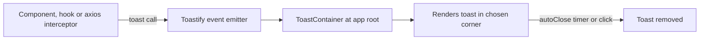
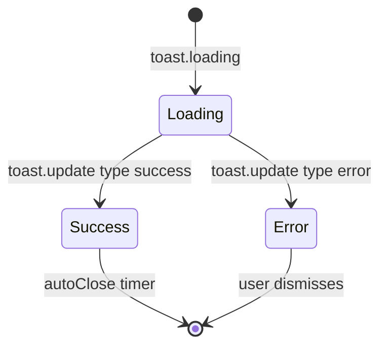

## 1. What it is

**React Toastify is a library for showing toast notifications: short, non-blocking messages that appear in a corner of the screen and auto-dismiss.**

Think of the little receipt slip a cash machine prints after a transaction. It confirms what happened, you glance at it, and you carry on. You are not forced to click "OK" before doing anything else. Toasts are the UI version of that slip.

The problem it solves: many actions finish asynchronously (a transfer submitted, a file uploaded, a session about to expire). You need feedback that does not block the page, can be triggered from anywhere (an API interceptor, a mutation callback), and stacks nicely when several things happen. Toastify gives you one container and a global `toast()` function you can call from any file, even outside React components.

## 2. Core concepts

### [Beginner] ToastContainer plus the toast function

You render `<ToastContainer />` once near the root. Anywhere else you call `toast(...)`. The container subscribes to an internal event emitter, so calls do not need props or context.

```tsx
// App.tsx
import { ToastContainer, toast } from 'react-toastify';
import 'react-toastify/dist/ReactToastify.css'; // required up to v10, auto-injected in v11

export function App() {
  return (
    <>
      <Routes />
      <ToastContainer position="top-right" autoClose={5000} />
    </>
  );
}

// anywhere
toast('Statement downloaded');
```



> **Why a global function:** Notifications are triggered by events that often happen outside the component tree that shows them, such as an HTTP interceptor catching a 500. An emitter decouples "who triggers" from "who renders".

### [Beginner] Types: success, error, info, warn

```ts
toast.success('Transfer of $250.00 submitted');
toast.error('Payment failed. Your account was not charged.');
toast.info('New statement available for September');
toast.warn('Your session will expire in 2 minutes'); // toast.warning is an alias
```

Each type sets an icon, colour and, for screen readers, an appropriate role.

### [Beginner] position and autoClose

```ts
toast.error('Card declined', {
  position: 'bottom-center', // top-left | top-right | top-center | bottom-left | bottom-right | bottom-center
  autoClose: false,          // errors that need reading should stay until dismissed
});
toast.success('Saved', { autoClose: 2500 }); // milliseconds
```

> **Outdated:** v9 and earlier used `toast.POSITION.TOP_RIGHT` constants. Since v10 you pass plain strings like `'top-right'`.

### [Intermediate] toastId to prevent duplicates

If ten failing requests each call `toast.error`, the user sees ten identical toasts. Give a stable `toastId`; Toastify ignores a new toast with an id that is already showing.

```ts
toast.error('You are offline. Changes will sync when you reconnect.', { toastId: 'offline' });

// Or check yourself
if (!toast.isActive('session-expiring')) {
  toast.warn('Session expires soon', { toastId: 'session-expiring', autoClose: false });
}
```

### [Intermediate] update and dismiss

`toast()` returns an id. Use it to change or close the toast later.

```ts
const id = toast.loading('Uploading proof of address...');

try {
  await uploadDocument(file);
  toast.update(id, { render: 'Document uploaded', type: 'success', isLoading: false, autoClose: 3000 });
} catch {
  toast.update(id, { render: 'Upload failed. Try again.', type: 'error', isLoading: false, autoClose: false });
}

toast.dismiss(id); // close one
toast.dismiss();   // close all
```

> **Gotcha:** A `toast.loading` toast has `autoClose: false` by default. When you update it, set `isLoading: false` and an `autoClose`, otherwise it spins or stays forever.



### [Intermediate] toast.promise

A shortcut for the loading-then-update pattern. It shows pending, then success or error depending on how the promise settles, and returns the original promise.

```ts
await toast.promise(api.post('/transfers', payload), {
  pending: 'Submitting transfer...',
  success: 'Transfer submitted',
  error: {
    render({ data }) {
      // data is the rejection reason
      const err = data as { response?: { data?: { message?: string } } };
      return err.response?.data?.message ?? 'Transfer failed';
    },
  },
});
```

### [Advanced] Custom components

The toast content can be any React node, or a function component that receives `closeToast`.

```tsx
type UndoProps = { closeToast?: () => void; onUndo: () => void };

function UndoToast({ closeToast, onUndo }: UndoProps) {
  return (
    <div className="flex items-center gap-3">
      <span>Payee deleted</span>
      <button
        className="underline"
        onClick={() => {
          onUndo();
          closeToast?.();
        }}
      >
        Undo
      </button>
    </div>
  );
}

toast(({ closeToast }) => <UndoToast closeToast={closeToast} onUndo={() => restorePayee(payeeId)} />, {
  autoClose: 8000,
  closeOnClick: false, // clicking Undo should not just close
});
```

## 3. Why it's used in this project

- **Mutation feedback:** transfers, bill payments, profile updates and document uploads confirm success or show errors.
- **Global error handling:** an axios response interceptor shows one toast for 5xx or network errors, deduplicated with `toastId`.
- **Session timeout warnings:** compliance requires idle sessions to expire; a persistent toast warns before logout.
- **Undo for reversible actions:** deleting a saved payee shows an Undo toast instead of a confirm dialog.

> **Finance tip:** Never put full account numbers, balances or other PII in toasts. They can be seen by people nearby and captured by session-replay tools. Use masked values like `****1234`.

> **Finance tip:** A toast is not a record. For a transfer, show the confirmation number on a page the user can return to. Toasts disappear and are easy to miss.

## 4. Setup & configuration

```bash
npm i react-toastify
```

```tsx
// src/app/Toaster.tsx
import { ToastContainer, Slide } from 'react-toastify';
import 'react-toastify/dist/ReactToastify.css'; // needed in v9 and v10; harmless in v11

export function Toaster() {
  return (
    <ToastContainer
      position="top-right"    // corner
      autoClose={5000}        // ms before closing; false disables
      hideProgressBar={false} // show remaining time bar
      newestOnTop             // new toasts at the top of the stack
      closeOnClick            // click anywhere on toast closes it
      pauseOnHover            // timer pauses while hovered
      pauseOnFocusLoss        // timer pauses when tab is not focused
      draggable               // swipe to dismiss
      limit={3}               // max visible at once; extras queue
      theme="colored"         // 'light' | 'dark' | 'colored'
      transition={Slide}      // Bounce | Slide | Zoom | Flip
    />
  );
}
```

```ts
// src/api/client.ts - one global error toast
import axios from 'axios';
import { toast } from 'react-toastify';

export const api = axios.create({ baseURL: '/api' });

api.interceptors.response.use(
  (res) => res,
  (error) => {
    if (!error.response) {
      toast.error('Network error. Check your connection.', { toastId: 'network-error' });
    } else if (error.response.status >= 500) {
      toast.error('Something went wrong on our side. Please try again.', { toastId: 'server-error' });
    }
    return Promise.reject(error);
  },
);
```

## 5. Key features we use

### [Beginner] React Query mutation feedback

```tsx
const mutation = useMutation({
  mutationFn: (p: TransferPayload) => api.post('/transfers', p),
  onSuccess: (res) => toast.success(`Transfer submitted. Ref ${res.data.referenceId}`),
  onError: () => toast.error('Transfer failed. No money was moved.', { autoClose: false }),
});
```

### [Intermediate] Session expiry warning

```tsx
useEffect(() => {
  const warnAt = window.setTimeout(() => {
    toast.warn(<SessionWarning onStay={refreshSession} />, {
      toastId: 'session-expiring',
      autoClose: false,
      closeOnClick: false,
    });
  }, SESSION_MS - 2 * 60_000);
  return () => window.clearTimeout(warnAt);
}, [lastActivityAt]);
```

### [Intermediate] Accessibility

- Toasts render with `role="alert"` by default, which screen readers announce immediately (assertive). Use `role: 'status'` for low-priority info so you do not interrupt the user.
- Keep `pauseOnHover` and `pauseOnFocusLoss` on, and use longer `autoClose` (or `false`) for errors. WCAG 2.2.1 (Timing Adjustable) means users must be able to read time-limited content.
- Do not put the only path to an action in a toast; keyboard users may not reach it in time.

```ts
toast.info('Statement for September is ready', { role: 'status', autoClose: 6000 });
```

## 6. Interview questions

#### Q: How can toast() work outside React components, for example in an axios interceptor?

`toast()` publishes to an internal event emitter. The mounted `<ToastContainer />` subscribes and renders. Because no hooks or context are needed to publish, any module can call it. The only requirement is that a container is mounted when the call happens.

#### Q: How do you prevent duplicate toasts?

Pass a stable `toastId`; a toast with an id already displayed is ignored. You can also check `toast.isActive(id)` before calling, or use `limit` on the container to cap the visible count. Deduplication matters in interceptors where many requests fail together.

#### Q: How do you show progress for an async operation?

Either `toast.promise(promise, { pending, success, error })`, or manually: `const id = toast.loading('...')`, then `toast.update(id, { render, type, isLoading: false, autoClose })` when it settles. Remember loading toasts do not auto-close until updated.

#### Q: What accessibility concerns do toasts have?

They are time-limited and may be missed by screen reader, keyboard and low-vision users. Use proper live-region roles (`alert` for urgent, `status` for polite), pause on hover and focus loss, keep errors on screen until dismissed, do not place essential actions only in toasts, and ensure sufficient contrast. Critical information (like a confirmation number) should also live on the page.

#### Q: When should you use a toast vs an inline error vs a modal?

Toast: non-blocking confirmation or background event (saved, uploaded, offline). Inline error: field or form validation tied to a specific input; the user must see it next to the problem. Modal: the user must decide before continuing (confirm a large transfer). Using toasts for form validation is a common UX mistake.

## 7. Drawbacks & pain points

- **CSS import confusion** between versions (manual import up to v10, auto-injected in v11, which can clash with strict CSP that blocks inline styles).
- **Global singleton** makes tests leak state; dismiss all toasts between tests.
- **Bundle and styling** heavier than newer alternatives; theming means overriding CSS variables or classes.
- **Breaking changes** across majors (constants removed in v10, some props and the default styling changed in v11).

Gotchas that trip devs up:

```tsx
// 1. No container mounted: toasts silently never appear
toast.success('Saved'); // nothing, if <ToastContainer /> is not rendered

// 2. Two containers: every toast shows twice
<ToastContainer /> {/* in App */}
<ToastContainer /> {/* also in a layout */}

// 3. Loading toast never closes
const id = toast.loading('Saving');
toast.update(id, { render: 'Saved', type: 'success' }); // still spinning: add isLoading: false, autoClose

// 4. Calling toast during render (side effect in render body)
function Banner() { toast.info('Hi'); return null; } // fires on every render, use useEffect
```

## 8. Better alternatives

The industry trend in 2025-2026 is toward **sonner**: tiny, good-looking stacked toasts by default, used by shadcn/ui. react-hot-toast remains a lightweight favourite.

| Library | Bundle (gzip) | Boilerplate | Styling | Learning curve | TypeScript | Popularity | When it wins |
|---|---|---|---|---|---|---|---|
| react-toastify | ~10-15 KB plus CSS | Low | CSS file and variables | Low | Good | Very high | Feature-rich, existing codebases |
| sonner | ~5 KB | Very low | Polished defaults, Tailwind-friendly | Very low | Very good | High and rising | New projects, shadcn/ui stacks |
| react-hot-toast | ~5 KB | Very low | Minimal, headless option | Very low | Good | High | Small apps, custom look |
| Radix Toast | ~small | Medium | Unstyled primitives | Medium | Very good | Medium | Design systems needing full control and a11y |
| UI kit toasts (MUI Snackbar, Chakra) | ~in kit | Low | Kit theme | Low | Good | High | Already using that kit |

```ts
// sonner equivalent, for comparison
import { Toaster, toast } from 'sonner';
toast.promise(submitTransfer(), { loading: 'Submitting...', success: 'Submitted', error: 'Failed' });
```

## 9. When NOT to use it

- Form validation errors: show them inline next to the field.
- Confirmations of irreversible or large actions: use a modal dialog.
- Information the user must keep, like reference numbers or legal disclosures: put it on the page.
- Persistent system status (maintenance, account frozen): use a banner.
- Very high-frequency events (every price tick): use an in-place indicator instead.

## Cheatsheet

| API | Use |
|---|---|
| `<ToastContainer position autoClose limit theme />` | mount once |
| `toast(msg, opts)` | default toast, returns id |
| `toast.success / error / info / warn` | typed toasts |
| `toast.loading(msg)` | spinner, no auto close |
| `toast.update(id, { render, type, isLoading, autoClose })` | change existing |
| `toast.promise(p, { pending, success, error })` | async lifecycle |
| `toast.dismiss(id?)` | close one or all |
| `toast.isActive(id)` | check if showing |
| `{ toastId: 'x' }` | dedupe |
| `{ autoClose: false, closeOnClick: false, role: 'status' }` | persistent, polite |

```tsx
<ToastContainer position="top-right" autoClose={5000} limit={3} newestOnTop pauseOnHover />

const id = toast.loading('Submitting transfer...');
toast.update(id, { render: 'Transfer submitted', type: 'success', isLoading: false, autoClose: 3000 });
toast.error('Network error', { toastId: 'network-error' });
```
