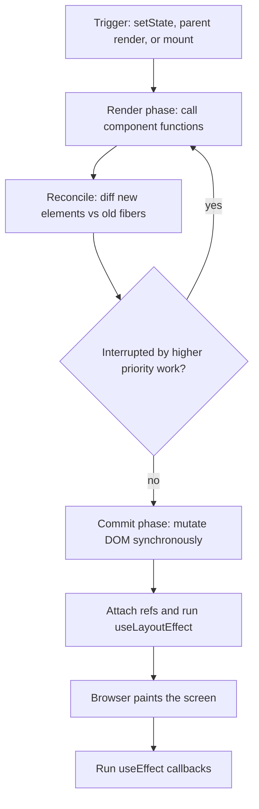
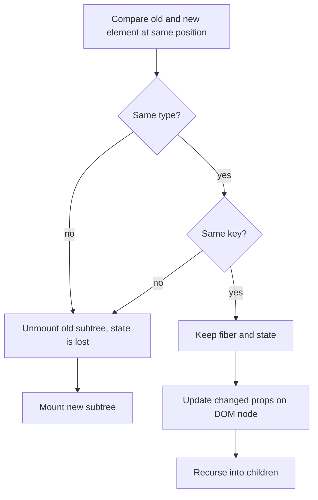
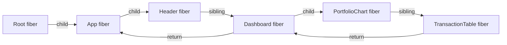
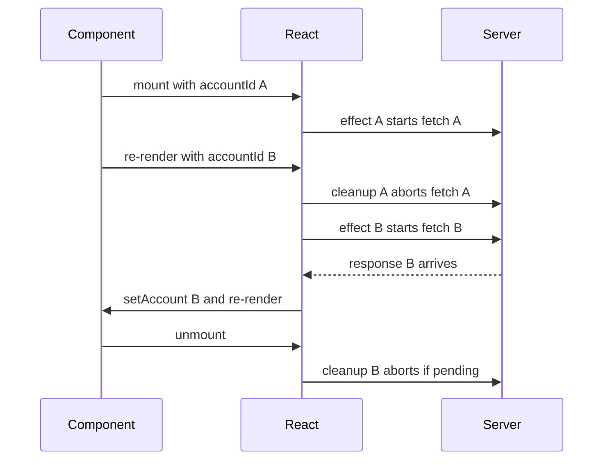
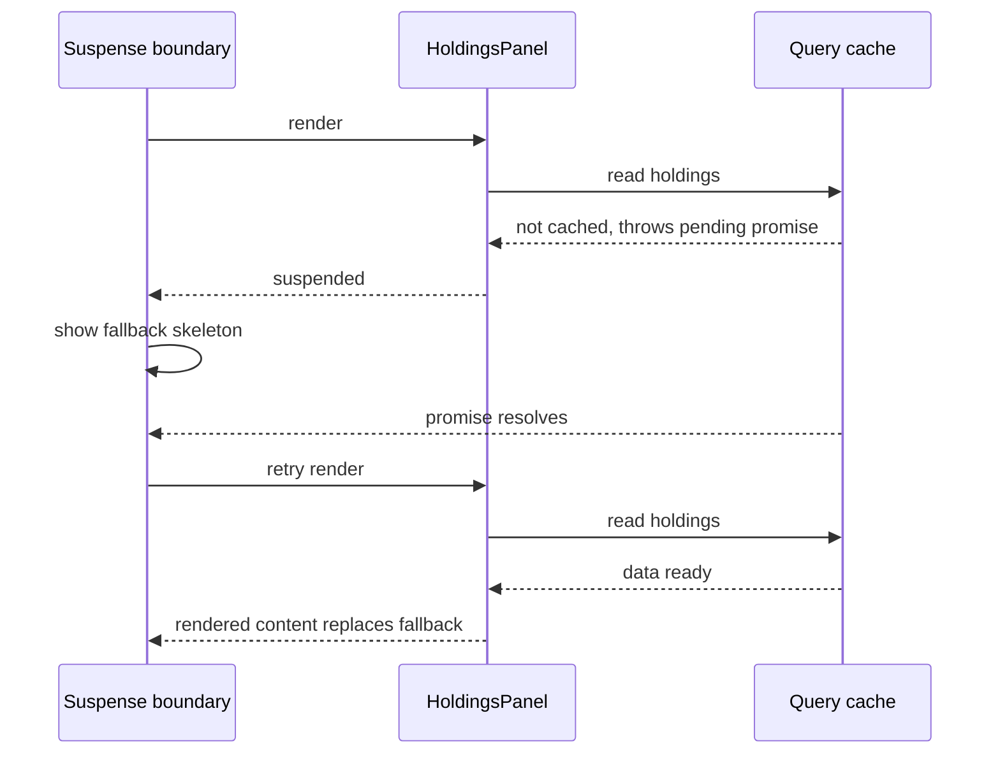

## 1. What it is

**React is a JavaScript library for building user interfaces out of small, reusable functions called components.**

Think of a spreadsheet. You type a formula once (`=SUM(A1:A10)`), and whenever a cell changes, the result updates itself. You never write "go find cell B12 and repaint it". React works the same way for UI: you describe what the screen should look like for a given state, and React figures out the minimum changes needed to make the real browser page match.

The problem it solves: before React, you updated the DOM by hand (`document.getElementById(...).innerText = ...`). As apps grew, it became hard to keep every piece of the page consistent with the data, and bugs came from forgetting one update. React makes UI a pure function of state: `UI = f(state)`. You change state, React re-runs your function and patches the DOM for you.

## 2. Core concepts

### [Beginner] JSX is just function calls

JSX looks like HTML but it is not HTML. It is syntax sugar that a compiler (Babel, esbuild, SWC, TypeScript) turns into plain JavaScript function calls.

```tsx
// What you write
const el = <h1 className="balance">Balance: {formatMoney(balanceCents)}</h1>;
// What the compiler produces with the modern "automatic" JSX runtime (React 17+)
import { jsx as _jsx } from "react/jsx-runtime";
const el2 = _jsx("h1", {
  className: "balance",
  children: ["Balance: ", formatMoney(balanceCents)],
});
// Older "classic" runtime (why old files needed `import React from "react"`)
const el3 = React.createElement("h1", { className: "balance" }, "Balance: ", formatMoney(balanceCents));
```

The result of any of these calls is a **React element**: a small, plain, immutable object like `{ type: "h1", props: { className: "balance", children: [...] } }`. It is a *description* of what you want, not a real DOM node.

> **Why:** Because elements are cheap plain objects, React can create thousands of them on every render, compare old vs new, and only touch the real DOM (which is slow) where something actually changed.

Rules that follow from "JSX is function calls":

- `className` not `class`, `htmlFor` not `for` — they are JS property names.
- `{}` holds any JS **expression** (not statements). So no `if` inside JSX; use `&&`, ternary, or compute before `return`.
- A component must return one root element (or a Fragment `<>...</>`), because a function returns one value.

### [Beginner] Components and props

A component is a function that takes one argument, `props`, and returns elements. Capitalized names tell JSX "this is a component, call it", lowercase names mean "built-in DOM tag".

```tsx
type Currency = "USD" | "EUR" | "NPR";

interface AccountCardProps {
  accountName: string; balanceCents: number; // money as integer cents, never floats
  currency: Currency; onSelect?: (accountName: string) => void;
}

function formatMoney(cents: number, currency: Currency): string {
  return new Intl.NumberFormat("en-US", { style: "currency", currency }).format(cents / 100);
}

export function AccountCard({ accountName, balanceCents, currency, onSelect }: AccountCardProps) {
  return (
    <button className="account-card" onClick={() => onSelect?.(accountName)}>
      <span>{accountName}</span>
      <strong>{formatMoney(balanceCents, currency)}</strong>
    </button>
  );
}
// Usage
<AccountCard accountName="Checking" balanceCents={125_034} currency="USD" />;
```

Key ideas:

- **Props are read-only.** A component must never mutate its props. Data flows **down** (parent to child). Events flow **up** through callback props like `onSelect`.
- `children` is just a prop: `<Card><p>Hi</p></Card>` gives `Card` a `props.children`.
- A component should be **pure** during render: same props and state in, same JSX out, no side effects (no fetch, no `localStorage` writes, no mutation of outside variables).

> **Why:** React may call your component function many times, at unpredictable moments, and in concurrent mode may even throw away a render. That is only safe if rendering has no side effects.

### [Beginner] State with useState

State is data that belongs to a component and changes over time. Calling the setter tells React "this component needs to re-render".

```tsx
import { useState } from "react";
export function TransferAmountInput() {
  const [amountText, setAmountText] = useState("");       // raw text the user typed
  const [touched, setTouched] = useState(false);
  const amountCents = Math.round(Number(amountText) * 100);
  const isValid = Number.isFinite(amountCents) && amountCents > 0;

  return (
    <label>
      Amount
      <input inputMode="decimal" value={amountText}
        onChange={(e) => setAmountText(e.target.value)} onBlur={() => setTouched(true)} />
      {touched && !isValid && <span role="alert">Enter an amount greater than 0</span>}
    </label>
  );
}
```

Mental model: **state is a snapshot.** During one render, `amountText` is a constant. Calling `setAmountText` does not change the variable you already have; it schedules a new render where `useState` returns the new value.

```tsx
function Counter() {
  const [count, setCount] = useState(0);

  function addThree() {
    setCount(count + 1); // count is 0 in this snapshot -> sets 1
    setCount(count + 1); // still 0 -> sets 1
    setCount(count + 1); // still 0 -> sets 1   => final: 1, not 3
    // Updater form reads the latest queued value:
    setCount((c) => c + 1); // correct way to do sequential updates
  }
  return <button onClick={addThree}>{count}</button>;
}
```

Other state rules:

- **Never mutate state.** `items.push(x); setItems(items)` does nothing visible, because React compares with `Object.is` and the array reference is the same. Create a new array: `setItems([...items, x])`.
- **Lazy initial state:** `useState(() => expensiveParse(localStorage.getItem("prefs")))` runs the function only on the first render.
- **Derive, don't duplicate.** If a value can be computed from props or other state (like `amountCents` above), compute it during render. Storing it in state creates two sources of truth that drift apart.

> **Gotcha:** `useState(props.initialBalance)` only uses the prop on the *first* render. If the prop changes later, the state does not follow. That is by design. If you need to reset, change the component's `key`.

### [Intermediate] Render phase vs commit phase

"Render" in React does not mean "paint the screen". An update goes through distinct phases:

1. **Trigger** — something calls a state setter, a parent re-renders, or the app mounts.
2. **Render phase** — React calls your component functions to get new elements and compares them with the previous ones. This is pure computation. It can be paused, restarted, or discarded (in concurrent rendering). No DOM is touched.
3. **Commit phase** — React applies the calculated changes to the real DOM in one synchronous go. It then attaches refs, runs `useLayoutEffect` callbacks, and lets the browser paint.
4. **Passive effects** — after paint, React runs `useEffect` callbacks.



```tsx
function PhaseDemo({ accountId }: { accountId: string }) {
  console.log("render phase: may run more than once"); // must be pure

  useLayoutEffect(() => {
    console.log("commit: DOM updated, before paint");
  }, [accountId]);
  useEffect(() => {
    console.log("after paint: safe for fetch, subscriptions, analytics");
  }, [accountId]);

  return <div>{accountId}</div>;
}
```

> **Why:** Splitting work this way lets React do the expensive part (calling your functions and diffing) without the user seeing half-updated UI. The DOM only changes during commit, all at once, so the screen is always consistent.

> **Interview tip:** If asked "what triggers a re-render?", say: state change in the component, a parent re-rendering, or a consumed context value changing. Props changing is not a trigger by itself; a parent re-render is what passes new props.

### [Intermediate] Reconciliation, diffing and keys

Comparing two arbitrary trees optimally is an O(n³) problem. React uses two heuristics to make it O(n):

1. **Different type means different tree.** If an element changes from `<div>` to `<section>`, or from `<AccountForm>` to `<TransferForm>`, React destroys the old subtree (including all its state) and builds a new one.
2. **Keys identify children in a list.** Among siblings, React matches old and new children by `key` (or by index if no key). Same key and same type means "same component, update it, keep its state".



Why index keys break things:

```tsx
// BAD: index as key on a list that can be reordered or filtered
{rows.map((row, i) => <EditableRow key={i} row={row} />)}
// If you delete row 0, the old row 1 now has key 0.
// React thinks "key 0 still exists, just new props" and keeps row 0's
// internal state (e.g. a half-typed note) attached to the wrong transaction.

// GOOD: stable, unique id from your data
{rows.map((row) => <EditableRow key={row.transactionId} row={row} />)}

// Keys as a RESET button outside lists: switching accounts throws away all form state
<AccountSettingsForm key={selectedAccountId} accountId={selectedAccountId} />
```

> **Gotcha:** Defining a component inside another component (`function Parent() { function Row() {...}; return <Row/> }`) creates a new function type every render. React sees a "different type" each time, unmounts and remounts `Row`, and you lose focus and state. Always define components at module top level.

### [Intermediate] Fiber architecture

**Why Fiber exists.** React 15 and earlier used a "stack reconciler": it walked the component tree recursively. Once it started, it could not stop until done. For a big tree (say a dashboard with 10,000 table cells) that could block the main thread for 100ms+, and the browser could not respond to typing or scrolling. That is "jank".

React 16 rewrote the core as **Fiber**. A fiber is a plain JS object that represents one unit of work, one per component instance or DOM node. It holds the component type, pending props, state (the hooks linked list), effects to apply, and pointers to `child`, `sibling` and `return` (parent).

Because the tree is now a linked list of objects instead of a recursive call stack, React can:

- **Do work in small units** — process one fiber, then check "should I yield to the browser?".
- **Pause and resume** — keep a pointer to where it stopped.
- **Abandon work** — throw away an in-progress render if newer, more urgent state arrived.
- **Prioritize** — give urgent updates (typing) priority over less urgent ones (filtering a big list).

React keeps two trees: the **current** tree (what is on screen) and the **work-in-progress** tree (being built). When rendering finishes, commit swaps them ("double buffering", like in games).



**Lanes (high level).** Every update gets a priority, represented as a bit in a bitmask called a "lane". Examples: `SyncLane` (discrete events like click or keypress), `DefaultLane` (normal updates), `TransitionLanes` (updates wrapped in `startTransition`), `IdleLane`. React always works on the highest-priority lanes first. Bitmasks let it cheaply group and merge updates of the same priority.

```tsx
// You never touch lanes directly. You choose them through APIs:
setQuery(text);                         // urgent lane: input must feel instant
startTransition(() => setFilter(text)); // transition lane: can be interrupted
```

> **Interview tip:** You do not need to know Fiber internals in detail. Say: "Fiber turned rendering into interruptible units of work with priorities, which is the foundation for concurrent features like transitions and Suspense."

### [Intermediate] Rules of hooks and why they exist

Rules:

1. Only call hooks at the **top level** of a component or custom hook. Never in conditions, loops, nested functions, or after an early `return`.
2. Only call hooks from **React function components or custom hooks** (names start with `use`), not from regular functions or class components.

**Why:** React does not know hooks by name. It stores hook state on the fiber as an ordered linked list. On each render, the first `useState` call gets slot 1, the second gets slot 2, and so on. If a hook is skipped on one render, every later hook reads the wrong slot.

```tsx
// BROKEN
function AccountPanel({ isPremium }: { isPremium: boolean }) {
  const [tab, setTab] = useState("overview");      // slot 1
  if (isPremium) {
    const [limit, setLimit] = useState(10_000);    // slot 2 only sometimes!
  }
  const [note, setNote] = useState("");            // slot 2 or 3?? -> corrupted state
  // ...
}
// FIXED: call unconditionally, use the value conditionally
function AccountPanelFixed({ isPremium }: { isPremium: boolean }) {
  const [tab, setTab] = useState("overview");
  const [limit, setLimit] = useState(10_000);
  const [note, setNote] = useState("");
  const effectiveLimit = isPremium ? limit : 0;
  // ...
}
```

Think of it as: `memoizedState -> hook1 (tab) -> hook2 (limit) -> hook3 (note) -> hook4 (effect)`. React walks this list in call order every render.

Use `eslint-plugin-react-hooks` (`rules-of-hooks` and `exhaustive-deps`). It catches nearly all of these mistakes.

### [Intermediate] useEffect: synchronizing with the outside world

`useEffect` is for **synchronizing** a component with something outside React: network, subscriptions, timers, browser APIs, third-party widgets. It is not a lifecycle method and not the place for computing derived data.

```tsx
import { useEffect, useState } from "react";
interface Account { id: string; name: string; balanceCents: number; currency: Currency }
interface Transaction { id: string; date: string; description: string; amountCents: number }

export function AccountDetails({ accountId }: { accountId: string }) {
  const [account, setAccount] = useState<Account | null>(null);
  const [error, setError] = useState<string | null>(null);
  useEffect(() => {
    const controller = new AbortController();      // 1. setup
    setAccount(null);
    fetch(`/api/accounts/${accountId}`, { signal: controller.signal })
      .then((r) => { if (!r.ok) throw new Error(`HTTP ${r.status}`); return r.json() as Promise<Account>; })
      .then(setAccount)
      .catch((e) => { if (e.name !== "AbortError") setError(String(e)); });
    return () => controller.abort();                // 2. cleanup
  }, [accountId]);                                  // 3. dependencies

  if (error) return <p role="alert">{error}</p>;
  if (!account) return <p>Loading…</p>;
  return <h2>{account.name}: {formatMoney(account.balanceCents, account.currency)}</h2>;
}
```

The dependency array tells React when to re-sync:

| Dependencies | Runs |
| --- | --- |
| none | after every render |
| `[]` | once after mount (twice in StrictMode dev) |
| `[accountId]` | after mount, and after any render where `accountId` changed (compared with `Object.is`) |

**Lifecycle with cleanup:** when dependencies change, React runs the **previous** effect's cleanup first, then the new effect. On unmount, it runs the last cleanup.



> **Why:** Without cleanup, switching quickly from account A to B can let the slower A response arrive last and overwrite B. That is a race condition, and in a finance app it means showing the wrong balance under the wrong account name.

You probably do **not** need an effect when:

- Computing values from props/state — just compute in render (or `useMemo`).
- Responding to a user event — put the logic in the event handler.
- Resetting state when a prop changes — use a `key`.
- Fetching data in a real app — prefer a data library (TanStack Query, SWR) or a router loader. They handle caching, races, retries and deduping.

### [Intermediate] useLayoutEffect

Same signature as `useEffect`, but it runs synchronously **after DOM mutation and before the browser paints**. Use it when you must measure layout and adjust before the user sees a flicker (tooltips, popover positioning, scroll restoration).

```tsx
function Tooltip({ anchorRect, text }: { anchorRect: DOMRect; text: string }) {
  const ref = useRef<HTMLDivElement>(null);
  const [top, setTop] = useState(0);
  useLayoutEffect(() => {
    const h = ref.current!.getBoundingClientRect().height;
    const below = anchorRect.bottom + 8;
    // Flip above if no room. In useEffect this would paint once in the wrong spot, then jump.
    setTop(below + h > window.innerHeight ? anchorRect.top - h - 8 : below);
  }, [anchorRect]);
  return <div ref={ref} className="tooltip" style={{ top }}>{text}</div>;
}
```

> **Gotcha:** `useLayoutEffect` blocks paint. Heavy work there makes the UI feel slow. It also does not run during server rendering (older React 18 versions printed a warning about this). Default to `useEffect`.

### [Intermediate] useRef: a mutable box that survives renders

`useRef(initial)` returns `{ current: initial }`, the same object every render. Changing `.current` does **not** cause a re-render.

Two uses:

```tsx
// 1. Reference a DOM node
function OtpInput() {
  const inputRef = useRef<HTMLInputElement>(null);
  useEffect(() => inputRef.current?.focus(), []);
  return <input ref={inputRef} inputMode="numeric" maxLength={6} />;
}
// 2. Keep a mutable value that is not UI (timer ids, previous value)
function useIdleLogout(onTimeout: () => void, ms = 15 * 60 * 1000) {
  const timerId = useRef<number | undefined>(undefined);
  useEffect(() => {
    const reset = () => {
      window.clearTimeout(timerId.current);
      timerId.current = window.setTimeout(onTimeout, ms);
    };
    reset();
    window.addEventListener("keydown", reset);
    return () => { window.clearTimeout(timerId.current); window.removeEventListener("keydown", reset); };
  }, [onTimeout, ms]);
}
```

> **Why:** State is for values that affect what is drawn. Refs are for values the UI does not display. Putting a timer id in state would trigger useless re-renders.

> **Gotcha:** Do not read or write `ref.current` during render (except lazy init). It makes rendering impure and the value can be stale or out of sync in concurrent rendering.

### [Intermediate] useMemo and useCallback

Both cache something between renders and recompute only when dependencies change.

- `useMemo(() => compute(), deps)` caches a **value**.
- `useCallback(fn, deps)` caches a **function** (it equals `useMemo(() => fn, deps)`).

```tsx
function PortfolioSummary({ holdings, onRebalance }: {
  holdings: { symbol: string; units: number; priceCents: number }[];
  onRebalance: (symbol: string) => void;
}) {
  // Expensive aggregation over thousands of holdings: cache it
  const totalCents = useMemo(
    () => holdings.reduce((sum, h) => sum + Math.round(h.units * h.priceCents), 0),
    [holdings],
  );
  // Stable function identity so the memoized child does not re-render
  const handleRebalance = useCallback((symbol: string) => onRebalance(symbol), [onRebalance]);

  return (
    <>
      <h2>Total {formatMoney(totalCents, "USD")}</h2>
      <HoldingsTable holdings={holdings} onRebalance={handleRebalance} />
    </>
  );
}
// HoldingsTable is wrapped in React.memo elsewhere
```

When they actually help:

1. The calculation is measurably slow (profile it; rough rule: over ~1ms).
2. The value/function is passed to a `React.memo` child, so a stable reference lets it skip rendering.
3. The value/function is a dependency of another hook (`useEffect`), so a new reference each render would re-run the effect.

> **Why:** In JavaScript, `{} !== {}` and `(() => {}) !== (() => {})`. Each render creates new objects and functions. Memoization exists to preserve **referential identity** across renders, not just to "make things faster".

> **Gotcha:** Memoization is not free. It costs memory and a dependency comparison each render. Wrapping everything adds noise and rarely helps. Measure first. (React Compiler in the React 19 era automates this, see section 8.)

### [Intermediate] useContext: avoiding prop drilling

Context lets a parent provide a value that any descendant can read, without passing props through every level.

```tsx
import { createContext, useContext, useMemo, useState, type ReactNode } from "react";
interface Locale { currency: Currency; locale: string }
interface LocaleCtx extends Locale { setCurrency: (c: Currency) => void }
const LocaleContext = createContext<LocaleCtx | null>(null);

export function LocaleProvider({ children }: { children: ReactNode }) {
  const [currency, setCurrency] = useState<Currency>("USD");
  // Memoize the value object, otherwise every render of LocaleProvider
  // creates a new object and re-renders every consumer.
  const value = useMemo(() => ({ currency, locale: "en-US", setCurrency }), [currency]);
  return <LocaleContext.Provider value={value}>{children}</LocaleContext.Provider>;
}

export function useLocale(): LocaleCtx {
  const ctx = useContext(LocaleContext);
  if (!ctx) throw new Error("useLocale must be used inside <LocaleProvider>");
  return ctx;
}

function BalanceLabel({ cents }: { cents: number }) {
  const { currency, locale } = useLocale();
  return <span>{new Intl.NumberFormat(locale, { style: "currency", currency }).format(cents / 100)}</span>;
}
```

**Re-render cost:** every component that calls `useContext(X)` re-renders whenever the Provider's `value` changes by reference, even if it only uses one field that did not change. `React.memo` on the consumer does not stop this. Context has no built-in selector.

Mitigations:

- Memoize the `value` object (above).
- **Split contexts** by how often they change: `AuthContext` (rare) separate from `LivePricesContext` (every second).
- Split state and dispatch into two contexts, so components that only dispatch never re-render.
- For high-frequency shared state, use an external store (Zustand, Redux Toolkit, Jotai) with selectors, built on `useSyncExternalStore`.

> **Interview tip:** "Context is a dependency-injection mechanism, not a state manager. It's great for low-frequency values like theme, locale, current user. For fast-changing global state I'd use a store with selectors."

### [Intermediate] useReducer: state transitions in one place

When state has several related fields and many ways to change, a reducer centralizes the logic as a pure function `(state, action) => newState`.

```tsx
type TransferState = {
  step: "form" | "review" | "submitting" | "done" | "error";
  fromAccountId: string;
  toAccountId: string;
  amountCents: number;
  error?: string;
};

type TransferAction =
  | { type: "setAmount"; amountCents: number }
  | { type: "review" }
  | { type: "submit" }
  | { type: "failure"; error: string };

function transferReducer(state: TransferState, action: TransferAction): TransferState {
  switch (action.type) {
    case "setAmount": return { ...state, amountCents: action.amountCents };
    case "review":    return state.amountCents > 0 ? { ...state, step: "review" } : state;
    case "submit":    return { ...state, step: "submitting", error: undefined };
    case "failure":   return { ...state, step: "error", error: action.error };
  }
}
// In a component: dispatch is stable, safe to pass down without useCallback
const [state, dispatch] = useReducer(transferReducer, {
  step: "form", fromAccountId: "", toAccountId: "", amountCents: 0,
});
```

> **Why:** Reducers make impossible states harder to reach, are trivially unit-testable without rendering, and `dispatch` never changes identity. Good fit for multi-step flows like transfers and onboarding.

### [Intermediate] Stale closures

Every render creates new functions that "close over" that render's props and state. If a function from an old render survives (in a timer, a subscription, an effect with missing deps), it sees old values.

```tsx
// BUG: interval always logs the first balance
function LiveBalance({ balanceCents }: { balanceCents: number }) {
  useEffect(() => {
    const id = setInterval(() => {
      console.log("audit balance", balanceCents); // captured from first render forever
    }, 5000);
    return () => clearInterval(id);
  }, []); // missing dependency: balanceCents
  return <span>{balanceCents}</span>;
}
// FIX 1: list the dependency (interval restarts when it changes)
useEffect(() => {
  const id = setInterval(() => console.log("audit balance", balanceCents), 5000);
  return () => clearInterval(id);
}, [balanceCents]);
// FIX 2: keep the latest value in a ref when restarting is undesirable
const latest = useRef(balanceCents);
latest.current = balanceCents; // (better: assign inside an effect)
useEffect(() => {
  const id = setInterval(() => console.log("audit balance", latest.current), 5000);
  return () => clearInterval(id);
}, []);
// FIX 3: for state updates, use the updater form so you do not need the current value
setCount((c) => c + 1);
```

> **Gotcha:** Disabling the `exhaustive-deps` lint rule to "stop the infinite loop" usually creates a stale closure instead. Fix the real cause (unstable object deps, or logic that belongs in an event handler).

### [Intermediate] Automatic batching in React 18

Batching means grouping several state updates into one re-render.

- **React 17:** batched only inside React event handlers. Updates inside `setTimeout`, promises, or native listeners each caused a separate render.
- **React 18 with `createRoot`:** batches **everywhere** automatically.

```tsx
async function handleRefresh() {
  const data = await fetchPortfolio();
  setHoldings(data.holdings);   // React 17: render #1
  setLastUpdated(data.asOf);    // React 17: render #2
  setLoading(false);            // React 17: render #3
  // React 18: one render for all three
}
// Opt out in rare cases where you must read the DOM right after an update
import { flushSync } from "react-dom";
flushSync(() => setRows(newRows));
tableRef.current?.scrollTo({ top: tableRef.current.scrollHeight });
```

> **Outdated:** `ReactDOM.unstable_batchedUpdates` was the old workaround. Not needed with React 18's `createRoot`.

### [Advanced] Concurrent features: createRoot, startTransition, useTransition

React 18's headline is **concurrent rendering**: React can prepare multiple versions of the UI and interrupt a render in progress. It is opt-in per update, and only active with `createRoot`.

```tsx
// main.tsx
import { createRoot } from "react-dom/client";
createRoot(document.getElementById("root")!).render(<App />);
// Outdated React 17 API (legacy mode, no concurrent features):
// ReactDOM.render(<App />, document.getElementById("root"));
```

A **transition** marks an update as non-urgent. Urgent updates (typing, clicking) interrupt it.

```tsx
import { useState, useTransition } from "react";
function TransactionSearch({ all }: { all: Transaction[] }) {
  const [query, setQuery] = useState("");          // urgent: drives the input
  const [filter, setFilter] = useState("");        // non-urgent: drives the 10k-row list
  const [isPending, startTransition] = useTransition();

  return (
    <>
      <input value={query} onChange={(e) => {
        setQuery(e.target.value);                         // render input immediately
        startTransition(() => setFilter(e.target.value)); // list can lag behind
      }} />
      {isPending && <span className="spinner" aria-label="Filtering" />}
      <BigTransactionTable rows={all} filter={filter} />
    </>
  );
}
```

- `useTransition()` returns `[isPending, startTransition]` for use in components.
- `startTransition` (imported from `react`) is the same thing without `isPending`, usable outside components.
- Updates inside a transition must be **synchronous** state setters in React 18. (React 19 allows async functions, called Actions.)
- A transition does not make code faster. It keeps the UI responsive while slow rendering happens, and lets React throw away stale intermediate renders.

> **Gotcha:** Do not wrap a controlled input's own state in a transition. The input would lag, which is exactly what you are trying to avoid.

### [Advanced] useDeferredValue

`useDeferredValue(value)` gives you a copy of a value that "lags behind" during urgent updates. Use it when you receive a value (for example as a prop) and cannot wrap its setter in `startTransition`.

```tsx
function TransactionResults({ query, rows }: { query: string; rows: Transaction[] }) {
  const deferredQuery = useDeferredValue(query);
  const isStale = query !== deferredQuery;
  const filtered = useMemo(
    () => rows.filter((r) => r.description.toLowerCase().includes(deferredQuery.toLowerCase())),
    [rows, deferredQuery],
  );

  return (
    <div style={{ opacity: isStale ? 0.6 : 1 }}>
      <MemoTable rows={filtered} />
    </div>
  );
}
const MemoTable = React.memo(function MemoTable({ rows }: { rows: Transaction[] }) {
  return <ul>{rows.map((r) => <li key={r.id}>{r.description}</li>)}</ul>;
});
```

React first re-renders with the old deferred value (fast, since the memoized table is unchanged), then renders again in the background with the new value. If the user types again, that background render is abandoned.

> **Why:** Unlike debounce, there is no fixed delay. On a fast laptop the result appears almost instantly; on a slow phone it waits only as long as needed. It is tied to actual rendering cost, not a guessed timer.

### [Advanced] Suspense: lazy loading and data

`<Suspense fallback={...}>` shows a fallback while something inside it is "not ready yet". A component signals "not ready" by **throwing a promise** (an internal mechanism that libraries handle for you).

**Code splitting with `React.lazy`** — fully supported in React 18:

```tsx
// Vite/Webpack split this into a separate chunk, downloaded on first render
const ReportsPage = lazy(() => import("./pages/ReportsPage"));
<Suspense fallback={<PageSkeleton />}><ReportsPage /></Suspense>;
```

**Data fetching with Suspense** — in React 18 there is no official public API to suspend on your own promise. It works through Suspense-enabled libraries: TanStack Query (`useSuspenseQuery`), SWR (`suspense: true`), Relay, React Router's `<Await>`, and frameworks like Next.js. React 19 adds the `use()` hook for this.

```tsx
import { useSuspenseQuery } from "@tanstack/react-query";
function HoldingsPanel({ portfolioId }: { portfolioId: string }) {
  const { data } = useSuspenseQuery({
    queryKey: ["holdings", portfolioId],
    queryFn: () => fetch(`/api/portfolios/${portfolioId}/holdings`).then((r) => r.json()),
  });
  return <HoldingsTable holdings={data} onRebalance={() => {}} />; // data is never undefined here
}

// Each widget appears independently
<Suspense fallback={<ChartSkeleton />}><PortfolioChart /></Suspense>
<Suspense fallback={<TableSkeleton />}><HoldingsPanel portfolioId="p1" /></Suspense>
```



Behavior worth knowing:

- Nested boundaries let parts of the page appear independently.
- If an update inside a **transition** causes something already visible to suspend, React keeps showing the old UI instead of flashing a fallback. That is why navigation is usually wrapped in transitions.
- Suspense handles **loading**. Errors go to the nearest **error boundary**.

> **Finance tip:** Use separate boundaries for slow, independent widgets (market news, FX rates) so a slow third-party feed never blocks the account balance from showing.

### [Advanced] useSyncExternalStore

The correct way to subscribe to state that lives **outside** React (a store, browser API, WebSocket price feed). It prevents "tearing": in concurrent rendering, parts of the UI could otherwise read different versions of the same external value during one render.

```tsx
import { useSyncExternalStore } from "react";
// A tiny external store, e.g. fed by a WebSocket of live FX rates
type Rates = Readonly<Record<string, number>>;
let rates: Rates = { "USD/EUR": 0.92 };
const listeners = new Set<() => void>();

export const fxStore = {
  subscribe(listener: () => void) { listeners.add(listener); return () => { listeners.delete(listener); }; },
  getSnapshot: (): Rates => rates,                    // must return the SAME reference if unchanged
  update(next: Rates) { rates = next; listeners.forEach((l) => l()); }, // replace, never mutate
};

export function useFxRate(pair: string): number | undefined {
  return useSyncExternalStore(
    fxStore.subscribe,
    () => fxStore.getSnapshot()[pair],  // selector returning a primitive is safe
    () => undefined,                    // getServerSnapshot for SSR
  );
}
```

> **Gotcha:** If `getSnapshot` returns a new object each call (`() => ({ ...rates })`), React sees a change every time and loops forever (React warns). Return a cached reference or a primitive.

### [Advanced] useId

Generates a unique, stable id that is the **same on server and client**. Use it for accessibility attributes, not for list keys.

```tsx
function MoneyField({ label, hint }: { label: string; hint: string }) {
  const id = useId();
  return (
    <div>
      <label htmlFor={id}>{label}</label>
      <input id={id} aria-describedby={`${id}-hint`} inputMode="decimal" />
      <small id={`${id}-hint`}>{hint}</small>
    </div>
  );
}
```

> **Why:** A global counter (`let n = 0; n++`) gives different ids on the server and client when render order differs, causing hydration mismatches. `useId` derives the id from the component's position in the tree, so both sides agree.

### [Advanced] Refs to components: forwardRef and useImperativeHandle

In React 18, `ref` is **not** a normal prop on function components. To let a parent get a ref to your inner DOM node, wrap the component in `forwardRef`.

```tsx
import { forwardRef, useImperativeHandle, useRef } from "react";
// Forward the ref straight to the inner <input>
export const AmountInput = forwardRef<HTMLInputElement, React.InputHTMLAttributes<HTMLInputElement>>(
  function AmountInput(props, ref) { return <input ref={ref} inputMode="decimal" {...props} />; },
);
// Expose a limited, custom API instead of the raw DOM node
export interface CardFormHandle { focusFirstError: () => void; reset: () => void }

export const CardForm = forwardRef<CardFormHandle, { onSubmit: () => void }>(function CardForm(props, ref) {
  const numberRef = useRef<HTMLInputElement>(null);
  const formRef = useRef<HTMLFormElement>(null);
  useImperativeHandle(ref, () => ({
    focusFirstError: () => numberRef.current?.focus(),
    reset: () => formRef.current?.reset(),
  }), []);
  return (
    <form ref={formRef} onSubmit={(e) => { e.preventDefault(); props.onSubmit(); }}>
      <input ref={numberRef} autoComplete="cc-number" />
    </form>
  );
});
// Parent: const formRef = useRef<CardFormHandle>(null); ... formRef.current?.focusFirstError();
```

> **Why:** `useImperativeHandle` keeps encapsulation. The parent can call `focusFirstError()` but cannot reach in and change arbitrary DOM, which keeps a design-system component safe to refactor.

> **Outdated:** In React 19, `ref` is a regular prop for function components and `forwardRef` is no longer needed (it still works, deprecation planned).

### [Advanced] Portals: modals and toasts

`createPortal(children, domNode)` renders children into a different DOM node (often `document.body`) while keeping them in the same **React** tree. Context, state, and event bubbling still follow the React tree.

```tsx
import { createPortal } from "react-dom";
import type { ReactNode } from "react";
export function ConfirmTransferModal({ open, onClose, children }: {
  open: boolean; onClose: () => void; children: ReactNode;
}) {
  if (!open) return null;
  return createPortal(
    <div className="backdrop" onClick={onClose}>
      <div role="dialog" aria-modal="true" className="modal" onClick={(e) => e.stopPropagation()}>
        {children}
      </div>
    </div>,
    document.body,
  );
}
// Real modals also need focus trapping and Escape-to-close (or use the native <dialog> element).
```

> **Why:** A modal rendered inside a card with `overflow: hidden` or a low `z-index` stacking context gets clipped. Moving it to `body` escapes the CSS, while keeping it logically part of the component that owns it.

> **Gotcha:** A click inside a portal bubbles to React ancestors in the component tree, even though in the DOM it is elsewhere. That surprises people who put `onClick` on a parent `div`.

Toasts follow the same pattern: one `<ToastViewport />` portal near the root, fed by a context or store so any component can call `toast.success("Transfer submitted")`.

### [Advanced] Error boundaries

An error boundary catches errors thrown **during rendering, in lifecycle methods, and in constructors** of its children, and shows a fallback instead of unmounting the whole app (React 16+ unmounts the entire tree on an uncaught render error).

There is still no hook for this in React 18. It must be a class component, or use the `react-error-boundary` library.

```tsx
import { Component, type ErrorInfo, type ReactNode } from "react";
interface Props { fallback: ReactNode; children: ReactNode }
interface State { hasError: boolean }

export class WidgetErrorBoundary extends Component<Props, State> {
  state: State = { hasError: false };
  // Render phase: switch to the fallback UI
  static getDerivedStateFromError(): State { return { hasError: true }; }
  // Commit phase: side effects allowed. Never log PII like account numbers.
  componentDidCatch(error: Error, info: ErrorInfo) {
    reportError({ message: error.message, componentStack: info.componentStack });
  }
  render() { return this.state.hasError ? this.props.fallback : this.props.children; }
}
declare function reportError(e: { message: string; componentStack?: string | null }): void;

// Usage: isolate each dashboard widget
<WidgetErrorBoundary fallback={<p>Market data unavailable.</p>}><MarketTicker /></WidgetErrorBoundary>;
```

Error boundaries do **not** catch: errors in event handlers (use try/catch), async code (`setTimeout`, promise callbacks) unless you re-throw into render, server-side rendering errors, or errors in the boundary itself.

```tsx
// Common pattern: surface async errors to the nearest boundary
const [, setState] = useState<unknown>();
fetchStatement().catch((e) => setState(() => { throw e; }));
```

### [Advanced] StrictMode: double-invoking in development

```tsx
createRoot(root).render(
  <React.StrictMode>
    <App />
  </React.StrictMode>,
);
```

In **development only**, StrictMode:

1. Calls component functions, `useState`/`useMemo`/`useReducer` initializers and updaters **twice** (and discards one result). This exposes impure render logic.
2. In React 18, **mounts, unmounts, and re-mounts** every component once (runs effects, then cleanup, then effects again). This exposes missing cleanups.
3. Warns about deprecated APIs.

```tsx
useEffect(() => {
  const socket = new WebSocket("wss://prices.example.com");
  return () => socket.close(); // without this, StrictMode reveals a leaked second socket
}, []);
```

> **Why:** React is designed for features (such as the `<Activity>` component that shipped in React 19.2, and Fast Refresh in dev) where a component can be hidden and shown again without losing state, so effects will legitimately run multiple times. If your effect breaks when run twice, it was already buggy. StrictMode makes that bug visible now, in dev, instead of in production.

> **Gotcha:** "My API is called twice!" in dev is StrictMode, not a bug in production. Do not remove StrictMode to hide it. Make the effect idempotent with cleanup (abort controller), or move fetching to a data library.

### [Advanced] Controlled vs uncontrolled inputs

- **Controlled:** React state is the source of truth. `value` + `onChange`. Every keystroke goes through React.
- **Uncontrolled:** the DOM keeps the value. You read it when needed via a ref or `FormData`. Use `defaultValue` for the initial value.

```tsx
// Controlled: needed when you format, validate or mask as the user types
function ControlledAccountNumber() {
  const [value, setValue] = useState("");
  return (
    <input
      value={value}
      onChange={(e) => setValue(e.target.value.replace(/\D/g, "").slice(0, 12))} // digits only
      inputMode="numeric"
    />
  );
}
// Uncontrolled: DOM holds the value, read it on submit
function UncontrolledMemo({ onSave }: { onSave: (memo: string) => void }) {
  return (
    <form onSubmit={(e) => { e.preventDefault(); onSave(String(new FormData(e.currentTarget).get("memo") ?? "")); }}>
      <input name="memo" defaultValue="" />
      <button type="submit">Save</button>
    </form>
  );
}
```

> **Gotcha:** Switching between `value={undefined}` and `value="..."` triggers the "changing an uncontrolled input to be controlled" warning. Always initialize controlled inputs with `""`, not `undefined`.

> **Finance tip:** Libraries like React Hook Form are mostly uncontrolled under the hood (refs), which keeps large account-opening forms with 50+ fields fast. For money fields, keep the raw string in state and convert to integer cents only on blur or submit; converting on every keystroke breaks typing "12." or "0.0".

### [Advanced] React.memo and performance profiling

`React.memo(Component)` skips re-rendering when props are shallowly equal (`Object.is` per prop) to the previous render.

```tsx
interface RowProps { tx: Transaction; onFlag: (id: string) => void }
const TransactionRow = React.memo(function TransactionRow({ tx, onFlag }: RowProps) {
  return (
    <tr>
      <td>{tx.date}</td><td>{tx.description}</td>
      <td className="num">{formatMoney(tx.amountCents, "USD")}</td>
      <td><button onClick={() => onFlag(tx.id)}>Flag</button></td>
    </tr>
  );
});

function Ledger({ rows }: { rows: Transaction[] }) {
  const [flagged, setFlagged] = useState<Set<string>>(new Set());
  // Without useCallback, a new onFlag every render defeats React.memo on all rows
  const onFlag = useCallback((id: string) => setFlagged((prev) => new Set(prev).add(id)), []);
  return <table><tbody>{rows.map((tx) => <TransactionRow key={tx.id} tx={tx} onFlag={onFlag} />)}</tbody></table>;
}
```

Profiling workflow:

1. **Measure in a production build** (`vite build && vite preview`). Dev mode is several times slower and includes StrictMode double renders.
2. **React DevTools Profiler**: record an interaction, view the flamegraph, see which components rendered and why. Turn on "Highlight updates when components render".
3. **Chrome Performance panel** for long tasks, layout thrashing, and paint costs.
4. Programmatic: `<Profiler id="Ledger" onRender={(id, phase, actualDuration) => ...}>` to log timings.

Fix order (biggest wins first):

1. **Move state down** closer to where it is used, so fewer components re-render.
2. **Lift content up**: pass expensive children as `children` props; they do not re-render when the wrapper's state changes.
3. **Virtualize** long lists (TanStack Virtual, react-window): render only the ~30 visible rows of 10,000.
4. `useTransition` / `useDeferredValue` for expensive non-urgent updates.
5. Then `React.memo` + `useCallback`/`useMemo` where the profiler proves it matters.

## 3. Why it's used in this project

- **Data-heavy screens.** Dashboards, portfolio breakdowns, and transaction ledgers are mostly "turn this JSON into UI". `UI = f(state)` fits that exactly, and reconciliation means a price tick updates one cell, not the page.
- **Component reuse for consistency.** One `<Money cents currency />` component formats every amount with `Intl.NumberFormat`, so rounding and currency symbols are identical across reports, statements and forms. Auditors and users notice inconsistent formatting fast.
- **Large lists stay responsive.** 10k-row transaction histories use virtualization plus `useDeferredValue`/`useTransition` so filtering never freezes the search box.
- **Complex forms.** Account opening, transfers and KYC flows use `useReducer` state machines and React Hook Form, with controlled money inputs for masking and validation.
- **Security and compliance hooks.** Session-timeout watchers (`useEffect` + cleanup), Okta auth state via context, PII masking components (`<MaskedAccountNumber last4="1234" />`), and error boundaries that report failures without leaking customer data.
- **Isolated failures.** Each dashboard widget sits in its own error boundary and Suspense boundary, so a failed market-news feed never hides the account balance.
- **Ecosystem and hiring.** React is the most widely used UI library; Okta, charting, table (TanStack Table), and form libraries all ship first-class React bindings.

> **Finance tip:** Never store money as a JS float in state (`0.1 + 0.2 !== 0.3`). Keep integer minor units (`amountCents`) or a decimal library, and format only at render time.

## 4. Setup & configuration

Typical modern setup is Vite + React + TypeScript. (Create React App is deprecated; the React team officially sunset it in early 2025.)

```bash
npm create vite@latest finance-web -- --template react-ts
cd finance-web
npm install react@18 react-dom@18           # pin 18 if the project has not migrated to 19
npm install -D @types/react@18 @types/react-dom@18 eslint-plugin-react-hooks
```

```ts
// vite.config.ts
import { defineConfig } from "vite";
import react from "@vitejs/plugin-react"; // JSX transform + Fast Refresh (state-preserving hot reload)
export default defineConfig({
  plugins: [react()],
  server: {
    port: 5173,
    proxy: { "/api": "http://localhost:8080" }, // avoid CORS in dev by proxying API calls
  },
  build: {
    sourcemap: true, // map production errors back to source in your error reporter
  },
});
```

```jsonc
// tsconfig.json (relevant parts)
{
  "compilerOptions": {
    "target": "ES2020",
    "jsx": "react-jsx",            // automatic runtime: no `import React` needed in each file
    "strict": true,                // catches null props, missing cases in reducers
    "moduleResolution": "bundler", // matches how Vite resolves imports
    "noUncheckedIndexedAccess": true // arr[i] is T | undefined: safer for transaction arrays
  }
}
```

```tsx
// src/main.tsx
import React from "react";
import { createRoot } from "react-dom/client";
import { App } from "./App";

createRoot(document.getElementById("root")!).render(
  <React.StrictMode>  {/* dev-only checks: double render, double effects */}
    <App />
  </React.StrictMode>,
);
```

Add `eslint-plugin-react-hooks` to your ESLint 9 flat config with `rules-of-hooks: "error"` and `exhaustive-deps: "warn"`. These two rules catch most hook bugs.

## 5. Key features we use

### [Beginner] A reusable Money component

```tsx
export function Money({ cents, currency = "USD", signed = false }: {
  cents: number; currency?: Currency; signed?: boolean;
}) {
  const text = new Intl.NumberFormat("en-US", {
    style: "currency", currency, signDisplay: signed ? "exceptZero" : "auto",
  }).format(cents / 100);
  return <span className={cents < 0 ? "neg" : undefined} data-testid="money">{text}</span>;
}
```

### [Advanced] Toasts via context and a portal

```tsx
const ToastContext = createContext<(msg: string) => void>(() => {});

export function ToastProvider({ children }: { children: ReactNode }) {
  const [toasts, setToasts] = useState<{ id: number; msg: string }[]>([]);
  const push = useCallback((msg: string) => {
    const id = Date.now();
    setToasts((t) => [...t, { id, msg }]);
    setTimeout(() => setToasts((t) => t.filter((x) => x.id !== id)), 4000);
  }, []);
  return (
    <ToastContext.Provider value={push}>
      {children}
      {createPortal(<div role="status" aria-live="polite">{toasts.map((t) => <p key={t.id}>{t.msg}</p>)}</div>, document.body)}
    </ToastContext.Provider>
  );
}
// const toast = useContext(ToastContext); toast("Transfer submitted");
```

## 6. Interview questions

#### Q: What is the difference between the render phase and the commit phase?

The **render phase** is React calling your components and diffing the new elements against the current fiber tree. It is pure, has no visible effect, and in concurrent mode can be paused, restarted or thrown away. The **commit phase** applies the computed changes to the DOM synchronously in one go, sets refs, runs `useLayoutEffect`, then the browser paints, and finally `useEffect` callbacks run. Side effects belong in effects or event handlers, never in render, because render may run more times than it commits.

#### Q: Why do lists need keys, and why is the array index a bad key?

Keys let reconciliation match children between renders by identity instead of position. With the index as key, inserting, deleting or sorting shifts which item owns which key, so React reuses the wrong component instance: internal state (an input value, an expanded row) ends up on the wrong item, and React does more DOM work than needed. Use a stable id from the data (`transactionId`). Index keys are acceptable only for static lists that never reorder and have no state.

#### Q: What is Fiber and why did React need it?

Fiber is React's reconciler since v16. Each component instance is a fiber object linked by `child`, `sibling` and `return` pointers. This turns rendering from one uninterruptible recursive call into a loop over small units of work. React can yield to the browser between units, pause, resume, abandon stale work, and schedule by priority using **lanes**. It keeps a current tree and a work-in-progress tree and swaps them on commit. This is the foundation for concurrent features: transitions, `useDeferredValue`, and Suspense.

#### Q: Explain the rules of hooks and why they exist.

Call hooks only at the top level and only from components or custom hooks. React stores hook state as an ordered list on the fiber and identifies each hook by its call order, not by name. If a hook is conditionally skipped, every later hook reads another hook's state. The `eslint-plugin-react-hooks` rules enforce this.

#### Q: What is a stale closure and how do you fix one?

Each render creates functions that capture that render's props and state. A function that outlives its render (in `setInterval`, a subscription, or an effect with missing dependencies) keeps seeing the old values. Fixes: include the value in the dependency array; use the functional updater `setX(prev => ...)`; or store the latest value in a ref when re-subscribing is undesirable. Do not silence `exhaustive-deps`.

```tsx
useEffect(() => {
  const id = setInterval(() => setSeconds((s) => s + 1), 1000); // no stale read
  return () => clearInterval(id);
}, []);
```

#### Q: What changed in React 18?

- `createRoot` replaces `ReactDOM.render` and enables concurrent rendering.
- **Automatic batching** everywhere (promises, timeouts, native events), not only in React event handlers.
- **Transitions**: `startTransition`, `useTransition`, and `useDeferredValue` for non-urgent updates.
- New hooks: `useId`, `useSyncExternalStore`, `useInsertionEffect` (for CSS-in-JS libraries).
- Suspense improvements and streaming SSR with selective hydration (`renderToPipeableStream`, `hydrateRoot`).
- StrictMode in dev now mounts, unmounts and remounts components to surface missing effect cleanup.

#### Q: When would you use useMemo, useCallback and React.memo, and when not?

`React.memo` skips a child's render when its props are shallowly equal. `useCallback` and `useMemo` keep function and object references stable so that comparison succeeds, or so an effect does not re-run, or to cache a genuinely expensive computation. Do not use them by default: they add complexity and per-render comparison cost, and often a cheaper fix exists (move state down, pass children, virtualize). Profile first. In React 19 projects, the React Compiler can insert this memoization automatically.

> **Interview tip:** Say "memoization is about referential identity, not just speed" and mention you would confirm with the Profiler before and after.

#### Q: How does context affect re-renders and how would you structure global state in a large finance app?

Every consumer of a context re-renders when the provider's `value` changes by reference, regardless of which field it reads, and `React.memo` does not block it. So: memoize the value, split contexts by update frequency (auth and locale vs. live prices), split state and dispatch. Server data (accounts, transactions) belongs in a server-state cache like TanStack Query, not in context. Fast-changing client state (live price ticks, selected rows) goes in a store with selectors (Zustand, Redux Toolkit) that subscribes via `useSyncExternalStore`, so components re-render only when their selected slice changes. Context stays for low-frequency dependencies: theme, locale, Okta auth client, feature flags.

## 7. Drawbacks & pain points

- **It is only the view layer.** Routing, data fetching, forms, and state management are separate choices. Teams spend time picking and integrating libraries.
- **Re-render-by-default model.** A parent render re-renders all children unless you memoize. Performance tuning requires understanding identity and memoization.
- **`useEffect` is easy to misuse.** Missing deps, race conditions, infinite loops, and "effect chains" that sync state to state.
- **Runtime size.** react + react-dom is roughly ~45 KB gzip, larger than Preact, Solid or Svelte output.
- **Fast-moving guidance.** Classes to hooks, CRA to Vite/frameworks, client fetching to Server Components. Tutorials go stale quickly.
- **Error boundaries still require classes** in React 18 (and 19).

Gotchas that trip devs up:

```tsx
// 1. Object/array in deps -> effect runs every render (new reference each time)
const filters = { accountId, from, to };
useEffect(() => { load(filters); }, [filters]);         // runs every render
useEffect(() => { load({ accountId, from, to }); }, [accountId, from, to]); // fixed

// 2. Setting state during render -> "Too many re-renders"
function Bad({ rows }: { rows: Transaction[] }) {
  const [count, setCount] = useState(0);
  setCount(rows.length);    // fix: derive it, const count = rows.length
  return null;
}

// 3. Async function directly as effect -> returns a promise, not a cleanup
useEffect(async () => { await load(); }, []);           // wrong (TS error too)
useEffect(() => { void load(); }, []);                  // right

// 4. Mutating state in place -> no re-render
holdings[0].units = 10; setHoldings(holdings);          // same reference, ignored
setHoldings(holdings.map((h, i) => (i === 0 ? { ...h, units: 10 } : h)));

// 5. Reading state right after setting it
setBalance(500);
console.log(balance);    // still old value: state is a snapshot for this render

// 6. && with a number renders "0"
{pendingCount && <Badge count={pendingCount} />}      // shows 0 when empty
{pendingCount > 0 && <Badge count={pendingCount} />}  // fixed
```

## 8. Better alternatives

**React 19 (the current version)**

React 19 became stable in December 2024, with 19.1 and 19.2 following in 2025. Most new projects in 2026 start on 19. What it adds:

- **Actions:** `startTransition` and `useTransition` accept **async** functions. React tracks pending state, errors and sequencing for you.
- **`useActionState`** (form state + pending + result from an action), **`useFormStatus`** (pending state of the parent `<form>` from a child button), and **`useOptimistic`** (show the expected result immediately, roll back on failure).
- `<form action={fn}>`: forms can call a function directly and reset automatically on success.
- **`use(promise)`** reads a promise inside render and suspends until it resolves; **`use(context)`** reads context and, unlike `useContext`, can be called conditionally.
- **`ref` as a normal prop** on function components; `forwardRef` no longer needed. Ref callbacks can return a cleanup function.
- `<Context>` can be rendered directly as a provider (instead of `<Context.Provider>`).
- Native support for `<title>`, `<meta>` and `<link>` anywhere in the tree, and stylesheet/script resource handling.
- **Server Components and Server Actions** are stable for frameworks that support them (Next.js App Router, React Router v7 framework mode is adding support).
- 19.2 added `<Activity>` (hide UI while keeping its state) and `useEffectEvent` (read latest props in an effect without re-running it, which solves many stale-closure cases).
- **React Compiler** (1.0 released in late 2025): a build-time Babel/SWC plugin that automatically memoizes components and values, so most hand-written `useMemo`, `useCallback` and `React.memo` become unnecessary. It requires code that follows the rules of React (pure render, no mutation).

```tsx
// React 19: a form Action with pending state, no useState/useEffect needed
function RenameAccount({ account }: { account: Account }) {
  const [error, submit, isPending] = useActionState(async (_prev: string | null, form: FormData) => {
    const res = await fetch(`/api/accounts/${account.id}`, { method: "PATCH", body: form });
    return res.ok ? null : "Rename failed";
  }, null);
  return (
    <form action={submit}>
      <input name="name" defaultValue={account.name} />
      <button disabled={isPending}>Save</button>
      {error && <p role="alert">{error}</p>}
    </form>
  );
}
```

> **Outdated:** Things from this doc that change in 19: `forwardRef` (use `ref` prop), `<Context.Provider>` (use `<Context>`), manual memoization (Compiler), `propTypes` and `defaultProps` on function components (removed), `ReactDOM.render` and `hydrate` (removed, already deprecated in 18), string refs (removed). Migration from 18 is usually smooth: upgrade to 18.3 first, which logs warnings for everything removed in 19.

**Other libraries**

- **Preact** — React-compatible API in ~4 KB. `preact/compat` runs most React libraries. Good for widgets and embeds.
- **SolidJS** — JSX like React, but **fine-grained reactivity** with signals: components run once, and only the exact DOM node bound to a changed signal updates. No virtual DOM, no re-renders, no memoization needed. Smaller ecosystem.
- **Svelte 5** — a compiler. "Runes" (`$state`, `$derived`, `$effect`) give signal-based reactivity. Very small output, less boilerplate. SvelteKit for apps.
- **Vue 3** — templates or JSX, reactive proxies with automatic dependency tracking, official router and state (Pinia). Gentle learning curve, very popular in Asia and Europe.
- **Angular** — full framework (router, forms, HTTP, DI) with strong conventions. Modern Angular uses signals and standalone components. Popular in large banks and enterprises.

The industry trend: **signals / fine-grained reactivity** (Solid, Svelte 5, Vue, Angular, Preact Signals) and **compilers** (Svelte, React Compiler). React's answer is the Compiler plus Server Components rather than signals.

| | React 18/19 | Preact | SolidJS | Svelte 5 | Vue 3 | Angular |
| --- | --- | --- | --- | --- | --- | --- |
| Runtime size (gzip) | ~45 KB | ~4 KB | ~7 KB | ~3-10 KB (compiled) | ~35 KB | ~60 KB+ |
| Reactivity | re-render + VDOM diff | same as React | signals, no VDOM | compiled signals | proxies + VDOM | signals + zone/zoneless |
| Boilerplate | medium | medium | low-medium | low | low-medium | high |
| DevTools | excellent | good | good | good | excellent | excellent |
| Learning curve | medium (hooks, effects) | medium | medium | low | low-medium | high |
| TypeScript | excellent | good | excellent | good | excellent | native |
| Community | largest | small | small, growing | medium | large | large (enterprise) |
| When it wins | ecosystem, hiring, any app | tiny bundles | max runtime perf | small fast apps, less code | approachable full stack | big teams wanting one opinionated stack |

## 9. When NOT to use it

- **Mostly static content** (marketing pages, docs, legal disclosures): use plain HTML, Astro, or a static site generator. Shipping a JS runtime for text hurts load time and SEO.
- **Tiny embeddable widgets** (a loan calculator on a partner site): Preact, Svelte, or vanilla JS keeps the payload a few KB.
- **Extreme real-time UIs** (trading tickers updating hundreds of cells per second): React can do it with care, but signal-based libraries or direct DOM/canvas updates are simpler and faster.
- **Server-rendered apps with light interactivity**: htmx or a server framework with small islands of JS may be enough.
- **A team already standardized on Angular or Vue**: switching for its own sake costs more than it gains.

## Cheatsheet

| API | Purpose | Key rule |
| --- | --- | --- |
| `useState(init)` | local state | updater form for sequential updates; never mutate |
| `useReducer(reducer, init)` | complex state transitions | reducer must be pure; `dispatch` is stable |
| `useEffect(fn, deps)` | sync with outside world after paint | return cleanup; list all deps |
| `useLayoutEffect(fn, deps)` | measure/adjust DOM before paint | blocks paint; use sparingly |
| `useRef(init)` | DOM node or mutable value | changing `.current` does not re-render |
| `useMemo(fn, deps)` | cache value | only for expensive work or stable identity |
| `useCallback(fn, deps)` | cache function | pairs with `React.memo` children |
| `useContext(Ctx)` | read context | all consumers re-render on value change |
| `useId()` | SSR-safe unique id | for a11y attributes, not keys |
| `useTransition()` | mark updates non-urgent | `[isPending, startTransition]` |
| `useDeferredValue(v)` | lagging copy of a value | pair with memoized child |
| `useSyncExternalStore(sub, get)` | subscribe to external store | `getSnapshot` returns stable reference |
| `useImperativeHandle(ref, fn)` | custom ref API | use with `forwardRef` in 18 |
| `React.memo(C)` | skip render on equal props | shallow compare |
| `lazy(() => import())` | code split | wrap in `<Suspense>` |
| `createPortal(node, el)` | render elsewhere in DOM | events bubble through React tree |
| `createRoot(el).render()` | mount app | enables concurrent features |
| `flushSync(fn)` | force synchronous update | rare escape hatch |

```tsx
// Effect with cleanup and race protection
useEffect(() => {
  const ac = new AbortController();
  fetch(url, { signal: ac.signal }).then((r) => r.json()).then(setData).catch(() => {});
  return () => ac.abort();
}, [url]);
// Reset component state on id change
<AccountForm key={accountId} accountId={accountId} />
// Non-urgent update
const [isPending, startTransition] = useTransition();
startTransition(() => setFilter(text));
```
