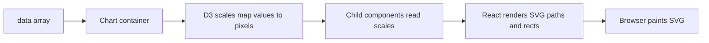
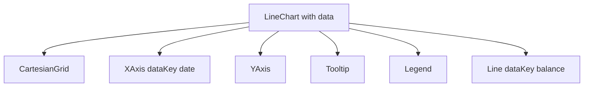
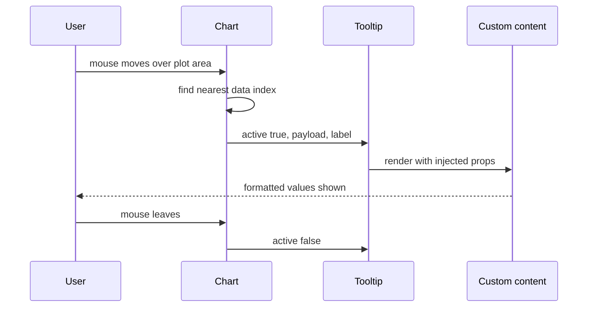
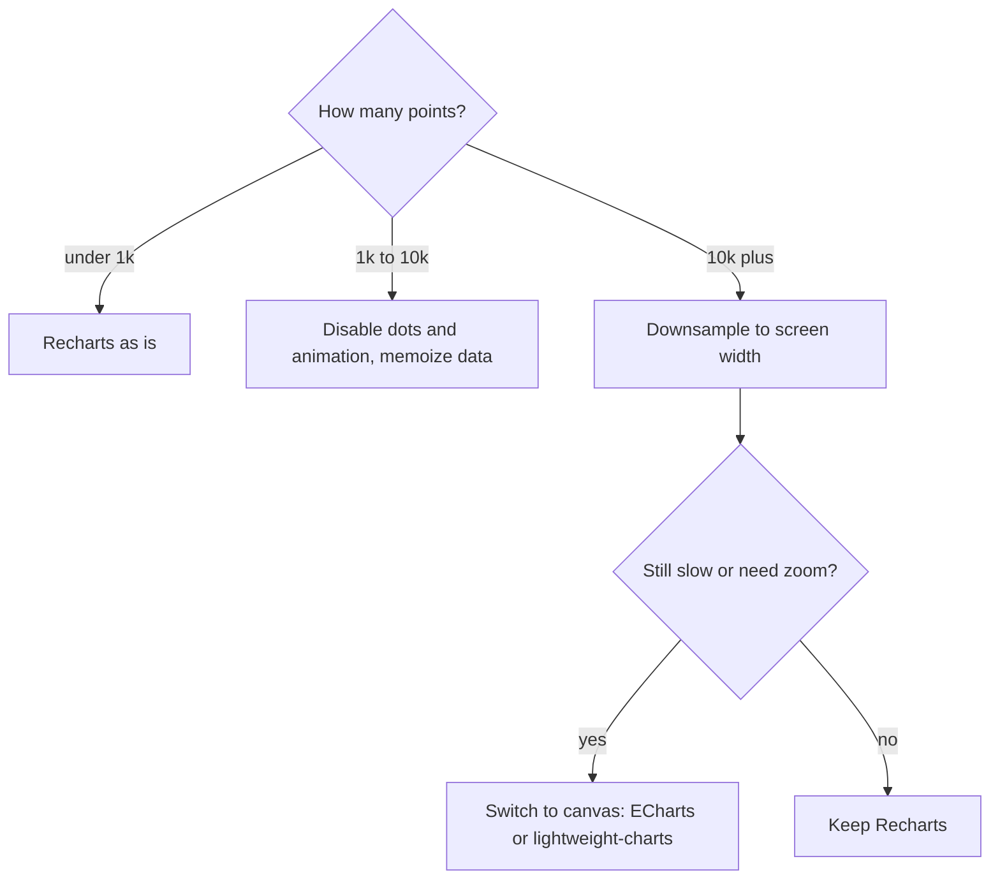

## 1. What it is

**Recharts is a declarative React charting library that renders SVG charts from composable components, using D3 modules for the maths.**

Imagine building a chart out of LEGO. One brick is the chart frame, one is the X axis, one is the Y axis, one is the line, one is the tooltip. You snap the bricks together inside each other and the library figures out how they fit. You never draw a pixel yourself; you describe what should exist.

The problem it solves: D3 is powerful but imperative. It wants to own the DOM (`select`, `append`, `attr`), which fights React, which also wants to own the DOM. Recharts uses D3 only for calculations (scales, shapes, interpolation) and lets React render the SVG. You get charts that update when props change, like any other component.

## 2. Core concepts

### [Beginner] SVG and D3 under the hood

Recharts outputs `<svg>` elements: `<path>` for lines and areas, `<rect>` for bars, `<text>` for labels. D3 helpers (`d3-scale`, `d3-shape`) convert data values into pixel coordinates.

> **Why:** SVG elements are real DOM nodes. That gives crisp vectors at any zoom, CSS styling, and accessible text. The cost is that every point and bar is a node, so 50,000 points means 50,000-ish nodes, which is slow. Canvas libraries draw pixels instead and scale better.



```tsx
// What you write vs what you get: a <path d="M10,80L60,40..."> inside an <svg>
<LineChart width={600} height={300} data={points}>
  <Line dataKey="balance" />
</LineChart>
```

### [Beginner] Data shape: an array of flat objects

Every Recharts chart takes `data`: an array of objects. Each child says which key to read with `dataKey`.

```ts
type BalancePoint = { date: string; balance: number; deposits: number };

const data: BalancePoint[] = [
  { date: '2026-09-01', balance: 12500, deposits: 3000 },
  { date: '2026-09-02', balance: 11980, deposits: 0 },
  { date: '2026-09-03', balance: 14010, deposits: 2500 },
];
```

> **Finance tip:** Store money as integer cents in your domain model, but convert to a number in major units (or keep cents and format in the tick) when you build chart data. Do the conversion in one memoized mapper, not inside every formatter.

### [Beginner] Composable components

A chart is a container (`LineChart`, `BarChart`, `AreaChart`, `PieChart`, `ComposedChart`) with children. The children are independent features you add or remove.

```tsx
import { CartesianGrid, Legend, Line, LineChart, Tooltip, XAxis, YAxis } from 'recharts';

export function BalanceChart({ data }: { data: BalancePoint[] }) {
  return (
    <LineChart width={640} height={300} data={data} margin={{ top: 8, right: 16, bottom: 8, left: 8 }}>
      <CartesianGrid strokeDasharray="3 3" />
      <XAxis dataKey="date" />
      <YAxis />
      <Tooltip />
      <Legend />
      <Line type="monotone" dataKey="balance" stroke="#2563eb" dot={false} />
    </LineChart>
  );
}
```



### [Beginner] ResponsiveContainer and the parent height gotcha

Charts need explicit pixel width and height. `ResponsiveContainer` measures its parent (with ResizeObserver) and passes the size to the chart.

```tsx
import { ResponsiveContainer } from 'recharts';

<div style={{ width: '100%', height: 320 }}>
  <ResponsiveContainer width="100%" height="100%">
    <LineChart data={data}>{/* ... */}</LineChart>
  </ResponsiveContainer>
</div>
```

> **Gotcha:** `height="100%"` means 100% of the parent. If the parent has no explicit height (a plain div in normal flow has height 0 until content fills it), the chart renders at 0px and you see nothing. Give the parent a fixed height, `min-height`, or a flex/grid cell with a defined size. Alternatively use `<ResponsiveContainer width="100%" height={320}>` or `aspect={2}`.

> **Gotcha:** Inside a CSS grid or flex child, add `min-width: 0` to the cell. Otherwise the chart can grow but never shrink, because flex items default to `min-width: auto`.

### [Intermediate] Chart types: Line, Bar, Area, Pie

```tsx
// Bar: monthly spend by category, stacked
<BarChart data={monthly}>
  <XAxis dataKey="month" />
  <YAxis />
  <Bar dataKey="rent" stackId="spend" fill="#1d4ed8" />
  <Bar dataKey="groceries" stackId="spend" fill="#16a34a" />
</BarChart>

// Area: portfolio value over time
<AreaChart data={history}>
  <XAxis dataKey="date" />
  <YAxis />
  <Area type="monotone" dataKey="value" stroke="#2563eb" fill="#93c5fd" />
</AreaChart>

// Pie / donut: allocation by asset class
<PieChart width={280} height={280}>
  <Pie data={allocation} dataKey="weight" nameKey="assetClass" innerRadius={70} outerRadius={110}>
    {allocation.map((a) => <Cell key={a.assetClass} fill={a.color} />)}
  </Pie>
  <Tooltip />
</PieChart>
```

`ComposedChart` mixes types, for example bars for monthly cash flow plus a line for running balance. Use `yAxisId` for two Y axes.

```tsx
<ComposedChart data={cashFlow}>
  <XAxis dataKey="month" />
  <YAxis yAxisId="flow" />
  <YAxis yAxisId="balance" orientation="right" />
  <Bar yAxisId="flow" dataKey="netFlow" fill="#64748b" />
  <Line yAxisId="balance" dataKey="balance" stroke="#2563eb" dot={false} />
</ComposedChart>
```

### [Intermediate] Axis formatting with tickFormatter

`tickFormatter` turns raw tick values into display strings. Create `Intl.NumberFormat` instances once (they are relatively expensive to construct) and reuse them.

```ts
const usdCompact = new Intl.NumberFormat('en-US', {
  style: 'currency', currency: 'USD', notation: 'compact', maximumFractionDigits: 1,
});
const usdFull = new Intl.NumberFormat('en-US', { style: 'currency', currency: 'USD' });
const shortDate = new Intl.DateTimeFormat('en-US', { month: 'short', day: 'numeric', timeZone: 'UTC' });

export const formatAxisMoney = (v: number) => usdCompact.format(v);   // 1250000 -> "$1.3M"
export const formatTooltipMoney = (v: number) => usdFull.format(v);   // "$1,250,000.00"
export const formatAxisDate = (iso: string) => shortDate.format(new Date(iso)); // "Sep 3"
```

```tsx
<XAxis dataKey="date" tickFormatter={formatAxisDate} minTickGap={24} />
<YAxis tickFormatter={formatAxisMoney} width={64} domain={['auto', 'auto']} />
```

> **Why:** Axes need compact labels to fit; tooltips need full precision. Use different formatters for each. A Y axis showing "$1,250,000.00" eats half the chart width.

> **Gotcha:** `new Date('2026-09-03')` is parsed as UTC midnight. Formatting in a US time zone without `timeZone: 'UTC'` shows "Sep 2". Off-by-one-day on statements is a classic bug.

### [Intermediate] Custom tick component

For styling beyond text (colours for negatives, two-line labels), pass a component to `tick`. Recharts calls it with `x`, `y` and `payload` (which has `value`).

```tsx
type TickProps = { x?: number; y?: number; payload?: { value: number } };

function MoneyTick({ x = 0, y = 0, payload }: TickProps) {
  const v = payload?.value ?? 0;
  return (
    <text x={x} y={y} dy={4} textAnchor="end" fontSize={12} fill={v < 0 ? '#dc2626' : '#475569'}>
      {usdCompact.format(v)}
    </text>
  );
}

<YAxis tick={<MoneyTick />} />
```

### [Intermediate] Tooltip with custom content

The default tooltip is functional but generic. Pass `content` to render your own. Recharts injects `active`, `payload` (array of series entries for the hovered point) and `label`.

```tsx
type Entry = { name?: string; value?: number; color?: string; payload?: BalancePoint };
type BalanceTooltipProps = { active?: boolean; payload?: Entry[]; label?: string };

function BalanceTooltip({ active, payload, label }: BalanceTooltipProps) {
  if (!active || !payload?.length) return null;
  return (
    <div className="rounded border bg-white p-2 text-sm shadow">
      <div className="font-medium">{label && formatAxisDate(label)}</div>
      {payload.map((p) => (
        <div key={p.name} style={{ color: p.color }}>
          {p.name}: {formatTooltipMoney(p.value ?? 0)}
        </div>
      ))}
    </div>
  );
}

<Tooltip content={<BalanceTooltip />} cursor={{ strokeDasharray: '3 3' }} />
```

> **Outdated:** Recharts 3 reworked tooltip typing (content props are typed separately from `<Tooltip>` props). Defining your own props type, as above, keeps code working across 2.x and 3.x.



### [Intermediate] Legend and ReferenceLine

```tsx
<Legend verticalAlign="top" height={32} formatter={(value) => value.toUpperCase()} />

// Zero line for P and L, target line for budget
<ReferenceLine y={0} stroke="#94a3b8" />
<ReferenceLine y={5000} stroke="#f59e0b" strokeDasharray="4 4" label={{ value: 'Budget', position: 'insideTopRight' }} />
<ReferenceLine x="2026-09-15" stroke="#64748b" label="Payday" />
```

`ReferenceArea` shades a range (for example, a market-closed period). `ReferenceDot` marks one point.

### [Advanced] Gradients

SVG gradients are defined in `<defs>` inside the chart and referenced with `url(#id)`.

```tsx
<AreaChart data={history}>
  <defs>
    <linearGradient id="portfolioFill" x1="0" y1="0" x2="0" y2="1">
      <stop offset="5%" stopColor="#2563eb" stopOpacity={0.35} />
      <stop offset="95%" stopColor="#2563eb" stopOpacity={0} />
    </linearGradient>
  </defs>
  <XAxis dataKey="date" />
  <YAxis />
  <Area dataKey="value" stroke="#2563eb" fill="url(#portfolioFill)" />
</AreaChart>
```

> **Gotcha:** SVG `id`s are global in the document. Two charts with `id="portfolioFill"` and different colours will both use the first one. Use `useId()` to make unique IDs per chart instance.

### [Advanced] Performance with large series



```tsx
import { memo, useMemo } from 'react';

// Keep every Nth point. A 700px chart cannot show more than ~700 distinct x positions.
function downsample<T>(points: T[], maxPoints: number): T[] {
  if (points.length <= maxPoints) return points;
  const step = Math.ceil(points.length / maxPoints);
  return points.filter((_, i) => i % step === 0 || i === points.length - 1);
}

export const PriceHistory = memo(function PriceHistory({ ticks }: { ticks: BalancePoint[] }) {
  const data = useMemo(() => downsample(ticks, 800), [ticks]); // stable reference
  return (
    <ResponsiveContainer width="100%" height={300}>
      <LineChart data={data}>
        <XAxis dataKey="date" tickFormatter={formatAxisDate} minTickGap={32} />
        <YAxis tickFormatter={formatAxisMoney} domain={['auto', 'auto']} />
        <Line dataKey="balance" dot={false} isAnimationActive={false} strokeWidth={1.5} />
      </LineChart>
    </ResponsiveContainer>
  );
});
```

> **Why:** Recharts re-computes scales and re-renders SVG when `data` changes identity. A new array every parent render means full recalculation on every keystroke elsewhere on the page. `useMemo` plus `memo` stops that. For price charts, prefer a proper algorithm like LTTB (largest triangle three buckets), which preserves peaks better than "every Nth".

## 3. Why it's used in this project

- **Dashboards:** account balance over time, portfolio value, monthly spend, income vs expenses.
- **Allocation views:** donut chart of asset classes or spending categories.
- **Consistent money formatting:** axes and tooltips use the same `Intl.NumberFormat` helpers as the rest of the app (compact on axes, full on tooltip).
- **React-native mental model:** charts are components; they take props, re-render from React Query data, and can be tested and put in Storybook.
- **Reference lines:** zero line for gains and losses, budget targets, statement cut-off dates.

> **Finance tip:** Do not round values before charting and then show the rounded value in a tooltip. Keep exact values in data; round only at format time. Auditors and users notice when the tooltip and the statement disagree by a cent.

## 4. Setup & configuration

```bash
npm i recharts
# Recharts 2.x supports React 16.8+; React 19 support arrived in late 2.x releases.
# Recharts 3.x (2025) is the current major. Check peer dependencies for your React version.
```

There is no global config file. Create a small shared module of chart defaults instead.

```tsx
// src/charts/chartTheme.ts
export const chartColors = {
  primary: '#2563eb',   // main series
  positive: '#16a34a',  // gains, deposits
  negative: '#dc2626',  // losses, withdrawals
  grid: '#e2e8f0',      // gridlines
  axis: '#64748b',      // tick text
} as const;

export const defaultMargin = { top: 8, right: 16, bottom: 8, left: 0 }; // room for tick labels

export const axisProps = {
  tick: { fontSize: 12, fill: chartColors.axis }, // tick text style
  tickLine: false,                                // hide little tick marks
  axisLine: false,                                // hide axis baseline
} as const;
```

```tsx
// Usage
<XAxis dataKey="date" {...axisProps} tickFormatter={formatAxisDate} />
<YAxis {...axisProps} tickFormatter={formatAxisMoney} width={64} />
<CartesianGrid stroke={chartColors.grid} vertical={false} />
```

> **Gotcha:** You cannot wrap Recharts children in your own components freely in 2.x. `<MyXAxis />` that returns `<XAxis />` may be ignored, because 2.x finds children by component type. Spread shared props instead. Recharts 3 relaxed this by moving to an internal store, but spreading props works in both.

## 5. Key features we use

### [Beginner] Responsive balance chart

```tsx
export function AccountBalanceChart({ points }: { points: BalancePoint[] }) {
  return (
    <div className="h-72 w-full min-w-0">
      <ResponsiveContainer width="100%" height="100%">
        <AreaChart data={points} margin={defaultMargin}>
          <CartesianGrid stroke={chartColors.grid} vertical={false} />
          <XAxis dataKey="date" {...axisProps} tickFormatter={formatAxisDate} />
          <YAxis {...axisProps} tickFormatter={formatAxisMoney} width={64} />
          <Tooltip content={<BalanceTooltip />} />
          <ReferenceLine y={0} stroke={chartColors.axis} />
          <Area dataKey="balance" stroke={chartColors.primary} fill={chartColors.primary} fillOpacity={0.1} />
        </AreaChart>
      </ResponsiveContainer>
    </div>
  );
}
```

### [Intermediate] Positive and negative bar colours

```tsx
<BarChart data={dailyPnl}>
  <XAxis dataKey="date" tickFormatter={formatAxisDate} />
  <YAxis tickFormatter={formatAxisMoney} />
  <ReferenceLine y={0} stroke="#94a3b8" />
  <Bar dataKey="pnl">
    {dailyPnl.map((d) => (
      <Cell key={d.date} fill={d.pnl >= 0 ? chartColors.positive : chartColors.negative} />
    ))}
  </Bar>
</BarChart>
```

### [Intermediate] Click a bar to drill down

```tsx
<Bar
  dataKey="amount"
  onClick={(entry) => navigate(`/transactions?category=${entry.payload.category}`)}
  cursor="pointer"
/>
```

### [Intermediate] Empty and loading states

```tsx
if (isLoading) return <ChartSkeleton />;
if (!points.length) return <p className="text-sm text-slate-500">No activity in this period.</p>;
```

Recharts renders an empty frame with no data, which looks broken. Handle empty states yourself.

## 6. Interview questions

#### Q: Why does my ResponsiveContainer chart not show up?

`ResponsiveContainer` sizes itself as a percentage of its parent. If the parent has no explicit height, 100% of 0 is 0. Fix by giving the parent a fixed or min height, using a numeric `height` on `ResponsiveContainer`, or using `aspect`. In flex/grid layouts also set `min-width: 0` on the item so the chart can shrink.

#### Q: How does Recharts relate to D3?

Recharts uses D3 modules (scales, shapes, interpolation) only for maths: mapping data to pixel coordinates and generating SVG path strings. React renders the actual SVG. That avoids the conflict of D3 mutating DOM that React also controls. Raw D3 gives total control but you manage DOM and updates yourself; Recharts trades flexibility for a declarative component API.

#### Q: How would you render a chart with 100,000 points?

SVG has one DOM node per mark, so 100k points is too heavy. Options: downsample to roughly the pixel width (LTTB keeps the visual shape), disable dots and animation, memoize data so scales are not recomputed every render, aggregate server-side (daily instead of per-tick), or move to a canvas or WebGL library such as ECharts or TradingView lightweight-charts, which are built for large financial series with zoom and pan.

#### Q: How do you format currency on axes and tooltips?

Use `tickFormatter` on axes with a compact `Intl.NumberFormat` (`notation: 'compact'`) so labels fit, and a custom tooltip `content` component using a full-precision currency formatter. Create formatter instances once at module scope. Keep raw values in data and only format at display time. Use the account's currency code, not a hardcoded `$`.

#### Q: What are SVG charts' accessibility problems and how do you mitigate them?

Charts are visual; screen reader users get little from paths. Mitigations: give the chart a text summary (title and description), provide the same data as an accessible table or "view as table" toggle, do not rely on colour alone (use labels or patterns for gains vs losses), ensure tooltip content is reachable by keyboard where possible. Recharts 2.x has an `accessibilityLayer` prop that adds keyboard navigation and ARIA roles; in 3.x it is on by default.

## 7. Drawbacks & pain points

- **SVG performance ceiling.** Thousands of points or many charts on one page get slow.
- **Child type detection (2.x).** Wrapping axis or line components in your own components can make them silently disappear.
- **Typing is loose.** Callback and tooltip payload types are generic (`any`-ish); you often define your own.
- **Limited financial charts.** No built-in candlestick, crosshair sync across panes, or log-scale finance UX out of the box (log scale exists via `scale="log"` but needs positive data).
- **Animations** look nice in demos but cause flaky visual tests and jank on updates.
- **Major version 3 migration** changed internals and some props; older blog posts do not match.

Gotchas that trip devs up:

```tsx
// 1. New data array every render: full recompute and re-animation
<LineChart data={transactions.map(toPoint)} /> // BAD in a frequently re-rendering parent
const data = useMemo(() => transactions.map(toPoint), [transactions]); // GOOD

// 2. String numbers from the API: "1250.50" plots badly or not at all
const points = rows.map((r) => ({ ...r, balance: Number(r.balance) })); // coerce once

// 3. Y axis starts at 0 by default for most charts, flattening small movements
<YAxis domain={['auto', 'auto']} /> // or ['dataMin - 100', 'dataMax + 100']

// 4. Duplicate gradient ids across chart instances
const gradientId = useId(); // then fill={`url(#${gradientId})`}
```

> **Gotcha:** Truncating the Y axis (not starting at 0) on a bar chart exaggerates differences and can mislead users. It is fine for line charts of prices, not for bars of amounts.

## 8. Better alternatives

The trend: Recharts remains popular for typical dashboards. For heavy or specialised financial charts, teams move to canvas-based libraries. For bespoke visuals, teams use visx (low-level D3 primitives as React components).

| Library | Bundle (gzip) | Renderer | Boilerplate | Learning curve | TypeScript | Popularity | When it wins |
|---|---|---|---|---|---|---|---|
| Recharts | ~95-130 KB | SVG | Low | Low | Fair-good | Very high | Standard dashboards, quick composable charts |
| visx (Airbnb) | ~small per package | SVG | High | High | Very good | Medium | Custom, design-heavy visuals with full control |
| Nivo | ~large per chart type | SVG, canvas, HTML | Low | Low | Good | Medium-high | Many chart types, nice defaults, server rendering |
| ECharts (echarts-for-react) | ~300 KB+ full, less with tree shaking | Canvas or SVG | Medium (options object) | Medium | Good | Very high | Large data, zoom, pan, many chart types |
| Chart.js (react-chartjs-2) | ~70 KB | Canvas | Medium | Low | Good | Very high | Simple fast canvas charts |
| TradingView lightweight-charts | ~45 KB | Canvas | Medium (imperative) | Medium | Very good | High in finance | Candlesticks, price series, real-time ticks |

> **Finance tip:** For trading or market-data screens (candles, volume, real-time updates, crosshair), lightweight-charts is the practical default. Keep Recharts for account-level summaries.

## 9. When NOT to use it

- Tens of thousands of points, real-time streaming ticks, or zoom/pan on long histories.
- Candlestick, OHLC, depth charts or technical indicators.
- Highly custom visuals (custom shapes, unusual layouts) where you fight the component API; use visx or D3.
- Geographic maps or network graphs.
- When a simple number with a trend arrow or a sparkline communicates better than a full chart.

## Cheatsheet

| Need | API |
|---|---|
| Fill parent | `<ResponsiveContainer width="100%" height="100%">` inside a sized parent |
| Series | `<Line dataKey>`, `<Bar dataKey stackId>`, `<Area dataKey>`, `<Pie data dataKey nameKey>` |
| Mixed | `<ComposedChart>` + `yAxisId` |
| Axis label format | `tickFormatter={(v) => fmt.format(v)}` |
| Custom tick | `tick={<MyTick />}` gets `x, y, payload.value` |
| Tooltip | `<Tooltip content={<MyTooltip />} />` gets `active, payload, label` |
| Per-bar colour | `<Cell fill>` children |
| Lines and bands | `<ReferenceLine y={0} />`, `<ReferenceArea x1 x2 />` |
| Domain | `<YAxis domain={['auto','auto']} />` |
| Perf | `dot={false}`, `isAnimationActive={false}`, memoized `data` |

```tsx
<div className="h-72 min-w-0">
  <ResponsiveContainer width="100%" height="100%">
    <LineChart data={data} margin={{ top: 8, right: 16, left: 0, bottom: 8 }}>
      <CartesianGrid vertical={false} strokeDasharray="3 3" />
      <XAxis dataKey="date" tickFormatter={formatAxisDate} minTickGap={24} />
      <YAxis tickFormatter={formatAxisMoney} width={64} domain={['auto', 'auto']} />
      <Tooltip content={<BalanceTooltip />} />
      <Legend />
      <ReferenceLine y={0} stroke="#94a3b8" />
      <Line dataKey="balance" stroke="#2563eb" dot={false} isAnimationActive={false} />
    </LineChart>
  </ResponsiveContainer>
</div>
```
