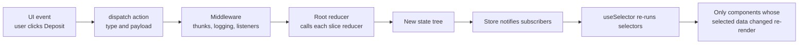
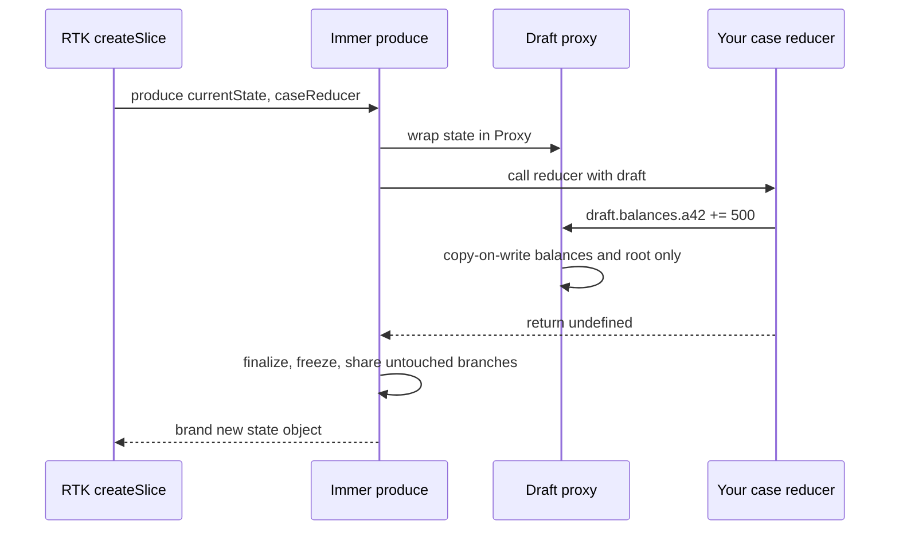
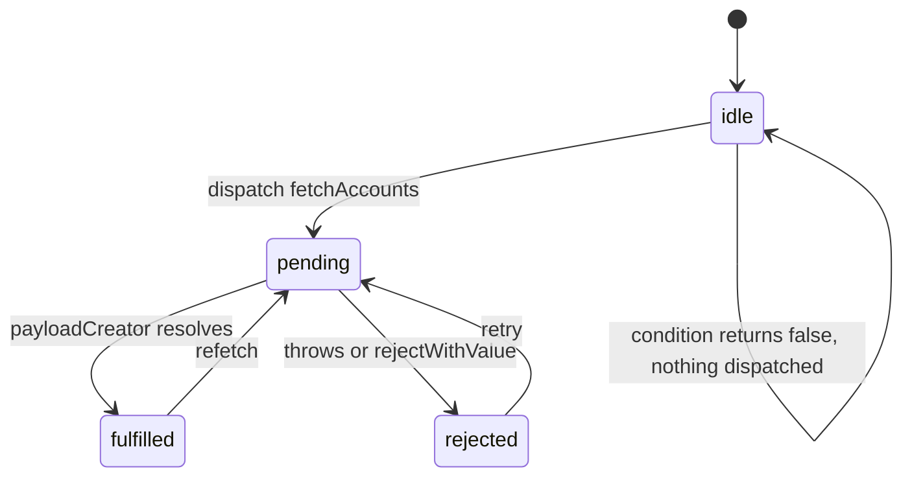
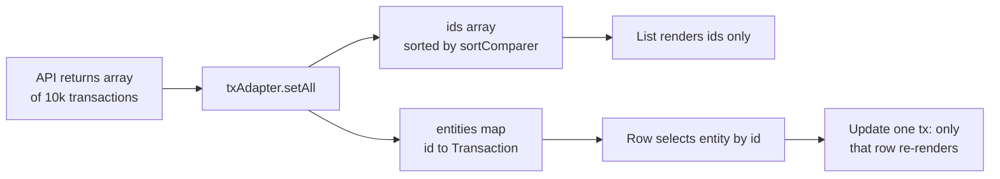
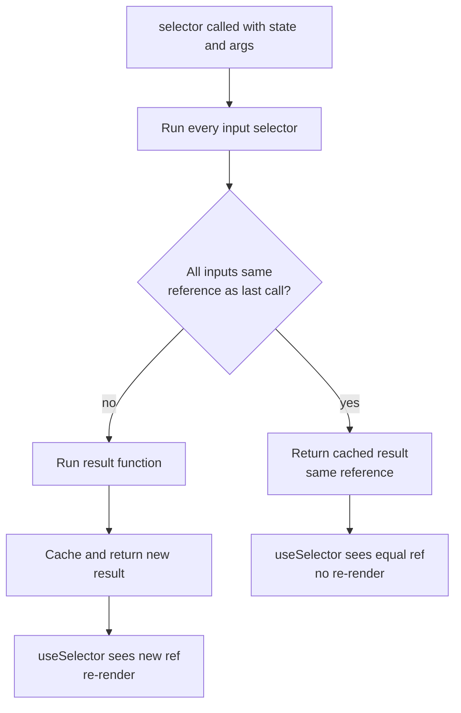
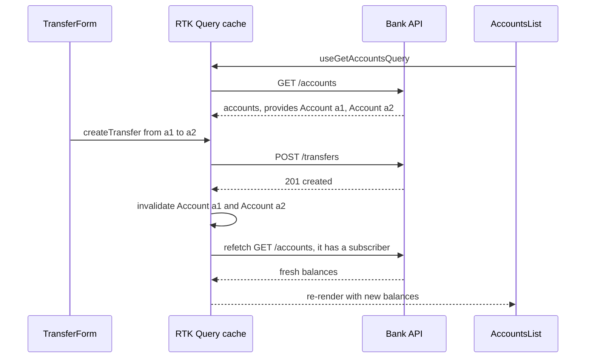

## 1. What it is

**Redux Toolkit (RTK) is the official, opinionated package for writing Redux: it wraps the Redux core with helpers that remove boilerplate and bake in best practices, plus RTK Query for data fetching.**

Think of a bank ledger. You never walk into the vault and change a balance directly. You submit a slip ("deposit 100 to account 42"). A clerk follows fixed rules to apply each slip and writes a new line in the ledger. Because every change is a slip and every rule is written down, you can replay the day, audit who did what, and know exactly how you got to the current balance. In Redux, the slips are **actions**, the clerk's rules are **reducers**, and the ledger is the **store**.

The problem it solves: plain Redux was predictable but painful. You hand-wrote action type constants, action creators, switch statements, immutable spread chains and store setup with middleware. RTK reduces that to `createSlice` and `configureStore`, uses Immer so updates read like normal code, and ships RTK Query so you stop writing fetch/loading/error reducers by hand.

## 2. Core concepts

### [Beginner] Redux fundamentals: why one store and actions?

Redux is built on three principles:

1. **Single source of truth.** All shared state lives in one object tree inside one store.
2. **State is read-only.** The only way to change it is to dispatch an action: a plain object describing what happened.
3. **Changes are made by pure functions.** A reducer takes `(state, action)` and returns the next state, without side effects.

```ts
// Plain Redux, no toolkit, to see the bones
type Action =
  | { type: 'accounts/deposited'; payload: { accountId: string; amountCents: number } }
  | { type: 'accounts/withdrew'; payload: { accountId: string; amountCents: number } };

interface AccountsState { balances: Record<string, number> }

function accountsReducer(
  state: AccountsState = { balances: {} },
  action: Action,
): AccountsState {
  switch (action.type) {
    case 'accounts/deposited': {
      const { accountId, amountCents } = action.payload;
      return {
        ...state,
        balances: { ...state.balances, [accountId]: (state.balances[accountId] ?? 0) + amountCents },
      };
    }
    default:
      return state;
  }
}
```



> **Why this design:** If every change goes through one function with a described event, then (a) state transitions are reproducible from the action log, (b) you can time-travel debug, (c) logic is testable without the UI: `reducer(state, action)` is just input to output, and (d) many unrelated parts of the app can react to the same event.

### [Beginner] Why immutability matters

Redux and React Redux detect changes by **reference comparison** (`===`). If a reducer mutates the existing object, the reference stays the same, so nothing re-renders and DevTools history is corrupted (the "previous" state was also mutated).

```ts
// WRONG in a plain reducer: mutates, returns same reference
state.balances[id] += amount;
return state;

// RIGHT in a plain reducer: copy every level on the path you change
return { ...state, balances: { ...state.balances, [id]: state.balances[id] + amount } };
```

> **Why references:** Comparing references is O(1). Deep comparing a big state tree on every action would be far too slow. Immutability is the price of cheap change detection.

### [Beginner] `configureStore`

`configureStore` creates the store with good defaults: combines your reducers, adds the thunk middleware, enables Redux DevTools, and in development adds checks that catch mutations and non-serializable values.

```ts
// src/app/store.ts
import { configureStore } from '@reduxjs/toolkit';
import accountsReducer from '@/features/accounts/accountsSlice';
import preferencesReducer from '@/features/preferences/preferencesSlice';

export const store = configureStore({
  reducer: {
    accounts: accountsReducer,       // state.accounts
    preferences: preferencesReducer, // state.preferences
  },
});

// Infer types from the store itself, never hand-write them
export type RootState = ReturnType<typeof store.getState>;
export type AppDispatch = typeof store.dispatch;
```

### [Beginner] `createSlice`

A slice bundles one feature's initial state, reducers and generated action creators. You write "case reducers"; RTK generates action types as `"<name>/<reducerKey>"`.

```ts
// src/features/preferences/preferencesSlice.ts
import { createSlice, type PayloadAction } from '@reduxjs/toolkit';

type Currency = 'USD' | 'EUR' | 'GBP';

interface PreferencesState {
  displayCurrency: Currency;
  hideBalances: boolean;
}

const initialState: PreferencesState = { displayCurrency: 'USD', hideBalances: false };

const preferencesSlice = createSlice({
  name: 'preferences',
  initialState,
  reducers: {
    currencyChanged(state, action: PayloadAction<Currency>) {
      state.displayCurrency = action.payload; // "mutation" is safe: Immer
    },
    hideBalancesToggled(state) {
      state.hideBalances = !state.hideBalances;
    },
  },
  // RTK 2.x: selectors can live on the slice
  selectors: {
    selectDisplayCurrency: (s) => s.displayCurrency,
    selectHideBalances: (s) => s.hideBalances,
  },
});

export const { currencyChanged, hideBalancesToggled } = preferencesSlice.actions;
export const { selectDisplayCurrency, selectHideBalances } = preferencesSlice.selectors;
export default preferencesSlice.reducer;

// currencyChanged('EUR') -> { type: 'preferences/currencyChanged', payload: 'EUR' }
```

> **Interview tip:** Name actions as past-tense events ("currencyChanged", "transferSubmitted") rather than setters ("setCurrency"). The Redux style guide recommends this because many reducers may respond to one event.

### [Beginner] `prepare` callbacks: shaping the payload

When an action needs generated values (IDs, timestamps), generate them in a `prepare` callback, not in the reducer. Reducers must stay pure.

```ts
import { nanoid, createSlice, type PayloadAction } from '@reduxjs/toolkit';

interface AuditEntry { id: string; at: string; message: string }

const auditSlice = createSlice({
  name: 'audit',
  initialState: [] as AuditEntry[],
  reducers: {
    entryLogged: {
      reducer(state, action: PayloadAction<AuditEntry>) {
        state.push(action.payload);
      },
      prepare(message: string) {
        return { payload: { id: nanoid(), at: new Date().toISOString(), message } };
      },
    },
  },
});
```

> **Why:** Replaying the same action list must produce the same state. `Date.now()` or random IDs inside a reducer break that.

### [Intermediate] Immer under the hood

RTK's `createSlice` and `createReducer` run your case reducers through Immer's `produce`. Immer passes you a **draft**: a JavaScript `Proxy` wrapping the current state. When you "mutate" the draft, the proxy records the change and copies only the touched objects. At the end, Immer builds a new immutable state that **structurally shares** every untouched branch with the old one.



```ts
// What you write
depositReceived(state, action: PayloadAction<{ accountId: string; amountCents: number }>) {
  const acct = state.byId[action.payload.accountId];
  if (acct) acct.balanceCents += action.payload.amountCents;
}

// What Immer effectively produces
// { ...state, byId: { ...state.byId, [id]: { ...acct, balanceCents: acct.balanceCents + amt } } }
```

Rules for Immer reducers:

```ts
reducers: {
  // 1. Mutate the draft and return nothing
  a(state) { state.count += 1; },

  // 2. OR return a completely new value (useful to replace/reset)
  reset() { return initialState; },

  // 3. NEVER both mutate and return a new value — Immer throws
  bad(state) { state.count += 1; return { ...state }; }, // Error

  // 4. Arrow shorthand trap: this RETURNS the assignment result
  oops: (state) => (state.count = 0),                   // returns 0, replaces state with 0
  fixed: (state) => { state.count = 0; },               // braces: returns undefined
}
```

> **Why mutations are safe:** You never touch the real state; you touch a proxy. The real previous state is untouched, so references still change on the modified path and stay the same elsewhere. That preserves both Redux's change detection and memoized selectors.

> **Gotcha:** `console.log(state)` inside a reducer prints a Proxy. Use `import { current } from '@reduxjs/toolkit'` and `console.log(current(state))`.

> **Gotcha:** Immer only tracks plain objects, arrays, Maps and Sets (Map/Set need `enableMapSet()`). Class instances are not drafted. Redux state should be plain serializable data anyway.

### [Intermediate] `createAsyncThunk` lifecycle

A thunk is a function you dispatch instead of an object; the thunk middleware calls it with `dispatch` and `getState`. `createAsyncThunk` wraps an async function and automatically dispatches three actions: `pending`, then `fulfilled` or `rejected`.



```ts
// src/features/accounts/accountsThunks.ts
import { createAsyncThunk } from '@reduxjs/toolkit';
import type { RootState } from '@/app/store';

export interface Account { id: string; name: string; balanceCents: number; currency: string }
interface ApiError { code: string; message: string }

export const fetchAccounts = createAsyncThunk<
  Account[],                                        // return type (fulfilled payload)
  { customerId: string },                           // argument type
  { state: RootState; rejectValue: ApiError }       // thunkAPI config
>(
  'accounts/fetchAll',
  async ({ customerId }, { signal, rejectWithValue }) => {
    const res = await fetch(`/api/customers/${customerId}/accounts`, { signal });
    if (!res.ok) {
      // Typed, serializable error instead of a thrown Error
      return rejectWithValue((await res.json()) as ApiError);
    }
    return (await res.json()) as Account[];
  },
  {
    // Skip if already loading: prevents duplicate requests
    condition: (_arg, { getState }) => getState().accounts.status !== 'loading',
  },
);
```

What each piece does:

- `rejectWithValue(x)` makes the `rejected` action carry `action.payload = x` (typed), instead of only a serialized `action.error`.
- `condition` runs before anything is dispatched. Returning `false` cancels the thunk silently (no `pending`).
- `signal` is an `AbortSignal`. Calling `promise.abort()` on the dispatched result aborts the fetch.
- The dispatched thunk returns a promise. `.unwrap()` gives you the payload or throws the error, which is ideal for "submit and navigate".

```tsx
const dispatch = useAppDispatch();
async function onLoad() {
  try {
    const accounts = await dispatch(fetchAccounts({ customerId })).unwrap();
    toast(`Loaded ${accounts.length} accounts`);
  } catch (err) {
    // err is the rejectWithValue payload (or a SerializedError)
  }
}
```

> **Gotcha:** Without `.unwrap()`, `await dispatch(thunk())` always resolves, even on failure. It resolves to the `rejected` action. Many devs think their `try/catch` handles errors when it never fires.

### [Intermediate] `extraReducers` with the builder

`reducers` define actions owned by the slice. `extraReducers` lets a slice respond to actions defined elsewhere: thunk lifecycle actions, other slices' actions, or matchers.

```ts
import { createSlice, isAnyOf } from '@reduxjs/toolkit';
import { fetchAccounts } from './accountsThunks';
import { loggedOut } from '@/features/session/sessionSlice';

interface AccountsState {
  items: Account[];
  status: 'idle' | 'loading' | 'succeeded' | 'failed';
  error: string | null;
}

const initialState: AccountsState = { items: [], status: 'idle', error: null };

const accountsSlice = createSlice({
  name: 'accounts',
  initialState,
  reducers: {},
  extraReducers: (builder) => {
    builder
      .addCase(fetchAccounts.pending, (state) => {
        state.status = 'loading';
        state.error = null;
      })
      .addCase(fetchAccounts.fulfilled, (state, action) => {
        state.status = 'succeeded';
        state.items = action.payload;          // typed as Account[]
      })
      .addCase(fetchAccounts.rejected, (state, action) => {
        state.status = 'failed';
        state.error = action.payload?.message ?? action.error.message ?? 'Unknown error';
      })
      // Respond to another slice's action: clear PII on logout
      .addCase(loggedOut, () => initialState)
      // Matchers must come after all addCase calls
      .addMatcher(isAnyOf(fetchAccounts.rejected), (state) => {
        /* e.g. count failures */
      })
      .addDefaultCase(() => {});
  },
});
```

> **Outdated:** The object syntax `extraReducers: { [fetchAccounts.fulfilled]: ... }` was removed in RTK 2.0. Use the builder callback. It also gives much better TypeScript inference.

> **Why builder order:** `addCase` must come before `addMatcher`, which must come before `addDefaultCase`. RTK enforces this so the precedence is predictable.

### [Intermediate] `createEntityAdapter`: normalized collections

Arrays of records are slow to update by ID and invite duplicates. The standard fix is **normalization**: `{ ids: string[], entities: Record<id, Item> }`. `createEntityAdapter` generates that shape, CRUD reducers and selectors.

```ts
import { createEntityAdapter, createSlice, type PayloadAction } from '@reduxjs/toolkit';
import type { RootState } from '@/app/store';

export interface Transaction {
  id: string;
  accountId: string;
  postedAt: string;     // ISO
  amountCents: number;  // integer cents, never floats
  currency: string;
  status: 'pending' | 'posted' | 'reversed';
}

const txAdapter = createEntityAdapter<Transaction>({
  // selectId: (t) => t.txnRef,                    // only if the key is not `id`
  sortComparer: (a, b) => b.postedAt.localeCompare(a.postedAt), // newest first; keeps ids sorted
});

const transactionsSlice = createSlice({
  name: 'transactions',
  initialState: txAdapter.getInitialState({ loading: false }), // { ids: [], entities: {}, loading }
  reducers: {
    transactionsReceived: txAdapter.setAll,
    transactionUpserted: txAdapter.upsertOne,
    transactionReversed(state, action: PayloadAction<string>) {
      txAdapter.updateOne(state, { id: action.payload, changes: { status: 'reversed' } });
    },
    transactionRemoved: txAdapter.removeOne,
  },
});

export const {
  selectAll: selectAllTransactions,
  selectById: selectTransactionById,
  selectIds: selectTransactionIds,
  selectTotal: selectTransactionCount,
} = txAdapter.getSelectors((state: RootState) => state.transactions);

export const { transactionsReceived, transactionUpserted, transactionReversed } =
  transactionsSlice.actions;
export default transactionsSlice.reducer;
```



> **Finance tip:** For a 10k-row ledger, have the list component select only `selectTransactionIds`, and each row select its own entity by ID. A status change on one transaction then re-renders one row, not ten thousand.

### [Intermediate] Selectors and `createSelector` memoization

A selector is a function `(state) => value`. Simple selectors just read. Derived data (filtered lists, totals) should be **memoized**, otherwise it recomputes and returns a new reference on every call, which makes `useSelector` re-render on every action.

```ts
import { createSelector } from '@reduxjs/toolkit'; // re-export of Reselect 5

const selectStatusFilter = (s: RootState) => s.ui.txStatusFilter;
const selectAccountIdParam = (_s: RootState, accountId: string) => accountId;

export const selectAccountTransactions = createSelector(
  [selectAllTransactions, selectAccountIdParam, selectStatusFilter], // input selectors
  (txs, accountId, status) =>                                         // result function
    txs.filter((t) => t.accountId === accountId && (status === 'all' || t.status === status)),
);

export const selectAccountTotalCents = createSelector(
  [selectAccountTransactions],
  (txs) => txs.reduce((sum, t) => sum + t.amountCents, 0),
);

// Usage
const txs = useAppSelector((s) => selectAccountTransactions(s, accountId));
```

How memoization works:



> **Why:** Input selectors are cheap reads. The expensive work (filter, sort, sum) runs only when one of its inputs actually changed. Because Redux uses immutable updates, "input changed" is a cheap `===` check.

> **Gotcha:** An input selector that returns a new reference each time (`(s) => s.txs.map(...)`) or an identity result function (`(x) => x`) defeats memoization. Reselect 5 has development checks (`inputStabilityCheck`, `identityFunctionCheck`) that warn you.

> **Outdated:** Reselect 4 had a cache size of 1, so sharing one selector across many components with different args thrashed the cache. Reselect 5 defaults to `weakMapMemoize`, which caches per argument set. You may still see `makeSelectX()` factory patterns in older code.

### [Advanced] RTK Query: data fetching as a cache

RTK Query (`@reduxjs/toolkit/query/react`) is a server-state cache built on Redux. You declare endpoints; it generates hooks that fetch, cache, dedupe, track loading/error, refetch and invalidate.

```ts
// src/services/bankApi.ts
import { createApi, fetchBaseQuery } from '@reduxjs/toolkit/query/react';
import type { RootState } from '@/app/store';

export interface NewTransfer { fromAccountId: string; toAccountId: string; amountCents: number; currency: string }

export const bankApi = createApi({
  reducerPath: 'bankApi',                         // key in the root state
  baseQuery: fetchBaseQuery({
    baseUrl: '/api/v1',
    prepareHeaders: (headers, { getState }) => {
      const token = (getState() as RootState).session.accessToken;
      if (token) headers.set('Authorization', `Bearer ${token}`);
      return headers;
    },
  }),
  tagTypes: ['Account', 'Transaction'],           // cache labels for invalidation
  keepUnusedDataFor: 60,                          // seconds to keep data after last subscriber (default 60)
  endpoints: (build) => ({
    getAccounts: build.query<Account[], void>({
      query: () => 'accounts',
      providesTags: (result) =>
        result
          ? [...result.map((a) => ({ type: 'Account' as const, id: a.id })), { type: 'Account', id: 'LIST' }]
          : [{ type: 'Account', id: 'LIST' }],
    }),
    getTransactions: build.query<Transaction[], { accountId: string; page: number }>({
      query: ({ accountId, page }) => ({ url: `accounts/${accountId}/transactions`, params: { page } }),
      providesTags: (_r, _e, { accountId }) => [{ type: 'Transaction', id: accountId }],
    }),
    createTransfer: build.mutation<{ transferId: string }, NewTransfer>({
      query: (body) => ({ url: 'transfers', method: 'POST', body }),
      // After a transfer, both accounts' balances and transactions are stale
      invalidatesTags: (_r, _e, arg) => [
        { type: 'Account', id: arg.fromAccountId },
        { type: 'Account', id: arg.toAccountId },
        { type: 'Transaction', id: arg.fromAccountId },
        { type: 'Transaction', id: arg.toAccountId },
      ],
    }),
  }),
});

// Generated hooks: use + EndpointName + Query/Mutation
export const { useGetAccountsQuery, useGetTransactionsQuery, useCreateTransferMutation } = bankApi;
```

Wire it into the store:

```ts
export const store = configureStore({
  reducer: {
    [bankApi.reducerPath]: bankApi.reducer,
    session: sessionReducer,
  },
  middleware: (getDefault) => getDefault().concat(bankApi.middleware), // required: cache lifetimes, polling, invalidation
});
setupListeners(store.dispatch); // enables refetchOnFocus / refetchOnReconnect
```

Tags and invalidation:



Using the hooks:

```tsx
function AccountsList() {
  const { data: accounts = [], isLoading, isFetching, error, refetch } = useGetAccountsQuery();
  if (isLoading) return <Spinner />;           // first load only
  if (error) return <ErrorBanner error={error} onRetry={refetch} />;
  return (
    <ul aria-busy={isFetching}>                 {/* background refetch */}
      {accounts.map((a) => <AccountRow key={a.id} account={a} />)}
    </ul>
  );
}

function TransferForm() {
  const [createTransfer, { isLoading }] = useCreateTransferMutation();
  async function submit(values: NewTransfer) {
    try {
      await createTransfer(values).unwrap();
      toast('Transfer submitted');
    } catch {
      toast('Transfer failed');
    }
  }
  /* ... */
}

// Conditional query: skip until we know the account
const { data } = useGetTransactionsQuery(accountId ? { accountId, page } : skipToken);
```

> **Why tags:** The cache does not know which data a mutation affects. Tags are labels you attach: queries "provide" tags, mutations "invalidate" tags. Any cached query whose provided tags were invalidated is refetched (if mounted) or dropped. This replaces hand-written "refetch after save" code.

> **Interview tip:** `isLoading` is true only when there is no data yet. `isFetching` is true for any in-flight request, including background refetches. Show a full spinner for the first and a subtle indicator for the second.

### [Advanced] Optimistic updates with `onQueryStarted`

```ts
markTransactionReviewed: build.mutation<void, { accountId: string; page: number; txId: string }>({
  query: ({ txId }) => ({ url: `transactions/${txId}/review`, method: 'POST' }),
  async onQueryStarted({ accountId, page, txId }, { dispatch, queryFulfilled }) {
    const patch = dispatch(
      bankApi.util.updateQueryData('getTransactions', { accountId, page }, (draft) => {
        const tx = draft.find((t) => t.id === txId);
        if (tx) (tx as Transaction & { reviewed?: boolean }).reviewed = true;
      }),
    );
    try {
      await queryFulfilled;
    } catch {
      patch.undo(); // roll back on failure
    }
  },
}),
```

> **Finance tip:** Do not optimistically update money movements (transfers, payments). Show a pending state and wait for the server to confirm; a wrong optimistic balance is a compliance and trust issue. Optimistic updates are fine for low-risk flags like "reviewed" or "starred".

### [Advanced] Listener middleware: reactive side effects

`createListenerMiddleware` runs code in response to actions or state changes, after the reducer. It is RTK's lightweight replacement for most redux-saga and redux-observable use cases.

```ts
// src/app/listenerMiddleware.ts
import { createListenerMiddleware, isAnyOf } from '@reduxjs/toolkit';
import type { RootState, AppDispatch } from './store';

export const listenerMiddleware = createListenerMiddleware();
export const startAppListening = listenerMiddleware.startListening.withTypes<RootState, AppDispatch>();

// 1. Audit trail: log every money-related action to the server
startAppListening({
  matcher: isAnyOf(bankApi.endpoints.createTransfer.matchFulfilled),
  effect: async (action) => {
    await fetch('/api/audit', {
      method: 'POST',
      body: JSON.stringify({ event: 'transfer.created', at: new Date().toISOString() }),
    });
  },
});

// 2. Debounced search: cancel previous run, wait, then fetch
startAppListening({
  actionCreator: searchQueryChanged,
  effect: async (action, listenerApi) => {
    listenerApi.cancelActiveListeners();  // cancel earlier instances of this listener
    await listenerApi.delay(300);         // throws if cancelled, so the rest never runs
    listenerApi.dispatch(searchTransactions(action.payload));
  },
});

// 3. React to a state change rather than an action
startAppListening({
  predicate: (_action, current, previous) =>
    current.preferences.displayCurrency !== previous.preferences.displayCurrency,
  effect: (_action, { dispatch, getState }) => {
    dispatch(fetchFxRates(getState().preferences.displayCurrency));
  },
});
```

Add it to the store with `.prepend(listenerMiddleware.middleware)`. The docs recommend prepending because listeners can be added at runtime by dispatching special `addListener` actions that carry functions, and the listener middleware must intercept those before the serializability check sees them.

> **Why not do this in components?** Effects in `useEffect` only run while a component is mounted and are scattered across the tree. Listeners are central, testable, and run regardless of UI.

### [Advanced] Typed hooks and `withTypes`

Never use bare `useSelector`/`useDispatch` in a TS app. Create typed versions once.

```ts
// src/app/hooks.ts
import { useDispatch, useSelector, useStore } from 'react-redux';
import { createAsyncThunk, createSelector } from '@reduxjs/toolkit';
import type { AppDispatch, AppStore, RootState } from './store';

export const useAppDispatch = useDispatch.withTypes<AppDispatch>();
export const useAppSelector = useSelector.withTypes<RootState>();
export const useAppStore = useStore.withTypes<AppStore>();

export const createAppAsyncThunk = createAsyncThunk.withTypes<{
  state: RootState;
  dispatch: AppDispatch;
  rejectValue: { code: string; message: string };
}>();

export const createAppSelector = createSelector.withTypes<RootState>();
```

> **Why `AppDispatch`:** The default `Dispatch` type only knows about plain object actions. `typeof store.dispatch` includes the thunk middleware's overload, so `dispatch(fetchAccounts(...))` type-checks and returns a typed promise.

### [Advanced] Code splitting with `combineSlices`

RTK 2.0 added `combineSlices` for lazy-loaded features. Slices can inject themselves when their route loads.

```ts
// src/app/rootReducer.ts
import { combineSlices } from '@reduxjs/toolkit';

// Empty on purpose: lazy slices add themselves via declaration merging
export interface LazyLoadedSlices {}

export const rootReducer = combineSlices(preferencesSlice, sessionSlice, bankApi)
  .withLazyLoadedSlices<LazyLoadedSlices>();

// src/features/reports/reportsSlice.ts (bundle loaded only on /reports)
import type { WithSlice } from '@reduxjs/toolkit';
import { rootReducer } from '@/app/rootReducer';

declare module '@/app/rootReducer' {
  export interface LazyLoadedSlices extends WithSlice<typeof reportsSlice> {}
}

const injectedReports = reportsSlice.injectInto(rootReducer);
export const { selectRange: selectReportRange } = injectedReports.selectors;
```

> **Why:** A financial app may have heavy features (reporting, tax documents) most users never open. Lazy injection keeps their reducers out of the initial bundle.

## 3. Why it's used in this project

- **Auditability.** Every state change is a named, serializable action. In a financial app that maps naturally to an audit trail: the listener middleware can forward `transfer/submitted`, `payee/added` or `limits/changed` events to an audit endpoint, and DevTools shows exactly how a balance display reached its value.
- **Large, multi-team codebase.** Slices give each feature (accounts, transactions, transfers, reports, session) a clear owner and folder. Conventions are enforced by the toolkit, not by tribal knowledge.
- **10k-row transaction ledgers.** `createEntityAdapter` normalizes rows by ID; rows select their own entity, so updating one transaction re-renders one row. `createSelector` memoizes filters and running totals.
- **Server data with invalidation.** RTK Query caches accounts, positions and transactions. After a transfer, invalidating the `Account` tags for both accounts refetches their balances automatically, with no manual refetch calls scattered across the UI.
- **Session and compliance flows.** A `loggedOut` action can be handled by every slice via `extraReducers` to wipe PII from memory in one dispatch. A listener can watch for `sessionExpired` and redirect to Okta sign-in.
- **Predictable money math.** Reducers are pure, so totals and fee calculations are easy to unit test as `reducer(state, action)` with integer cents.

> **Finance tip:** Store money as integer minor units (`amountCents: number`) or as decimal strings from the API. Never store floats like `10.1` in Redux state: `0.1 + 0.2 !== 0.3` produces off-by-a-cent bugs in totals.

## 4. Setup & configuration

```bash
npm install @reduxjs/toolkit react-redux
# Redux core, Immer, Reselect and redux-thunk come bundled with RTK
```

A fully commented store:

```ts
// src/app/store.ts
import { configureStore } from '@reduxjs/toolkit';
import { setupListeners } from '@reduxjs/toolkit/query';
import { rootReducer } from './rootReducer';
import { bankApi } from '@/services/bankApi';
import { listenerMiddleware } from './listenerMiddleware';

export function makeStore(preloadedState?: Partial<RootState>) {
  const store = configureStore({
    // Root reducer: an object of slice reducers, or a function from combineSlices / combineReducers
    reducer: rootReducer,

    // Initial state, e.g. for tests or SSR hydration
    preloadedState,

    // RTK 2.x: MUST be a callback. getDefaultMiddleware gives thunk + dev checks.
    middleware: (getDefaultMiddleware) =>
      getDefaultMiddleware({
        // Dev-only: warns when actions or state contain non-serializable values
        // (Dates, Maps, class instances, Promises, functions)
        serializableCheck: {
          // redux-persist actions carry functions; ignore them if you use it
          ignoredActions: ['persist/PERSIST', 'persist/REHYDRATE'],
          // ignoredPaths: ['some.path.with.a.Date'],
          warnAfter: 64, // ms; warn if the check itself is slow on big state
        },
        // Dev-only: throws if you mutate state outside a reducer
        immutableCheck: { warnAfter: 64 },
        // Extra argument available to every thunk as thunkAPI.extra
        thunk: { extraArgument: { apiBaseUrl: import.meta.env.VITE_API_URL } },
      })
        .prepend(listenerMiddleware.middleware) // listeners first
        .concat(bankApi.middleware),            // RTK Query cache lifecycle

    // Redux DevTools: off in production so nobody can inspect balances or PII
    devTools: import.meta.env.DEV
      ? {
          name: 'Banking App',
          maxAge: 100, // actions kept in history
          // Mask sensitive fields in the DevTools view
          stateSanitizer: (state) => ({ ...(state as object), session: '<<redacted>>' }),
        }
      : false,

    // RTK 2.x: enhancers is also a callback
    // enhancers: (getDefaultEnhancers) => getDefaultEnhancers().concat(myEnhancer),
  });

  setupListeners(store.dispatch); // refetchOnFocus / refetchOnReconnect for RTK Query
  return store;
}

export const store = makeStore();

export type AppStore = ReturnType<typeof makeStore>;
export type RootState = ReturnType<typeof rootReducer>;
export type AppDispatch = AppStore['dispatch'];
```

```tsx
// src/main.tsx
import { Provider } from 'react-redux';
import { store } from '@/app/store';

createRoot(document.getElementById('root')!).render(
  <Provider store={store}>
    <App />
  </Provider>,
);
```

Recommended folder layout (feature folders, "ducks" style):

```
src/
  app/
    store.ts
    rootReducer.ts
    hooks.ts               # useAppDispatch, useAppSelector
    listenerMiddleware.ts
  services/
    bankApi.ts             # RTK Query createApi
  features/
    accounts/
      accountsSlice.ts
      accountsSelectors.ts
      AccountsList.tsx
    transactions/
      transactionsSlice.ts # entity adapter
    session/
      sessionSlice.ts
```

> **Outdated:** In RTK 1.x, `middleware` could be an array and `extraReducers` could be an object map. Both were removed in 2.0. Also, the old `createStore` from `redux` is marked deprecated (it still works, but RTK wants you on `configureStore`). If you see `legacy_createStore`, that is the escape hatch.

> **Why `makeStore`:** A function lets tests and SSR create a fresh store per test or per request. A module-level singleton leaks state between tests and between users on a server.

## 5. Key features we use

### [Beginner] Session slice that wipes data on logout

```ts
// src/features/session/sessionSlice.ts
import { createSlice, type PayloadAction } from '@reduxjs/toolkit';

interface SessionState {
  userId: string | null;
  accessToken: string | null;   // in memory only, never persisted
  lastActivityAt: number;
}

const initialState: SessionState = { userId: null, accessToken: null, lastActivityAt: 0 };

const sessionSlice = createSlice({
  name: 'session',
  initialState,
  reducers: {
    loggedIn: {
      reducer(state, action: PayloadAction<{ userId: string; accessToken: string; at: number }>) {
        state.userId = action.payload.userId;
        state.accessToken = action.payload.accessToken;
        state.lastActivityAt = action.payload.at;
      },
      // Date.now() is impure, so it lives in prepare, not the reducer
      prepare: (userId: string, accessToken: string) => ({
        payload: { userId, accessToken, at: Date.now() },
      }),
    },
    loggedOut: () => initialState,
    activityRecorded: {
      reducer(state, action: PayloadAction<number>) {
        state.lastActivityAt = action.payload;
      },
      prepare: () => ({ payload: Date.now() }), // impure work lives here
    },
  },
});

export const { loggedIn, loggedOut, activityRecorded } = sessionSlice.actions;
export default sessionSlice.reducer;
```

> **Finance tip:** Keep the access token in memory only. Redux state is not persisted unless you add something like redux-persist, and you should never persist tokens to localStorage.

Then RTK Query's cache should also be cleared on logout:

```ts
startAppListening({
  actionCreator: loggedOut,
  effect: (_a, { dispatch }) => {
    dispatch(bankApi.util.resetApiState()); // drop cached balances and transactions
  },
});
```

### [Intermediate] Ledger page with RTK Query + entity-style selection

```tsx
function Ledger({ accountId }: { accountId: string }) {
  const [page, setPage] = useState(1);
  const { data = [], isFetching } = useGetTransactionsQuery(
    { accountId, page },
    { pollingInterval: 30_000, refetchOnMountOrArgChange: 60 }, // poll every 30s, refetch if older than 60s
  );

  // Select a derived total from the query result, memoized per arg
  const { totalCents } = useGetTransactionsQuery(
    { accountId, page },
    {
      selectFromResult: ({ data }) => ({
        totalCents: data?.reduce((s, t) => s + t.amountCents, 0) ?? 0,
      }),
    },
  );

  return (
    <section aria-busy={isFetching}>
      <Money amountCents={totalCents} currency="USD" />
      <TransactionTable rows={data} />
      <Pager page={page} onChange={setPage} />
    </section>
  );
}
```

> **Why `selectFromResult`:** The component re-renders only when the selected value changes, not on every cache update. Both hook calls share one cache entry and one network request.

### [Intermediate] Thunk that reads state and dispatches several actions

```ts
export const submitTransfer = createAppAsyncThunk(
  'transfers/submit',
  async (draft: NewTransfer, { dispatch, getState, rejectWithValue }) => {
    const { dailyLimitCents, sentTodayCents } = getState().limits;
    if (sentTodayCents + draft.amountCents > dailyLimitCents) {
      return rejectWithValue({ code: 'LIMIT', message: 'Daily transfer limit exceeded' });
    }
    const result = await dispatch(bankApi.endpoints.createTransfer.initiate(draft)).unwrap();
    dispatch(entryLogged(`Transfer ${result.transferId} submitted`));
    return result;
  },
);
```

### [Intermediate] Memoized portfolio allocation

```ts
const selectHoldings = (s: RootState) => s.portfolio.holdings;   // { symbol, qty }[]
const selectPrices = (s: RootState) => s.prices.bySymbol;         // Record<symbol, priceCents>

export const selectAllocation = createAppSelector(
  [selectHoldings, selectPrices],
  (holdings, prices) => {
    const values = holdings.map((h) => ({ symbol: h.symbol, valueCents: h.qty * (prices[h.symbol] ?? 0) }));
    const total = values.reduce((s, v) => s + v.valueCents, 0);
    return values.map((v) => ({ ...v, pct: total ? v.valueCents / total : 0 }));
  },
);
```

Recomputes only when holdings or prices change, not when, say, the sidebar toggles.

### [Advanced] Testing a slice and a component

```ts
// accountsSlice.test.ts
import reducer, { transactionReversed } from './transactionsSlice';

test('reverses a transaction', () => {
  const start = {
    ids: ['t1'],
    entities: { t1: { id: 't1', accountId: 'a1', postedAt: '2026-09-01', amountCents: 500, currency: 'USD', status: 'posted' as const } },
    loading: false,
  };
  const next = reducer(start, transactionReversed('t1'));
  expect(next.entities.t1.status).toBe('reversed');
  expect(start.entities.t1.status).toBe('posted'); // original untouched
});
```

```tsx
// test-utils.tsx
export function renderWithStore(ui: ReactElement, preloadedState?: Partial<RootState>) {
  const store = makeStore(preloadedState);
  return { store, ...render(<Provider store={store}>{ui}</Provider>) };
}
```

> **Interview tip:** The Redux team recommends integration-style tests: render components with a real store and mock the network (for example with MSW), instead of mocking `useSelector` or testing action creators in isolation.

## 6. Interview questions

#### Q: Explain the Redux data flow and why it is designed that way.

The UI dispatches an action (a plain object describing an event). It passes through middleware (thunks, listeners, logging), then the root reducer computes the next state as a pure function of `(state, action)`. The store saves the new state and notifies subscribers; `useSelector` re-runs selectors and re-renders only components whose selected values changed by reference.

The design gives predictability (one place where state changes, by one rule), traceability (every change is a logged, serializable event, enabling DevTools time travel), testability (reducers are pure functions) and decoupling (many slices can respond to one event without knowing who sent it).

#### Q: How can `createSlice` reducers "mutate" state if Redux requires immutability?

`createSlice` wraps each case reducer with Immer's `produce`. Your reducer receives a draft, a `Proxy` over the current state. Writes to the draft are recorded, and Immer copies only the objects along the changed path (copy-on-write). When the reducer finishes, Immer returns a new frozen state that structurally shares all untouched branches. The real previous state is never modified, so reference checks and memoized selectors still work.

Rules: either mutate the draft and return nothing, or return a brand-new value, never both. Watch out for arrow functions that implicitly return an assignment.

#### Q: Walk through the `createAsyncThunk` lifecycle. What are `rejectWithValue` and `condition`?

When dispatched, it first calls `condition(arg, { getState })`; if that returns `false`, nothing happens. Otherwise it dispatches `pending` (with `meta.arg` and `meta.requestId`), runs your payload creator, and dispatches `fulfilled` with the returned value, or `rejected` if it throws.

- A thrown error becomes a serialized `action.error` (message, name, stack), which loses custom fields.
- `return rejectWithValue(payload)` dispatches `rejected` with your own typed `action.payload`, e.g. the API's error body.
- The dispatch returns a promise with `.abort()` and `.unwrap()`. Without `unwrap()` the promise never rejects.

Slices handle the three actions in `extraReducers` via `builder.addCase`.

#### Q: What is the difference between `reducers` and `extraReducers`?

`reducers` defines actions **owned** by the slice: RTK generates action creators and types (`slice/name`) for each key. `extraReducers` lets the slice **respond** to actions defined elsewhere: async thunk lifecycle actions, other slices' actions (e.g. `loggedOut`), RTK Query matchers, or `addMatcher` predicates. It generates no action creators. In RTK 2 it must use the builder callback.

#### Q: How does `createSelector` memoization work, and when does it fail?

It takes input selectors and a result function. On each call it runs the input selectors and compares their results with the previous call's by reference. If all are the same, it returns the cached result (same reference), so `useSelector` sees no change. If any differ, it re-runs the result function.

It fails when an input selector returns a new reference every time (e.g. maps or filters in the input), when the result function just returns its input (pointless), or (in Reselect 4) when one selector instance is shared by components passing different arguments, since cache size was 1. Reselect 5's default `weakMapMemoize` caches per argument combination and adds dev-mode stability warnings.

#### Q: Why normalize state, and what does `createEntityAdapter` give you?

Normalized state stores each record once in `entities[id]` with an ordered `ids` array. Benefits: O(1) lookups and updates by ID, no duplicated copies to keep in sync, and stable references for untouched records so list rows can re-render independently. `createEntityAdapter` generates the `{ ids, entities }` initial state, CRUD reducers (`addOne`, `setAll`, `upsertMany`, `updateOne({ id, changes })`, `removeOne`...), optional sorted IDs via `sortComparer`, and memoized selectors (`selectAll`, `selectById`, `selectIds`, `selectTotal`).

#### Q: How does RTK Query caching and invalidation work? How would you refresh balances after a transfer?

Each query endpoint plus serialized argument is a cache entry. Components subscribe through generated hooks; requests for the same entry are deduped. When the last subscriber unmounts, the entry is kept for `keepUnusedDataFor` seconds (default 60) and then removed.

Invalidation uses tags. Queries declare `providesTags` (e.g. `{ type: 'Account', id }` per account plus a `LIST` tag). Mutations declare `invalidatesTags`. When `createTransfer` succeeds and invalidates `Account` for both the source and destination IDs, every cached query providing those tags is refetched if it has active subscribers, so balance widgets update automatically. For low-risk changes you can update the cache optimistically with `api.util.updateQueryData` inside `onQueryStarted` and `undo()` on failure.

#### Q: When would you use listener middleware instead of thunks or `useEffect`?

Thunks are imperative: "do this async thing now", started by the UI. Listeners are reactive: "whenever X happens or state changes like Y, run this". Use listeners for cross-cutting effects that should not depend on a component being mounted: audit logging after successful transfers, clearing caches on logout, debounced searches with `cancelActiveListeners` and `delay`, starting idle-session timers, or refetching FX rates when the display currency changes. They replace most redux-saga use cases with plain async/await and are easier to test than effects spread across components.

## 7. Drawbacks & pain points

- **Still more ceremony than Zustand or Jotai.** Store, Provider, slices, typed hooks and action naming conventions are overkill for small apps.
- **Bundle size.** RTK plus React Redux is roughly ~14-20 KB gzip, more with RTK Query (~10 KB extra, approximate). Not huge, but notable versus ~1 KB Zustand.
- **Indirection.** Following a click to the state change means jumping from component to action to reducer to listener. New devs find it hard to trace.
- **Everything global by default.** Developers put form inputs and modal flags into Redux "because it is there", causing pointless global updates.
- **RTK Query vs TanStack Query split.** Teams sometimes use both, or use RTK Query without Redux needs; TanStack Query has a larger ecosystem for pure server state.
- **Serializable-only rule.** No `Date`, `Map`, class instances or functions in state or actions (dev warnings). You store ISO strings and convert at the edge.
- **Immer cost.** Immer is fast enough for normal use but slower than hand-written spreads for huge batch updates (e.g. reshaping 50k entities in one action).

Gotchas that trip devs up:

```ts
// 1. Implicit return in arrow reducers replaces the state
reset: (state) => (state.items = []),        // state becomes []
reset2: (state) => { state.items = []; },    // correct

// 2. Reassigning the draft does nothing
replace(state, action) { state = action.payload; }    // no effect
replace2(_state, action) { return action.payload; }   // correct

// 3. Awaiting a thunk does not throw on failure
await dispatch(fetchAccounts(arg));          // resolves with rejected action
await dispatch(fetchAccounts(arg)).unwrap(); // throws on rejection

// 4. Selector returning a new array every time -> re-render on every action
const posted = useAppSelector((s) => s.tx.items.filter((t) => t.status === 'posted')); // BAD
const posted2 = useAppSelector(selectPostedTransactions); // createSelector version

// 5. Date objects in state trip the serializable check
txReceived(state, action: PayloadAction<{ postedAt: Date }>) {}   // warning
txReceived2(state, action: PayloadAction<{ postedAt: string }>) {} // ISO string

// 6. Forgetting the RTK Query middleware: queries never refetch, cache never expires
middleware: (gDM) => gDM(),                       // BAD
middleware: (gDM) => gDM().concat(bankApi.middleware), // GOOD
```

> **Gotcha:** Two RTK Query `createApi` instances for one backend split the cache, and tags in one cannot invalidate the other. Use one API slice and add endpoints with `injectEndpoints` for code splitting.

## 8. Better alternatives

As of 2026, Redux Toolkit remains the standard **if** you use Redux, and it is still common in enterprise and fintech codebases. For new apps, the trend is: **server state in a query cache** (TanStack Query, or RTK Query if you are already on Redux), and **client state in something lighter** (Zustand, Jotai, URL params, local state). Many teams find that after moving server data out, very little "global state" is left.

| Option | Bundle (gzip, approx) | Boilerplate | Devtools | Learning curve | TS support | Community | When it wins |
|---|---|---|---|---|---|---|---|
| Redux Toolkit + React Redux | ~14 KB + ~5 KB | Medium | Best (time travel, action log) | Medium-high | Excellent | Very large, enterprise standard | Big teams, event-driven flows, audit-style logs |
| RTK Query | ~+10 KB on top of RTK | Low-medium | Redux DevTools | Medium | Excellent, codegen from OpenAPI | Large | Already using Redux, want one store |
| TanStack Query | ~13 KB | Low | Excellent dedicated devtools | Medium | Excellent | Very large | Server state in any app, richer features |
| Zustand | ~1 KB | Very low | Redux DevTools via middleware | Low | Good | Very large | Simple global client state |
| Jotai | ~3-4 KB | Low | Jotai DevTools | Low-medium | Excellent | Large | Fine-grained atomic state, derived values |
| MobX | ~16 KB | Low | MobX DevTools | Medium | Good | Medium, declining | Observable OOP domain models |
| XState / Store | ~4-15 KB | Medium-high | Visual inspector | High | Excellent | Medium | Complex flows with explicit states (KYC, multi-step payments) |

> **Outdated:** redux-saga and redux-observable are now niche. The Redux team recommends thunks for simple async, RTK Query for data fetching and listener middleware for reactive logic. Hand-written action constants, `switch` reducers and `connect()` are legacy patterns.

## 9. When NOT to use it

- **Small apps or prototypes** with a few shared values: `useState`, Context for rare changes, or Zustand.
- **Apps where "global state" is really server data.** Use TanStack Query alone; adding Redux just to hold fetched data is double bookkeeping.
- **Form state.** Field values, touched and validation belong to React Hook Form or similar; dispatching an action per keystroke is wasteful.
- **Purely local UI state** like a dropdown's open flag or a hover state.
- **URL-addressable state** (filters, tabs, pagination): keep it in search params so links are shareable.
- **Non-serializable data** (WebSocket instances, DOM nodes, chart library objects): hold them in refs or module scope, not the store.
- **Highly dynamic, isolated widgets** that each need their own state: per-instance stores (Zustand vanilla, `useReducer`) fit better than one global tree.

## Cheatsheet

| Task | API |
|---|---|
| Create store | `configureStore({ reducer, middleware: (gDM) => gDM().concat(api.middleware), devTools })` |
| Types | `RootState = ReturnType<typeof store.getState>`, `AppDispatch = typeof store.dispatch` |
| Slice | `createSlice({ name, initialState, reducers, extraReducers: (b) => {}, selectors })` |
| Payload type | `PayloadAction<T>` |
| Generate ids/dates | `reducers: { x: { reducer, prepare } }` |
| Debug draft | `current(state)` |
| Async thunk | `createAsyncThunk('x/y', async (arg, { getState, dispatch, signal, rejectWithValue }) => {}, { condition })` |
| Handle thunk | `builder.addCase(thunk.pending, ...).addCase(thunk.fulfilled, ...).addCase(thunk.rejected, ...)` |
| Await result | `await dispatch(thunk(arg)).unwrap()` |
| Matchers | `isAnyOf`, `isAllOf`, `isPending`, `isRejected`, `isFulfilled` |
| Entities | `createEntityAdapter<T>({ selectId, sortComparer })`, `getInitialState`, `setAll`, `upsertOne`, `updateOne`, `removeOne`, `getSelectors` |
| Memo selector | `createSelector([inA, inB], (a, b) => result)` |
| RTK Query | `createApi({ reducerPath, baseQuery: fetchBaseQuery({ baseUrl, prepareHeaders }), tagTypes, endpoints })` |
| Endpoints | `build.query<Res, Arg>({ query, providesTags })`, `build.mutation<Res, Arg>({ query, invalidatesTags, onQueryStarted })` |
| Hooks | `useGetXQuery(arg or skipToken, { pollingInterval, skip, selectFromResult })`, `const [trigger, state] = useXMutation()` |
| Cache utils | `api.util.updateQueryData`, `api.util.invalidateTags`, `api.util.resetApiState`, `api.injectEndpoints` |
| Listener | `createListenerMiddleware()`, `startListening({ actionCreator or matcher or predicate, effect })` |
| Listener API | `cancelActiveListeners`, `delay`, `condition`, `take`, `fork`, `getState`, `getOriginalState` |
| Typed hooks | `useSelector.withTypes<RootState>()`, `useDispatch.withTypes<AppDispatch>()` |
| Lazy slices | `combineSlices(...).withLazyLoadedSlices<L>()`, `slice.injectInto(root)` |

```ts
import {
  configureStore, createSlice, createAsyncThunk, createEntityAdapter,
  createSelector, createListenerMiddleware, isAnyOf, nanoid, current,
  type PayloadAction,
} from '@reduxjs/toolkit';
import { createApi, fetchBaseQuery, skipToken } from '@reduxjs/toolkit/query/react';

const slice = createSlice({
  name: 'prefs',
  initialState: { currency: 'USD' as string },
  reducers: { currencyChanged: (s, a: PayloadAction<string>) => { s.currency = a.payload; } },
});
```
