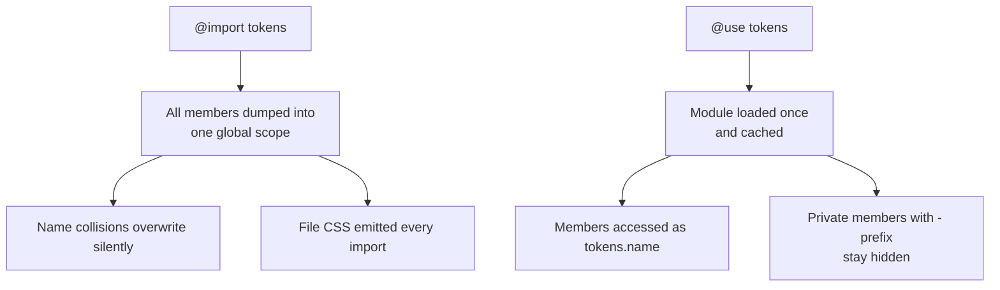
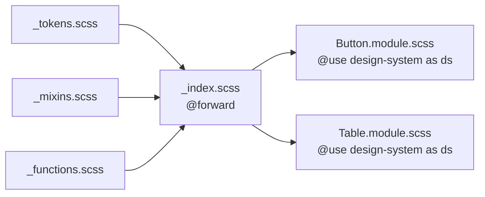
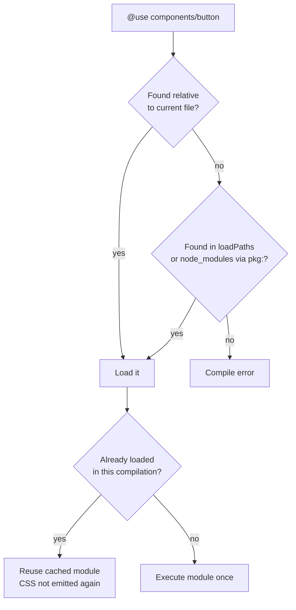
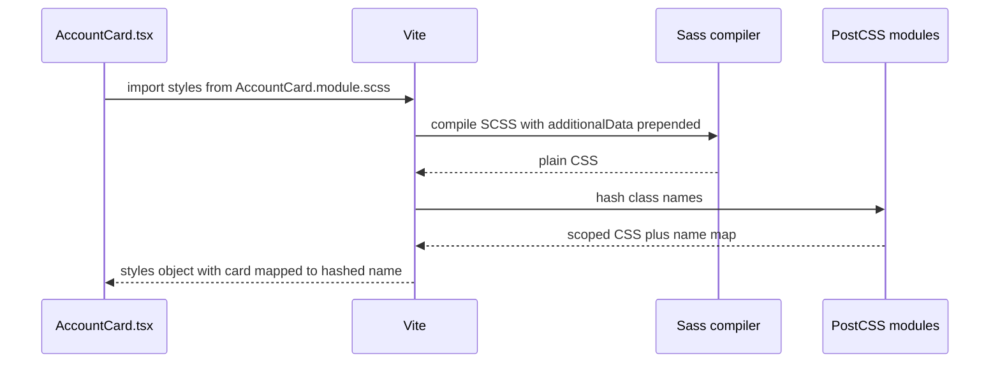

## 1. What it is

**Sass is a CSS preprocessor: you write SCSS (CSS plus variables, nesting, mixins, functions and modules), and a compiler turns it into normal CSS the browser understands.**

Think of SCSS as a recipe card with shortcuts like "use the house sauce". The browser is a cook who only reads fully written-out recipes. The Sass compiler expands every shortcut before the cook sees it. The browser never knows Sass existed.

The problem it solves: plain CSS used to have no variables, no way to reuse a block of declarations, no imports without extra HTTP requests, and lots of repeated selectors. Sass added all of these years before CSS did. Today CSS has custom properties and native nesting, so Sass's value has shifted toward its **module system, mixins, functions, maps and loops**: things CSS still cannot do at build time.

> **Why "SCSS" vs "Sass":** Sass has two syntaxes. The indented `.sass` syntax (no braces or semicolons) and the `.scss` syntax, which is a superset of CSS. Any valid CSS file is valid SCSS. Almost everyone uses `.scss`.

## 2. Core concepts

### [Beginner] Variables

Sass variables start with `$`. They exist only at compile time and are replaced by their values in the output.

```scss
// _tokens.scss
$color-gain: #15803d;
$color-loss: #b91c1c;
$space-2: 0.5rem;
$radius: 6px;

.change--up { color: $color-gain; }
.change--down { color: $color-loss; }
```

Compiled output:

```css
.change--up { color: #15803d; }
.change--down { color: #b91c1c; }
```

> **Why:** Sass variables vs CSS custom properties (`--brand: blue`). Sass variables disappear after compile, so they cannot change at runtime (no theme toggle). CSS variables live in the browser, cascade, and can be changed by JS or a `.dark` class. Modern practice: use Sass variables to **generate** CSS variables, and use CSS variables in components for anything themeable.

```scss
:root {
  --color-gain: #{$color-gain}; // #{} interpolation writes the Sass value into CSS
  --color-loss: #{$color-loss};
}
```

### [Beginner] Nesting and the parent selector `&`

```scss
.transaction-row {
  display: flex;
  padding: 0.5rem 1rem;

  // & = the parent selector
  &:hover { background: #f9fafb; }       // .transaction-row:hover
  &--pending { opacity: 0.6; }           // .transaction-row--pending (BEM modifier)
  &__amount {                            // .transaction-row__amount
    margin-left: auto;
    font-variant-numeric: tabular-nums;
  }

  .icon { width: 16px; }                 // .transaction-row .icon (descendant)

  @media (min-width: 768px) {            // media query nested in the rule
    padding: 0.75rem 1.5rem;
  }
}
```

> **Gotcha:** Deep nesting creates long, high-specificity selectors (`.page .table .row .cell span`) that are hard to override. Keep nesting to 2-3 levels. Nesting should mirror components, not the DOM tree.

### [Beginner] Partials

A file whose name starts with `_` is a **partial**. Sass will not compile it into its own CSS file. It only exists to be loaded by other files.

```text
src/styles/
  _tokens.scss      // variables
  _mixins.scss      // mixins
  _functions.scss   // functions
  main.scss         // entry: loads the partials
```

```scss
// main.scss
@use "tokens";   // loads _tokens.scss; underscore and extension are omitted
@use "mixins";
```

### [Intermediate] @use vs @import (and why @import is deprecated)

`@import` was Sass's original way to load files. It had serious design flaws:

- **Everything is global.** Every variable, mixin and function from every imported file lands in one global namespace. Two libraries defining `$primary` silently overwrite each other.
- **Duplicate output.** Importing the same file twice emits its CSS twice.
- **No privacy.** You cannot hide internal helpers.
- **Hard to trace.** Seeing `$space-4` in a file gives no hint where it came from.

`@use` (Dart Sass, 2019+) fixes all of these:

```scss
// _tokens.scss
$space-4: 1rem;
$-internal-scale: 1.25;   // leading - or _ makes it PRIVATE to this module

// card.scss
@use "tokens";            // namespace defaults to the file name

.card {
  padding: tokens.$space-4;          // explicit origin
  // tokens.$-internal-scale         -> error, private
}

@use "tokens" as t;       // custom namespace: t.$space-4
@use "tokens" as *;       // no namespace (use sparingly): $space-4
```



> **Outdated:** `@import` was officially deprecated in Dart Sass 1.80.0 (October 2024) and will be removed in Dart Sass 3.0. You now get deprecation warnings. Migrate with `npx sass-migrator module --migrate-deps src/main.scss`. Note: plain CSS `@import url(...)` is a different thing and is not deprecated.

Configuring a module with `with`:

```scss
// _theme.scss
$brand: #1d4ed8 !default;   // !default = "use this unless the loader configured it"
$radius: 4px !default;

// app.scss
@use "theme" with ($brand: #0b3d91, $radius: 8px);
```

### [Intermediate] @forward: building a public API

`@forward` re-exports another module's members, so consumers can load one entry file. It does not make the members available in the forwarding file itself (add a separate `@use` for that).

```scss
// design-system/_index.scss
@forward "tokens";
@forward "mixins" hide _internal-helper;  // hide specific members
@forward "functions" as fn-*;             // prefix: fn-rem() instead of rem()

// any component
@use "design-system" as ds;

.panel {
  padding: ds.$space-4;
  @include ds.card-shadow;
  width: ds.fn-rem(320px);
}
```



### [Intermediate] Mixins

A mixin is a reusable block of declarations, optionally with arguments. `@include` pastes it in.

```scss
// _mixins.scss
@use "sass:map";

$breakpoints: (sm: 640px, md: 768px, lg: 1024px);

@mixin up($bp) {
  @media (min-width: map.get($breakpoints, $bp)) {
    @content; // the block passed by the caller goes here
  }
}

@mixin truncate($lines: 1) {
  @if $lines == 1 {
    overflow: hidden;
    text-overflow: ellipsis;
    white-space: nowrap;
  } @else {
    display: -webkit-box;
    -webkit-line-clamp: $lines;
    -webkit-box-orient: vertical;
    overflow: hidden;
  }
}

@mixin focus-ring($color: #1d4ed8) {
  outline: 2px solid $color;
  outline-offset: 2px;
}
```

```scss
// Usage
@use "mixins" as m;

.merchant-name {
  @include m.truncate;
  @include m.up(md) { font-size: 1rem; }
}

.memo { @include m.truncate(2); }
button:focus-visible { @include m.focus-ring; }
```

### [Intermediate] Functions and built-in modules

Functions **return a value**. Mixins **emit declarations**. That is the key difference.

```scss
// _functions.scss
@use "sass:math";

$base-font: 16px;

@function rem($px) {
  @return math.div($px, $base-font) * 1rem; // math.div, not "/" (slash division is deprecated)
}

// usage
@use "functions" as f;
.balance { font-size: f.rem(28px); } // 1.75rem
```

Built-in modules you must `@use` explicitly: `sass:math`, `sass:map`, `sass:list`, `sass:string`, `sass:color`, `sass:meta`, `sass:selector`.

```scss
@use "sass:color";

$brand: #1d4ed8;
.btn:hover {
  background: color.adjust($brand, $lightness: -8%); // replaces old darken()
  border-color: color.scale($brand, $lightness: 20%);
}
```

> **Outdated:** Global functions like `darken()`, `lighten()`, `map-get()` and `/` for division are deprecated (most since Dart Sass 1.33 to 1.80). Use `color.adjust`, `map.get`, `math.div`. Older tutorials and Stack Overflow answers use the old forms everywhere.

### [Intermediate] Maps and @each

Maps are key-value pairs. Combined with `@each`, they generate families of classes from one source of truth.

```scss
@use "sass:map";

$status-colors: (
  pending: (bg: #fef3c7, fg: #92400e),
  posted:  (bg: #dcfce7, fg: #166534),
  failed:  (bg: #fee2e2, fg: #991b1b),
);

@each $name, $c in $status-colors {
  .badge--#{$name} {
    background: map.get($c, bg);
    color: map.get($c, fg);
  }
}

// Also: @for and @while
@for $i from 1 through 4 {
  .gap-#{$i} { gap: $i * 0.25rem; }
}
```

Output includes `.badge--pending`, `.badge--posted`, `.badge--failed`, and `.gap-1` ... `.gap-4`.

### [Advanced] Placeholder selectors and @extend

A placeholder (`%name`) is a selector that never outputs on its own. `@extend` makes other selectors share its rules by **grouping selectors**, not copying declarations.

```scss
%card-base {
  border-radius: 8px;
  background: #fff;
  box-shadow: 0 1px 2px rgb(0 0 0 / 0.08);
}

.account-card { @extend %card-base; padding: 1rem; }
.holding-card { @extend %card-base; padding: 0.75rem; }
```

```css
/* Output: selectors grouped */
.account-card, .holding-card {
  border-radius: 8px; background: #fff; box-shadow: 0 1px 2px rgb(0 0 0 / 0.08);
}
.account-card { padding: 1rem; }
.holding-card { padding: 0.75rem; }
```

| | `@mixin` / `@include` | `%placeholder` / `@extend` |
| --- | --- | --- |
| Output | Copies declarations into each rule | Groups selectors together |
| Arguments | Yes | No |
| Works across `@media` | Yes | No (cannot extend from outside a media query) |
| Predictability | High | Low, can reorder/explode selectors |

> **Gotcha:** `@extend` can produce surprising selector combinations and breaks inside media queries. Most style guides say: prefer mixins. Also, `@extend` does not work across CSS Modules files in a meaningful way, since each module compiles separately.

### [Advanced] Module scope and how the compiler resolves files



Resolution tries `button.scss`, `_button.scss`, then `button/_index.scss`. The `pkg:` URL scheme (Dart Sass 1.71+) loads from npm packages: `@use "pkg:@acme/design-tokens";`.

## 3. Why it's used in this project

- **Design tokens as maps.** Brand colors, spacing and status colors live in Sass maps and generate both utility classes and `:root` CSS variables, so the dark theme and the light theme stay in sync.
- **CSS Modules + SCSS** per component (`TransactionTable.module.scss`) gives scoped class names, so a `.row` in the transactions table cannot clash with a `.row` in the portfolio grid.
- **Shared mixins** for repeated finance patterns: `@include money` (tabular numbers, right aligned), `@include pii-mask` (blur and disable selection), `@include print-statement` (hide nav, force black text for printable statements).
- **Legacy and vendor styles.** Many enterprise component libraries and older internal design systems ship SCSS sources you configure with `@use ... with (...)`.

```scss
// _finance.scss
@mixin money {
  font-variant-numeric: tabular-nums;
  text-align: right;
  white-space: nowrap;
}

@mixin pii-mask {
  filter: blur(4px);
  user-select: none;
  &:hover, &:focus-visible { filter: none; } // reveal on deliberate interaction
}

@mixin print-statement {
  @media print {
    color: #000;
    background: none;
    box-shadow: none;
  }
}
```

> **Finance tip:** Masking with CSS blur is cosmetic only. The real value is still in the DOM and visible to screen readers and devtools. For real PII protection, mask on the server or in the data layer (`****1234`) and reveal only after an explicit, audited action.

## 4. Setup & configuration

### [Beginner] Install in a Vite project

Vite has built-in Sass support. You only install the compiler.

```bash
npm install -D sass-embedded   # recommended: native Dart Sass, faster
# or
npm install -D sass            # pure JS build of Dart Sass
```

> **Outdated:** `node-sass` (LibSass) is dead (deprecated 2020). Never install it. It lacks `@use`, modules and modern features.

### [Intermediate] vite.config.ts with every option commented

```ts
// vite.config.ts
import { defineConfig } from "vite";
import react from "@vitejs/plugin-react";

export default defineConfig({
  plugins: [react()],
  css: {
    modules: {
      // Class names in TS: styles.accountCard instead of styles["account-card"]
      localsConvention: "camelCaseOnly",
      // Readable names in dev, short hashes in prod
      generateScopedName:
        process.env.NODE_ENV === "production" ? "[hash:base64:6]" : "[name]__[local]__[hash:base64:4]",
    },
    preprocessorOptions: {
      scss: {
        // Prepended to every SCSS file. Only put members here (variables, mixins),
        // never CSS rules, or that CSS gets duplicated in every module.
        additionalData: `@use "@/styles/design-system" as ds;\n`,
        // Silence deprecation noise from third-party packages you cannot fix
        quietDeps: true,
        // Vite 5.4-6: choose the modern compiler API. Vite 7 uses modern only.
        // api: "modern-compiler",
        loadPaths: ["src/styles"],
      },
    },
    devSourcemap: true, // map compiled CSS back to .scss lines in devtools
  },
  resolve: {
    alias: { "@": "/src" },
  },
});
```

> **Outdated:** The Sass "legacy JS API" (`render`, `renderSync`, `includePaths`) is deprecated. Vite 6 defaults to the modern API and Vite 7 removed legacy support. If an old config uses `includePaths`, rename to `loadPaths`.

### [Intermediate] Typing CSS Modules in TypeScript

```ts
// src/vite-env.d.ts already includes this via "vite/client":
// declare module "*.module.scss" { const classes: { readonly [key: string]: string }; export default classes; }
/// <reference types="vite/client" />
```

For exact class-name types (catching typos), use a plugin such as `typescript-plugin-css-modules` in your editor, or generate `.d.ts` files with a tool like `typed-scss-modules`.

## 5. Key features we use

### [Beginner] CSS Modules with SCSS in a component

```scss
// AccountCard.module.scss
@use "@/styles/design-system" as ds;

.card {
  padding: ds.$space-4;
  border-radius: ds.$radius;
  background: var(--surface);

  &.selected { outline: 2px solid var(--brand); }
}

.balance {
  @include ds.money;
  font-size: ds.rem(28px);
}

.label { color: var(--text-muted); }
```

```tsx
// AccountCard.tsx
import styles from "./AccountCard.module.scss";
import clsx from "clsx";

type Props = { name: string; balanceCents: number; currency: string; selected?: boolean };

export function AccountCard({ name, balanceCents, currency, selected }: Props) {
  return (
    <article className={clsx(styles.card, selected && styles.selected)}>
      <p className={styles.label}>{name}</p>
      <p className={styles.balance}>
        {new Intl.NumberFormat("en-US", { style: "currency", currency }).format(balanceCents / 100)}
      </p>
    </article>
  );
}
```

Each class compiles to a unique name like `AccountCard_card__x7Fq`, so it cannot collide with another file's `.card`.



### [Intermediate] Global vs local in CSS Modules

```scss
// Target a third-party class from inside a module
.chartWrapper {
  :global(.recharts-tooltip-wrapper) { z-index: 10; }
}

// Compose classes from another module (CSS Modules feature)
.dangerButton {
  composes: button from "./Button.module.scss";
  background: var(--color-loss);
}
```

### [Intermediate] Generating CSS variables from a Sass map

```scss
@use "sass:map";

$themes: (
  light: (surface: #ffffff, text: #111827, brand: #1d4ed8),
  dark:  (surface: #111827, text: #f9fafb, brand: #60a5fa),
);

:root { @each $k, $v in map.get($themes, light) { --#{$k}: #{$v}; } }
.dark { @each $k, $v in map.get($themes, dark)  { --#{$k}: #{$v}; } }
```

## 6. Interview questions

#### Q: Why was @import deprecated, and what replaces it?

`@import` put every member from every loaded file into one global namespace, so names collided silently. It re-emitted CSS each time a file was imported, had no private members, and made it hard to tell where a variable came from. It was deprecated in Dart Sass 1.80 and is scheduled for removal in 3.0. The replacement is `@use`, which loads each module once, namespaces members (`tokens.$space-4`), supports private members (`$-name`), and supports configuration with `with (...)`. `@forward` re-exports modules to build a single public entry point.

#### Q: What is the difference between a mixin, a function and @extend?

- A **mixin** (`@mixin` / `@include`) outputs a block of declarations and can accept arguments and a `@content` block.
- A **function** (`@function` / `@return`) computes and returns a value, like `rem(24px)`.
- **`@extend`** with a placeholder groups selectors to share one rule, producing less CSS but less predictable selectors. It cannot cross media queries. Prefer mixins in most cases.

#### Q: Sass variables or CSS custom properties: when do you use each?

Sass variables are compile-time constants. They vanish from output and cannot change at runtime. Use them for build-time logic: loops, maps, math, breakpoints in media queries (CSS variables do not work inside media query conditions). CSS custom properties are runtime values that cascade and can be changed by JS or a parent class, so use them for theming (dark mode, white-label brand colors). A common pattern is to define tokens in Sass maps and emit them as CSS variables.

#### Q: How do CSS Modules work with SCSS in Vite?

Any file named `*.module.scss` is compiled by Sass to CSS, then processed by PostCSS's CSS Modules transform, which rewrites each class into a unique hashed name and returns a JS object mapping the original names to hashed ones. You import that object (`styles.card`). This scopes class names to the file, preventing collisions. Use `:global(...)` to target unscoped classes, `composes` to reuse classes, and `css.modules.localsConvention` to get camelCase keys.

#### Q: What does `!default` do, and why do libraries use it?

`$brand: blue !default;` assigns the value only if the variable is not already set. With `@use "lib" with ($brand: red)`, the consumer's value wins. That lets libraries ship sensible defaults while allowing configuration, without consumers editing library files.

## 7. Drawbacks & pain points

- **A build step** and a compiler dependency for something browsers now partly do natively (variables, nesting).
- **Over-nesting** produces high-specificity selectors that are hard to override.
- **Migration pain**: old codebases are full of `@import`, `darken()`, `/` division, and `node-sass` configs.
- **Global stylesheets grow forever** unless paired with CSS Modules; nobody knows what is safe to delete.
- **`additionalData` misuse** duplicates CSS in every module if you prepend files that output rules.
- **Two languages** for styling (Sass logic and CSS runtime) confuse beginners.

Gotchas that trip devs up:

```scss
// 1. Slash division is deprecated
$half: $width / 2;            // warning
$half: math.div($width, 2);   // correct, requires @use "sass:math"

// 2. @use must come first (only @forward and variable declarations can precede it)
.a { color: red; }
@use "tokens";                // error

// 3. CSS variables need interpolation for Sass values
:root { --gap: $space-4; }    // outputs literally "$space-4"
:root { --gap: #{$space-4}; } // correct

// 4. Sass variables in media queries work; CSS variables do not
@media (min-width: var(--md)) {}  // never matches
@media (min-width: $md) {}        // fine

// 5. Members from @use "tokens" are NOT visible in files that @use your file.
//    Use @forward to re-export.
```

## 8. Better alternatives

The industry trend is **less preprocessor, more native CSS** plus utility frameworks:

- **Native CSS** now has custom properties, nesting (supported in all major browsers since 2023), `@layer`, `color-mix()`, container queries and `:has()`. For many apps this removes the main reasons for Sass.
- **Tailwind CSS** dominates new React projects.
- **PostCSS / Lightning CSS** handle nesting and vendor prefixes for older browsers without a new language.
- **Zero-runtime CSS-in-TS** (Vanilla Extract, Panda CSS, StyleX) give type-safe tokens.

Sass remains a solid choice for existing design systems and teams that like writing real CSS with powerful build-time logic.

| Option | Runtime cost | Boilerplate | Devtools | Learning curve | TS support | Popularity | When it wins |
| --- | --- | --- | --- | --- | --- | --- | --- |
| SCSS + CSS Modules | None, CSS grows with app | File per component | Source maps | Low-medium | Via plugins | High, stable | Existing design systems, CSS-loving teams |
| Native CSS + CSS Modules | None | File per component | Native | Low | Via plugins | Growing | Modern browsers, minimal tooling |
| Tailwind CSS | None, ~10-30 kB CSS | Low | IntelliSense | Medium | Good | Very high | New React apps, fast iteration |
| Vanilla Extract | None | Medium | Good | Medium | Excellent | Medium | Type-safe themes |
| styled-components | ~12-16 kB JS runtime | Medium | Good | Low | Good | Declining | Legacy apps |

## 9. When NOT to use it

- New projects already using Tailwind: adding Sass mostly duplicates features.
- When native CSS (variables, nesting, `@layer`) covers everything you need.
- Runtime theming needs (user-chosen colors): Sass variables cannot change at runtime; use CSS variables.
- Teams that will write Sass like 2015 (`@import`, deep nesting, giant global files): it creates long-term debt.
- Very small apps where an extra compiler dependency is not worth it.

## Cheatsheet

| Feature | Syntax |
| --- | --- |
| Variable | `$space-4: 1rem;` `$brand: blue !default;` |
| Interpolation | `.badge--#{$name}` `--gap: #{$space-4};` |
| Nesting / parent | `&:hover` `&--modifier` `&__element` |
| Load module | `@use "tokens";` `@use "tokens" as t;` `@use "theme" with ($brand: red);` |
| Re-export | `@forward "tokens";` `hide x` `show y` `as prefix-*` |
| Private member | `$-internal`, `@mixin -helper` |
| Mixin | `@mixin up($bp) { @media (...) { @content; } }` / `@include up(md) { ... }` |
| Function | `@function rem($px) { @return math.div($px, 16px) * 1rem; }` |
| Map | `map.get($m, key)` `map.merge($a, $b)` `map.has-key($m, k)` |
| Loops | `@each $k, $v in $map {}` `@for $i from 1 through 4 {}` |
| Conditionals | `@if $x == 1 {} @else if {} @else {}` |
| Placeholder | `%base { }` / `@extend %base;` |
| CSS Modules | `X.module.scss`, `:global(.cls)`, `composes: a from "./b.module.scss";` |
| Built-ins | `sass:math` `sass:map` `sass:color` `sass:list` `sass:string` `sass:meta` |

```scss
@use "sass:map";
@use "sass:math";
@use "@/styles/design-system" as ds;

.row {
  padding: ds.$space-2 ds.$space-4;
  &:hover { background: var(--surface-hover); }
  &__amount { @include ds.money; font-size: math.div(14px, 16px) * 1rem; }
  @include ds.up(md) { padding: ds.$space-4; }
}
```
