## 1. Shaping the system: from monolith to services

### Layered (n-tier) architecture

**What it is:** Code organised in horizontal layers, each talking only to the one below: presentation (controllers, UI), business logic (services), data access (repositories), database. "N-tier" is the same idea where layers also run on separate machines (browser, app server, database server).

**Why it's used:** It is the most familiar structure and gives a clear place for each kind of code. A new developer knows that SQL lives in repositories and HTTP handling lives in controllers.

**How it works:**

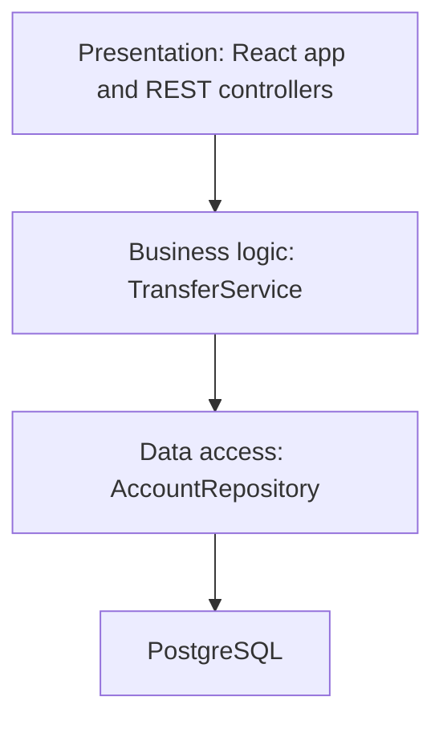

**Pros:**
- Simple, widely understood, easy to start with.
- Separates HTTP and SQL concerns from business rules.

**Cons / limits:**
- Organised by technical role, not by business area, so one feature touches every layer.
- Business logic tends to depend on the database layer, which makes it hard to test without a database.
- In big codebases each layer becomes a huge folder with everything coupled to everything.

**Use it when / avoid when:**
- Use it for small to medium apps and as the inner structure of each module.
- Avoid using it as the only organising principle of a large system; group by business domain first.

### Monolith

**What it is:** The whole application is one deployable unit: one codebase, one build, one process (run as many identical copies behind a load balancer), usually one database.

**Why it's used:** It is the fastest way to build and change a product when the team is small. A function call between "accounts" and "payments" is a function call, not a network request. One transaction can update both.

**How it works:** One repo, one CI pipeline, one artifact (a container image), deployed to N instances. Scaling is horizontal: more copies.

**Pros:**
- Simple to develop, test, debug and deploy. Easy refactoring across the whole codebase.
- ACID transactions across features. No network failures between parts.
- Lowest operational cost.

**Cons / limits:**
- As it grows, without discipline it becomes a "big ball of mud": everything depends on everything.
- One deploy contains everyone's changes, so many teams block each other.
- One bug (a memory leak in reporting) can take down everything. You scale everything together even if only one part is hot.

**Use it when / avoid when:**
- Use it for new products, small teams, and when the domain is still being discovered.
- Reconsider when many teams (roughly 5 or more) collide in one deployable, or parts have very different scaling or reliability needs.

> **Interview tip:** "Monolith" is not a dirty word. Many successful companies run large, well-structured monoliths. The problem is a monolith without internal boundaries.

### Modular monolith

**What it is:** A monolith deliberately split into modules along business boundaries (accounts, payments, cards, statements), each with its own internal code, a public interface, and ideally its own database schema. It still deploys as one unit.

**Why it's used:** You get most of the organisational benefits of microservices (clear ownership, enforced boundaries) without the network, deployment and data-consistency costs. If a module later needs to become a service, the seam already exists.

**How it works:**
- Each module exposes a small public API (a TypeScript interface or a set of exported functions) and hides everything else.
- Modules do not read each other's tables. They call each other's public API or react to in-process events.
- Boundaries are enforced by tooling: package boundaries in a monorepo, lint rules (`eslint-plugin-boundaries`, Nx module boundary rules), or architecture tests.

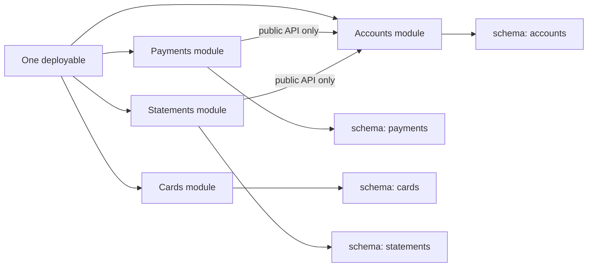

```ts
// payments/index.ts is the only file other modules may import from the payments module
export interface PaymentsApi {
  createPayment(input: CreatePaymentInput, idempotencyKey: string): Promise<Payment>;
  getPayment(id: string): Promise<Payment | null>;
}
export { paymentsApi } from './internal/payments-api'; // implementation stays internal
```

**Pros:**
- Clear boundaries and ownership, simple operations, transactions still possible when really needed.
- Cheap path to extract a service later.

**Cons / limits:**
- Boundaries erode unless tooling enforces them.
- Still one deploy and one runtime, so failure isolation and independent scaling are limited.

**Use it when / avoid when:**
- Default choice for most teams of 5 to 50 engineers.
- Move to services only for modules with a concrete reason (different scaling, team autonomy, compliance isolation).

### Microservices (and their costs)

**What it is:** The system is split into small, independently deployable services, each owning one business capability and its own data, communicating over the network (HTTP/gRPC or messages).

**Why it's used:** To let many teams ship independently, scale parts separately, use different technologies where justified, and contain failures. Large organisations use it mainly to reduce coordination between teams.

**How it works:**
- One service per bounded context (payments, accounts, cards), owned by one team.
- **Database per service:** no other service reads its tables. Data needed elsewhere is shared through APIs or events.
- Independent CI/CD pipelines and deploys.

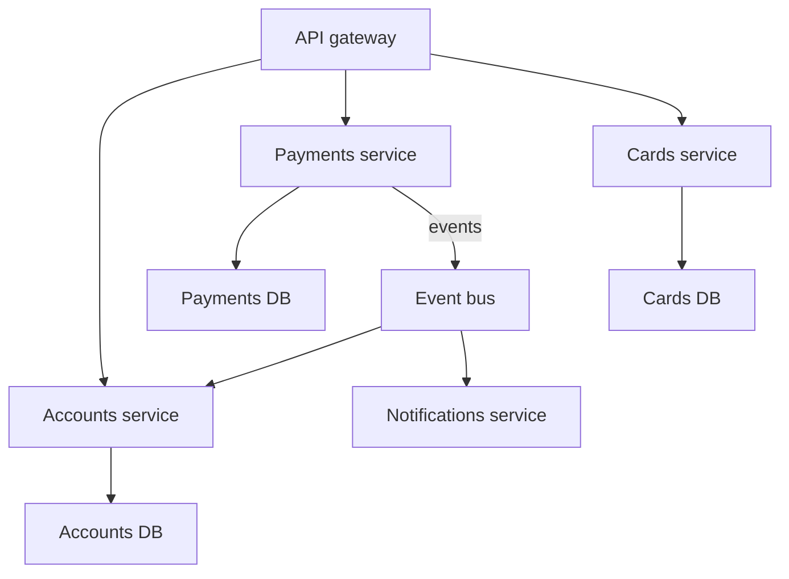

The costs, which interviewers expect you to name:
- **Network:** calls fail, time out and add latency. You need retries, timeouts, circuit breakers.
- **Data consistency:** no cross-service ACID transaction. You need sagas, outboxes, idempotency, and you live with eventual consistency.
- **Operations:** many pipelines, deployments, dashboards, on-call rotations. Platform engineering becomes necessary.
- **Observability:** one user action spans many services; you need distributed tracing (OpenTelemetry) and correlated logs.
- **Testing:** end-to-end tests are slow and flaky; contract tests (for example Pact) become important.
- **Versioning:** APIs and event schemas must evolve without breaking consumers.
- **Cost:** more infrastructure, more idle capacity.

**Pros:**
- Team autonomy, independent deploys and scaling, failure isolation, technology flexibility.

**Cons / limits:**
- All the costs above. A "distributed monolith" (services that must deploy together and call each other synchronously in long chains) has the costs of both styles and the benefits of neither.

**Use it when / avoid when:**
- Use it when the organisation has many teams, the domain boundaries are well understood, and you have platform maturity (CI/CD, observability, containers).
- Avoid it for small teams, new products, or when the main goal is "to be modern".

### Serverless

**What it is:** You write functions or small services and the cloud provider runs them on demand, scaling automatically and charging per use (AWS Lambda, Azure Functions, Google Cloud Run functions). The term also covers managed services you do not provision servers for (DynamoDB, SQS, S3, Step Functions).

**Why it's used:** No servers to patch or size, scale to zero when idle, and scale up quickly for spikes. Great for event-driven glue: "when a file lands in S3, generate a thumbnail".

**How it works:** An event (HTTP request via API Gateway, an SQS message, an S3 upload, a schedule) triggers a function. The provider starts an execution environment (a "cold start" if none is warm), runs your handler, and may reuse it for later events.

```ts
// AWS Lambda handler for an SQS batch (TypeScript, aws-lambda types)
import type { SQSHandler } from 'aws-lambda';

export const handler: SQSHandler = async (event) => {
  for (const record of event.Records) {
    const msg = JSON.parse(record.body) as { statementId: string };
    await generateStatementPdf(msg.statementId); // must be idempotent
  }
};
```

**Pros:**
- No server management, pay per use, automatic scaling, quick to build event-driven flows.

**Cons / limits:**
- Cold starts add latency (often tens to hundreds of ms, more for large runtimes; mitigations include provisioned concurrency and Lambda SnapStart for some runtimes).
- Execution time limits (Lambda: 15 minutes), memory and payload limits.
- Database connection storms when thousands of functions start (use RDS Proxy or HTTP-based data APIs).
- Harder local testing and debugging; vendor lock-in; cost can exceed containers at high constant load.

**Use it when / avoid when:**
- Use it for spiky or low-volume workloads, event processing, scheduled jobs, webhooks, and glue between managed services.
- Avoid it for steady high-throughput APIs with tight latency budgets, long-running jobs, or heavy stateful connections (use containers).

#### Q: [Senior] We are a 6-person team building a new wealth management app. The CTO wants microservices from day one "so we can scale". What do you recommend?

**Short answer:** A modular monolith. Six engineers cannot run a dozen services, pipelines and on-call rotations well, and the domain boundaries are still unknown, so we would probably draw them wrong. A modular monolith with enforced boundaries gives clean ownership and an easy path to extract services later, when a concrete reason appears.

**Clarify first:**
- What does "scale" mean here: users, traffic, or number of engineers? What is the 12-month forecast?
- Are there hard isolation needs (PCI card data, a regulated trading engine) that justify a separate service now?
- What platform do we have: managed containers, CI/CD, observability?

**Solution:**
- One deployable on managed containers (ECS Fargate, Cloud Run or similar), behind a load balancer, autoscaled horizontally. That already handles large traffic for this kind of app.
- Modules: `clients`, `portfolios`, `orders`, `reporting`, `documents`. Each with its own schema in one PostgreSQL cluster, public interfaces only, lint-enforced.
- Async work through a queue (reports, statement generation), which can later become a separate worker deployment with no code change.
- Exception: if card data appears, isolate it in a separate small service to shrink PCI scope.
- Write down the triggers for extracting a service: a module needs a different scaling profile, a separate team owns it, or its deploy cadence conflicts with the rest.

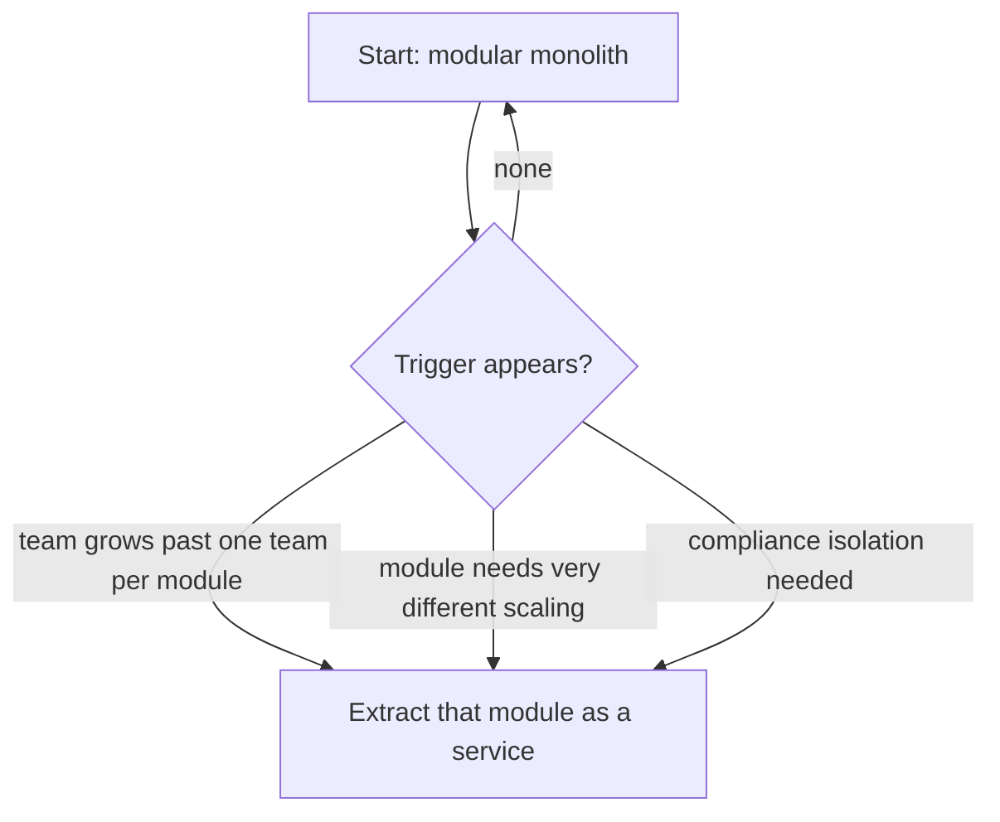

**Trade-offs:** We give up independent deploys and per-module scaling for now. We gain speed, simpler debugging, and transactions where we need them. Extraction later costs some work, but much less than running microservices prematurely.

**What interviewers listen for:**
- Tying the choice to team size, domain maturity and operational capacity.
- Naming the real costs of microservices.
- Giving explicit criteria for when to split.
- Red flag: "microservices are best practice" or "monoliths don't scale".

#### Q: [Mid] What is the difference between a modular monolith and a distributed monolith?

**Short answer:** A modular monolith is one deployable with strong internal boundaries, which is good. A distributed monolith is many deployables that are still tightly coupled: they share a database, must be deployed together, or call each other synchronously in long chains. It has all the costs of microservices and none of the independence.

**Solution:** Signs you have a distributed monolith:
- A feature change requires coordinated releases of three services.
- Services read each other's tables.
- One user request triggers a synchronous chain A to B to C to D; if D is slow, everything is slow.
- Shared "common" libraries with business logic force everyone to upgrade together.

Fixes: merge services that always change together, give each service its own data, replace synchronous chains with events or local copies of the data, and keep shared libraries to technical concerns only.

**Trade-offs:** Merging services feels like going backwards politically, but it is often the cheapest fix.

**What interviewers listen for:**
- Coupling, not deployment count, is what matters.
- Red flag: thinking the number of services measures architecture quality.

#### Q: [Senior] Should our payment provider webhook handler run on Lambda or in our existing container service?

**Short answer:** Lambda behind API Gateway (or a Lambda function URL) is a good fit for the receiving side: webhooks are spiky, simple and must be always available. Keep the handler tiny: verify the signature, store the raw event idempotently or put it on a queue, return 200 fast. The business processing happens asynchronously in a worker, which can be either Lambda or containers.

**Clarify first:**
- Volume and spikiness: a handful per minute, or thousands during batch settlement?
- Does the provider retry on non-2xx, and how quickly does it give up?
- Do we need fixed outbound IPs or VPC access to our database?

**Solution:**

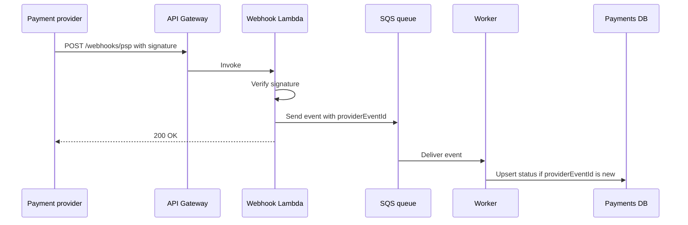

- Idempotency on the provider's event id, because providers retry and may send duplicates.
- Raw event stored for audit and replay.
- DLQ for events that keep failing.

**Trade-offs:** Lambda adds a second deployment model to the team. If the existing container service is already highly available and autoscaled, a lightweight endpoint there with the same "verify, enqueue, return" design is equally valid. The design matters more than the runtime.

**What interviewers listen for:**
- Fast acknowledgement, async processing, idempotency, signature verification.
- Red flag: doing all the business logic synchronously inside the webhook call.

## 2. Structuring code and the edges of the system

### Hexagonal architecture (ports and adapters) and clean architecture

**What it is:** A way to structure code so business logic sits at the centre and knows nothing about frameworks, databases or HTTP. The centre defines "ports" (interfaces it needs, such as `PaymentGateway` or `AccountRepository`). "Adapters" implement those ports for real technologies (Stripe, PostgreSQL, an HTTP controller). Clean architecture and onion architecture are close relatives with the same core rule: dependencies point inward.

**Why it's used:** Business rules (a transfer may not exceed the daily limit) are the most valuable and long-lived code. Keeping them free of framework details makes them easy to test with fakes, and lets you swap a payment provider or database without rewriting the rules.

**How it works:**

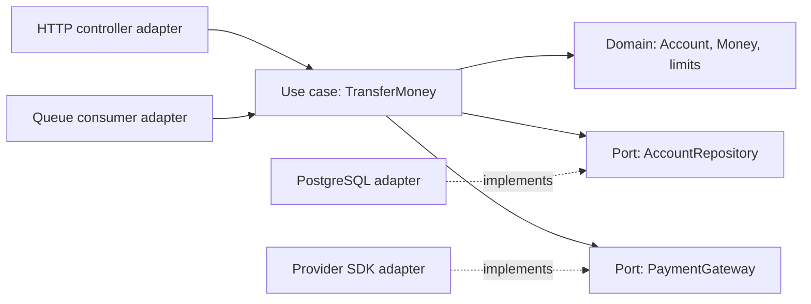

```ts
// Port, owned by the core
export interface AccountRepository {
  get(id: string): Promise<Account>;
  save(account: Account): Promise<void>;
}

// Use case depends only on ports
export class TransferMoney {
  constructor(private accounts: AccountRepository, private clock: () => Date) {}

  async execute(fromId: string, toId: string, amountCents: number): Promise<void> {
    const from = await this.accounts.get(fromId);
    const to = await this.accounts.get(toId);
    from.withdraw(amountCents, this.clock()); // throws if limit exceeded
    to.deposit(amountCents);
    await this.accounts.save(from);
    await this.accounts.save(to);
  }
}

// In tests: new TransferMoney(new InMemoryAccountRepository(), () => fixedDate)
```

**Pros:**
- Testable core, technology changes stay at the edges, clear dependency direction.

**Cons / limits:**
- More files and interfaces. Over-applied to a CRUD app, it is ceremony with no benefit.
- Transactions spanning several repositories need a unit-of-work concept.

**Use it when / avoid when:**
- Use it for domains with real rules (payments, lending, pricing).
- Avoid full ceremony for thin CRUD endpoints; a simple layered structure is fine there.

> **Interview tip:** The frontend version of this idea is keeping business logic in plain TypeScript functions and hooks that do not import `fetch` or UI libraries directly, so you can unit test it without rendering.

### Backend for Frontend (BFF)

**What it is:** A dedicated backend layer per client type (web, iOS, Android, partner) that shapes data exactly for that client. Usually owned by the team that owns the frontend.

**Why it's used:** A dashboard page might need data from accounts, cards, rewards and notifications. Without a BFF, the browser makes six calls, over-fetches fields, and holds orchestration logic. The mobile app needs different data again. A BFF aggregates and tailors responses, and can keep tokens server-side.

**How it works:**

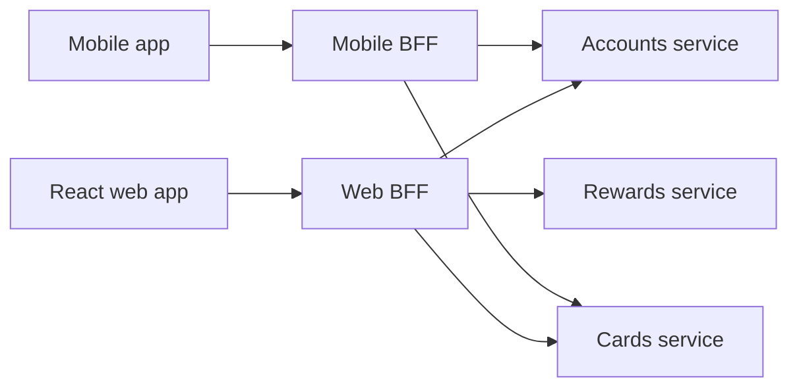

```ts
// Web BFF endpoint: one call for the dashboard
app.get('/bff/dashboard', async (req, res) => {
  const userId = req.user.id;
  const [accounts, cards, rewards] = await Promise.allSettled([
    accountsClient.list(userId),
    cardsClient.list(userId),
    rewardsClient.summary(userId),
  ]);
  res.json({
    accounts: accounts.status === 'fulfilled' ? accounts.value : [],
    cards: cards.status === 'fulfilled' ? cards.value : [],
    rewards: rewards.status === 'fulfilled' ? rewards.value : null, // partial data, not total failure
    degraded: [accounts, cards, rewards].some((r) => r.status === 'rejected'),
  });
});
```

A BFF is also the backbone of the "token handler" pattern: the BFF holds OAuth tokens and the browser gets only an `HttpOnly` session cookie, which reduces token theft risk from XSS.

**Pros:**
- Fewer round trips, payloads fit the screen, frontend teams move independently, better security for tokens.

**Cons / limits:**
- One more service per client to run. Logic can get duplicated across BFFs.
- Risk of business logic creeping into the BFF; keep it to aggregation and shaping.

**Use it when / avoid when:**
- Use it when clients have different needs, when pages aggregate many services, or when you want server-side token handling.
- Avoid it with a single client and a single backend; it is just an extra hop. GraphQL is an alternative for flexible aggregation.

### API gateway pattern

**What it is:** A single entry point in front of all services that handles cross-cutting concerns: routing, authentication, rate limiting, TLS, request logging, sometimes response caching and protocol translation.

**Why it's used:** Clients should not know the internal service layout, and every service should not reimplement JWT validation and throttling.

**How it works:** Clients call `api.bank.com`. The gateway validates the token, applies limits, and routes `/payments/*` to the payments service. Products include AWS API Gateway, Kong, Apigee, Azure API Management, Envoy-based gateways.

| | API gateway | BFF |
|---|---|---|
| Serves | All clients | One client type |
| Responsibility | Cross-cutting: auth, routing, limits | Client-specific aggregation and shaping |
| Owned by | Platform team | Frontend or product team |
| Business logic | None | Light orchestration only |

Many systems use both: client, then gateway, then BFF, then services.

**Pros:**
- One place for security policy and traffic control; hides internal changes.

**Cons / limits:**
- A central component that must be highly available and fast. Can become a bottleneck for change if every route change needs a ticket to one team.

**Use it when / avoid when:**
- Use it once you have several services or external API consumers.
- Avoid stuffing business rules or heavy transformations into it.

### Micro-frontends

**What it is:** Splitting a large frontend into pieces owned and deployed independently by different teams, composed into one experience. For example, the "payments" team ships the payments area and the "cards" team ships the cards area of the same banking web app.

**Why it's used:** The same reason as microservices: organisational scaling. When eight teams work in one React app, releases and dependency upgrades become a coordination problem.

**How it works:** Composition options:
- **Route-level split:** each team owns whole routes; a shell app (or even separate apps behind one domain) loads them. Simplest and most common.
- **Runtime composition:** Module Federation (webpack 5, Rspack, and Vite via plugins) loads remotely deployed bundles into a host at runtime and can share React as a singleton.
- **Build-time composition:** packages published to a registry and built into the shell. Simple but loses independent deployment.
- **Web Components or iframes:** strong isolation, at a UX and performance cost.

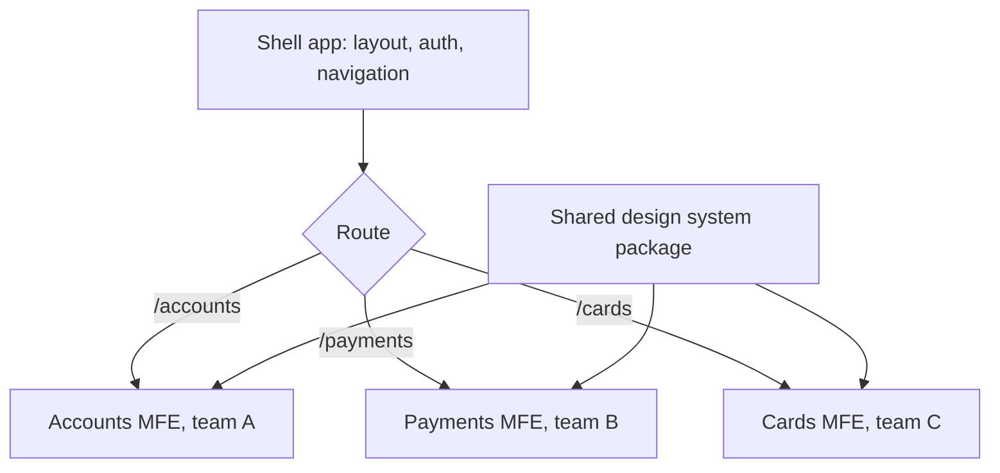

**Pros:**
- Independent deploys and ownership, incremental migration (old Angular area beside new React areas).

**Cons / limits:**
- Bigger bundles if dependencies are duplicated; version skew of shared libraries (two copies of React break hooks).
- Inconsistent UX without a strong design system. Harder cross-app state, routing and testing.
- Operational complexity: many pipelines and runtime integration failures.

**Use it when / avoid when:**
- Use it when several teams truly own separate areas and the monorepo plus a shared release has become the bottleneck, or to migrate a legacy frontend gradually.
- Avoid it for one or two teams; a well-structured monorepo with module boundaries is cheaper.

#### Q: [Senior] Our React dashboard makes 9 API calls on load to different microservices, and the mobile app needs a different subset of the same data. Load time on 4G is 4 seconds. What would you change?

**Short answer:** Add a BFF per client (or at least for web) that aggregates those calls server-side, where latency between services is a millisecond instead of 100 ms over 4G, and returns exactly the fields the screen needs. Return partial data when a non-critical service fails. Then fine-tune: parallel calls in the BFF, caching of slow-changing parts, and streaming the less important sections later.

**Clarify first:**
- Are the 9 calls sequential (waterfall) or parallel? Which ones block the first meaningful paint?
- Payload sizes: are we downloading 500 KB of fields we never show?
- Who would own a BFF: the frontend team, or nobody?

**Diagnose:** Chrome DevTools Network tab with 4G throttling: look at the waterfall, request count, payload sizes and time to first byte per call. Distributed tracing on the backend to see each service's latency.

**Solution:**
1. Quick win in the client: fire independent calls in parallel, and prefetch during route transition.
2. Web BFF `GET /bff/dashboard` with `Promise.allSettled`, field trimming, and timeouts per downstream call (for example 800 ms for rewards, then return without it).
3. Mobile BFF with its own shape, owned by the mobile team.
4. Cache non-personal or slow-changing parts (product offers) in the BFF.
5. Consider GraphQL as the BFF if many screens need flexible combinations.

**Trade-offs:** A BFF is another service to deploy and monitor, and may duplicate some logic between web and mobile BFFs. It concentrates latency risk: the BFF's response is as slow as the slowest required downstream, so timeouts and partial responses are essential.

**What interviewers listen for:**
- Measuring first (waterfall, payload).
- Network latency reasoning: aggregation is cheap inside the data centre.
- Partial failure handling.
- Red flag: "just add a loading spinner".

#### Q: [Staff] Four product teams share one large React banking app and releases are blocked weekly by each other's bugs. Leadership asks whether to adopt micro-frontends. How do you decide?

**Short answer:** First check whether the problem is architecture or process. Many release blockers are fixed by a monorepo with enforced module boundaries, independent feature flags, trunk-based development and better test isolation. If teams still need independent release cadences and own clearly separate areas, I would adopt route-level micro-frontends with a shared shell and design system, and avoid fine-grained runtime composition unless we need it.

**Clarify first:**
- What exactly blocks releases: failing shared tests, a single release train, manual QA, or tangled code?
- Do teams own distinct routes, or do they all contribute widgets to the same pages?
- Is there a design system and a platform team to own the shell?

**Diagnose:** Look at the last 10 blocked releases and classify causes. Analyse import graphs between feature folders (for example with `madge` or Nx graph) to see how coupled the areas are.

**Solution:**
- Step 1 (cheap): feature flags to decouple deploy from release, ownership via `CODEOWNERS`, module boundary lint rules, per-area test suites that only run when the area changes (affected builds).
- Step 2 (if still needed): route-level micro-frontends. A shell owns layout, auth (Okta session), navigation and error boundaries. Each team deploys its area independently. Shared React and design system as singletons via Module Federation, or separate apps behind one domain with a shared header package.
- Contracts: a small typed shell API (`getAccessToken`, `navigate`, `track`), versioned. No shared global store between MFEs; communicate via URL and a few events.
- Guardrails: bundle budgets per MFE, end-to-end smoke tests on the composed app, one design system version policy.

**Trade-offs:** Micro-frontends trade release independence for runtime complexity, bigger bundles and UX consistency risk. Getting it wrong yields a slower app that is harder to debug.

**What interviewers listen for:**
- Diagnosing the real cause before choosing architecture.
- A staged plan with cheap steps first.
- Concrete guardrails (shared deps, contracts, performance budgets).
- Red flag: proposing MFEs for a two-team app, or iframe-based composition for a dense dashboard without discussing UX cost.

#### Q: [Mid] When is hexagonal (ports and adapters) architecture worth the extra interfaces?

**Short answer:** When the business rules are complex and valuable enough that you want to test them without databases and frameworks, or when you expect to change external dependencies (payment provider, data store). For simple CRUD endpoints that just map HTTP to SQL, the extra layers add ceremony without benefit.

**Solution:**
- Worth it: loan eligibility, fee calculation, transfer limits, trading rules, anything with many edge cases and audit needs.
- Not worth it: an admin endpoint to edit a list of branch addresses.
- A mixed approach is common: hexagonal for the core domain modules, simple layered code for supporting modules.

**Trade-offs:** More abstraction to learn and navigate; a small risk of "interface for everything" with only one implementation ever. The test speed and isolation usually pay this back in rule-heavy domains.

**What interviewers listen for:**
- Applying the pattern selectively by domain complexity.
- Red flag: describing it only as "folders named domain and infrastructure".

## 3. Events, commands and data models

### Event-driven architecture: choreography vs orchestration

**What it is:** Services communicate by publishing events ("something happened": `PaymentCompleted`) rather than only calling each other directly. Other services react to events they care about. There are two ways to coordinate a multi-step business process:
- **Choreography:** no central controller. Each service listens for events and emits its own. Like dancers who each know their part and react to the music.
- **Orchestration:** a central orchestrator tells each service what to do next and tracks the state. Like a conductor.

**Why it's used:** Events reduce coupling: the payments service does not need to know that rewards, notifications and analytics exist. They also absorb load spikes and keep working when a consumer is temporarily down.

**How it works:**

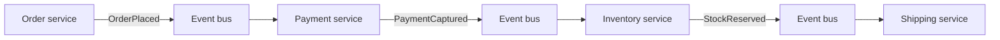

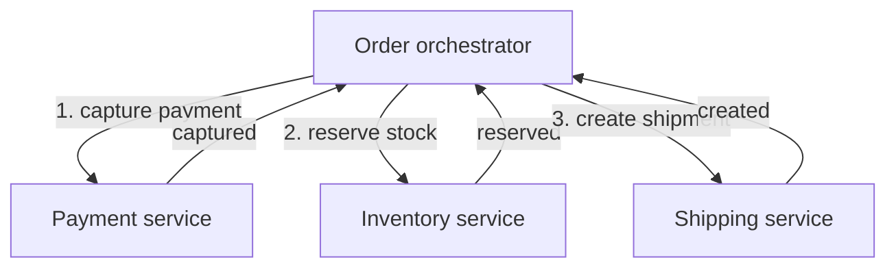

| | Choreography | Orchestration |
|---|---|---|
| Control | Distributed in each service | Central workflow |
| Coupling | Low between services, but implicit flow | Services coupled to the orchestrator's commands |
| Visibility | Hard to see the whole process | Process state in one place |
| Changing the flow | Touch several services | Change one workflow definition |
| Failure handling | Each service must handle compensation events | Orchestrator runs compensations |
| Good for | Simple flows, broadcasting facts to many consumers | Long, multi-step business processes with rules and timeouts |
| Tools | Kafka, SNS/SQS, EventBridge | AWS Step Functions, Temporal, Camunda, a custom state machine |

Event design basics: events are past-tense facts, immutable, versioned, and carry an id and timestamp. Decide between "thin" events (only ids, consumers call back for details) and "fat" events (carry the data consumers need, so no callback).

**Pros:**
- Loose coupling, extensibility, resilience to temporary outages, natural audit trail.

**Cons / limits:**
- Eventual consistency: the UI must handle "processing".
- Harder debugging and tracing; duplicate and out-of-order events must be handled.
- Choreography can turn into an invisible "event spaghetti" that nobody fully understands.

**Use it when / avoid when:**
- Use events to broadcast facts to many consumers and for asynchronous workflows.
- Use orchestration for core business processes with several steps and compensation.
- Avoid events when the caller needs an immediate answer (checking a balance before showing it).

### CQRS (Command Query Responsibility Segregation)

**What it is:** Using separate models for writing data (commands) and reading data (queries). Writes go to a model designed for correctness and rules; reads come from one or more models designed for fast queries.

**Why it's used:** The shape that is good for enforcing rules (normalised tables, an `Account` aggregate) is often bad for screens (a dashboard that joins 8 tables and aggregates per month). With CQRS you build read models that match each screen, updated from the write side.

**How it works:**

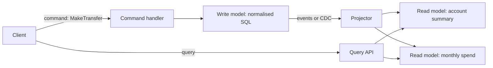

CQRS can be light (same database, separate read queries or materialised views) or heavy (separate databases, updated asynchronously). It does not require event sourcing, though they are often used together.

**Pros:**
- Read and write sides scale and evolve separately; fast screens; simpler write logic.

**Cons / limits:**
- Read models are eventually consistent with writes (read-your-own-writes needs care).
- More moving parts: projectors, rebuilds, monitoring of lag.

**Use it when / avoid when:**
- Use it when read and write workloads differ a lot, or screens need complex aggregations.
- Avoid it for simple CRUD. Start with a database view or materialised view before separate stores.

### Event sourcing

**What it is:** Instead of storing the current state ("balance is 120.00"), you store every change as an event (`Deposited 100`, `Deposited 50`, `Withdrew 30`), and the current state is computed by replaying them. The event log is the source of truth.

**Why it's used:** Full audit history by design, the ability to answer "what was the state at 3 p.m. last Tuesday?", and the ability to build new read models from history. Banking ledgers are a natural, centuries-old example of the idea.

**How it works:**
- Each aggregate (an account) has an ordered stream of events.
- To handle a command, load the events (or the latest snapshot plus later events), rebuild state, check rules, append new events with an expected version (optimistic concurrency).
- Projections turn events into read models (CQRS).

```ts
type AccountEvent =
  | { type: 'Opened'; accountId: string; at: string }
  | { type: 'Deposited'; amountCents: number; at: string }
  | { type: 'Withdrew'; amountCents: number; at: string };

function balance(events: AccountEvent[]): number {
  return events.reduce((sum, e) => {
    if (e.type === 'Deposited') return sum + e.amountCents;
    if (e.type === 'Withdrew') return sum - e.amountCents;
    return sum;
  }, 0);
}

async function withdraw(store: EventStore, accountId: string, amountCents: number) {
  const { events, version } = await store.load(accountId);
  if (balance(events) < amountCents) throw new Error('Insufficient funds');
  // fails if someone else appended since we loaded (version check)
  await store.append(accountId, version, [
    { type: 'Withdrew', amountCents, at: new Date().toISOString() },
  ]);
}
```

**Pros:**
- Complete, immutable history; temporal queries; replay to fix projections or build new ones; good fit for audit-heavy domains.

**Cons / limits:**
- Schema evolution of events is hard: old events live forever, so you need upcasting or versioning.
- Mental model is unfamiliar; queries need projections; deleting personal data (GDPR) needs strategies like crypto-shredding.
- Snapshots, rebuilds and projection lag add operations.

**Use it when / avoid when:**
- Use it when history is the business (ledgers, trading, insurance claims, compliance-heavy workflows) and the team can invest in it.
- Avoid it as a default persistence model. An append-only audit table next to normal state tables gives most of the audit benefit at much lower cost.

#### Q: [Senior] When is event sourcing actually worth it? The team wants to use it for our whole new lending platform.

**Short answer:** It is worth it for the parts where the history of changes is the core business value and audit or temporal questions are frequent, such as the loan ledger (disbursements, repayments, interest accruals, fees). It is usually not worth it for supporting parts like customer profiles, document uploads or product configuration. I would apply it selectively, with a team that understands the costs.

**Clarify first:**
- What questions must we answer? "Show the exact balance and accrued interest as of any date" points to event sourcing. "Who changed this address" can be an audit table.
- Regulatory requirements for immutability and retention?
- Does anyone on the team have production experience with event-sourced systems?

**Solution:**
- Event-source the loan account aggregate: `LoanDisbursed`, `RepaymentReceived`, `InterestAccrued`, `FeeCharged`, `PaymentReversed`.
- Projections: current balance, repayment schedule, arrears report.
- Snapshots every N events for long-running loans.
- Event versioning policy from day one (`type`, `version`, upcasters).
- Everything else: normal relational tables with an append-only audit log and an outbox for integration events.

**Trade-offs:** Selective use means two persistence styles in one platform, but that is far cheaper than forcing the whole platform into one. Full event sourcing would slow delivery and make simple features (edit a phone number) needlessly complex.

**What interviewers listen for:**
- Driven by business questions, not fashion.
- Awareness of event versioning, projections and GDPR.
- Distinguishing event sourcing from "we publish events".
- Red flag: "event sourcing gives us microservices for free".

#### Q: [Mid] Is CQRS the same as having read replicas?

**Short answer:** No. A read replica is a copy of the same data model for scaling reads. CQRS means the read model is designed differently from the write model, shaped for specific queries, possibly in a different store. You can implement a light CQRS read model on a replica (for example a materialised view), but the core idea is the separate model, not the copy.

**Solution:**
- Read replica: same tables, same schema, replication lag, used to offload `SELECT`s.
- CQRS: write side normalised `transactions` table; read side a `monthly_spend_by_category` table updated by a projector, or an OpenSearch index for search.

**Trade-offs:** Replicas are cheap and simple. CQRS read models need projection code but give much faster, simpler queries for specific screens.

**What interviewers listen for:**
- Model vs copy distinction.
- Red flag: using the terms interchangeably.

#### Q: [Senior] Our choreographed event flow for account opening involves 7 services and nobody can explain what happens when the identity check fails halfway. How would you fix it?

**Short answer:** Make the process explicit. Move the core account-opening flow to orchestration with a workflow engine or a state machine that owns the process state, timeouts and compensations, while services still publish facts as events for other consumers. Add distributed tracing and a process view so anyone can see where each application is.

**Clarify first:**
- Which steps are core to the process (KYC, account creation, card issuance) vs side effects (welcome email, analytics)?
- What timeouts and manual review steps exist (identity check pending for 2 days)?

**Diagnose:** Trace a few failed applications with correlation ids across logs. Draw the actual event flow from code (who subscribes to what). Usually you find loops, missing failure events and side effects that run even when earlier steps failed.

**Solution:**

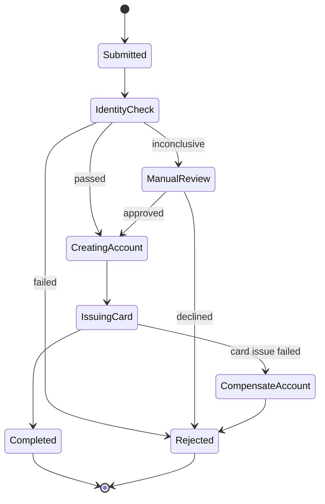

- Orchestrator (AWS Step Functions, Temporal, or a persisted state machine) drives the core steps and stores state per application.
- Side effects stay choreographed: the orchestrator publishes `AccountOpened`; email and analytics subscribe.
- Every step is idempotent and has a timeout and a defined failure transition.

**Trade-offs:** The orchestrator is a central dependency and couples services to its commands. You gain visibility and explicit failure handling, which is usually the right trade for a regulated, multi-step process.

**What interviewers listen for:**
- Core process vs side effects separation.
- Explicit states, timeouts and compensation.
- Red flag: adding more events to fix a flow nobody understands.

## 4. Consistency across services: saga and outbox

### Saga pattern

**What it is:** A way to run a business transaction that spans several services without a distributed lock or two-phase commit. The transaction is a sequence of local transactions; if a later step fails, earlier steps are undone by **compensating actions** (refund the payment, release the reserved stock).

**Why it's used:** With database-per-service, one ACID transaction cannot cover "charge the card, reserve stock, create shipment". Two-phase commit across services is slow, fragile and often unsupported by modern data stores and third-party APIs.

**How it works:** Each step commits locally and emits an event or reply. On failure, compensations run in reverse order. Sagas can be choreographed or orchestrated (see the previous theme).

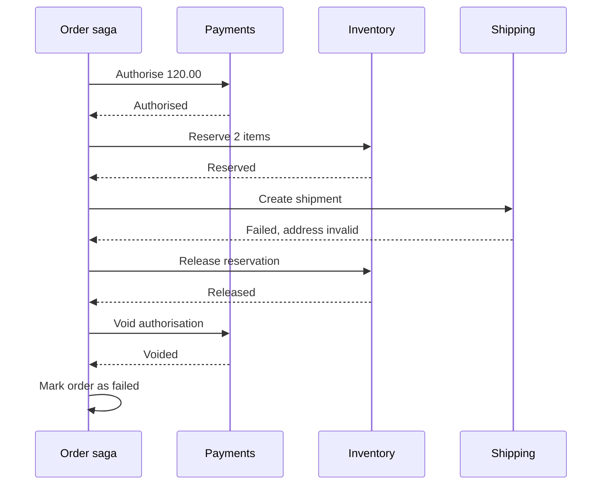

Rules of thumb:
- Compensations are business actions, not database rollbacks. A sent email cannot be unsent; you send a correction.
- Order steps so that the hardest-to-compensate step comes last ("pivot" step). For money, authorise first and capture last.
- Every step and every compensation must be idempotent and retryable.
- Sagas give no isolation: other users can see intermediate states. Use status fields (`PENDING`) and semantic locks.

**Pros:**
- Consistency across services without distributed transactions; works with external APIs.

**Cons / limits:**
- More design work: every step needs a compensation, and intermediate states are visible.
- Debugging long-running sagas needs good tooling and tracing.

**Use it when / avoid when:**
- Use it when a business process spans services or external systems.
- Avoid it when you can keep the data in one service and use a local ACID transaction. Often the best saga is the one you avoided by drawing boundaries better.

### Transactional outbox

**What it is:** A pattern that makes "update my database" and "publish an event" happen together reliably. You write the event into an `outbox` table in the same database transaction as the business change. A separate relay process reads the outbox and publishes to the broker.

**Why it's used:** The **dual-write problem**: if you commit to the database and then publish to Kafka, a crash between the two loses the event; if you publish first and the commit fails, you announce something that never happened. Downstream systems then disagree with the source of truth.

**How it works:**

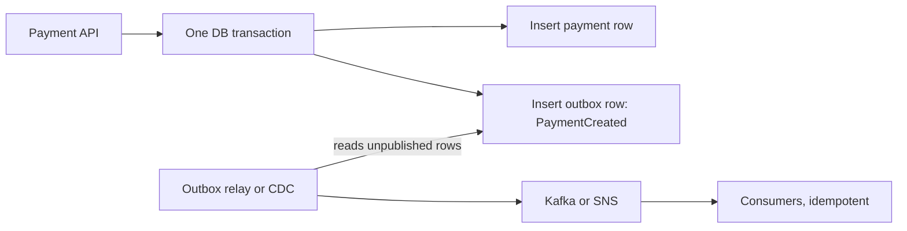

```sql
BEGIN;
INSERT INTO payments (id, account_id, amount_cents, status)
  VALUES ('pay_123', 'acc_1', 12000, 'PENDING');
INSERT INTO outbox (id, aggregate_id, type, payload, created_at)
  VALUES (gen_random_uuid(), 'pay_123', 'PaymentCreated',
          '{"paymentId":"pay_123","amountCents":12000}', now());
COMMIT;
```

```ts
// Simple polling relay. Production setups often use CDC (Debezium) on the outbox table instead.
async function relayOnce() {
  await db.transaction(async (tx) => {
    const rows = await tx.query(
      `SELECT * FROM outbox WHERE published_at IS NULL
       ORDER BY created_at LIMIT 100 FOR UPDATE SKIP LOCKED`,
    );
    for (const row of rows) {
      await broker.publish(row.type, row.payload, { messageId: row.id });
      await tx.query(`UPDATE outbox SET published_at = now() WHERE id = $1`, [row.id]);
    }
  });
}
```

The relay may publish a message twice (it published, then crashed before marking it), so delivery is at-least-once and consumers dedupe by message id. The mirror pattern on the consumer side is the **inbox**: record processed message ids in the same transaction as the consumer's changes.

**Pros:**
- No lost or phantom events; uses the database's own atomicity.

**Cons / limits:**
- Extra table, relay process and monitoring (outbox lag). Ordering needs care if multiple relays run.

**Use it when / avoid when:**
- Use it whenever a service changes state and must publish an event about it, especially for money.
- Not needed if the event log itself is the source of truth (event sourcing), or if the broker is the only write.

#### Q: [Senior] Design an order flow (payment, stock reservation, shipment) with a saga. Would you use orchestration or choreography?

**Short answer:** Orchestration for this flow. It has three or more steps, money is involved, there are compensations and timeouts, and the business will ask "where is order 123 stuck?". An orchestrator makes the state and failure paths explicit. I would still publish domain events (`OrderConfirmed`) so other services (email, analytics) can react by choreography.

**Clarify first:**
- Authorise-then-capture with the payment provider, or immediate capture?
- How long can stock be held? What if the shipping provider is down for an hour?
- Expected volume, and do we already run a workflow engine?

**Solution:**
- Step order: reserve stock (easy to release), authorise payment (voidable), create shipment, then capture payment as the pivot. Capturing last avoids refunds for most failures.
- Orchestrator state per order: `PENDING`, `STOCK_RESERVED`, `PAYMENT_AUTHORISED`, `SHIPMENT_CREATED`, `COMPLETED`, or `COMPENSATING`, `FAILED`.
- Commands carry an idempotency key `orderId:step`. Each service stores processed keys.
- Timeouts: if stock is not reserved within 30 seconds, fail; if shipping is down, retry with backoff for up to 1 hour, then compensate.
- Tooling: AWS Step Functions or Temporal give durable state, retries and visual history. A hand-rolled orchestrator needs its state persisted and an outbox for its commands.

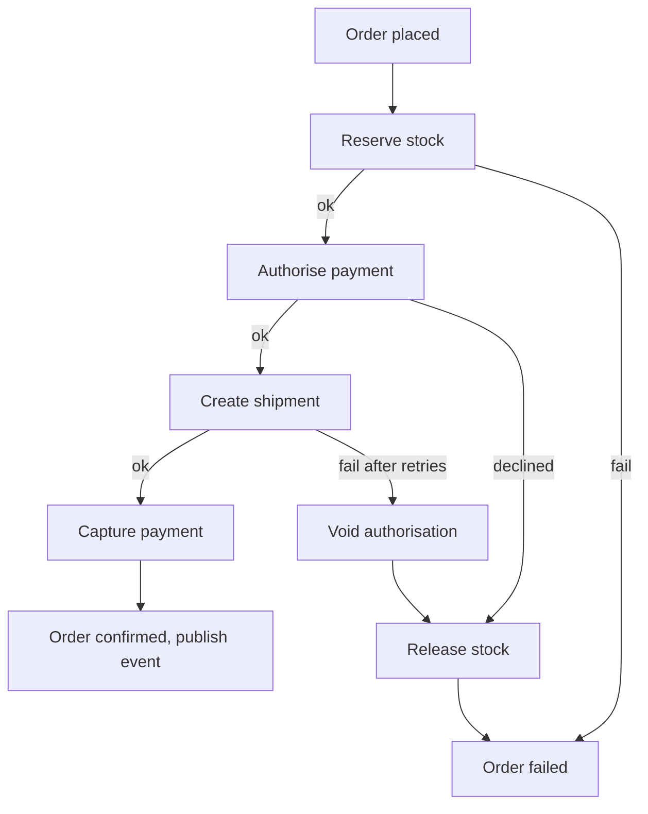

When choreography is fine: two steps with simple failure handling, or reactions that are side effects (send email when `OrderConfirmed`).

**Trade-offs:** Orchestration adds a central component and some coupling to it, and the workflow engine itself must be operated or paid for. Choreography avoids that but spreads the process across services, making changes and debugging harder as steps grow.

**What interviewers listen for:**
- Step ordering with a pivot, compensations as business actions.
- Idempotency and timeouts on every step.
- Clear reasoning for orchestration vs choreography.
- Red flag: "use a distributed transaction (2PC) across the services".

#### Q: [Mid] After a deploy, the rewards service sometimes misses points for payments, but the payments table shows them as completed. The code commits the payment and then publishes to Kafka. What is wrong?

**Short answer:** It is the dual-write problem. If the process crashes, the deploy kills the pod, or Kafka is briefly unavailable after the commit, the event is never published, and nothing retries it. Deploys make it worse because pods get terminated mid-request. Fix it with a transactional outbox.

**Diagnose:**
- Compare payment ids in the database with event ids in the topic for the deploy window; missing events cluster around pod terminations.
- Check logs for publish errors swallowed after commit.

**Solution:**
- Write the event to an `outbox` table in the same transaction as the payment.
- A relay or CDC connector publishes outbox rows and marks them sent.
- Rewards consumes idempotently (unique constraint on `payment_id` in its points table).
- Graceful shutdown: handle `SIGTERM`, stop accepting requests, finish in-flight work.
- One-off backfill: publish events for completed payments that rewards never saw.

**Trade-offs:** A little extra latency (the relay runs every few hundred ms or via CDC) and another component to monitor, in exchange for no lost events.

**What interviewers listen for:**
- Naming the dual-write problem.
- At-least-once with idempotent consumers.
- Red flag: "retry the publish in a loop" (still lost if the process dies).

#### Q: [Staff] A product manager says "just wrap the transfer between our two services in a transaction". Explain to them, and to the engineers, what you would do instead.

**Short answer:** To the PM: two separate systems cannot share one "all or nothing" switch cheaply or reliably, so we design the transfer as a sequence of safe steps with a clear status and automatic undo if a step fails. Customers see "pending" for a moment, and money is never lost or doubled. To the engineers: a saga with idempotent steps, an outbox for reliable messaging, and a reconciliation job as the safety net, or better, move both accounts' ledger into one service so a local transaction works.

**Clarify first:**
- Why are the two balances in different services? Could the ledger be one service with the others reading from it?
- What latency is acceptable before the user sees a final result?

**Solution:**
1. Best option if possible: one ledger service owns all balances; a transfer is one local ACID transaction (debit and credit legs in a single journal).
2. If it truly spans services or banks: a saga. Debit with status `PENDING` (a hold), send credit command via outbox, on credit success mark debit `POSTED`, on failure release the hold.
3. Idempotency keys on every command; inbox tables on consumers.
4. Reconciliation: a scheduled job compares both sides and flags mismatches for automated repair or human review. In finance this is standard, not optional.
5. UX: show `Pending` with a clear message and push the final status.

**Trade-offs:** The saga is more code than a transaction and exposes an intermediate state. Merging the ledger reduces flexibility of service boundaries but removes a whole class of failure.

**What interviewers listen for:**
- Explaining clearly to a non-engineer without jargon.
- Questioning the boundary before adding machinery.
- Reconciliation as a safety net.
- Red flag: proposing XA/2PC across microservices as the default.

## 5. Resilience and the service network

### Retry, timeout, circuit breaker and bulkhead

**What it is:** Four patterns that stop one slow or failing dependency from taking the whole system down.
- **Timeout:** never wait forever. Give each call a deadline.
- **Retry with exponential backoff and jitter:** try again for transient failures, waiting longer each time (100 ms, 200 ms, 400 ms, plus randomness) so clients do not retry in sync.
- **Circuit breaker:** after too many failures, stop calling the dependency for a while and fail fast (or use a fallback). Like a household fuse.
- **Bulkhead:** isolate resources (connection pools, thread pools, concurrency limits) per dependency, so one slow dependency cannot consume everything. Named after the watertight compartments in a ship.

**Why it's used:** In a distributed system, slowness spreads. If the FX rate service hangs and each request waits 30 seconds, all your server's connections fill with waiting requests and even unrelated endpoints stop responding. This is a **cascading failure**.

**How it works:**

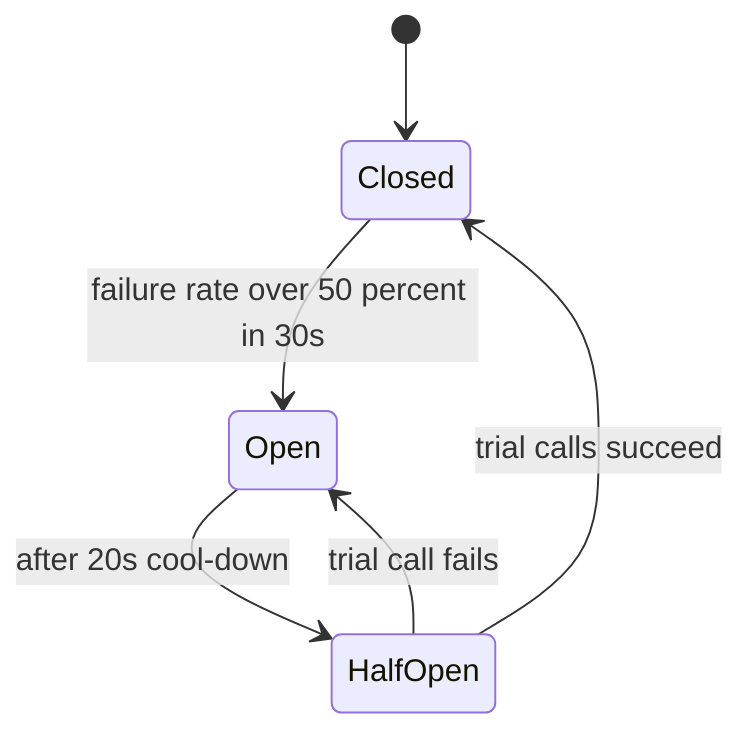

- **Closed:** calls go through; failures are counted.
- **Open:** calls fail immediately (or return a fallback) without touching the dependency.
- **Half-open:** a few trial calls test whether it recovered.

```ts
// Timeout + retry with backoff and jitter, retrying only safe, transient failures
async function callWithRetry<T>(fn: (signal: AbortSignal) => Promise<T>, attempts = 3): Promise<T> {
  for (let i = 0; ; i++) {
    try {
      return await fn(AbortSignal.timeout(800)); // per-attempt deadline
    } catch (err) {
      const transient = isTimeout(err) || isStatus(err, [502, 503, 504]);
      if (!transient || i === attempts - 1) throw err;
      const base = 100 * 2 ** i;
      await new Promise((r) => setTimeout(r, base + Math.random() * base)); // jitter
    }
  }
}
```

In Node.js, libraries such as `opossum` (circuit breaker) and `cockatiel` (retry, circuit breaker, bulkhead, timeout policies) implement these. A service mesh can also apply timeouts, retries and outlier detection outside the code.

Retry rules:
- Only retry idempotent operations, or make them idempotent with an idempotency key (`POST /payments` with `Idempotency-Key`).
- Retry at one layer only. Retries at the client, gateway and service multiply: 3 x 3 x 3 = 27 calls for one user action.
- Use a retry budget (for example, retries may be at most 10% of requests) so retries cannot overload a struggling service.

**Pros:**
- Contain failures, recover automatically from transient errors, protect capacity.

**Cons / limits:**
- Poorly tuned retries cause retry storms. Breakers that trip too easily cause needless outages. Fallbacks must be safe (never fall back to a cached balance for a payment decision).

**Use it when / avoid when:**
- Timeouts: on every network call, always.
- Retries: for transient errors on idempotent calls.
- Circuit breakers and bulkheads: around every important dependency, especially third parties.

### Service mesh and the sidecar pattern

**What it is:** A **sidecar** is a helper process deployed next to each service instance (in Kubernetes, a second container in the same pod) that handles networking concerns for it. A **service mesh** is a fleet of these proxies plus a control plane that configures them: Istio, Linkerd, Consul, AWS App Mesh (AWS has announced its end of support in 2026; Amazon ECS Service Connect and VPC Lattice are AWS's suggested alternatives).

**Why it's used:** With 50 services in several languages, implementing mTLS, retries, timeouts, traffic splitting and metrics in every codebase is inconsistent and slow. A mesh does it uniformly, outside the application code.

**How it works:**

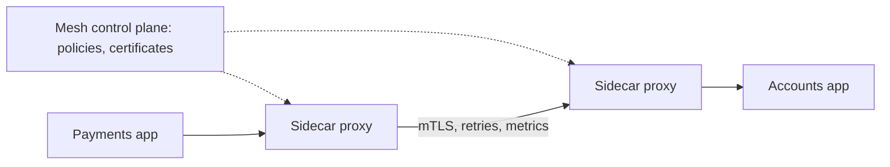

Features: mutual TLS between services (encryption plus service identity), traffic policies (timeouts, retries, circuit breaking), canary and weighted routing, uniform metrics and traces. Newer designs (Istio ambient mode, Cilium) reduce or remove per-pod sidecars by moving proxies to the node level.

**Pros:**
- Consistent security and traffic control across languages; zero-trust networking; observability without code changes.

**Cons / limits:**
- Significant operational complexity and resource overhead; more latency per hop; another thing to debug when "the network" misbehaves.

**Use it when / avoid when:**
- Use it with many services on Kubernetes, multiple languages, and strong requirements like mTLS everywhere.
- Avoid it for a handful of services; libraries, a gateway and your cloud's load balancers are enough.

#### Q: [Senior] Our payment page calls an FX rate provider that sometimes takes 20 seconds to respond. During those periods, the whole API, including login, becomes unresponsive. Explain why and fix it.

**Short answer:** It is a cascading failure. Calls to the slow provider have no tight timeout, so requests pile up and hold connections, event loop work and database connections until the server has nothing left for other endpoints. Fix it with a short timeout, a circuit breaker with a safe fallback, a bulkhead that limits concurrent FX calls, and cached rates with clear staleness rules.

**Clarify first:**
- Is the FX rate needed to display an estimate, or to execute a conversion at a committed rate?
- How fresh must a displayed rate be (seconds, minutes)?
- Does the provider have an SLA and rate limits?

**Diagnose:**
- APM traces: the FX span takes 20 s; concurrent requests and open sockets climb; other endpoints wait on the same resources (for example the HTTP agent's socket pool or the DB pool held during the call).
- Check whether the FX call happens inside a database transaction (a common mistake that holds a DB connection for the full 20 s).

**Solution:**
1. Timeout of about 1 second on the FX call (`AbortSignal.timeout(1000)`).
2. Never call an external API while holding a DB transaction.
3. Bulkhead: limit concurrent FX calls (for example 20) with a separate HTTP agent; excess calls fail fast.
4. Circuit breaker around the provider; when open, use a fallback.
5. Fallback for display: the last known rate from Redis with a timestamp and a "rate as of 10:02" label. For execution, fail with a clear "try again" message rather than using a stale rate.
6. Better architecture: a background worker refreshes rates every few seconds into Redis; user requests read only from Redis.

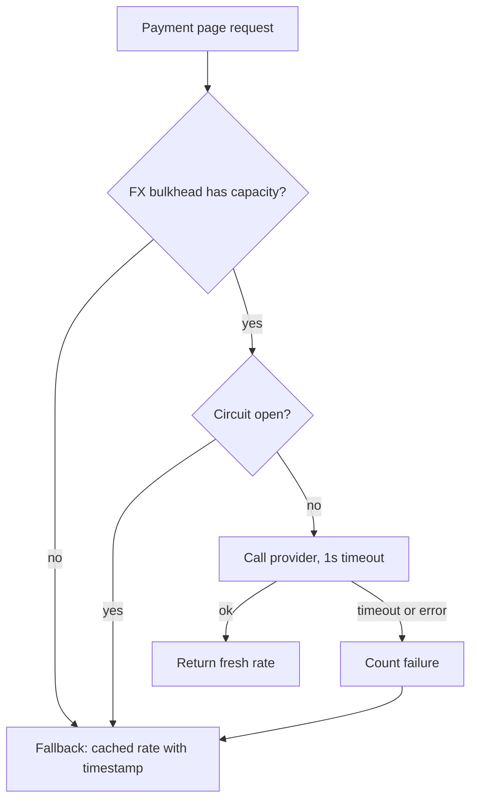

**Trade-offs:** Users sometimes see a slightly older displayed rate or a "try again". That is far better than the whole app going down.

**What interviewers listen for:**
- The cascading failure explanation with resource exhaustion.
- Timeout first, then breaker and bulkhead, plus safe fallbacks.
- Separating display rates from executable rates.
- Red flag: "increase the timeout" or "add more servers".

#### Q: [Mid] Our client retries failed requests 3 times, the gateway retries 3 times, and the service retries its database call 3 times. During a small database blip the error rate exploded. Why?

**Short answer:** Retries multiplied. One user action can become 3 x 3 x 3 = 27 database attempts, so a brief slowdown turned into a load spike that kept the database overloaded: a retry storm. Retry at one layer, with backoff, jitter and a retry budget, and only for idempotent operations.

**Solution:**
- Pick one layer to retry (often the one closest to the failing dependency) and disable or reduce the others.
- Exponential backoff with jitter.
- Retry budgets and circuit breakers to stop retrying when the dependency is clearly unhealthy.
- Honour `Retry-After` on `429` and `503`.
- Frontend: retry only idempotent `GET`s automatically (React Query's default retry is for queries, not mutations); show a retry button for mutations and send an idempotency key.

**Trade-offs:** Fewer retries means some transient errors reach the user. That is acceptable and usually rarer than you expect once backoff is in place.

**What interviewers listen for:**
- Multiplication across layers and the term retry storm.
- Red flag: retrying non-idempotent `POST /payments` without an idempotency key.

#### Q: [Staff] We have 14 services on Kubernetes in TypeScript and Go. Security wants mTLS between all services, and the SRE team suggests a service mesh. How do you evaluate it?

**Short answer:** List the requirements (mTLS, traffic policy, observability) and compare a mesh against lighter options, considering team capacity. With 14 services, a mesh is justifiable if mTLS everywhere is mandatory and we want uniform retries and traffic splitting; I would favour a simpler mesh (Linkerd or Istio ambient mode) and a staged rollout. If mTLS is the only need, other options may be cheaper.

**Clarify first:**
- Is mTLS a regulatory requirement or a nice-to-have? Is network-level encryption from the cloud provider enough?
- Who will operate the mesh and handle upgrades and incidents?
- Do we need canary releases, fault injection, or cross-cluster traffic?

**Solution:**
- Options compared:

| Option | mTLS | Traffic policy | Overhead | Ops effort |
|---|---|---|---|---|
| Library per service | Manual certs per language | In code, inconsistent | Low | High per team |
| Cloud-native (for example VPC Lattice, ECS Service Connect) | Varies by product | Basic | Low | Low |
| Linkerd | Automatic | Good | Low to moderate | Moderate |
| Istio (sidecar or ambient) | Automatic | Very rich | Moderate | Higher |

- Pilot on 2–3 non-critical services, measure added latency (p99) and resource use, test failure modes (control plane down: data plane should keep working with the last config).
- Roll out namespace by namespace, starting with permissive mTLS, then strict.
- Define ownership (platform team), upgrade cadence and runbooks.

**Trade-offs:** A mesh centralises networking power and complexity. It saves duplicated work across services but becomes a critical platform component that must be staffed.

**What interviewers listen for:**
- Requirements first, options compared, staged rollout with measurement.
- Ownership and failure modes of the mesh itself.
- Red flag: adopting Istio because "everyone uses it" with no one to run it.

## 6. Migrating, isolating and scaling the organisation

### Strangler fig migration

**What it is:** A way to replace a legacy system gradually instead of a big-bang rewrite. You put a routing layer in front of the old system and move one feature at a time to the new system, until the old one can be switched off. Named after the strangler fig tree, which grows around a host tree and eventually replaces it.

**Why it's used:** Big-bang rewrites of business-critical systems usually run late, miss hidden behaviour, and carry enormous cut-over risk. Incremental migration delivers value early and keeps rollback cheap.

**How it works:**

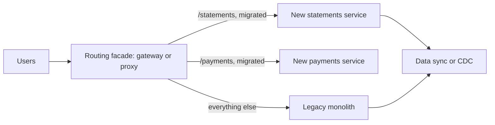

Steps:
1. Put a facade (API gateway, reverse proxy, or BFF) in front of the legacy system. No behaviour change.
2. Pick a slice with clear boundaries and high value or low risk.
3. Build it in the new system. Keep data in sync (CDC from the legacy database, or dual writes through an anti-corruption layer that translates legacy models).
4. Shadow traffic or compare results, then shift traffic gradually (by percentage or user cohort) with a fast rollback switch.
5. Remove the legacy code path. Repeat.

**Pros:**
- Lower risk, continuous delivery of value, real production feedback early.

**Cons / limits:**
- Running two systems in parallel for a long time costs money and attention. Data synchronisation is the hardest part. Migrations can stall at 80% if not prioritised.

**Use it when / avoid when:**
- Use it for almost any migration of a live, critical system.
- A rewrite may be acceptable only for small systems with little hidden behaviour.

### Multi-tenancy models

**What it is:** How a SaaS system serves many customer organisations (tenants) from shared infrastructure, and how strongly it isolates them.

**Why it's used:** Sharing infrastructure lowers cost and simplifies operations; isolation is needed for security, compliance, noisy-neighbour protection and enterprise contracts.

**How it works:**

| Model | Description | Isolation | Cost per tenant | Ops complexity | Typical use |
|---|---|---|---|---|---|
| Pool: shared DB, shared schema | All tenants in the same tables with a `tenant_id` column | Lowest, relies on code and row-level security | Lowest | Low | Many small tenants, SMB SaaS |
| Bridge: shared DB, schema per tenant | One schema per tenant in a shared database | Medium | Medium | Medium (migrations per schema) | Hundreds of mid-size tenants |
| Silo: database or stack per tenant | Each tenant has its own database or entire deployment | Highest | Highest | High (fleet management) | Large enterprise or regulated tenants |

Hybrid is common: small tenants pooled, big or regulated ones siloed ("tiered tenancy").

In the pool model, enforce isolation in more than one place: tenant id derived from the authenticated token (never from the request body), every query scoped, and database row-level security as a backstop.

```sql
ALTER TABLE invoices ENABLE ROW LEVEL SECURITY;
CREATE POLICY tenant_isolation ON invoices
  USING (tenant_id = current_setting('app.tenant_id')::uuid);
-- per request, inside the transaction: SET LOCAL app.tenant_id = '<tenant uuid from the verified token>';
```

**Pros:**
- Pool: cheap and simple. Silo: strong isolation, per-tenant customisation and data residency.

**Cons / limits:**
- Pool: one bug can leak data between tenants; noisy neighbours. Silo: expensive and slow to roll out changes to hundreds of stacks.

**Use it when / avoid when:**
- Choose by tenant size distribution, compliance needs and contract requirements, not one size for all.

### Cell-based architecture

**What it is:** Splitting the whole production system into multiple independent, identical copies called **cells**, each serving a subset of customers. A thin routing layer sends each customer to their cell. A failure or a bad deploy affects only one cell.

**Why it's used:** To limit the **blast radius**. At large scale, even well-tested systems fail; cells ensure an incident hits, for example, 5% of customers instead of 100%. AWS uses this approach for many of its own services.

**How it works:**

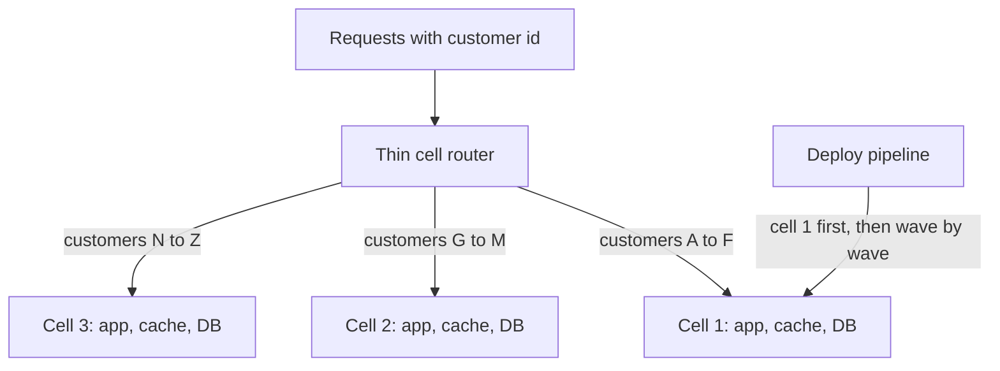

- Each cell is a full stack with its own data; cells do not call each other.
- The router is kept as simple as possible (a lookup of customer to cell) because it is shared by everyone.
- Deploys go cell by cell, so a bad release is caught in the first cell.
- Cells have a maximum size; growth means adding cells, not making cells bigger.

**Pros:**
- Bounded blast radius, predictable scaling unit, safer deploys, easier load testing (test one cell).

**Cons / limits:**
- Cross-cell features (global search, analytics, moving a customer between cells) are hard.
- More infrastructure and automation needed; the router is a critical component.

**Use it when / avoid when:**
- Use it at large scale where an outage of the whole platform is unacceptable (payments processors, large SaaS).
- Avoid it early: you need mature automation, and the overhead is not justified for a small user base.

#### Q: [Staff] We need to migrate a 12-year-old monolithic online banking application (Java, one Oracle database, 400 tables) to a modern architecture without downtime. How do you approach it?

**Short answer:** Strangler fig, not a rewrite. Put a routing facade in front, map the domain into bounded contexts, and migrate one capability at a time, starting with something valuable but lower risk, such as statements or notifications, keeping data in sync with change data capture. Target a modular set of services or a modular monolith, depending on team structure. Core ledger and payments go last, after the team and platform have proven the approach.

**Clarify first:**
- Why migrate: cost of Oracle licences, release speed, scalability, talent, end of support? The goal shapes the order.
- Regulatory constraints: data residency, audit, change approval processes.
- Team size and skills; how many teams will own the new parts?
- Are there test suites and documentation, or is behaviour only known by running it?

**Diagnose:** Map the current system: modules, table ownership, which code writes which tables, batch jobs, integrations (card processor, core banking feeds). Measure traffic per feature. Find seams where a capability reads and writes its own set of tables.

**Solution:**
1. **Foundation:** CI/CD, observability, the routing facade (API gateway), identity (Okta), and a CDC pipeline from Oracle (for example Debezium or AWS DMS) to Kafka.
2. **First slice: read-heavy, low-risk.** Statements and transaction history: build a new service that serves reads from a store fed by CDC. Route `/statements` to it, compare responses with legacy (shadow mode), then switch.
3. **Next slices:** notifications, customer profile, payees. For write paths, choose one owner of the data at a time; use an anti-corruption layer to translate legacy codes and models, and sync back to the legacy database while legacy code still reads that data.
4. **Core last:** payments and ledger, with sagas, outbox, idempotency and daily reconciliation between old and new ledgers during parallel run.
5. **Frontend:** the new React app can be strangled the same way, route by route, with the old UI behind the same domain.
6. **Decommission:** remove legacy code paths and tables after each slice; track a "percentage migrated" metric.

```mermaid
flowchart LR
  P1["Phase 1: facade, CDC, platform"] --> P2["Phase 2: read slices: statements, history"]
  P2 --> P3["Phase 3: write slices: profile, payees, alerts"]
  P3 --> P4["Phase 4: payments and ledger with reconciliation"]
  P4 --> P5["Phase 5: decommission legacy"]
```

**Trade-offs:** The migration takes longer in calendar time than a rewrite promises, and parallel running costs money. But each step is reversible and delivers value, which is what makes it survivable in a bank.

**What interviewers listen for:**
- Incremental, reversible steps; data synchronisation as the core challenge.
- Starting with low-risk slices; core money flows last with reconciliation.
- Asking why before how.
- Red flag: "freeze features for 18 months and rewrite in microservices".

#### Q: [Senior] We are building a B2B expense management SaaS. Most customers are small businesses, but two enterprise banks require their data to be isolated and kept in their own region. Which multi-tenancy model?

**Short answer:** Tiered tenancy. Pool the small businesses in shared databases with a `tenant_id` and row-level security, and give the enterprise banks a silo: a dedicated database, or a full stack in their required region. The same codebase and deployment pipeline serve both, with tenant routing deciding where requests and data go.

**Clarify first:**
- What exactly do the banks require: separate database, separate account, separate encryption keys, or region only?
- How many tenants in each tier now and in 2 years?
- Do pooled tenants need custom fields or workflows?

**Solution:**
- Tenant catalogue: `tenant_id`, tier, region, database connection or cell. The gateway resolves the tenant from the token and routes.
- Pool tier: shared PostgreSQL, `tenant_id` on every table, RLS policies, per-tenant rate limits to contain noisy neighbours.
- Silo tier: dedicated database (and optionally dedicated stack) in the bank's region, customer-managed encryption keys if required.
- Same schema everywhere; migrations run across the fleet by automation.
- Tenant-aware observability: metrics and logs tagged by tenant.

**Trade-offs:** Two tiers mean two operational modes and fleet-wide migrations. Silos are costly, so price them into enterprise contracts.

**What interviewers listen for:**
- Matching isolation to requirements per tier.
- Defence in depth for the pool (token-derived tenant id, RLS).
- Red flag: letting the client send `tenantId` in the body and trusting it.

#### Q: [Staff] A bad configuration push last quarter took down payments for all 8 million customers for 2 hours. Leadership asks how to make sure the next incident affects far fewer people. What do you propose?

**Short answer:** Reduce blast radius structurally. Roll out every change (code and configuration) progressively, and move toward a cell-based architecture where customers are split across independent cells, so a bad change or failure hits one cell first. Combine that with fast automated rollback driven by health metrics.

**Clarify first:**
- What failed exactly: a global config, a shared database, a shared dependency?
- Which components are shared by all customers today (database, cache, config store, gateway)?
- What is the acceptable blast radius target: under 10% of customers? Under 1%?

**Solution:**
1. **Immediately:** treat configuration like code: reviewed, versioned, validated by schema, and rolled out progressively (one region or percentage at a time) with automatic rollback on error-rate or latency alarms.
2. **Short term:** remove global single points: per-region or per-shard deployments of the payment path; feature flags with gradual exposure.
3. **Medium term:** cells. Each cell is a full payment stack with its own database for a subset of customers (for example 500k each, so about 16 cells). A thin router maps customer to cell. Deploys go in waves: one canary cell, then 25%, then the rest.
4. **Shared services** that must stay global (customer-to-cell mapping, identity) are kept minimal, highly available and change slowly.
5. **Practice:** game days that fail one cell and verify others are unaffected.

**Trade-offs:** Cells cost more infrastructure and engineering (cross-cell reporting, customer rebalancing). Progressive rollout slows full deployment from minutes to hours. For a payments platform, that is usually the right price.

**What interviewers listen for:**
- Blast radius as the design goal, with a measurable target.
- Config changes treated with the same rigour as code.
- Staged plan from cheap to structural.
- Red flag: "more testing in staging" as the whole answer.
