## 1. The request path: from browser to server

### Client-server model and the request lifecycle

**What it is:** A client (your React app in the browser) asks a server for something, and the server answers. Every "design X" interview starts by tracing one request through the boxes between the two. Think of it like posting a letter: you need the address (DNS), a nearby post office (CDN), a sorting desk (load balancer), a clerk who does the work (app server), a filing cabinet on the desk (cache), and the archive in the basement (database).

**Why it's used:** If you can draw the request path, you can reason about where latency comes from, what fails, and where to add capacity. When a portfolio dashboard is slow, the slow hop is somewhere on this path.

**How it works:**

1. The browser resolves `app.bank.com` to an IP address through DNS.
2. Static files (JS bundle, CSS, fonts, images) come from a CDN edge close to the user.
3. API calls (`GET /api/accounts`) go to a load balancer, which picks a healthy app server.
4. The app server checks a cache (for example Redis). On a hit it returns immediately.
5. On a miss it queries the database, stores the result in the cache, and returns it.
6. The response travels back the same way. TLS encrypts every hop that crosses a network you do not fully trust.

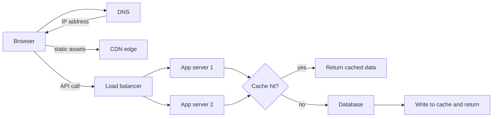

**Pros:**
- Separates concerns: each box can scale and fail independently.
- Gives you a shared vocabulary for interviews and incident calls.

**Cons / limits:**
- Every extra hop adds latency (often 1–5 ms inside a data centre, 20–150 ms across the internet) and another thing that can fail.
- More boxes means more to monitor and secure.

**Use it when / avoid when:**
- Use it as the starting skeleton for every design question.
- Do not add every box by default. A small internal tool may need only one server and one database.

> **Interview tip:** Draw the boring path first, then say "now let's find the bottleneck". Interviewers want to see you start simple and add parts for a stated reason.

### DNS (Domain Name System)

**What it is:** The phone book of the internet. It turns a name like `api.bank.com` into an IP address like `203.0.113.10`.

**Why it's used:** Humans and code use names; networks route by IP. DNS also lets you move a service to new servers by changing a record instead of every client.

**How it works:** The browser asks a recursive resolver (usually your ISP's or a public one). The resolver walks the hierarchy: root servers, then the `.com` servers, then the authoritative servers for `bank.com`, which return the record. Each answer has a TTL (time to live) that says how long resolvers may cache it.

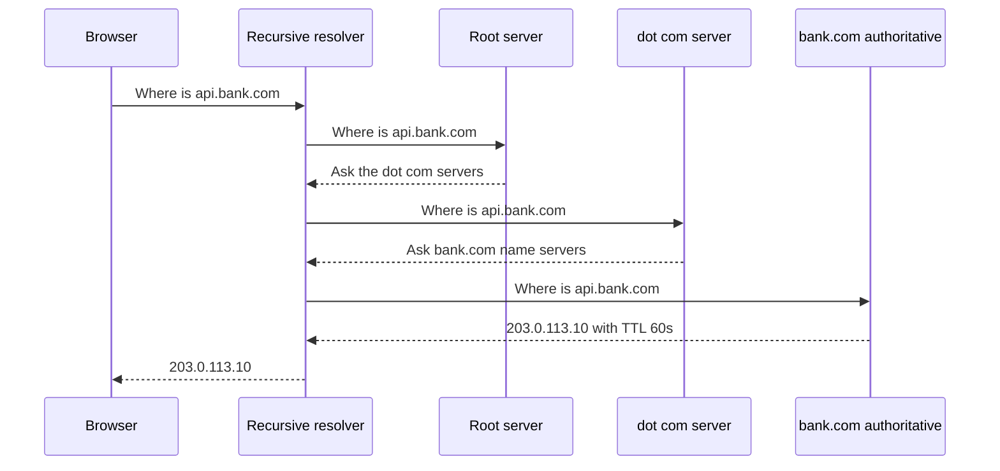

Common record types: `A` (IPv4), `AAAA` (IPv6), `CNAME` (alias to another name), `MX` (mail), `TXT` (verification, SPF). Managed DNS services (Route 53, Cloudflare DNS) add routing policies: weighted (send 10% to a new version), latency-based (nearest region), geolocation, and failover (switch when a health check fails).

**Pros:**
- Cheap, global, highly available.
- Can do coarse traffic steering between regions.

**Cons / limits:**
- Caching means changes are not instant. Some clients and resolvers ignore low TTLs.
- DNS is not a real load balancer: it does not know how busy each server is.

**Use it when / avoid when:**
- Use DNS routing for region-level failover and gradual migrations.
- Avoid relying on DNS for fast, per-request failover. Put a load balancer behind it.

> **Gotcha:** Before a planned migration, lower the TTL (for example from 1 hour to 60 seconds) a day ahead, so the old long TTL has expired everywhere when you switch.

### CDN (Content Delivery Network)

**What it is:** A worldwide network of cache servers ("edges") that keep copies of your files close to users. Like having a copy of a popular book in every local library instead of one in the capital.

**Why it's used:** A user in Sydney downloading a 1.5 MB bundle from a server in Virginia waits for many round trips across the Pacific. From a Sydney edge it is far faster. The CDN also absorbs traffic spikes and many DDoS attacks before they reach you.

**How it works:** DNS for `static.bank.com` points to the CDN. The edge checks its cache. On a miss it fetches from your origin (an S3 bucket or web server), caches the file according to `Cache-Control` headers, and serves it. Later users in that region get the cached copy.

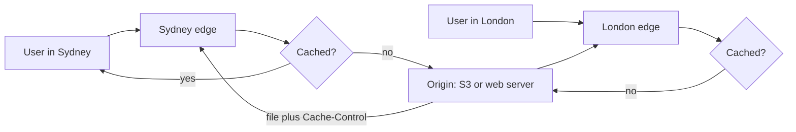

What to cache: content-hashed static assets (`main.3f9a1c.js`) with `Cache-Control: public, max-age=31536000, immutable`; `index.html` with a short TTL or `no-cache` so new deploys appear. Personal API responses (account balances) are usually `private, no-store` and never cached at a shared edge.

**Pros:**
- Lower latency, lower origin load, built-in DDoS absorption and TLS at the edge.
- Edge compute (CloudFront Functions, Lambda@Edge, Cloudflare Workers) can run small logic near users.

**Cons / limits:**
- Invalidation takes time and can cost money. Design for cache-busting file names instead.
- Caching the wrong thing (a response with `Set-Cookie` or user data) can leak data between users.

**Use it when / avoid when:**
- Use it for every public static asset and for media.
- Avoid caching authenticated, per-user responses at a shared edge unless the cache key includes the user and you have a strong reason.

> **Finance tip:** A misconfigured CDN that caches `/api/me` once and serves it to everyone is a classic data leak. Make sure the origin sends `Cache-Control: private, no-store` on personal data and the CDN respects it.

### Load balancers

**What it is:** A traffic director that spreads incoming requests across several servers and stops sending traffic to broken ones.

**Why it's used:** One server cannot handle all users, and one server is a single point of failure. With a load balancer you can add servers (horizontal scaling) and deploy without downtime by draining servers one at a time.

**How it works:**

Layer 4 vs Layer 7:

| | L4 (transport) | L7 (application) |
|---|---|---|
| Sees | IP addresses, ports, TCP/UDP | HTTP method, path, headers, cookies |
| Can route by | Connection | URL path, host, header, cookie |
| TLS | Usually passes through (or terminates simply) | Terminates TLS and reads the request |
| Speed | Very fast, very high throughput | A bit more work per request |
| AWS example | Network Load Balancer (NLB) | Application Load Balancer (ALB) |
| Good for | Raw TCP, gaming, very high connection counts, static IPs | Web apps and APIs, path-based routing to services |

Algorithms:
- **Round robin:** next server in order. Simple, fine when requests cost about the same.
- **Weighted round robin:** bigger servers get more traffic; also used for canary releases.
- **Least connections / least outstanding requests:** send to the least busy server. Better when some requests are slow (report generation).
- **Hash-based (IP hash, consistent hashing):** the same key always goes to the same server. Useful for cache locality.

Health checks: the load balancer calls something like `GET /healthz` every few seconds. After N failures the server is removed; after M successes it returns. Keep the health check cheap and honest: it should fail if the server cannot do its job (for example cannot reach its database), but be careful that one shared dependency failing does not mark every server unhealthy at once.

Sticky sessions (session affinity): the load balancer pins a user to one server, usually with a cookie. This is needed only when the server keeps session state in memory.

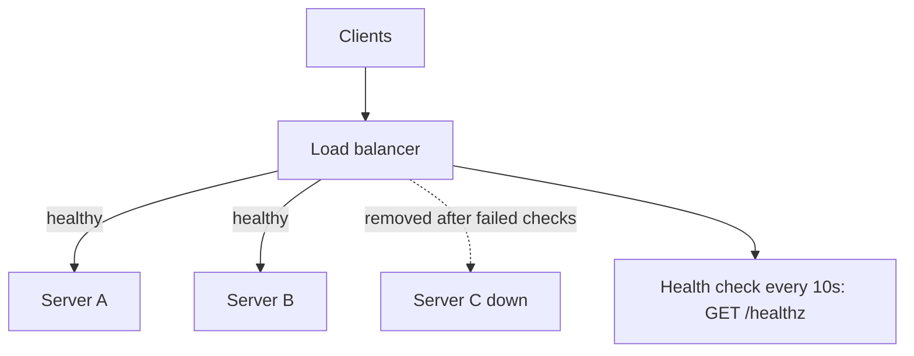

**Pros:**
- Horizontal scaling, zero-downtime deploys, automatic removal of bad instances.
- L7 balancers centralise TLS, routing and sometimes auth.

**Cons / limits:**
- The balancer itself must be highly available (managed cloud balancers handle this).
- Sticky sessions break even distribution and lose sessions when a server dies.

**Use it when / avoid when:**
- Use one whenever you run more than one instance of a service.
- Avoid sticky sessions. Store session state in Redis or a signed token so any server can handle any request.

> **Gotcha:** A health check that queries the database on every call can, during a database slowdown, make every server look unhealthy at once and turn a slowdown into a full outage. Many teams separate "liveness" (process is alive) from "readiness" (can serve traffic).

### Reverse proxy and API gateway

**What it is:** A reverse proxy is a server that sits in front of your app servers and forwards requests to them (Nginx, Envoy, HAProxy). An API gateway is a reverse proxy with API-specific features added: authentication, rate limiting, request validation, API keys, usage plans, and routing to many backend services (AWS API Gateway, Kong, Apigee).

**Why it's used:** You want one front door. Clients call `api.bank.com`; behind it, `/payments` goes to the payments service and `/accounts` goes to the accounts service. Cross-cutting rules (verify the Okta JWT, limit each client to 100 requests per second) live in one place instead of in every service.

**How it works:**

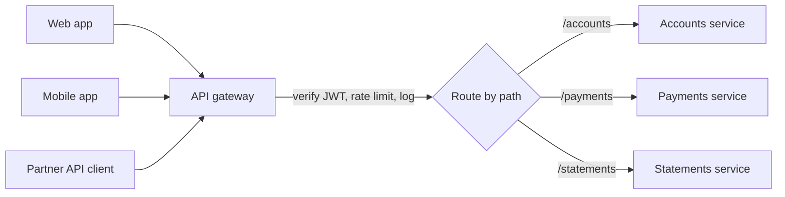

Forward proxy vs reverse proxy: a forward proxy acts for clients (a corporate proxy that all employee traffic goes through). A reverse proxy acts for servers (it hides and protects them).

**Pros:**
- Single entry point, central auth and throttling, hides internal topology.
- TLS termination, compression, response caching, request size limits.

**Cons / limits:**
- Another hop and another component to keep highly available.
- Gateways can become a dumping ground for business logic. Keep it to cross-cutting concerns.

**Use it when / avoid when:**
- Use a reverse proxy almost always in front of app servers.
- Use a full API gateway when you have several services, external API consumers, or need API keys and usage plans.
- Avoid putting domain rules (who may transfer how much) in the gateway.

> **Interview tip:** Load balancer, reverse proxy and API gateway overlap. Say it out loud: "An ALB already does L7 routing and TLS. I would add an API gateway only if I need per-client throttling, API keys, or request validation."

#### Q: [Mid] Walk me through everything that happens between a user typing app.bank.com and seeing their account balance.

**Short answer:** DNS resolves the name, the browser opens a TLS connection, the HTML and JS come from a CDN, React boots and calls the balance API, which goes through a load balancer or gateway to an app server, which checks a cache and then the database. I would then point out where each step can be slow or fail.

**Clarify first:**
- Is this a single-page app or server-rendered?
- Is the user already logged in (valid Okta session and token) or does this include login?
- Do you want network detail (TCP and TLS handshakes) or the architecture view?

**Solution:**

1. **DNS:** browser cache, OS cache, then recursive resolver. Result: the CDN's IP for `app.bank.com`.
2. **Connection:** TCP handshake plus TLS 1.3 handshake (one round trip; HTTP/3 over QUIC combines them). The certificate proves the server is really `app.bank.com`.
3. **HTML:** the CDN returns `index.html` (short cache). It references hashed bundles.
4. **Assets:** JS and CSS come from the CDN edge, ideally cached for a year.
5. **Auth:** the app checks for a token. If missing or expired, it redirects to Okta (OIDC Authorization Code with PKCE) and comes back with tokens.
6. **API call:** `GET https://api.bank.com/accounts` with `Authorization: Bearer <token>`. DNS again for the API host, then the load balancer or API gateway.
7. **Gateway:** verifies the JWT signature and expiry, applies rate limits, routes to the accounts service.
8. **App server:** checks permission (does this user own these accounts?), reads from Redis; on a miss, queries PostgreSQL and fills the cache.
9. **Response:** JSON back through the same path, `Cache-Control: private, no-store`.
10. **Render:** React Query stores the data, the component renders the balance.

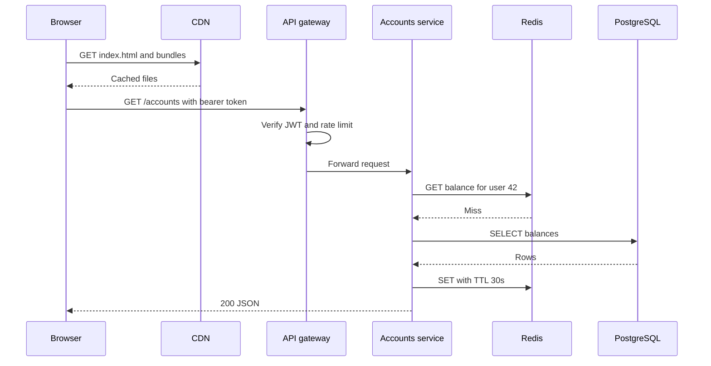

**Trade-offs:** Each layer adds latency but buys you something: the CDN buys speed, the gateway buys security and control, the cache buys database relief at the cost of possible staleness.

**What interviewers listen for:**
- You name the layers in order and say why each exists.
- You mention caching rules for personal data and the auth step.
- Red flag: forgetting DNS/TLS entirely, or caching balances at the CDN.

#### Q: [Senior] Our trading app uses WebSockets for live prices. After moving behind a new load balancer, connections drop every 60 seconds and some users get prices for the wrong session. What is going on and which load balancer type would you choose?

**Short answer:** Two separate problems. The 60-second drops are almost certainly an idle timeout on the load balancer closing quiet connections. The wrong-session data points to server-side session state in memory without affinity, or a shared connection mix-up. I would add heartbeats, raise the idle timeout, and make the WebSocket servers stateless about who the user is (authenticate each connection with a token).

**Clarify first:**
- What load balancer is it (ALB, NLB, Nginx) and what is its idle timeout?
- How does the server know which user a socket belongs to: a cookie, a token in the first message, server memory?
- How many concurrent connections do we expect (10k or 1M)?

**Diagnose:**
1. Check the balancer's idle timeout setting. AWS ALB defaults to 60 seconds (configurable). If drops line up exactly with it, that is the cause.
2. Look at close codes in the browser (`CloseEvent.code`, 1006 means abnormal closure without a close frame).
3. For the wrong-session bug, log the user id bound to each socket on connect and on every message. Look for a server-side map keyed by something not unique (for example IP address behind a corporate NAT).

**Solution:**
- Send an application heartbeat (ping every 20–30 seconds) so the connection never looks idle, and set the idle timeout above the heartbeat interval.
- Authenticate the socket on connect with a short-lived token, and bind the user id to the connection object, not to an IP or a global variable.
- Keep subscription state either on the connection (fine, because a reconnect re-subscribes) or in Redis, so a reconnect to any server works. Avoid relying on sticky sessions.
- Client: reconnect with exponential backoff and jitter, then re-subscribe and fetch a snapshot to fill the gap.

Which balancer: an L7 balancer (ALB) supports WebSocket upgrades and lets you route `/ws` separately from `/api`. Choose L4 (NLB) when you have very large numbers of long-lived connections, need static IPs, or need non-HTTP protocols. For most web trading apps, ALB is fine.

**Trade-offs:** Heartbeats cost a little bandwidth and battery on mobile. L4 is cheaper per connection but you lose path routing and must handle TLS and routing yourself.

**What interviewers listen for:**
- You separate the two symptoms instead of guessing one cause.
- You know idle timeouts exist and that WebSockets need heartbeats.
- Red flag: "just turn on sticky sessions" without fixing the state design.

#### Q: [Mid] Our app servers keep login sessions in memory, so we enabled sticky sessions. What problems does that cause and what would you do instead?

**Short answer:** Sticky sessions cause uneven load, lost sessions when a server dies or is replaced in a deploy, and they block autoscaling from rebalancing. I would move session state out of the server: either to a shared store like Redis, or into a signed token that the client sends each time, so any server can handle any request.

**Clarify first:**
- What is in the session: just the user id, or large objects like a shopping basket?
- Are we already using Okta tokens? If so, how much of the session is actually needed server-side?

**Solution:**
- Option 1: keep server-side sessions, store them in Redis keyed by a random session id in an `HttpOnly; Secure; SameSite` cookie. Every server reads the same store.
- Option 2: use the access token (JWT) for identity and keep the server stateless. Store only what you must in Redis or the database.
- Remove the stickiness, and confirm the balancer uses least-outstanding-requests or round robin.

**Trade-offs:** Redis adds a network hop and a dependency that must be highly available. JWTs are hard to revoke before they expire, so keep them short-lived.

**What interviewers listen for:**
- "Stateless app servers" as a principle, with the reason (scaling and resilience).
- Red flag: thinking sticky sessions are a scaling solution.

## 2. Caching

### In-process cache

**What it is:** A cache that lives inside your application's own memory, like a `Map` in a Node.js process (or libraries such as `lru-cache`).

**Why it's used:** It is the fastest possible cache: no network call. Good for data that changes rarely and is the same for everyone, like a list of currency codes or feature flag rules.

**How it works:** Each server keeps its own copy. You bound its size and give entries a TTL.

```ts
import { LRUCache } from 'lru-cache';

const fxRates = new LRUCache<string, number>({ max: 500, ttl: 60_000 }); // 1 minute

export async function getRate(pair: string): Promise<number> {
  const cached = fxRates.get(pair);
  if (cached !== undefined) return cached;
  const rate = await fetchRateFromProvider(pair);
  fxRates.set(pair, rate);
  return rate;
}
```

**Pros:**
- Nanosecond-to-microsecond reads, no extra infrastructure.

**Cons / limits:**
- Each of 20 servers has its own copy, so they can disagree and each warms separately.
- Memory is limited and lost on restart. Invalidation across servers is hard.

**Use it when / avoid when:**
- Use it for small, read-heavy, rarely changing, non-user-specific data.
- Avoid it for per-user data or anything that must be consistent across servers.

### Distributed cache: Redis and Memcached

**What it is:** A separate in-memory key-value server that all your app servers share.

**Why it's used:** To take read load off the database and cut latency from tens of milliseconds to about a millisecond, with one shared copy every server sees.

**How it works:** App servers call `GET key` and `SET key value EX 60`. Redis keeps data in RAM, can replicate to replicas, and can be clustered (sharded) across nodes.

| | Redis / Valkey | Memcached |
|---|---|---|
| Data types | Strings, hashes, lists, sets, sorted sets, streams, more | Strings only |
| Persistence | Optional (snapshots, append-only file) | None |
| Replication and failover | Yes | Not built-in |
| Extra uses | Rate limiting, leaderboards, locks, pub/sub, queues | Plain caching |
| Threads | Mostly single-threaded command execution (I/O threads in newer versions) | Multi-threaded |

Valkey is the open-source fork of Redis created in 2024 after Redis changed its license; AWS ElastiCache and MemoryDB support both. In interviews, "Redis" is understood to mean the family.

**Pros:**
- Very fast, shared, rich data structures (Redis).
- Managed options exist (ElastiCache, MemoryDB, Upstash, Redis Cloud).

**Cons / limits:**
- RAM is expensive; you cannot cache everything.
- Another network hop and dependency. If it goes down, the database can be flooded.

**Use it when / avoid when:**
- Use it when many servers read the same hot data, or for sessions, rate limits and counters.
- Avoid treating it as the source of truth for money unless you use a durable variant and understand its guarantees.

### Caching patterns: cache-aside, read-through, write-through, write-behind

**What it is:** Rules for who loads data into the cache and when writes reach the database.

**Why it's used:** The pattern decides how stale data can get and what happens on failure.

**How it works:**

- **Cache-aside (lazy loading):** the app checks the cache; on a miss, the app reads the database and writes the cache. On update, the app writes the database and deletes the cache key. Most common pattern.
- **Read-through:** the app only talks to the cache; the cache library itself loads from the database on a miss. Same idea, logic moved into the cache layer.
- **Write-through:** every write goes to the cache and the database together, synchronously. The cache is always warm and fresh, but writes are slower and you cache data nobody may read.
- **Write-behind (write-back):** writes go to the cache, and the cache flushes to the database later in batches. Very fast writes, but data can be lost if the cache dies before flushing. Rarely right for money.

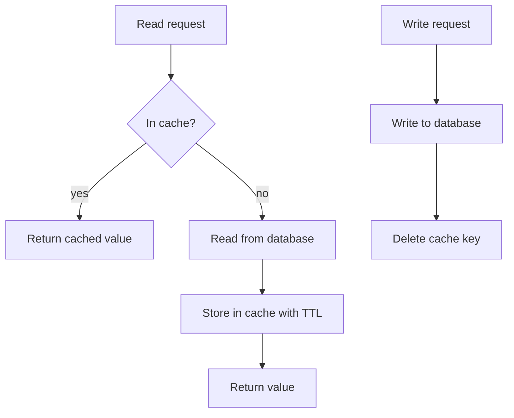

```ts
// cache-aside with Redis (ioredis)
export async function getAccountSummary(accountId: string): Promise<AccountSummary> {
  const key = `acct:summary:${accountId}`;
  const hit = await redis.get(key);
  if (hit) return JSON.parse(hit) as AccountSummary;

  const summary = await db.accountSummary(accountId); // SQL query
  await redis.set(key, JSON.stringify(summary), 'EX', 30);
  return summary;
}

export async function recordTransaction(tx: NewTransaction): Promise<void> {
  await db.insertTransaction(tx);           // source of truth first
  await redis.del(`acct:summary:${tx.accountId}`); // then invalidate
}
```

> **Why:** Deleting the key on write (instead of updating it) avoids a race where two concurrent writers set the cache in the wrong order. The next read loads the fresh value.

**Pros:**
- Cache-aside: simple, the cache only holds what is actually read, cache failure degrades to slower reads.
- Write-through: reads are almost always hits.
- Write-behind: highest write throughput.

**Cons / limits:**
- Cache-aside: the first read after a miss is slow, and there is a small window of stale data.
- Write-through: every write pays double; cold data fills the cache.
- Write-behind: risk of data loss and harder consistency.

**Use it when / avoid when:**
- Default to cache-aside with TTL plus delete-on-write.
- Use write-through for data read right after it is written (user profile after edit).
- Use write-behind for counters and analytics (page views), never for ledger entries.

### TTL and eviction (LRU, LFU)

**What it is:** TTL (time to live) is how long an entry may stay before it expires. Eviction is what the cache throws out when memory is full.

**Why it's used:** TTL limits how stale data can get even if you forget to invalidate. Eviction keeps the cache within its memory budget.

**How it works:**
- **LRU (least recently used):** evict the item not touched for the longest time. Good general default.
- **LFU (least frequently used):** evict the item used the fewest times. Better when some keys are always popular and you do not want a one-off scan to push them out.
- **FIFO, random:** simpler, rarely best.
- Redis exposes these as `maxmemory-policy` values such as `allkeys-lru`, `allkeys-lfu`, `volatile-ttl`, or `noeviction` (return errors when full).

Add jitter to TTLs (for example 300 seconds plus a random 0–30) so thousands of keys set at the same moment do not all expire at once.

**Pros:**
- Bounded staleness and bounded memory.

**Cons / limits:**
- Short TTL means more misses; long TTL means staler data. There is no free answer.

**Use it when / avoid when:**
- Always set a TTL on cache-aside entries, even if you also invalidate.
- Use `noeviction` only when the data in Redis is not just a cache (for example a queue) and losing keys would be a bug.

#### Q: [Senior] The portfolio page calls a pricing service that takes 400 ms and is hit 3,000 times per second at market open. Where would you put a cache, and what would you cache?

**Short answer:** Cache in layers. Prices are the same for every user, so cache them in Redis keyed by instrument with a TTL of a second or two, and possibly a tiny in-process cache on each server for the hottest instruments. Per-user portfolio composition is cached separately. On the frontend, React Query shares and dedupes requests. I would also protect the pricing service from a stampede when keys expire.

**Clarify first:**
- How fresh must prices be: real-time, 1 second, 15-minute delayed? Is this for display or for placing trades?
- How many distinct instruments are requested? Is it a few thousand popular tickers or a long tail?
- Is the pricing service ours, or a paid vendor with per-call costs and rate limits?

**Diagnose:** Measure the hit pattern. If 90% of calls ask for the same 500 tickers, a shared cache will have a very high hit rate. Check the pricing service's latency percentiles under load (p50 vs p99).

**Solution:**

1. **Browser:** React Query with `staleTime: 1000` so the same component tree does not fetch the same price twice, and one request per page instead of one per row.
2. **Server, shared cache:** Redis key `price:{symbol}`, TTL 1–2 seconds plus jitter. Use `MGET` to fetch many symbols in one round trip.
3. **Server, in-process:** a 500 ms LRU for the top few hundred symbols, to save even the Redis hop at 3,000 RPS.
4. **Better still for prices: push instead of pull.** A single worker subscribes to the vendor feed and writes prices into Redis continuously. Requests then never call the vendor at all.
5. **Stampede protection:** when a hot key expires, only one request should refresh it. Use a lock or "single flight":

```ts
const inflight = new Map<string, Promise<Price>>();

export function getPrice(symbol: string): Promise<Price> {
  const existing = inflight.get(symbol);
  if (existing) return existing; // join the request already in progress

  const p = (async () => {
    const cached = await redis.get(`price:${symbol}`);
    if (cached) return JSON.parse(cached) as Price;
    const fresh = await pricingClient.quote(symbol);
    await redis.set(`price:${symbol}`, JSON.stringify(fresh), 'PX', 1500);
    return fresh;
  })().finally(() => inflight.delete(symbol));

  inflight.set(symbol, p);
  return p;
}
```

Single flight above is per process. For cross-server protection add a short Redis lock (`SET lock:price:AAPL 1 NX PX 2000`) or serve slightly stale values while one worker refreshes ("stale-while-revalidate").

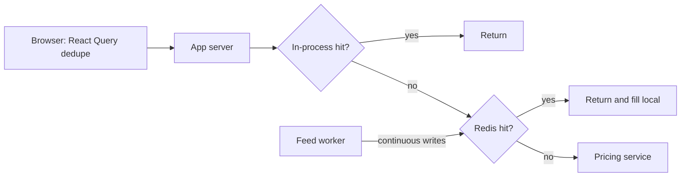

**Trade-offs:** Each cache layer adds a little staleness. For display, 1–2 seconds is usually fine. For order placement, never trust a cached price: re-check at execution time on the server.

**What interviewers listen for:**
- You separate shared data (prices) from per-user data (holdings).
- You mention stampede or thundering herd protection.
- You say cached prices are for display only.
- Red flag: caching the whole personalised page response with one key.

#### Q: [Mid] We cache account balances with cache-aside. After a transfer, users sometimes see the old balance for up to 5 minutes. Why, and how would you fix it?

**Short answer:** Either the write path does not invalidate the cache key, or it invalidates the wrong key, or a race re-fills the cache with the old value after the delete. The 5 minutes matches the TTL, so the cache is simply expiring rather than being invalidated. Fix the invalidation and shorten the TTL for balances.

**Clarify first:**
- Which keys hold balances? One per account, one per user's account list, or both?
- Does the transfer happen in a different service that does not know about the cache?

**Diagnose:**
1. Search the transfer code path for cache deletes. Often the "account list" key is deleted but the "account detail" key is not, or vice versa.
2. Log cache sets with timestamps and the version of the data. Look for a set that happens after the delete with an older value (a slow reader that read the database before the write committed).

**Solution:**
- Delete every affected key after the database commit, not before.
- If the transfer runs in another service, publish a `BalanceChanged` event and have the cache owner invalidate on it.
- Store a version (for example `updated_at` or a row version) with the cached value and refuse to overwrite a newer version with an older one.
- Shorten the TTL for balances to 15–30 seconds as a safety net, and after a user's own transfer, have the UI refetch (`queryClient.invalidateQueries(['accounts'])`).

**Trade-offs:** More invalidation logic and events add coupling. Very short TTLs raise database load.

**What interviewers listen for:**
- Delete after commit, and the read-before-write race.
- Red flag: "just remove the cache" without measuring the load impact.

#### Q: [Staff] Redis is our cache for 40 services. It went down for 3 minutes and the primary database fell over too. How do you design so a cache outage does not take down the database?

**Short answer:** The database was sized for the cache hit rate, so losing the cache sent maybe 10 times the normal load to it. Design for cache failure: timeouts and circuit breakers on cache calls, request coalescing, limited concurrency to the database, serving stale data or degraded responses, and a highly available Redis setup with replicas across zones.

**Clarify first:**
- What was the normal hit rate and how much traffic did the database see during the outage?
- Was Redis a single node? Clustered with replicas? Managed?
- Which services are critical (payments) and which can degrade (recommendations)?

**Solution:**
- **Redis availability:** a replicated, multi-AZ managed cluster with automatic failover. This lowers the chance of an outage; it does not remove it.
- **Fail fast:** a short timeout (for example 50 ms) on cache calls and a circuit breaker so you do not wait on a dead cache.
- **Protect the database:** a concurrency limit (bulkhead) for database queries per service, so overflow requests fail quickly or get degraded data instead of piling up connections.
- **Request coalescing:** single-flight per key so 1,000 identical misses become one query.
- **Degrade gracefully:** non-critical features return defaults; critical reads go to read replicas.
- **Warm-up:** when Redis returns empty, ramp traffic back gradually instead of all keys missing at once.
- **Capacity test:** run a game day where you disable the cache in staging and observe the database.

**Trade-offs:** Bulkheads and degraded responses mean some users see errors or missing features during the outage, which is better than everyone seeing a total outage.

**What interviewers listen for:**
- "The cache became a hidden dependency for capacity" as the root insight.
- Concrete protections, plus testing them.
- Red flag: only "add more Redis replicas".

## 3. Storing data

### Relational databases (SQL)

**What it is:** Databases that store data in tables with rows and columns, linked by keys, and queried with SQL. Examples: PostgreSQL, MySQL, SQL Server, Oracle, and managed versions such as Amazon RDS and Aurora.

**Why it's used:** Most business data is relational: a customer has accounts, an account has transactions. SQL databases enforce structure (schemas, foreign keys, constraints) and give you ACID transactions, so a transfer either fully happens or not at all.

**How it works:**
- **ACID:** Atomic (all or nothing), Consistent (constraints hold), Isolated (concurrent transactions do not see each other's half-done work), Durable (committed data survives a crash).
- **Indexes** (usually B-trees) make lookups fast at the cost of slower writes and more storage.
- **Scaling reads:** read replicas copy data asynchronously from the primary.
- **Scaling writes:** a bigger machine first (vertical), then partitioning or sharding by a key such as `customer_id`.

```sql
BEGIN;
UPDATE accounts SET balance_cents = balance_cents - 5000
  WHERE id = 'acc_1' AND balance_cents >= 5000;
UPDATE accounts SET balance_cents = balance_cents + 5000 WHERE id = 'acc_2';
INSERT INTO transfers (id, from_account, to_account, amount_cents)
  VALUES ('tr_789', 'acc_1', 'acc_2', 5000);
COMMIT;
```

**Pros:**
- Strong consistency, transactions, joins, mature tooling, flexible ad-hoc queries.

**Cons / limits:**
- Write scaling beyond one primary is hard (sharding is a big project).
- Schema changes on huge tables need care.

**Use it when / avoid when:**
- Default choice for business data, especially money.
- Consider alternatives for massive write throughput with simple access patterns, or unstructured/variable data at very large scale.

> **Interview tip:** "I would start with PostgreSQL unless a requirement rules it out" is a strong, defensible default. Then name the requirement that would make you change.

### NoSQL database types

**What it is:** "Not only SQL" databases that give up some relational features (joins, flexible queries, sometimes strong consistency) in exchange for easier horizontal scaling, flexible schemas, or a data model that fits a specific problem.

**Why it's used:** Some problems do not fit tables well, or need more scale than one primary can give.

**How it works:**

| Type | Data model | Examples | Good for | Weak at |
|---|---|---|---|---|
| Key-value | `key -> value` | DynamoDB, Redis, etcd | Sessions, carts, idempotency keys, lookups by id at huge scale | Queries by anything other than the key |
| Document | JSON-like documents | MongoDB, Couchbase, DynamoDB (also), Firestore | Varied shapes: product catalogs, user profiles, CMS content | Many-to-many relations, cross-document transactions (supported but costlier) |
| Wide-column | Rows with many dynamic columns, partitioned by key | Apache Cassandra, ScyllaDB, HBase, Bigtable | Huge write volumes: messages, activity logs, IoT, time-ordered data per key | Ad-hoc queries, joins |
| Graph | Nodes and edges | Neo4j, Amazon Neptune | Relationships: fraud rings, social graphs, recommendations | Bulk aggregations over everything |
| Time-series | Timestamped points | TimescaleDB, InfluxDB, Amazon Timestream, Prometheus | Metrics, prices over time, sensor data, downsampling and retention | General business data |

The key idea for most NoSQL stores: you design the table around your queries (access patterns) first, because you cannot cheaply query by arbitrary fields later.

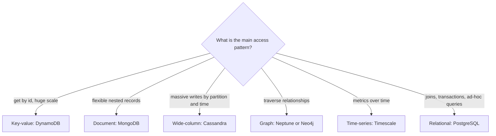

**Pros:**
- Horizontal scale built-in, predictable latency at scale (DynamoDB), schema flexibility.

**Cons / limits:**
- Changing access patterns later is painful. Many stores default to eventual consistency.
- Analytics and reporting usually need data copied elsewhere.

**Use it when / avoid when:**
- Use it when access patterns are known, simple and very high volume, or the data model is a natural fit (graph, time-series).
- Avoid it as a trendy default for ordinary relational business data.

### Search engines: Elasticsearch and OpenSearch

**What it is:** Databases built for full-text search and filtering: "find transactions where the description contains 'coffee' from last month, ranked by relevance". OpenSearch is the open-source fork of Elasticsearch led by AWS (now under the Linux Foundation).

**Why it's used:** SQL `LIKE '%coffee%'` cannot use a normal index and scans the whole table. Search engines answer text queries over billions of documents in milliseconds, with typo tolerance, relevance ranking and facets (counts per category).

**How it works:** An **inverted index** maps each word to the list of documents containing it, like the index at the back of a book.

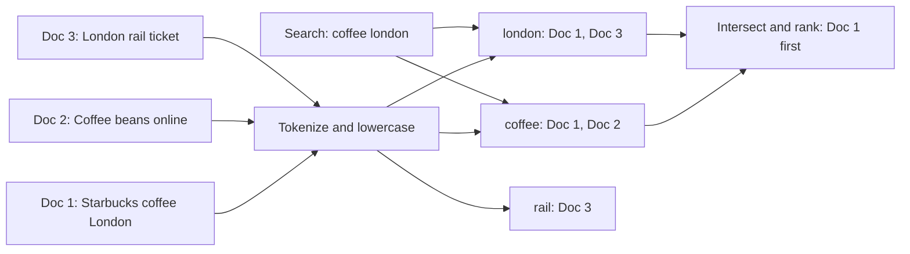

The usual architecture: the relational database stays the source of truth, and changes are copied into the search index (via change data capture or events). The index is eventually consistent, often seconds behind.

**Pros:**
- Fast full-text search, relevance, fuzzy matching, aggregations, log analytics.

**Cons / limits:**
- Not a primary store for critical data: weaker transactional guarantees, and reindexing is a common operation.
- Needs memory and operational care (shards, mappings).

**Use it when / avoid when:**
- Use it for text search, autocomplete, faceted filters, log search.
- Avoid it as the system of record. For modest needs, PostgreSQL full-text search (`tsvector`, GIN index) or trigram indexes (`pg_trgm`) may be enough.

### Object storage

**What it is:** Storage for files ("objects") addressed by a key in a bucket, accessed over HTTP. Amazon S3, Google Cloud Storage, Azure Blob Storage, Cloudflare R2.

**Why it's used:** Databases are bad at storing large files. Object storage is cheap, extremely durable (S3 is designed for 11 nines of durability), and scales without limits you will practically hit.

**How it works:** `PUT s3://statements-bucket/2026/09/acc_1.pdf` stores a file; `GET` reads it. You keep only the key and metadata in your database. There are no in-place edits: you overwrite the whole object. Storage classes trade price for retrieval speed (frequently accessed, infrequent, archive). Lifecycle rules move old objects to cheaper classes automatically.

**Pros:**
- Cheap, durable, scalable, integrates with CDNs and analytics tools.

**Cons / limits:**
- Higher per-request latency than a local disk; not a file system (no cheap rename or append).
- Bucket permissions are a classic source of data leaks.

**Use it when / avoid when:**
- Use it for statements, receipts, uploads, backups, logs, data lake files, static site hosting.
- Avoid it for small, frequently updated records.

### Blob storage plus CDN for media and user uploads

**What it is:** The standard pattern for files users upload or download: store them in object storage, upload directly from the browser using a pre-signed URL, and serve them through a CDN.

**Why it's used:** If uploads stream through your app servers, a 20 MB cheque image ties up a server connection and bandwidth. Direct upload removes the app server from the data path.

**How it works:**

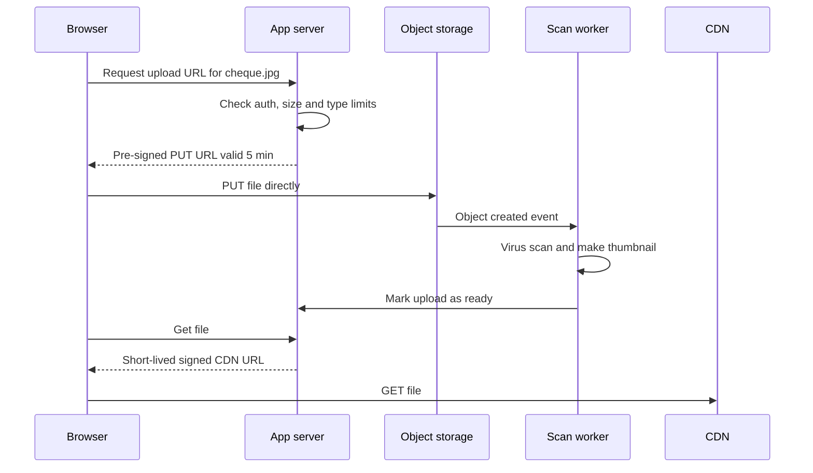

```ts
import { S3Client, PutObjectCommand } from '@aws-sdk/client-s3';
import { getSignedUrl } from '@aws-sdk/s3-request-presigner';

const s3 = new S3Client({ region: 'eu-west-2' });

export async function createUploadUrl(userId: string, contentType: string) {
  const key = `uploads/${userId}/${crypto.randomUUID()}`;
  const url = await getSignedUrl(
    s3,
    new PutObjectCommand({ Bucket: 'bank-uploads', Key: key, ContentType: contentType }),
    { expiresIn: 300 },
  );
  return { url, key };
}
```

**Pros:**
- App servers stay small, uploads scale with S3, downloads are fast via CDN.

**Cons / limits:**
- You must validate after upload (type, size, malware) because the client sent the bytes directly.
- Private files need signed URLs or signed cookies at the CDN.

**Use it when / avoid when:**
- Use it for any file larger than a few hundred KB.
- Avoid public buckets for private documents. Keep the bucket private and grant access only via signed URLs.

#### Q: [Senior] Choose a database for a payments ledger that records every debit and credit for 5 million customers, about 2,000 writes per second at peak, and must never lose or double-count money.

**Short answer:** A relational database, PostgreSQL (or Aurora PostgreSQL), with an append-only, double-entry ledger table, strict constraints, and idempotency keys. 2,000 writes per second is well within what a properly sized PostgreSQL primary handles. I would only consider a distributed SQL database (such as CockroachDB, YugabyteDB, Spanner or Aurora DSQL) if we needed multi-region active writes.

**Clarify first:**
- Peak vs average write rate, and growth over 3 years?
- Single region or multi-region? What RPO (data loss allowed) and RTO (downtime allowed)?
- What queries: balance per account, statement per month, audit by date?
- Regulatory retention: 7 years or more?

**Solution:**

```sql
CREATE TABLE ledger_entries (
  id              BIGSERIAL PRIMARY KEY,
  journal_id      UUID        NOT NULL,       -- groups the debit and credit legs
  account_id      UUID        NOT NULL REFERENCES accounts(id),
  amount_cents    BIGINT      NOT NULL CHECK (amount_cents <> 0), -- negative = debit
  currency        CHAR(3)     NOT NULL,
  idempotency_key TEXT        NOT NULL,
  created_at      TIMESTAMPTZ NOT NULL DEFAULT now()
);
CREATE UNIQUE INDEX ux_ledger_idem ON ledger_entries (idempotency_key, account_id);
CREATE INDEX ix_ledger_account_time ON ledger_entries (account_id, created_at DESC);
```

- Append-only: never `UPDATE` an entry; corrections are new reversing entries.
- Every journal sums to zero (debits equal credits); enforce in the same transaction.
- Unique idempotency key prevents double posting on retries.
- Keep a `balances` table updated in the same transaction for fast reads, or a materialised snapshot plus recent entries.
- Partition `ledger_entries` by month for retention and fast statement queries.
- Synchronous replica in another availability zone for RPO near zero; read replicas for statements and reporting.

**Trade-offs:** One primary limits write scale, but that limit is far above this load. Distributed SQL gives multi-region writes but adds latency per transaction and cost. DynamoDB can do it with transactions, but ad-hoc audit queries and reporting become harder.

**What interviewers listen for:**
- ACID, append-only, double-entry, idempotency.
- Numbers checked against realistic capacity instead of assuming "big means NoSQL".
- Red flag: choosing an eventually consistent store for balances without discussing it.

#### Q: [Mid] We need to store a per-user activity feed (logins, card taps, notifications): 50,000 writes per second, read as "latest 50 events for user X". Which database?

**Short answer:** This is a high-write, single-key, time-ordered access pattern, which suits a wide-column store like Cassandra/ScyllaDB or a key-value store like DynamoDB, partitioned by user id and sorted by time. Joins and ad-hoc queries are not needed. Events also expire after, say, 90 days, which these stores support with TTLs.

**Clarify first:**
- Retention period? Do we ever query across users (that becomes an analytics job, not this store)?
- Is losing an event acceptable? (Usually yes for a feed; not for the ledger.)

**Solution:**
- DynamoDB: partition key `userId`, sort key `eventTime#eventId`, TTL attribute for expiry. Query with `ScanIndexForward: false, Limit: 50`.
- Cassandra equivalent:

```sql
CREATE TABLE activity_by_user (
  user_id    uuid,
  event_time timestamp,
  event_id   timeuuid,
  type       text,
  payload    text,
  PRIMARY KEY ((user_id), event_time, event_id)
) WITH CLUSTERING ORDER BY (event_time DESC, event_id DESC)
  AND default_time_to_live = 7776000; -- 90 days
```

- Copy events to a data lake for analytics.

**Trade-offs:** You cannot later ask "all card taps over 1,000 dollars across all users" cheaply. Very active users can create hot partitions; bucket the partition key by month if needed.

**What interviewers listen for:**
- Start from the access pattern.
- Mention hot partitions and TTL.
- Red flag: picking MongoDB or Cassandra "because it scales" with no data model.

#### Q: [Senior] Users want to search their 10 years of transactions by merchant name, notes and amount, with typo tolerance. The current SQL LIKE query takes 8 seconds. What do you do?

**Short answer:** First check whether PostgreSQL can do it with the right index (trigram or full-text) since search is scoped to one user. If we need typo tolerance, relevance ranking and facets at scale, add OpenSearch/Elasticsearch as a secondary index fed from the database by change data capture, and keep PostgreSQL as the source of truth.

**Clarify first:**
- How many transactions per user (thousands or millions)? Total across users?
- Must new transactions be searchable instantly, or within seconds?
- Which filters: date range, amount range, category?

**Diagnose:** `EXPLAIN ANALYZE` the query. `LIKE '%star%'` with a leading wildcard cannot use a B-tree index, so it scans. Check whether it filters by `user_id` first.

**Solution:**
1. Cheapest: make sure the query filters by `user_id` with an index, so it scans only one user's rows.
2. Add `pg_trgm` with a GIN index on merchant and notes for substring and fuzzy matching:

```sql
CREATE EXTENSION IF NOT EXISTS pg_trgm;
CREATE INDEX ix_tx_merchant_trgm ON transactions USING gin (merchant_name gin_trgm_ops);

SELECT id, merchant_name, amount_cents, posted_at
FROM transactions
WHERE user_id = $1 AND merchant_name % $2   -- similarity match
ORDER BY similarity(merchant_name, $2) DESC
LIMIT 50;
```

3. If that is not enough: OpenSearch index with documents per transaction, routed by `userId` so each query hits one shard. Pipeline: database, then CDC (Debezium or DMS), then Kafka, then an indexer, then OpenSearch.

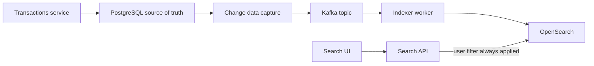

**Trade-offs:** OpenSearch adds a cluster to run, a few seconds of index lag, and a second place where permission bugs can leak data. Always filter by the user on the server.

**What interviewers listen for:**
- Try the simple option first and measure.
- Source of truth stays in SQL; search is a derived view.
- Red flag: letting the client send the user filter.

#### Q: [Mid] Where would you store monthly PDF statements for 3 million customers, kept for 7 years?

**Short answer:** In object storage (S3), with the database storing only metadata and the object key. A lifecycle rule moves statements older than about a year to cheaper infrequent-access or archive tiers. Users download through short-lived pre-signed URLs, never from a public bucket.

**Clarify first:**
- How often are old statements viewed? Must they be available instantly or can retrieval take hours?
- Regulatory needs: immutability (write once, read many)?

**Solution:**
- Key: `statements/{customerId}/{yyyy}/{mm}.pdf`. Bucket private, encryption at rest with a managed key, versioning on.
- S3 Object Lock in compliance mode if regulators require that statements cannot be changed or deleted.
- Lifecycle: Standard for 90 days, then Standard-IA, then Glacier Instant Retrieval (still millisecond access, cheaper storage).
- Download: API checks ownership, returns a pre-signed URL valid for a few minutes.

**Trade-offs:** Archive tiers have retrieval fees and, for deep archive, delays. Pick the tier based on how often users really open old statements.

**What interviewers listen for:**
- Files in object storage, metadata in the database.
- Access control via signed URLs, lifecycle for cost.
- Red flag: storing PDFs as BLOBs in the main database.

## 4. Asynchronous messaging

### Message queues: SQS and RabbitMQ

**What it is:** A buffer where producers put messages (tasks) and consumers take them off and process them. Each message is handled by one consumer. Like a ticket queue at a deli counter: one ticket, one server.

**Why it's used:** To decouple slow or unreliable work from the user request. When a user requests a statement export, the API puts "generate export for user 42" on a queue and returns `202 Accepted` immediately. Workers process it at their own pace. If workers crash, messages wait instead of being lost. Queues also smooth spikes: 10,000 requests in a minute become a backlog that workers drain.

**How it works:**
1. Producer sends a message.
2. A consumer receives it. In SQS the message becomes invisible for a "visibility timeout".
3. The consumer processes it and deletes (acknowledges) it.
4. If the consumer crashes or does not delete in time, the message reappears and another consumer retries it.
5. After N failed attempts it moves to a dead-letter queue (DLQ) for investigation.

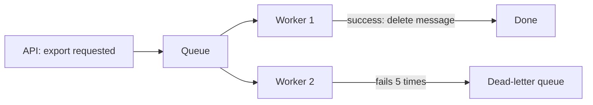

Delivery semantics: most queues are **at-least-once**. A message can be delivered twice (a worker finished but crashed before acknowledging). Your consumers must be **idempotent**: processing the same message twice has the same effect as once. SQS FIFO queues add ordering per message group and deduplication within a time window; SQS Standard is near-unlimited throughput with best-effort ordering. RabbitMQ adds flexible routing (exchanges, routing keys) and is self-managed or available as Amazon MQ.

**Pros:**
- Decoupling, load levelling, retries and DLQs, easy horizontal scaling of workers.

**Cons / limits:**
- Messages are gone once consumed: you cannot replay history.
- Eventual completion: the user must be told "processing" and notified later.

**Use it when / avoid when:**
- Use it for background jobs: emails, PDF generation, webhooks, image processing, payment provider calls with retries.
- Avoid it when several independent systems all need the same message (use pub/sub) or you need to replay events (use a stream).

### Pub/sub: SNS and topics

**What it is:** Publish/subscribe. A publisher sends a message to a topic, and every subscriber gets its own copy. Like a newsletter: one send, many readers.

**Why it's used:** When something happens (`PaymentCompleted`), several unrelated systems care: notifications, fraud, rewards points, analytics. The payments service should not call each of them directly or even know they exist.

**How it works:** Subscribers register with the topic. In AWS, a common pattern is SNS fan-out to several SQS queues, so each subscriber gets a durable queue with its own retries. Amazon EventBridge is a related service: an event bus with content-based routing rules, schema registry and many SaaS and AWS sources.

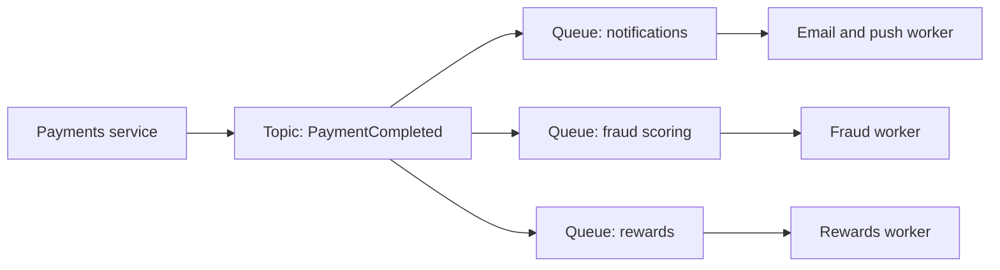

**Pros:**
- Loose coupling; adding a subscriber needs no change to the publisher.

**Cons / limits:**
- Plain pub/sub (SNS alone, Redis pub/sub) does not keep messages for offline subscribers. Pair it with queues for durability.
- Harder to trace "what happens when X" because the flow is spread across subscribers.

**Use it when / avoid when:**
- Use it for fan-out of domain events to independent consumers.
- Avoid it for commands meant for exactly one handler (use a queue).

### Event streams: Kafka and Kinesis

**What it is:** An append-only, ordered log of events that is kept for a period (days, or forever). Consumers read at their own position (offset) and can re-read from the past. Like a ledger book anyone can read from any page, rather than a stack of tickets that disappear when taken.

**Why it's used:** High-throughput event pipelines where order matters per key, several consumer groups read the same data, and replay is valuable: rebuilding a search index, backfilling a new analytics model, auditing.

**How it works:**
- A topic is split into **partitions**. Events with the same key (for example `accountId`) go to the same partition, so they stay in order.
- A **consumer group** shares the partitions among its members; each partition is read by one member of the group at a time. Different groups read independently.
- Retention is time- or size-based, or infinite with compaction (keep the latest event per key).
- Apache Kafka (self-managed, Confluent, or Amazon MSK) and Amazon Kinesis Data Streams (shards instead of partitions) are the common choices.

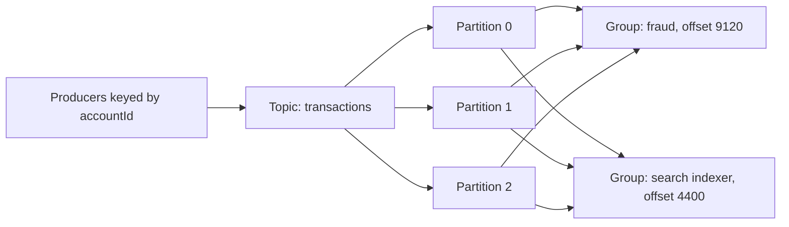

| | Queue: SQS, RabbitMQ | Pub/sub: SNS, EventBridge | Stream: Kafka, Kinesis |
|---|---|---|---|
| Who gets a message | One consumer | Every subscriber | Every consumer group, each at its own pace |
| After consumption | Deleted | Delivered then gone (unless queued) | Kept until retention ends |
| Replay | No | No (EventBridge has archive and replay) | Yes, from any offset |
| Ordering | Best effort, or FIFO per group | Generally not guaranteed (SNS FIFO exists) | Strict per partition or shard |
| Scaling consumers | Add workers freely | Add subscribers | Up to the number of partitions per group |
| Typical use | Background jobs, task distribution | Fan-out notifications, integration events | Event pipelines, CDC, analytics, event sourcing |
| Operations | Very low (SQS is fully managed) | Very low | Higher, even when managed |

**Pros:**
- Replay, ordering per key, very high throughput, many independent consumers.

**Cons / limits:**
- More concepts and operations (partitions, rebalancing, offsets, retention).
- Parallelism per group is capped by partition count. One slow message blocks its partition.

**Use it when / avoid when:**
- Use it for high-volume event pipelines and when replay or multiple consumers matter.
- Avoid it for a simple job queue of a few hundred tasks per minute; SQS is simpler.

#### Q: [Senior] Card transactions arrive at 5,000 per second. Fraud scoring, the search index, rewards and the data lake all need them, and the fraud team wants to replay last week's data against a new model. Queue or stream?

**Short answer:** A stream (Kafka or Kinesis), partitioned by account or card id. Several independent consumers need every event, order per card matters for fraud rules, and replay is an explicit requirement. A queue deletes messages after one consumer handles them, so it fails two of the three requirements.

**Clarify first:**
- Must fraud decisions happen before authorisation (synchronous, in the payment path) or after (asynchronous review)?
- How long must data be replayable: 7 days, 30 days?
- Is ordering needed globally or only per card?

**Solution:**
- Topic `card-transactions`, key `cardId`, enough partitions for peak throughput and consumer parallelism (for example 48), retention 14 days.
- Consumer groups: `fraud-scoring`, `search-indexer`, `rewards`, `lake-sink` (Kafka Connect or Kinesis Firehose to S3).
- Replay: start a new consumer group `fraud-model-v2` from the offset at last Monday, writing results to a separate table for comparison.
- Rewards needs exactly-once effects: make it idempotent by storing processed transaction ids.
- Synchronous fraud checks in the authorisation path stay a direct low-latency API call; the stream feeds asynchronous scoring and model training.

**Trade-offs:** Kafka is more to run than SQS; Kinesis is managed but has per-shard limits to plan around. A partition key that is too coarse (merchant id) creates hot partitions.

**What interviewers listen for:**
- Matching requirements (fan-out, replay, ordering) to the tool.
- Partition key choice and idempotent consumers.
- Red flag: "Kafka guarantees exactly once so we don't need idempotency" (its exactly-once applies to Kafka-to-Kafka processing, not to your database writes unless you design for it).

#### Q: [Mid] Sending a payment confirmation email inside the payment API call makes it slow and sometimes fail when the email provider is down. How would you fix it?

**Short answer:** Take the email out of the request path. The API records the payment, writes a "send confirmation" message to a queue (ideally via an outbox so the two cannot get out of sync), and returns. A worker sends the email with retries and a dead-letter queue.

**Solution:**
- API: commit the payment, enqueue `{ type: 'payment_confirmation', paymentId }`.
- Worker: load the payment, send the email, use `paymentId` as an idempotency key with the email provider or record "sent" in a table to avoid duplicates.
- Retries with exponential backoff; after 5 failures, DLQ plus an alert.

```ts
// SQS consumer (simplified)
export async function handle(message: { paymentId: string }) {
  const already = await db.emailLog.findUnique({ where: { paymentId: message.paymentId } });
  if (already) return; // idempotent: duplicate delivery

  const payment = await db.payments.get(message.paymentId);
  await emailProvider.send({ to: payment.email, template: 'payment-confirmation', data: payment });
  await db.emailLog.create({ data: { paymentId: message.paymentId, sentAt: new Date() } });
}
```

**Trade-offs:** The email arrives a few seconds later and you must monitor queue depth and the DLQ. There is still a tiny window where the email sends but the log write fails, causing a duplicate; that is acceptable for email but would not be for money.

**What interviewers listen for:**
- Synchronous vs asynchronous thinking: what must the user wait for?
- At-least-once delivery and idempotency.
- Red flag: firing the email in a `setTimeout` or an unawaited promise in the API process.

## 5. Real-time and coordination

### WebSockets, Server-Sent Events and long polling

**What it is:** Three ways for a server to push updates to a browser without the user refreshing.

**Why it's used:** Live prices, payment status changes, chat, notifications. Plain polling (`GET /status` every 2 seconds) wastes requests and is still delayed.

**How it works:**

| | Long polling | Server-Sent Events (SSE) | WebSockets |
|---|---|---|---|
| Direction | Server to client (one response per request) | Server to client | Both directions |
| Transport | Normal HTTP requests held open until data or timeout | One long HTTP response, `text/event-stream` | HTTP upgrade to a separate protocol |
| Reconnect | Client sends next request | Built in, with `Last-Event-ID` | You build it |
| Through proxies and firewalls | Easiest | Easy (plain HTTP) | Usually fine, sometimes blocked |
| Good for | Fallback, low-frequency updates | Live feeds, notifications, AI token streaming | Chat, collaborative editing, trading terminals |

```ts
// SSE in the browser
const source = new EventSource('/api/payments/pay_123/events', { withCredentials: true });
source.addEventListener('status', (e) => {
  const { status } = JSON.parse((e as MessageEvent).data) as { status: string };
  setStatus(status);
  if (status === 'settled' || status === 'failed') source.close();
});
```

Scaling either push model: each server holds many open connections, so connections are spread across servers and updates must reach whichever server holds a user's connection. A pub/sub layer (Redis pub/sub, a managed service like AWS API Gateway WebSocket APIs or AppSync, or a vendor) delivers each update to the right servers.

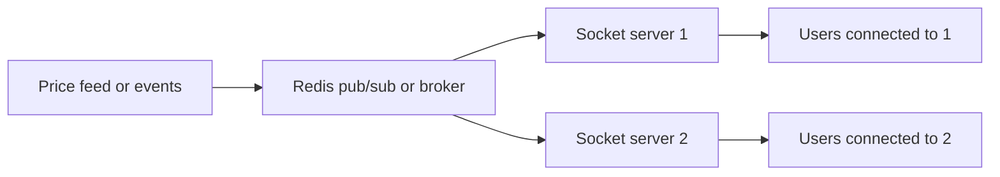

**Pros:**
- Low latency updates, far fewer wasted requests than short polling.

**Cons / limits:**
- Long-lived connections complicate load balancing, deploys (connections must drain) and autoscaling.
- Mobile networks drop connections, so clients need reconnect and resync logic.

**Use it when / avoid when:**
- SSE for one-way server updates. WebSockets when the client also sends frequent messages. Long polling as a fallback.
- Avoid push entirely when updates are rare; polling every 30 seconds may be simpler.

### Service discovery

**What it is:** How one service finds the current network address of another, when instances come and go constantly (autoscaling, deploys, crashes).

**Why it's used:** Hard-coding `10.0.3.17:8080` breaks the moment that container is replaced.

**How it works:**
- **Server-side discovery:** the caller talks to a stable name (a load balancer or a Kubernetes Service such as `payments.default.svc.cluster.local`), and that layer knows the live instances.
- **Client-side discovery:** the caller asks a registry (Consul, AWS Cloud Map, Eureka) for the list of healthy instances and picks one itself.
- Instances register on start, send heartbeats, and are removed when they stop or fail health checks.
- In Kubernetes, DNS plus Services handle this for you; a service mesh adds smarter routing on top.

**Pros:**
- Dynamic scaling without config changes.

**Cons / limits:**
- The registry is critical infrastructure. Stale entries cause errors until health checks catch up.

**Use it when / avoid when:**
- Needed as soon as you have several services with changing instances. Usually you get it from your platform (Kubernetes, ECS with Cloud Map, a load balancer).
- Avoid building your own.

### Rate limiter

**What it is:** A guard that limits how many requests a client may make in a time window, for example 100 requests per minute per API key.

**Why it's used:** Protects services from abuse (credential stuffing on login), from one noisy client hurting everyone, and from runaway costs. Also enforces paid plan limits.

**How it works:** Common algorithms:
- **Fixed window:** count per minute. Simple, but allows bursts at window edges (100 at 12:00:59 and 100 at 12:01:00).
- **Sliding window log or counter:** smooths the edge problem.
- **Token bucket:** a bucket holds up to N tokens and refills at R per second; each request takes one. Allows short bursts up to N with an average rate of R. The most common choice.
- **Leaky bucket:** requests drain at a fixed rate; smooths output.

Where: at the API gateway or edge (per IP, per API key), and inside services for specific actions (5 login attempts per account per 15 minutes). With many servers, counters live in a shared store like Redis so all servers agree.

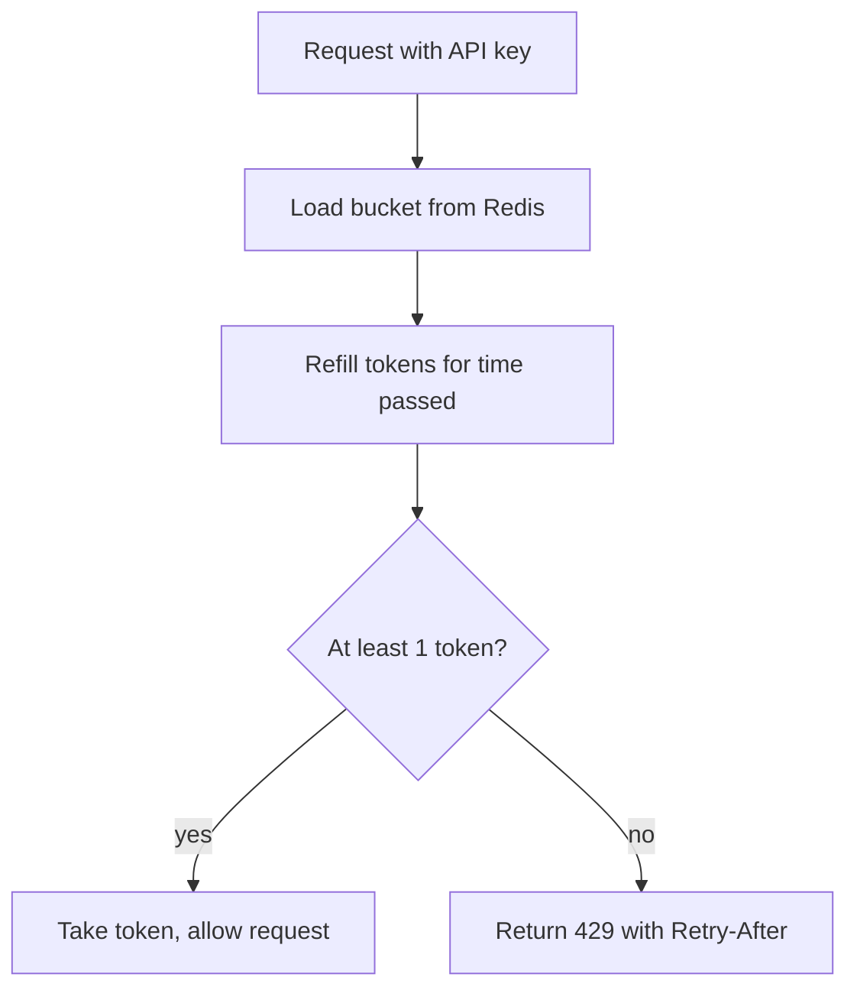

**Pros:**
- Protects availability and cost; fair sharing between clients.

**Cons / limits:**
- Shared counters add a Redis call per request. Limits that are too strict block real users.

**Use it when / avoid when:**
- Use it on every public API and on sensitive actions (login, OTP, password reset, payments).
- Do not rely only on per-IP limits: many real users can share an IP (mobile carriers, offices).

#### Q: [Senior] Design a rate limiter for our public partner API: 1,000 requests per minute per API key, bursts allowed, 30 API servers.

**Short answer:** A token bucket per API key, stored in Redis and updated atomically with a Lua script so all 30 servers share one count. Return `429 Too Many Requests` with `Retry-After` and rate limit headers. Put it at the gateway so every service benefits, and decide in advance whether to fail open or fail closed if Redis is unavailable.

**Clarify first:**
- Is the limit per key, per endpoint, or both? Are some endpoints more expensive?
- How exact must it be? Is it acceptable to allow 2% over the limit briefly?
- What should happen if the rate limit store is down?

**Solution:**

```ts
// Token bucket in Redis, atomic via Lua. capacity = burst size, ratePerSec = refill rate.
const script = `
local key = KEYS[1]
local capacity = tonumber(ARGV[1])
local rate = tonumber(ARGV[2])
local now = tonumber(ARGV[3])
local data = redis.call('HMGET', key, 'tokens', 'ts')
local tokens = tonumber(data[1]) or capacity
local ts = tonumber(data[2]) or now
tokens = math.min(capacity, tokens + (now - ts) / 1000 * rate)
local allowed = 0
if tokens >= 1 then
  tokens = tokens - 1
  allowed = 1
end
redis.call('HSET', key, 'tokens', tokens, 'ts', now)
redis.call('PEXPIRE', key, math.ceil(capacity / rate * 1000) + 1000)
return { allowed, math.floor(tokens) }
`;

export async function allow(apiKey: string): Promise<{ allowed: boolean; remaining: number }> {
  const [allowed, remaining] = (await redis.eval(
    script, 1, `rl:${apiKey}`, 200, 1000 / 60, Date.now(),
  )) as [number, number];
  return { allowed: allowed === 1, remaining };
}
```

- Capacity 200 allows bursts; refill rate 1000/60 per second gives 1,000 per minute on average.
- Response headers: `RateLimit-Limit`, `RateLimit-Remaining`, `Retry-After` (an IETF draft standardises `RateLimit` headers; many APIs still use `X-RateLimit-*`).
- Fail open (allow) for normal endpoints if Redis is down, with an alert; fail closed for sensitive endpoints such as login.
- Many managed gateways (AWS API Gateway usage plans, Kong, Envoy) provide this; use them before writing your own.

**Trade-offs:** Using the app server's clock is fine with synchronized clocks; using Redis `TIME` avoids skew. A Redis round trip per request adds about a millisecond. Local in-memory pre-limiting can reduce Redis calls at the cost of accuracy.

**What interviewers listen for:**
- Algorithm choice with reason (bursts), atomicity across servers, client-facing headers.
- Fail-open vs fail-closed decision.
- Red flag: a per-server in-memory counter with 30 servers (each allows 1,000, total 30,000).

#### Q: [Mid] A payment's status changes from pending to settled a few seconds to a few minutes after submission. How should the UI learn about the change: polling, SSE or WebSockets?

**Short answer:** SSE or polling with backoff. The data flows one way (server to client), updates are few, and the page is open for a short time. SSE gives instant updates with built-in reconnect over plain HTTP. Polling every 2 seconds, backing off to 10, is simpler and perfectly fine if the infrastructure does not support long-lived connections. WebSockets are overkill here.

**Clarify first:**
- How many users watch payments at once? How long do they stay on the page?
- Do we also need to notify them after they leave (push notification or email)?

**Solution:**
- Polling with React Query: `refetchInterval: (query) => (isFinal(query.state.data) ? false : 3000)`.
- SSE endpoint that subscribes to `payment:{id}` events in Redis pub/sub and streams `status` events, closing when final.
- Either way, the server checks the user owns the payment.

**Trade-offs:** Polling costs extra requests but no connection management. SSE needs proxies configured not to buffer responses and idle timeouts above your heartbeat interval.

**What interviewers listen for:**
- Picking the simplest tool that meets the requirement.
- Red flag: choosing WebSockets by reflex for one-way, low-frequency updates.

## 6. Processing and analysing data

### Batch vs stream processing

**What it is:** Batch processing handles a large, bounded set of data in one job ("process all of yesterday's transactions at 2 a.m."). Stream processing handles each event continuously as it arrives ("score this transaction within 200 ms").

**Why it's used:** Different questions need different freshness. Monthly statements, interest calculations and regulatory reports are naturally batch. Fraud alerts, live dashboards and spending notifications need streams.

**How it works:**
- Batch tools: Apache Spark, AWS Glue, AWS Batch, dbt for SQL transformations in a warehouse, scheduled jobs.
- Stream tools: Apache Flink (also Amazon Managed Service for Apache Flink), Kafka Streams, Spark Structured Streaming, consumers of Kinesis.
- Streams need concepts batch does not: windows (count per 5 minutes), event time vs processing time, late events, state.

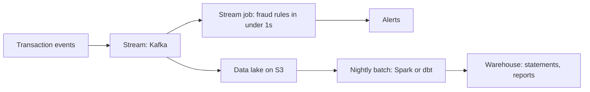

| | Batch | Stream |
|---|---|---|
| Latency | Minutes to hours | Milliseconds to seconds |
| Data | Bounded, complete | Unbounded, may arrive late or out of order |
| Simplicity | Easier to reason about and re-run | Harder: state, windows, exactly-once concerns |
| Cost | Efficient bulk compute | Always-on resources |
| Examples | Statements, reconciliation, ML training | Fraud alerts, live metrics, notifications |

**Pros:**
- Batch: simple, re-runnable, cheap. Stream: fresh results.

**Cons / limits:**
- Batch: stale by design. Stream: operationally harder and harder to correct mistakes.

**Use it when / avoid when:**
- Use batch unless the business value really depends on freshness.
- Many systems run both: streams for fast approximate answers, batch to produce the correct official numbers.

### Data warehouse vs data lake

**What it is:** A data warehouse is a database optimised for analytics over structured, cleaned data (Snowflake, BigQuery, Amazon Redshift). A data lake is cheap object storage holding raw data of any shape (JSON events, CSVs, Parquet files), queried by engines such as Athena, Trino or Spark. A "lakehouse" adds table formats (Apache Iceberg, Delta Lake, Apache Hudi) on top of a lake so it supports transactions and schema evolution like a warehouse.

**Why it's used:** Analytics queries ("total card spend by category per month for 5 years") scan huge amounts of data and would hurt the production database. You copy data out into a system built for it.

**How it works:**
- Warehouses use columnar storage: reading one column across a billion rows is fast because the column's values are stored together and compress well.
- Lakes store files in object storage, usually in columnar formats (Parquet), partitioned by date. Compute is separate and you pay per query or per cluster.
- ETL (extract, transform, load) cleans before loading; ELT loads raw data first and transforms inside the warehouse (common with dbt).

| | Data warehouse | Data lake |
|---|---|---|
| Data | Structured, modelled, cleaned | Raw, any format |
| Schema | Defined on write | Defined on read |
| Users | Analysts, BI dashboards, finance | Data engineers, data scientists, ML |
| Cost | Higher per TB | Very cheap storage |
| Risk | Rigid, slower to add new sources | Becomes a "data swamp" without cataloguing and governance |

**Pros:**
- Warehouse: fast SQL for business users. Lake: keep everything cheaply, including raw history for future uses.

**Cons / limits:**
- Both are copies, so they lag production. Both need access control for personal data.

**Use it when / avoid when:**
- Start with a warehouse if the main need is BI on known data. Add a lake when raw volume, variety or ML needs grow.
- Never run heavy analytics directly on the production OLTP database.

#### Q: [Senior] Product wants a dashboard of spending by category over the last 3 years, and also an alert within seconds when a customer spends more than their budget. How do you design the data flow?

**Short answer:** Two paths from one source of events. A streaming path handles the near-real-time budget alerts: transaction events on Kafka, a consumer keeps per-customer monthly spend per category and fires alerts. An analytics path lands the same events in a data lake and warehouse, where batch jobs build the 3-year aggregates that the dashboard reads.

**Clarify first:**
- Who views the dashboard: customers (each sees their own) or internal analysts (everyone's data)?
- How accurate must the alert be? Is a rare duplicate or a slightly late alert acceptable?
- How do pending vs posted transactions count toward budgets?

**Solution:**

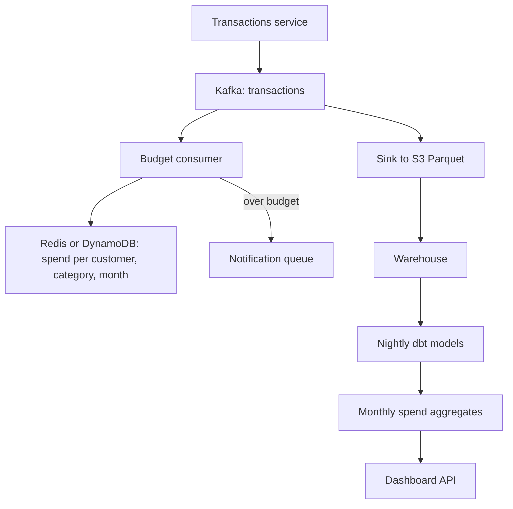

- Budget consumer: idempotent increments keyed by transaction id, so redelivery does not double count. Send each alert once per budget period (store an "alerted" flag).
- Customer-facing dashboard: pre-computed monthly aggregates served from a fast store (PostgreSQL table or DynamoDB), not live warehouse queries per page view.
- Internal analysts query the warehouse directly.

**Trade-offs:** Two pipelines to maintain, and the stream's running totals can drift from the batch totals (late events, reversals). Reconcile daily and treat batch numbers as the official ones.

**What interviewers listen for:**
- Matching latency needs to batch vs stream.
- Not pointing customer traffic at the warehouse.
- Idempotency in the stream path.
- Red flag: running `GROUP BY` over 3 years of data on the production database for each dashboard load.

#### Q: [Staff] Our analysts run reports directly on the production PostgreSQL replica and it keeps lagging, which breaks read-after-write features that also use the replica. What platform do you propose?

**Short answer:** Separate operational reads from analytics. Production replicas serve the app only. Analytics gets its own copy via change data capture into a lake or warehouse, modelled for reporting. That removes analyst load from production, gives analysts faster columnar queries, and lets each side scale independently.

**Clarify first:**
- How fresh must reports be: real-time, hourly, daily?
- What data is sensitive (PII, card data), and who may see it?
- Budget and team skills: is there a data engineering team?

**Diagnose:** Confirm the cause: replication lag graphs vs analyst query times, `pg_stat_activity` for long-running queries, and conflicts between long reads and replication on the replica (hot standby conflicts).

**Solution:**
1. Short term: a dedicated replica only for analysts, with `statement_timeout`, so the app's replicas are protected.
2. Medium term: CDC (Debezium, AWS DMS) into Kafka or straight into S3 as Parquet/Iceberg tables, plus a warehouse (Redshift, Snowflake, BigQuery) or Athena on the lake.
3. Model data with dbt: staging, cleaned, business marts (for example `fct_transactions`, `dim_customer`).
4. Governance: mask or tokenise PII, column-level permissions, a data catalogue (AWS Glue Data Catalog, Lake Formation).
5. Fix the app's read-after-write: read your own writes from the primary, or route by "recently wrote" flag, regardless of analytics.

**Trade-offs:** New platform costs and skills. Reports become minutes-to-hours fresh instead of seconds; agree that with the business.

**What interviewers listen for:**
- Isolate workloads (OLTP vs OLAP) as a principle.
- Mentions governance and PII, not just tools.
- Notices the separate read-after-write bug.
- Red flag: "give analysts a bigger replica" as the final answer.

#### Q: [Staff] You are asked to design the backend for a new bill-pay product from scratch for 2 million users. In 10 minutes, which building blocks would you use and why?

**Short answer:** Start with requirements and numbers, then a simple core: CDN for the React app, an API gateway, a small number of services on managed containers, PostgreSQL for payments and payees, Redis for sessions and rate limits, a queue for calls to the payment network and for notifications, object storage for receipts, and a warehouse fed by CDC for reporting. Each block is justified by a requirement, and I would say what I am deliberately not adding yet.

**Clarify first:**
- Scheduled or instant payments? Which payment rails and their cut-off times?
- Peak load: the 1st of the month, maybe 10 times average.
- Compliance: audit trail, data residency, retention.

**Solution:**
- Back-of-envelope: 2M users, 5 bills each per month = 10M payments per month, roughly 4 per second on average, maybe 100 per second peak around due dates. Small for PostgreSQL.
- **Edge:** CDN plus WAF; API gateway verifies Okta tokens and rate limits.
- **Services:** payees, payments, scheduler, notifications. Could start as a modular monolith.
- **Data:** PostgreSQL with idempotency keys on payment creation; ledger-style status history.
- **Async:** scheduler enqueues due payments into SQS; workers call the payment provider with retries and idempotency; status events to SNS for notifications and analytics.
- **Files:** receipts as PDFs in S3.
- **Real-time:** payment status in the UI via polling or SSE.
- **Analytics:** CDC to warehouse.
- Not adding yet: Kafka, search engine, multi-region active-active. Each has a trigger condition that would justify it.

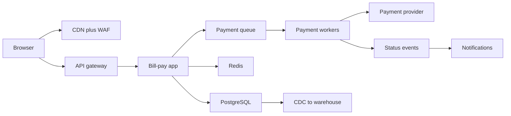

**Trade-offs:** Starting simple means some re-work later (for example extracting services), but avoids paying the cost of distributed systems before the scale exists.

**What interviewers listen for:**
- Numbers before boxes, and boxes tied to requirements.
- Idempotency and retries around external payment calls.
- Saying what you would leave out and when you would add it.
- Red flag: drawing every component from this entry regardless of need.
