## 1. Real-time communication and collaboration

### WebSocket connection gateways

**What it is:** A WebSocket is a long-lived, two-way connection between a client and a server. A connection gateway is a fleet of servers whose only job is to hold millions of these connections and push messages down them.

**Why it's used:** Chat, live prices, collaborative editing and notifications need the server to push data instantly. Polling every few seconds wastes bandwidth and adds delay.

**How it works:** Clients connect through a load balancer to a gateway node. The gateway authenticates the connection, then records "user U is on gateway G" in a presence/session store (Redis). Business services never talk to clients directly: to deliver a message, they look up the user's gateway and send it there (directly, or via pub/sub). Gateways stay thin and mostly stateless apart from the open sockets.

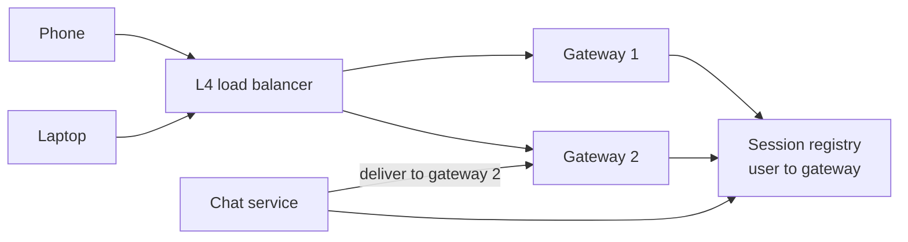
```mermaid
flowchart LR
  C1["Phone"] --> LB["L4 load balancer"]
  C2["Laptop"] --> LB
  LB --> G1["Gateway 1"]
  LB --> G2["Gateway 2"]
  G1 --> SR["Session registry<br/>user to gateway"]
  G2 --> SR
  SVC["Chat service"] --> SR
  SVC -->|"deliver to gateway 2"| G2
```

**Pros:** Low latency push; one connection carries everything; scales horizontally by adding gateways.
**Cons / limits:** Connections are stateful, so deploys must drain and clients must reconnect; mobile networks drop connections often; each node has memory and file-descriptor limits (plan on tens to a few hundred thousand connections per node, depending on tuning).

**Use it when / avoid when:**
- Use for bidirectional, high-frequency, low-latency traffic.
- For one-way server push at low rates, Server-Sent Events or plain long polling may be simpler. For mobile apps in the background, use platform push (APNs, FCM) instead.

### Operational Transformation vs CRDTs

**What it is:** Two families of algorithms that let several people edit the same document at the same time and still end up with the same result. **Operational Transformation (OT)** transforms each incoming edit against concurrent edits so it still makes sense ("insert at 5" becomes "insert at 8" if someone added 3 characters before it). **CRDTs** (Conflict-free Replicated Data Types) give every character or element a unique, ordered identity so any replica can merge edits in any order and converge.

**Why it's used:** Locking the document ("only one editor at a time") is a bad experience. Last-write-wins on the whole document loses work.

**How it works:**

| | OT | CRDT |
|---|---|---|
| Core idea | Transform operations against concurrent ones | Data structure whose merges always commute |
| Needs a central server? | Practically yes: the server orders operations | No: peers can sync in any order, works offline |
| Metadata overhead | Small | Larger: IDs per element, tombstones for deletions (modern libraries compress well) |
| Maturity | Google Docs-style systems have used OT for years | Yjs and Automerge are popular open-source libraries |
| Offline / peer-to-peer | Hard | Natural |
| Correctness | Transform functions are notoriously tricky to get right | Convergence is proven by construction; intent can still surprise |

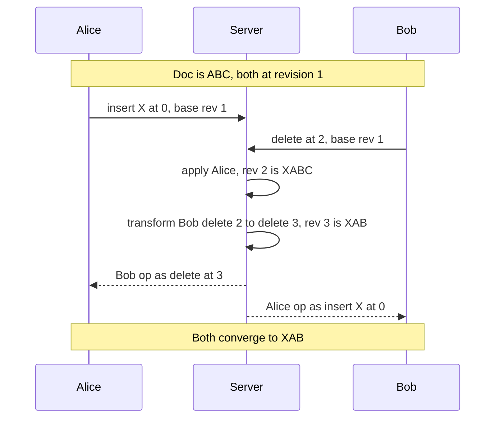
```mermaid
sequenceDiagram
  participant A as Alice
  participant S as Server
  participant B as Bob
  Note over A,B: Doc is ABC, both at revision 1
  A->>S: insert X at 0, base rev 1
  B->>S: delete at 2, base rev 1
  S->>S: apply Alice, rev 2 is XABC
  S->>S: transform Bob delete 2 to delete 3, rev 3 is XAB
  S-->>A: Bob op as delete at 3
  S-->>B: Alice op as insert X at 0
  Note over A,B: Both converge to XAB
```

**Pros:** Both give real-time co-editing without locks.
**Cons / limits:** OT depends on a central sequencer; CRDTs carry more metadata and need garbage collection; both need careful handling of rich text, comments and undo.

**Use it when / avoid when:**
- OT with a central server when you control the server and always-online editing is the norm.
- CRDT (e.g. Yjs) when you want offline support, peer-to-peer, or don't want to implement transform functions.
- For forms or records (not free text), field-level locking or LWW per field is often enough.

#### Q: [Senior] Design a chat app like WhatsApp: 500 million daily active users, one-to-one and group chats (up to 1,000 members), delivery and read receipts, offline delivery, media messages, and messages shown in the same order to everyone in a chat.

**Short answer:** Clients keep a WebSocket to a gateway fleet. A chat service assigns each message a per-conversation sequence number, stores it durably in a wide-column store partitioned by conversation, then fans it out to recipients' gateways if online, or to push notifications plus an inbox if offline. Media goes directly to object storage via pre-signed URLs and the message carries only a reference. Ordering is per conversation, not global.

**Clarify first:**
- Functional: 1:1 and group text, media, receipts (sent, delivered, read), last seen/presence, multi-device? End-to-end encryption?
- Non-functional: delivery latency under ~200–500 ms when both online; no message loss; per-chat ordering; history retention (forever or on-device only?).
- Estimates: 500M DAU × 40 messages/day = 20 billion messages/day ≈ 230k messages/second average, peak maybe 3x ≈ 700k/s. Average message 200 bytes with metadata → ~4 TB/day of text, ~1.5 PB/year before replication (if stored server-side). Concurrent connections: maybe 30–40% online at peak ≈ 150–200M sockets; at ~100k per gateway node that is ~2,000 gateway nodes.

**Solution:**

##### High-level design

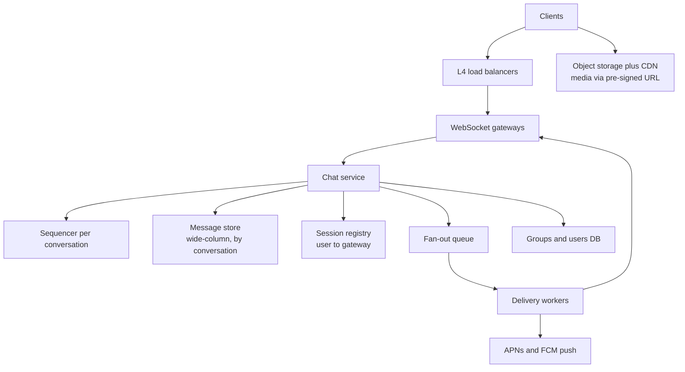
```mermaid
flowchart TD
  CL["Clients"] --> LB["L4 load balancers"]
  LB --> GW["WebSocket gateways"]
  GW --> CS["Chat service"]
  CS --> SEQ["Sequencer per conversation"]
  CS --> MDB["Message store<br/>wide-column, by conversation"]
  CS --> SR["Session registry<br/>user to gateway"]
  CS --> Q["Fan-out queue"]
  Q --> DW["Delivery workers"]
  DW --> GW
  DW --> PUSH["APNs and FCM push"]
  CL --> OBJ["Object storage plus CDN<br/>media via pre-signed URL"]
  CS --> GDB["Groups and users DB"]
```

##### Data model

```sql
-- Wide-column style (Cassandra/ScyllaDB). Shown as CQL-like DDL.
CREATE TABLE messages (
  conversation_id  uuid,
  seq              bigint,          -- per-conversation, monotonically increasing
  message_id       uuid,            -- client-generated, for idempotent retries
  sender_id        uuid,
  body             blob,            -- ciphertext if end-to-end encrypted
  media_ref        text,
  created_at       timestamp,
  PRIMARY KEY ((conversation_id), seq)
) WITH CLUSTERING ORDER BY (seq DESC);

CREATE TABLE user_inbox (            -- what each user still needs to receive
  user_id          uuid,
  conversation_id  uuid,
  last_delivered_seq bigint,
  last_read_seq      bigint,
  PRIMARY KEY ((user_id), conversation_id)
);
```

Group membership lives in a relational or key-value store: `group_members(group_id, user_id, role, joined_at)`.

##### Key flow: send and deliver

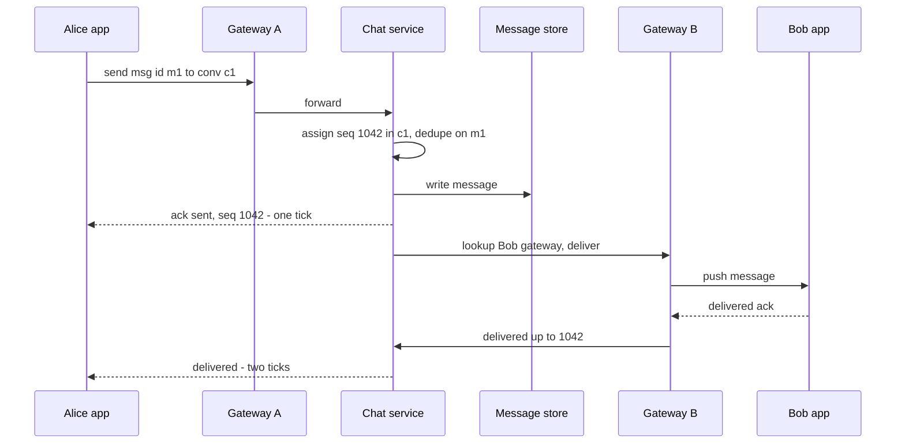
```mermaid
sequenceDiagram
  participant A as Alice app
  participant G1 as Gateway A
  participant CS as Chat service
  participant DB as Message store
  participant G2 as Gateway B
  participant B as Bob app
  A->>G1: send msg id m1 to conv c1
  G1->>CS: forward
  CS->>CS: assign seq 1042 in c1, dedupe on m1
  CS->>DB: write message
  CS-->>A: ack sent, seq 1042 - one tick
  CS->>G2: lookup Bob gateway, deliver
  G2->>B: push message
  B-->>G2: delivered ack
  G2->>CS: delivered up to 1042
  CS-->>A: delivered - two ticks
```

If Bob is offline: the message is already stored; delivery workers send an APNs/FCM push; when Bob reconnects, his app sends `last_delivered_seq` per conversation and the server streams everything after it.

##### Components and why

- **L4 load balancers + gateways:** WebSockets need long-lived TCP; gateways are thin so they can be restarted with client reconnect and resume.
- **Per-conversation sequencer:** gives a total order within a chat without a global bottleneck. Implement as an atomic counter keyed by conversation (e.g. a Redis `INCR`, or a lightweight conditional write), with the chat service instance owning a conversation via consistent hashing.
- **Wide-column store:** huge write volume, access is always "latest N messages of conversation X", which maps perfectly to partition key + clustering order.
- **Queue for fan-out:** group messages to 1,000 members become 1,000 deliveries; a queue decouples the sender's ack from fan-out.
- **Object storage + CDN for media:** keeps large blobs off the chat path; clients upload directly; thumbnails are generated asynchronously.

##### Scaling and failure handling

- **Idempotency:** client-generated `message_id`; retries after a lost ack don't duplicate.
- **Gateway failure:** clients reconnect (with backoff and jitter) to another node and resume from `last_delivered_seq`. No message lives only in gateway memory.
- **Hot groups:** a 1,000-member group at high message rate: batch deliveries per gateway (one call per gateway with a list of recipients).
- **Presence:** "last seen" updates are throttled (e.g. heartbeats every 30 s, writes only on change) because presence is a huge write load for low value.
- **Multi-device:** each device has its own delivery cursor; sequence numbers make sync simple.
- **End-to-end encryption:** with the Signal protocol style, the server stores only ciphertext; group fan-out may encrypt per device. This rules out server-side search.

**Trade-offs:**

| Decision | Alternative | Why this choice |
|---|---|---|
| WebSocket | Long polling, MQTT | WebSocket is standard for web and mobile; MQTT is a valid lightweight option on mobile |
| Per-conversation seq | Timestamps | Clocks lie; seq gives exact order and easy "give me after X" sync |
| Wide-column store | Postgres sharded by conversation | Postgres works at smaller scale; wide-column handles write volume and TTLs more easily |
| Store-then-forward | Forward first, store async | Store first means an ack really means "durable" |
| Server-side history | On-device only (WhatsApp keeps very little server-side) | Product choice: server history enables multi-device and search, costs storage and privacy |

**What interviewers listen for:**
- Ordering scoped per conversation, with sequence numbers, not timestamps.
- Clear separation: connection layer vs business logic vs storage.
- Offline delivery via cursors and push, idempotent sends.
- Group fan-out cost and presence write load called out.
- Red flag: one global message queue or one database table for all messages without partitioning.

> **Interview tip:** In 45 minutes: 5 min requirements and the 230k msg/s estimate; 8 min the gateway + chat service + store diagram; 7 min data model keyed by conversation; 10 min send/deliver/offline sequence with receipts; 10 min deep dive on ordering, idempotency and group fan-out; 5 min failures (gateway crash, region issues) and what you'd monitor (delivery latency p99, undelivered backlog).

#### Q: [Staff] Design collaborative document editing like Google Docs: up to 50 simultaneous editors per document, edits visible to others within ~200 ms, offline editing on laptops, version history, and comments. 10 million documents edited per day.

**Short answer:** Each document has a single "document session" owner on a collaboration server, chosen by consistent hashing on document ID. Clients send operations over WebSockets; the session server orders and broadcasts them. I'd use a CRDT (such as Yjs) because offline editing is a requirement, persist an append-only update log plus periodic snapshots, and build version history from snapshots. Comments are a separate service anchored to CRDT positions.

**Clarify first:**
- Rich text or plain? Embedded tables and images? How long can someone be offline?
- Permissions: viewer, commenter, editor; link sharing.
- Estimates: 10M docs/day, say 2M concurrently open at peak, average 2 editors → 4M connections. An active editor produces ~2–5 ops per second while typing; at ~1M actively typing → 2–5M ops/s, mostly small (tens of bytes). Most documents have one editor, so contention is low; the hard part is the long tail of busy documents.

**Solution:**

##### High-level design

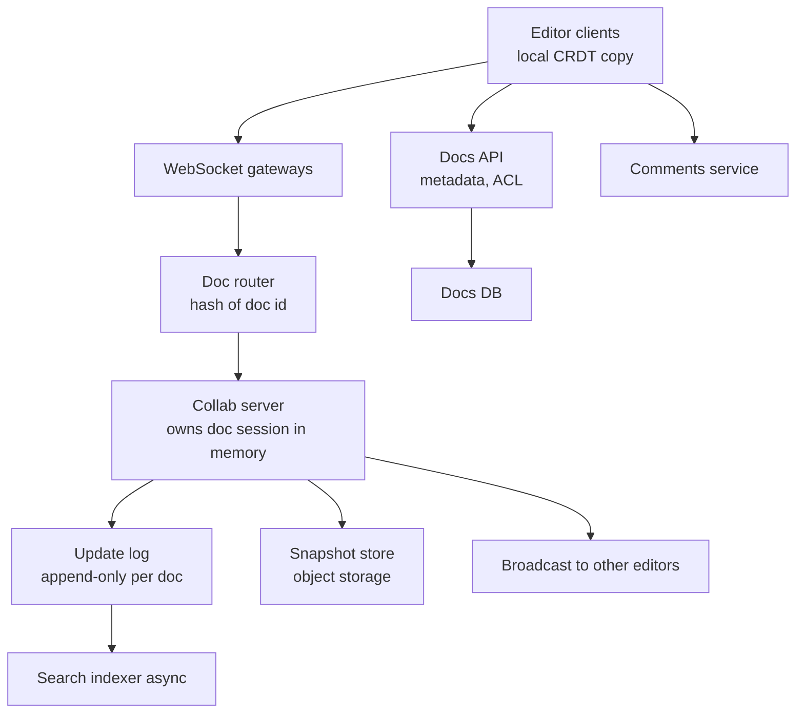
```mermaid
flowchart TD
  C["Editor clients<br/>local CRDT copy"] --> GW["WebSocket gateways"]
  GW --> RT["Doc router<br/>hash of doc id"]
  RT --> CO["Collab server<br/>owns doc session in memory"]
  CO --> LOG["Update log<br/>append-only per doc"]
  CO --> SNAP["Snapshot store<br/>object storage"]
  CO --> PUB["Broadcast to other editors"]
  C --> API["Docs API<br/>metadata, ACL"]
  API --> META["Docs DB"]
  C --> CMT["Comments service"]
  LOG --> IDX["Search indexer async"]
```

##### Data model

```sql
CREATE TABLE documents (
  id            uuid PRIMARY KEY,
  owner_id      uuid NOT NULL,
  title         text NOT NULL,
  latest_snapshot_key text,          -- object storage key
  latest_snapshot_clock bigint,      -- update log position included in snapshot
  updated_at    timestamptz NOT NULL
);

CREATE TABLE doc_updates (           -- append-only CRDT updates (binary)
  doc_id        uuid   NOT NULL,
  pos           bigint NOT NULL,     -- server-assigned order of arrival
  client_id     text   NOT NULL,
  update_bytes  bytea  NOT NULL,
  created_at    timestamptz NOT NULL DEFAULT now(),
  PRIMARY KEY (doc_id, pos)
);

CREATE TABLE doc_acl (
  doc_id uuid, principal_id uuid, role text CHECK (role IN ('viewer','commenter','editor')),
  PRIMARY KEY (doc_id, principal_id)
);
```

##### Key flow: concurrent edit and offline sync

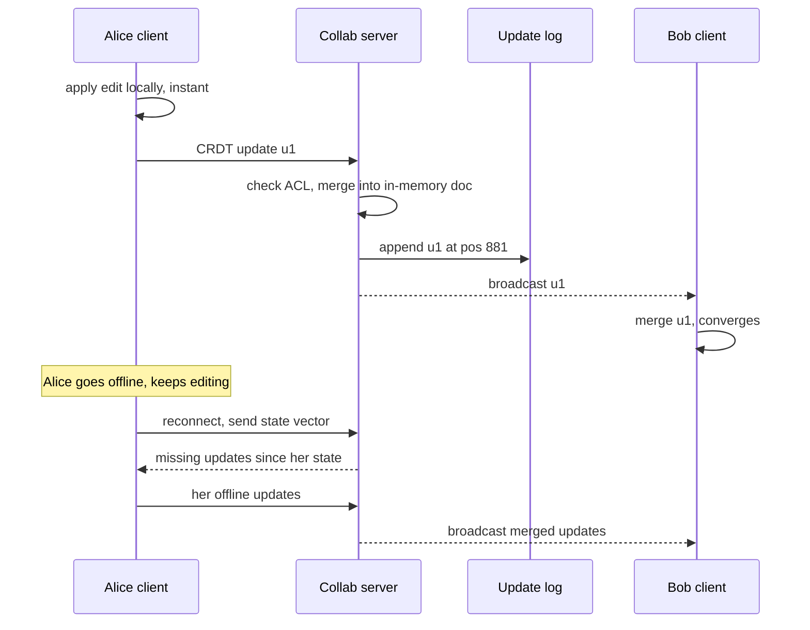
```mermaid
sequenceDiagram
  participant A as Alice client
  participant CO as Collab server
  participant L as Update log
  participant B as Bob client
  A->>A: apply edit locally, instant
  A->>CO: CRDT update u1
  CO->>CO: check ACL, merge into in-memory doc
  CO->>L: append u1 at pos 881
  CO-->>B: broadcast u1
  B->>B: merge u1, converges
  Note over A: Alice goes offline, keeps editing
  A->>CO: reconnect, send state vector
  CO-->>A: missing updates since her state
  A->>CO: her offline updates
  CO-->>B: broadcast merged updates
```

##### Components and why

- **Single owner per document session:** all live editors of a doc connect (through gateways) to the same collab server, so merging and broadcast happen in memory. Ownership via consistent hashing plus a lease in a coordination store, so only one server owns a doc.
- **CRDT (Yjs-like):** local edits apply instantly; offline edits merge on reconnect without a central transform. State vectors let peers exchange only missing updates.
- **Update log + snapshots:** appending tiny updates is cheap; loading a doc = latest snapshot + updates after it. A compaction job writes a new snapshot every N updates or minutes.
- **Version history:** named versions are snapshots with labels; "see changes" diffs two snapshots.
- **Comments:** stored separately, anchored to CRDT relative positions (which survive edits around them).

##### Scaling and failure handling

- **Collab server crash:** the lease expires, another server takes ownership, loads snapshot + log. Clients reconnect and resend unacknowledged updates (CRDT merges are idempotent, so duplicates are harmless).
- **Hot document** (an all-hands doc with 500 viewers): editors stay on the owner; viewers can be served by read-only fan-out replicas that subscribe to the owner's broadcast.
- **Permissions change mid-session:** the collab server rechecks ACL on changes and drops the connection of a removed editor.
- **Large documents:** CRDT metadata grows; snapshots apply garbage collection of deleted content (with the caveat that version history needs the old content, so keep it in snapshots, not the live doc).

**Trade-offs:**

| Decision | Alternative | Why |
|---|---|---|
| CRDT | OT with central server | Offline requirement; OT is fine if always online |
| Single owner per doc | Any server merges, sync via pub/sub | Owner keeps ordering and memory simple; pub/sub version has more cross-node chatter |
| Update log in a DB | Kafka topic per doc | Millions of docs make per-doc topics impractical; a table keyed by doc works |
| Snapshot to object storage | Store full doc on every change | Full writes are wasteful for keystroke-level edits |

**What interviewers listen for:**
- Explains OT vs CRDT and picks based on requirements (offline).
- Recognises low contention per doc and routes all editors of a doc to one owner.
- Snapshot + log for load time and history.
- Handles reconnection and duplicates through idempotent merges.
- Red flag: locking the document or last-write-wins on the whole content.

> **Interview tip:** In 45 minutes: 5 min requirements and ops/s estimate; 8 min OT vs CRDT and the choice; 8 min architecture with doc ownership; 8 min data model (log + snapshots + ACL); 10 min concurrent edit and offline sync sequence; 6 min failures (owner crash, hot doc) and history.

## 2. Social and media platforms

### Fan-out on write vs fan-out on read

**What it is:** Two ways to build a feed. **Fan-out on write (push):** when someone posts, copy a reference into every follower's pre-built feed. **Fan-out on read (pull):** when someone opens their feed, fetch recent posts from everyone they follow and merge them on the spot.

**Why it's used:** Feeds are read far more than posts are written. Pre-computing makes reads fast, but a celebrity with 50 million followers turns one post into 50 million writes.

**How it works:**

| | Fan-out on write | Fan-out on read |
|---|---|---|
| Post cost | O(followers) writes | 1 write |
| Feed read cost | 1 read of a precomputed list | O(following) reads + merge |
| Freshness | Slight delay while fan-out runs | Always fresh |
| Problem case | Celebrities (huge follower counts) | Users following thousands of accounts |
| Wasted work | Feeds of inactive users get updated | None |

Most large feeds use a **hybrid**: push for normal authors, pull for celebrities (merged in at read time), and skip pushing to inactive users.

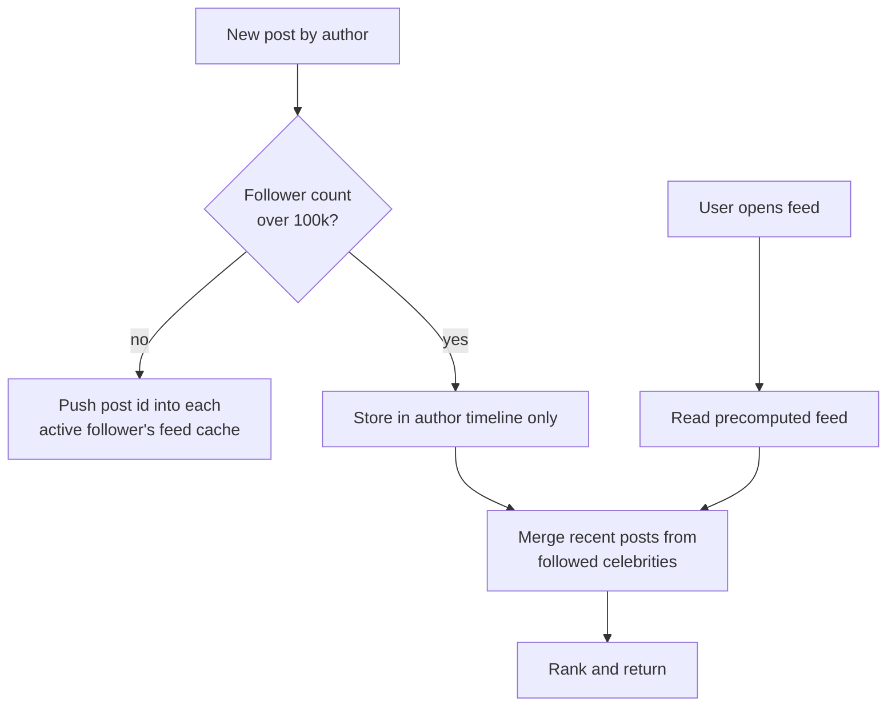
```mermaid
flowchart TD
  P["New post by author"] --> F{"Follower count<br/>over 100k?"}
  F -->|"no"| PUSH["Push post id into each<br/>active follower's feed cache"]
  F -->|"yes"| CEL["Store in author timeline only"]
  R["User opens feed"] --> M["Read precomputed feed"]
  M --> MERGE["Merge recent posts from<br/>followed celebrities"]
  CEL --> MERGE
  MERGE --> RANK["Rank and return"]
```

**Pros:** Hybrid gives fast reads for nearly everyone with bounded write amplification.
**Cons / limits:** Two code paths; ranking complicates "just merge by time"; feed caches use a lot of memory.

**Use it when / avoid when:**
- Push when follower counts are bounded and reads dominate.
- Pull for very high-follower accounts or when feeds are rarely opened.

### Adaptive bitrate streaming and CDNs

**What it is:** Adaptive bitrate (ABR) streaming splits a video into short segments (typically 2–10 seconds) and encodes each at several qualities (e.g. 240p to 4K). A manifest file (HLS `.m3u8` or DASH `.mpd`) lists them. The player picks the quality for each next segment based on measured bandwidth and buffer level. A CDN (Content Delivery Network) caches those segments on servers close to viewers.

**Why it's used:** Viewers' bandwidth varies minute to minute. ABR lowers quality instead of stalling. CDNs serve most bytes from the edge so the origin doesn't carry global traffic.

**How it works:** Upload → transcode into a "bitrate ladder" (multiple resolutions and codecs, e.g. H.264 for compatibility, newer codecs like VP9/AV1/HEVC for efficiency) → package into segments + manifests → store in object storage (origin) → CDN fetches on first request and caches.

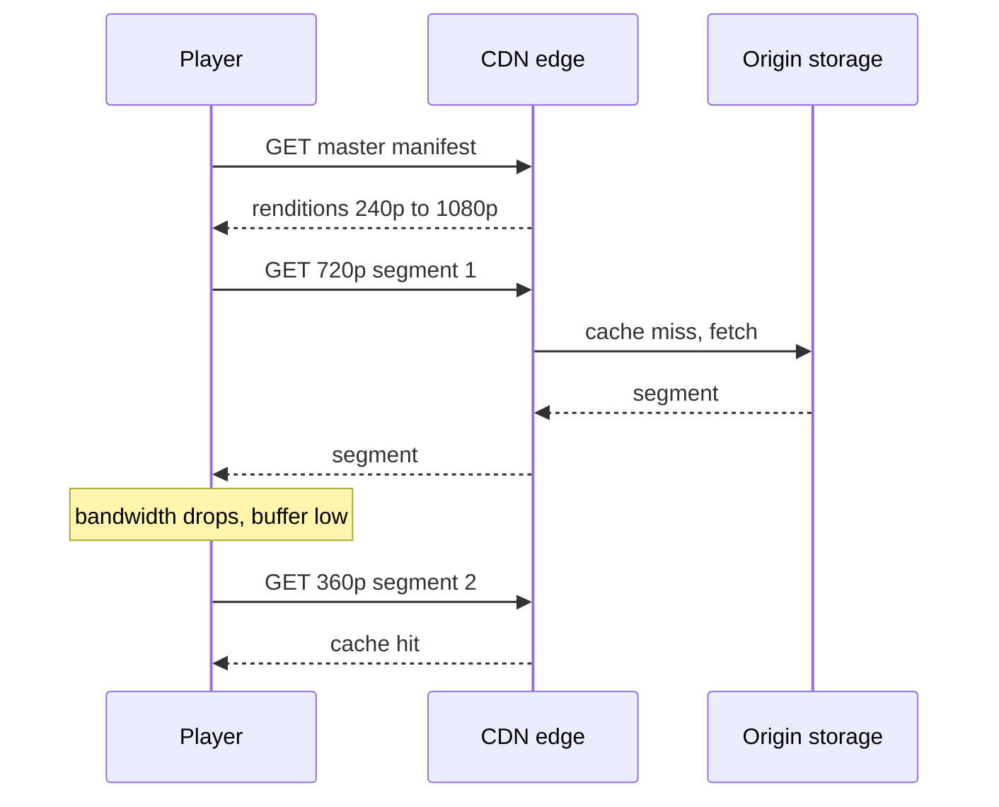
```mermaid
sequenceDiagram
  participant P as Player
  participant CDN as CDN edge
  participant O as Origin storage
  P->>CDN: GET master manifest
  CDN-->>P: renditions 240p to 1080p
  P->>CDN: GET 720p segment 1
  CDN->>O: cache miss, fetch
  O-->>CDN: segment
  CDN-->>P: segment
  Note over P: bandwidth drops, buffer low
  P->>CDN: GET 360p segment 2
  CDN-->>P: cache hit
```

**Pros:** Smooth playback across networks; massive offload of bandwidth to the CDN.
**Cons / limits:** Storage multiplies (every rendition); transcoding is expensive compute; live streaming has a latency vs stability trade-off (shorter segments, low-latency HLS/DASH variants).

**Use it when / avoid when:** Any on-demand or live video at scale. For short in-app clips, a single progressive MP4 might be enough.

#### Q: [Senior] Design the home timeline for a social app: 300 million daily active users, average user follows 200 accounts, some accounts have 50+ million followers. Users open the feed about 10 times a day and expect it in under 300 ms.

**Short answer:** Hybrid fan-out. When a normal user posts, a fan-out service pushes the post ID into the precomputed feed (a capped list in Redis) of each active follower. Celebrity posts are not pushed; at read time we merge in recent posts from the celebrities the user follows. Feed reads fetch IDs from cache, hydrate posts from a post cache, rank, and return a page with a cursor.

**Clarify first:**
- Chronological or ranked? Includes ads and recommendations? Edit and delete propagation?
- Estimates: reads = 300M × 10 = 3 billion/day ≈ 35k/s average, ~100k/s peak. Writes: say 10% post once/day → 30M posts/day ≈ 350 posts/s. Fan-out: average 200 followers → 6 billion feed inserts/day ≈ 70k/s (much less if we skip inactive users). Feed cache: 300M users × 800 IDs × 8 bytes ≈ 2 TB raw, more with Redis overhead, so cache only active users and cap the list.

**Solution:**

##### High-level design

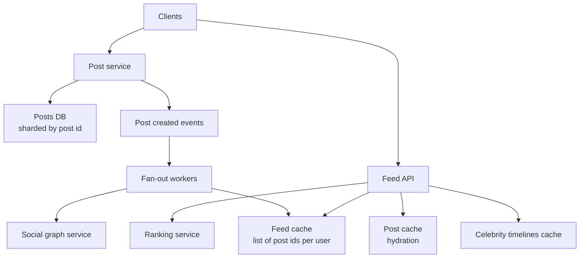
```mermaid
flowchart TD
  C["Clients"] --> API["Feed API"]
  C --> PS["Post service"]
  PS --> PDB["Posts DB<br/>sharded by post id"]
  PS --> K["Post created events"]
  K --> FO["Fan-out workers"]
  FO --> SG["Social graph service"]
  FO --> FC["Feed cache<br/>list of post ids per user"]
  API --> FC
  API --> CEL["Celebrity timelines cache"]
  API --> PC["Post cache<br/>hydration"]
  API --> RK["Ranking service"]
```

##### Data model

```sql
CREATE TABLE posts (
  id          bigint PRIMARY KEY,   -- time-sortable ID, e.g. Snowflake-style
  author_id   bigint NOT NULL,
  body        text,
  media_refs  jsonb,
  created_at  timestamptz NOT NULL,
  deleted_at  timestamptz
);
CREATE TABLE follows (
  follower_id bigint NOT NULL,
  followee_id bigint NOT NULL,
  created_at  timestamptz NOT NULL,
  PRIMARY KEY (follower_id, followee_id)
);
CREATE INDEX follows_by_followee ON follows (followee_id, follower_id);
```

Feed cache (Redis): `feed:{userId}` → list or sorted set of post IDs, capped at ~800 entries (`LPUSH` + `LTRIM`). Author timeline: `timeline:{authorId}` → recent post IDs.

##### Key flows

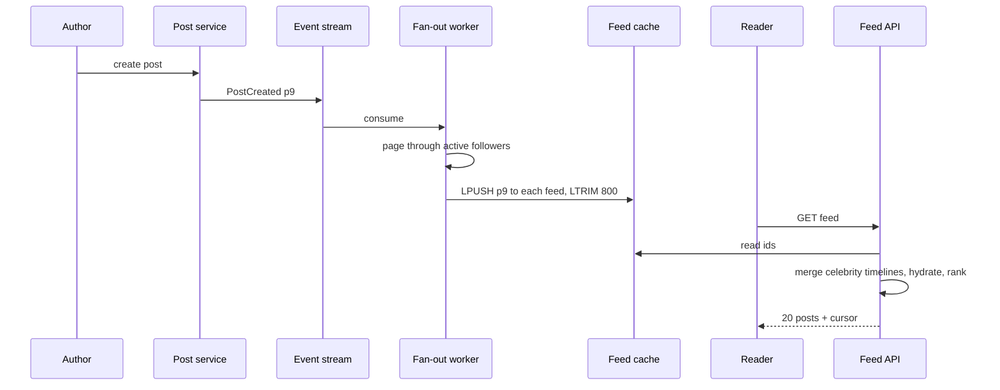
```mermaid
sequenceDiagram
  participant A as Author
  participant PS as Post service
  participant K as Event stream
  participant FO as Fan-out worker
  participant FC as Feed cache
  participant U as Reader
  participant API as Feed API
  A->>PS: create post
  PS->>K: PostCreated p9
  K->>FO: consume
  FO->>FO: page through active followers
  FO->>FC: LPUSH p9 to each feed, LTRIM 800
  U->>API: GET feed
  API->>FC: read ids
  API->>API: merge celebrity timelines, hydrate, rank
  API-->>U: 20 posts + cursor
```

##### Components and why

- **Event stream (e.g. Kafka) between posting and fan-out:** the author gets a fast response; fan-out is retried independently and can lag a few seconds.
- **Time-sortable IDs:** merging and pagination by ID equals ordering by time, without global coordination.
- **Feed cache in Redis:** feed reads are the hot path; lists of IDs are small.
- **Post cache:** hydration reads are by ID and very cacheable.
- **Ranking service:** separate so ML iteration doesn't touch storage.

##### Scaling and failure handling

- **Celebrity threshold** decides push vs pull; also apply to accounts with bursty followers.
- **Inactive users:** don't push to users inactive for 30 days; rebuild their feed on next login from pull (a "cold start" path).
- **Deletes:** don't chase IDs in millions of feeds; filter deleted posts during hydration.
- **Cache loss:** rebuild a user's feed by pulling from followees' timelines; slower for one request, never wrong.
- **Fan-out lag monitoring:** the main SLO for writes is "post visible in followers' feeds within N seconds".

**Trade-offs:**

| Option | Pros | Cons |
|---|---|---|
| Pure push | Fastest reads | Celebrity write storms, wasted work for inactive users |
| Pure pull | Simple, fresh | Slow reads for users following many accounts |
| Hybrid (chosen) | Fast reads, bounded writes | Two paths, more complex |
| Ranked vs chronological | Engagement | Needs candidate generation beyond followed accounts |

**What interviewers listen for:**
- Estimates show reads dominate and fan-out volume is large.
- Celebrity problem raised before being asked.
- Deletes handled at read time, cache rebuild path exists.
- Red flag: a SQL join of follows and posts for every feed request at this scale.

> **Interview tip:** In 45 minutes: 5 min requirements and read/write math; 8 min push vs pull table; 10 min hybrid architecture; 7 min data model and cache layout; 8 min post and read sequences; 7 min deletes, inactive users, failure and fan-out lag.

#### Q: [Senior] Design a video streaming platform like YouTube or Netflix: creators upload videos (up to 4K, several GB), we transcode them, and 100 million daily viewers watch with adaptive quality worldwide. Uploads: 500,000 per day.

**Short answer:** Uploads go straight to object storage with resumable multipart uploads. An upload event triggers a transcoding pipeline that splits the source into chunks, encodes them in parallel into a bitrate ladder, packages HLS/DASH segments and manifests, and writes them to origin storage. Playback goes through a multi-tier CDN; the player uses adaptive bitrate. Metadata, search and recommendations are separate services.

**Clarify first:**
- On-demand only or live too? DRM required (Netflix-style)? Average video length?
- Estimates: 500k uploads/day × average 10 minutes = 5M minutes of source video/day. If a 1080p source is ~1 GB per 10 minutes, raw ingest ≈ 500 TB/day. The ladder adds roughly 1.5–3x storage over the source depending on renditions and codecs. Viewing: 100M viewers × 60 min/day at ~3 Mbps average ≈ 100M × 1.35 GB ≈ 135 PB/day egress, which is why the CDN serves almost all of it.

**Solution:**

##### High-level design

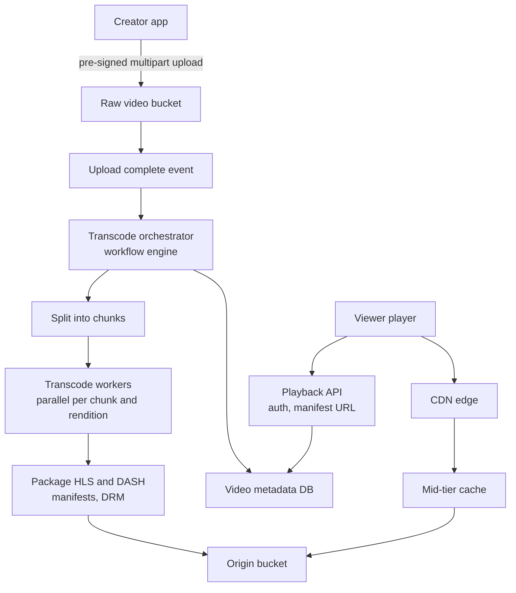
```mermaid
flowchart TD
  CR["Creator app"] -->|"pre-signed multipart upload"| RAW["Raw video bucket"]
  RAW --> EV["Upload complete event"]
  EV --> ORC["Transcode orchestrator<br/>workflow engine"]
  ORC --> SPL["Split into chunks"]
  SPL --> TW["Transcode workers<br/>parallel per chunk and rendition"]
  TW --> PKG["Package HLS and DASH<br/>manifests, DRM"]
  PKG --> ORG["Origin bucket"]
  ORC --> META["Video metadata DB"]
  V["Viewer player"] --> CDN["CDN edge"]
  CDN --> MID["Mid-tier cache"]
  MID --> ORG
  V --> API["Playback API<br/>auth, manifest URL"]
  API --> META
```

##### Data model

```sql
CREATE TABLE videos (
  id            uuid PRIMARY KEY,
  channel_id    uuid NOT NULL,
  title         text NOT NULL,
  status        text NOT NULL CHECK (status IN ('uploading','processing','ready','failed','removed')),
  duration_s    int,
  source_key    text NOT NULL,
  created_at    timestamptz NOT NULL DEFAULT now()
);
CREATE TABLE renditions (
  video_id      uuid REFERENCES videos(id),
  codec         text NOT NULL,         -- 'h264', 'vp9', 'av1'
  height        int  NOT NULL,         -- 240, 360, 720, 1080, 2160
  bitrate_kbps  int  NOT NULL,
  manifest_key  text NOT NULL,
  PRIMARY KEY (video_id, codec, height)
);
CREATE TABLE transcode_tasks (
  video_id uuid, chunk_index int, rendition text,
  status text, attempts int DEFAULT 0, worker_id text,
  PRIMARY KEY (video_id, chunk_index, rendition)
);
```

View counts and watch history go to a separate high-write store (stream → aggregation), not the videos table.

##### Key flow: upload to ready

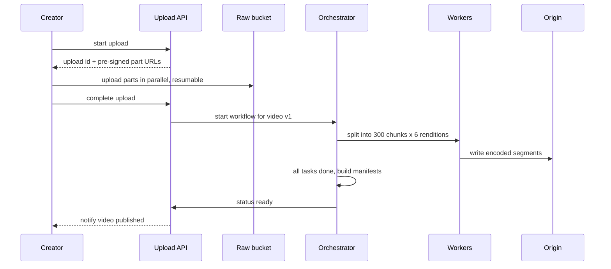
```mermaid
sequenceDiagram
  participant C as Creator
  participant API as Upload API
  participant S3 as Raw bucket
  participant O as Orchestrator
  participant W as Workers
  participant OR as Origin
  C->>API: start upload
  API-->>C: upload id + pre-signed part URLs
  C->>S3: upload parts in parallel, resumable
  C->>API: complete upload
  API->>O: start workflow for video v1
  O->>W: split into 300 chunks x 6 renditions
  W->>OR: write encoded segments
  O->>O: all tasks done, build manifests
  O->>API: status ready
  API-->>C: notify video published
```

##### Components and why

- **Pre-signed multipart upload:** large files bypass our servers; parts retry independently; resumable on flaky connections.
- **Workflow engine (e.g. Step Functions, Temporal):** long-running, many steps, retries per task, visibility into stuck jobs.
- **Chunked parallel transcoding:** a 2-hour 4K film encodes in minutes across hundreds of workers instead of hours on one. Spot/preemptible instances make it cheap because tasks are idempotent and retryable.
- **Multi-tier CDN:** edges near users, a mid-tier (origin shield) to protect the origin from thousands of edges missing at once. Netflix runs its own appliances inside ISPs (Open Connect); smaller platforms use commercial CDNs.
- **Playback API:** checks auth/entitlement and returns a signed, short-lived manifest URL (and DRM license server info).

##### Scaling and failure handling

- **Popularity-based renditions:** encode a basic ladder first so a video goes live fast; add expensive codecs (AV1) only for videos that get views.
- **Long tail:** most videos are rarely watched; tier old renditions to cheaper storage classes.
- **Worker failure:** task heartbeats; the orchestrator re-queues the chunk. Output keys are deterministic so a re-run overwrites safely.
- **Viral video:** CDN pre-warming for predictable launches (a new season); request collapsing at the mid-tier.
- **Bad uploads:** validate container/codec early; moderation and copyright matching run as parallel workflow steps.

**Trade-offs:**

| Decision | Alternative | Why |
|---|---|---|
| Segmented ABR (HLS/DASH) | Progressive MP4 | ABR adapts to bandwidth; MP4 is fine for short clips |
| Chunk-parallel transcoding | Whole-file per worker | Speed and retry granularity; costs some complexity at chunk boundaries |
| Commercial CDN | Own edge network | Own network only pays off at enormous scale |
| Many codecs | H.264 only | Newer codecs cut bandwidth substantially but cost encode compute and device support |

**What interviewers listen for:**
- Separates upload, processing and playback paths.
- Bandwidth estimate drives "CDN serves almost everything".
- Idempotent, retryable chunked transcoding.
- Origin shield and pre-warming for hot content.
- Red flag: streaming video bytes through the application servers.

> **Interview tip:** In 45 minutes: 5 min requirements and the egress estimate; 10 min upload + transcode pipeline; 8 min ABR and CDN tiers with the playback sequence; 7 min data model and statuses; 10 min scaling (popularity-based encoding, viral videos); 5 min failures and cost.

## 3. Location-based systems

### Geospatial indexing: geohash, quadtrees, S2 and H3

**What it is:** A way to index points on a map so you can quickly answer "what is near this location?". Regular B-tree indexes sort one dimension; latitude and longitude are two, so you need a trick that maps 2D space into searchable keys.

**Why it's used:** Ride-hailing ("drivers within 2 km"), food delivery, store locators, geofencing.

**How it works:**
- **Geohash:** recursively split the world into a grid and encode a cell as a base-32 string. Nearby points usually share a prefix (`9q8yy`). Search the cell plus its 8 neighbours. Precision 6 is roughly a 1.2 km × 0.6 km cell.
- **Quadtree:** split a region into 4 quadrants recursively until each cell has at most N points. Dense cities get small cells, empty areas big ones. Usually in memory.
- **S2 (Google) and H3 (Uber):** hierarchical cells on a sphere (S2 squares projected from a cube, H3 hexagons). Hexagons have equal-distance neighbours, nice for demand heatmaps and pricing zones.
- **Databases:** PostGIS (`ST_DWithin` with GiST index), Redis `GEOADD`/`GEOSEARCH` (geohash-based sorted sets), Elasticsearch geo queries, DynamoDB with a geohash key.

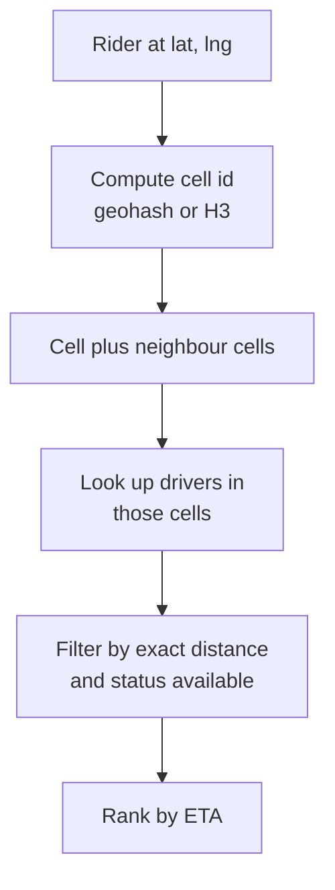
```mermaid
flowchart TD
  P["Rider at lat, lng"] --> C["Compute cell id<br/>geohash or H3"]
  C --> N["Cell plus neighbour cells"]
  N --> L["Look up drivers in<br/>those cells"]
  L --> D["Filter by exact distance<br/>and status available"]
  D --> R["Rank by ETA"]
```

**Pros:** Fast proximity queries; cells double as sharding and aggregation keys.
**Cons / limits:** Cell edges (a close point may be in a neighbour cell, hence searching neighbours); geohash cells distort near the poles; straight-line distance is not road ETA.

**Use it when / avoid when:** Any "near me" query at scale. For a few thousand static locations, PostGIS alone is plenty.

#### Q: [Senior] Design a ride-hailing backend like Uber: 5 million drivers worldwide, about 1 million online at peak, each sending GPS every 4 seconds. Riders request a ride and should be matched to a nearby driver within a few seconds. Include trip state and pricing at a high level.

**Short answer:** Driver location updates go through a gateway into an in-memory geospatial index sharded by city or region (H3 or geohash cells). A matching service queries nearby available drivers, ranks them by ETA, and offers the ride to one driver at a time with a short timeout, using an atomic state change so a driver can't get two rides. The trip is a state machine stored in a durable DB; locations during the trip are streamed to the rider and archived.

**Clarify first:**
- Single product or pooling? Surge pricing? Scheduled rides? Payments in scope (assume a separate payment service)?
- Estimates: 1M online drivers / 4 s = 250k location updates per second, ~100 bytes each ≈ 25 MB/s ingest. The *current* location set is small: 1M × ~100 bytes = 100 MB, easily in memory. Ride requests: say 20M trips/day ≈ 230/s average, peaks of several thousand per second in big cities. Location history for trips: tens of TB/year, cold storage.

**Solution:**

##### High-level design

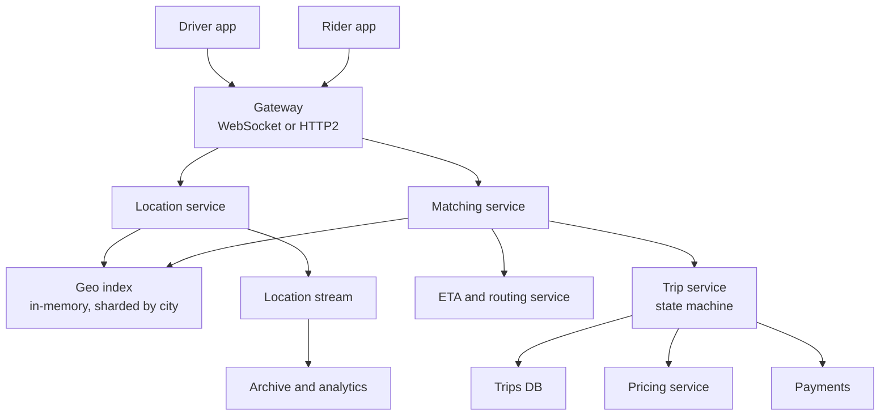
```mermaid
flowchart TD
  DA["Driver app"] --> GW["Gateway<br/>WebSocket or HTTP2"]
  RA["Rider app"] --> GW
  GW --> LOC["Location service"]
  LOC --> GEO["Geo index<br/>in-memory, sharded by city"]
  LOC --> STR["Location stream"]
  STR --> ARC["Archive and analytics"]
  GW --> MATCH["Matching service"]
  MATCH --> GEO
  MATCH --> ETA["ETA and routing service"]
  MATCH --> TRIP["Trip service<br/>state machine"]
  TRIP --> TDB["Trips DB"]
  TRIP --> PRICE["Pricing service"]
  TRIP --> PAY["Payments"]
```

##### Data model

```sql
CREATE TABLE trips (
  id              uuid PRIMARY KEY,
  rider_id        uuid NOT NULL,
  driver_id       uuid,
  status          text NOT NULL CHECK (status IN
                   ('requested','offered','accepted','arrived','in_progress','completed','cancelled')),
  pickup_lat      double precision NOT NULL,
  pickup_lng      double precision NOT NULL,
  dropoff_lat     double precision,
  dropoff_lng     double precision,
  quoted_fare_cents bigint NOT NULL,
  surge_multiplier numeric(4,2) NOT NULL DEFAULT 1.0,
  city_id         int NOT NULL,
  version         int NOT NULL DEFAULT 0,      -- optimistic concurrency
  created_at      timestamptz NOT NULL DEFAULT now()
);
```

Geo index (in memory or Redis per city): `drivers:{cityId}` as a geo set of available drivers, plus `driver:{id}` hash with status, vehicle type and last update time.

```typescript
// Redis geo commands (Redis 6.2+ for GEOSEARCH).
await redis.geoadd(`drivers:${cityId}`, lng, lat, driverId);
const nearby = await redis.geosearch(
  `drivers:${cityId}`, 'FROMLONLAT', pickupLng, pickupLat,
  'BYRADIUS', 3, 'km', 'ASC', 'COUNT', 20,
);
```

##### Key flow: request and match

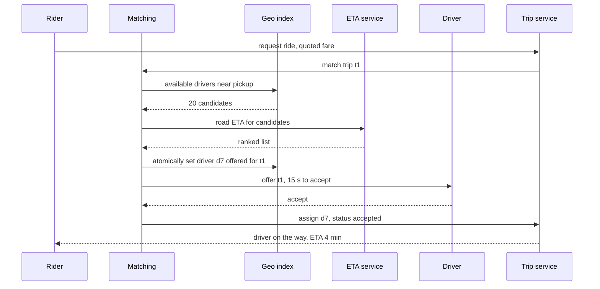
```mermaid
sequenceDiagram
  participant R as Rider
  participant M as Matching
  participant G as Geo index
  participant E as ETA service
  participant D as Driver
  participant T as Trip service
  R->>T: request ride, quoted fare
  T->>M: match trip t1
  M->>G: available drivers near pickup
  G-->>M: 20 candidates
  M->>E: road ETA for candidates
  E-->>M: ranked list
  M->>G: atomically set driver d7 offered for t1
  M->>D: offer t1, 15 s to accept
  D-->>M: accept
  M->>T: assign d7, status accepted
  T-->>R: driver on the way, ETA 4 min
```

If the driver declines or times out, the matching service releases the driver's "offered" state and moves to the next candidate.

##### Components and why

- **In-memory geo index per city:** locations change every few seconds and only the latest matters, so a durable DB per update is wasteful. Sharding by city keeps queries local and limits blast radius.
- **Atomic driver reservation:** a compare-and-set (`available → offered:t1`) prevents double-offering when two matchers pick the same driver.
- **ETA service:** straight-line distance misleads (rivers, one-way streets); road-network ETA ranks better.
- **Trip state machine in a durable DB:** money and disputes depend on it; optimistic versioning prevents conflicting transitions.
- **Location stream:** archived for fare calculation, safety and analytics without slowing the hot path.

##### Scaling and failure handling

- **Stale drivers:** drop drivers from the index if no update for ~30 s.
- **Geo index node failure:** it's soft state; rebuild from the next round of updates within seconds. Run replicas for faster takeover.
- **City boundaries:** pickups near a border search neighbouring shards.
- **Peak demand:** batch matching (collect requests for 1–2 s and solve assignments together) improves global efficiency vs greedy matching.
- **Surge pricing:** compute supply/demand per H3 cell every minute from the streams; quote is locked into the trip at request time.

**Trade-offs:**

| Decision | Alternative | Why |
|---|---|---|
| In-memory geo index | PostGIS for live locations | 250k updates/s is heavy for a relational DB; PostGIS fits historic queries |
| Sequential offers | Broadcast to many drivers | Broadcasting is faster but drivers race and get frustrated |
| City sharding | Global index | Locality and isolation; cross-border handled explicitly |
| Greedy match | Batched optimisation | Greedy is simpler and faster; batching gives better overall ETAs |

**What interviewers listen for:**
- Location updates computed as ~250k/s and kept in memory, not a DB per update.
- Geospatial index explained (cells + neighbours).
- Prevents double-assignment with an atomic state change.
- Trip as an explicit state machine.
- Red flag: `SELECT ... ORDER BY distance` across all drivers globally.

> **Interview tip:** In 45 minutes: 5 min requirements and update-rate math; 8 min location ingest and geo index; 12 min matching flow with atomic reservation; 7 min trip state machine and data model; 8 min scaling (city shards, batching, surge); 5 min failures.

## 4. Contention: inventory, flash sales and bookings

### Inventory reservation patterns

**What it is:** Techniques to sell a limited quantity (1,000 phones, seat 14C) to many concurrent buyers without selling more than exist (overselling).

**Why it's used:** The naive "read stock, check > 0, write stock − 1" has a race: two requests both read 1 and both sell. With thousands of requests per second on one item, this happens constantly.

**How it works:**
- **Atomic conditional update in the DB:** `UPDATE inventory SET available = available - 1 WHERE sku = $1 AND available > 0` and check affected rows. Simple and correct, but one hot row serialises all buyers.
- **Pessimistic lock:** `SELECT ... FOR UPDATE` then update. Correct, slower under contention.
- **Optimistic concurrency:** version column; retry on conflict. Bad under heavy contention (most retries fail).
- **Atomic counter in Redis:** `DECR` or a Lua script that checks and decrements; very fast; the DB order is created afterwards, with a reconciliation path.
- **Pre-split stock (token buckets of inventory):** split 1,000 units into 10 buckets of 100 on different keys to spread load.
- **Temporary holds with TTL:** reserve for N minutes during checkout; release if not paid. Needed for seats and limited items.

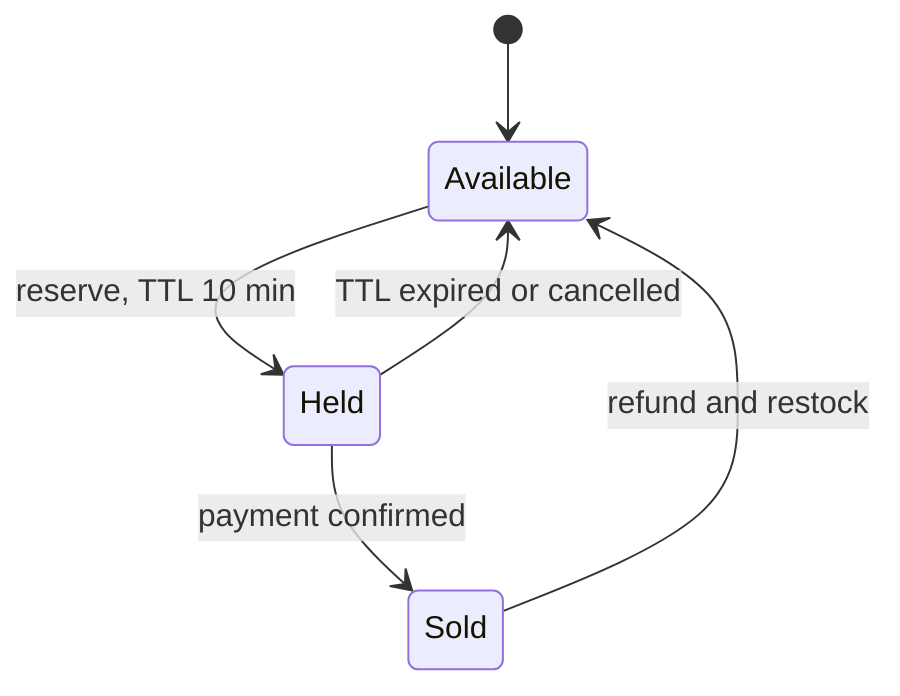
```mermaid
stateDiagram-v2
  [*] --> Available
  Available --> Held: reserve, TTL 10 min
  Held --> Sold: payment confirmed
  Held --> Available: TTL expired or cancelled
  Sold --> Available: refund and restock
```

**Pros:** Each pattern trades throughput for simplicity; atomic operations make overselling impossible at the point of truth.
**Cons / limits:** Hot rows/keys; holds need reliable expiry; Redis-first designs need reconciliation with the DB.

**Use it when / avoid when:** Atomic SQL update for moderate traffic; Redis counter plus queue for flash-sale spikes; holds whenever checkout takes more than a moment.

### Virtual waiting rooms and admission control

**What it is:** A queue in front of the site for extreme spikes. Users get a place in line and are admitted at a rate the backend can handle, instead of everyone hitting checkout at once.

**Why it's used:** A concert going on sale may draw 50x normal traffic in the first minute. Without admission control, the site fails for everyone.

**How it works:** Edge (CDN/worker) checks for a signed "admitted" token. Without one, the user gets a waiting page and a queue position. An admission service lets N users per second through, issuing short-lived signed tokens. Fairness: randomise positions for users who arrived before the sale opened, then first-come-first-served.

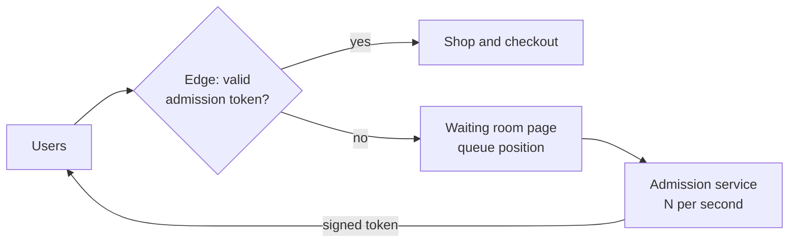
```mermaid
flowchart LR
  U["Users"] --> E{"Edge: valid<br/>admission token?"}
  E -->|"yes"| APP["Shop and checkout"]
  E -->|"no"| WR["Waiting room page<br/>queue position"]
  WR --> AD["Admission service<br/>N per second"]
  AD -->|"signed token"| U
```

**Pros:** Protects the backend; fair and transparent for users; cheap to serve the waiting page from the edge.
**Cons / limits:** Users dislike waiting; bots try to skip the line (tokens must be bound to a session and short-lived).

**Use it when / avoid when:** Known, extreme spikes (drops, ticket sales). Not needed for normal autoscaling-range traffic.

#### Q: [Senior] Design an e-commerce flash sale: 10,000 units of a phone at a 70% discount go on sale at 12:00. We expect 2 million users and 500,000 requests per second in the first minute. We must never oversell, and each user can buy at most one.

**Short answer:** Protect the system with a waiting room and edge caching of the product page. Keep the authoritative "units left" counter in Redis and decrement it atomically with a Lua script that also enforces one per user. A successful decrement creates a reservation and puts an order message on a queue; order workers write orders to the DB at a sustainable rate and send the user to payment with a 10-minute hold. Unpaid holds expire and return stock.

**Clarify first:**
- Is payment taken at purchase or after? Hold duration? Bots and resale concerns? Is the 10,000 global or per region?
- Estimates: 500k req/s, but only 10,000 can succeed. 99%+ of requests should be rejected cheaply, ideally at the edge, after stock hits zero. Writes that matter: 10,000 orders, which is trivial for a DB if spread over a minute (~170/s).

**Solution:**

##### High-level design

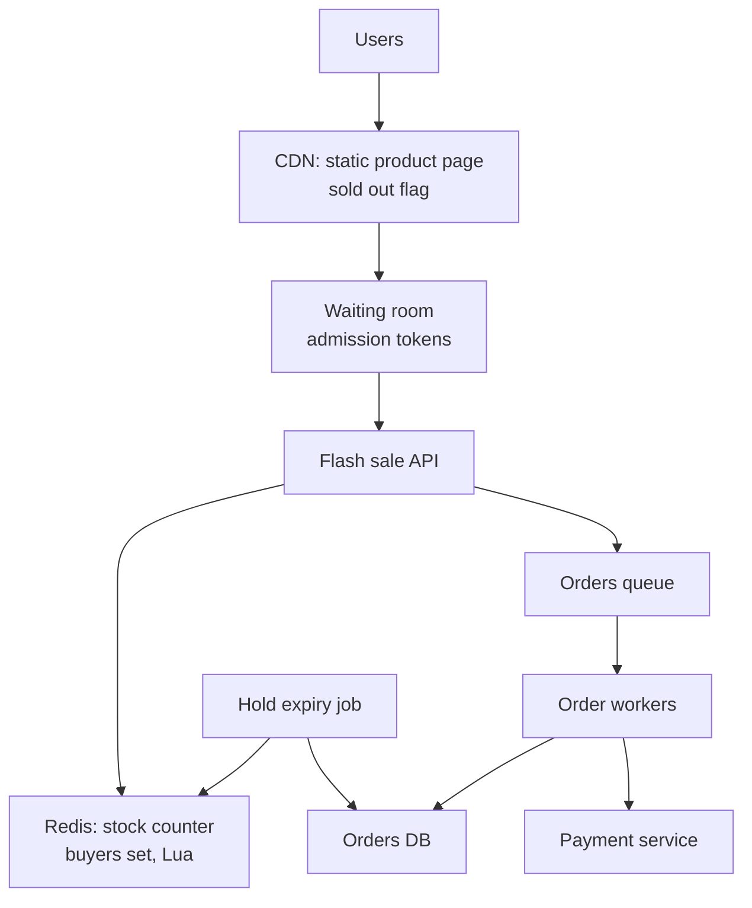
```mermaid
flowchart TD
  U["Users"] --> CDN["CDN: static product page<br/>sold out flag"]
  CDN --> WR["Waiting room<br/>admission tokens"]
  WR --> API["Flash sale API"]
  API --> RC["Redis: stock counter<br/>buyers set, Lua"]
  API --> Q["Orders queue"]
  Q --> OW["Order workers"]
  OW --> DB["Orders DB"]
  OW --> PAY["Payment service"]
  EXP["Hold expiry job"] --> RC
  EXP --> DB
```

##### Data model

```sql
CREATE TABLE flash_orders (
  id            uuid PRIMARY KEY,
  sale_id       uuid   NOT NULL,
  user_id       uuid   NOT NULL,
  status        text   NOT NULL CHECK (status IN ('reserved','paid','expired','cancelled')),
  price_cents   bigint NOT NULL,
  hold_expires_at timestamptz NOT NULL,
  created_at    timestamptz NOT NULL DEFAULT now(),
  UNIQUE (sale_id, user_id)            -- one per user, enforced again at the DB
);
CREATE TABLE sale_inventory (
  sale_id   uuid PRIMARY KEY,
  total     int NOT NULL,
  sold      int NOT NULL DEFAULT 0 CHECK (sold <= total)
);
```

Redis: `sale:{id}:stock` (integer), `sale:{id}:buyers` (set of user IDs).

```typescript
const RESERVE = `
if redis.call("SISMEMBER", KEYS[2], ARGV[1]) == 1 then return -2 end
local stock = tonumber(redis.call("GET", KEYS[1]) or "0")
if stock <= 0 then return -1 end
redis.call("DECR", KEYS[1])
redis.call("SADD", KEYS[2], ARGV[1])
return stock - 1`;

export async function reserve(saleId: string, userId: string) {
  const left = Number(await redis.eval(RESERVE, 2, `sale:${saleId}:stock`, `sale:${saleId}:buyers`, userId));
  if (left === -2) return { ok: false, reason: 'already_bought' } as const;
  if (left === -1) {
    await markSoldOutAtEdge(saleId); // flip a flag the CDN page reads
    return { ok: false, reason: 'sold_out' } as const;
  }
  const orderId = crypto.randomUUID();
  await ordersQueue.send({ orderId, saleId, userId }, { dedupeId: `${saleId}:${userId}` });
  return { ok: true, orderId } as const;
}
```

##### Key flow

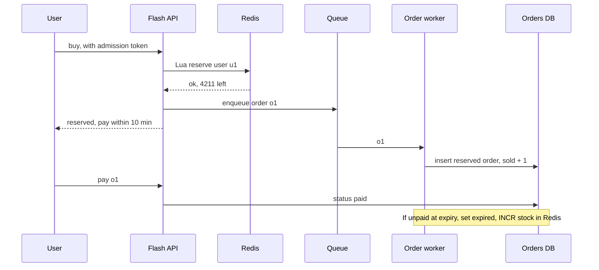
```mermaid
sequenceDiagram
  participant U as User
  participant API as Flash API
  participant R as Redis
  participant Q as Queue
  participant W as Order worker
  participant DB as Orders DB
  U->>API: buy, with admission token
  API->>R: Lua reserve user u1
  R-->>API: ok, 4211 left
  API->>Q: enqueue order o1
  API-->>U: reserved, pay within 10 min
  Q->>W: o1
  W->>DB: insert reserved order, sold + 1
  U->>API: pay o1
  API->>DB: status paid
  Note over W,DB: If unpaid at expiry, set expired, INCR stock in Redis
```

##### Components and why

- **CDN + sold-out flag:** once stock is zero, the page itself says "sold out" and the buy button never calls the API.
- **Waiting room:** turns 500k req/s into an admitted rate the API can handle.
- **Redis Lua:** single-threaded execution makes check-and-decrement atomic at very high throughput.
- **Queue + workers:** the DB sees 10,000 inserts at a steady rate instead of a spike.
- **DB constraints as a second line:** `UNIQUE (sale_id, user_id)` and `CHECK (sold <= total)` make overselling impossible even if Redis misbehaves.

##### Scaling and failure handling

- **Redis failover:** a failover with async replication could lose recent decrements and allow extra reservations; the DB check catches it (the worker's update of `sold` fails and the user gets "sorry, sold out"). Better: use a replica-acknowledged write (`WAIT`) for the counter, or accept the small risk with DB enforcement.
- **Hot key:** one stock key at 100k+ ops/s is near a single Redis thread's practical ceiling; pre-split into N sub-counters across shards and try a random one, falling back to others.
- **Bots:** admission tokens bound to logged-in accounts, purchase limits by payment method and address, CAPTCHA at admission.
- **Hold expiry:** a scheduled job (or delayed queue messages) expires holds and returns stock with an idempotent transition (`reserved → expired` only once).

**Trade-offs:**

| Option | Pros | Cons |
|---|---|---|
| DB conditional UPDATE only | Simplest, strongly consistent | One hot row cannot take 500k req/s |
| Redis counter + queue (chosen) | Huge throughput | Two sources of truth, needs reconciliation |
| Pre-allocated tokens per server | No central hot key | Uneven sell-out across servers |
| Lottery instead of first-come | Fair, kills the spike | Different product experience |

**What interviewers listen for:**
- Most traffic must be rejected cheaply; only 10,000 succeed.
- Atomic check-and-decrement plus DB constraints as defence in depth.
- Waiting room, edge sold-out flag, queue to smooth DB writes.
- Hold expiry and Redis failover discussed.
- Red flag: `SELECT stock` then `UPDATE` in application code.

> **Interview tip:** In 45 minutes: 5 min requirements and the "10k winners out of 2M" framing; 8 min edge, waiting room, API; 10 min atomic reservation (Lua) and constraints; 7 min queue and order flow; 10 min failures (Redis failover, hold expiry, bots, hot key); 5 min monitoring (stock counter vs DB sold count).

#### Q: [Mid] Design a ticket booking system for concerts and flights: users see a seat map, pick seats, and have 8 minutes to pay. Two people must never get the same seat. 5,000 events open per day; a big concert has 60,000 seats and 300,000 people trying at once.

**Short answer:** Each seat is a row with a status. Selecting seats creates a temporary hold with an expiry, done as an atomic conditional update so only one user wins each seat. The seat map is served from a cache that is updated as holds change. Payment confirms the hold into a booking; expired holds are released by a sweeper and also treated as free by reads that check the expiry time. For big on-sales, a waiting room limits concurrent shoppers.

**Clarify first:**
- General admission (count only) or assigned seats? Max seats per order? Hold duration? Can users change seats during the hold?
- Estimates: big concert 300k users → admit maybe 5–10k concurrent shoppers. Seat holds: 60k seats; seat map reads maybe 10k/s during the on-sale (cached), hold writes a few thousand per second, all on one event (one partition) — fine for a well-indexed DB with row-level locks.

**Solution:**

##### High-level design

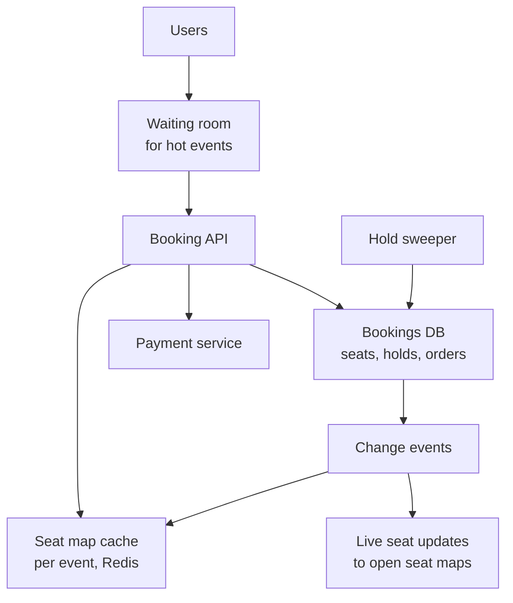
```mermaid
flowchart TD
  U["Users"] --> WR["Waiting room<br/>for hot events"]
  WR --> API["Booking API"]
  API --> MAP["Seat map cache<br/>per event, Redis"]
  API --> DB["Bookings DB<br/>seats, holds, orders"]
  API --> PAY["Payment service"]
  SW["Hold sweeper"] --> DB
  DB --> CDC["Change events"]
  CDC --> MAP
  CDC --> PUSH["Live seat updates<br/>to open seat maps"]
```

##### Data model

```sql
CREATE TABLE seats (
  event_id      uuid   NOT NULL,
  seat_id       text   NOT NULL,          -- 'A-14'
  section       text   NOT NULL,
  price_cents   bigint NOT NULL,
  status        text   NOT NULL DEFAULT 'available'
                 CHECK (status IN ('available','held','booked')),
  hold_id       uuid,
  hold_expires_at timestamptz,
  PRIMARY KEY (event_id, seat_id)
);

CREATE TABLE holds (
  id          uuid PRIMARY KEY,
  event_id    uuid NOT NULL,
  user_id     uuid NOT NULL,
  expires_at  timestamptz NOT NULL,
  status      text NOT NULL CHECK (status IN ('active','confirmed','expired'))
);
```

Atomic hold of several seats: all or nothing.

```sql
-- Holds seats only if every requested seat is free (or its hold has expired).
WITH wanted AS (
  SELECT seat_id FROM seats
  WHERE event_id = $1 AND seat_id = ANY($2::text[])
    AND (status = 'available' OR (status = 'held' AND hold_expires_at < now()))
  FOR UPDATE SKIP LOCKED
)
UPDATE seats s
SET status = 'held', hold_id = $3, hold_expires_at = now() + interval '8 minutes'
FROM wanted w
WHERE s.event_id = $1 AND s.seat_id = w.seat_id
RETURNING s.seat_id;
-- In the app: if returned rows < requested seats, ROLLBACK and tell the user which seats were taken.
```

##### Key flow

```mermaid
sequenceDiagram
  participant U as User
  participant API as Booking API
  participant DB as Bookings DB
  participant P as Payment
  U->>API: hold seats A-14, A-15
  API->>DB: BEGIN, conditional update, COMMIT
  DB-->>API: 2 rows held, hold h1 expires 12:08
  API-->>U: held, timer 8:00
  U->>API: pay for h1, idempotency key
  API->>DB: check h1 active and not expired
  API->>P: charge
  P-->>API: success
  API->>DB: seats booked, hold confirmed
  API-->>U: tickets issued
```

##### Components and why

- **Relational DB with row locks:** seat-level contention is per event and per seat, which row-level locking handles well; strong consistency is mandatory.
- **Expiry in the data:** reads treat `held AND hold_expires_at < now()` as available, so correctness doesn't depend on the sweeper running on time; the sweeper only tidies.
- **Seat map cache + live updates:** thousands of users looking at the same map; updates are pushed via CDC so maps stay roughly current (the hold call is the source of truth).
- **Waiting room:** bounds concurrency for hot events.

##### Scaling and failure handling

- **Payment after expiry:** check expiry inside the confirm transaction; if a charge succeeded but the hold expired, try to re-hold; if seats are gone, refund automatically.
- **Payment timeouts:** idempotency key per hold; extend the hold briefly while a payment is in flight.
- **Partitioning:** shard by `event_id`; one event's seats stay together so multi-seat holds are single-shard transactions.
- **Abuse:** limit active holds per user and per event.

**Trade-offs:**

| Option | Pros | Cons |
|---|---|---|
| DB row holds (chosen) | Correct, simple, multi-seat atomic | DB load during big on-sales |
| Redis holds with TTL | Fast, automatic expiry | Must keep DB in sync; risk on failover |
| Optimistic "pay first, then claim" | No holds | Terrible UX: paid but seat gone |
| Best-available auto-assign | Avoids contention on popular seats | Less user choice |

**What interviewers listen for:**
- Holds with expiry as a state machine; atomic all-or-nothing multi-seat hold.
- Correctness does not depend on the sweeper.
- Payment and expiry race handled.
- Red flag: client-side timers as the only expiry.

> **Interview tip:** In 45 minutes: 5 min requirements and estimates; 8 min seat and hold model; 10 min atomic hold SQL and the race it prevents; 8 min payment flow and the expiry race; 8 min hot on-sales (waiting room, cache, live map); 6 min failures and abuse limits.

## 5. Search, ranking and data pipelines

### Tries and prefix indexes

**What it is:** A trie (prefix tree) stores strings character by character, so all words starting with "app" sit under the same branch. For typeahead you store, at each node, the top K completions for that prefix.

**Why it's used:** Autocomplete must answer in a few milliseconds per keystroke. Precomputing top results per prefix turns each query into a single lookup.

**How it works:** Offline: count query frequencies from logs, build the trie, keep top 10 per node. Online: serve from memory or a key-value store keyed by prefix (`prefix:app → [apple, app store, ...]`). Alternatives: Elasticsearch/OpenSearch completion suggesters or edge n-gram indexes, Redis sorted sets per prefix.

```mermaid
flowchart TD
  ROOT["root"] --> A["a"]
  A --> AP["ap<br/>top: apple, app store"]
  AP --> APP["app<br/>top: apple, app store, apply"]
  APP --> APPL["appl<br/>top: apple, apply"]
  A --> AM["am<br/>top: amazon, amex"]
```

**Pros:** O(prefix length) lookup; top-K precomputed.
**Cons / limits:** Memory heavy for large vocabularies; updates need rebuilds or careful incremental changes; fuzzy matching (typos) needs extra structures.

**Use it when / avoid when:** Short-prefix suggestions over a known vocabulary. For full-text search with relevance, use a search engine instead.

### Redis sorted sets

**What it is:** A Redis data type that stores unique members, each with a numeric score, kept ordered by score. Internally a skip list plus a hash map.

**Why it's used:** Leaderboards, priority queues, time-ordered feeds, sliding-window rate limits. Rank and range queries are O(log N).

**How it works:** `ZADD board 1500 user42` sets a score, `ZINCRBY board 10 user42` adds to it, `ZREVRANK board user42` gives rank (0-based, highest first), `ZREVRANGE board 0 9 WITHSCORES` gives the top 10, and `ZRANGE ... BYSCORE` gives score ranges.

```mermaid
flowchart LR
  E["Score event"] --> Z["ZINCRBY leaderboard<br/>points user"]
  Q1["Top 10"] --> T["ZREVRANGE 0 9"]
  Q2["My rank"] --> RK["ZREVRANK user"]
  Q3["Around me"] --> AR["ZREVRANGE rank-5 rank+5"]
```

**Pros:** Fast, simple, atomic updates.
**Cons / limits:** One key lives on one Redis node, so a single huge leaderboard is bounded by one node's memory and CPU (still tens of millions of members is feasible); persistence and failover need care; ties are broken lexicographically by member name.

**Use it when / avoid when:** Real-time rankings up to tens of millions of members. For billions, or rankings computed over complex filters, shard or use batch computation.

### Time-series storage

**What it is:** Databases optimised for timestamped measurements: metrics, IoT sensor readings, prices. Data is append-mostly, queried by time range, and aggregated (avg, max, percentile per minute).

**Why it's used:** A general row store struggles with millions of points per second and huge range scans. Time-series stores compress well (similar consecutive values) and partition by time.

**How it works:** Write path: batch points, write to an in-memory buffer and a write-ahead log, flush to immutable, compressed, time-partitioned files (often columnar). Retention and **downsampling** keep raw data for days and rollups (1-minute, 1-hour) for years. Examples: TimescaleDB (Postgres extension), InfluxDB, Prometheus (pull-based monitoring), ClickHouse (columnar, great for this), Amazon Timestream.

```mermaid
flowchart LR
  D["Devices"] --> I["Ingest buffer<br/>stream"]
  I --> W["Writers batch points"]
  W --> HOT["Hot store<br/>raw, 7 days"]
  HOT --> RU["Rollup jobs<br/>1m and 1h"]
  RU --> WARM["Rollups, 2 years"]
  HOT --> COLD["Object storage<br/>Parquet archive"]
```

**Pros:** High write throughput, strong compression, fast time-range aggregation.
**Cons / limits:** High-cardinality tags (a unique ID per series) blow up indexes; updates and deletes are expensive; cross-series joins limited.

**Use it when / avoid when:** Metrics, telemetry, sensor data. Not for transactional business records.

### Crawl frontier and politeness

**What it is:** The frontier is the crawler's to-do list of URLs. Politeness means not hammering any single website: respect `robots.txt`, limit concurrent requests and rate per host.

**Why it's used:** Without a smart frontier, a crawler either overloads small sites (and gets blocked) or wastes time on low-value pages.

**How it works:** Two layers of queues (the Mercator design): **front queues** by priority (page importance, freshness), and **back queues**, one per host, each with a "next allowed fetch time". A scheduler picks the back queue whose host is ready. Dedupe URLs (normalise, then check a Bloom filter or a seen-set), and dedupe content (hash or SimHash for near-duplicates).

```mermaid
flowchart LR
  NEW["Discovered URLs"] --> NORM["Normalise and dedupe<br/>Bloom filter"]
  NORM --> FQ["Front queues<br/>by priority"]
  FQ --> RT["Router by host"]
  RT --> BQ["Back queue per host<br/>next fetch time"]
  BQ --> FET["Fetchers"]
```

**Pros:** Scales to billions of URLs while staying polite.
**Cons / limits:** Per-host queues mean a few huge sites dominate; spider traps (infinite calendars) need depth limits.

**Use it when / avoid when:** Any crawler beyond a toy. For a few known sites, a simple scheduled scraper is enough.

#### Q: [Mid] Design the backend for search typeahead: as a user types in the search box, show the top 10 suggestions within 100 ms. 50 million daily users, about 5 billion keystroke queries per day. Suggestions are based on popular past searches and should reflect trends within an hour.

**Short answer:** Precompute top-10 completions per prefix from search logs and serve them from an in-memory prefix store (trie or prefix → list map), replicated across many stateless servers behind a CDN-cacheable API. A streaming job updates trending queries every few minutes, and a batch job rebuilds the full index daily. The frontend debounces, caches results per prefix and cancels stale requests.

**Clarify first:**
- Personalised or global? Languages? Must it filter offensive suggestions? Typo tolerance?
- Estimates: 5 billion requests/day ≈ 58k/s average, ~150k/s peak. With debounce and browser caching, maybe half reach us. Data: say 100M distinct queries; limit prefixes to length 1–20 and top 10 per prefix. Short prefixes are hugely shared, so the hot set is small and very cacheable.

**Solution:**

##### High-level design

```mermaid
flowchart TD
  B["Browser<br/>debounce 100-150 ms"] --> CDN["CDN cache<br/>GET /suggest?q=app"]
  CDN --> SS["Suggest servers<br/>in-memory prefix map"]
  LOG["Search logs"] --> STRM["Stream aggregator<br/>last hour counts"]
  LOG --> BATCH["Daily batch<br/>30-day counts"]
  BATCH --> BUILD["Index builder<br/>top 10 per prefix"]
  STRM --> BUILD
  BUILD --> SNAP["Index snapshot<br/>object storage"]
  SNAP --> SS
```

##### Data model

The serving index is a map from prefix to an array of `{ text, score }`, built offline:

```typescript
type Suggestion = { text: string; score: number };

function buildIndex(counts: Map<string, number>, maxPrefix = 20, k = 10): Map<string, Suggestion[]> {
  const index = new Map<string, Suggestion[]>();
  for (const [query, score] of counts) {
    const q = query.toLowerCase().trim();
    for (let len = 1; len <= Math.min(q.length, maxPrefix); len++) {
      const p = q.slice(0, len);
      const list = index.get(p) ?? [];
      list.push({ text: q, score });
      if (list.length > k * 2) {           // keep lists bounded during the build
        list.sort((a, b) => b.score - a.score);
        list.length = k;
      }
      index.set(p, list);
    }
  }
  for (const [p, list] of index) index.set(p, list.sort((a, b) => b.score - a.score).slice(0, k));
  return index;
}
```

Score = time-decayed frequency, e.g. `count_30d × 1 + count_last_hour × weight`, minus blocklisted terms.

##### Key flow

```mermaid
sequenceDiagram
  participant U as User
  participant FE as Frontend
  participant C as CDN
  participant S as Suggest server
  U->>FE: types a, ap, app
  FE->>FE: debounce, skip a and ap
  FE->>C: GET suggest q=app
  C-->>FE: cache hit, top 10
  U->>FE: types appl
  FE->>FE: abort previous request
  FE->>C: GET suggest q=appl
  C->>S: miss
  S-->>C: top 10 from memory, cache 5 min
  C-->>FE: results
```

##### Components and why

- **Precomputed top-K per prefix:** no ranking work at request time; lookup is a hash map get.
- **Stateless suggest servers loading snapshots:** easy horizontal scaling; blue/green index swaps.
- **CDN caching with short TTL:** short prefixes are requested by everyone.
- **Stream + batch:** batch for stable popularity, stream for trends within the hour.

##### Scaling and failure handling

- If the index doesn't fit one server's memory, shard by prefix's first characters (with care for skew: "s" is far bigger than "x").
- New index fails validation (size dropped 50%)? Keep serving the old one.
- Abuse: people trying to promote queries; count unique users rather than raw searches and filter with a blocklist.
- Personalisation: merge a small per-user recent-searches list on the client or at the API.

**Trade-offs:**

| Option | Pros | Cons |
|---|---|---|
| Precomputed prefix map (chosen) | Fastest, simplest serving | Rebuild latency; no typo tolerance |
| Search engine completion suggester | Fuzzy matching, easy updates | Higher latency and cost at 150k/s |
| Redis sorted set per prefix | Live updates | Huge key count, memory |

**What interviewers listen for:**
- Precomputation is the core idea; read path is a lookup.
- Frontend debounce, cancel, cache counted as part of the design.
- Trending freshness via streaming, quality filters.
- Red flag: `LIKE 'app%'` on the main DB per keystroke.

> **Interview tip:** In 45 minutes: 5 min requirements and QPS; 8 min trie and top-K concept; 8 min serving path with CDN; 10 min offline build and streaming trends; 8 min frontend behaviour and caching; 6 min scaling, filtering and failure.

#### Q: [Mid] Design a real-time leaderboard for a trading competition: 2 million participants, scores (portfolio return) update on every trade, about 20,000 updates per second. Users want the global top 100, their own rank, and the people ranked just above and below them.

**Short answer:** A Redis sorted set keyed by competition, with the score as the portfolio return. Each trade event updates the member's score with `ZADD`. Top 100 is `ZREVRANGE 0 99`, my rank is `ZREVRANK`, neighbours are a range around my rank. The durable source of truth is the trades and portfolio DB; the sorted set is rebuilt from it if lost.

**Clarify first:**
- Is the score computed from trades only, or also from live prices (then all 2M scores change every price tick, a very different problem)? Tie-breaking rule? Separate leaderboards per region or friends? How fresh must ranks be (real time vs every 10 seconds)?
- Estimates: 2M members × ~100 bytes ≈ 200 MB in Redis, fine for one node. 20k writes/s and maybe 50k reads/s: within one Redis node's capability, with replicas for reads.

**Solution:**

```mermaid
flowchart LR
  TR["Trade service"] --> EV["Trade events stream"]
  PX["Price feed"] --> SC["Scoring workers"]
  EV --> SC
  SC --> PDB["Portfolio DB<br/>source of truth"]
  SC --> RZ["Redis sorted set<br/>per competition"]
  API["Leaderboard API"] --> RZ
  API --> CACHE["Top 100 cache<br/>1 s TTL"]
```

```typescript
const key = (c: string) => `lb:${c}`;

// Tie-break: same return ranks the earlier achiever first by folding time into the score.
const SLOTS = 10_000_000; // seconds; covers a competition of up to ~115 days

function encodeScore(returnBps: number, secondsSinceStart: number): number {
  // returnBps is an integer (basis points), may be negative.
  // Earlier time => larger fractional part => ranks higher among equal returns.
  return returnBps * SLOTS + (SLOTS - 1 - secondsSinceStart);
}

export async function updateScore(c: string, userId: string, returnBps: number, startMs: number) {
  const secs = Math.floor((Date.now() - startMs) / 1000);
  await redis.zadd(key(c), encodeScore(returnBps, secs), userId);
}

export async function myView(c: string, userId: string) {
  const rank = await redis.zrevrank(key(c), userId);
  if (rank === null) return null;
  const start = Math.max(0, rank - 5);
  const around = await redis.zrevrange(key(c), start, rank + 5, 'WITHSCORES');
  return { rank: rank + 1, around };
}
```

> **Gotcha:** Redis scores are 64-bit floats, exact for integers only up to 2^53 (about 9 × 10^15). Here `|returnBps| × 10^7` stays exact for returns up to roughly ±900 million basis points, which is plenty. If you fold in milliseconds since 1970 instead (about 1.7 × 10^12), you run out of precision quickly. Always check the math, or break ties with a secondary lookup.

##### Key flow

```mermaid
sequenceDiagram
  participant T as Trade service
  participant W as Scoring worker
  participant DB as Portfolio DB
  participant R as Redis
  participant U as User
  T->>W: TradeFilled for user u5
  W->>DB: update positions, compute return
  W->>R: ZADD lb:c1 score u5
  U->>R: via API, ZREVRANK and range around
  R-->>U: rank 18,402 and neighbours
```

##### Components and why

- **Sorted set:** O(log N) updates and rank queries; exactly the needed operations.
- **Workers from an event stream:** ordered per user (partition by user ID) so scores don't go backwards.
- **Top-100 cache:** the most-read view is identical for everyone; cache for 1 s.

##### Scaling and failure handling

- **Live-price scoring:** if returns depend on live prices, recompute scores in batches every few seconds per instrument rather than per tick, or rank on a snapshot cadence.
- **Bigger scale (hundreds of millions):** shard by score range or keep exact ranks only for the top N and approximate percentiles for the rest ("top 12%").
- **Redis loss:** rebuild by streaming all portfolios from the DB; use a replica with automatic failover to avoid this in practice.
- **Competition end:** freeze by copying the sorted set to a durable final ranking table.

**Trade-offs:** Exact real-time rank for all 2M is cheap here. SQL `RANK() OVER (ORDER BY score DESC)` on every request is fine for thousands of users but not for 50k reads/s on 2M rows. Approximate ranks scale further but lose exactness.

**What interviewers listen for:**
- Picks sorted sets and names the commands.
- Clarifies what drives score changes (trades vs prices).
- Tie-breaking and rebuild-from-source-of-truth.
- Red flag: recomputing all ranks in SQL on each request.

> **Interview tip:** In 45 minutes: 5 min requirements; 5 min estimates showing one Redis node fits; 10 min sorted set design and commands; 8 min update pipeline; 10 min live-price scoring and ties; 7 min scaling beyond one node and failure.

#### Q: [Senior] Design ingestion and querying for IoT/metrics time-series data: 2 million devices each send 20 metrics every 10 seconds. Users view dashboards for the last hour to the last year, and alerts must fire within 1 minute of a threshold breach.

**Short answer:** Devices send batches to a regional ingest endpoint that writes to a partitioned stream (Kafka/Kinesis). Consumers batch-write raw points into a time-series store partitioned by time and device, while a stream processor evaluates alert rules on the fly. Rollup jobs compute 1-minute and 1-hour aggregates; dashboards query the coarsest resolution that fits the time range. Raw data ages out to compressed object storage.

**Clarify first:**
- Protocol (MQTT, HTTPS)? Devices offline then catch up with old data? Query patterns: per device, or aggregate across a fleet ("avg temperature by building")? Retention requirements?
- Estimates: 2M × 20 / 10 s = 4M points/second. At ~16 bytes compressed per point (time-series compression often reaches a few bytes per point), raw ≈ 64 MB/s ≈ 5.5 TB/day. Keep raw 7 days (~40 TB), 1-minute rollups for 90 days, 1-hour rollups for years.

**Solution:**

##### High-level design

```mermaid
flowchart TD
  DEV["Devices"] --> IG["Ingest gateway<br/>MQTT or HTTPS, auth"]
  IG --> K["Stream<br/>partitioned by device id"]
  K --> WR["Batch writers"]
  WR --> TSDB["Time-series store<br/>raw, 7 days"]
  K --> ALR["Alert evaluator<br/>stream processing"]
  ALR --> NOTIF["Notifications"]
  TSDB --> RU["Rollup jobs"]
  RU --> AGG["Rollup tables 1m and 1h"]
  TSDB --> ARC["Parquet in object storage"]
  DASH["Dashboards"] --> QAPI["Query API<br/>picks resolution"]
  QAPI --> TSDB
  QAPI --> AGG
```

##### Data model

Using TimescaleDB-style SQL for clarity (ClickHouse or a managed TSDB are equally valid):

```sql
CREATE TABLE metrics (
  ts        timestamptz      NOT NULL,
  device_id bigint           NOT NULL,
  metric    smallint         NOT NULL,     -- dictionary-encoded metric name
  value     double precision NOT NULL
);
SELECT create_hypertable('metrics', 'ts', chunk_time_interval => interval '1 hour');
CREATE INDEX ON metrics (device_id, metric, ts DESC);

CREATE MATERIALIZED VIEW metrics_1m
WITH (timescaledb.continuous) AS
SELECT time_bucket('1 minute', ts) AS bucket, device_id, metric,
       avg(value) AS avg, min(value) AS min, max(value) AS max, count(*) AS n
FROM metrics
GROUP BY bucket, device_id, metric;
```

##### Key flow: ingest and alert

```mermaid
sequenceDiagram
  participant D as Device
  participant G as Ingest gateway
  participant K as Stream
  participant W as Writer
  participant DB as TSDB
  participant A as Alert evaluator
  D->>G: batch of 20 metrics, seq 7781
  G->>K: append, key device id
  G-->>D: ack
  K->>W: consume batch of 50k points
  W->>DB: bulk insert
  K->>A: same events
  A->>A: windowed rule, temp over 80 for 2 min
  A-->>A: fire alert once, dedupe by rule and device
```

##### Components and why

- **Stream as buffer:** absorbs bursts (devices reconnecting after an outage), lets writers and alerting scale independently, and allows replay.
- **Batch writers:** time-series stores ingest far better in large batches than per point.
- **Alerting on the stream, not by polling the DB:** meets the 1-minute target without heavy queries.
- **Rollups and resolution selection:** a 1-year chart reads ~8,760 hourly points per series, not 3 million raw ones.

##### Scaling and failure handling

- **Late and out-of-order data:** accept points up to a lateness window (e.g. 1 hour) into raw; rollups recompute affected buckets.
- **Duplicates:** devices resend after missing acks; dedupe on `(device_id, metric, ts)` or accept idempotent upserts.
- **Cardinality:** keep tags low-cardinality; don't create a series per request ID.
- **Hot partitions:** device-ID keyed partitions spread evenly; fleet-wide queries go to rollups or a columnar store.
- **Multi-tenant fairness:** per-tenant ingest quotas at the gateway.

**Trade-offs:**

| Option | Pros | Cons |
|---|---|---|
| TimescaleDB | SQL, Postgres ecosystem | Needs tuning at millions of points/s; scale-out options are limited |
| ClickHouse | Excellent compression and aggregation speed | Operational learning curve; eventual merges |
| Managed TSDB (e.g. Timestream) | No ops | Cost at high volume, vendor-specific query limits |
| Prometheus | Great for infra monitoring | Pull model and local storage not built for 2M remote devices without remote-write backends |

**What interviewers listen for:**
- 4M points/s math and storage tiers.
- Stream buffer, batch writes, rollups, retention.
- Alerting on the stream with dedupe.
- Late data, duplicates and cardinality.
- Red flag: one row insert per point straight from devices into Postgres.

> **Interview tip:** In 45 minutes: 5 min requirements and estimates; 8 min ingest path with the stream; 8 min storage model, partitions, compression; 8 min rollups and query resolution; 8 min alerting; 8 min late data, duplicates, cardinality and cost.

#### Q: [Senior] Design a web crawler that fetches 1 billion pages per month for a search index, refreshes important pages daily, respects robots.txt, and avoids duplicate content.

**Short answer:** A distributed crawler with a URL frontier made of priority front queues and per-host back queues for politeness, a fleet of fetchers with async IO and cached DNS, a parser that extracts links and content, URL dedupe with a Bloom filter backed by a seen-store, and content dedupe with hashes and SimHash. Fetched pages go to object storage and feed the indexing pipeline. Recrawl frequency is driven by page importance and observed change rate.

**Clarify first:**
- HTML only, or also PDFs and images? JavaScript rendering needed? Freshness targets by page type? Geographic distribution?
- Estimates: 1B pages/month ≈ 385 pages/s average; plan for ~1,000/s. Average page ~100 KB compressed-ish → ~100 TB/month of raw content. URL set: tens of billions known URLs eventually; seen-set of 10B URLs at 1% false-positive Bloom ≈ 12 GB.

**Solution:**

##### High-level design

```mermaid
flowchart TD
  SEED["Seed URLs"] --> FR["URL frontier<br/>priority + per-host queues"]
  FR --> F["Fetchers<br/>async HTTP, DNS cache"]
  F --> RB["robots.txt cache"]
  F --> RAW["Raw page store<br/>object storage"]
  F --> P["Parser"]
  P --> CD{"Content duplicate?<br/>SimHash"}
  CD -->|"no"| IDX["Indexing pipeline"]
  P --> LE["Link extractor"]
  LE --> UD{"URL seen?<br/>Bloom + store"}
  UD -->|"new"| FR
  META["URL metadata DB<br/>last crawl, change rate"] --> FR
```

##### Data model

```sql
CREATE TABLE urls (
  url_hash        bytea PRIMARY KEY,        -- hash of normalised URL
  url             text  NOT NULL,
  host            text  NOT NULL,
  priority        real  NOT NULL,           -- importance, e.g. link-based score
  last_fetched_at timestamptz,
  last_status     smallint,
  content_hash    bytea,
  change_rate     real,                     -- estimated changes per day
  next_fetch_at   timestamptz NOT NULL
);
CREATE INDEX urls_due ON urls (next_fetch_at);

CREATE TABLE hosts (
  host            text PRIMARY KEY,
  robots_txt      text,
  robots_fetched_at timestamptz,
  crawl_delay_ms  int NOT NULL DEFAULT 1000,
  next_allowed_at timestamptz NOT NULL DEFAULT now()
);
```

In practice this is a wide-column or key-value store at this scale; the schema shows the fields.

##### Key flow: fetch one URL

```mermaid
sequenceDiagram
  participant S as Scheduler
  participant F as Fetcher
  participant R as robots cache
  participant W as Website
  participant P as Parser
  participant D as Dedupe
  S->>F: next URL from a host whose time has come
  F->>R: allowed for this path
  R-->>F: yes, crawl delay 1 s
  F->>W: GET with If-Modified-Since
  W-->>F: 200 HTML
  F->>P: page
  P->>D: content SimHash, outlinks
  D-->>P: unique content, 37 new URLs
  P->>S: enqueue new URLs, update next fetch time
```

##### Components and why

- **Two-level frontier:** front queues prioritise; back queues enforce one connection and a delay per host.
- **Fetchers with async IO:** most time is network wait; thousands of concurrent connections per machine.
- **DNS cache:** DNS lookups are a hidden bottleneck at this rate.
- **Conditional GETs:** `If-Modified-Since` / `ETag` save bandwidth on recrawls.
- **SimHash:** detects near-duplicates (same article with different ads).
- **Bloom filter before the seen-store:** most extracted links are already known; the filter avoids most store lookups.

##### Scaling and failure handling

- **Partition by host hash:** each crawler node owns a set of hosts, so politeness is enforced locally without global coordination.
- **Spider traps:** limit depth and URL length, cap pages per host per day, detect repeating path patterns.
- **Fetcher crash:** frontier entries are leased; uncompleted leases return to the queue.
- **Recrawl:** `next_fetch_at = now + f(priority, change_rate)`; pages that never change back off.
- **Ethics and law:** identify the bot in the User-Agent, honour robots.txt and opt-outs, rate-limit.

**Trade-offs:**

| Decision | Alternative | Why |
|---|---|---|
| Host-partitioned nodes | Central frontier service | Local politeness, fewer hot spots; rebalancing needed on node changes |
| Bloom + store | Store only | Bloom saves most lookups; false positives skip a few new URLs |
| Headless rendering for all | Static HTML only | Rendering is 10–100x more expensive; do it selectively |

**What interviewers listen for:**
- Politeness and per-host queues, not just "a queue of URLs".
- URL and content dedupe with appropriate structures.
- Traps, recrawl strategy, DNS.
- Red flag: a single shared queue and unlimited parallel requests per host.

> **Interview tip:** In 45 minutes: 5 min requirements and estimates; 10 min frontier design; 8 min fetcher and parser path; 8 min dedupe (URL and content); 8 min partitioning and recrawl; 6 min traps, failures and ethics.

## 6. Finance-grade systems

### Order books and matching engines

**What it is:** An order book is the list of all open buy orders (bids) and sell orders (asks) for one instrument, sorted by price. A matching engine takes each incoming order and matches it against the opposite side according to rules, most commonly **price-time priority**: best price first, and among equal prices, whoever arrived first.

**Why it's used:** It is the core of every exchange and many internal crossing systems. It must be fast, deterministic and fair.

**How it works:** For each instrument keep two sorted structures (bids descending, asks ascending), each price level holding a FIFO queue of orders. A buy limit order at 101 matches asks at 101 or lower, oldest first, until it is filled or no more matching asks exist; any remainder rests on the book. A market order takes the best available prices. Each match produces a trade (execution) event.

Exchanges typically run each instrument's book on a **single thread** in memory: one sequencer assigns every incoming order a sequence number, the engine processes them in order, and the input log makes the state reproducible by replay. Replicas replay the same log for hot standby.

```mermaid
flowchart LR
  GW["Order gateways"] --> RISK["Pre-trade risk checks"]
  RISK --> SEQ["Sequencer<br/>assigns sequence numbers"]
  SEQ --> LOG["Durable input log"]
  SEQ --> ME["Matching engine<br/>single thread per symbol"]
  LOG --> REP["Hot standby replays log"]
  ME --> MD["Market data feed"]
  ME --> EX["Execution reports"]
```

**Pros:** Single-threaded, deterministic matching is simple to reason about, fast (no locks) and replayable.
**Cons / limits:** One symbol's throughput is bounded by one core; the sequencer is a critical path; latency engineering (kernel bypass, co-location) is a specialised field.

**Use it when / avoid when:** Exchanges, dark pools, internal order crossing. A retail brokerage usually routes orders to external venues instead of matching them itself.

### Disaster recovery strategies: RTO and RPO

**What it is:** Disaster recovery (DR) is the plan for running again after a major failure: a region outage, data corruption, ransomware, a bad deploy that destroys data. **RPO** (Recovery Point Objective) is how much data loss is acceptable, measured in time. **RTO** (Recovery Time Objective) is how long the outage can last.

**Why it's used:** Regulators and customers expect banks to state and test these numbers. A plan that has never been tested is a hope, not a plan.

**How it works:**

| Strategy | How | Typical RPO | Typical RTO | Cost |
|---|---|---|---|---|
| Backup and restore | Regular backups copied to another region | Hours | Hours to a day | Lowest |
| Pilot light | Data replicated; minimal core infra off or tiny in DR region | Minutes or less | Tens of minutes to hours | Low |
| Warm standby | Scaled-down full copy running in DR region | Seconds to minutes | Minutes | Medium |
| Active-passive hot | Full-size standby, async or sync replication | Near zero to seconds | Minutes | High |
| Active-active | All regions serve traffic | Zero to seconds | Near zero to minutes | Highest |

Important: replication protects against losing a region, **not** against corruption or deletion (the bad write replicates too). You also need point-in-time backups, ideally immutable (object lock) and in a separate account.

```mermaid
flowchart LR
  BR["Backup and restore"] --> PL["Pilot light"]
  PL --> WS["Warm standby"]
  WS --> AP["Active-passive"]
  AP --> AA["Active-active"]
  AA --> NOTE["Lower RPO and RTO<br/>higher cost and complexity"]
```

**Pros:** Explicit numbers let the business choose a cost level per system.
**Cons / limits:** Lower RTO/RPO costs multiply; active-active needs data designs that tolerate multi-region writes.

**Use it when / avoid when:** Assign a tier per system: the ledger gets the strictest, internal reporting may tolerate backup-and-restore.

#### Q: [Staff] Give an overview design of a stock exchange's order matching system: 5,000 symbols, peak 1 million orders per second total, median matching latency under 100 microseconds, strict price-time priority, and no lost orders even if a matching server dies.

**Short answer:** Orders enter through gateways that authenticate and validate, then pass pre-trade risk checks. A sequencer stamps each order with a global (or per-partition) sequence number and writes it to a replicated, durable log. Matching engines, each owning a partition of symbols and running single-threaded in memory, consume the log in sequence order and match with price-time priority. Outputs (executions, market data) are published as sequenced streams. Hot standby engines replay the same log, so failover loses nothing and produces identical state.

**Clarify first:**
- Order types (limit, market, stop, iceberg)? Auctions at open and close? Self-trade prevention? Cancel/replace rates (often far higher than trades)?
- Estimates: 1M orders/s across 5,000 symbols, but skewed: the top 50 symbols may take half. A single well-optimised engine thread can process on the order of hundreds of thousands to millions of simple operations per second, so partition symbols across engines by load, not evenly by count. Each order message ~100 bytes → ~100 MB/s of input log.

**Solution:**

##### High-level design

```mermaid
flowchart TD
  BRK["Broker connections<br/>FIX or binary protocol"] --> GW["Order gateways"]
  GW --> RISK["Risk checks<br/>limits, fat finger"]
  RISK --> SEQ["Sequencer per partition"]
  SEQ --> LOG["Replicated input log"]
  LOG --> ME1["Engine A<br/>symbols set 1"]
  LOG --> ME2["Engine B<br/>symbols set 2"]
  LOG --> SB["Standby engines<br/>replay same log"]
  ME1 --> OUT["Sequenced output stream"]
  ME2 --> OUT
  OUT --> MD["Market data publishers"]
  OUT --> DC["Drop copy and clearing"]
  OUT --> GW
```

##### Data model (in-memory book)

```typescript
type Side = 'buy' | 'sell';
interface Order { id: string; side: Side; priceTicks: number; qty: number; seq: number }
interface Trade { buyId: string; sellId: string; priceTicks: number; qty: number }

// Price levels as FIFO queues. A real engine uses arrays or intrusive lists, not JS Maps.
class OrderBook {
  private bids = new Map<number, Order[]>(); // price -> FIFO
  private asks = new Map<number, Order[]>();

  submitLimit(o: Order): Trade[] {
    const trades: Trade[] = [];
    const opposite = o.side === 'buy' ? this.asks : this.bids;
    const crosses = (p: number) => (o.side === 'buy' ? p <= o.priceTicks : p >= o.priceTicks);
    const prices = [...opposite.keys()].sort((a, b) => (o.side === 'buy' ? a - b : b - a));

    for (const p of prices) {
      if (o.qty === 0 || !crosses(p)) break;
      const queue = opposite.get(p)!;
      while (o.qty > 0 && queue.length > 0) {
        const resting = queue[0];
        const fill = Math.min(o.qty, resting.qty);
        trades.push({
          buyId: o.side === 'buy' ? o.id : resting.id,
          sellId: o.side === 'sell' ? o.id : resting.id,
          priceTicks: p, // resting order's price
          qty: fill,
        });
        o.qty -= fill;
        resting.qty -= fill;
        if (resting.qty === 0) queue.shift();
      }
      if (queue.length === 0) opposite.delete(p);
    }
    if (o.qty > 0) {
      const own = o.side === 'buy' ? this.bids : this.asks;
      const level = own.get(o.priceTicks) ?? [];
      level.push(o);
      own.set(o.priceTicks, level);
    }
    return trades;
  }
}
```

The sketch sorts price keys on each order for clarity; real engines keep price levels in sorted arrays or trees and track the best price directly. Prices are integer ticks, never floats.

##### Key flow

```mermaid
sequenceDiagram
  participant B as Broker
  participant G as Gateway
  participant R as Risk
  participant S as Sequencer
  participant L as Input log
  participant E as Engine
  participant SB as Standby
  B->>G: new limit buy 100 at 101.25
  G->>R: validate
  R->>S: pass
  S->>L: append seq 99812, replicated
  L->>E: seq 99812
  L->>SB: seq 99812
  E->>E: match against asks, 60 filled
  E-->>G: exec report filled 60, rest 40 on book
  G-->>B: ack and partial fill
  SB->>SB: same result, stays in sync
```

##### Components and why

- **Sequencer + durable log:** the single source of order; makes engines deterministic and replayable, which is how you get "no lost orders" without databases on the hot path.
- **Single-threaded engine per partition:** no locks, predictable latency; parallelism comes from partitioning symbols.
- **Standby replay:** a standby that has applied the same sequence numbers can take over with identical state.
- **Sequenced outputs:** market data and execution reports carry sequence numbers so consumers detect gaps and request retransmission.
- **Risk checks before sequencing:** reject bad orders before they affect the book.

##### Scaling and failure handling

- **Hot symbols:** move them to dedicated engines; rebalance partitions during closed hours.
- **Engine failure:** standby promoted after it confirms it has applied up to the last committed sequence; gateways resend unacknowledged orders with the same client order ID (idempotent).
- **Sequencer failure:** replicated with consensus or primary-backup on the log; the new leader continues from the last committed sequence.
- **Circuit breakers / trading halts:** price bands per symbol; the engine rejects or pauses when exceeded.
- **Latency:** in-memory, pre-allocated structures, no GC on the hot path (exchanges commonly use C++, Rust or carefully tuned Java), kernel-bypass networking. Hedge exact numbers; they depend heavily on hardware.

**Trade-offs:**

| Decision | Alternative | Why |
|---|---|---|
| Single-threaded per partition | Multi-threaded with locks | Determinism and latency; parallelism via partitions |
| Log-based replication | Database per order | Microsecond budgets rule out DB writes on the hot path |
| Global sequence | Per-partition sequence | Global is simpler for audit; per-partition scales further |
| Price-time priority | Pro-rata matching | Price-time is common for equities; pro-rata exists in some futures markets |

**What interviewers listen for:**
- Determinism via sequencing and replay is the key insight.
- Partitioning by symbol and load, single-threaded engines.
- Integer prices, idempotent order IDs, gap detection on outputs.
- Red flag: matching in a relational DB with row locks, or floating-point prices.

> **Interview tip:** In 45 minutes: 5 min requirements and the latency budget; 8 min order book and price-time priority (draw bids and asks); 10 min sequencer, log and engine architecture; 8 min failover by replay; 8 min hot symbols and outputs; 6 min risk checks and halts.

#### Q: [Staff] Design multi-region active-active disaster recovery for a retail banking app: 8 million customers, account balances and transfers, card authorisations, statements and a mobile app. Targets: RPO of zero for ledger data, RTO under 5 minutes for a full region loss, and data must stay in the country (two regions available in-country).

**Short answer:** Run both in-country regions active for stateless services and reads, but treat the ledger specially: a consensus-replicated database across three locations (two regions plus a witness or third zone/site) so a commit needs a majority and no acknowledged transaction is lost. Customers are pinned to a home region for writes to keep latency predictable, with automatic re-homing on failure. Non-ledger data (statements, notifications, analytics) uses async replication with looser targets. Global traffic management with health checks moves users within minutes, and we rehearse failover regularly.

**Clarify first:**
- Is a third location possible in-country (a third region, a third availability zone in one region, or an on-premises site for a quorum witness)? Without a third failure domain, zero RPO and automatic failover conflict.
- Which flows are in the RPO-zero scope (ledger postings, card authorisation holds) and which can lose seconds (notifications, analytics)?
- Card network constraints (authorisation response deadlines of a few seconds), regulator DR testing requirements.
- Estimates: 8M customers, peak maybe 2,000 ledger transactions/s (payday, card spend), card authorisations peak a few thousand/s. Ledger growth ~100 GB/month. Cross-region RTT in-country typically ~5–20 ms, so synchronous replication is affordable.

**Solution:**

##### High-level design

```mermaid
flowchart TD
  U["Mobile and web"] --> GTM["Global traffic manager<br/>health-checked DNS or anycast"]
  CN["Card network"] --> GTM
  GTM --> RA["Region A<br/>stateless services"]
  GTM --> RB["Region B<br/>stateless services"]
  RA --> LDB["Ledger DB cluster<br/>replicas in A, B and witness"]
  RB --> LDB
  W["Witness site<br/>quorum vote only"] --- LDB
  RA --> SA["Region A stores<br/>statements, cache"]
  RB --> SB["Region B stores"]
  SA <-->|"async replication"| SB
  LDB --> BK["Immutable backups<br/>separate account"]
```

##### Data model and placement

```sql
-- Double-entry ledger in the consensus-replicated DB (e.g. a distributed SQL engine,
-- or a primary with synchronous standby plus automated quorum-based failover).
CREATE TABLE ledger_entries (
  id              uuid PRIMARY KEY,
  transaction_id  uuid   NOT NULL,
  account_id      uuid   NOT NULL,
  amount_cents    bigint NOT NULL,        -- positive credit, negative debit
  currency        char(3) NOT NULL,
  created_at      timestamptz NOT NULL DEFAULT now()
);
CREATE TABLE transactions (
  id              uuid PRIMARY KEY,
  idempotency_key text UNIQUE NOT NULL,
  kind            text NOT NULL,
  status          text NOT NULL,
  home_region     text NOT NULL,
  created_at      timestamptz NOT NULL DEFAULT now()
);
-- Invariant checked continuously: SUM(amount_cents) per transaction_id = 0.
```

| Data | Replication | RPO | RTO |
|---|---|---|---|
| Ledger, balances, card holds | Synchronous quorum across 3 failure domains | 0 | Seconds to minutes (automatic leader election) |
| Customer profiles, payees | Same cluster or sync | 0 | Same |
| Statements, documents | Object storage cross-region replication | Minutes | Minutes |
| Notifications queue | Per-region queues, idempotent re-send | Seconds | Minutes |
| Cache, sessions | Rebuild or per-region | N/A | Immediate (cold cache) |

##### Key flow: region A fails during a transfer

```mermaid
sequenceDiagram
  participant M as Mobile app
  participant G as Traffic manager
  participant A as Region A API
  participant B as Region B API
  participant L as Ledger cluster
  M->>G: POST transfer, idempotency key k9
  G->>A: route to home region A
  A->>L: commit, majority A and witness ack
  Note over A: Region A goes down before responding
  L->>L: B and witness elect new leader in B
  G->>G: health checks fail for A, route to B
  M->>G: retry POST transfer k9
  G->>B: route to B
  B->>L: lookup idempotency key k9
  L-->>B: already committed
  B-->>M: 201 same transfer, no double debit
```

##### Components and why

- **Consensus-replicated ledger across three failure domains:** a commit needs a majority, so losing any one location loses no acknowledged data (RPO 0) and the survivors elect a leader automatically (low RTO).
- **Home-region pinning:** each customer's writes go to the region nearest the ledger leader for their data range, keeping write latency low and conflicts impossible.
- **Idempotency keys end to end:** clients retry after failover; the ledger dedupes.
- **Traffic manager with health checks:** shifts users and card-network traffic within minutes; keep DNS TTLs short or use anycast.
- **Immutable backups in a separate account:** protects against corruption and ransomware, which replication would happily copy.

##### Scaling and failure handling

- **Partial failures** are more common than full region loss: a zone, a dependency, slow storage. Use per-dependency health checks and fail over at the service level, not only the region level.
- **Split brain:** impossible for the ledger by majority quorum; for async stores, define a single writer per dataset.
- **Card authorisations:** they have tight deadlines; if the ledger is unavailable briefly, some banks use stand-in processing with offline limits, reconciled later. That is an explicit, bounded risk decision.
- **Control plane independence:** CI/CD, secrets, identity provider and DNS must also survive the loss of one region.
- **Testing:** quarterly game days that actually move production traffic; automated checks that the standby has capacity (not "we'll scale up during the incident").

**Trade-offs:**

| Option | RPO / RTO | Cost | Notes |
|---|---|---|---|
| Async active-passive | Seconds / 15–60 min | Medium | Simple, but loses recent transactions on failover |
| Sync two regions, manual failover | 0 / 15–30 min | Medium-high | No witness means a human must decide to avoid split brain |
| 3-domain consensus, active-active (chosen) | 0 / under 5 min | High | Write latency includes one in-country RTT |
| Fully multi-master with conflict resolution | Seconds / near zero | High | Conflicts are unacceptable for balances |

**What interviewers listen for:**
- Recognises the need for a third failure domain for automatic, safe failover.
- Different RPO/RTO tiers per data type.
- Idempotent retries across failover, backups against corruption.
- Control plane and dependencies considered, failover regularly tested.
- Red flag: "active-active with async replication, RPO zero".

> **Interview tip:** In 45 minutes: 5 min requirements and the RPO/RTO definitions; 8 min DR strategy ladder and why we need the top tier for the ledger only; 10 min ledger quorum design with the witness; 8 min failover sequence with idempotent retry; 8 min non-ledger data and card authorisations; 6 min testing, control plane and backups.
