## 1. Scaling foundations

### Vertical vs horizontal scaling

**What it is:** Vertical scaling ("scale up") means giving one machine more CPU, RAM or faster disks. Horizontal scaling ("scale out") means adding more machines and spreading the work across them. Think of a restaurant: vertical is hiring a faster chef, horizontal is opening more kitchens.

**Why it's used:** Every system eventually outgrows one box, or needs to survive that box dying. A transactions API that handles 500 requests per second on one server may need 10,000 at month-end. You either buy a bigger server or run 20 copies behind a load balancer.

**How it works:** Vertical scaling is a hardware or instance-size change, usually with a restart. Horizontal scaling needs a load balancer in front, and the application must not keep important state in local memory (see stateless services). Databases are harder to scale out than app servers because data has to be copied (replication) or split (sharding).

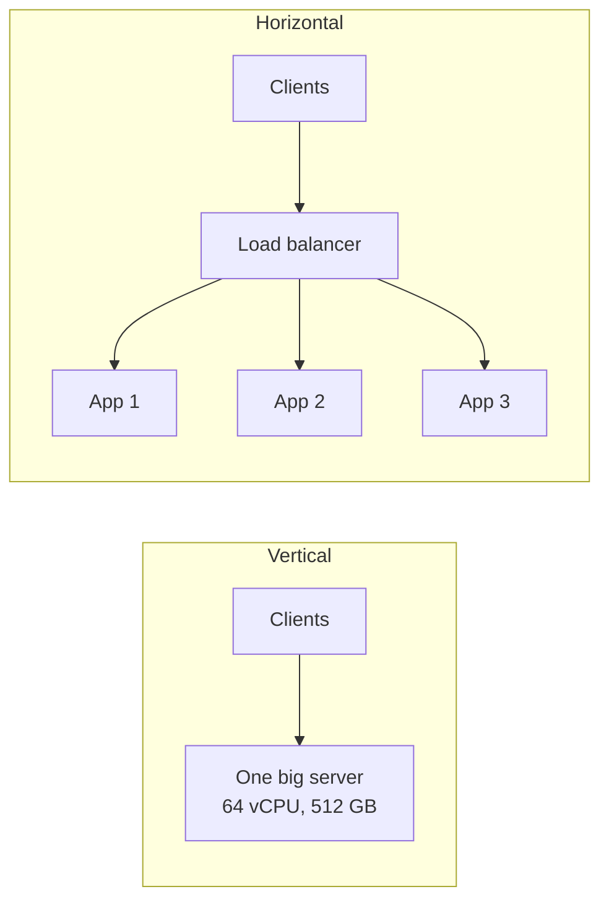
```mermaid
flowchart LR
  subgraph V["Vertical"]
    C1["Clients"] --> S1["One big server<br/>64 vCPU, 512 GB"]
  end
  subgraph H["Horizontal"]
    C2["Clients"] --> LB["Load balancer"]
    LB --> A1["App 1"]
    LB --> A2["App 2"]
    LB --> A3["App 3"]
  end
```

**Pros:**
- Vertical: no code changes, no distributed-systems problems, strong consistency stays easy.
- Horizontal: near-unlimited capacity, survives single-machine failure, can scale in and out with load.

**Cons / limits:**
- Vertical: hard ceiling (largest instance size), cost grows faster than capacity, still a single point of failure, resize often means downtime.
- Horizontal: needs load balancing, stateless design, and for data: replication lag, sharding, cross-node coordination.

**Use it when / avoid when:**
- Scale up first for databases while it is cheap: a well-tuned single Postgres primary handles far more than most startups need.
- Scale out stateless tiers (web, API, workers) from day one; it is easy and gives redundancy.
- Avoid premature sharding: it is the most expensive form of horizontal scaling to undo.

### Stateless services

**What it is:** A stateless service keeps no per-user data in its own memory or disk between requests. Any instance can handle any request because everything it needs comes with the request (a token) or from a shared store (database, cache).

**Why it's used:** It makes horizontal scaling and failure recovery trivial. If instance 3 dies mid-day, the load balancer sends the next request to instance 1 and the user notices nothing. Autoscaling can add or remove instances freely. Deploys can replace instances one by one.

**How it works:** Move session data into a signed token (JWT) or a shared session store (Redis). Move uploaded files to object storage (S3), not local disk. Move scheduled jobs to a queue or a single scheduler, not "every instance runs a cron".

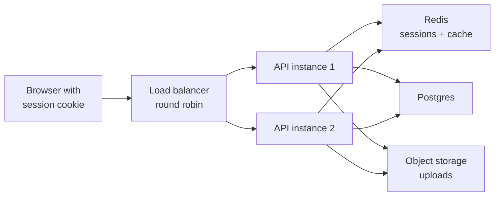
```mermaid
flowchart LR
  U["Browser with<br/>session cookie"] --> LB["Load balancer<br/>round robin"]
  LB --> I1["API instance 1"]
  LB --> I2["API instance 2"]
  I1 --> R["Redis<br/>sessions + cache"]
  I2 --> R
  I1 --> DB["Postgres"]
  I2 --> DB
  I1 --> OBJ["Object storage<br/>uploads"]
  I2 --> OBJ
```

**Pros:**
- Any instance serves any user, so no sticky sessions.
- Crashes lose nothing. Scaling is just "add instances".

**Cons / limits:**
- The state still exists: it moved to Redis or the DB, which now must scale and be highly available.
- Extra network hop per request for session lookup (often under 1 ms in-region).
- Some workloads are naturally stateful (WebSocket connections, game servers); you then need routing by user or room.

**Use it when / avoid when:**
- Default for every HTTP API.
- For connection-heavy services (chat, live prices), keep the connection layer thin and stateful, and the business logic stateless behind it.

> **Gotcha:** "Stateless" does not mean "no database". It means the *compute* instance is disposable. A common bug: an in-memory cache or rate-limit counter per instance, so limits are 10x too loose with 10 instances.

### Latency numbers every engineer should know

**What it is:** Rough orders of magnitude for how long common operations take. You do not memorise exact values; you memorise the ratios so you can tell whether a design is plausible.

**Why it's used:** Estimates drive design. If a page makes 40 sequential database calls at 1 ms each, that is 40 ms before any rendering. If a request crosses an ocean, you pay roughly 100–150 ms per round trip no matter how fast your code is.

**How it works:** Approximate values (they vary by hardware and year; treat them as orders of magnitude):

| Operation | Approximate time | Mental model |
|---|---|---|
| L1 cache reference | ~1 ns | instant |
| Main memory reference | ~100 ns | 100x L1 |
| Read 1 MB sequentially from memory | ~a few µs to 10 µs | |
| SSD random read (4 KB) | ~20–100 µs | 1,000x memory |
| Read 1 MB sequentially from SSD | ~50–200 µs | |
| Round trip within one datacenter / availability zone | ~0.5 ms | |
| Round trip across availability zones in a region | ~1–2 ms | |
| HDD seek | ~5–10 ms | why random HDD IO hurts |
| Round trip US East to US West | ~60–70 ms | |
| Round trip US to Europe | ~80–100 ms | |
| Round trip US to Asia/Australia | ~150–250 ms | speed of light in fibre |

Useful derived rules:
- Memory is about 1,000x faster than SSD random reads, which is why caches exist.
- Network inside a region is cheap; across continents it is the dominant cost. Avoid chatty cross-region calls.
- A user perceives 100 ms as instant, 1 s as a pause, 10 s as broken.

**Pros:** Lets you sanity-check designs in seconds.
**Cons / limits:** Numbers drift with hardware; queuing and tail latency (p99) often dominate the averages.

**Use it when / avoid when:**
- Use for back-of-envelope estimates and to justify caching, batching and colocation.
- Do not quote exact nanoseconds in an interview; say "roughly" and give orders of magnitude.

### Availability math: nines, SLAs and redundancy

**What it is:** Availability is the fraction of time a system works. "Three nines" is 99.9%. An SLA (Service Level Agreement) is a contractual promise, an SLO (objective) is your internal target, and an SLI (indicator) is the measured value, such as "successful requests / total requests".

**Why it's used:** It turns "make it reliable" into numbers you can design for and budget against. It also shows why chaining many services hurts.

**How it works:**

| Availability | Downtime per year | Per 30-day month |
|---|---|---|
| 99% | ~3.65 days | ~7.2 hours |
| 99.9% | ~8.76 hours | ~43 minutes |
| 99.95% | ~4.38 hours | ~22 minutes |
| 99.99% | ~52.6 minutes | ~4.3 minutes |
| 99.999% | ~5.26 minutes | ~26 seconds |

Components in **series** (a request needs all of them): multiply.
`A_total = A1 × A2 × A3`. Three services at 99.9% each give 0.999³ ≈ 99.7%.

Components in **parallel** (any one copy is enough): the system fails only if all copies fail.
`A_total = 1 − (1 − A)^n`. Two independent 99% instances give 1 − 0.01² = 99.99%.

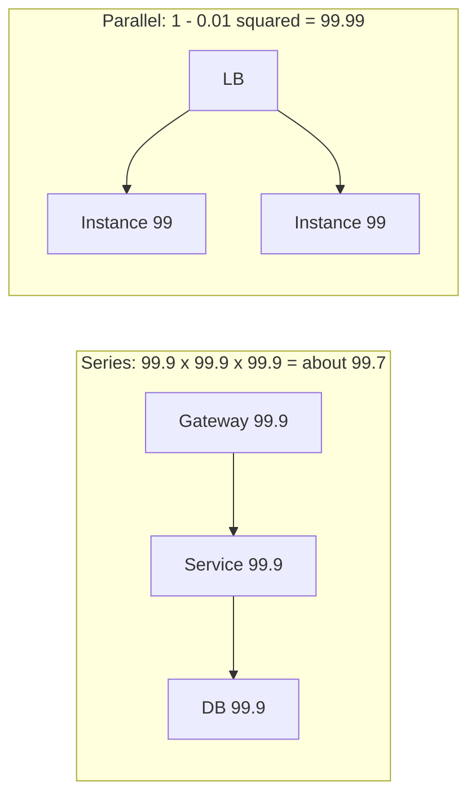
```mermaid
flowchart LR
  subgraph SER["Series: 99.9 x 99.9 x 99.9 = about 99.7"]
    G["Gateway 99.9"] --> S["Service 99.9"] --> D["DB 99.9"]
  end
  subgraph PAR["Parallel: 1 - 0.01 squared = 99.99"]
    LB["LB"] --> P1["Instance 99"]
    LB --> P2["Instance 99"]
  end
```

**Pros:** Makes trade-offs explicit: each extra hard dependency costs nines; each redundant copy buys them back.

**Cons / limits:**
- The parallel formula assumes *independent* failures. Two instances in the same rack, zone or with the same bad deploy fail together.
- Failover is not instant; detection plus switchover time counts as downtime.
- The error budget (100% − SLO) is consumed by deploys and incidents too.

**Use it when / avoid when:**
- Use when asked "how available will this be?" or when deciding whether a dependency must be synchronous.
- Turn hard dependencies into soft ones (cache, queue, fallback) to stop multiplying.

#### Q: [Mid] Our login flow calls the API gateway, auth service, user service and a fraud-scoring service, each at 99.9% availability. Product wants 99.95% for login. Is that achievable, and what would you change?

**Short answer:** Not as designed. Four hard dependencies in series at 99.9% each give about 99.6%, below even one service's availability. To reach 99.95% I would add redundancy to each tier and, more importantly, make fraud scoring a soft dependency with a fallback so it stops multiplying into the login path.

**Clarify first:**
- Are the 99.9% numbers measured per service, or vendor SLAs? Do they fail independently?
- Is fraud scoring required to log in, or can we allow login with a stricter fallback (step-up MFA) if it is down?
- How is availability measured: successful logins per minute, per region?

**Diagnose:** Compute the chain: 0.999⁴ ≈ 0.996, which is about 35 hours of downtime a year, roughly 3 hours a month. Then look at the incident history: which dependency actually caused login failures? Often it is one flaky service or a shared database.

**Solution:**
1. Run each service with at least 3 instances across availability zones, so an instance or zone failure does not take the tier down.
2. Make fraud scoring soft: call it with a tight timeout (e.g. 150 ms) and a circuit breaker. On failure, fall back to a rules-based score and require MFA. Login availability now no longer multiplies by fraud's 99.9%.
3. Cache user profile reads so a brief user-service outage does not block login for returning users.

```typescript
async function scoreLogin(ctx: LoginContext): Promise<RiskScore> {
  try {
    return await withTimeout(fraudClient.score(ctx), 150);
  } catch (err) {
    metrics.increment('fraud.fallback');
    // Degraded but safe: treat as medium risk and force MFA.
    return { level: 'medium', reason: 'fraud_unavailable', requireMfa: true };
  }
}
```

With three hard dependencies (gateway, auth, user) each made 99.99% through redundancy, the chain is about 99.97%, which meets the target.

**Trade-offs:**
- Fallback scoring lets slightly riskier logins through (mitigated by forcing MFA).
- More instances across zones cost more and need cross-zone data replication.
- Caching user data means a just-disabled user might log in briefly; keep TTL short and invalidate on disable.

**What interviewers listen for:**
- You multiply availabilities in series without being prompted.
- You know redundancy only helps with independent failure domains.
- You convert hard dependencies into soft ones instead of only buying more nines.
- Red flag: "just add more servers" without touching the dependency chain.

#### Q: [Mid] Do a quick estimate: a portfolio dashboard page makes 12 backend calls. Each call goes to a service in the same region that hits Postgres twice. The app is deployed in us-east-1, but 30% of users are in Singapore. Where does the time go?

**Short answer:** For US users it is mostly fine: a dozen in-region calls with two sub-millisecond DB queries each are tens of milliseconds even if sequential. For Singapore users the cross-Pacific round trip of roughly 200 ms dominates; if the browser makes those 12 calls with any sequential dependency, the page can take over a second. The fix is fewer round trips from the browser and serving them closer to the user.

**Clarify first:**
- Are the 12 calls made by the browser or server-side? In parallel or in waterfalls?
- Is the data user-specific (portfolio) or shared (market data)?
- Is there a regulatory reason data must stay in the US?

**Diagnose:** Open the Network tab with a Singapore VPN or a synthetic monitor in ap-southeast-1. Look at the waterfall: count sequential rounds. Server-side, an APM trace shows each call's duration. Expect each browser round trip at ~200 ms plus TLS setup on new connections.

**Solution:**
- Collapse the 12 calls into one backend-for-frontend (BFF) endpoint, so the browser pays one long round trip and the fan-out happens inside the region at ~1 ms per hop.
- Use HTTP/2 or HTTP/3 and keep connections warm so TLS handshakes do not add extra round trips.
- Put shared, cacheable data (instrument metadata, FX rates) on a CDN with edge caching.
- If Singapore grows, deploy read replicas and the BFF in ap-southeast-1.

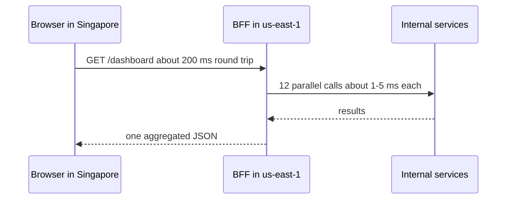
```mermaid
sequenceDiagram
  participant B as Browser in Singapore
  participant BFF as BFF in us-east-1
  participant S as Internal services
  B->>BFF: GET /dashboard about 200 ms round trip
  BFF->>S: 12 parallel calls about 1-5 ms each
  S-->>BFF: results
  BFF-->>B: one aggregated JSON
```

**Trade-offs:** A BFF is one more service to own. Regional replicas bring replication lag and data-residency questions.

**What interviewers listen for:**
- You separate in-region costs (cheap) from cross-ocean round trips (expensive).
- You count *sequential* round trips, not total calls.
- Red flag: optimising SQL first when the waterfall shows network is 90% of the time.

#### Q: [Senior] Our API servers are stateful: they keep user sessions and a per-user rate-limit counter in memory, and we use sticky sessions on the load balancer. We need to autoscale from 4 to 40 instances for month-end. What breaks and how do you fix it?

**Short answer:** Scaling in kills sessions on removed instances, scaling out leaves new instances idle because sticky users stay put, and per-instance rate limits become 10x looser at 40 instances. I would move sessions to a token or Redis, move the rate-limit counter to Redis, and remove sticky sessions so the load balancer can spread load evenly.

**Clarify first:** How are sessions created (cookie with session ID? Okta tokens?). How strict must the rate limit be? Are there other in-memory things: caches, scheduled jobs, WebSockets?

**Diagnose:** Grep for module-level `Map`s and singletons that store per-user data. Check LB metrics: uneven request counts per target are the signature of sticky sessions. Run a load test with scale-in during traffic and watch 401s.

**Solution:**
1. Sessions: store in Redis keyed by an opaque session ID cookie, or use short-lived signed tokens with refresh. Any instance can validate.
2. Rate limit: atomic counter in Redis (see the rate-limiting card in theme 5).
3. Local caches: keep them only for data that tolerates staleness, with short TTLs.
4. Cron jobs: move to a single scheduler or a queue with one consumer group, so 40 instances do not run the same job 40 times.
5. Remove stickiness; enable connection draining so in-flight requests finish during scale-in.

**Trade-offs:** Redis becomes a critical dependency: run it replicated (primary plus replica with automatic failover) and decide what happens if it is down (fail open on rate limiting, fail closed on sessions).

**What interviewers listen for:**
- You list all the hidden state, not just sessions.
- You mention connection draining and duplicate cron jobs.
- Red flag: keeping sticky sessions "because it works" without seeing the scale-in data loss.

## 2. Consistency and the CAP family

### CAP and PACELC

**What it is:** CAP says that when a network **P**artition splits your nodes, a distributed data store must choose between **C**onsistency (every read sees the latest write or gets an error) and **A**vailability (every request gets a non-error answer, possibly stale). PACELC extends it: if Partition, choose A or C; **E**lse (normal operation), choose **L**atency or **C**onsistency.

**Why it's used:** It explains why there is no "perfect" database. A bank ledger chooses consistency (refuse the write rather than double-spend). A social "like" counter chooses availability (show an approximate count rather than an error).

**How it works:** Partitions are not optional in real networks, so the real choice is C or A *during* a partition. PACELC adds the everyday trade-off: even without failures, synchronous replication to make reads consistent costs latency.

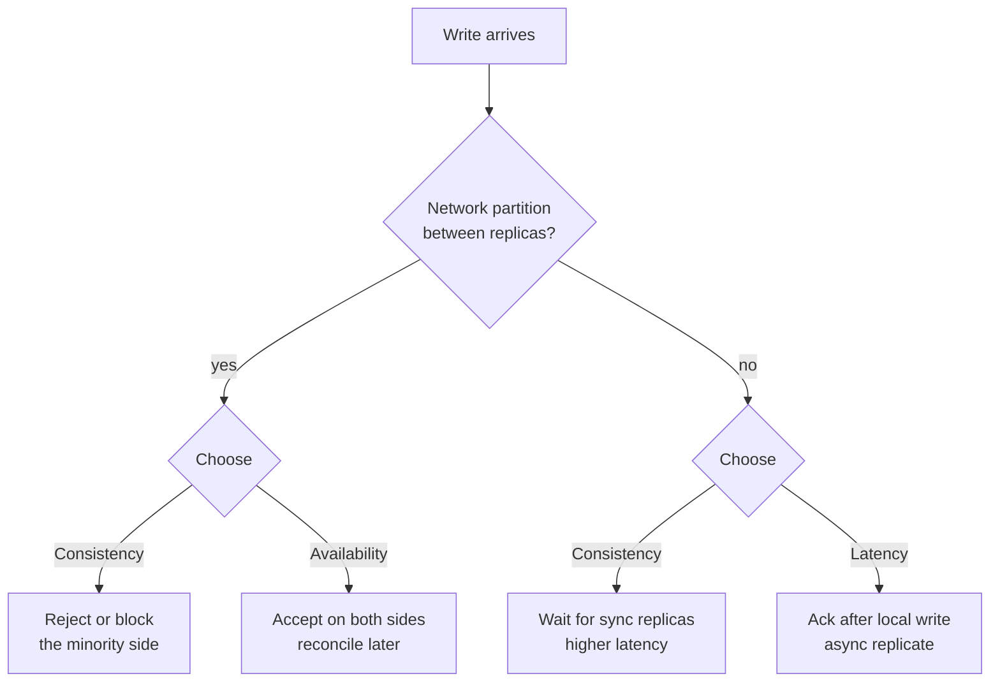
```mermaid
flowchart TD
  W["Write arrives"] --> P{"Network partition<br/>between replicas?"}
  P -->|"yes"| PC{"Choose"}
  PC -->|"Consistency"| E1["Reject or block<br/>the minority side"]
  PC -->|"Availability"| E2["Accept on both sides<br/>reconcile later"]
  P -->|"no"| EC{"Choose"}
  EC -->|"Consistency"| E3["Wait for sync replicas<br/>higher latency"]
  EC -->|"Latency"| E4["Ack after local write<br/>async replicate"]
```

Typical classifications (configuration dependent):

| System | Partition (P: A or C) | Else (L or C) |
|---|---|---|
| Single-primary Postgres with sync replica | C | C |
| Postgres with async replicas | C for writes; replicas may be stale | L |
| DynamoDB (default eventually consistent reads) | A | L; strongly consistent reads available per request |
| Cassandra | A by default, tunable via quorum levels | L, tunable |
| etcd, ZooKeeper, Spanner | C | C |

**Pros:** A shared vocabulary for trade-offs.

**Cons / limits:**
- CAP's "C" means linearizability, a very specific strong guarantee; its "A" means *every* non-failed node responds. Many real systems are neither fully CP nor fully AP.
- It says nothing about latency, which PACELC adds.

**Use it when / avoid when:**
- Use to explain *per-feature* choices: balances CP, activity feed AP.
- Avoid labelling a whole architecture "AP" or "CP"; different data in the same app makes different choices.

> **Interview tip:** Say "during a partition, this data chooses X because the cost of being wrong is Y". That is the senior framing.

### Consistency models

**What it is:** A consistency model is the promise a system makes about what a read can return after writes. From strongest to weakest:

- **Strong (linearizable):** once a write is acknowledged, every later read anywhere sees it. Behaves like a single copy.
- **Sequential / serializable:** everyone sees operations in the same order, not necessarily real-time order. (Serializable is the transaction-level analogue.)
- **Causal:** if A happened-before B (B was caused by seeing A), everyone sees A before B. Unrelated writes may appear in different orders.
- **Read-your-writes:** a user always sees their own writes. Others may still see old data.
- **Monotonic reads:** you never see data go "back in time" across reads.
- **Eventual:** if writes stop, all replicas converge eventually. No promise about when.

**Why it's used:** Stronger models are easier to reason about but cost latency and availability. Choosing the weakest model that is still correct for each feature is how large systems stay fast.

**How it works:** Real example: a user renames a payee, then the list reloads from a lagging read replica and shows the old name. That is a read-your-writes violation. Fix by routing that user's reads to the primary for a few seconds after a write, or by reading at a version at least as new as their last write.

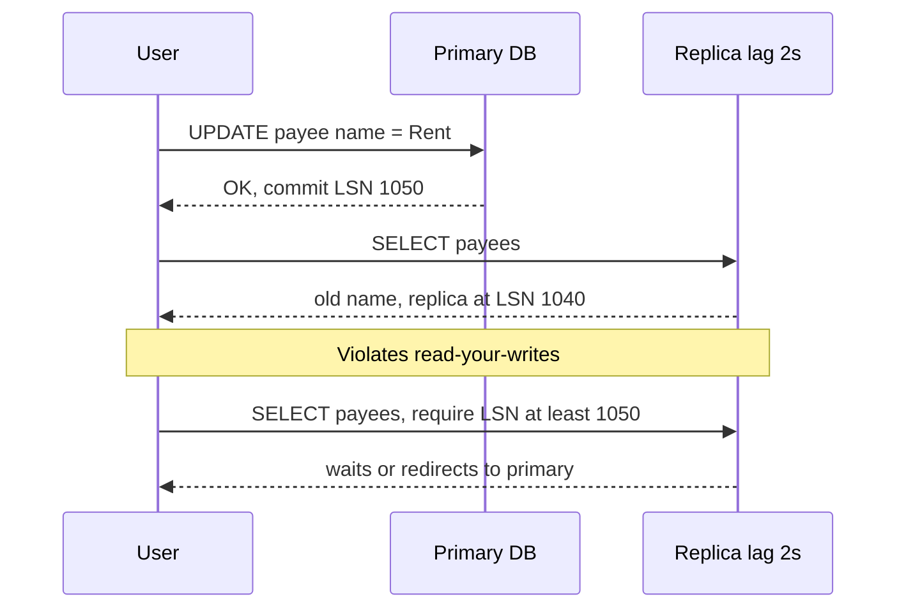
```mermaid
sequenceDiagram
  participant U as User
  participant P as Primary DB
  participant R as Replica lag 2s
  U->>P: UPDATE payee name = Rent
  P-->>U: OK, commit LSN 1050
  U->>R: SELECT payees
  R-->>U: old name, replica at LSN 1040
  Note over U,R: Violates read-your-writes
  U->>R: SELECT payees, require LSN at least 1050
  R-->>U: waits or redirects to primary
```

**Pros:** Weaker models allow local, low-latency reads and survive partitions.
**Cons / limits:** Weaker models push complexity into the app: users see stale data, comments appear before the post they reply to (causal violation), counters jump around.

**Use it when / avoid when:**
- Strong: balances, inventory counts at checkout, uniqueness (usernames), locks.
- Read-your-writes: profile edits, settings, anything a user changes and immediately views.
- Causal: comments and replies, chat messages.
- Eventual: view counts, recommendations, analytics, search indexes.

#### Q: [Mid] A customer transfers $500, the confirmation screen says "done", but when they go back to the accounts page the balance hasn't changed. Ten seconds later it's correct. Explain what's happening and fix it without sending all reads to the primary.

**Short answer:** The write went to the primary, but the accounts page read from an asynchronous read replica that was a few seconds behind. That is a read-your-writes violation, not data loss. I would make reads for that user session-consistent: route them to the primary, or to a replica that has caught up to their last write, for a short window after a write.

**Clarify first:** Do we use read replicas, a cache, or a search index for balances? How much lag is normal (check replica lag metric)? Is this only after the user's own writes?

**Diagnose:** Compare the write's commit time with the replica's `pg_last_xact_replay_timestamp()` lag. Check if a cache layer serves the balance with a TTL. Reproduce by writing and immediately reading from a replica.

**Solution:** Options from simplest to strongest:
1. After a write, set a short-lived marker (cookie or Redis key, e.g. 10 s) and route that user's reads to the primary while it exists.
2. Return the commit position (Postgres LSN) with the write response; on reads, pick a replica whose replayed LSN is at least that value, else use the primary.
3. Optimistic UI: the frontend updates the balance from the transfer response and reconciles when fresh data arrives. Good UX, but the backend must still be correct.

```typescript
// Route reads based on the user's last write position (Postgres LSN as text).
async function pickReadPool(userId: string): Promise<Pool> {
  const lastWriteLsn = await redis.get(`lsn:${userId}`); // set after each write, TTL 30s
  if (!lastWriteLsn) return replicaPool;
  const { rows } = await replicaPool.query(
    "SELECT pg_last_wal_replay_lsn() >= $1::pg_lsn AS caught_up",
    [lastWriteLsn],
  );
  return rows[0].caught_up ? replicaPool : primaryPool;
}
```

**Trade-offs:** Option 1 is easy but sends more load to the primary right after writes. Option 2 is precise but more complex. Optimistic UI alone hides the bug rather than fixing it.

**What interviewers listen for:**
- Names the guarantee (read-your-writes) and the cause (replication lag).
- Scopes strong reads to the user who wrote, not everyone.
- Red flag: "turn off replicas" or "add a sleep".

#### Q: [Senior] For a new trading app, the team argues about whether to use a "CP" or "AP" database. Positions, cash balances, watchlists, price alerts and the news feed all need storing. How do you frame the decision?

**Short answer:** It is not one choice for the whole app. Cash and positions must be correct even during failures, so they go in a CP store and we accept rejecting writes during a partition. Watchlists and alerts can tolerate brief staleness and use read-your-writes. The news feed is eventually consistent and should favour availability and latency.

**Clarify first:** Single region or multi-region? Latency targets per feature? Regulatory needs (ledger auditability)? What does "down" cost for each feature?

**Solution:**

| Data | Cost of stale or conflicting data | Choice | Example store |
|---|---|---|---|
| Cash balance, positions, ledger | Money lost, regulatory breach | CP, serializable transactions | Postgres or Aurora primary, or Spanner-style DB |
| Orders | Duplicate or lost orders | CP plus idempotency keys | Same ledger DB |
| Watchlists, settings | Annoyance | Read-your-writes, eventual to others | DynamoDB or Postgres replica with session routing |
| Price alerts | Late alert, minor | Eventual, at-least-once evaluation | Redis plus a queue |
| News feed | None really | AP, eventual | Cache plus document store |

During a partition, a CP ledger rejects trades from the minority side and the UI shows "trading temporarily unavailable". That is the correct failure for money.

**Trade-offs:** Multiple stores mean more operational work and more data syncing (outbox or CDC). One CP store for everything is simpler but makes non-critical features pay CP latency and availability costs.

**What interviewers listen for:**
- Per-data decisions with the cost of being wrong stated.
- Knows CAP only bites during partitions, and PACELC's latency trade-off applies all the time.
- Red flag: "we'll use NoSQL because it scales" without discussing consistency.

## 3. Spreading data: replication, sharding, consistent hashing

### Replication: leader-follower, multi-leader, leaderless

**What it is:** Replication keeps copies of the same data on several machines. It gives redundancy (survive a node loss), read scaling (more copies to read from) and lower latency (a copy near the user).

**Why it's used:** A single database node is a single point of failure and a read bottleneck. Almost every production database runs with at least one replica.

**How it works:** Three main styles:

- **Leader-follower (primary-replica):** all writes go to one leader, which streams changes to followers. Followers serve reads. Replication can be synchronous (leader waits for a follower before acking, no data loss on failover, slower) or asynchronous (fast, but a failover can lose the last few writes). Postgres, MySQL, Aurora, MongoDB replica sets work this way.
- **Multi-leader:** several nodes accept writes (typically one per region) and replicate to each other. Writes are local and fast, but two regions can modify the same row concurrently, so you need conflict resolution: last-write-wins, merge functions, or CRDTs.
- **Leaderless (Dynamo-style):** the client or a coordinator writes to N replicas and waits for W acks; reads ask R replicas and take the newest. If **W + R > N**, every read set overlaps every write set in at least one node, so a read sees the latest acknowledged write (with caveats around concurrent writes and sloppy quorums). Cassandra, ScyllaDB and Riak use this. DynamoDB is inspired by Dynamo but exposes a different, managed model.

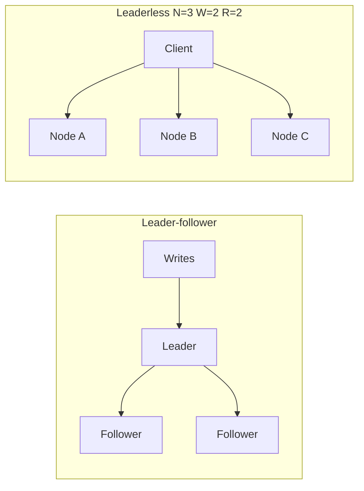
```mermaid
flowchart LR
  subgraph LF["Leader-follower"]
    W1["Writes"] --> L["Leader"]
    L --> F1["Follower"]
    L --> F2["Follower"]
  end
  subgraph LL["Leaderless N=3 W=2 R=2"]
    C["Client"] --> N1["Node A"]
    C --> N2["Node B"]
    C --> N3["Node C"]
  end
```

Repair mechanisms in leaderless systems: **read repair** (on a read, update stale replicas), **hinted handoff** (a neighbour holds writes for a down node and replays them), **anti-entropy** (background comparison with Merkle trees).

**Pros:**
- Leader-follower: simple mental model, no write conflicts.
- Multi-leader: local writes in every region, survives region loss.
- Leaderless: no failover step, tolerates node failures smoothly, tunable consistency per query.

**Cons / limits:**
- Leader-follower: leader is a write bottleneck; failover needs care (split brain, lost async writes); followers lag.
- Multi-leader: conflicts are hard and often silently lose data with last-write-wins.
- Leaderless: quorums are not transactions; concurrent writes still conflict; operational tuning is harder.

**Use it when / avoid when:**
- Leader-follower: default for relational data and anything with transactions or money.
- Multi-leader: offline-capable apps, collaborative editing, multi-region with naturally partitioned data (each user's data mostly written in one region).
- Leaderless: very high write throughput, time series, carts, user activity, where some conflict handling is acceptable.

### Sharding (partitioning) strategies and hot keys

**What it is:** Sharding splits one dataset across several databases (shards), each holding a subset of rows. Replication copies the same data; sharding divides it. Most large systems do both: each shard is itself replicated.

**Why it's used:** When one primary cannot handle the write volume or the data no longer fits on one machine. Example: 5 billion transaction rows growing 200 GB per month.

**How it works:** You pick a **shard key** and a strategy:

| Strategy | How rows map to shards | Good for | Weakness |
|---|---|---|---|
| Range | `account_id 1–1M → shard 1` or by date | Range scans, time queries | Hot spots: newest dates all hit one shard |
| Hash | `hash(account_id) mod N` | Even spread | Range queries hit all shards; changing N moves most keys |
| Consistent hash | Hash ring with virtual nodes | Even spread, cheap rebalancing | Still no range scans |
| Directory / lookup | Table maps tenant → shard | Flexible moves, big tenants on own shard | Lookup service is a dependency |
| Geo | By user region | Data residency, latency | Uneven region sizes |

A **hot key** is one key that gets far more traffic than others: a celebrity's profile, a popular stock symbol, one huge tenant. Even perfect hashing sends all of that key's traffic to one shard.

Hot-key fixes:
- Cache the hot read (in-memory plus CDN). Most hot keys are read-hot.
- For write-hot counters, **split the key**: write to `likes:post123:{0..15}` randomly, and sum on read.
- Give a huge tenant its own shard via a directory.
- Add request coalescing so 1,000 concurrent misses become one DB query.

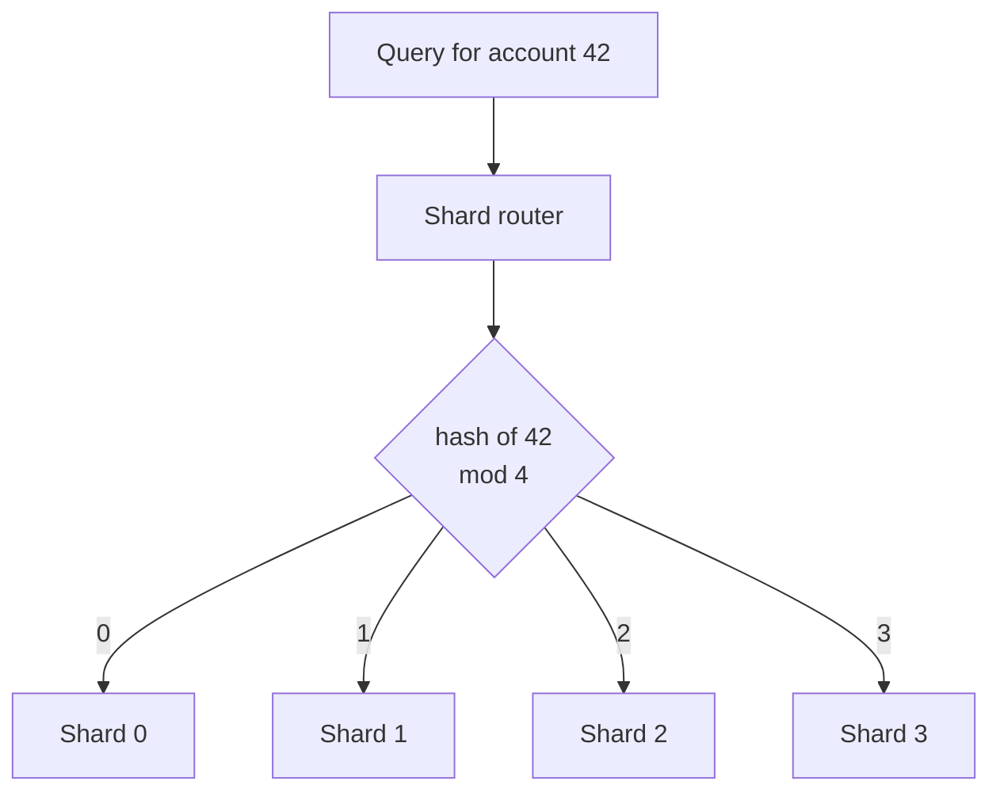
```mermaid
flowchart TD
  Q["Query for account 42"] --> R["Shard router"]
  R --> H{"hash of 42<br/>mod 4"}
  H -->|"0"| S0["Shard 0"]
  H -->|"1"| S1["Shard 1"]
  H -->|"2"| S2["Shard 2"]
  H -->|"3"| S3["Shard 3"]
```

**Pros:** Near-linear write scaling; smaller indexes per shard; failure blast radius limited to one shard.

**Cons / limits:**
- Cross-shard queries and joins become scatter-gather, slow and complex.
- Cross-shard transactions need two-phase commit or sagas.
- Choosing the wrong key is very expensive to change later.
- Rebalancing moves data while serving traffic.

**Use it when / avoid when:**
- Shard when vertical scaling plus read replicas plus caching are exhausted, or data size forces it.
- Choose a key that matches the dominant access pattern (most queries include it) and has high cardinality.
- Avoid sharding by a low-cardinality field (country, status) or a monotonically increasing value with range sharding.

### Consistent hashing

**What it is:** A way to map keys to nodes so that adding or removing a node moves only about 1/N of the keys, instead of nearly all of them. Picture a clock face: nodes sit at positions on the ring, and each key belongs to the next node clockwise.

**Why it's used:** With plain `hash(key) mod N`, going from 4 to 5 cache nodes remaps about 80% of keys, so the cache empties and the database gets hammered. Consistent hashing remaps about 20%.

**How it works:** Hash each node to several points on the ring (**virtual nodes**, e.g. 100–200 per physical node) to even out the load. Hash the key; walk clockwise to the first virtual node; that node owns it. Replicas go to the next distinct physical nodes clockwise.

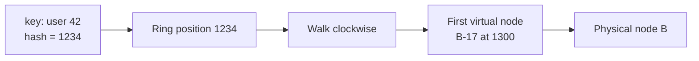
```mermaid
flowchart LR
  K["key: user 42<br/>hash = 1234"] --> RING["Ring position 1234"]
  RING --> CW["Walk clockwise"]
  CW --> VN["First virtual node<br/>B-17 at 1300"]
  VN --> PN["Physical node B"]
```

```typescript
import { createHash } from 'node:crypto';

class HashRing {
  private ring: { pos: number; node: string }[] = [];
  constructor(nodes: string[], private vnodes = 150) {
    nodes.forEach((n) => this.add(n));
  }
  private hash(s: string): number {
    return createHash('md5').update(s).digest().readUInt32BE(0);
  }
  add(node: string): void {
    for (let i = 0; i < this.vnodes; i++) {
      this.ring.push({ pos: this.hash(`${node}#${i}`), node });
    }
    this.ring.sort((a, b) => a.pos - b.pos);
  }
  remove(node: string): void {
    this.ring = this.ring.filter((v) => v.node !== node);
  }
  get(key: string): string {
    const h = this.hash(key);
    // Binary search for the first position >= h, wrapping to 0.
    let lo = 0;
    let hi = this.ring.length;
    while (lo < hi) {
      const mid = (lo + hi) >> 1;
      if (this.ring[mid].pos < h) lo = mid + 1;
      else hi = mid;
    }
    return this.ring[lo % this.ring.length].node;
  }
}
```

**Pros:** Minimal key movement on membership change; easy to weight nodes (more vnodes for bigger machines).
**Cons / limits:** Does not fix hot keys; needs a consistent membership view on every client; range queries impossible.

**Use it when / avoid when:**
- Distributed caches (client-side sharding of Memcached/Redis), Dynamo-style databases, CDN and load-balancer affinity.
- Redis Cluster uses a related but different scheme: 16,384 fixed hash slots assigned to nodes. Same goal, explicit slot migration.

#### Q: [Senior] Our transactions table has 3 billion rows and the single Postgres primary is at 85% CPU from writes. Someone proposes sharding by `created_at` month. What do you think, and what would you do?

**Short answer:** Sharding by month is a range shard on a monotonically increasing key, so every new write lands on the current month's shard: we'd move the hot spot, not remove it. Before sharding at all I'd check whether writes can be reduced or batched and whether partitioning inside Postgres helps. If we must shard, I'd shard by `account_id` (hash or directory), because almost every query is "transactions for this account", and keep time-based partitioning inside each shard for retention.

**Clarify first:**
- What are the top queries by volume? Do they all filter by account?
- Write rate (rows per second) and growth? Is CPU from writes, index maintenance, or something else (autovacuum, bad queries)?
- Any cross-account queries (admin reports, reconciliation)? Can those go to a warehouse?

**Diagnose:** `pg_stat_statements` for top queries by total time. Check index count on the table (each index multiplies write cost). Check whether CPU is from a few unindexed reads disguised as "write load".

**Solution:**
1. Cheap wins: drop unused indexes, batch inserts, move analytics reads to a replica or warehouse.
2. Native partitioning by month inside one Postgres (`PARTITION BY RANGE (created_at)`). This helps retention and vacuum, but not write CPU on one primary.
3. Shard by `account_id`. Use a directory table for flexibility so a huge corporate account can move to its own shard.

```sql
-- Inside each shard: range partitions by month for retention and pruning.
CREATE TABLE transactions (
  id            bigint       NOT NULL,
  account_id    bigint       NOT NULL,
  amount_cents  bigint       NOT NULL,
  created_at    timestamptz  NOT NULL,
  PRIMARY KEY (account_id, created_at, id)
) PARTITION BY RANGE (created_at);

CREATE TABLE transactions_2026_10 PARTITION OF transactions
  FOR VALUES FROM ('2026-10-01') TO ('2026-11-01');
```

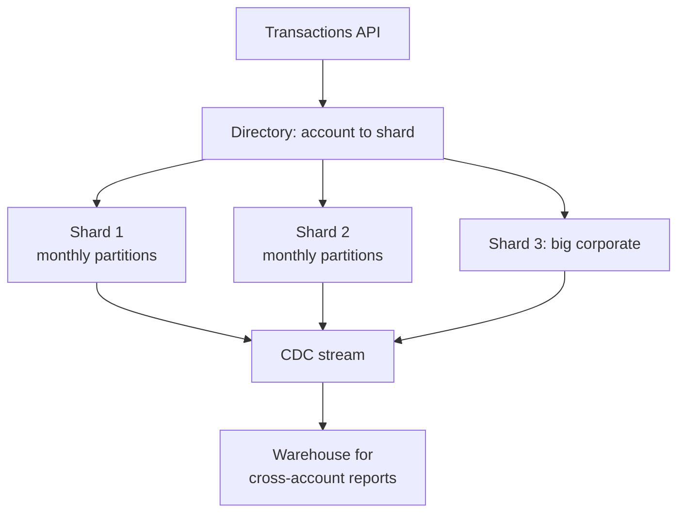
```mermaid
flowchart TD
  API["Transactions API"] --> DIR["Directory: account to shard"]
  DIR --> S1["Shard 1<br/>monthly partitions"]
  DIR --> S2["Shard 2<br/>monthly partitions"]
  DIR --> S3["Shard 3: big corporate"]
  S1 --> CDC["CDC stream"]
  S2 --> CDC
  S3 --> CDC
  CDC --> WH["Warehouse for<br/>cross-account reports"]
```

**Trade-offs:** Account-based sharding makes cross-account queries scatter-gather, so they move to the warehouse via CDC. A directory adds a lookup (cache it). Managed options (Citus, Aurora Limitless, Vitess for MySQL, or a distributed SQL DB) reduce custom work but add vendor coupling; hedge on exact feature sets.

**What interviewers listen for:**
- Spots the monotonically increasing range-key hot spot immediately.
- Chooses the shard key from the access pattern.
- Exhausts cheaper options first.
- Red flag: sharding without a plan for cross-shard queries and rebalancing.

#### Q: [Senior] At market open, one stock symbol gets 40% of all quote reads and order writes. Our Redis cluster's node holding that key is at 100% CPU while the others idle. How do you handle a hot key?

**Short answer:** Separate the read-hot and write-hot parts. For reads, put a short-lived in-process cache (even 100–500 ms) in front of Redis and fan out quotes via pub/sub so we read once and push many times. For write-hot counters, split the key into sub-keys and aggregate. For order writes, partition the work by order ID instead of by symbol where correctness allows.

**Clarify first:** Is the hot traffic reads (quotes) or writes (order counts, volume)? How fresh must quotes be? Is the hot key predictable (market open, earnings)?

**Diagnose:** `redis-cli --hotkeys` (requires an LFU eviction policy) or Redis `MONITOR` sampling briefly (expensive; use with care), or client-side metrics per key. Check the slot-to-node mapping.

**Solution:**
- **Local cache with short TTL** in each API instance: 50 instances × 2 reads per second instead of 200,000 Redis reads per second.
- **Request coalescing** ("single flight"): concurrent misses for the same key share one fetch.
- **Replicate the hot key**: store copies as `quote:AAPL:{0..7}` on different slots; readers pick a random copy, writers update all.
- **Split write counters**: `INCR volume:AAPL:{rand 0..15}` and sum with a periodic job.
- **Push instead of pull**: one consumer subscribes to the price feed and broadcasts to WebSocket gateways.

```typescript
const inflight = new Map<string, Promise<Quote>>();

async function getQuote(symbol: string): Promise<Quote> {
  const cached = localCache.get(symbol);
  if (cached && Date.now() - cached.at < 250) return cached.value;
  const existing = inflight.get(symbol);
  if (existing) return existing;
  const p = redis.get(`quote:${symbol}:${Math.floor(Math.random() * 8)}`)
    .then((raw) => {
      const value = JSON.parse(raw ?? 'null') as Quote;
      localCache.set(symbol, { value, at: Date.now() });
      return value;
    })
    .finally(() => inflight.delete(symbol));
  inflight.set(symbol, p);
  return p;
}
```

**Trade-offs:** Local caches serve slightly stale quotes (label them with a timestamp). Replicated keys cost extra writes. Split counters make reads more expensive and slightly delayed.

**What interviewers listen for:**
- Knows that consistent hashing and more shards do not fix a single hot key.
- Distinguishes read-hot from write-hot.
- Red flag: "just add Redis nodes".

#### Q: [Mid] We have 4 cache nodes using `hash(key) % 4`. We add a fifth during peak, and the database falls over. Why, and how would consistent hashing have helped?

**Short answer:** Changing the modulus from 4 to 5 remaps about 80% of keys, so almost every cache lookup missed at once and all that traffic went to the database: a self-inflicted cache stampede. Consistent hashing with virtual nodes would have moved only about 1/5 of keys to the new node, keeping the hit rate high.

**Clarify first:** Is the cache client-side sharded, or a managed cluster? Is there request coalescing or a DB connection limit?

**Solution:**
- Use consistent hashing (or Redis Cluster's hash slots, migrated gradually).
- Add nodes off-peak, and warm the new node first.
- Protect the DB anyway: request coalescing, a connection pool cap, and stale-while-revalidate so expired entries can be served briefly while refreshing.

The math: with mod-N hashing, a key keeps its node only if `h % 4 == h % 5`, which is true for roughly 1 in 5 keys. With consistent hashing, only keys landing in the new node's ring segments move, about 1/5 in total.

**Trade-offs:** Consistent hashing needs all clients to agree on the member list; a client with an old view reads the wrong node (a miss, not wrong data, for a cache).

**What interviewers listen for:** Quantifies the remap; mentions DB protection, not only the hashing fix.

## 4. Coordination and correctness

### Leader election and consensus (Raft at intuition level)

**What it is:** Consensus is how a group of machines agrees on one value (or one ordered log of values) even if some crash or messages are delayed. Leader election is the most common use: agree on exactly one node that is in charge. Raft is a consensus algorithm designed to be understandable; Paxos is the older, harder-to-read cousin.

**Why it's used:** Many systems need "exactly one" of something: one primary database, one scheduler running month-end jobs, one owner of a shard. Without consensus, a network blip can produce two leaders (split brain) that both accept writes.

**How it works (Raft intuition):**
- Nodes are followers, candidates or the leader. Time is divided into numbered **terms**.
- The leader sends heartbeats. If a follower hears nothing for a randomized timeout (e.g. 150–300 ms), it becomes a candidate, increments the term and asks for votes.
- A node votes once per term, and only for a candidate whose log is at least as up to date as its own. A candidate with votes from a **majority** becomes leader. Randomized timeouts make split votes rare.
- Clients send writes to the leader. The leader appends to its log and replicates to followers. An entry is **committed** once a majority has stored it; then it is applied to the state machine.
- A majority is required for both elections and commits, so two leaders cannot both commit in the same term. With 5 nodes you tolerate 2 failures; with 3 nodes, 1.

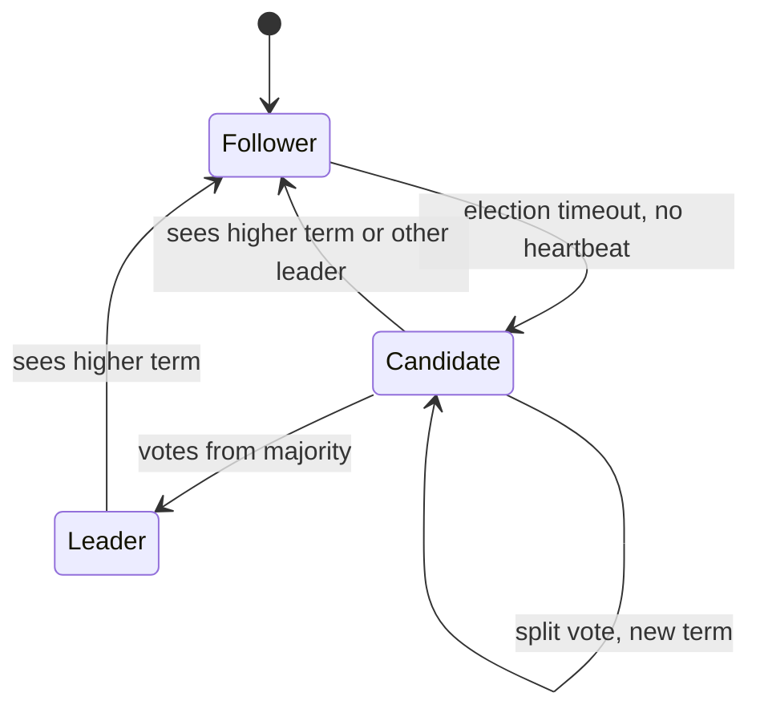
```mermaid
stateDiagram-v2
  [*] --> Follower
  Follower --> Candidate: election timeout, no heartbeat
  Candidate --> Leader: votes from majority
  Candidate --> Follower: sees higher term or other leader
  Candidate --> Candidate: split vote, new term
  Leader --> Follower: sees higher term
```

**Pros:** Correct under crashes and arbitrary message delays (not malicious nodes). Battle-tested in etcd, Consul, CockroachDB, TiKV, Kafka KRaft.

**Cons / limits:**
- Needs a majority alive: a 5-node cluster split 2/3 makes the 2-node side unable to write (that is the "C" choice in CAP).
- Every write costs a round trip to a majority, so cross-region consensus adds tens to hundreds of milliseconds.
- Does not handle Byzantine (lying) nodes.

**Use it when / avoid when:**
- Do not implement it yourself. Use etcd, ZooKeeper, Consul, or a managed database's built-in failover.
- Use for metadata, configuration, locks, leader election; not for high-volume business data unless the database does it internally.
- Use odd cluster sizes (3, 5); 4 nodes tolerate the same 1 failure as 3.

### Idempotency and the exactly-once myth

**What it is:** An operation is idempotent if doing it twice has the same effect as doing it once. "Set balance to 100" is idempotent; "add 100 to balance" is not. "Exactly-once delivery" over a network is impossible in general: a sender that gets no ack cannot tell whether the message was lost or the ack was lost, so it must retry (at-least-once) or give up (at-most-once).

**Why it's used:** Retries are everywhere: browsers, mobile apps on flaky networks, load balancers, queue consumers. Without idempotency, a retried "transfer $500" sends $1,000.

**How it works:** What systems call "exactly-once" is really **at-least-once delivery + idempotent processing = effectively-once effect**.
- Client generates an **idempotency key** (UUID) per user intent and sends it with the request.
- Server stores the key with the result in the same transaction as the side effect, under a unique constraint.
- A retry with the same key returns the stored result instead of redoing the work.
- Queue consumers do the same with the message ID (an inbox / dedupe table).

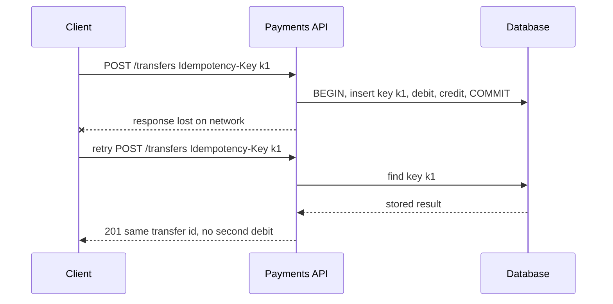
```mermaid
sequenceDiagram
  participant C as Client
  participant API as Payments API
  participant DB as Database
  C->>API: POST /transfers Idempotency-Key k1
  API->>DB: BEGIN, insert key k1, debit, credit, COMMIT
  API--xC: response lost on network
  C->>API: retry POST /transfers Idempotency-Key k1
  API->>DB: find key k1
  DB-->>API: stored result
  API-->>C: 201 same transfer id, no second debit
```

```sql
CREATE TABLE idempotency_keys (
  key          uuid PRIMARY KEY,
  user_id      bigint NOT NULL,
  request_hash text   NOT NULL,     -- reject same key with a different body
  response     jsonb,
  created_at   timestamptz NOT NULL DEFAULT now()
);
-- In the transfer transaction:
-- INSERT INTO idempotency_keys(key, user_id, request_hash) VALUES ($1, $2, $3);
-- A unique violation means "already processed or in progress": return the stored response.
```

**Pros:** Makes retries safe everywhere, so you can retry aggressively for reliability.
**Cons / limits:** Storage for keys (expire after e.g. 24 hours to 7 days); must cover side effects outside your DB (call downstream with the same key); concurrent duplicates need the unique constraint, not a "check then insert".

**Use it when / avoid when:**
- Any non-idempotent write that clients may retry: payments, orders, sign-ups, sending emails.
- Kafka's "exactly-once semantics" covers read-process-write *within Kafka* via idempotent producers and transactions; once you write to an external DB or call an API, you need your own idempotency.

### Distributed locks

**What it is:** A lock that works across machines, so only one process at a time does something: run a nightly settlement, refresh a token, process one account's statement.

**Why it's used:** Stateless services run many copies. Without a lock, all 20 instances may start the same job.

**How it works:** Common implementations:
- **Database:** `SELECT ... FOR UPDATE` on a row, or Postgres advisory locks (`pg_try_advisory_lock`). Simple and correct within one DB.
- **Redis:** `SET lock:job123 <random-token> NX PX 30000` (set only if absent, expires in 30 s). Release only if the value still matches your token (use a Lua script for atomic compare-and-delete).
- **Coordination service:** etcd or ZooKeeper leases with session-based ownership and revision numbers.

The deep problem: a lock holder can pause (GC, VM freeze, network) longer than the lease. The lock expires, another process acquires it, and the first wakes up still thinking it holds it. Solution: **fencing tokens**. The lock service hands out a monotonically increasing number with each grant; the protected resource rejects writes with a token lower than the highest it has seen.

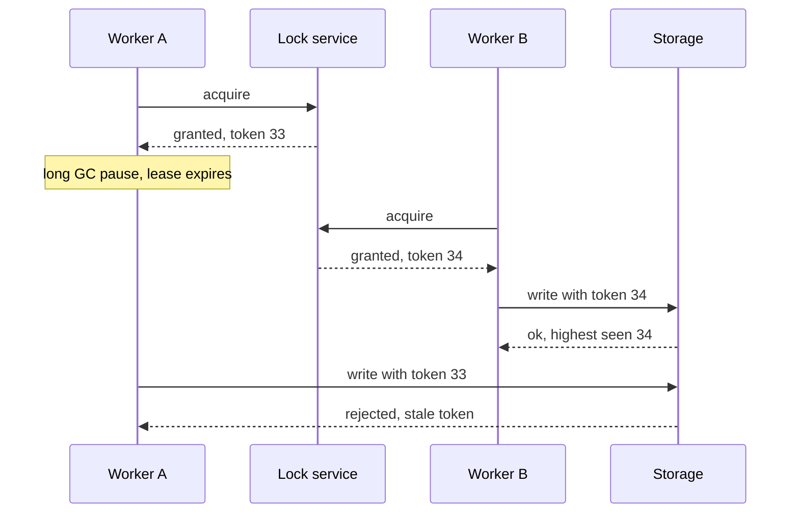
```mermaid
sequenceDiagram
  participant A as Worker A
  participant L as Lock service
  participant B as Worker B
  participant S as Storage
  A->>L: acquire
  L-->>A: granted, token 33
  Note over A: long GC pause, lease expires
  B->>L: acquire
  L-->>B: granted, token 34
  B->>S: write with token 34
  S-->>B: ok, highest seen 34
  A->>S: write with token 33
  S-->>A: rejected, stale token
```

```typescript
// Redis lock with safe release. Good for efficiency locks, not for correctness on its own.
const RELEASE = `
if redis.call("get", KEYS[1]) == ARGV[1] then
  return redis.call("del", KEYS[1])
else
  return 0
end`;

async function withLock<T>(name: string, ttlMs: number, fn: () => Promise<T>): Promise<T | null> {
  const token = crypto.randomUUID();
  const ok = await redis.set(`lock:${name}`, token, 'PX', ttlMs, 'NX');
  if (ok !== 'OK') return null; // someone else holds it
  try {
    return await fn();
  } finally {
    await redis.eval(RELEASE, 1, `lock:${name}`, token);
  }
}
```

**Pros:** Prevents duplicate work; simple with Redis or the DB.

**Cons / limits:**
- Timeouts plus pauses make "only one holder" unguaranteed without fencing.
- Redlock (multi-node Redis locking) is debated; well-known critiques argue it is unsafe for correctness without fencing. Prefer etcd/ZooKeeper or the database for correctness-critical locks.
- Locks reduce availability: if the lock service is down, the work stops.

**Use it when / avoid when:**
- Distinguish **efficiency locks** (duplicate work is wasteful but harmless; Redis is fine) from **correctness locks** (duplicates corrupt data; use DB transactions, unique constraints, or consensus-backed locks with fencing).
- Often you can avoid a lock entirely: unique constraints, conditional writes (`UPDATE ... WHERE version = 7`), or partitioning work so one consumer owns each key.

### Clocks and ordering: why timestamps lie

**What it is:** Every machine has its own clock, and they drift. NTP keeps them close (often within milliseconds in a datacenter, worse over the internet), but clocks can jump backwards on correction, VMs can pause, and leap seconds have caused outages. So "the event with the bigger timestamp happened later" is not reliable across machines.

**Why it's used:** Ordering matters: which write wins, which message comes first, whether a token is expired. Last-write-wins (LWW) with wall-clock timestamps can silently drop a later write if the later writer's clock is behind.

**How it works:**
- **Physical clocks:** fine for display and rough ordering; not for correctness across machines. Use a **monotonic clock** (`performance.now()`, `process.hrtime`) for measuring durations on one machine.
- **Lamport clocks:** each node keeps a counter; increment on every event; send it with messages; on receive, set `counter = max(local, received) + 1`. Gives a total order consistent with causality (if A caused B, then L(A) < L(B)), but L(A) < L(B) does not prove A caused B.
- **Vector clocks:** each node keeps a counter per node. Can tell "A before B", "B before A" or "concurrent" (a real conflict). Used for conflict detection in Dynamo-style stores.
- **Hybrid logical clocks (HLC):** physical time plus a logical counter; close to wall time and causally consistent. Used by CockroachDB and others.
- **Bounded uncertainty:** Google Spanner's TrueTime exposes an uncertainty interval and waits it out before committing, giving externally consistent timestamps. Needs special hardware (GPS, atomic clocks).
- **Single sequencer:** when you need a global order, let one authority assign it (a DB sequence, a Kafka partition offset).

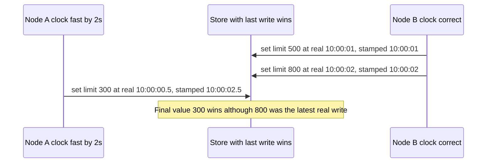
```mermaid
sequenceDiagram
  participant A as Node A clock fast by 2s
  participant DB as Store with last write wins
  participant B as Node B clock correct
  B->>DB: set limit 500 at real 10:00:01, stamped 10:00:01
  B->>DB: set limit 800 at real 10:00:02, stamped 10:00:02
  A->>DB: set limit 300 at real 10:00:00.5, stamped 10:00:02.5
  Note over DB: Final value 300 wins although 800 was the latest real write
```

**Pros:** Logical clocks give correct causal order without trusting hardware.
**Cons / limits:** Vector clocks grow with node count; logical clocks don't match wall time; global ordering through a single sequencer is a throughput bottleneck.

**Use it when / avoid when:**
- Use per-partition ordering (Kafka partition per account) instead of global ordering where you can.
- Use DB-generated timestamps or versions for conflict checks, not client clocks.
- Never trust client device clocks for anything security-relevant (token expiry is checked on the server, with some skew allowance).

#### Q: [Senior] Our message consumer charges cards for subscription renewals. During a deploy we saw a few customers charged twice. The queue promises "exactly-once". What actually happened and how do you make this safe?

**Short answer:** The queue gave at-least-once delivery in practice: a consumer charged the card, then was killed before acknowledging the message, so the message was redelivered and charged again. Exactly-once delivery doesn't exist across a network; we need idempotent processing. I'd give each renewal a deterministic idempotency key, record it in our DB with a unique constraint, and pass the same key to the payment provider so their side dedupes too.

**Clarify first:** Which queue (SQS standard is at-least-once; SQS FIFO deduplicates within a 5-minute window on send; Kafka depends on consumer commit timing)? Does the payment provider support idempotency keys (most major ones do)? Is the charge step separate from the bookkeeping step?

**Diagnose:** Find the duplicate charges and their message IDs in logs. You will likely see the same message ID processed twice, with a shutdown or visibility timeout expiring in between. Check if the consumer's processing time sometimes exceeds the visibility timeout.

**Solution:**

```typescript
async function handleRenewal(msg: { subscriptionId: string; periodStart: string }) {
  // Deterministic: the same renewal always has the same key, regardless of message ID.
  const key = `renewal:${msg.subscriptionId}:${msg.periodStart}`;

  const claimed = await db.query(
    `INSERT INTO renewal_charges (idem_key, status) VALUES ($1, 'pending')
     ON CONFLICT (idem_key) DO NOTHING RETURNING idem_key`,
    [key],
  );
  if (claimed.rowCount === 0) {
    const existing = await db.query('SELECT status FROM renewal_charges WHERE idem_key = $1', [key]);
    if (existing.rows[0].status === 'succeeded') return; // already done, just ack
    // 'pending': a previous attempt may have crashed mid-way. Fall through and retry
    // the charge safely, because the provider dedupes on the same key.
  }

  const charge = await paymentProvider.charge({
    subscriptionId: msg.subscriptionId,
    amountCents: 999,
    idempotencyKey: key, // provider returns the original charge on retry
  });

  await db.query(
    `UPDATE renewal_charges SET status = 'succeeded', provider_charge_id = $2 WHERE idem_key = $1`,
    [key, charge.id],
  );
}
```

Also: graceful shutdown (stop pulling, finish in-flight messages, then exit), and set the visibility timeout well above p99 processing time, or extend it while working.

**Trade-offs:** A dedupe table costs a write per message and needs cleanup. Deterministic keys must truly identify the business intent; using a random UUID per attempt defeats the purpose.

**What interviewers listen for:**
- Says "exactly-once delivery is a myth; effectively-once via idempotency".
- Key based on business identity, not message ID alone.
- Dedupe extends to the external provider.
- Red flag: "use a FIFO queue" as the whole answer.

#### Q: [Senior] We run a nightly interest-accrual job on 12 instances and use a Redis lock so only one runs it. Last month interest was applied twice to some accounts. The lock TTL is 60 seconds and the job takes about 4 minutes. What went wrong and what's the right design?

**Short answer:** The lock expired after 60 seconds while the job was still running, so a second instance acquired it and ran the job again. Even with renewal, a long GC pause could cause the same thing. For correctness I'd make the job idempotent per account and period (a unique row per accrual), so a duplicate run is harmless, and use the lock only to avoid wasted work.

**Clarify first:** Is the job one big transaction or per-account? Is the TTL renewed? Can we partition the work?

**Solution:**
1. Idempotent writes: `INSERT INTO interest_accruals (account_id, period) ... ON CONFLICT DO NOTHING`, and only post to the ledger inside the same transaction when the insert succeeded.
2. Keep a lock for efficiency, with a watchdog that extends the TTL while work progresses, and with fencing if the job writes to external systems.
3. Better: a single scheduler (e.g. a managed scheduler such as EventBridge Scheduler or a Kubernetes CronJob with `concurrencyPolicy: Forbid`) enqueues one message per account batch; workers process batches idempotently.

```sql
WITH inserted AS (
  INSERT INTO interest_accruals (account_id, period, amount_cents)
  VALUES ($1, $2, $3)
  ON CONFLICT (account_id, period) DO NOTHING
  RETURNING account_id, amount_cents
)
INSERT INTO ledger_entries (account_id, amount_cents, kind)
SELECT account_id, amount_cents, 'interest' FROM inserted;
```

**Trade-offs:** Idempotency tables add storage and a unique index. Fan-out to a queue adds infrastructure but gives parallelism and retries per batch.

**What interviewers listen for:**
- Identifies TTL shorter than job duration, and also process pauses.
- Distinguishes efficiency vs correctness locks; mentions fencing tokens.
- Makes the data layer enforce uniqueness instead of trusting the lock.

#### Q: [Staff] Two regions both accept edits to a customer's notification preferences, with last-write-wins on a timestamp. Support reports that users' changes sometimes "revert". Explain the cause and propose a better approach.

**Short answer:** LWW with wall-clock timestamps loses writes when clocks skew or when two edits are concurrent: a later edit from a region with a slower clock gets a smaller timestamp and is discarded, or a concurrent edit to a different field overwrites the whole record. I'd stop replicating whole records with LWW: make updates field-level, version them with a hybrid logical clock or per-record version, detect concurrency, and merge, or route each user's writes to a home region.

**Clarify first:** Are preferences edited at whole-document or field level? How often do concurrent edits happen? Do we need multi-region writes for this data at all?

**Diagnose:** Log both regions' write timestamps and NTP offset metrics. Look for reverted updates where the losing write had a later real time but smaller timestamp, and for two writes to different fields within the replication lag window.

**Solution (simplest to most powerful):**
1. **Home region per user:** all writes for a user go to their home region; the other region proxies. No conflicts; slightly higher latency for travelling users.
2. **Field-level LWW with HLC:** each field carries its own HLC timestamp, so edits to different fields both survive, and HLCs keep causal order even with skew.
3. **CRDT merge:** model preferences as a map of LWW registers or sets (e.g. an OR-Set for "muted channels") that merges deterministically.

```typescript
type Hlc = { wall: number; logical: number; node: string };

function compareHlc(a: Hlc, b: Hlc): number {
  if (a.wall !== b.wall) return a.wall - b.wall;
  if (a.logical !== b.logical) return a.logical - b.logical;
  return a.node < b.node ? -1 : a.node > b.node ? 1 : 0; // deterministic tie-break
}

type Field<T> = { value: T; ts: Hlc };
type Prefs = Record<string, Field<unknown>>;

function merge(local: Prefs, remote: Prefs): Prefs {
  const out: Prefs = { ...local };
  for (const [k, r] of Object.entries(remote)) {
    const l = out[k];
    if (!l || compareHlc(r.ts, l.ts) > 0) out[k] = r;
  }
  return out;
}
```

**Trade-offs:** Home-region routing is simplest and strongly consistent but adds latency and a failover story. Field-level merges are more data per record. CRDTs are powerful but harder to reason about and to delete from.

**What interviewers listen for:**
- Explains clock skew and concurrent writes as two separate failure modes.
- Knows Lamport/vector/HLC trade-offs.
- Questions whether multi-leader is needed at all.
- Red flag: "sync the clocks better" as the fix.

## 5. Protecting systems under load

### Back-pressure

**What it is:** Back-pressure is a way for a slow component to tell a fast one "slow down". Like a kitchen telling the waiter to stop taking orders when every burner is full, instead of letting tickets pile up until the kitchen collapses.

**Why it's used:** Without it, queues and memory grow without bound when producers outpace consumers. Latency climbs, timeouts trigger retries, retries add load, and the system falls over (a retry storm or "metastable failure").

**How it works:** Mechanisms, from local to system-wide:
- **Bounded queues and buffers:** when full, block the producer or reject new work.
- **Pull-based consumption:** consumers fetch only what they can handle (Kafka consumers, SQS long polling, reactive streams' `request(n)`).
- **Load shedding:** reject early with `429` or `503` plus `Retry-After` when concurrency or queue depth passes a threshold. Shed low-priority traffic first.
- **Concurrency limits:** cap in-flight requests per instance or per downstream (bulkheads), ideally adaptive (based on observed latency).
- **Client cooperation:** retries with exponential backoff and jitter, retry budgets, circuit breakers.
- In Node.js streams, `write()` returns `false` when the internal buffer is full; wait for `'drain'`. `pipeline()` handles it for you.

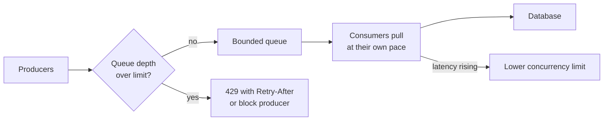
```mermaid
flowchart LR
  P["Producers"] --> G{"Queue depth<br/>over limit?"}
  G -->|"no"| Q["Bounded queue"]
  G -->|"yes"| REJ["429 with Retry-After<br/>or block producer"]
  Q --> C["Consumers pull<br/>at their own pace"]
  C --> D["Database"]
  C -->|"latency rising"| LIM["Lower concurrency limit"]
```

**Pros:** Keeps the system in its working range; fails fast and visibly instead of slowly and totally.
**Cons / limits:** Someone gets rejected; producers must handle rejections; badly tuned limits waste capacity.

**Use it when / avoid when:**
- Always bound queues and connection pools.
- Shed load at the edge, before expensive work is done.
- Avoid unbounded in-memory arrays of pending work, and avoid retries without backoff.

### Rate limiting algorithms

**What it is:** Rate limiting caps how many requests a client (user, API key, IP) can make in a time window. It protects capacity, enforces fair use and slows abuse (credential stuffing, scraping).

**Why it's used:** One misbehaving client should not degrade service for others. Paid API tiers sell different limits.

**How it works:**

| Algorithm | Idea | Burst behaviour | Memory | Notes |
|---|---|---|---|---|
| Token bucket | Bucket holds up to B tokens, refilled at R per second; each request spends one | Allows bursts up to B, then steady R | 2 numbers per key | Most common for APIs (AWS API Gateway throttling is token-bucket style) |
| Leaky bucket | Requests enter a queue that drains at a fixed rate | Smooths output, no bursts out | Queue per key | Good for shaping outbound traffic to a fragile partner |
| Fixed window counter | Count per calendar window (e.g. per minute) | Up to 2x limit across a window boundary | 1 counter per key | Simplest; boundary burst problem |
| Sliding window log | Store each request timestamp; count those in last W | Exact | One entry per request | Accurate but memory heavy |
| Sliding window counter | Weighted mix of current and previous fixed windows | Approximates sliding | 2 counters per key | Good balance; used widely |

Sliding window counter formula: `count ≈ current + previous × (1 − elapsedInCurrent / windowSize)`.

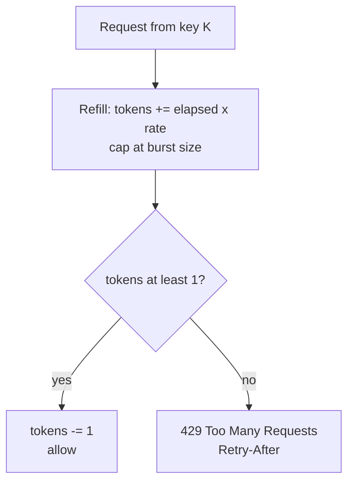
```mermaid
flowchart TD
  R["Request from key K"] --> RF["Refill: tokens += elapsed x rate<br/>cap at burst size"]
  RF --> T{"tokens at least 1?"}
  T -->|"yes"| A["tokens -= 1<br/>allow"]
  T -->|"no"| D["429 Too Many Requests<br/>Retry-After"]
```

Token bucket in Redis, atomic via Lua so 30 gateway instances share one counter per key:

```typescript
const TOKEN_BUCKET = `
local key = KEYS[1]
local rate = tonumber(ARGV[1])      -- tokens per second
local burst = tonumber(ARGV[2])     -- bucket size
local now = tonumber(ARGV[3])       -- ms
local data = redis.call("HMGET", key, "tokens", "ts")
local tokens = tonumber(data[1]) or burst
local ts = tonumber(data[2]) or now
tokens = math.min(burst, tokens + (now - ts) / 1000 * rate)
local allowed = 0
if tokens >= 1 then
  tokens = tokens - 1
  allowed = 1
end
redis.call("HSET", key, "tokens", tokens, "ts", now)
redis.call("PEXPIRE", key, math.ceil(burst / rate * 1000) + 1000)
return { allowed, tostring(tokens) }`;

export async function allow(apiKey: string, rate = 100 / 60, burst = 20): Promise<boolean> {
  // Passing time from the app is simple; for stricter setups use redis.call("TIME") inside the script.
  const [allowed] = (await redis.eval(TOKEN_BUCKET, 1, `rl:${apiKey}`, rate, burst, Date.now())) as [number, string];
  return allowed === 1;
}
```

**Pros:** Protects capacity and fairness; cheap per request.
**Cons / limits:** Central counter adds a hop and a dependency; per-instance limits are inaccurate; IP-based limits hurt users behind shared NATs.

**Use it when / avoid when:**
- Token bucket for public APIs (allows natural bursts); leaky bucket for smoothing calls to a partner with a strict rate.
- Layer limits: edge (WAF, per IP), gateway (per API key), and business (e.g. 5 OTP requests per hour per phone number).
- Decide fail-open (availability) or fail-closed (security, e.g. login attempts) if Redis is unavailable.

### Bloom filters

**What it is:** A Bloom filter is a compact bit array that answers "is this item possibly in the set?" with either "definitely not" or "probably yes". It never gives false negatives, but can give false positives.

**Why it's used:** To avoid expensive lookups for things that almost certainly don't exist. Examples: a database (Cassandra, RocksDB, other LSM-tree stores) checks a Bloom filter before reading a file from disk; a crawler skips URLs it has probably seen; a signup form checks "is this password in the breached list?" without storing the whole list in memory.

**How it works:** Start with m bits all 0 and k hash functions. To add an item, set the k bit positions it hashes to. To check, see whether all k positions are 1. If any is 0, the item was never added. If all are 1, it was probably added (or other items happened to set those bits).

Sizing rules of thumb: for n items and false-positive rate p, `m ≈ −n·ln(p) / (ln 2)²` bits and `k ≈ (m/n)·ln 2`. About 9.6 bits per item gives 1% false positives; about 14.4 bits gives 0.1%. 100 million items at 1% is roughly 120 MB.

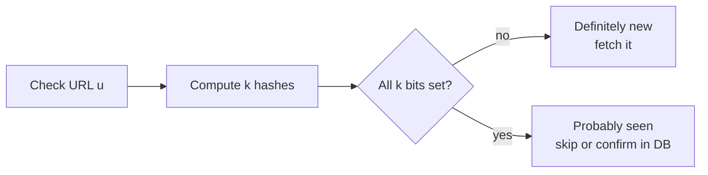
```mermaid
flowchart LR
  I["Check URL u"] --> H["Compute k hashes"]
  H --> B{"All k bits set?"}
  B -->|"no"| N["Definitely new<br/>fetch it"]
  B -->|"yes"| M["Probably seen<br/>skip or confirm in DB"]
```

```typescript
import { createHash } from 'node:crypto';

class BloomFilter {
  private bits: Uint8Array;
  constructor(private m: number, private k: number) {
    this.bits = new Uint8Array(Math.ceil(m / 8));
  }
  private positions(item: string): number[] {
    // Double hashing: h_i = h1 + i*h2 (Kirsch-Mitzenmacher).
    const d = createHash('sha256').update(item).digest();
    const h1 = d.readUInt32BE(0);
    const h2 = d.readUInt32BE(4) | 1;
    return Array.from({ length: this.k }, (_, i) => (h1 + i * h2) % this.m);
  }
  add(item: string): void {
    for (const p of this.positions(item)) this.bits[p >> 3] |= 1 << (p & 7);
  }
  mightContain(item: string): boolean {
    return this.positions(item).every((p) => (this.bits[p >> 3] & (1 << (p & 7))) !== 0);
  }
}
```

**Pros:** Tiny memory, constant-time operations, no false negatives.
**Cons / limits:** False positives; standard Bloom filters cannot delete (use counting Bloom filters or cuckoo filters); must be sized up front or rebuilt.

**Use it when / avoid when:**
- Use as a cheap pre-check in front of a slower authoritative store.
- Avoid when a false positive is costly and cannot be double-checked (for example, rejecting a valid payment).

#### Q: [Senior] A partner API we call for bank-account verification allows 50 requests per second. At month-end our workers burst to 400 per second, we get throttled, our retries make it worse and the whole verification queue backs up for hours. Design the fix.

**Short answer:** Shape our outbound traffic to stay under the partner's limit: a shared leaky-bucket or token-bucket limiter across all workers set slightly below 50 per second, with workers pulling from a queue only when they have a token. Retries use exponential backoff with jitter and respect the partner's `Retry-After`. The queue absorbs the burst, and we prioritise user-facing verifications over batch ones.

**Clarify first:** Is the 50 per second limit per API key or global? Can we get a higher limit or a batch endpoint? Which verifications are user-blocking (signup) vs background (periodic re-checks)? What latency is acceptable for each?

**Diagnose:** Graph our request rate vs 429 responses from the partner. You'll see retries multiplying the rate. Check whether each worker retries independently with fixed delays (synchronised retry waves).

**Solution:**

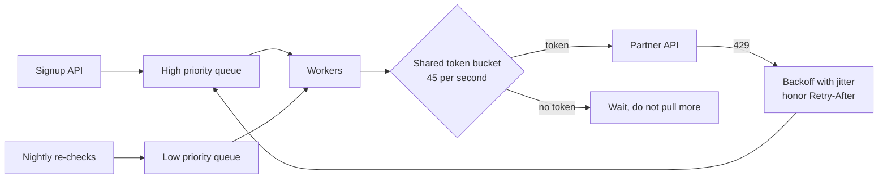
```mermaid
flowchart LR
  API["Signup API"] --> HQ["High priority queue"]
  BATCH["Nightly re-checks"] --> LQ["Low priority queue"]
  HQ --> W["Workers"]
  LQ --> W
  W --> TB{"Shared token bucket<br/>45 per second"}
  TB -->|"token"| P["Partner API"]
  TB -->|"no token"| WAIT["Wait, do not pull more"]
  P -->|"429"| BO["Backoff with jitter<br/>honor Retry-After"]
  BO --> HQ
```

```typescript
async function callWithBackoff<T>(fn: () => Promise<T>, maxAttempts = 6): Promise<T> {
  for (let attempt = 0; ; attempt++) {
    try {
      return await fn();
    } catch (err: any) {
      const retriable = err.status === 429 || err.status >= 500;
      if (!retriable || attempt + 1 >= maxAttempts) throw err;
      const retryAfterMs = Number(err.headers?.['retry-after']) * 1000 || 0;
      const base = Math.min(30_000, 500 * 2 ** attempt);
      const jitter = Math.random() * base; // "full jitter"
      await sleep(Math.max(retryAfterMs, jitter));
    }
  }
}
```

- Workers check the shared limiter (Redis token bucket) before each partner call.
- Priority: workers drain the high-priority queue first, with a small reserved share for low priority so it doesn't starve.
- Circuit breaker: if 429/5xx rate exceeds a threshold, pause all calls for a cool-down.
- Cache verification results so repeated checks for the same account don't hit the partner.

**Trade-offs:** Background work gets slower at month-end. A shared limiter in Redis is a new dependency; if it fails, fall back to a conservative per-worker limit (45 / number of workers).

**What interviewers listen for:**
- Treats the partner limit as a constraint to shape to, not a failure to retry through.
- Backoff with jitter, `Retry-After`, retry budgets.
- Prioritisation and back-pressure via pulling only when there is capacity.

#### Q: [Mid] Compare fixed window and sliding window rate limits for a login endpoint limited to 5 attempts per minute per username. Which would you pick and why?

**Short answer:** A fixed window allows a burst at the boundary: 5 attempts at 10:00:59 and 5 more at 10:01:00, so 10 in two seconds. For a security limit like login I'd use a sliding window (counter approximation is fine) or a token bucket with a small burst, plus an increasing lockout delay.

**Clarify first:** Per username, per IP, or both? What should happen after the limit (block, CAPTCHA, step-up)? Fail open or closed if the limiter is down?

**Solution:** Sliding window counter in Redis: keep counts for the current and previous minute, compute `current + previous × (1 − elapsed/60)`, reject if at least 5.

```typescript
async function loginAllowed(username: string): Promise<boolean> {
  const now = Date.now();
  const window = 60_000;
  const cur = Math.floor(now / window);
  const elapsed = (now % window) / window;
  const [prevCount, curCount] = await redis.mget(`login:${username}:${cur - 1}`, `login:${username}:${cur}`);
  const estimate = Number(curCount ?? 0) + Number(prevCount ?? 0) * (1 - elapsed);
  if (estimate >= 5) return false;
  await redis.multi().incr(`login:${username}:${cur}`).pexpire(`login:${username}:${cur}`, 2 * window).exec();
  return true;
}
```

Note the read-then-increment above has a small race between concurrent requests; for strictness, do it in a Lua script.

**Trade-offs:** Sliding counter is approximate but cheap. A sliding log is exact but stores every attempt. Per-username limits can be abused to lock out a victim; combine with per-IP limits and CAPTCHA instead of hard lockout.

**What interviewers listen for:** Names the boundary-burst problem; thinks about lockout abuse and fail-closed for security.

#### Q: [Mid] Our signup checks whether a username is taken by querying the users table on every keystroke. It is 30% of DB reads. Could a Bloom filter help?

**Short answer:** Yes, as a pre-check: if the Bloom filter says "definitely not present", the name is available without touching the DB; if it says "maybe", we confirm with the DB. Because most typed prefixes are not taken, most checks skip the DB. The real uniqueness guarantee stays the unique constraint at insert time.

**Clarify first:** How many usernames (say 20 million)? Is the check debounced on the frontend? Are deletes common (Bloom filters can't remove)?

**Solution:**
- Frontend: debounce 300 ms and only check names that pass format validation.
- Backend: an in-memory Bloom filter per instance, about 24 MB for 20 million names at 1% false-positive rate, rebuilt nightly and updated on each signup (also published via pub/sub so other instances add it).
- "Maybe" → DB lookup on the indexed column. Final insert relies on `UNIQUE (lower(username))`.

**Trade-offs:** Stale filter on one instance means it might say "available" for a just-taken name; the unique constraint catches it at submit. Deleted usernames stay "maybe" until the nightly rebuild, which only costs a DB lookup.

**What interviewers listen for:** "No false negatives, possible false positives" stated correctly; the DB constraint remains the source of truth; frontend debounce first.

## 6. Geo-distribution and multi-region

### Geo-distribution and multi-region architectures

**What it is:** Running your system in more than one geographic region (e.g. us-east and eu-west), for lower latency to distant users, survival of a whole-region outage, and data-residency laws (e.g. EU customers' data stays in the EU).

**Why it's used:** A region-wide outage, while rare, does happen at cloud providers. Users 10,000 km away pay 150+ ms per round trip. Regulators may require data locality or a tested disaster-recovery plan.

**How it works:** Main patterns, cheapest to most complex:

| Pattern | Writes | Reads | Failover | Typical RPO / RTO |
|---|---|---|---|---|
| Backup and restore | One region | One region | Restore from backups in another region | Hours / hours |
| Pilot light / warm standby | One region | One region, standby ready | Promote standby, scale up | Seconds–minutes / minutes |
| Active-passive (hot standby) | One region | Often both (stale reads in passive) | Promote replica, flip DNS | Near zero with sync, seconds with async / minutes |
| Active-active, partitioned by user | Each user's home region | Local | Move home region for affected users | Seconds / minutes |
| Active-active, global consensus DB | Any region | Any region | Automatic (majority of regions) | Zero / seconds, with higher write latency |

RPO (Recovery Point Objective) is how much data you can lose; RTO (Recovery Time Objective) is how long you can be down.

Building blocks: global DNS or anycast routing with health checks (e.g. Route 53, Global Accelerator, Cloudflare), CDNs at the edge, cross-region database replication (Aurora Global Database, DynamoDB global tables, Spanner, CockroachDB), object storage replication, and per-region queues.

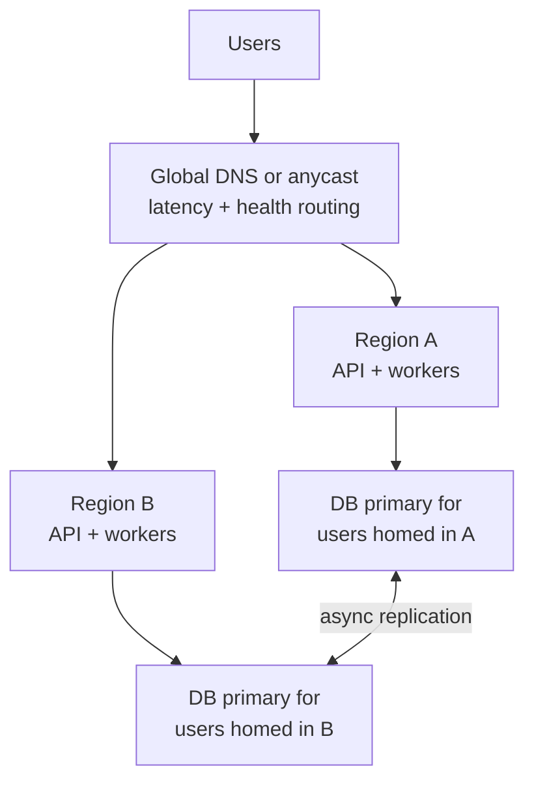
```mermaid
flowchart TD
  U["Users"] --> DNS["Global DNS or anycast<br/>latency + health routing"]
  DNS --> R1["Region A<br/>API + workers"]
  DNS --> R2["Region B<br/>API + workers"]
  R1 --> D1["DB primary for<br/>users homed in A"]
  R2 --> D2["DB primary for<br/>users homed in B"]
  D1 <-->|"async replication"| D2
```

**Pros:** Lower latency, survives region loss, satisfies residency rules.

**Cons / limits:**
- Speed of light: synchronous cross-region writes add ~60–200 ms each.
- Async replication means failover can lose recent writes (non-zero RPO).
- Multi-leader conflicts, duplicated infrastructure cost (often close to 2x), and much harder testing.
- Failover that is never practised usually fails when needed.

**Use it when / avoid when:**
- Start with multi-AZ in one region; it covers most failures at a fraction of the cost.
- Go multi-region when the business case (SLA, regulation, global users) justifies the cost and complexity.
- Prefer partitioning users by home region over true multi-master for transactional data.

> **Gotcha:** Global control planes are a hidden single point of failure. If your DNS, auth provider, feature-flag service or CI/CD lives in one region, a "multi-region" app can still go down with that region.

#### Q: [Senior] We're expanding a budgeting app from the US to the EU. EU law (GDPR) and customer contracts say EU users' personal data should stay in the EU. Latency for EU users is currently 120 ms per call. How do you design the multi-region setup?

**Short answer:** Partition by home region: each user is created in, and their personal data lives in, either the US or the EU stack. A thin global layer routes requests to the user's home region. Only non-personal, global data (merchant categories, FX rates, app config) is replicated everywhere. This solves both residency and latency without multi-master conflicts.

**Clarify first:** What counts as personal data here (transactions certainly)? Can users move regions? Are there global features (search across users, referrals, admin tools)? Is the identity provider (e.g. Okta) itself region-pinned?

**Solution:**
- **Routing:** the login flow resolves the user's home region (from an email-domain or global directory that stores only a pseudonymous user ID and region), then the client talks to `eu.api.example.com` or `us.api.example.com`. Alternatively, an edge router reads a region claim from the token.
- **Data:** separate databases, queues and object storage per region. No personal data in the global directory beyond what's legally acceptable.
- **Global data:** replicated read-only to both regions.
- **Analytics:** aggregate per region; only anonymised aggregates leave the region.
- **Disaster recovery:** each region has multi-AZ HA; cross-region DR for EU data must use another EU region.

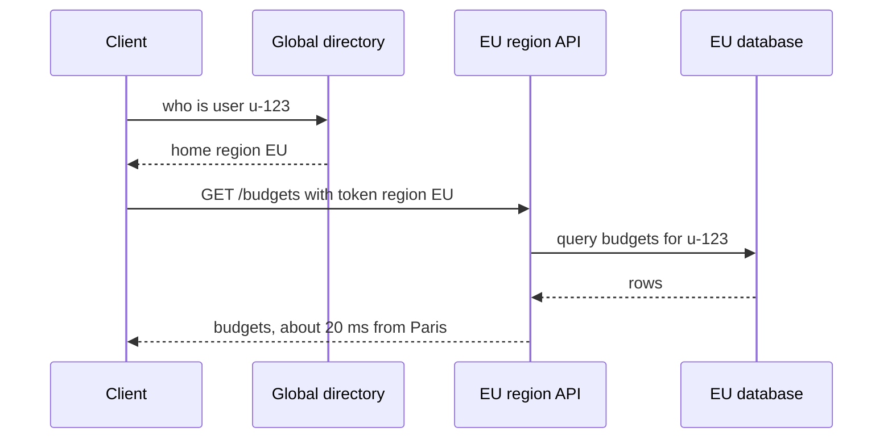
```mermaid
sequenceDiagram
  participant C as Client
  participant G as Global directory
  participant EU as EU region API
  participant DB as EU database
  C->>G: who is user u-123
  G-->>C: home region EU
  C->>EU: GET /budgets with token region EU
  EU->>DB: query budgets for u-123
  DB-->>EU: rows
  EU-->>C: budgets, about 20 ms from Paris
```

**Trade-offs:** Global features become harder (cross-region queries are forbidden or anonymised). Two stacks to operate. Region moves need a migration workflow. The global directory is a critical dependency: cache region lookups in the token or a cookie.

**What interviewers listen for:**
- Partitioning by home region rather than replicating everything everywhere.
- Treats residency as covering backups, logs and analytics too.
- Notices hidden global dependencies.

#### Q: [Staff] Leadership asks for "zero downtime, zero data loss" if an entire cloud region fails, for our account-balance service. What do you tell them, and what would you design?

**Short answer:** Zero data loss across regions means a write is not acknowledged until a second region has it, so every balance-changing write pays a cross-region round trip, roughly 10–80 ms for nearby region pairs. Zero downtime means automatic failover with a quorum that survives a region loss, so we need at least three regions (or two plus a witness). It is achievable with a consensus-replicated database, at real cost in latency, money and complexity. I'd quantify that and offer a tiered option: near-zero RPO for the ledger, and relaxed targets for everything else.

**Clarify first:** What are the actual RPO and RTO targets in seconds and minutes? Which operations must meet them (ledger writes vs balance reads vs statements)? Budget? Regulator expectations? How often must failover be tested?

**Solution:**

| Option | RPO | RTO | Write latency cost | Complexity |
|---|---|---|---|---|
| Async replica in second region, manual promote | Seconds of writes | 15–60 min | None | Low |
| Managed global DB with fast promotion (e.g. Aurora Global Database) | Typically about a second (async) | Minutes (managed failover) | None | Medium |
| Sync replication to a nearby region, plus witness | Zero | Minutes | One cross-region RTT | Medium-high |
| Consensus DB across 3 regions (Spanner, CockroachDB, YugabyteDB) | Zero | Seconds, automatic | Majority RTT per write | High |

For the ledger I'd pick 3-region consensus with the regions close together (lower RTT), and keep reads local with bounded staleness for display. Non-ledger services use async replication. We'd also make the failover path routine: game days quarterly, and continuous traffic in all regions so "failover" isn't a cold path.

**Trade-offs:** Latency on every write, roughly 2x+ infrastructure cost, specialist operational skills. Async options are cheaper but must be honest about losing seconds of data, which then needs reconciliation with payment networks.

**What interviewers listen for:**
- Translates "zero, zero" into physics (RTT) and quorum math (3 regions).
- Uses RPO/RTO vocabulary and offers tiers.
- Insists failover is tested.
- Red flag: "active-active with async replication" claimed to be zero data loss.
