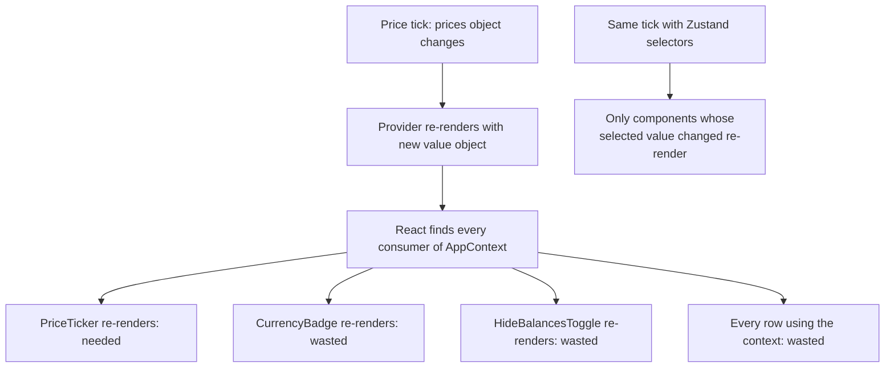
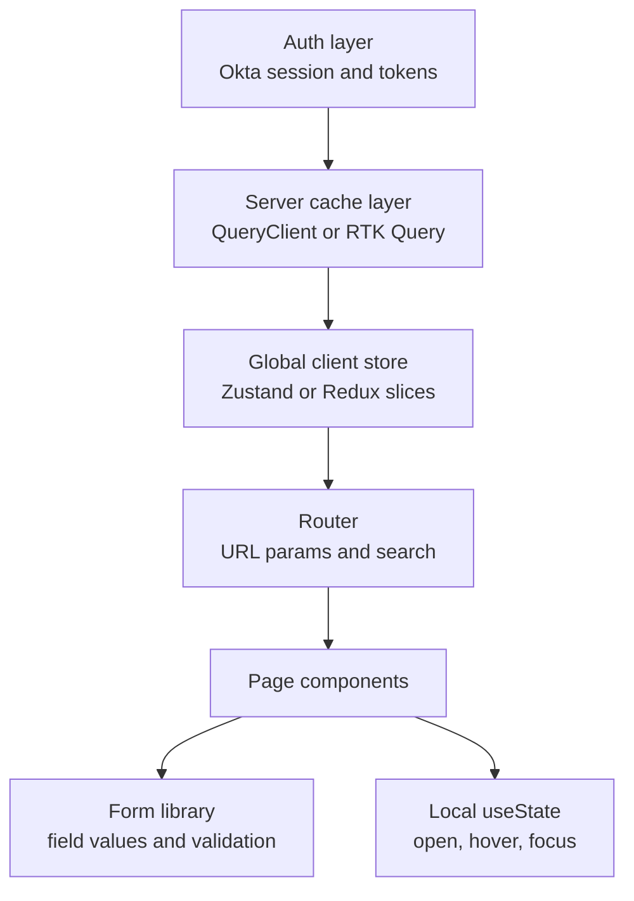
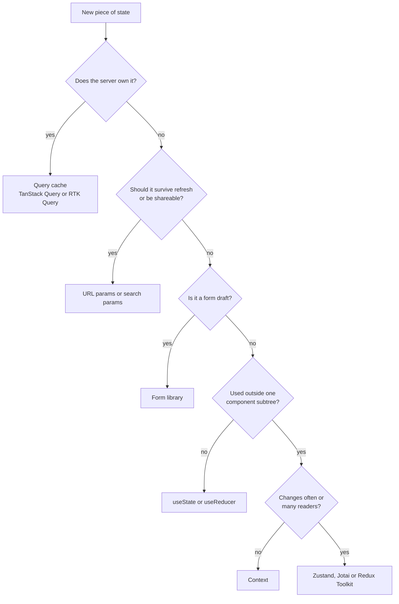

## 1. What it is

**State management is deciding, for every piece of changing data, who owns it, where it lives, and who is told when it changes. There is no single best tool; there is a best tool per category of state.**

Think of a household's money. Cash in your pocket (local state) is for you right now. The shared kitchen jar (global client state) is for the family. The bank account (server state) is the real record; your phone app only shows a cached copy that can be out of date. The address written on an envelope (URL state) tells anyone where to go. A half-filled cheque on the desk (form state) is a draft nobody else should act on yet. Using one container for all five is how people lose money.

The problem it solves: most "state management pain" comes from putting data in the wrong place. Copying server data into Redux means hand-writing caching and invalidation. Putting fast-changing values in Context re-renders half the app. Keeping filters in component state breaks shareable links. Classifying state first makes the tool choice obvious.

## 2. Core concepts

### [Beginner] The five categories of state

| Category | Who is the source of truth | Example in a banking app | Typical tool |
|---|---|---|---|
| Server / cache | The backend | Accounts, balances, transactions, positions | TanStack Query, RTK Query, SWR |
| Global client UI | The browser session | Display currency, hide-balances mode, selected account, sidebar | Zustand, Redux, Jotai, Context (rare changes) |
| Local component | One component | Dropdown open, hover, input focus, tooltip | `useState`, `useReducer` |
| URL | The address bar | Date range filter, page, tab, `/accounts/:id` | Router params and search params |
| Form | The form until submit | Transfer amount, payee fields, validation errors, dirty/touched | React Hook Form, React Final Form, TanStack Form |

```tsx
// One screen, five kinds of state, five owners
function TransactionsPage() {
  const { accountId } = useParams();                                  // URL
  const [searchParams, setSearchParams] = useSearchParams();          // URL
  const status = searchParams.get('status') ?? 'all';
  const { data: txs, isLoading } = useTransactions(accountId!, status); // server cache
  const hideBalances = usePrefs((s) => s.hideBalances);               // global client UI
  const [expandedId, setExpandedId] = useState<string | null>(null);  // local
  // the "Dispute transaction" dialog owns its own form state via a form library
  return null;
}
```

> **Why:** Each category has different needs. Server state needs caching, refetching, deduping and invalidation. URL state needs to survive refresh and be shareable. Form state needs validation and dirty tracking. Global UI state needs cheap cross-tree subscriptions. Local state needs nothing at all. A single tool cannot be best at all of these.

### [Beginner] The default: start local, lift only when needed

```tsx
// Start here
function AmountInput() {
  const [raw, setRaw] = useState('');
  return <input inputMode="decimal" value={raw} onChange={(e) => setRaw(e.target.value)} />;
}

// Two siblings need it? Lift to the nearest common parent and pass props.
function TransferPanel() {
  const [amountCents, setAmountCents] = useState(0);
  return (
    <>
      <AmountField value={amountCents} onChange={setAmountCents} />
      <FeePreview amountCents={amountCents} />
    </>
  );
}
```

> **Interview tip:** Interviewers like hearing "I keep state as local as possible and only promote it when a real need appears". Global state is a cost, not a default.

### [Beginner] Server state is a cache, not your state

The backend owns account balances. The frontend holds a **copy** that goes stale. Treat it as a cache with keys, freshness and invalidation.

```tsx
import { useQuery, useMutation, useQueryClient } from '@tanstack/react-query';

function useAccounts() {
  return useQuery({
    queryKey: ['accounts'],
    queryFn: () => api.get<Account[]>('/accounts'),
    staleTime: 30_000, // treat as fresh for 30s
  });
}

function useCreateTransfer() {
  const qc = useQueryClient();
  return useMutation({
    mutationFn: (t: NewTransfer) => api.post('/transfers', t),
    onSuccess: () => qc.invalidateQueries({ queryKey: ['accounts'] }), // balances are now stale
  });
}
```

> **Why not `useEffect` + Redux/Zustand for this?** You would have to write loading and error flags, dedupe concurrent requests, cancel on unmount, refetch on focus, garbage-collect unused data and invalidate after mutations. Query libraries do all of it; hand-rolled versions get it subtly wrong.

### [Intermediate] The Context re-render problem

Context is a **dependency injection** tool, not a state manager. When a Provider's `value` changes (by reference), **every** component that reads that context re-renders, even if it only uses one field that did not change. There is no built-in selector.

```tsx
// Problem: one context holding several fast-changing values
interface AppCtx { prices: Record<string, number>; hideBalances: boolean; currency: string }
const AppContext = createContext<AppCtx | null>(null);

function AppProvider({ children }: { children: ReactNode }) {
  const prices = useLivePrices();            // updates every second
  const [hideBalances, setHide] = useState(false);
  const [currency] = useState('USD');
  // New object every render -> every consumer re-renders every second
  return <AppContext value={{ prices, hideBalances, currency }}>{children}</AppContext>;
}

function CurrencyBadge() {
  const { currency } = use(AppContext)!;     // re-renders every second although currency never changes
  return <span>{currency}</span>;
}
```



Mitigations if you stay with Context:

```tsx
// 1. Split contexts by change frequency
const PricesContext = createContext<Record<string, number>>({});
const PrefsContext = createContext<{ hideBalances: boolean; currency: string }>({ hideBalances: false, currency: 'USD' });

// 2. Memoize the value so it only changes when its contents change
const prefs = useMemo(() => ({ hideBalances, currency }), [hideBalances, currency]);

// 3. Split state and dispatch so components that only dispatch never re-render
const PrefsDispatchContext = createContext<Dispatch<PrefsAction>>(() => {});

// 4. Put a STORE (stable reference) in context instead of state, and subscribe with selectors
//    This is exactly what React Redux and scoped Zustand stores do.
```

> **Why React.memo does not save you:** `memo` stops re-renders caused by a **parent** re-rendering with the same props. A context change triggers the consumer directly, bypassing `memo`.

> **Outdated:** In React 19, `<Context value>` replaces `<Context.Provider value>` and `use(Context)` can replace `useContext`. Neither changes the re-render behavior. The React Compiler (1.0, stable since late 2025) auto-memoizes components and values, which reduces wasted renders from unstable `value` objects, but a consumer still re-renders whenever the context value really changes.

### [Intermediate] External stores and selectors: why they scale

Zustand, Redux and Jotai keep state **outside** React and let each component subscribe to a slice through `useSyncExternalStore`. On a change, each subscriber compares its own selected value and only that component re-renders.

```ts
// Zustand: component subscribes to a single boolean
const hideBalances = usePrefs((s) => s.hideBalances);

// Redux: same idea
const hideBalances2 = useAppSelector((s) => s.preferences.hideBalances);

// Jotai: subscribe to one atom
const hideBalancesAtom = atom(false);
const [hideBalances3] = useAtom(hideBalancesAtom);
```

> **Why:** The cost of an update is proportional to the number of components whose data actually changed, not the number of components that use the store.

### [Intermediate] URL state: the forgotten store

If a user would expect a value to survive refresh, the back button, or a copied link, it belongs in the URL.

```tsx
import { useSearchParams } from 'react-router';

type Status = 'all' | 'pending' | 'posted';

export function useTxFilters() {
  const [params, setParams] = useSearchParams();
  const status = (params.get('status') ?? 'all') as Status;
  const from = params.get('from') ?? '';      // ISO date
  const setStatus = (s: Status) =>
    setParams((p) => { p.set('status', s); p.delete('page'); return p; }, { replace: true });
  return { status, from, setStatus };
}
// /accounts/a1/transactions?status=pending&from=2026-09-01
```

> **Finance tip:** Shareable URLs for reports ("Q3 statement, posted only") help support teams reproduce issues. But never put PII or account numbers in query strings: URLs end up in logs, analytics and browser history. Use opaque IDs.

### [Intermediate] Form state stays in the form

```tsx
import { useForm } from 'react-hook-form';

interface TransferForm { fromAccountId: string; toAccountId: string; amount: string; memo: string }

function TransferDialog() {
  const { register, handleSubmit, formState: { errors, isDirty } } = useForm<TransferForm>();
  const createTransfer = useCreateTransfer();
  return (
    <form onSubmit={handleSubmit((v) => createTransfer.mutate(toTransfer(v)))}>
      <input {...register('amount', { required: true, pattern: /^\d+(\.\d{1,2})?$/ })} />
      {errors.amount && <span role="alert">Enter a valid amount</span>}
      <button disabled={!isDirty || createTransfer.isPending}>Send</button>
    </form>
  );
}
```

> **Gotcha:** Mirroring every keystroke into Redux or Zustand re-runs global subscribers per keystroke and spreads draft data (possibly PII) into a global store and DevTools. Only promote a draft to global state if it truly must survive navigation, e.g. a multi-page wizard.

### [Advanced] Atoms and signals: fine-grained alternatives

**Atoms (Jotai)** are tiny independent pieces of state. Derived atoms recompute only when their dependencies change, and components subscribe per atom.

```ts
import { atom, useAtomValue } from 'jotai';

const holdingsAtom = atom<{ symbol: string; qty: number }[]>([]);
const pricesAtom = atom<Record<string, number>>({});              // cents
const portfolioValueAtom = atom((get) =>
  get(holdingsAtom).reduce((sum, h) => sum + h.qty * (get(pricesAtom)[h.symbol] ?? 0), 0),
);

function PortfolioValue() {
  const cents = useAtomValue(portfolioValueAtom); // re-renders only when the total changes
  return <Money amountCents={cents} currency="USD" />;
}
```

**Signals** are reactive values that track who reads them and update those readers directly, often without re-rendering a whole component. They are the core model of Solid, Preact, Vue (refs), Angular (since v16) and Svelte 5 (runes). A TC39 proposal to add signals to JavaScript exists but is still early stage (hedge: check its current stage).

```tsx
// @preact/signals-react (community integration, not an official React feature)
import { signal, computed } from '@preact/signals-react';
import { useSignals } from '@preact/signals-react/runtime';

const fxRate = signal(1.08);
const amountUsdCents = signal(10_000);
const amountEurCents = computed(() => Math.round(amountUsdCents.value / fxRate.value));

function EurPreview() {
  useSignals(); // opt-in tracking (or use the Babel transform)
  return <span>{amountEurCents.value}</span>;
}
```

> **Why React has not adopted signals:** React's model is "UI is a function of state, re-run it". The React team's answer to wasted renders is the React Compiler (auto-memoization) rather than a new reactivity primitive. Signal integrations in React rely on workarounds and can conflict with concurrent features, so treat them as niche in React codebases.

### [Advanced] Derived state: compute, do not store

Any value you can compute from other state should be computed, not stored. Stored copies drift out of sync.

```ts
// BAD: storing a total that must be updated everywhere transactions change
interface Bad { transactions: Transaction[]; totalCents: number }

// GOOD: derive it, memoized at the right layer
const totalCents = useMemo(() => txs.reduce((s, t) => s + t.amountCents, 0), [txs]); // component
const selectTotal = createSelector([selectAllTx], (txs) => txs.reduce((s, t) => s + t.amountCents, 0)); // Redux
const { data: total } = useQuery({ queryKey: ['tx', id], queryFn, select: (txs) => sum(txs) }); // query
```

## 3. Why it's used in this project

A typical financial dashboard maps cleanly onto the categories:

| Data | Category | Where it goes | Why |
|---|---|---|---|
| Account list, balances | Server | Query cache (TanStack Query or RTK Query) | Backend is truth; must refetch after transfers |
| Transactions (10k rows) | Server | Query cache, paginated or infinite, normalized if editing rows | Large, paged, invalidated by mutations |
| Live prices / FX rates | Server (streaming) | WebSocket feeding the query cache via `setQueryData`, or a dedicated store | High frequency: must not go through Context |
| Logged-in user, Okta tokens | Auth / session | Okta SDK's token manager + small session store; tokens never persisted by you | Security; SDK handles refresh |
| Session idle timer | Global client | Zustand/Redux store + listener outside React | Must work regardless of which page is mounted |
| Display currency, locale, hide balances | Global client | Zustand or Redux slice, persisted preferences only | Read everywhere, changes rarely |
| Selected account in sidebar | URL | `/accounts/:accountId` | Deep-linkable, back button works |
| Date range, status filter, page | URL | Search params | Shareable reports, survives refresh |
| Rows checked for bulk export | Local or scoped store | `useState` in the table, or a per-table store for 10k rows | Not needed elsewhere; avoid global churn |
| Transfer form fields and validation | Form | Form library | Validation, dirty, touched, submit state |
| Multi-step KYC / onboarding draft | Global client (temporary) | Store persisted to sessionStorage, cleared on submit | Survives step navigation and refresh |
| Theme (light/dark) | Global client, rare change | Context or CSS variables | Changes almost never; Context is fine |

> **Finance tip:** On logout or session timeout, wipe every layer: clear the query cache (`queryClient.clear()` or `api.util.resetApiState()`), reset client stores, and clear any sessionStorage drafts. A shared terminal must not show the previous user's balances for even one frame.

## 4. Setup & configuration

### [Beginner] Layering the providers

Structure the app as layers, outermost being the most fundamental.

```tsx
// src/main.tsx
import { QueryClient, QueryClientProvider } from '@tanstack/react-query';
import { ReactQueryDevtools } from '@tanstack/react-query-devtools';
import { RouterProvider } from 'react-router';

const queryClient = new QueryClient({
  defaultOptions: {
    queries: {
      staleTime: 30_000,           // financial data: short but non-zero to avoid refetch storms
      gcTime: 5 * 60_000,          // keep unused cache 5 min
      retry: 2,                    // retry transient errors
      refetchOnWindowFocus: true,  // users returning to the tab see fresh balances
    },
    mutations: { retry: 0 },       // never auto-retry money movement
  },
});

createRoot(document.getElementById('root')!).render(
  <StrictMode>
    <AuthProvider /* Okta Security wrapper */>
      <QueryClientProvider client={queryClient}>      {/* server state */}
        <ThemeContext value="system">                 {/* rare-change context */}
          <RouterProvider router={router} />          {/* URL state */}
        </ThemeContext>
        {import.meta.env.DEV && <ReactQueryDevtools />}
      </QueryClientProvider>
    </AuthProvider>
  </StrictMode>,
);
// Zustand stores need no provider. If you use Redux, <Provider store={store}> wraps here too.
```



### [Intermediate] Folder structure by state type

```
src/
  api/              # fetch client, Okta token injection
  queries/          # useAccounts, useTransactions, mutations (server state)
  stores/           # preferences, session (global client state)
  routes/           # route modules; search-param hooks (URL state)
  features/
    transfers/
      TransferForm.tsx   # form state lives here
```

> **Why:** When a bug says "balance not updating after transfer", you know to look in `queries/`. When it says "filter lost on refresh", you look at URL hooks. Organizing by state type makes ownership obvious.

## 5. Key features we use

### [Intermediate] Live prices without Context churn

```ts
// Feed a WebSocket into the query cache; components select one symbol each
export function useLivePriceFeed() {
  const qc = useQueryClient();
  useEffect(() => {
    const ws = new WebSocket(import.meta.env.VITE_PRICES_WS);
    ws.onmessage = (e) => {
      const { symbol, priceCents } = JSON.parse(e.data) as { symbol: string; priceCents: number };
      qc.setQueryData(['price', symbol], priceCents);
    };
    return () => ws.close();
  }, [qc]);
}

export const usePrice = (symbol: string) =>
  useQuery({ queryKey: ['price', symbol], queryFn: () => api.get<number>(`/prices/${symbol}`), staleTime: Infinity });
```

### [Intermediate] Global preferences in a tiny store

```ts
export const usePrefs = create<PrefsState>()(
  persist(
    (set) => ({
      currency: 'USD',
      hideBalances: false,
      toggleHide: () => set((s) => ({ hideBalances: !s.hideBalances })),
    }),
    { name: 'prefs', partialize: ({ currency, hideBalances }) => ({ currency, hideBalances }) },
  ),
);
```

### [Advanced] Logout clears every layer

```ts
export async function logout(oktaAuth: OktaAuth, queryClient: QueryClient) {
  queryClient.clear();                                   // server cache
  usePrefs.setState({ hideBalances: false });            // reset client flags as policy requires
  useSession.setState(useSession.getInitialState(), true);
  sessionStorage.removeItem('transfer-draft');           // drafts
  await oktaAuth.signOut();                              // tokens and redirect
}
```

## 6. Interview questions

#### Q: How do you decide where a piece of state should live?

Classify it first. Does the server own it? Then it is server state in a query cache. Should it survive refresh or be shareable? Put it in the URL. Is it a form draft? Use the form library. Is it used by only one component or a small subtree? Use `useState` and lift if needed. Only what remains, client-owned values read across distant parts of the tree, goes into a global store, and Context is reserved for values that rarely change (theme, auth user, locale). Finally, compute derived values instead of storing them.

#### Q: Why is Context not a good replacement for Redux or Zustand?

Context has no selectors. When the Provider value changes by reference, every consumer re-renders, whatever field it uses, and `React.memo` cannot stop it. It works well for low-frequency values but scales badly for frequently changing or large state. Workarounds (splitting contexts, memoizing values, separating state and dispatch) help, but at that point you are rebuilding a store. Redux and Zustand put a stable store reference in context (or none at all) and let each component subscribe to exactly what it needs through `useSyncExternalStore`.

#### Q: What is the difference between server state and client state, and why does it matter?

Server state is owned remotely, shared with other users and devices, can change without your app knowing, and is fetched asynchronously, so your copy is always potentially stale. It needs caching, deduping, background refetching, invalidation and garbage collection. Client state is owned by the browser session and is synchronous and always up to date. Mixing them (copying API data into Redux) forces you to hand-write cache logic. Separating them lets a query library handle server state and leaves a small, simple client store.

#### Q: When would you choose Redux Toolkit over Zustand in 2026?

Choose Redux Toolkit when a large team benefits from enforced structure, when you want an event log of every change (useful for audit-style debugging and complex cross-feature reactions via listener middleware), when you want RTK Query in the same store, or when the codebase is already Redux. Choose Zustand for smaller apps or when server state is already handled by TanStack Query and only a little client state remains; it is ~1 KB, needs no Provider and is easy to use outside React. Performance is similar because both use selector subscriptions.

#### Q: How would you handle a value that updates many times per second, like a live price?

Keep it out of a broad Context. Store it in an external store or query cache keyed per symbol (`setQueryData(['price', symbol], ...)` from a WebSocket, or a Zustand map) and have each cell subscribe to only its symbol. Consider throttling UI updates (for example via `requestAnimationFrame` or a 250 ms throttle) since humans cannot read faster, and use virtualization for large tables so only visible rows subscribe at all.

## 7. Drawbacks & pain points

- **Too many tools.** A modern app may use a query library, a client store, a router and a form library. Each is simple, but the team must agree on boundaries.
- **Duplication creep.** Someone copies query data into a store "for convenience", and now there are two sources of truth.
- **Over-globalizing.** Modal flags and input values in a global store make every update global and every test need setup.
- **URL state is fiddly.** Parsing, defaults, validation and type safety for search params need helpers (or a library like nuqs or the router's typed APIs).
- **Context misuse.** "Just put it in Context" is the most common performance bug in React apps.

Gotchas that trip devs up:

```tsx
// 1. Syncing server data into a store with useEffect: two sources of truth
const { data } = useAccounts();
useEffect(() => { if (data) useAccountsStore.setState({ accounts: data }); }, [data]); // BAD

// 2. Context value recreated every render
<PrefsContext value={{ currency, hideBalances }}>       // new object each render
<PrefsContext value={useMemo(() => ({ currency, hideBalances }), [currency, hideBalances])}>

// 3. Storing derived state
const [total, setTotal] = useState(0);
useEffect(() => setTotal(sum(txs)), [txs]);              // extra render, can drift
const total2 = useMemo(() => sum(txs), [txs]);           // derive

// 4. Initializing local state from props and expecting it to follow
const [amount, setAmount] = useState(props.defaultAmount); // ignores later prop changes (by design)
// Use a key to reset: <AmountInput key={accountId} defaultAmount={...} />
```

## 8. Better alternatives

There is no single winner; the industry has converged on **combinations**. The 2026 default for a new React app is: TanStack Query (or the framework's loader/server components) for server state, URL params for navigational state, a form library for forms, `useState` locally, and Zustand or Jotai only for the leftover global client state. Redux Toolkit remains common in large and older enterprise codebases.

| Tool | Bundle (gzip, approx) | Boilerplate | Devtools | Learning curve | TS support | Community | When it wins |
|---|---|---|---|---|---|---|---|
| Zustand | ~1 KB | Very low | Redux DevTools via middleware | Low | Good | Very large, fast-growing | Small-to-medium global client state, store used outside React |
| Redux Toolkit | ~14 KB + ~5 KB react-redux | Medium | Best: action log, time travel | Medium-high | Excellent | Very large, enterprise | Big teams, strict conventions, event-driven logic, existing Redux |
| Context API | 0 KB | Low-medium | React DevTools only | Low | Good | Built in | Rarely changing values: theme, auth user, locale, DI of stores |
| TanStack Query | ~13 KB | Low | Excellent dedicated panel | Medium | Excellent | Very large | Any server data: caching, refetch, invalidation, pagination |
| RTK Query | ~10 KB on top of RTK | Low-medium | Redux DevTools | Medium | Excellent, OpenAPI codegen | Large | Server state when already on Redux |
| Jotai | ~3-4 KB | Low | Jotai DevTools | Low-medium | Excellent | Large | Many small independent values, derived graphs, per-field subscriptions |
| Signals (Preact signals in React) | ~2-4 KB | Low | Limited | Medium (new mental model) | Good | Small in React, large elsewhere | Very high-frequency updates; mainly a non-React (Solid, Vue, Angular, Svelte) pattern |
| URL search params | 0 KB (router) | Low-medium | Address bar | Low | Weak without helpers | Built in | Filters, tabs, pagination, deep links |

> **Outdated:** "Put everything in Redux" was the 2016-2019 norm. React Query v3-era apps (2020-2021) started the server/client split; TanStack Query v5 is now the current line, with renamed APIs (`gcTime` instead of `cacheTime`, a `pending` status replacing `loading`, single object signature). If your codebase is on an older React Query, plan a migration.

## 9. When NOT to use it

When NOT to use each option:

- **Global store (Zustand/Redux)** — not for data fetched from the API, form fields, or state used by one component.
- **Redux Toolkit** — not for small apps or teams that do not need its structure; the ceremony outweighs the benefit.
- **Context** — not for values that change often (prices, input text, timers, scroll position) or large objects read by many components.
- **Query cache** — not for purely client-side values (theme, sidebar open); `setQueryData` as a general store is a hack.
- **URL** — not for sensitive data (account numbers, names), large blobs, or transient UI (hover, open dropdowns).
- **Form library** — not for a single search box; `useState` is enough.
- **Signals in React** — not in a team codebase that relies on concurrent features or the React Compiler without verifying compatibility.
- **Persistence (localStorage)** — never for tokens, balances or PII.

## Cheatsheet



| Question | Answer |
|---|---|
| Fetched from API? | Query cache, never copy into a store |
| In the URL bar? | Router params / `useSearchParams` |
| Form fields? | Form library |
| One component? | `useState` |
| A few siblings? | Lift state up |
| Global, rarely changes? | Context (memoized value) |
| Global, changes often? | Zustand / Jotai / Redux with selectors |
| Big team, audit-style event log? | Redux Toolkit |
| Can be computed? | Derive with `useMemo` / `createSelector` / query `select` |
| On logout? | Clear query cache, reset stores, clear session drafts, sign out |

```ts
// The four lines you will write most
const { data } = useQuery({ queryKey: ['accounts'], queryFn: fetchAccounts });   // server
const [params, setParams] = useSearchParams();                                    // URL
const hide = usePrefs((s) => s.hideBalances);                                     // global client
const [open, setOpen] = useState(false);                                          // local
```
