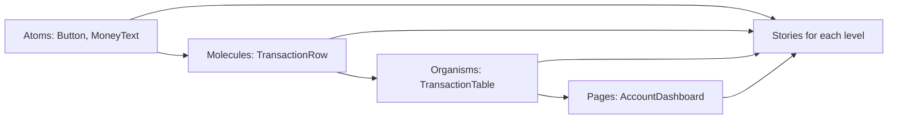
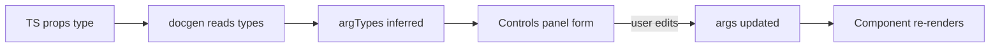
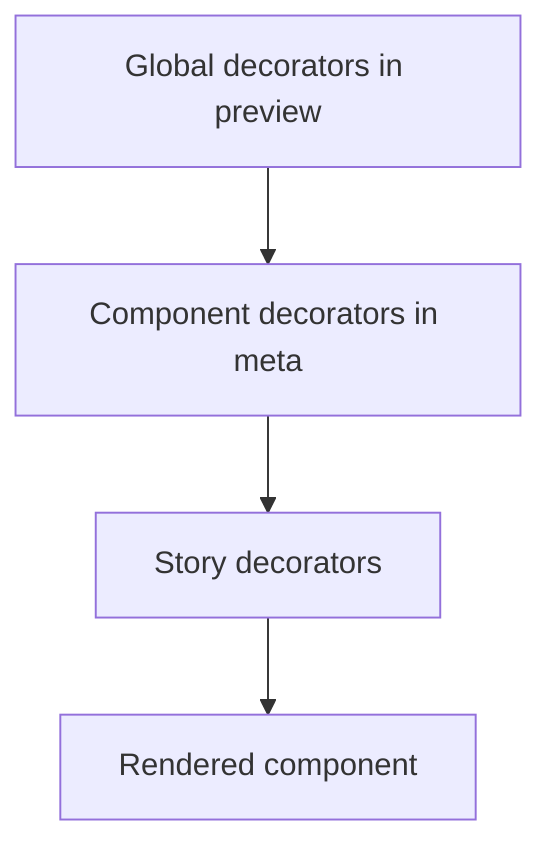
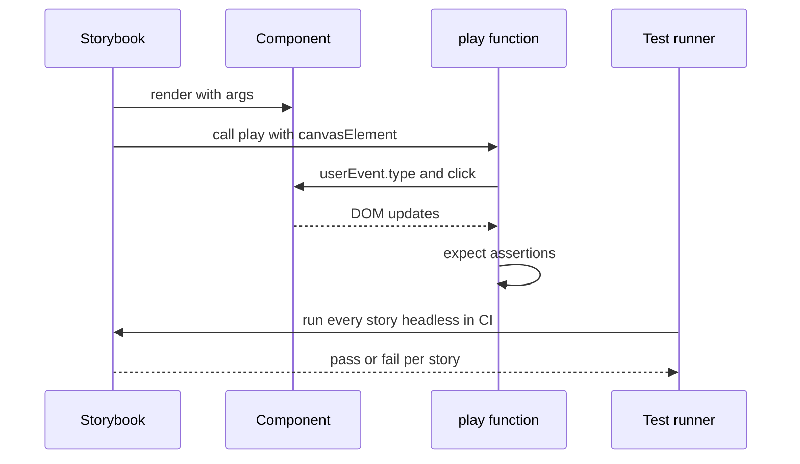
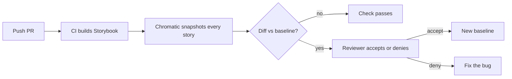

## 1. What it is

**Storybook is a standalone dev environment that renders your components in isolation, one "story" per state, so you can develop, document and test them without running the whole app.**

Think of a car factory. You do not test a new brake pad by building a whole car and driving it down the motorway. You put the brake pad on a test rig, press it with known forces, and watch what happens. Storybook is the test rig for UI components. Each story is one known input ("a negative balance", "a loading state", "a 40-character account name") and you can look at the result, click it, and run automated checks on it.

The problem it solves: in a real app, reaching a specific UI state is slow and fragile. To see the "account frozen" banner you may need to log in through Okta, pick a specific account, and wait for an API to return a rare status. Storybook lets you render that exact state in one click, forever, for every developer, designer and QA person. It also turns those states into living documentation and into test cases.

## 2. Core concepts

### [Beginner] Component-driven development (CDD)

CDD means you build UIs from the bottom up: small components first (Button, MoneyText), then composites (TransactionRow), then pages. You finish and verify each piece in isolation before wiring it into the app.

> **Why:** Bugs are cheaper to find in a small unit. If `MoneyText` formats `-1234.5` wrong, you want to see that in a story, not buried inside a dashboard that also has a chart, a table and three API calls.



```tsx
// MoneyText.tsx - the smallest building block
type MoneyTextProps = { amountCents: number; currency: 'USD' | 'EUR' | 'NPR' };

export function MoneyText({ amountCents, currency }: MoneyTextProps) {
  const formatted = new Intl.NumberFormat('en-US', { style: 'currency', currency })
    .format(amountCents / 100);
  return <span className={amountCents < 0 ? 'text-red-600' : ''}>{formatted}</span>;
}
```

### [Beginner] What a story is, and the CSF3 file shape

A story is a function or object that says "render this component with these inputs". Stories live in `*.stories.tsx` files written in **CSF (Component Story Format)**. CSF is just a standard ES module:

- The **default export** (called `meta`) describes the component: which component, a title, default args.
- Each **named export** is one story.

CSF3 (the default since Storybook 7) made stories plain objects instead of functions, so most stories need no render code at all.

```tsx
// MoneyText.stories.tsx
import type { Meta, StoryObj } from '@storybook/react';
import { MoneyText } from './MoneyText';

const meta = {
  title: 'Finance/MoneyText',   // sidebar path. Optional: inferred from file path if omitted
  component: MoneyText,         // lets Storybook read props for docs and controls
  args: { currency: 'USD' },    // defaults shared by every story below
} satisfies Meta<typeof MoneyText>;

export default meta;
type Story = StoryObj<typeof meta>;

export const Positive: Story = { args: { amountCents: 123456 } };
export const Negative: Story = { args: { amountCents: -98050 } };
export const Euro: Story = { args: { amountCents: 500, currency: 'EUR' } };
```

> **Why:** `satisfies Meta<typeof MoneyText>` keeps the exact type of `meta`, so `StoryObj<typeof meta>` knows which args are already provided. TypeScript then only complains about args you truly forgot.

> **Outdated:** `storiesOf('Button', module).add(...)` is the old imperative API. It was deprecated in 7 and removed in 8. CSF2 (`const Template = (args) => <Button {...args} />; export const A = Template.bind({})`) still works but is noise. Write CSF3.

### [Beginner] Args: the inputs of a story

**Args** are the props a story passes to the component. They are serializable data, which is the key idea: because Storybook owns them, it can show them in a UI panel, change them live, put them in the URL, and reuse them across stories.

Args merge in layers: global (preview) then component (meta) then story. The story wins.

```tsx
export const LargeWithdrawal: Story = {
  args: {
    ...Negative.args,        // reuse another story's args
    amountCents: -2500000,
  },
};
```

### [Beginner] Controls: editing args live

The Controls panel (part of addon-essentials) renders a form for each arg. Storybook infers control types from your TypeScript props using `react-docgen` (default in 7+) or `react-docgen-typescript`.

- `string` prop becomes a text box
- `boolean` becomes a toggle
- a union like `'USD' | 'EUR'` becomes a select (with react-docgen-typescript; react-docgen may need help)



### [Intermediate] argTypes: describing and overriding args

`argTypes` is metadata about each arg: control type, options, description, category, whether to hide it. You use it when inference is wrong or not enough.

```tsx
const meta = {
  component: TransactionRow,
  argTypes: {
    status: {
      control: 'select',
      options: ['pending', 'posted', 'reversed'],
      description: 'Ledger status of the transaction',
    },
    amountCents: { control: { type: 'number', step: 100 } },
    onDispute: { table: { category: 'Events' } },
    internalId: { table: { disable: true } }, // hide from docs and controls
  },
} satisfies Meta<typeof TransactionRow>;
```

> **Gotcha:** `argTypes` describe; `args` provide values. Putting a default value in `argTypes` does not pass it to the component. Put values in `args`.

### [Intermediate] Actions: seeing event callbacks

Actions log calls to callback props (`onClick`, `onSubmit`) in the Actions panel. Two ways to get them:

1. `argTypes: { onSubmit: { action: 'submitted' } }` or a global `argTypesRegex: '^on[A-Z].*'` in preview (Storybook 7 default).
2. `fn()` from `@storybook/test` (7.6+), which creates a spy that also logs as an action.

```tsx
import { fn } from '@storybook/test';

const meta = {
  component: TransferForm,
  args: { onSubmit: fn() }, // spy: logs in Actions AND can be asserted in play
} satisfies Meta<typeof TransferForm>;
```

> **Outdated:** In Storybook 8, implicit actions from `argTypesRegex` are no longer spies you can assert on in `play`. The recommended pattern since 8 is explicit `fn()` in args. Use `fn()` now and you will not need to migrate.

### [Intermediate] Decorators: wrapping stories with context

A decorator is a function that wraps a story's output. Use it for providers (theme, i18n, React Query, router, auth), layout padding, or fake context.

```tsx
// Component-level decorator
const meta = {
  component: PortfolioCard,
  decorators: [
    (Story) => (
      <div style={{ maxWidth: 360, padding: 16 }}>
        <Story />
      </div>
    ),
  ],
} satisfies Meta<typeof PortfolioCard>;
```

Decorators apply in layers: story decorators are innermost, then component, then global (preview). Global providers like `QueryClientProvider` go in `preview.tsx`.



> **Why:** Components often call hooks like `useTheme()` or `useQueryClient()`. Without the provider those hooks throw. A decorator gives each story the same environment the app provides, without the rest of the app.

### [Intermediate] Parameters: static config for addons

**Parameters** are non-arg metadata that addons read: background colours, viewport, layout, MSW handlers, Chromatic options, docs settings. Unlike args, they are not passed to the component and cannot be edited from Controls.

```tsx
export const MobileStatement: Story = {
  parameters: {
    layout: 'fullscreen',                       // 'centered' | 'padded' | 'fullscreen'
    viewport: { defaultViewport: 'mobile1' },   // addon-viewport
    backgrounds: { default: 'dark' },           // addon-backgrounds
    docs: { description: { story: 'Statement on a phone.' } },
  },
};
```

> **Interview tip:** A clean answer: "args are the component's inputs and are dynamic; parameters configure Storybook and addons and are static; decorators wrap the render." Interviewers often probe this distinction.

### [Intermediate] Loaders and the render function

Sometimes a story needs custom JSX (for example, a component composed with children) or async data. Use `render` for custom JSX and `loaders` for async setup that runs before render.

```tsx
export const WithChildren: Story = {
  render: (args) => (
    <AccountList {...args}>
      <AccountList.Item name="Checking" balanceCents={420000} />
      <AccountList.Item name="Savings" balanceCents={1250000} />
    </AccountList>
  ),
};
```

### [Advanced] Play functions and interaction testing

A **play function** runs after a story renders. It drives the UI like a user (type, click) and makes assertions. In 7.6+ you import everything from `@storybook/test`, which bundles Testing Library and a Vitest-compatible `expect` that are instrumented, so each step appears in the Interactions panel and you can step backwards through it.

```tsx
import type { Meta, StoryObj } from '@storybook/react';
import { expect, fn, userEvent, within } from '@storybook/test';
import { TransferForm } from './TransferForm';

const meta = {
  component: TransferForm,
  args: { onSubmit: fn(), maxAmountCents: 500000 },
} satisfies Meta<typeof TransferForm>;
export default meta;
type Story = StoryObj<typeof meta>;

export const RejectsOverLimit: Story = {
  play: async ({ canvasElement, args }) => {
    const canvas = within(canvasElement);
    await userEvent.type(canvas.getByLabelText('Amount'), '6000');
    await userEvent.click(canvas.getByRole('button', { name: /transfer/i }));

    await expect(canvas.getByRole('alert')).toHaveTextContent('exceeds daily limit');
    await expect(args.onSubmit).not.toHaveBeenCalled();
  },
};

export const SubmitsValidAmount: Story = {
  play: async ({ canvasElement, args, step }) => {
    const canvas = within(canvasElement);
    await step('Fill form', async () => {
      await userEvent.type(canvas.getByLabelText('Amount'), '120.50');
    });
    await step('Submit', async () => {
      await userEvent.click(canvas.getByRole('button', { name: /transfer/i }));
    });
    await expect(args.onSubmit).toHaveBeenCalledWith({ amountCents: 12050 });
  },
};
```

> **Why:** Always `await` userEvent and expect calls. The instrumentation records each call as a step. Without `await`, steps race and the panel shows confusing results.

> **Outdated:** Before 7.6 you used `@storybook/jest` plus `@storybook/testing-library`. Both are deprecated; replace them with `@storybook/test`. In Storybook 9 the import moves again, to `storybook/test`.



### [Advanced] Running interaction tests in CI

In Storybook 7 and 8, `@storybook/test-runner` turns every story into a test. It uses Jest plus Playwright under the hood, opens each story in a headless browser, fails if rendering throws, and runs play functions.

```bash
npm i -D @storybook/test-runner
# In one terminal: storybook dev, or against a static build
npx test-storybook --url http://localhost:6006
```

Every story is a smoke test for free, even without a play function: if it throws on render, CI fails.

> **Outdated:** Storybook 8.4+ and especially 9 recommend the Vitest addon (`@storybook/addon-vitest` in 9, earlier `@storybook/experimental-addon-test`). It runs stories as Vitest tests in browser mode, which is faster and integrates coverage. The Jest-based test-runner still works but is no longer the default path.

### [Advanced] Mocking network with MSW

Components that fetch data (via React Query or axios) need responses. `msw-storybook-addon` uses Mock Service Worker to intercept real `fetch`/XHR calls in the browser, so the component code is unchanged.

```tsx
// preview.tsx
import { initialize, mswLoader } from 'msw-storybook-addon';
initialize({ onUnhandledRequest: 'bypass' });

const preview: Preview = { loaders: [mswLoader] };
export default preview;
```

```tsx
// AccountSummary.stories.tsx
import { http, HttpResponse, delay } from 'msw';

export const Loaded: Story = {
  parameters: {
    msw: {
      handlers: [
        http.get('/api/accounts/:accountId', ({ params }) =>
          HttpResponse.json({ accountId: params.accountId, balanceCents: 1234500, currency: 'USD' }),
        ),
      ],
    },
  },
};

export const Loading: Story = {
  parameters: {
    msw: { handlers: [http.get('/api/accounts/:accountId', async () => { await delay('infinite'); })] },
  },
};

export const ServerError: Story = {
  parameters: {
    msw: { handlers: [http.get('/api/accounts/:accountId', () => new HttpResponse(null, { status: 500 }))] },
  },
};
```

You need the service worker file once: `npx msw init public/` and add `staticDirs: ['../public']` in main.ts.

> **Gotcha:** MSW 2 uses `http.get` and `HttpResponse`. Tutorials with `rest.get((req, res, ctx) => res(ctx.json(...)))` are MSW 1 and will not compile against MSW 2.

### [Advanced] Visual testing with Chromatic

Interaction tests check behaviour; they do not notice that a padding changed from 16px to 12px. **Visual regression testing** takes a screenshot of every story, compares it to an approved baseline, and flags pixel diffs for human review. Chromatic is the hosted service built by the Storybook maintainers.



```bash
npx chromatic --project-token=$CHROMATIC_PROJECT_TOKEN --only-changed --exit-zero-on-changes
```

- `--only-changed` enables TurboSnap: only stories affected by changed files are snapshotted (saves money).
- Per-story control: `parameters: { chromatic: { delay: 300, diffThreshold: 0.2, disableSnapshot: true } }`.

> **Finance tip:** Charts and dates make visual tests flaky. Freeze dates (pass a fixed `asOf` arg or mock `Date`) and disable chart animation in stories, or every run will show a "diff".

## 3. Why it's used in this project

- **Rare financial states are hard to reach.** Overdrawn accounts, frozen accounts, pending reversals, FX conversions, a 15-digit portfolio value. Each becomes a story anyone can open in a second.
- **Money formatting must be consistent.** A story grid of `MoneyText` across currencies (USD, EUR, JPY with zero decimals, NPR) catches formatting regressions visually.
- **Forms carry business rules.** Transfer and account forms have limits and validation. Play functions encode "amount above daily limit shows an error and does not submit" as an executable spec.
- **Design system sharing.** Several financial apps reuse the same Button, DataTable and DatePicker. Storybook is the catalogue designers and other teams browse.
- **No Okta in the loop.** Components are rendered without logging in. Decorators provide a fake auth context; MSW provides fake API data with masked, realistic PII.
- **Accessibility compliance.** Financial apps often must meet WCAG 2.1 AA. The a11y addon runs axe on every story.
- **Review speed.** PRs link to a deployed Storybook (Chromatic or static hosting), so reviewers and product owners see the change without pulling the branch.

> **Finance tip:** Never put real customer data in stories, even in an internal Storybook. Use clearly fake fixtures (`Jane Doe`, account `****1234`). Static Storybook builds are often hosted with weaker access control than the app.

## 4. Setup & configuration

### [Beginner] Install

```bash
# Detects React + Vite and installs @storybook/react-vite plus addons
npx storybook@7 init
npm run storybook        # dev server on :6006
npm run build-storybook  # static site in storybook-static/
```

### [Beginner] .storybook/main.ts

```ts
// .storybook/main.ts - runs in Node. Configures the build and which files are stories.
import type { StorybookConfig } from '@storybook/react-vite';
import { mergeConfig } from 'vite';

const config: StorybookConfig = {
  // Globs for story and docs files, relative to this file
  stories: ['../src/**/*.mdx', '../src/**/*.stories.@(ts|tsx)'],

  // Addons extend the UI and behaviour
  addons: [
    '@storybook/addon-essentials',   // controls, actions, docs, viewport, backgrounds, toolbars, measure, outline
    '@storybook/addon-interactions', // Interactions panel for play functions (merged into core in 8.x/9)
    '@storybook/addon-a11y',         // axe accessibility checks per story
    '@storybook/addon-links',        // link between stories
  ],

  // Framework = renderer (React) + builder (Vite). One package instead of two settings.
  framework: { name: '@storybook/react-vite', options: {} },

  // Autodocs: generate a Docs page for components whose meta has tags: ['autodocs']
  docs: { autodocs: 'tag' },

  // Served as static files. Needed for the MSW service worker in public/
  staticDirs: ['../public'],

  // Prop type extraction. 'react-docgen' is faster, 'react-docgen-typescript' is more accurate
  typescript: { reactDocgen: 'react-docgen-typescript' },

  // Customise the Vite config Storybook uses (it already merges your vite.config.ts)
  viteFinal: async (viteConfig) =>
    mergeConfig(viteConfig, {
      define: { 'import.meta.env.VITE_API_URL': JSON.stringify('/api') },
    }),
};

export default config;
```

> **Why:** Storybook 7 replaced the old Webpack-only setup with pluggable builders. `@storybook/react-vite` reuses your `vite.config.ts` (aliases, plugins), so stories compile exactly like the app and start in seconds.

### [Intermediate] .storybook/preview.tsx

```tsx
// .storybook/preview.tsx - runs in the browser, around every story
import type { Preview } from '@storybook/react';
import { QueryClient, QueryClientProvider } from '@tanstack/react-query';
import { initialize, mswLoader } from 'msw-storybook-addon';
import { ThemeProvider } from '../src/theme/ThemeProvider';
import { FakeAuthProvider } from '../src/test/FakeAuthProvider';
import '../src/index.css'; // global styles / Tailwind

initialize({ onUnhandledRequest: 'bypass' }); // start MSW once

const preview: Preview = {
  parameters: {
    actions: { argTypesRegex: '^on[A-Z].*' }, // SB7: auto actions for onX props
    controls: {
      matchers: { color: /(background|color)$/i, date: /Date$/i }, // control type by prop name
      expanded: true,                                              // show descriptions
    },
    layout: 'centered',
  },

  // Toolbar global: switch theme for all stories
  globalTypes: {
    theme: {
      description: 'Colour theme',
      defaultValue: 'light',
      toolbar: { icon: 'mirror', items: ['light', 'dark'], dynamicTitle: true },
    },
  },

  decorators: [
    (Story, context) => {
      // New client per story so cache does not leak between stories
      const queryClient = new QueryClient({ defaultOptions: { queries: { retry: false } } });
      return (
        <QueryClientProvider client={queryClient}>
          <FakeAuthProvider user={{ name: 'Jane Doe', roles: ['viewer'] }}>
            <ThemeProvider mode={context.globals.theme}>
              <Story />
            </ThemeProvider>
          </FakeAuthProvider>
        </QueryClientProvider>
      );
    },
  ],

  loaders: [mswLoader], // MSW handlers from parameters.msw are applied before render
};

export default preview;
```

> **Gotcha:** Name it `preview.tsx`, not `preview.ts`, if it contains JSX. Same rule as any TypeScript file.

## 5. Key features we use

### [Beginner] Autodocs and MDX

```tsx
const meta = {
  component: DataTable,
  tags: ['autodocs'], // generates a Docs page: description, props table, all stories
  parameters: { docs: { description: { component: 'Paginated table for transactions.' } } },
} satisfies Meta<typeof DataTable>;
```

JSDoc comments on props appear in the props table, so document props once in code.

### [Beginner] Story matrix for edge cases

```tsx
export const AllCurrencies: Story = {
  render: () => (
    <div className="grid gap-2">
      {(['USD', 'EUR', 'JPY', 'NPR'] as const).map((c) => (
        <MoneyText key={c} amountCents={-123456789} currency={c} />
      ))}
    </div>
  ),
};
```

### [Intermediate] Accessibility addon

```tsx
export const IconOnlyButton: Story = {
  parameters: {
    a11y: {
      config: { rules: [{ id: 'color-contrast', enabled: true }] },
    },
  },
};
```

The Accessibility panel lists axe violations (missing labels, contrast, roles). In Storybook 9 the a11y checks can also fail the Vitest run.

### [Intermediate] Router and auth decorators

```tsx
import { MemoryRouter, Route, Routes } from 'react-router-dom';

export const AccountDetailPage: Story = {
  decorators: [
    (Story) => (
      <MemoryRouter initialEntries={['/accounts/acc_123']}>
        <Routes>
          <Route path="/accounts/:accountId" element={<Story />} />
        </Routes>
      </MemoryRouter>
    ),
  ],
};
```

### [Advanced] Typing args for components with required callbacks

```tsx
const meta = {
  component: ConfirmTransferDialog,
  args: { onConfirm: fn(), onCancel: fn(), open: true },
} satisfies Meta<typeof ConfirmTransferDialog>;
export default meta;
type Story = StoryObj<typeof meta>;

// Only amountCents is still required, TypeScript knows the rest are in meta.args
export const Default: Story = { args: { amountCents: 250000 } };
```

## 6. Interview questions

#### Q: What is the difference between args, argTypes, parameters and decorators?

- **args**: the dynamic inputs (props) passed to the component. Editable via Controls, serializable, mergeable across levels.
- **argTypes**: metadata describing args: control type, options, description, table category, hidden.
- **parameters**: static config read by Storybook and addons (layout, viewport, MSW handlers, Chromatic). Not passed to the component.
- **decorators**: functions that wrap the story render, used for providers, layout and mock context.

All four can be set globally (preview), per component (meta) or per story, with the most specific winning.

#### Q: What is CSF3 and why was it introduced?

CSF (Component Story Format) is the ES-module format: a default export with metadata and named exports for stories. CSF3 makes stories objects (`{ args, play, render }`) rather than functions. Benefits: a default render (`<Component {...args} />`) so most stories are one line, easy spreading/reuse of other stories, `play` functions attached to stories, and better type inference with `Meta`/`StoryObj` and `satisfies`. Because CSF is plain ES modules, other tools (Testing Library `composeStories`, Vitest, Chromatic) can import stories directly.

#### Q: How do you test a component's behaviour inside Storybook?

Write a `play` function. It receives `canvasElement` and `args`. Use `within(canvasElement)` to query, `userEvent` to interact, and `expect` to assert, all from `@storybook/test` (7.6+). Use `fn()` for callback args so you can assert calls. Run them visually in the Interactions panel and headless in CI with `@storybook/test-runner` (7/8) or the Vitest addon (8.4+/9). You can also reuse stories in unit tests via `composeStories` so fixtures are not duplicated.

#### Q: How do you handle components that fetch data or need context?

Context: decorators in `meta` or `preview` that provide `QueryClientProvider`, theme, router, or a fake auth provider. Create a fresh `QueryClient` per story to avoid cache leaks. Data: prefer MSW (`msw-storybook-addon`) so the component's real fetch code runs and is intercepted at the network level, with per-story handlers for loaded, loading, empty and error states. Alternatively split container and presentational components and only story the presentational one with plain args.

#### Q: What does visual regression testing add over interaction tests, and what makes it flaky?

Interaction tests assert behaviour and DOM content; they miss CSS regressions like spacing, colour, overflow or font changes. Visual testing (Chromatic, Percy, Playwright screenshots) snapshots each story and diffs pixels against a reviewed baseline. Flakiness comes from non-deterministic input: current dates, random IDs, animations, web fonts loading late, and live data. Fix with fixed `asOf` dates, seeded data, disabled animations (`isAnimationActive={false}` for charts), `chromatic.delay`, and MSW for data. TurboSnap (`--only-changed`) limits snapshots to affected stories.

> **Interview tip:** Mention that every story is also a free smoke test: if it throws on render, the test-runner fails. That shows you understand Storybook as a testing tool, not only a gallery.

## 7. Drawbacks & pain points

- **Config drift from the app.** Providers, global CSS, env variables and aliases must be repeated in `preview.tsx` and `main.ts`. When the app adds a provider, stories start crashing.
- **Upgrade churn.** Package names moved between 7, 8 and 9 (`@storybook/jest` to `@storybook/test` to `storybook/test`; addons merged into core). Use `npx storybook@latest upgrade` and its automigrations rather than editing by hand.
- **Heavy dependency tree.** Many packages and slower installs; 9 reduced this notably.
- **Stories rot.** Nobody notices a broken story unless CI runs the test-runner or builds Storybook.
- **Docgen limits.** Complex prop types (generics, `Omit<>`, imported unions) may produce poor controls.
- **Visual testing costs money.** Chromatic bills per snapshot.

Gotchas that trip devs up:

```tsx
// 1. Forgetting await in play: steps race, assertions run before UI updates
play: async ({ canvasElement }) => {
  const canvas = within(canvasElement);
  userEvent.click(canvas.getByRole('button')); // BAD: missing await
  await expect(canvas.getByText('Saved')).toBeInTheDocument(); // flaky
};

// 2. Shared QueryClient across stories: cached data leaks from one story into another
const queryClient = new QueryClient(); // BAD at module scope in preview
// GOOD: create it inside the decorator function

// 3. Querying document instead of the canvas: in Docs mode many stories share one page
screen.getByRole('button'); // may hit a button from another story
within(canvasElement).getByRole('button'); // scoped, correct

// 4. Portals (modals, toasts) render outside canvasElement
// Query document.body for portal content:
within(canvasElement.ownerDocument.body).getByRole('dialog');
```

> **Gotcha:** `argTypesRegex` actions are not spies in Storybook 8+. If a play function asserts `expect(args.onSubmit).toHaveBeenCalled()` and onSubmit came from the regex, it fails. Use `fn()`.

## 8. Better alternatives

Storybook is still the industry default for component workshops. The trend is not replacing it but changing how it is used:

- **Storybook 8 (2024):** `@storybook/test` and `fn()` as the standard, faster React docgen, removal of `storiesOf`, Visual Tests addon (Chromatic inside the UI), React 19 support in later minors.
- **Storybook 9 (2025):** much smaller install, many addons (essentials, interactions) folded into core, imports like `storybook/test` and `storybook/actions`, a Vitest-based component testing workflow with coverage and a11y checks. Newer majors continue toward ESM-only packages; verify versions with the upgrade tool.
- **Ladle:** a lightweight Vite-native story runner that reads CSF. Very fast, far fewer features.
- **Histoire:** Vite-based, popular with Vue/Svelte.
- **Vitest browser mode / Playwright component tests:** for behaviour testing without a catalogue.

| Tool | Install size | Boilerplate | Devtools / addons | Learning curve | TypeScript | Popularity | When it wins |
|---|---|---|---|---|---|---|---|
| Storybook 7 | ~heavy (hundreds of MB node_modules) | Medium | Huge ecosystem | Medium | Good | Very high | Design systems, docs, interaction and visual testing |
| Storybook 9 | ~much lighter than 7 | Low-medium | Huge, more built in | Medium | Very good | Very high | Same, plus Vitest-based component tests |
| Ladle | ~small | Low (CSF) | Minimal | Low | Good | Low | Fast local workshop, small teams |
| Histoire | ~small | Low | Moderate | Low | Good | Low-medium | Vue/Svelte projects |
| Vitest browser / Playwright CT | ~medium | Low | Test tooling only | Medium | Very good | High | Behaviour tests without a gallery |

## 9. When NOT to use it

- A tiny app with a handful of one-off screens and no design system: the setup and maintenance cost outweighs the benefit.
- Full user journeys across pages, auth redirects (Okta login), and real backend contracts: use Playwright end-to-end tests.
- Pure logic (interest calculation, currency rounding): use plain Vitest unit tests.
- Components that only make sense with a live data stream you cannot mock cheaply.
- When the team will not keep stories updated in CI; a broken Storybook is worse than none because people stop trusting it.

## Cheatsheet

| Concept | Where | Example |
|---|---|---|
| Meta | default export | `const meta = { component: X, args: {} } satisfies Meta<typeof X>` |
| Story | named export | `export const Negative: Story = { args: { amountCents: -500 } }` |
| args | meta / story / preview | dynamic props, editable in Controls |
| argTypes | meta / story | `{ status: { control: 'select', options: [...] } }` |
| parameters | any level | `{ layout: 'fullscreen', msw: { handlers } }` |
| decorators | any level | `[(Story) => <Provider><Story /></Provider>]` |
| play | story | `async ({ canvasElement, args, step }) => {}` |
| spy | args | `onSubmit: fn()` |
| autodocs | meta | `tags: ['autodocs']` |
| CI tests | CLI | `npx test-storybook` (7/8) or Vitest addon (9) |
| Visual tests | CLI | `npx chromatic --only-changed` |

```tsx
import type { Meta, StoryObj } from '@storybook/react';
import { expect, fn, userEvent, within } from '@storybook/test'; // SB9: 'storybook/test'
import { http, HttpResponse } from 'msw';

const meta = {
  component: TransferForm,
  args: { onSubmit: fn() },
  decorators: [(Story) => <div style={{ width: 400 }}><Story /></div>],
  tags: ['autodocs'],
} satisfies Meta<typeof TransferForm>;
export default meta;
type Story = StoryObj<typeof meta>;

export const Submits: Story = {
  parameters: { msw: { handlers: [http.post('/api/transfers', () => HttpResponse.json({ ok: true }))] } },
  play: async ({ canvasElement, args }) => {
    const c = within(canvasElement);
    await userEvent.type(c.getByLabelText('Amount'), '50');
    await userEvent.click(c.getByRole('button', { name: /transfer/i }));
    await expect(args.onSubmit).toHaveBeenCalled();
  },
};
```
