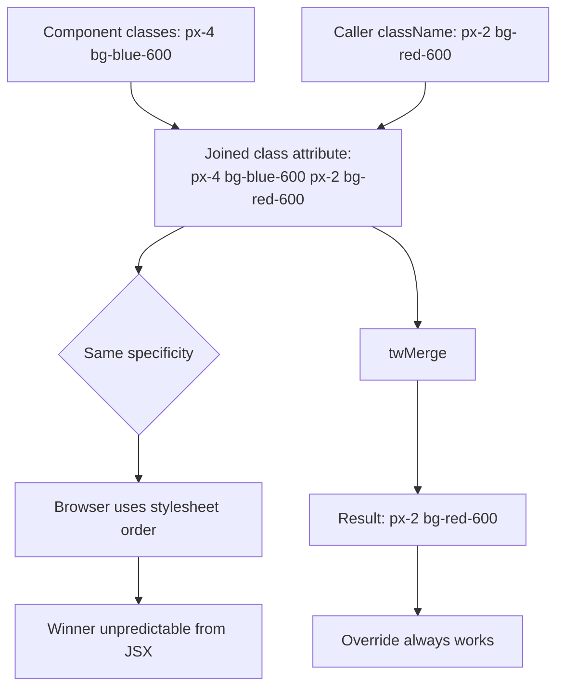
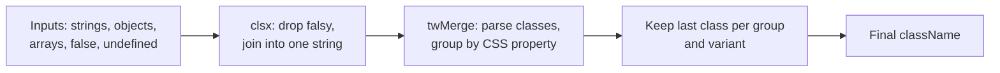

## 1. What it is

**tailwind-merge is a function, `twMerge()`, that takes Tailwind class strings and drops earlier classes that conflict with later ones, so overrides behave the way you expect.**

Imagine two people writing instructions on the same sticky note: "paint it blue" and later "paint it red". A painter who reads in a random order might paint it blue. tailwind-merge erases "paint it blue" before the painter sees the note, so only "paint it red" remains.

The problem it solves: reusable components accept a `className` prop for overrides. When the component has `px-4` and the caller passes `px-2`, both classes land on the element. The browser picks a winner based on the order of rules in the CSS file, not the order in the `class` attribute. tailwind-merge removes `px-4`, making the override reliable.

## 2. Core concepts

### [Beginner] Why conflicts happen: CSS order, not class order

```tsx
// Button has bg-blue-600 built in. Caller wants red.
<button className="bg-blue-600 bg-red-600">Transfer</button>
```

Both rules have identical specificity (one class each). When specificity ties, the rule that appears **later in the stylesheet** wins. Tailwind generates the stylesheet in its own internal order. The order inside the `class="..."` attribute is irrelevant to CSS.

```css
/* Generated CSS: order decided by Tailwind, not by you */
.bg-blue-600 { background-color: #2563eb; }
.bg-red-600  { background-color: #dc2626; }
```

Here red wins, but only by luck. Swap to `bg-red-600 bg-gray-100` and gray might win even though you passed red last.



> **Why:** Specificity and source order are the two tie-breakers in the CSS cascade. Class attribute order is not part of the cascade at all. This is a CSS fact, not a Tailwind quirk.

### [Beginner] Basic twMerge

```ts
import { twMerge } from "tailwind-merge";

twMerge("px-4 py-2 bg-blue-600", "px-2 bg-red-600");
// -> "py-2 px-2 bg-red-600"

twMerge("p-4", "px-2");
// -> "p-4 px-2"   (px refines p, both kept: px-2 wins on x axis, p-4 still applies to y)

twMerge("px-2", "p-4");
// -> "p-4"        (p-4 covers px, so the earlier px-2 is removed)

twMerge("hover:bg-blue-600", "bg-red-600");
// -> "hover:bg-blue-600 bg-red-600"   (different variants do not conflict)

twMerge("text-sm text-gray-500", "text-lg");
// -> "text-gray-500 text-lg"  (font-size and color are different groups)
```

It understands variants (`hover:`, `md:`, `dark:`), the important modifier (`!`), arbitrary values (`p-[13px]`), opacity modifiers (`bg-black/50`), and negative values.

### [Intermediate] The cn() helper with clsx

Almost every Tailwind + React codebase (and shadcn/ui) defines `cn()`: `clsx` handles conditional logic, then `twMerge` resolves conflicts.

```ts
// src/lib/cn.ts
import { clsx, type ClassValue } from "clsx";
import { twMerge } from "tailwind-merge";

export function cn(...inputs: ClassValue[]): string {
  return twMerge(clsx(inputs));
}
```

```tsx
type AmountProps = {
  amountCents: number;
  currency: string;
  className?: string;
};

export function Amount({ amountCents, currency, className }: AmountProps) {
  const negative = amountCents < 0;
  return (
    <span
      className={cn(
        "font-mono tabular-nums text-gray-900",
        negative && "text-red-700",
        className, // caller wins last
      )}
    >
      {new Intl.NumberFormat("en-US", { style: "currency", currency }).format(amountCents / 100)}
    </span>
  );
}

// Caller overrides size and color safely
<Amount amountCents={-4250} currency="USD" className="text-lg text-red-800" />;
```



> **Interview tip:** Explain the split of responsibilities: clsx decides *which* classes are present; twMerge decides *which of the conflicting ones survive*. Neither does the other's job.

### [Intermediate] How it decides what conflicts

tailwind-merge ships a config describing Tailwind's default **class groups** (all `px-*` classes, all `bg-<color>` classes, all font-size classes) and which groups override others (`p-*` overrides `px-*` and `py-*`). For each class it parses: variants, important flag, the base class, then finds its group. Walking from the end, it keeps the first class it sees per `variants + group` key and drops earlier ones.

```ts
// Conceptual model, not the real source
// "md:hover:!px-2"  -> variants: [md, hover], important: true, group: "px"
// conflict key       -> "md:hover:!px"
```

> **Gotcha:** It knows Tailwind's **default** config. It does not read your `tailwind.config.js`. Custom theme keys can be misclassified (next section).

### [Advanced] extendTailwindMerge for custom classes

Say your theme adds a font size `amount-lg` and a color `gain`. Both produce `text-*` classes.

```ts
twMerge("text-amount-lg text-gain");
// Default config guesses unknown text-* values are colors.
// -> "text-gain"  (BUG: your font size was dropped)
```

Teach it your custom classes:

```ts
// src/lib/cn.ts
import { clsx, type ClassValue } from "clsx";
import { extendTailwindMerge } from "tailwind-merge";

const customTwMerge = extendTailwindMerge({
  extend: {
    classGroups: {
      // text-amount-sm/md/lg are font sizes, not colors
      "font-size": [{ text: ["amount-sm", "amount-md", "amount-lg"] }],
      // custom shadow utility from a plugin
      shadow: [{ shadow: ["card", "glow"] }],
      // a plugin utility with no built-in group
      num: ["num"],
    },
  },
});

export function cn(...inputs: ClassValue[]) {
  return customTwMerge(clsx(inputs));
}
```

```ts
cn("text-amount-lg text-gain"); // -> "text-amount-lg text-gain"
cn("text-amount-sm", "text-amount-lg"); // -> "text-amount-lg"
```

Other options: `prefix` (if your Tailwind config uses one), `override` (replace instead of extend a group), and `cacheSize`.

> **Outdated:** The config schema changed between major versions. v2.x matches Tailwind v3 class names. v3.x (2025) matches Tailwind v4 (for example renamed shadow and radius scales, and different theme key names). Match the major version to your Tailwind version.

## 3. Why it's used in this project

- **Design system components** (`Button`, `Card`, `Amount`, `Badge`) accept `className` so screens can adjust spacing or emphasis without forking the component.
- **Status-driven styling** in transaction rows (`pending`, `posted`, `failed`, `reversed`) combines a base style, a status style and caller overrides. Without merging, a failed row could still show the base gray text.
- **shadcn/ui-style components** are built entirely on `cn()`. If the project uses them, tailwind-merge is already a dependency.

```tsx
type TxStatus = "pending" | "posted" | "failed";

const statusClass: Record<TxStatus, string> = {
  pending: "text-amber-700 italic",
  posted: "text-gray-900",
  failed: "text-red-700 line-through",
};

export function TxRow({ status, className, children }: {
  status: TxStatus; className?: string; children: React.ReactNode;
}) {
  return (
    <tr className={cn("border-b px-3 py-2 text-gray-600", statusClass[status], className)}>
      {children}
    </tr>
  );
}
```

> **Finance tip:** When status color communicates meaning (failed payment), make sure a caller's `className` cannot accidentally hide it. Consider applying the status class **after** `className`, or expose a narrow prop like `emphasis` instead of an open `className`.

## 4. Setup & configuration

### [Beginner] Install

```bash
npm install tailwind-merge clsx
# Tailwind v3 project:  npm install tailwind-merge@2
# Tailwind v4 project:  npm install tailwind-merge@3
```

### [Intermediate] A configured cn() module

```ts
// src/lib/cn.ts
import { clsx, type ClassValue } from "clsx";
import { extendTailwindMerge } from "tailwind-merge";

const twMerge = extendTailwindMerge({
  // Max number of results kept in the LRU cache (default 500). 0 disables caching.
  cacheSize: 500,

  // If tailwind.config.js has prefix: "tw-", tell tailwind-merge (v2 syntax)
  // prefix: "tw-",

  extend: {
    // Add values to existing groups or define new groups
    classGroups: {
      "font-size": [{ text: ["amount-sm", "amount-md", "amount-lg"] }],
    },
    // Declare that one group overrides another (e.g. p overrides px)
    // conflictingClassGroups: { ... },
  },
});

export const cn = (...inputs: ClassValue[]) => twMerge(clsx(inputs));
```

```json
// .vscode/settings.json: Tailwind IntelliSense inside cn()
{ "tailwindCSS.experimental.classRegex": [["cn\\(([^)]*)\\)", "[\"'`]([^\"'`]*)[\"'`]"]] }
```

## 5. Key features we use

### [Beginner] twMerge and twJoin

```ts
import { twMerge, twJoin } from "tailwind-merge";

// twJoin: just joins, no conflict resolution (cheap, like a tiny clsx)
twJoin("px-4", false && "hidden", "py-2"); // "px-4 py-2"

// twMerge: joins AND resolves conflicts
twMerge("px-4", "px-2"); // "px-2"
```

Use `twJoin` (or plain `clsx`) inside a component where you control every class and know there are no conflicts. Use `cn` / `twMerge` where external `className` meets internal classes.

### [Intermediate] Pairing with variant libraries

```ts
import { cva, type VariantProps } from "class-variance-authority";
import { cn } from "@/lib/cn";

const button = cva("inline-flex items-center rounded-md font-medium", {
  variants: {
    intent: { primary: "bg-blue-600 text-white", danger: "bg-red-600 text-white" },
    size: { sm: "h-8 px-3 text-sm", md: "h-10 px-4" },
  },
  defaultVariants: { intent: "primary", size: "md" },
});

type ButtonProps = React.ButtonHTMLAttributes<HTMLButtonElement> & VariantProps<typeof button>;

export function Button({ intent, size, className, ...rest }: ButtonProps) {
  return <button className={cn(button({ intent, size }), className)} {...rest} />;
}
```

`tailwind-variants` is an alternative to cva that calls tailwind-merge internally.

## 6. Interview questions

#### Q: Why doesn't the last class in the className string win in Tailwind?

The CSS cascade resolves ties by specificity and then by the order of rules in the stylesheet. The `class` attribute is an unordered set as far as CSS is concerned. Tailwind generates rules in its own order, so `className="px-4 px-2"` applies whichever rule Tailwind emitted later. tailwind-merge fixes this by removing the earlier conflicting class before it reaches the DOM.

#### Q: What is the cn() helper and why combine clsx with twMerge?

`cn(...inputs) => twMerge(clsx(inputs))`. clsx handles conditional inputs (strings, objects, arrays, falsy values) and produces a single string. twMerge then removes conflicting Tailwind classes, keeping the last per group. Together they give conditional, overridable class names in one call. It is the standard pattern in shadcn/ui.

#### Q: When would tailwind-merge give a wrong result, and how do you fix it?

When your config adds non-default classes. tailwind-merge only knows Tailwind's default config, so a custom font size `text-amount-lg` may be misclassified as a color and dropped when merged with `text-gain`. Also with a custom `prefix`, or classes from custom plugins. Fix with `extendTailwindMerge`, adding the classes to the right `classGroups`, and set `prefix` if used. Keep the tailwind-merge major version aligned with your Tailwind major version.

#### Q: What is the performance cost of tailwind-merge?

It adds roughly 7-8 kB gzip to the bundle and does string parsing at runtime on every call. It lazily builds its lookup structures on the first call and caches results in an LRU cache (default 500 entries), so repeated identical inputs are fast. In a table rendering thousands of rows, calling `cn()` per cell with many unique combinations can show up in profiles. Mitigations: hoist static strings, use `twJoin`/`clsx` where no conflicts are possible, memoize row class names, or avoid exposing `className` overrides on hot-path cells.

#### Q: Does `twMerge("p-4", "px-2")` remove p-4?

No. `px-2` only overrides the horizontal part, so both are kept and the result is `"p-4 px-2"`. But `twMerge("px-2", "p-4")` returns `"p-4"`, because `p-4` fully covers `px`. The library tracks which groups override others, not just identical prefixes.

## 7. Drawbacks & pain points

- **Runtime cost** on every render, unlike pure build-time CSS.
- **Bundle size** of ~7-8 kB gzip, large compared to clsx (~0.3 kB).
- **Does not read your Tailwind config**; custom tokens need manual `extendTailwindMerge` setup that can drift from the real config.
- **Version coupling** with Tailwind majors.
- **Encourages open-ended overrides**, which can erode design system consistency.

Gotchas that trip devs up:

```ts
// 1. Custom color misread as conflicting with custom font size
twMerge("text-amount-lg text-gain"); // "text-gain" unless configured

// 2. Using clsx alone and expecting conflicts to resolve
clsx("px-4", "px-2"); // "px-4 px-2": both stay

// 3. Putting className first, so internal classes override the caller
cn(className, "px-4"); // caller's px-2 is removed. Put className LAST.

// 4. Different variants never conflict
twMerge("md:px-4", "px-2"); // keeps both; md:px-4 still applies on md+
```

## 8. Better alternatives

- **Avoid conflicts by design.** Variant props (`intent`, `size`) via cva or tailwind-variants, and no free `className` on low-level primitives, means you rarely need merging.
- **tailwind-variants** bundles variants plus tailwind-merge with slots for multi-part components.
- **CSS cascade layers / Tailwind v4.** v4 uses native `@layer`, but layers do not fix same-layer utility conflicts, so tailwind-merge is still used with v4.
- **Data attributes** (`data-[state=selected]:bg-blue-50`) instead of passing override classes.

| Option | Bundle (~gzip) | Boilerplate | Devtools | Learning curve | TS support | Popularity | When it wins |
| --- | --- | --- | --- | --- | --- | --- | --- |
| tailwind-merge + clsx (`cn`) | ~8 kB | Tiny helper | None needed | Low | Excellent | Very high | Overridable components |
| clsx only | ~0.3 kB | None | None | Very low | Good | Very high | No external overrides |
| cva + cn | ~9 kB | Variant config | None | Low | Excellent | High | Design system components |
| tailwind-variants | ~10 kB incl. merge | Variant config | None | Low-medium | Excellent | Medium | Multi-slot components |
| `!` important modifier | 0 | None | None | Very low | n/a | n/a | One-off emergency override |

## 9. When NOT to use it

- Components that never accept external classes: use `clsx` or plain strings.
- Hot paths rendering thousands of elements with unique class combos, where profiling shows merge cost.
- Projects not using Tailwind (it only understands Tailwind classes).
- When you want to forbid overrides for consistency (strict design system): expose variant props instead.

## Cheatsheet

| API | Purpose |
| --- | --- |
| `twMerge(...classLists)` | Join and resolve conflicts, last wins per group |
| `twJoin(...classLists)` | Join only, skip falsy, no conflict resolution |
| `extendTailwindMerge({ extend, override, prefix, cacheSize })` | Custom config, returns a new merge function |
| `cn(...inputs)` | Project helper: `twMerge(clsx(inputs))` |

```ts
import { clsx, type ClassValue } from "clsx";
import { twMerge, extendTailwindMerge } from "tailwind-merge";

export const cn = (...i: ClassValue[]) => twMerge(clsx(i));

twMerge("px-4 py-2", "px-2");           // "py-2 px-2"
twMerge("px-2", "p-4");                 // "p-4"
twMerge("hover:bg-blue-600", "bg-red-600"); // both kept
twMerge("bg-black/50", "bg-white");     // "bg-white"
twMerge("p-[13px]", "p-4");             // "p-4"

const merge = extendTailwindMerge({
  extend: { classGroups: { "font-size": [{ text: ["amount-lg"] }] } },
});
```
