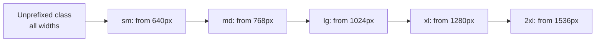
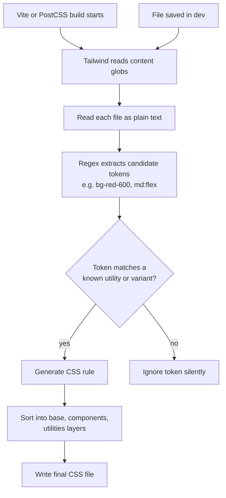
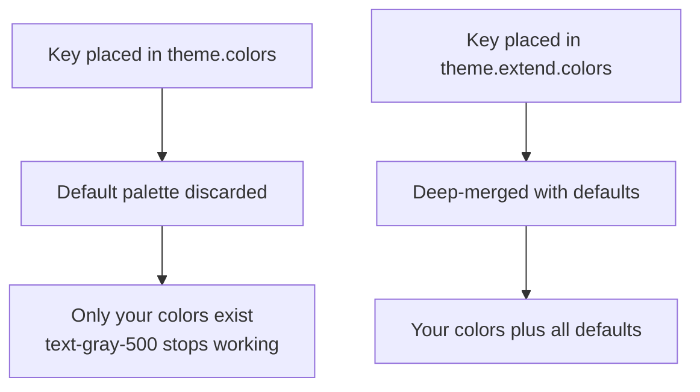
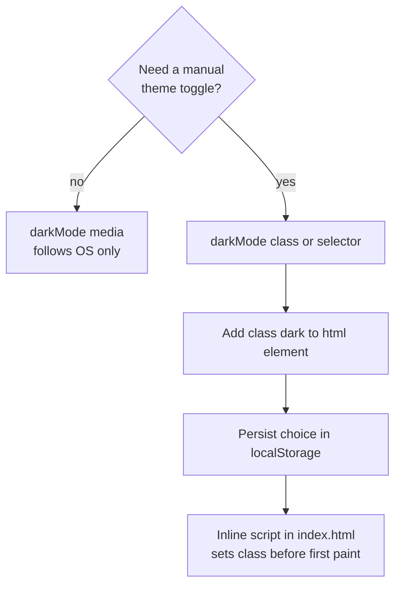

## 1. What it is

**Tailwind CSS is a utility-first CSS framework: it gives you thousands of tiny classes like `p-4`, `flex` and `text-red-600`, and a build step that ships only the ones you actually use.**

Think of it like a box of LEGO bricks versus a box of pre-built toy cars. Bootstrap hands you a finished car (`.btn-primary`, `.card`). If you want a slightly different car, you fight its design. Tailwind hands you bricks (`px-4`, `rounded-md`, `bg-blue-600`). You build exactly the car you want, and every car in your app is made from the same bricks, so they look consistent.

The problem it solves: in traditional CSS, every new component means inventing a class name, writing a new rule in a separate file, and hoping it does not clash with an old rule. Stylesheets grow forever because nobody dares delete anything. Tailwind replaces that with a fixed, design-token-based vocabulary used in the markup, so CSS size stays roughly flat as the app grows and dead styles disappear automatically when you delete the markup.

## 2. Core concepts

### [Beginner] Utility-first: one class, one job

Each Tailwind class sets one (or a few related) CSS declarations. You compose them in the `className`.

```tsx
// Each class maps to a tiny CSS rule:
// p-4        -> padding: 1rem
// rounded-lg -> border-radius: 0.5rem
// bg-white   -> background-color: #fff
// shadow     -> box-shadow: ...
// text-sm    -> font-size: 0.875rem; line-height: 1.25rem
type BalanceCardProps = { accountName: string; balanceCents: number; currency: string };

export function BalanceCard({ accountName, balanceCents, currency }: BalanceCardProps) {
  const formatted = new Intl.NumberFormat("en-US", { style: "currency", currency }).format(
    balanceCents / 100,
  );
  return (
    <div className="rounded-lg bg-white p-4 shadow">
      <p className="text-sm text-gray-500">{accountName}</p>
      <p className="text-2xl font-semibold tabular-nums">{formatted}</p>
    </div>
  );
}
```

> **Why:** With semantic CSS (`.balance-card`), the class name is a pointer to styles living somewhere else. You must open two files to understand one component, and you cannot safely delete a rule because something else might use it. With utilities, the styles live where they are used. Delete the component and its styles are gone too. Co-location is the real win, not "less typing".

The values are not arbitrary pixel numbers. `p-4` is step 4 on a spacing scale (`0.25rem * 4`). Everyone on the team picks from the same scale, which is how you get visual consistency without a design review on every PR.

### [Beginner] The design-token scale

Tailwind's default theme is a set of scales: spacing, colors (each with shades 50-950), font sizes, radii, shadows, breakpoints. Classes are generated from these scales.

```tsx
// Spacing scale: 1 = 0.25rem (4px), 2 = 0.5rem, 4 = 1rem, 8 = 2rem
// Color scale: gray-50 (lightest) ... gray-950 (darkest)
export function TransactionRow() {
  return (
    <div className="flex items-center justify-between gap-4 border-b border-gray-200 px-4 py-3">
      <span className="text-gray-900">Coffee shop</span>
      <span className="text-red-700 tabular-nums">-$4.50</span>
    </div>
  );
}
```

> **Interview tip:** Say "Tailwind is a design system API, not inline styles." Inline `style={{ padding: 13 }}` allows any value. Tailwind constrains you to the scale, supports hover/focus/media queries (which inline styles cannot), and produces cacheable, shared CSS.

### [Beginner] Responsive prefixes are mobile-first

A prefix like `md:` means "apply at this breakpoint **and up**". Unprefixed classes apply to all sizes, starting from the smallest.

```tsx
// Default screens: sm 640px, md 768px, lg 1024px, xl 1280px, 2xl 1536px
export function DashboardGrid({ children }: { children: React.ReactNode }) {
  return (
    // 1 column on phones, 2 from 768px, 4 from 1024px
    <div className="grid grid-cols-1 gap-4 md:grid-cols-2 lg:grid-cols-4">{children}</div>
  );
}
```

Under the hood `md:grid-cols-2` becomes:

```css
@media (min-width: 768px) {
  .md\:grid-cols-2 { grid-template-columns: repeat(2, minmax(0, 1fr)); }
}
```

> **Gotcha:** `sm:` does NOT mean "small screens". It means "640px and wider". To target only phones, use the unprefixed class for phones and override at `sm:`. Or use `max-sm:` (added in v3.2) to target below 640px only.



### [Beginner] State variants

Variants are prefixes that wrap a utility in a pseudo-class, media query or selector. You can stack them.

```tsx
export function PayButton({ disabled }: { disabled?: boolean }) {
  return (
    <button
      disabled={disabled}
      className={
        "rounded-md bg-emerald-600 px-4 py-2 font-medium text-white " +
        "hover:bg-emerald-700 " +                    // :hover
        "focus-visible:outline focus-visible:outline-2 focus-visible:outline-offset-2 " +
        "active:bg-emerald-800 " +                   // :active
        "disabled:cursor-not-allowed disabled:opacity-50 " + // :disabled
        "md:hover:bg-emerald-500"                    // stacked: media query + hover
      }
    >
      Pay now
    </button>
  );
}
```

Useful relationship variants:

```tsx
// group: style a child based on parent state
<a href="/accounts/123" className="group block rounded p-3 hover:bg-gray-50">
  <span className="text-gray-900 group-hover:underline">Checking ****1234</span>
</a>

// peer: style a sibling based on an earlier sibling's state
<label>
  <input type="text" required className="peer border px-2" />
  <span className="hidden text-sm text-red-600 peer-invalid:block">Amount is required</span>
</label>

// data-* and aria-* variants (v3.2+), great with Radix/Headless UI
<div data-state="open" className="hidden data-[state=open]:block" />
<button aria-expanded="true" className="aria-expanded:bg-gray-100" />
```

> **Gotcha:** `peer` only works on **later** siblings. CSS has no "previous sibling" selector (the `~` combinator only looks forward), so the `peer` element must come first in the DOM.

### [Intermediate] How JIT works: scanning content, generating CSS

Since v3.0, Tailwind uses the Just-In-Time engine always. It does not build a giant stylesheet and purge it. It reads your source files as **plain text**, extracts every string that could be a class name, and generates CSS only for those.

```js
// tailwind.config.js
/** @type {import('tailwindcss').Config} */
export default {
  // Every file that might contain class names. Tailwind reads these as TEXT.
  content: ["./index.html", "./src/**/*.{ts,tsx}"],
  theme: { extend: {} },
  plugins: [],
};
```



> **Why:** Tailwind does not parse JSX or run your code. It cannot know what `` `bg-${color}-600` `` evaluates to at runtime. It just looks for complete class-like strings. That one design decision explains the "dynamic class name" gotcha, the `safelist` option, and why huge class strings in a JSON file still get picked up.

Benefits of JIT: dev and prod CSS are identical, builds are fast, and arbitrary values (`w-[327px]`) are possible because rules are generated on demand.

### [Intermediate] The dynamic class name gotcha

```tsx
type Trend = "up" | "down" | "flat";

// BROKEN: the string "text-green-600" never appears in the source.
// Tailwind sees "text-${color}-600" and generates nothing.
function BadChange({ color }: { color: "green" | "red" }) {
  return <span className={`text-${color}-600`}>+1.2%</span>;
}

// CORRECT: map to complete, static class strings.
const trendClass: Record<Trend, string> = {
  up: "text-green-700",
  down: "text-red-700",
  flat: "text-gray-600",
};

function Change({ trend, pct }: { trend: Trend; pct: number }) {
  return <span className={`tabular-nums ${trendClass[trend]}`}>{pct.toFixed(2)}%</span>;
}
```

When class names truly come from outside your source (a CMS, a DB-driven theme), use `safelist` to force generation:

```js
// tailwind.config.js
export default {
  content: ["./src/**/*.{ts,tsx}"],
  safelist: [
    "bg-amber-100",
    // pattern: generate every combination matching the regex, plus variants
    { pattern: /^(bg|text)-(red|green|amber)-(100|700)$/, variants: ["hover", "dark"] },
  ],
};
```

> **Gotcha:** Safelist patterns can explode your CSS size. Each pattern match times each variant is a rule. Prefer a static lookup map in code; reach for `safelist` only when the strings are genuinely not in your repo.

### [Intermediate] Arbitrary values, properties and variants

When the scale does not have what you need, square brackets generate a one-off value.

```tsx
<div className="w-[327px] top-[117px] bg-[#0b3d91] grid-cols-[1fr_auto_auto]" />
// underscores become spaces: grid-template-columns: 1fr auto auto

// Use CSS variables
<div className="bg-[var(--brand-primary)]" />

// Type hint when ambiguous: is it a color or a length?
<p className="text-[length:var(--amount-size)]" />

// Arbitrary property (no utility exists)
<div className="[font-variant-numeric:tabular-nums_slashed-zero]" />

// Arbitrary variant: any selector, & is the element
<ul className="[&>li:nth-child(odd)]:bg-gray-50" />

// Important modifier: prefix with !
<p className="!text-red-700" />

// Opacity modifier on colors
<div className="bg-black/50 text-white/90" />
```

> **Interview tip:** Arbitrary values are an escape hatch. If you write the same `[#0b3d91]` three times, it belongs in `theme.extend.colors` as `brand`. Interviewers like hearing that you treat arbitrary values as a code smell when repeated.

### [Intermediate] theme vs theme.extend

This is the most common config mistake.

```js
// tailwind.config.js
export default {
  content: ["./src/**/*.{ts,tsx}"],
  theme: {
    // REPLACES the whole default screens scale. sm/md/lg/xl/2xl are gone.
    screens: { tablet: "768px", desktop: "1280px" },

    extend: {
      // ADDS to the defaults. gray, red, blue... still exist.
      colors: {
        brand: { 50: "#eef4ff", 600: "#1d4ed8", 900: "#1e3a8a" },
        gain: "#15803d",
        loss: "#b91c1c",
      },
      fontFamily: { mono: ["JetBrains Mono", "ui-monospace", "monospace"] },
    },
  },
};
```



> **Why:** `theme` is the full source of truth. `extend` is a merge layer on top of it. Overriding at the top level is intentional when you want to *restrict* the design system (for example, a bank's brand team only approves 6 colors). Extending is what you want 90% of the time.

### [Intermediate] Dark mode: 'media' vs 'class'

```js
// tailwind.config.js
export default {
  // 'media' (default): follows the OS setting via prefers-color-scheme
  // 'class': dark: variants apply when an ancestor has class="dark"
  // 'selector' (v3.4.1+): same as class, newer recommended name
  darkMode: "class",
  content: ["./src/**/*.{ts,tsx}"],
};
```

```tsx
// Components just use the dark: variant
export function Panel({ children }: { children: React.ReactNode }) {
  return (
    <section className="bg-white text-gray-900 dark:bg-gray-900 dark:text-gray-100">
      {children}
    </section>
  );
}

// A user-controlled toggle (only possible with 'class' / 'selector')
type Theme = "light" | "dark" | "system";

export function applyTheme(theme: Theme) {
  const prefersDark = window.matchMedia("(prefers-color-scheme: dark)").matches;
  const isDark = theme === "dark" || (theme === "system" && prefersDark);
  document.documentElement.classList.toggle("dark", isDark);
  localStorage.setItem("theme", theme);
}
```



> **Gotcha:** If you set the `dark` class in a React `useEffect`, the page first paints light, then flips. That is the "flash of wrong theme". Put a tiny inline `<script>` in `index.html` that reads `localStorage` and sets the class before React loads.

### [Intermediate] @layer and @apply

Your main CSS file has three directives. Each injects one layer.

```css
/* src/index.css */
@tailwind base;        /* Preflight reset + base styles */
@tailwind components;  /* component classes (yours + plugins) */
@tailwind utilities;   /* all utility classes */

@layer base {
  html { font-family: theme("fontFamily.sans"); }
  h1 { @apply text-2xl font-semibold; }
}

@layer components {
  /* A reusable class built from utilities */
  .btn-primary {
    @apply rounded-md bg-brand-600 px-4 py-2 font-medium text-white hover:bg-brand-900;
  }
  .money {
    @apply font-mono tabular-nums;
  }
}

@layer utilities {
  .scrollbar-none { scrollbar-width: none; }
}
```

> **Why layers matter:** Tailwind outputs base, then components, then utilities. Later rules win at equal specificity. So `<button class="btn-primary bg-red-600">` turns red, because utilities come after components. Also, anything inside `@layer components/utilities` is only emitted if the class is found in your content, exactly like built-in classes.

> **Gotcha:** Overusing `@apply` recreates the problem Tailwind solves: you are back to naming things and keeping styles in another file. The Tailwind team recommends extracting a **React component** (`<Button>`) instead. Use `@apply` for things you cannot componentize: third-party markup, Markdown output, or very small primitives like `.money`.

### [Advanced] Writing custom plugins

A plugin is a function that registers new utilities, components, base styles or variants into the right layer, with full access to the theme.

```js
// plugins/finance.js
import plugin from "tailwindcss/plugin";

export default plugin(
  function ({ addUtilities, addComponents, addBase, addVariant, matchUtilities, theme }) {
    // 1. Static utilities -> utilities layer
    addUtilities({
      ".num": { fontVariantNumeric: "tabular-nums", fontFeatureSettings: '"tnum"' },
      ".mask-pii": { filter: "blur(4px)", userSelect: "none" },
    });

    // 2. Components -> components layer (lower precedence than utilities)
    addComponents({
      ".card": {
        backgroundColor: theme("colors.white"),
        borderRadius: theme("borderRadius.lg"),
        padding: theme("spacing.4"),
        boxShadow: theme("boxShadow.DEFAULT"),
      },
    });

    // 3. Dynamic utilities that accept theme values AND arbitrary values
    //    Generates: indent-sm, indent-md, and indent-[37px]
    matchUtilities(
      { indent: (value) => ({ paddingInlineStart: value }) },
      { values: theme("indentWidth") },
    );

    // 4. Custom variant: masked:blur-sm when the page has data-masked
    addVariant("masked", "[data-masked] &");
  },
  {
    // Default theme values the plugin contributes (user can extend them)
    theme: { indentWidth: { sm: "1rem", md: "2rem", lg: "3rem" } },
  },
);
```

```js
// tailwind.config.js
import finance from "./plugins/finance.js";
import forms from "@tailwindcss/forms";

export default {
  content: ["./src/**/*.{ts,tsx}"],
  plugins: [forms, finance],
};
```

```tsx
<td className="num text-right">1,204.55</td>
<span className="masked:mask-pii">{ssnLast4}</span>
<div className="indent-md">Sub-account</div>
```

| API | Layer | Use for |
| --- | --- | --- |
| `addBase` | base | element defaults, CSS variables on `:root` |
| `addComponents` | components | multi-property classes like `.card` |
| `addUtilities` | utilities | fixed single-purpose classes |
| `matchUtilities` | utilities | utilities driven by a value scale + `[arbitrary]` |
| `addVariant` | n/a | new prefixes like `masked:` |

### [Advanced] Presets: sharing config across apps

A preset is a config object that other configs extend. Large orgs publish one design-system preset used by every app.

```js
// packages/tailwind-preset/index.js
/** @type {import('tailwindcss').Config} */
export default {
  theme: {
    extend: {
      colors: { brand: { 600: "#1d4ed8" }, gain: "#15803d", loss: "#b91c1c" },
    },
  },
  plugins: [],
};

// apps/portfolio/tailwind.config.js
import bankPreset from "@acme/tailwind-preset";

export default {
  presets: [bankPreset],             // merged first
  content: ["./src/**/*.{ts,tsx}"],  // content is NOT usually in the preset
  theme: { extend: {} },             // app-specific additions on top
};
```

> **Gotcha:** If your design system is a separate package with its own components, add its built files to `content` (for example `"./node_modules/@acme/ui/dist/**/*.js"`). Otherwise classes used only inside library components are never generated.

### [Advanced] Specificity, Preflight and ordering

```tsx
// Two conflicting classes: which wins?
<div className="p-2 p-6" />
// Answer: whichever rule appears LATER in the generated CSS, not in the class attribute.
// Tailwind orders rules by its own internal sort, so you cannot rely on class order.
```

Preflight (in `@tailwind base`) is a reset built on modern-normalize. It removes default margins, makes images `display: block`, sets `border-style: solid; border-width: 0` on everything, and strips heading/list styles. This is why `<h1>` looks like plain text and `<ul>` has no bullets in a Tailwind app.

```js
// Disable Preflight when embedding Tailwind into a legacy page
export default {
  corePlugins: { preflight: false },
  // Optionally scope everything to avoid collisions
  prefix: "tw-",          // classes become tw-p-4, tw-flex
  important: "#app",      // rules become #app .p-4 to beat legacy CSS
};
```

> **Interview tip:** The answer "use `tailwind-merge` to resolve conflicting classes in reusable components" shows you understand that class attribute order is irrelevant in CSS.

## 3. Why it's used in this project

- **Dense data UIs.** Dashboards and transaction tables need many small layout tweaks (alignment, truncation, sticky headers). Utilities like `sticky top-0`, `truncate`, `text-right tabular-nums` make this fast without a growing stylesheet.
- **Numbers that line up.** `tabular-nums` makes every digit the same width, so a column of balances does not jitter. This matters more in finance than almost anywhere else.
- **Consistent brand tokens.** Gains, losses, warning and brand colors live in one preset. Every app in the platform uses `text-gain` / `text-loss`, so a compliance-driven color change is a one-line edit.
- **Responsive portfolios.** Mobile-first breakpoints let the same holdings view collapse to cards on phones and expand to a table on desktop.
- **Small CSS for slow networks.** JIT ships only used classes. A typical app ends up with ~10-30 kB gzip CSS regardless of how many screens are added.
- **PII masking and states.** Custom variants (`masked:`) or data attributes (`data-[masked=true]:blur-sm`) toggle sensitive data display without JS-heavy styling logic.

> **Finance tip:** Do not rely on red/green alone to convey gain/loss. About 1 in 12 men has some color vision deficiency. Pair color with a sign (`+`/`-`), an arrow icon or text, and check contrast (`text-green-700` on white passes WCAG AA; `text-green-400` does not).

```tsx
type Holding = { symbol: string; valueCents: number; changePct: number };

export function HoldingRow({ h }: { h: Holding }) {
  const up = h.changePct >= 0;
  return (
    <tr className="border-b border-gray-100 last:border-0 hover:bg-gray-50 dark:hover:bg-gray-800">
      <td className="px-3 py-2 font-medium">{h.symbol}</td>
      <td className="px-3 py-2 text-right tabular-nums">{(h.valueCents / 100).toFixed(2)}</td>
      <td className={`px-3 py-2 text-right tabular-nums ${up ? "text-green-700" : "text-red-700"}`}>
        {up ? "+" : ""}
        {h.changePct.toFixed(2)}%
      </td>
    </tr>
  );
}
```

## 4. Setup & configuration

### [Beginner] Install with Vite + React + TypeScript

```bash
npm install -D tailwindcss@3 postcss autoprefixer
npx tailwindcss init -p   # creates tailwind.config.js and postcss.config.js
```

```js
// postcss.config.js
export default {
  plugins: {
    tailwindcss: {},   // runs the JIT engine
    autoprefixer: {},  // adds -webkit- etc. prefixes based on browserslist
  },
};
```

```css
/* src/index.css, imported once in main.tsx */
@tailwind base;
@tailwind components;
@tailwind utilities;
```

### [Intermediate] A fully commented config

```ts
// tailwind.config.ts (TS config is supported in v3.3+)
import type { Config } from "tailwindcss";
import forms from "@tailwindcss/forms";
import typography from "@tailwindcss/typography";
import bankPreset from "@acme/tailwind-preset";

export default {
  // Files scanned as plain text for class names. Missing a path = missing styles.
  content: ["./index.html", "./src/**/*.{ts,tsx}", "./node_modules/@acme/ui/dist/**/*.js"],

  // Base configs merged before this one (shared design system)
  presets: [bankPreset],

  // 'media' = OS preference, 'class' / 'selector' = toggled by a .dark ancestor
  darkMode: "class",

  // Force-generate classes that never appear literally in source
  safelist: ["bg-amber-100", { pattern: /^text-(gain|loss)$/ }],

  theme: {
    // Top-level keys REPLACE defaults. Here we keep default screens but add one.
    extend: {
      screens: { "3xl": "1920px" },              // adds 3xl: prefix
      colors: {
        gain: "#15803d",
        loss: "#b91c1c",
        brand: { DEFAULT: "#1d4ed8", dark: "#1e3a8a" }, // bg-brand, bg-brand-dark
      },
      fontFamily: { sans: ["Inter", "system-ui", "sans-serif"] },
      spacing: { 18: "4.5rem" },                 // p-18, mt-18, w-18
      zIndex: { modal: "1000" },                 // z-modal
    },
  },

  // Official or custom plugins
  plugins: [forms, typography],

  // Optional: prefix all classes (avoid clashes with legacy CSS)
  // prefix: "tw-",

  // Optional: boost specificity by scoping to a selector
  // important: "#root",

  // Optional: turn off parts of the framework
  // corePlugins: { preflight: true },
} satisfies Config;
```

### [Intermediate] Editor and lint tooling

```bash
npm install -D prettier prettier-plugin-tailwindcss
```

```json
// .prettierrc
{ "plugins": ["prettier-plugin-tailwindcss"] }
```

The Prettier plugin sorts classes into Tailwind's recommended order, which kills bikeshedding in code review. The official "Tailwind CSS IntelliSense" VS Code extension gives autocomplete, hover previews of the generated CSS, and warnings for conflicting classes.

```json
// .vscode/settings.json: teach IntelliSense about cn()/clsx() calls
{
  "tailwindCSS.experimental.classRegex": [["cn\\(([^)]*)\\)", "[\"'`]([^\"'`]*)[\"'`]"]]
}
```

## 5. Key features we use

### [Beginner] Layout primitives

```tsx
// Sticky header + scrollable body for a long transaction list
export function TransactionTable({ rows }: { rows: { id: string; desc: string; amount: string }[] }) {
  return (
    <div className="max-h-[480px] overflow-auto rounded-lg border">
      <table className="w-full text-sm">
        <thead className="sticky top-0 bg-gray-50 text-left text-xs uppercase text-gray-500">
          <tr>
            <th className="px-3 py-2">Description</th>
            <th className="px-3 py-2 text-right">Amount</th>
          </tr>
        </thead>
        <tbody>
          {rows.map((r) => (
            <tr key={r.id} className="odd:bg-white even:bg-gray-50">
              <td className="max-w-xs truncate px-3 py-2">{r.desc}</td>
              <td className="px-3 py-2 text-right tabular-nums">{r.amount}</td>
            </tr>
          ))}
        </tbody>
      </table>
    </div>
  );
}
```

### [Beginner] Form states with @tailwindcss/forms

```tsx
export function AmountInput({ error }: { error?: string }) {
  return (
    <label className="block">
      <span className="text-sm font-medium text-gray-700">Amount</span>
      <input
        inputMode="decimal"
        aria-invalid={!!error}
        className={
          "mt-1 block w-full rounded-md border-gray-300 text-right tabular-nums shadow-sm " +
          "focus:border-brand focus:ring-brand " +
          "aria-[invalid=true]:border-red-600 aria-[invalid=true]:ring-red-600"
        }
      />
      {error && <span className="mt-1 block text-sm text-red-700">{error}</span>}
    </label>
  );
}
```

### [Intermediate] Variant lookup maps for component APIs

```tsx
type BadgeStatus = "pending" | "posted" | "failed";

const badgeStyles: Record<BadgeStatus, string> = {
  pending: "bg-amber-100 text-amber-800",
  posted: "bg-green-100 text-green-800",
  failed: "bg-red-100 text-red-800",
};

export function StatusBadge({ status }: { status: BadgeStatus }) {
  return (
    <span className={`inline-flex rounded-full px-2 py-0.5 text-xs font-medium ${badgeStyles[status]}`}>
      {status}
    </span>
  );
}
```

### [Intermediate] Modern v3.x variants worth knowing

```tsx
// has-*: style parent if it contains a checked input (v3.4)
<label className="rounded border p-3 has-[:checked]:border-brand has-[:checked]:bg-brand/5">
  <input type="radio" name="account" /> Savings
</label>

// *: style all direct children (v3.4)
<ul className="*:py-2 *:border-b">...</ul>

// size-*: width and height together (v3.4)


// Named groups when groups are nested (v3.2)
<div className="group/row">
  <div className="group/cell">
    <span className="group-hover/row:underline" />
  </div>
</div>

// print: variant for statement printouts
<nav className="print:hidden" />

// motion-reduce: respect accessibility settings
<div className="animate-pulse motion-reduce:animate-none" />
```

### [Advanced] Theme values in custom CSS

```css
.chart-tooltip {
  background: theme("colors.gray.900");
  padding: theme("spacing.2");
}

@media screen(md) {         /* expands to the md breakpoint value */
  .chart-tooltip { padding: theme("spacing.3"); }
}
```

## 6. Interview questions

#### Q: What does "utility-first" mean, and why would a team choose it over BEM or CSS-in-JS?

Utility-first means you style by composing small single-purpose classes from a fixed design scale directly in markup, instead of writing custom named classes in separate stylesheets.

Reasons teams choose it:
- **Co-location.** Styles live with the markup. Deleting a component deletes its styles. No orphaned CSS.
- **Constrained design.** Values come from a shared scale, so spacing and colors stay consistent.
- **CSS size stays flat.** The same `p-4` rule is shared by every component. New features mostly reuse existing classes.
- **No naming.** No time spent inventing `.account-summary__header--active`.
- **No runtime cost** compared to runtime CSS-in-JS (styled-components, Emotion), which generate styles in the browser and complicate React Server Components and streaming SSR.

Tradeoffs: long class strings, a learning curve for the vocabulary, and the need for components (not CSS classes) as the unit of reuse.

#### Q: How does Tailwind's JIT engine decide which CSS to generate?

It reads every file matched by `content` as plain text, uses regexes to extract anything that looks like a class token, and generates CSS only for tokens that match a known utility, variant or arbitrary-value pattern. It does not execute or parse your JavaScript. In dev it watches files and regenerates incrementally.

Consequence: class names must appear as complete strings in source. `` `text-${color}-600` `` produces nothing. Fix it with a lookup object of full class strings, or `safelist` for values that come from outside the repo.

#### Q: What is the difference between `theme` and `theme.extend` in tailwind.config.js?

Keys under `theme` replace the default scale entirely. Keys under `theme.extend` are deep-merged with the defaults. Putting `colors` directly in `theme` removes all default colors, so `text-gray-500` stops working. Use top-level `theme` only when you deliberately want to restrict the design system; use `extend` to add brand tokens.

#### Q: How do you resolve a style conflict when a reusable component accepts a `className` prop?

```tsx
<Button className="bg-red-600" /> // Button already has bg-blue-600
```

Both classes end up on the element. Which wins depends on their order in the **generated stylesheet**, not in the attribute, and both have the same specificity. So the result is unpredictable from the call site. Solutions:
- Use `tailwind-merge` (usually via a `cn()` helper with `clsx`) to remove the earlier conflicting class.
- Design the component API with variant props (`variant="danger"`) instead of open-ended overrides.
- As a last resort, the `!` important modifier (`!bg-red-600`).

#### Q: How would you implement a dark mode toggle with a "system" option?

Set `darkMode: "class"` (or `"selector"` in 3.4.1+). Use `dark:` variants in components. Store the user's choice (`light` / `dark` / `system`) in `localStorage`. On load, an inline script in `index.html` runs before paint: if the choice is `dark`, or `system` and `matchMedia("(prefers-color-scheme: dark)")` matches, add `dark` to `<html>`. Listen to the media query's `change` event to react to OS changes when in `system` mode. With `darkMode: "media"` you cannot offer a manual toggle at all, because it is purely `prefers-color-scheme`.

## 7. Drawbacks & pain points

- **Long, noisy class strings.** Big components become hard to scan. Mitigate with Prettier sorting, lookup maps, and splitting components.
- **Learning the vocabulary.** New devs must learn `justify-between`, `items-center`, `inset-0`. IntelliSense is close to mandatory.
- **Conflicting classes** need `tailwind-merge` for overridable components.
- **Dynamic classes silently fail.** No error, the style is just missing.
- **Preflight surprises.** Headings, lists and buttons lose browser defaults, which breaks third-party HTML or CMS content (use `@tailwindcss/typography`'s `prose` class).
- **`@apply` abuse** reintroduces the problems of traditional CSS.
- **Version churn.** v4 changed config format, some class names and the build pipeline.

Gotchas that trip devs up:

```tsx
// 1. Dynamic classes
<div className={`w-${size}`} />                 // never generated

// 2. Content glob misses a folder
// content: ["./src/**/*.tsx"]  -> classes in ./src/lib/styles.ts are missing

// 3. Expecting class order to win
<div className="text-lg text-sm" />              // text-sm? text-lg? depends on CSS order

// 4. Overriding instead of extending
// theme: { colors: { brand: "#1d4ed8" } }      -> every default color vanishes

// 5. peer after the target
<span className="peer-invalid:block" /><input className="peer" /> // never works

// 6. Concatenating across lines with template literals that drop spaces
const cls = "px-4" + "py-2";                     // "px-4py-2": neither class applies
```

## 8. Better alternatives

Tailwind itself is still the industry default for utility CSS. The main shift is **Tailwind v4** (released January 2025, now 4.1+):

- **CSS-first config.** No `tailwind.config.js` required. You write `@import "tailwindcss";` and define tokens in a `@theme { --color-brand: #1d4ed8; }` block. Every token becomes a real CSS variable.
- **Oxide engine.** A rewritten core (parts in Rust) with Lightning CSS integrated. Full builds are several times faster and incremental builds are very fast.
- **Automatic content detection.** No `content` array; it scans the project, ignoring `.gitignore`d files. Add extra paths with `@source`.
- **First-party Vite plugin** `@tailwindcss/vite` instead of PostCSS config.
- **Modern CSS:** cascade layers (`@layer`), `@property`, `color-mix()`, OKLCH colors, container queries built in.
- **Dark mode / variants** configured with `@custom-variant dark (&:where(.dark, .dark *));` and plugins/utilities with `@plugin` and `@utility`.
- **Migration:** `npx @tailwindcss/upgrade` handles most of it. Some renames (`shadow-sm` became `shadow-xs`, `rounded` scale shifted, `ring` default width changed). `@config "./tailwind.config.js";` lets you load a legacy JS config. v4 targets modern browsers only (Safari 16.4+, Chrome 111+), which can block it for enterprise users on old browsers.

```css
/* Tailwind v4 equivalent of a v3 config */
@import "tailwindcss";

@custom-variant dark (&:where(.dark, .dark *));

@theme {
  --color-gain: #15803d;
  --color-loss: #b91c1c;
  --font-sans: "Inter", system-ui, sans-serif;
}

@utility num {
  font-variant-numeric: tabular-nums;
}
```

> **Outdated:** If you are starting a new app in late 2026, start on v4. v3 is still widely deployed and maintained for security, but new plugins and docs target v4.

| Option | CSS shipped (~gzip) | Boilerplate | Devtools | Learning curve | TS support | Popularity | When it wins |
| --- | --- | --- | --- | --- | --- | --- | --- |
| Tailwind v3 | ~10-30 kB | Config file + PostCSS | IntelliSense, Prettier plugin | Medium | Config types | Very high | Existing apps, older browser support |
| Tailwind v4 | ~10-30 kB | Minimal, CSS-only | Same, better perf | Medium | Good | Very high, growing | New apps, modern browsers |
| CSS Modules + SCSS | Grows with app | Separate file per component | Native browser devtools | Low | Typed via plugins | High | Teams who prefer real CSS |
| Vanilla Extract / Panda CSS | Small, zero-runtime | Medium | Good | Medium | Excellent, type-safe tokens | Medium | Type-safe design systems |
| styled-components / Emotion | ~12-16 kB runtime JS + CSS | Medium | Good | Low-medium | Good | Declining | Legacy apps; poor fit for RSC |
| UnoCSS | ~similar to Tailwind | Low | Inspector | Medium | Good | Niche | Max flexibility, presets |

## 9. When NOT to use it

- Content-heavy pages with arbitrary HTML from a CMS where you cannot add classes (use `prose` or plain CSS).
- Teams strongly invested in a semantic CSS methodology or an existing design system built on SCSS/CSS Modules, where migration cost outweighs benefits.
- Highly dynamic, data-driven styling (user-chosen colors, computed chart positions): use CSS variables or inline styles for those values.
- Embedding widgets into third-party pages where Preflight and global class names could collide with the host page (unless you use `prefix` and disable Preflight).
- Tiny static pages where a 20-line stylesheet is simpler than a build step.
- If you must support very old browsers, avoid v4 specifically.

## Cheatsheet

| Need | Class / API |
| --- | --- |
| Padding / margin | `p-4`, `px-3`, `py-2`, `mt-6`, `-mt-2`, `space-y-2`, `gap-4` |
| Flex layout | `flex items-center justify-between gap-2` |
| Grid | `grid grid-cols-1 md:grid-cols-3` |
| Text | `text-sm font-medium text-gray-700 truncate tabular-nums` |
| Colors / opacity | `bg-brand text-white bg-black/50` |
| Border / radius | `border border-gray-200 rounded-lg` |
| Responsive | `sm: md: lg: xl: 2xl: max-md:` (min-width, mobile-first) |
| States | `hover: focus-visible: active: disabled: aria-[x]: data-[x]:` |
| Relationships | `group group-hover:` `peer peer-invalid:` `has-[:checked]:` |
| Dark mode | `dark:bg-gray-900` with `darkMode: "class"` |
| Arbitrary | `w-[327px]` `bg-[var(--x)]` `[&>li]:py-2` `[mask-type:alpha]` |
| Important | `!text-red-700` |

```js
// tailwind.config.js essentials (v3)
import plugin from "tailwindcss/plugin";

export default {
  content: ["./index.html", "./src/**/*.{ts,tsx}"],
  darkMode: "class",
  safelist: [{ pattern: /^bg-(red|green)-100$/ }],
  presets: [],
  theme: { extend: { colors: { gain: "#15803d" } } },
  plugins: [
    plugin(({ addUtilities, addComponents, matchUtilities, addVariant, theme }) => {
      addUtilities({ ".num": { fontVariantNumeric: "tabular-nums" } });
      matchUtilities({ indent: (v) => ({ paddingInlineStart: v }) }, { values: theme("spacing") });
      addVariant("masked", "[data-masked] &");
    }),
  ],
};
```

```css
@tailwind base; @tailwind components; @tailwind utilities;
@layer components { .btn { @apply rounded-md px-4 py-2; } }
```
