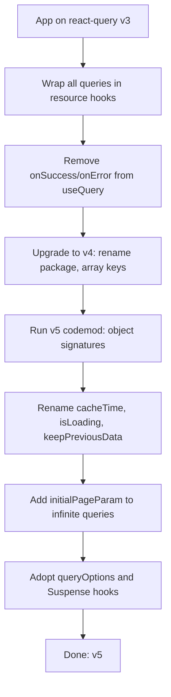
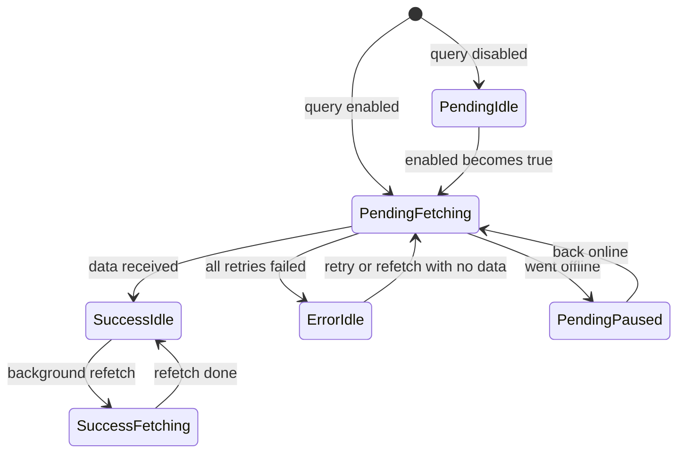
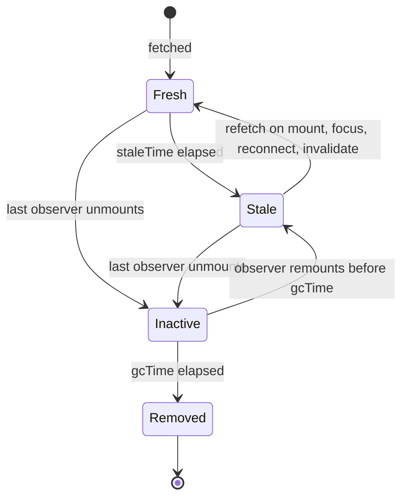
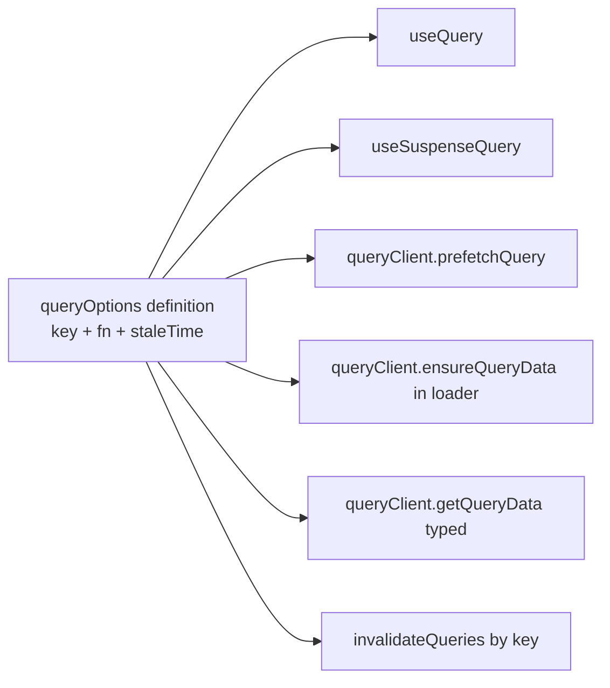
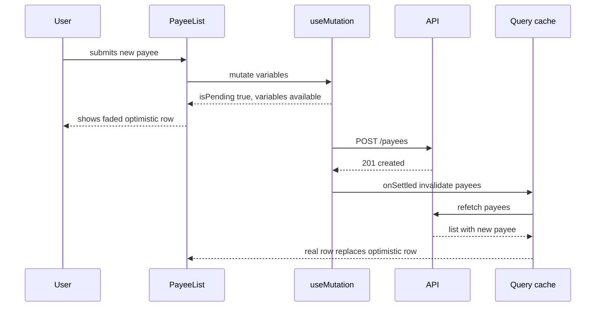
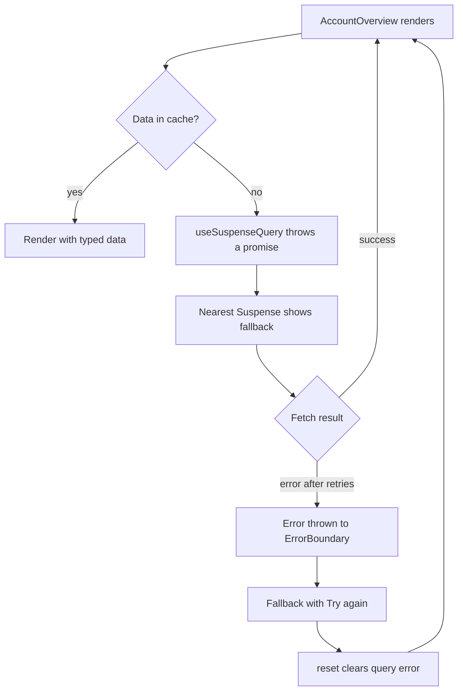

## 1. What it is

**TanStack Query v5 is the modern successor to React Query: a server-state cache that fetches, caches, deduplicates, refetches and invalidates API data, now with a single object-based API and stronger types.**

If React Query v3 was a smart receptionist in front of your API, v5 is the same receptionist after a training course. The job is identical: keep a filing cabinet of server data, hand out cached copies, quietly refresh stale ones. What changed is the paperwork. Every request now uses one standard form (an options object), some fields were renamed so their meaning is clearer (`cacheTime` became `gcTime`, `isLoading` became `isPending`), and a few risky habits were banned (per-component `onSuccess` callbacks on queries).

The problem it solves is the same as v3: server data is a remote, shared, stale-able snapshot that needs caching and re-syncing. The problem v5 *additionally* solves is API drift: v3 had several overloaded call signatures, confusing loading flags and weak type inference. v5 makes the API predictable, adds Suspense hooks that return guaranteed data, and gives you `queryOptions` to share fully typed query definitions between hooks, prefetching and cache reads.

> **Why learn the migration:** Many financial apps still run v3 or v4. Interviewers often ask "what changed and why". Knowing the *reason* behind each rename shows you understand the library, not just the syntax.

## 2. Core concepts

### [Beginner] Same mental model, new package

The concepts carry over unchanged: query keys are cache addresses, `staleTime` controls refetching, inactive data is garbage collected, mutations invalidate queries. The package name changed in v4 and stayed in v5.

```tsx
// v3
import { QueryClient, QueryClientProvider, useQuery } from 'react-query';

// v5
import { QueryClient, QueryClientProvider, useQuery } from '@tanstack/react-query';
import { ReactQueryDevtools } from '@tanstack/react-query-devtools'; // separate package now
```

```tsx
const queryClient = new QueryClient();

export function AppProviders({ children }: { children: React.ReactNode }) {
  return (
    <QueryClientProvider client={queryClient}>
      {children}
      <ReactQueryDevtools initialIsOpen={false} />
    </QueryClientProvider>
  );
}
```

> **Why the rename:** TanStack Query now ships adapters for React, Vue, Solid, Svelte and Angular from one core (`@tanstack/query-core`). The `@tanstack/*` scope makes that family explicit.

### [Beginner] Object-only signature and array keys

v3 accepted `useQuery(key, fn, options)`, `useQuery(key, options)` and `useQuery(options)`. v5 accepts only one object. Query keys must be arrays.

```tsx
// v3 (any of these worked)
useQuery('accounts', fetchAccounts, { staleTime: 10_000 });
useQuery(['account', id], () => fetchAccount(id));

// v5 (only this)
useQuery({
  queryKey: ['accounts'],
  queryFn: fetchAccounts,
  staleTime: 10_000,
});

useQuery({
  queryKey: ['accounts', accountId],
  queryFn: () => fetchAccount(accountId),
});
```

The same change applies to every `QueryClient` method:

```ts
// v3
queryClient.invalidateQueries('accounts');
queryClient.prefetchQuery(['accounts', id], () => fetchAccount(id));

// v5
queryClient.invalidateQueries({ queryKey: ['accounts'] });
queryClient.prefetchQuery({ queryKey: ['accounts', id], queryFn: () => fetchAccount(id) });
```

> **Why:** Overloads made TypeScript inference fragile and made code reviews harder ("is the second argument a function or options?"). One shape means one set of types, better autocomplete, and simpler internals.

### [Beginner] The migration table

| Area | v3 | v5 | Why it changed |
|---|---|---|---|
| Package | `react-query` | `@tanstack/react-query` | Multi-framework family (renamed in v4) |
| Devtools | `react-query/devtools` | `@tanstack/react-query-devtools` | Separate package, smaller core |
| Signature | Positional overloads | Single object only | Predictable types, one API shape |
| Query keys | String or array | Array only (v4) | Consistent hashing and matching |
| GC timer | `cacheTime` | `gcTime` | "cache time" was misread as "how long data is fresh" |
| First load flag | `isLoading`, `status: 'loading'` | `isPending`, `status: 'pending'` | "Pending" means "no data yet", independent of fetching |
| Disabled state | `isIdle`, `status: 'idle'` | Removed. `fetchStatus: 'idle'` (v4) | Data state and fetch state are separate axes |
| "Loading" now means | First load | `isPending && isFetching` | Covers disabled queries correctly |
| Pagination | `keepPreviousData: true`, `isPreviousData` | `placeholderData: keepPreviousData`, `isPlaceholderData` | One mechanism instead of two |
| Query callbacks | `onSuccess`, `onError`, `onSettled` on `useQuery` | Removed from `useQuery` (still on `useMutation` and `QueryCache`) | Fired once per component, caused bugs |
| Error boundaries | `useErrorBoundary` | `throwOnError` | Clearer name |
| Suspense | `suspense: true` option (experimental) | `useSuspenseQuery`, `useSuspenseQueries`, `useSuspenseInfiniteQuery` | Data is typed as always defined |
| Shared definitions | Manual key factories | `queryOptions()` / `infiniteQueryOptions()` | Type-safe reuse across hooks and client methods |
| Infinite queries | `pageParam = default` in fn | `initialPageParam` required, `maxPages` added | Explicit, typed first page, bounded memory |
| Parallel queries | `useQueries([...])` | `useQueries({ queries, combine })` | Room for `combine` |
| Mutation loading | `mutation.isLoading` | `mutation.isPending` | Same rename as queries |
| SSR hydration | `<Hydrate>` | `<HydrationBoundary>` | Clearer name |
| `refetchInterval` fn | `(data) => ms` | `(query) => ms` | Access to full query state |
| Minimum React | 16.8 | 18 | Uses `useSyncExternalStore` |



> **Interview tip:** Say "I'd migrate in two hops, v3 to v4 then v4 to v5, and remove query callbacks first because codemods can't rewrite side effects." That shows you have done or planned real migrations.

### [Beginner] Status: pending vs loading vs fetching

v5 separates two independent questions:

- **`status`** answers "do I have data?": `'pending'` (no data yet), `'error'`, `'success'`.
- **`fetchStatus`** answers "is the queryFn running?": `'fetching'`, `'paused'` (wanted to fetch but offline), `'idle'`.

```tsx
const {
  data,
  error,
  status,       // 'pending' | 'error' | 'success'
  fetchStatus,  // 'fetching' | 'paused' | 'idle'
  isPending,    // status === 'pending'  -> no data yet
  isFetching,   // fetchStatus === 'fetching' -> any request in flight
  isLoading,    // isPending && isFetching -> first load actually running
  isError,
  isSuccess,
  isPlaceholderData,
  refetch,
} = useQuery({ queryKey: ['accounts', accountId], queryFn: () => fetchAccount(accountId) });
```



> **Why the split:** In v3, a disabled dependent query was `idle` and a first load was `loading`. In v4, the team realized "has data" and "is fetching" are two axes. A disabled query has no data (`pending`) but is not fetching (`idle`). That is why v5 `isLoading` is defined as `isPending && isFetching`: it is only true when a first load is truly in progress.

```tsx
function AccountHeader({ accountId }: { accountId?: string }) {
  const query = useQuery({
    queryKey: ['accounts', accountId],
    queryFn: () => fetchAccount(accountId!),
    enabled: !!accountId,
  });

  if (!accountId) return <p>Select an account</p>;    // disabled: isPending true, isLoading false
  if (query.isPending) return <HeaderSkeleton />;     // no data yet
  if (query.isError) return <ErrorBanner error={query.error} />;

  return (
    <header>
      <h2>{query.data.nickname}</h2>  {/* data is narrowed to Account here */}
      {query.isFetching && <RefreshIcon spinning />}
    </header>
  );
}
```

> **Gotcha:** Checking `isLoading` for a skeleton in v5 means a disabled query falls through to rendering `data.nickname` and crashes on `undefined`. Use `isPending` as the "no data" guard. TypeScript narrows `data` after `isPending` and `isError` checks.

### [Intermediate] gcTime and the cache lifecycle

`cacheTime` was renamed to `gcTime` (garbage collection time). The behavior is identical: how long an inactive query (no mounted observers) stays in memory. Default is five minutes. `staleTime` still defaults to `0`.

```ts
useQuery({
  queryKey: ['reference', 'currencies'],
  queryFn: fetchCurrencies,
  staleTime: Infinity,      // never goes stale: reference data
  gcTime: 60 * 60_000,      // keep 1 hour after last use
});
```



> **Why the rename:** Many developers read `cacheTime` as "how long data is cached and fresh", and set it instead of `staleTime`. `gcTime` says what it does: it is a garbage collection timer, nothing else.

### [Intermediate] queryOptions: one typed definition, used everywhere

`queryOptions` is an identity helper. At runtime it returns what you pass in. At type level it tags the `queryKey` with the data type, so every API that receives that key knows the shape of the data.

```ts
// src/features/accounts/queries.ts
import { queryOptions } from '@tanstack/react-query';

export const accountQueries = {
  all: () =>
    queryOptions({
      queryKey: ['accounts'] as const,
      queryFn: fetchAccounts,           // () => Promise<AccountSummary[]>
      staleTime: 15_000,
    }),
  detail: (accountId: string) =>
    queryOptions({
      queryKey: ['accounts', accountId] as const,
      queryFn: () => fetchAccount(accountId), // () => Promise<Account>
      staleTime: 10_000,
    }),
};
```

```tsx
// In a component
const { data } = useQuery(accountQueries.detail(accountId));   // data: Account | undefined

// Suspense hook, same definition
const { data: account } = useSuspenseQuery(accountQueries.detail(accountId)); // Account

// Prefetch in a router loader, same definition
await queryClient.ensureQueryData(accountQueries.detail(accountId));

// Cache read is typed without generics
const cached = queryClient.getQueryData(accountQueries.detail(accountId).queryKey); // Account | undefined

// Override per call by spreading
useQuery({ ...accountQueries.detail(accountId), refetchInterval: 30_000 });
```



> **Why:** In v3, key factories gave you consistent keys but not types: `getQueryData<Account>(key)` relied on you passing the right generic. A typo meant a silent `any`-shaped bug. `queryOptions` ties key, fetcher and type together so they cannot drift.

> **Interview tip:** "We define queries once with `queryOptions` and use them in hooks, loaders and cache reads" is a strong v5 answer. It also shows you know the "query factory" pattern recommended by the maintainers.

### [Intermediate] Why onSuccess/onError/onSettled were removed from useQuery

In v3 you could write `useQuery(key, fn, { onSuccess })`. The callback ran **once per component that used the query**, and it did **not** run when data came from cache. Both facts caused bugs.

```tsx
// v3 anti-pattern: syncing query data into local state
const [draftLimit, setDraftLimit] = useState<number>();
useQuery(['card-limit', cardId], fetchCardLimit, {
  onSuccess: (limit) => setDraftLimit(limit.amountCents), // skipped on cache hit, fires per observer
});
```

The v5 replacements:

```tsx
// 1. Global side effects (logging, toasts, auth redirects): QueryCache callbacks
const queryClient = new QueryClient({
  queryCache: new QueryCache({
    onError: (error, query) => {
      if (query.meta?.errorMessage) toast.error(String(query.meta.errorMessage));
    },
  }),
});

useQuery({
  queryKey: ['statements', accountId],
  queryFn: () => fetchStatements(accountId),
  meta: { errorMessage: 'Could not load statements' }, // attach per-query info for the global handler
});

// 2. Derived values: compute during render, no state
const { data } = useQuery(cardQueries.limit(cardId));
const limitDisplay = data ? formatMoney(data.amountCents, data.currency) : '';

// 3. Form defaults from server data: pass data into the form and key it
function EditLimitPage({ cardId }: { cardId: string }) {
  const { data } = useSuspenseQuery(cardQueries.limit(cardId));
  return <EditLimitForm key={data.updatedAt} defaultValues={data} />;
}
```

> **Why:** A query is shared state. Side effects tied to individual components cannot be reliably triggered by shared state. Global effects belong on the cache. Per-component behavior should be derived from `data`/`error` during render. Mutations keep their callbacks because a mutation is triggered by a specific user action in a specific place.

### [Intermediate] placeholderData with keepPreviousData

`keepPreviousData: true` was replaced by the more general `placeholderData` option, with a helper function to get the old behavior.

```tsx
import { useQuery, keepPreviousData } from '@tanstack/react-query';

function TransactionsTable({ accountId }: { accountId: string }) {
  const [page, setPage] = useState(0);

  const { data, isPending, isPlaceholderData, isFetching } = useQuery({
    queryKey: ['accounts', accountId, 'transactions', { page }],
    queryFn: () => fetchTransactionsPage(accountId, page),
    placeholderData: keepPreviousData, // show last page's rows while the next page loads
  });

  if (isPending) return <TableSkeleton />;

  return (
    <>
      <Table rows={data.items} aria-busy={isFetching} className={isPlaceholderData ? 'dimmed' : ''} />
      <button onClick={() => setPage((p) => p + 1)} disabled={isPlaceholderData || !data.hasMore}>
        Next
      </button>
    </>
  );
}
```

`placeholderData` can also be a function `(previousData, previousQuery) => ...` or a static value. Placeholder data is **never written to the cache**, unlike `initialData`.

| Option | Written to cache? | Counts for staleTime? | Typical use |
|---|---|---|---|
| `initialData` | Yes | Yes (use `initialDataUpdatedAt`) | Seed detail from a list you trust |
| `placeholderData` | No | No, real fetch always runs | Previous page, skeleton-shaped fake data |

### [Intermediate] Mutations in v5

Mutations use an object signature and `isPending`. Callbacks remain available both on `useMutation` and on each `mutate()` call.

```tsx
export function useCreateTransfer() {
  const queryClient = useQueryClient();

  return useMutation({
    mutationKey: ['transfers', 'create'],          // lets useMutationState find it
    mutationFn: (input: TransferInput) => api.post<TransferReceipt>('/transfers', input).then((r) => r.data),
    onSuccess: async (_receipt, input) => {
      // Returning the promise keeps isPending true until data is refreshed
      await Promise.all([
        queryClient.invalidateQueries({ queryKey: ['accounts', input.fromAccountId] }),
        queryClient.invalidateQueries({ queryKey: ['accounts', input.toAccountId] }),
      ]);
    },
  });
}

function TransferButton({ input }: { input: TransferInput }) {
  const transfer = useCreateTransfer();
  return (
    <button
      disabled={transfer.isPending}
      onClick={() =>
        transfer.mutate(input, {
          onSuccess: (receipt) => navigate(`/transfers/${receipt.id}`), // component-specific
        })
      }
    >
      {transfer.isPending ? 'Sending...' : 'Send'}
    </button>
  );
}
```

> **Gotcha:** Callbacks passed to `mutate()` do not run if the component unmounts before the mutation finishes. Put cache invalidation in `useMutation` options (always runs), and navigation/toasts in `mutate()` options (only relevant if still on screen).

### [Intermediate] Optimistic updates via variables

v5 adds a simpler optimistic pattern: render the pending mutation's `variables` directly in the UI, without touching the cache. There is nothing to roll back, because the cache was never changed.

```tsx
function PayeeList() {
  const { data: payees } = useSuspenseQuery(payeeQueries.all());
  const addPayee = useMutation({
    mutationFn: (input: NewPayee) => api.post<Payee>('/payees', input).then((r) => r.data),
    onSettled: () => queryClient.invalidateQueries({ queryKey: ['payees'] }),
  });

  return (
    <ul>
      {payees.map((p) => (
        <li key={p.id}>{p.nickname}</li>
      ))}
      {/* Optimistic row: exists only while the mutation is pending */}
      {addPayee.isPending && (
        <li style={{ opacity: 0.5 }}>{addPayee.variables.nickname} (saving)</li>
      )}
      {addPayee.isError && (
        <li className="error">
          {addPayee.variables?.nickname} failed.{' '}
          <button onClick={() => addPayee.mutate(addPayee.variables!)}>Retry</button>
        </li>
      )}
    </ul>
  );
}
```



| Approach | Touches cache? | Rollback needed? | Best for |
|---|---|---|---|
| Via `variables` (v5) | No | No | One place in the UI shows the pending item |
| Via cache (`onMutate` + `setQueryData`) | Yes | Yes, in `onError` | Many components must reflect the change at once |

The cache-based pattern from v3 still works in v5, just with object arguments:

```ts
useMutation({
  mutationFn: toggleFavorite,
  onMutate: async (payee: Payee) => {
    await queryClient.cancelQueries({ queryKey: ['payees'] });
    const previous = queryClient.getQueryData<Payee[]>(['payees']);
    queryClient.setQueryData<Payee[]>(['payees'], (old = []) =>
      old.map((p) => (p.id === payee.id ? { ...p, isFavorite: !p.isFavorite } : p))
    );
    return { previous };
  },
  onError: (_e, _payee, context) => queryClient.setQueryData(['payees'], context?.previous),
  onSettled: () => queryClient.invalidateQueries({ queryKey: ['payees'] }),
});
```

> **Finance tip:** The variables approach is ideal for "pending" rows: a scheduled payment shown as "Submitting..." in a faded style. It never lies about server state, because the real list is unchanged until the server confirms.

### [Intermediate] useMutationState: see mutations from anywhere

`useMutationState` reads mutations from the `MutationCache`, even ones started by a different component. Use `mutationKey` to filter.

```tsx
import { useMutationState } from '@tanstack/react-query';

// A header badge that counts transfers in flight, started anywhere in the app
function PendingTransfersBadge() {
  const pendingTransfers = useMutationState({
    filters: { mutationKey: ['transfers', 'create'], status: 'pending' },
    select: (mutation) => mutation.state.variables as TransferInput,
  });

  if (pendingTransfers.length === 0) return null;
  const totalCents = pendingTransfers.reduce((sum, t) => sum + t.amountCents, 0);
  return <Badge>{pendingTransfers.length} pending ({formatMoney(totalCents, 'USD')})</Badge>;
}
```

> **Why:** Before v5, sharing "a transfer is in progress" across distant components meant lifting state, context or Redux. The mutation cache already knows. `useMutationState` exposes it.

### [Advanced] useQueries with combine

`useQueries` runs a dynamic number of queries in parallel. `combine` merges results into one value and re-renders only when that combined value changes.

```tsx
function NetWorth({ accountIds }: { accountIds: string[] }) {
  const { totalCents, isPending, failed } = useQueries({
    queries: accountIds.map((id) => accountQueries.detail(id)),
    combine: (results) => ({
      totalCents: results.reduce((sum, r) => sum + (r.data?.balanceCents ?? 0), 0),
      isPending: results.some((r) => r.isPending),
      failed: results.filter((r) => r.isError).length,
    }),
  });

  if (isPending) return <Skeleton />;
  return (
    <div>
      <Money amountCents={totalCents} currency="USD" />
      {failed > 0 && <Warning>{failed} account(s) could not be loaded. Total is incomplete.</Warning>}
    </div>
  );
}
```

> **Gotcha:** An inline `combine` function is re-run on every render. If it is expensive, define it outside the component or wrap it in `useCallback`.

> **Finance tip:** When one account fails, show the partial total with a clear warning. Never silently display a sum that is missing an account.

### [Advanced] Infinite queries: initialPageParam and maxPages

v5 requires `initialPageParam` (no more default parameter in the function signature) and adds `maxPages` to bound memory and refetch cost.

```tsx
import { useInfiniteQuery, infiniteQueryOptions } from '@tanstack/react-query';

type TxPage = { items: Transaction[]; nextCursor: string | null; prevCursor: string | null };

const txFeedQuery = (accountId: string) =>
  infiniteQueryOptions({
    queryKey: ['accounts', accountId, 'feed'],
    queryFn: ({ pageParam, signal }) => fetchTxByCursor(accountId, pageParam, signal),
    initialPageParam: null as string | null,                 // typed first cursor
    getNextPageParam: (lastPage) => lastPage.nextCursor,      // null or undefined => no next page
    getPreviousPageParam: (firstPage) => firstPage.prevCursor, // needed to scroll back after pages are dropped
    maxPages: 10,                                            // keep at most 10 pages in memory
  });

function TransactionFeed({ accountId }: { accountId: string }) {
  const { data, fetchNextPage, hasNextPage, isFetchingNextPage, isPending } =
    useInfiniteQuery(txFeedQuery(accountId));

  if (isPending) return <Spinner />;
  return (
    <>
      {data.pages.flatMap((p) => p.items).map((tx) => <TransactionRow key={tx.id} tx={tx} />)}
      {hasNextPage && (
        <button onClick={() => fetchNextPage()} disabled={isFetchingNextPage}>
          Load more
        </button>
      )}
    </>
  );
}
```

> **Why `maxPages`:** On refetch, infinite queries re-request every page in order, so the data stays consistent. With 50 pages loaded, a window focus means 50 sequential requests. `maxPages` caps both memory and that cost.

> **Why `signal`:** TanStack Query passes an `AbortSignal` to every `queryFn`. Forward it to Axios or fetch, and requests are cancelled when the key changes or the component unmounts.

### [Advanced] Suspense mode with useSuspenseQuery and error boundaries

`useSuspenseQuery` suspends the component until data is ready, and throws errors to the nearest error boundary. In return, `data` is typed as always defined: no `undefined` checks.

```tsx
import { useSuspenseQuery, useSuspenseQueries, QueryErrorResetBoundary } from '@tanstack/react-query';
import { ErrorBoundary } from 'react-error-boundary';

function AccountOverview({ accountId }: { accountId: string }) {
  // Both start in parallel, component suspends until both resolve
  const [{ data: account }, { data: holdings }] = useSuspenseQueries({
    queries: [accountQueries.detail(accountId), holdingQueries.byAccount(accountId)],
  });

  return (
    <section>
      <h2>{account.nickname}</h2>                 {/* account: Account, never undefined */}
      <HoldingsTable rows={holdings} />
    </section>
  );
}

export function AccountOverviewPage({ accountId }: { accountId: string }) {
  return (
    <QueryErrorResetBoundary>
      {({ reset }) => (
        <ErrorBoundary
          onReset={reset} // clears query errors so the retry actually refetches
          fallbackRender={({ resetErrorBoundary }) => (
            <ErrorPanel>
              Could not load account.
              <button onClick={resetErrorBoundary}>Try again</button>
            </ErrorPanel>
          )}
        >
          <Suspense fallback={<OverviewSkeleton />}>
            <AccountOverview accountId={accountId} />
          </Suspense>
        </ErrorBoundary>
      )}
    </QueryErrorResetBoundary>
  );
}
```



Rules for the suspense hooks:

- No `enabled` option. A suspense query always runs. For conditional fetching, render the component conditionally.
- No `placeholderData`. Use React's `useTransition`/`startTransition` when changing keys to keep old UI visible instead of flashing the fallback.
- Errors are only thrown when there is no data to show. Background refetch errors on existing data do not throw.
- Calling two `useSuspenseQuery` hooks **one after another** in the same component creates a waterfall: the second only starts after the first resolves. Use `useSuspenseQueries` or prefetch.

```tsx
// Avoid the flash of fallback when switching accounts
const [isPendingSwitch, startTransition] = useTransition();
const onSelect = (id: string) => startTransition(() => setAccountId(id));
```

> **Gotcha:** Sequential `useSuspenseQuery` calls are a hidden waterfall. Each one suspends before the next line runs, so the next request has not even started.

> **Interview tip:** Mention that Suspense moves loading and error handling *up* the tree into boundaries, which lets components assume data exists. Then mention the waterfall caveat. Both points together show real understanding.

### [Advanced] Conditional queries with skipToken

`skipToken` (added in v5.25) disables a query in a type-safe way: TypeScript knows the `queryFn` only runs when the input exists.

```ts
import { skipToken, useQuery } from '@tanstack/react-query';

function useFxQuote(from?: Currency, to?: Currency) {
  return useQuery({
    queryKey: ['fx-quote', from, to],
    queryFn: from && to ? () => fetchFxQuote(from, to) : skipToken, // no non-null assertions needed
    staleTime: 5_000,
  });
}
```

> **Gotcha:** `refetch()` does not work while the query function is `skipToken`. Use `enabled: false` if you need manual refetching.

### [Advanced] Prefetching for route transitions

Kick off fetches before navigation so the next screen renders from cache.

```ts
// React Router loader: start fetching before the route component mounts
export const accountLoader =
  (queryClient: QueryClient) =>
  async ({ params }: LoaderFunctionArgs) => {
    // Returns cached data if present, otherwise fetches. Does not refetch fresh data.
    await queryClient.ensureQueryData(accountQueries.detail(params.accountId!));
    return null;
  };
```

```tsx
// Hover prefetch
const queryClient = useQueryClient();
<Link
  to={`/accounts/${id}`}
  onMouseEnter={() => queryClient.prefetchQuery(accountQueries.detail(id))}
>
  {nickname}
</Link>
```

```tsx
// Prefetch a child's data in the parent to avoid a suspense waterfall
import { usePrefetchQuery } from '@tanstack/react-query';

function StatementsTab({ accountId }: { accountId: string }) {
  usePrefetchQuery(statementQueries.list(accountId)); // starts now, child reads it later
  return (
    <Suspense fallback={<Spinner />}>
      <StatementList accountId={accountId} />
    </Suspense>
  );
}
```

## 3. Why it's used in this project

- **Typed data contracts.** `queryOptions` gives every screen the exact `Account`, `Transaction` and `Holding` types without hand-written generics. Wrong fields fail at compile time, not in a customer's dashboard.
- **Clean loading UX on dashboards.** Suspense boundaries per widget (balances, holdings, recent transactions) let each card load independently, with a skeleton for each and an error panel that can retry without reloading the page.
- **Post-transfer consistency.** Mutations invalidate both accounts and the activity feed. `useMutationState` drives a "transfers in progress" badge without global state.
- **Bounded memory for long histories.** `maxPages` keeps infinite transaction feeds from growing without limit on long-lived sessions.
- **Cancellation.** The `signal` passed to `queryFn` aborts outdated requests when users switch accounts quickly, so a slow response for account A cannot overwrite account B.
- **Session and compliance.** A global `QueryCache` `onError` catches Okta 401s once. `queryClient.clear()` on logout or idle timeout removes cached PII from memory.
- **Maintained and standard.** v5 is actively maintained, works with React 19, and is what new hires and libraries expect.

> **Finance tip:** Set `staleTime` by data class. Reference data: `Infinity`. Account metadata: minutes. Balances: seconds. Pending transfer status: poll with `refetchInterval` until a final status.

## 4. Setup & configuration

```bash
npm install @tanstack/react-query
npm install -D @tanstack/react-query-devtools @tanstack/eslint-plugin-query
```

```tsx
// src/lib/queryClient.ts
import { QueryClient, QueryCache, MutationCache } from '@tanstack/react-query';
import { isAxiosError } from 'axios';

// Type the `meta` field for every query and mutation
declare module '@tanstack/react-query' {
  interface Register {
    defaultError: Error;                                    // default error type for all hooks
    queryMeta: { errorMessage?: string };                  // typed query.meta
    mutationMeta: { successMessage?: string; errorMessage?: string };
  }
}

export const queryClient = new QueryClient({
  queryCache: new QueryCache({
    onError: (error, query) => {
      // Fires once per failed query, not once per component
      if (isAxiosError(error) && error.response?.status === 401) {
        authEvents.emit('session-expired');                 // Okta re-login flow
        return;
      }
      if (query.meta?.errorMessage) toast.error(query.meta.errorMessage);
    },
  }),
  mutationCache: new MutationCache({
    onSuccess: (_data, _vars, _ctx, mutation) => {
      if (mutation.meta?.successMessage) toast.success(mutation.meta.successMessage);
    },
    onError: (error, _vars, _ctx, mutation) => {
      toast.error(mutation.meta?.errorMessage ?? 'Something went wrong');
      reportToMonitoring(error);
    },
  }),
  defaultOptions: {
    queries: {
      staleTime: 10_000,               // default 0. 10s avoids refetch storms on dashboard mount
      gcTime: 5 * 60_000,              // default 5 min (was cacheTime in v3)
      retry: (failureCount, error) => {
        // Don't retry 4xx: auth and validation errors won't fix themselves
        if (isAxiosError(error) && error.response && error.response.status < 500) return false;
        return failureCount < 2;
      },
      refetchOnWindowFocus: true,      // keep balances fresh when user returns
      refetchOnReconnect: true,        // re-sync after offline
      throwOnError: false,             // true: send errors to ErrorBoundary (was useErrorBoundary)
      networkMode: 'online',           // default: pause fetches while offline
      structuralSharing: true,         // default: keep unchanged object references to reduce re-renders
    },
    mutations: {
      retry: 0,                        // never auto-retry money movement
      networkMode: 'online',
    },
  },
});
```

```tsx
// src/main.tsx
import { QueryClientProvider } from '@tanstack/react-query';
import { ReactQueryDevtools } from '@tanstack/react-query-devtools';

createRoot(document.getElementById('root')!).render(
  <StrictMode>
    <QueryClientProvider client={queryClient}>
      <App />
      {/* Devtools are tree-shaken out of production builds by default */}
      <ReactQueryDevtools initialIsOpen={false} buttonPosition="bottom-left" />
    </QueryClientProvider>
  </StrictMode>
);
```

```js
// eslint.config.js (ESLint 9 flat config)
import pluginQuery from '@tanstack/eslint-plugin-query';

export default [
  ...pluginQuery.configs['flat/recommended'],
  // Rules include:
  //  exhaustive-deps: every variable used in queryFn must be in queryKey
  //  stable-query-client: don't create QueryClient inside render
  //  no-rest-destructuring: `const { data, ...rest } = useQuery()` subscribes to everything
];
```

> **Gotcha:** The `exhaustive-deps` rule catches the most common bug (variable used in `queryFn` but missing from `queryKey`). Enable it before migrating.

## 5. Key features we use

### [Beginner] Resource modules with queryOptions

```ts
// src/features/transactions/queries.ts
export const transactionQueries = {
  list: (accountId: string, filters: TxFilters) =>
    queryOptions({
      queryKey: ['accounts', accountId, 'transactions', filters] as const,
      queryFn: ({ signal }) =>
        api.get<TxPage>(`/accounts/${accountId}/transactions`, { params: filters, signal }).then((r) => r.data),
      placeholderData: keepPreviousData,
    }),
};
```

### [Beginner] select for derived values

```ts
const { data: availableCents } = useQuery({
  ...accountQueries.detail(accountId),
  select: (a) => a.availableBalanceCents - a.pendingHoldsCents,
});
```

### [Intermediate] Polling until a final status

```ts
useQuery({
  queryKey: ['transfers', transferId],
  queryFn: () => fetchTransfer(transferId),
  // v5: receives the query, not data
  refetchInterval: (query) =>
    ['COMPLETED', 'FAILED', 'REVERSED'].includes(query.state.data?.status ?? '') ? false : 3000,
});
```

### [Intermediate] Invalidate by prefix after a write

```ts
// Invalidates the account, its transactions, statements, every filter variant
queryClient.invalidateQueries({ queryKey: ['accounts', accountId] });

// Only exact key
queryClient.invalidateQueries({ queryKey: ['accounts'], exact: true });

// Predicate for complex cases
queryClient.invalidateQueries({
  predicate: (q) => q.queryKey[0] === 'accounts' && q.state.dataUpdatedAt < cutoff,
});
```

### [Intermediate] Logout and idle timeout

```ts
export async function endSession(reason: 'logout' | 'idle-timeout') {
  await queryClient.cancelQueries();   // stop in-flight requests
  queryClient.clear();                 // remove all cached PII and balances
  await oktaAuth.signOut();
  audit.log('session_ended', { reason });
}
```

### [Advanced] Pending mutation rows with useMutationState

```tsx
const pendingPayments = useMutationState({
  filters: { mutationKey: ['payments', 'schedule'], status: 'pending' },
  select: (m) => m.state.variables as ScheduledPaymentInput,
});
```

## 6. Interview questions

#### Q: Why did v5 rename isLoading to isPending, and what does isLoading mean now?

v4 split state into two axes: `status` (do we have data: `pending`, `error`, `success`) and `fetchStatus` (is the function running: `fetching`, `paused`, `idle`). A disabled query has no data but is not fetching. The old name `loading` for "no data" was misleading in that case, so v5 renamed it to `pending`. `isLoading` now means `isPending && isFetching`: a first load that is actually in progress. Use `isPending` as the "no data yet" guard (it narrows `data` in TypeScript) and `isFetching` for background refresh indicators.

#### Q: Why were onSuccess/onError removed from useQuery? What do you use instead?

They ran once per mounted component, not once per fetch, so a toast could fire three times. They also did not run when data came from cache, so code that synced data into `useState` through `onSuccess` broke silently. Replacements: global side effects in `QueryCache` callbacks (optionally driven by `meta`), derived values computed during render, and forms initialized from `data` with a `key` to reset. Mutations still have callbacks because a mutation is tied to a specific user action.

#### Q: What does queryOptions give you?

It is a runtime identity function that adds type information. The returned `queryKey` is tagged with the data type, so `useQuery`, `useSuspenseQuery`, `prefetchQuery`, `ensureQueryData`, `getQueryData` and `setQueryData` all infer the right type from one definition. That replaces separate key factories plus manual generics, keeps key and fetcher together so they cannot drift, and allows per-call overrides by spreading: `useQuery({ ...accountQueries.detail(id), select })`.

#### Q: Compare the two ways to do optimistic updates in v5.

1. **Via variables:** render `mutation.variables` while `isPending`. The cache is untouched, nothing to roll back. Works when one place in the UI shows the optimistic item. With `useMutationState` and a `mutationKey`, other components can show it too.
2. **Via cache:** in `onMutate`, `cancelQueries`, snapshot with `getQueryData`, `setQueryData` the optimistic value, return the snapshot. Restore in `onError`. `invalidateQueries` in `onSettled`. Needed when many components must reflect the change at once.

For money movement I prefer the variables approach with a clear "pending" style, because it never alters confirmed server data.

#### Q: How does Suspense work with TanStack Query, and what are its pitfalls?

`useSuspenseQuery` throws a promise while there is no data, so the nearest `<Suspense>` shows a fallback. Errors (when there is no data) are thrown to the nearest error boundary. `QueryErrorResetBoundary` with `react-error-boundary` resets query errors so "Try again" refetches. `data` is typed as always defined. Pitfalls: sequential `useSuspenseQuery` calls create waterfalls (use `useSuspenseQueries` or prefetch), there is no `enabled` option (render conditionally), and changing the key shows the fallback again unless you wrap the change in `startTransition`.

## 7. Drawbacks & pain points

- **Migration cost from v3.** Two major hops, codemods help but cannot rewrite `onSuccess` side effects or `isLoading` semantics.
- **Renamed flags with new meanings.** `isLoading` still exists but means something different. Search-and-replace without thought introduces bugs.
- **Cache is per key, not normalized.** Updating one `Account` does not update it inside a list query. You invalidate or update both.
- **Suspense waterfalls** are easy to create and hard to spot without the network tab.
- **Infinite queries refetch all pages** (bounded by `maxPages`, but still sequential).
- **Overlap with framework loaders.** With React Router v7 or Next.js Server Components, the boundary between "router data" and "query data" needs a team convention.
- **Bundle size** of roughly ~13 KB gzip is more than SWR.

Gotchas that trip devs up:

```tsx
// 1. Old isLoading guard lets disabled queries through
const q = useQuery({ ...accountQueries.detail(id!), enabled: !!id });
if (q.isLoading) return <Spinner />;
return <h2>{q.data.nickname}</h2>; // crash when disabled: data is undefined. Guard with isPending.

// 2. Rest destructuring subscribes to every field, causing extra renders
const { data, ...rest } = useQuery(accountQueries.all()); // BAD (lint rule catches it)

// 3. Forgetting initialPageParam: TypeScript error in v5, runtime confusion if cast away
useInfiniteQuery({ queryKey, queryFn, getNextPageParam }); // missing initialPageParam

// 4. Inline QueryClient in a component: a new empty cache each render
function App() {
  const qc = new QueryClient(); // BAD
  return <QueryClientProvider client={qc}>...</QueryClientProvider>;
}

// 5. Not forwarding the AbortSignal: switching accounts quickly races responses
queryFn: () => api.get(`/accounts/${id}`),                       // can't cancel
queryFn: ({ signal }) => api.get(`/accounts/${id}`, { signal }), // cancellable
```

## 8. Better alternatives

TanStack Query v5 is itself the industry default for client-side server state in React. Alternatives win in specific contexts: RTK Query in Redux codebases, SWR for minimal needs, Apollo/urql/Relay for GraphQL, and server-first frameworks (Next.js App Router with Server Components, React Router v7 framework mode loaders) that move fetching to the server and reduce how much client caching you need. Many teams combine them: router loaders call `ensureQueryData`, and TanStack Query handles client-side refetching and mutations.

| Option | Bundle (gzip) | Boilerplate | Devtools | Learning curve | TypeScript | Popularity | When it wins |
|---|---|---|---|---|---|---|---|
| TanStack Query v5 | ~13 KB | Low | Excellent | Medium | Excellent | Very high | REST/any async source, SPAs, dashboards |
| React Query v3 | ~12 KB | Low | Good | Medium | Fair | Legacy | Only while maintaining old code |
| SWR 2 | ~5 KB | Very low | Community | Low | Good | High | Simple read-mostly apps |
| RTK Query | ~10 KB + RTK | Medium | Redux DevTools | Medium-high | Excellent, OpenAPI codegen | High in Redux shops | Existing Redux Toolkit apps |
| Apollo Client | ~30+ KB | Medium | Excellent | High | Good with codegen | High (GraphQL) | GraphQL with normalized cache |
| Router loaders / RSC | ~0 extra | Low | Framework | Medium | Good | Growing | SSR, route-level data, less client JS |

## 9. When NOT to use it

- **Pure client state** (UI toggles, wizard steps, form drafts): use `useState`, `useReducer` or Zustand.
- **High-frequency streams** (live quotes, order book updates): use a WebSocket store or a dedicated subscription layer; seed it from a query if needed.
- **Fully server-rendered pages** with no client refetching, where Server Components already deliver the data.
- **GraphQL apps that rely on normalized entity updates**: Apollo or urql handle that natively.
- **Already on Redux Toolkit with RTK Query**: adding a second cache creates two sources of truth.
- **A single one-off request** (an export download, a beacon): a plain `await api.post()` in an event handler is enough.

## Cheatsheet

| Task | v5 API |
|---|---|
| Read data | `useQuery({ queryKey, queryFn, staleTime })` |
| Read with Suspense | `useSuspenseQuery(opts)`, `useSuspenseQueries({ queries })` |
| Share a definition | `queryOptions({...})`, `infiniteQueryOptions({...})` |
| No data yet | `isPending` (status `'pending'`) |
| First load running | `isLoading` (= `isPending && isFetching`) |
| Any fetch running | `isFetching` (fetchStatus `'fetching'`) |
| GC timer | `gcTime` (default 5 min) |
| Freshness | `staleTime` (default 0) |
| Smooth pagination | `placeholderData: keepPreviousData`, `isPlaceholderData` |
| Conditional | `enabled: bool` or `queryFn: cond ? fn : skipToken` |
| Errors to boundary | `throwOnError: true` or Suspense hooks |
| Global side effects | `new QueryCache({ onError })`, `meta` |
| Write | `useMutation({ mutationKey, mutationFn, onSuccess, onError, onSettled })` |
| Mutation running | `mutation.isPending`, `mutation.variables` |
| Watch mutations anywhere | `useMutationState({ filters, select })` |
| Parallel dynamic | `useQueries({ queries, combine })` |
| Infinite | `useInfiniteQuery({ initialPageParam, getNextPageParam, maxPages })` |
| Invalidate | `queryClient.invalidateQueries({ queryKey })` |
| Prefetch | `prefetchQuery(opts)`, `ensureQueryData(opts)`, `usePrefetchQuery(opts)` |
| Reset everything | `queryClient.clear()` |

```tsx
const accountQuery = (id: string) =>
  queryOptions({ queryKey: ['accounts', id], queryFn: ({ signal }) => fetchAccount(id, signal), staleTime: 10_000 });

const { data, isPending, isError, isFetching } = useQuery(accountQuery(id));
const { data: account } = useSuspenseQuery(accountQuery(id));

const transfer = useMutation({
  mutationKey: ['transfers', 'create'],
  mutationFn: createTransfer,
  onSettled: () => queryClient.invalidateQueries({ queryKey: ['accounts'] }),
});

const pending = useMutationState({
  filters: { mutationKey: ['transfers', 'create'], status: 'pending' },
  select: (m) => m.state.variables,
});

const feed = useInfiniteQuery({
  queryKey: ['feed', id],
  queryFn: ({ pageParam }) => fetchFeed(id, pageParam),
  initialPageParam: null as string | null,
  getNextPageParam: (last) => last.nextCursor,
  maxPages: 10,
});
```
