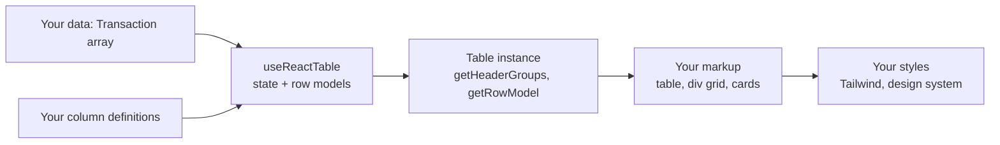
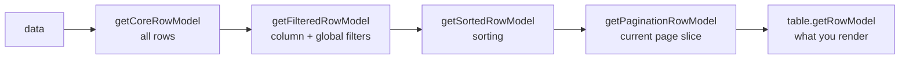
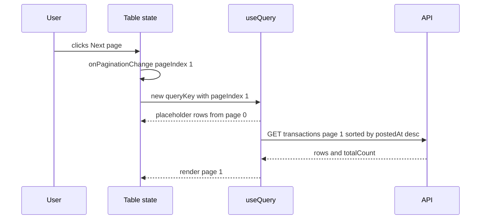
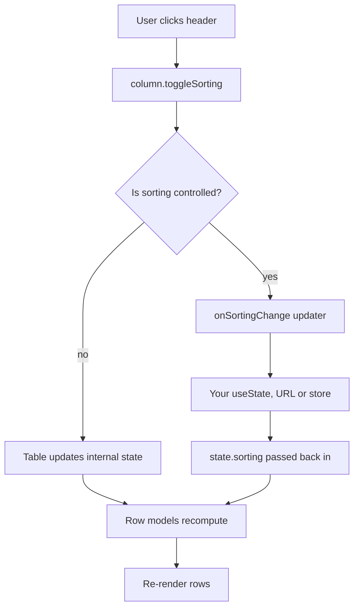

## 1. What it is

**TanStack Table v8 is a headless table library: it computes rows, columns, sorting, filtering, pagination and selection state, and gives you plain data and helper functions to render with any markup you like.**

Imagine a spreadsheet engine without a screen. You hand it rows and column rules. It tells you, "here are the visible columns, here are the rows on page 3 sorted by amount, and row 17 is selected." Drawing the grid is your job. That is what "headless" means: all the brains, no built-in UI.

The problem it solves: tables in business apps need the same logic again and again (sort by column, filter by text and ranges, paginate, select rows for bulk actions, hide columns). Writing that by hand is error-prone and tangled with markup. Pre-built grid components solve it but force their look, DOM structure and styling on you. TanStack Table gives you the logic only, so the table matches your design system exactly.

## 2. Core concepts

### [Beginner] Headless: why separate logic from markup

A "full" grid component (AG Grid, MUI DataGrid) owns the DOM. A headless library owns only state and calculations.



```tsx
// You write the HTML. The library only tells you what to render.
<table>
  <thead>
    {table.getHeaderGroups().map((hg) => (
      <tr key={hg.id}>
        {hg.headers.map((h) => (
          <th key={h.id}>{flexRender(h.column.columnDef.header, h.getContext())}</th>
        ))}
      </tr>
    ))}
  </thead>
  <tbody>
    {table.getRowModel().rows.map((row) => (
      <tr key={row.id}>
        {row.getVisibleCells().map((cell) => (
          <td key={cell.id}>{flexRender(cell.column.columnDef.cell, cell.getContext())}</td>
        ))}
      </tr>
    ))}
  </tbody>
</table>
```

> **Why:** Financial apps have strict design systems and accessibility rules: right-aligned tabular numbers, sticky headers, screen-reader labels, red/green with icons not just color. Owning the markup means no fighting a vendor's CSS, smaller bundles (~15 KB vs hundreds), and the same logic can render a desktop table and a mobile card list.

> **Gotcha:** Headless means **you** handle accessibility (`<th scope>`, `aria-sort`), keyboard navigation and styling. The library will not add them for you.

### [Beginner] useReactTable: the table instance

`useReactTable` takes data, columns and feature options, and returns a table instance full of getters.

```tsx
import { useReactTable, getCoreRowModel, flexRender, type ColumnDef } from '@tanstack/react-table';

type Transaction = {
  id: string;
  postedAt: string;     // ISO date
  description: string;
  category: string;
  amountCents: number;  // negative = debit
  currency: 'USD' | 'EUR';
  status: 'pending' | 'posted';
};

export function TransactionsTable({ data }: { data: Transaction[] }) {
  const table = useReactTable({
    data,                               // must be a stable reference
    columns,                            // must be a stable reference
    getCoreRowModel: getCoreRowModel(), // required: turns data into rows
    getRowId: (row) => row.id,          // use your own IDs instead of array index
  });

  return <BasicTableMarkup table={table} />;
}
```

> **Why `getCoreRowModel` is required:** Every feature (sorting, filtering, pagination) is opt-in and tree-shakeable. You import only the row models you use, so a simple table ships less code.

> **Gotcha:** Passing `data={transactions.filter(...)}` or defining `columns` inside the component without `useMemo` creates a new array every render. The table recalculates everything and, in the worst case, re-renders in an infinite loop. Keep `data` and `columns` stable.

### [Beginner] Column definitions: ColumnDef and columnHelper

A column definition says where a value comes from (accessor), how to render the header and cell, and which features apply.

```tsx
import { createColumnHelper } from '@tanstack/react-table';

const columnHelper = createColumnHelper<Transaction>();

// Defined OUTSIDE the component: stable reference, created once
export const columns = [
  // accessorKey: read a property by name (typed, autocompletes)
  columnHelper.accessor('postedAt', {
    header: 'Date',
    cell: (info) => formatDate(info.getValue()), // info.getValue() is typed as string
  }),
  columnHelper.accessor('description', {
    header: 'Description',
  }),
  // accessorFn: compute a value. Needs an explicit id.
  columnHelper.accessor((row) => row.amountCents / 100, {
    id: 'amount',
    header: () => <span className="text-right block">Amount</span>,
    cell: (info) => (
      <Money amountCents={info.row.original.amountCents} currency={info.row.original.currency} />
    ),
  }),
  // display column: no data, just UI
  columnHelper.display({
    id: 'actions',
    header: () => <span className="sr-only">Actions</span>,
    cell: ({ row }) => <RowActions transactionId={row.original.id} />,
  }),
];
```

The same thing without the helper, using the `ColumnDef` type:

```ts
const columns: ColumnDef<Transaction>[] = [
  { accessorKey: 'postedAt', header: 'Date' },
  { accessorFn: (row) => row.amountCents / 100, id: 'amount', header: 'Amount' },
  { id: 'actions', cell: ({ row }) => <RowActions transactionId={row.original.id} /> },
];
```

> **Why `columnHelper`:** It infers the value type per column. `info.getValue()` in the `postedAt` column is `string`, in an `amountCents` column it is `number`. With a plain `ColumnDef<Transaction>[]` array, values are often `unknown`.

| Term | What it means |
|---|---|
| `accessorKey` | Read `row[key]`. Also becomes the column `id`. Supports dot paths like `'merchant.name'`. |
| `accessorFn` | Function `(row) => value`. Requires an `id`. |
| `header` | String or render function `(ctx) => ReactNode` |
| `cell` | Render function `(ctx) => ReactNode`. Default renders `getValue()`. |
| `footer` | Same as header, for totals rows |
| `row.original` | Your raw data object |
| `cell.getValue()` | The accessor's value |

### [Beginner] Rendering with flexRender

`header` and `cell` can be strings or functions. `flexRender` renders either.

```tsx
function BasicTableMarkup<T>({ table }: { table: Table<T> }) {
  return (
    <table className="w-full tabular-nums">
      <thead>
        {table.getHeaderGroups().map((headerGroup) => (
          <tr key={headerGroup.id}>
            {headerGroup.headers.map((header) => (
              <th key={header.id} colSpan={header.colSpan} scope="col">
                {header.isPlaceholder
                  ? null
                  : flexRender(header.column.columnDef.header, header.getContext())}
              </th>
            ))}
          </tr>
        ))}
      </thead>
      <tbody>
        {table.getRowModel().rows.map((row) => (
          <tr key={row.id}>
            {row.getVisibleCells().map((cell) => (
              <td key={cell.id}>{flexRender(cell.column.columnDef.cell, cell.getContext())}</td>
            ))}
          </tr>
        ))}
      </tbody>
    </table>
  );
}
```

> **Gotcha:** Use `row.getVisibleCells()`, not `row.getAllCells()`. The second one ignores column visibility settings.

### [Intermediate] Row models: the pipeline

Each row model is a stage that transforms the rows from the previous stage. You enable a stage by passing its factory.



```tsx
import {
  getCoreRowModel,
  getFilteredRowModel,
  getSortedRowModel,
  getPaginationRowModel,
} from '@tanstack/react-table';

const table = useReactTable({
  data,
  columns,
  getCoreRowModel: getCoreRowModel(),
  getFilteredRowModel: getFilteredRowModel(),     // enables filtering
  getSortedRowModel: getSortedRowModel(),         // enables sorting
  getPaginationRowModel: getPaginationRowModel(), // enables client-side pages
});

table.getRowModel().rows;          // final rows to render (current page)
table.getFilteredRowModel().rows;  // all rows that match filters (for "142 results")
table.getCoreRowModel().rows;      // every row, untouched
```

> **Why the order:** Filter first so sorting works on fewer rows. Sort before paginating so "page 1" means "top results across all data", not "sort these 25 rows".

### [Intermediate] Sorting

```tsx
const [sorting, setSorting] = useState<SortingState>([{ id: 'postedAt', desc: true }]);

const table = useReactTable({
  data,
  columns,
  state: { sorting },
  onSortingChange: setSorting,
  getCoreRowModel: getCoreRowModel(),
  getSortedRowModel: getSortedRowModel(),
  enableMultiSort: true, // shift+click to sort by several columns
});

// In the header
<th
  aria-sort={
    header.column.getIsSorted() === 'asc' ? 'ascending'
    : header.column.getIsSorted() === 'desc' ? 'descending' : 'none'
  }
>
  <button onClick={header.column.getToggleSortingHandler()} disabled={!header.column.getCanSort()}>
    {flexRender(header.column.columnDef.header, header.getContext())}
    {{ asc: ' ▲', desc: ' ▼' }[header.column.getIsSorted() as string] ?? null}
  </button>
</th>
```

Per-column sort options:

```ts
columnHelper.accessor('amountCents', {
  header: 'Amount',
  sortingFn: 'basic',        // numeric compare. Built-ins: 'alphanumeric', 'text', 'datetime', 'basic'
  sortDescFirst: true,       // biggest amounts first on first click
}),
columnHelper.accessor('postedAt', {
  sortingFn: (a, b, columnId) =>
    Date.parse(a.getValue<string>(columnId)) - Date.parse(b.getValue<string>(columnId)),
}),
columnHelper.accessor('status', { enableSorting: false }),
```

> **Gotcha:** Sorting a formatted string like `"$1,200.00"` sorts alphabetically: `"$900"` comes after `"$1,200"`. Always sort on the raw number (cents) and format only in `cell`.

### [Intermediate] Column filtering and global filtering

Column filters apply to one column each. The global filter searches across columns.

```tsx
const [columnFilters, setColumnFilters] = useState<ColumnFiltersState>([]);
const [globalFilter, setGlobalFilter] = useState('');

const table = useReactTable({
  data,
  columns,
  state: { columnFilters, globalFilter },
  onColumnFiltersChange: setColumnFilters,
  onGlobalFilterChange: setGlobalFilter,
  globalFilterFn: 'includesString', // case-insensitive substring across columns
  getCoreRowModel: getCoreRowModel(),
  getFilteredRowModel: getFilteredRowModel(),
});

// Global search box
<input
  value={globalFilter}
  onChange={(e) => setGlobalFilter(e.target.value)}
  placeholder="Search transactions"
/>

// Column filter for status
const statusColumn = table.getColumn('status')!;
<select
  value={(statusColumn.getFilterValue() as string) ?? ''}
  onChange={(e) => statusColumn.setFilterValue(e.target.value || undefined)} // undefined removes the filter
>
  <option value="">All</option>
  <option value="pending">Pending</option>
  <option value="posted">Posted</option>
</select>
```

Built-in `filterFn` names include `'includesString'`, `'includesStringSensitive'`, `'equalsString'`, `'equals'`, `'arrIncludes'`, `'inNumberRange'`, `'weakEquals'`. Custom filters are plain functions:

```ts
columnHelper.accessor('status', { filterFn: 'equalsString' }),

columnHelper.accessor('amountCents', {
  // Filter value: [minCents, maxCents], either side optional
  filterFn: (row, columnId, value: [number?, number?]) => {
    const amount = Math.abs(row.getValue<number>(columnId));
    const [min, max] = value;
    return (min === undefined || amount >= min) && (max === undefined || amount <= max);
  },
}),

// Exclude a column from the global search
columnHelper.accessor('id', { enableGlobalFilter: false }),
```

> **Gotcha:** The global filter skips columns whose first row value is not a string or number by default. Numeric columns may be included or not depending on `getColumnCanGlobalFilter`. If search "does not find amounts", check that option.

> **Gotcha:** Typing in a filter input updates state on every keystroke and re-filters all rows. For large data, debounce the input (300 ms) before calling `setGlobalFilter`.

### [Intermediate] Pagination: client vs manual (server)

**Client-side**: all rows are in memory; the table slices them.

```tsx
const [pagination, setPagination] = useState<PaginationState>({ pageIndex: 0, pageSize: 25 });

const table = useReactTable({
  data,
  columns,
  state: { pagination },
  onPaginationChange: setPagination,
  getCoreRowModel: getCoreRowModel(),
  getPaginationRowModel: getPaginationRowModel(),
});

<button onClick={() => table.previousPage()} disabled={!table.getCanPreviousPage()}>Prev</button>
<span>Page {table.getState().pagination.pageIndex + 1} of {table.getPageCount()}</span>
<button onClick={() => table.nextPage()} disabled={!table.getCanNextPage()}>Next</button>
<select value={pagination.pageSize} onChange={(e) => table.setPageSize(Number(e.target.value))}>
  {[25, 50, 100].map((n) => <option key={n} value={n}>{n} / page</option>)}
</select>
```

**Manual (server-side)**: the server returns one page. The table only renders it and reports state changes. You put the table state into the query key.

```tsx
function ServerTransactionsTable({ accountId }: { accountId: string }) {
  const [pagination, setPagination] = useState<PaginationState>({ pageIndex: 0, pageSize: 50 });
  const [sorting, setSorting] = useState<SortingState>([{ id: 'postedAt', desc: true }]);

  const { data, isPending, isPlaceholderData } = useQuery({
    queryKey: ['accounts', accountId, 'transactions', { pagination, sorting }],
    queryFn: ({ signal }) => fetchTransactions(accountId, { pagination, sorting }, signal),
    placeholderData: keepPreviousData, // keep showing the old page while the next loads
  });

  const table = useReactTable({
    data: data?.rows ?? EMPTY,                // EMPTY is a module-level constant: stable reference
    columns,
    rowCount: data?.totalCount,               // v8.13+: lets the table compute page count
    state: { pagination, sorting },
    onPaginationChange: setPagination,
    onSortingChange: setSorting,
    manualPagination: true,                   // don't slice: data is already one page
    manualSorting: true,                      // don't sort: server sorted it
    getCoreRowModel: getCoreRowModel(),
  });
  // ...render, with isPlaceholderData dimming the table
}

const EMPTY: Transaction[] = [];
```



| | Client-side | Manual / server-side |
|---|---|---|
| Data in browser | All rows | One page |
| Row models | `getPaginationRowModel`, `getSortedRowModel` | Only `getCoreRowModel` |
| Flags | none | `manualPagination`, `manualSorting`, `manualFiltering` |
| Page count | Computed | `rowCount` or `pageCount` from server |
| Good up to | ~10k-50k rows (with virtualization) | Millions |

> **Gotcha:** `data ?? []` inline creates a new empty array each render while loading. Use a module-level constant.

> **Finance tip:** Transaction history for years of activity must be server-paginated. Sorting and filtering also move to the server, because "sort by amount" over one page is wrong: users expect the largest transaction of the whole range.

### [Intermediate] Row selection

```tsx
const [rowSelection, setRowSelection] = useState<RowSelectionState>({}); // { [rowId]: true }

const selectColumn = columnHelper.display({
  id: 'select',
  header: ({ table }) => (
    <input
      type="checkbox"
      aria-label="Select all on this page"
      checked={table.getIsAllPageRowsSelected()}
      ref={(el) => { if (el) el.indeterminate = table.getIsSomePageRowsSelected(); }}
      onChange={table.getToggleAllPageRowsSelectedHandler()}
    />
  ),
  cell: ({ row }) => (
    <input
      type="checkbox"
      aria-label={`Select transaction ${row.original.description}`}
      checked={row.getIsSelected()}
      disabled={!row.getCanSelect()}
      onChange={row.getToggleSelectedHandler()}
    />
  ),
});

const table = useReactTable({
  data,
  columns: useMemo(() => [selectColumn, ...columns], []),
  state: { rowSelection },
  onRowSelectionChange: setRowSelection,
  getRowId: (row) => row.id,                          // selection keyed by transaction id
  enableRowSelection: (row) => row.original.status === 'posted', // can't dispute pending items
  getCoreRowModel: getCoreRowModel(),
});

const selected = table.getSelectedRowModel().rows.map((r) => r.original);
const selectedTotalCents = selected.reduce((s, t) => s + t.amountCents, 0);
```

> **Why `getRowId`:** By default, row IDs are array indexes (`"0"`, `"1"`). After a refetch or sort on the server, index 3 may be a different transaction, so the selection silently moves to the wrong row. With your own IDs, selection follows the data.

> **Finance tip:** For bulk actions (export, dispute, categorize), show the count and total of selected items before confirming, and send IDs (not indexes) to the server.

### [Intermediate] Column visibility

```tsx
const [columnVisibility, setColumnVisibility] = useState<VisibilityState>({
  category: false, // hidden by default
});

const table = useReactTable({
  data,
  columns,
  state: { columnVisibility },
  onColumnVisibilityChange: setColumnVisibility,
  getCoreRowModel: getCoreRowModel(),
});

// "Columns" menu
{table.getAllLeafColumns().map((column) => (
  <label key={column.id}>
    <input
      type="checkbox"
      checked={column.getIsVisible()}
      disabled={!column.getCanHide()}
      onChange={column.getToggleVisibilityHandler()}
    />
    {column.id}
  </label>
))}
```

Mark essential columns with `enableHiding: false` (for example, amount). Persist visibility per user (local storage or a preferences API) so their layout survives reloads.

### [Advanced] Controlled state and the state model

Every feature has a piece of state (`sorting`, `columnFilters`, `pagination`...). The table can hold it internally, or you control it.

```tsx
// 1. Uncontrolled: table owns state. Optional initial values.
useReactTable({ data, columns, initialState: { pagination: { pageIndex: 0, pageSize: 50 } }, ... });

// 2. Controlled: you own the slice. Pass value AND updater.
const [sorting, setSorting] = useState<SortingState>([]);
useReactTable({ data, columns, state: { sorting }, onSortingChange: setSorting, ... });

// 3. Controlled in the URL: shareable and back-button friendly
const [searchParams, setSearchParams] = useSearchParams();
const sorting = parseSorting(searchParams.get('sort'));  // 'postedAt.desc' -> [{ id, desc }]
useReactTable({
  state: { sorting },
  onSortingChange: (updater) => {
    // updater may be a value OR a function of the old value
    const next = typeof updater === 'function' ? updater(sorting) : updater;
    setSearchParams((p) => { p.set('sort', serializeSorting(next)); return p; });
  },
  ...
});
```



> **Why controlled:** You need it when something outside the table cares about the state: the server query (manual pagination), the URL (shareable filtered views), or persistence.

> **Gotcha:** If you pass `state: { sorting }` but forget `onSortingChange`, clicking a header does nothing. The table calls a no-op and your state never changes.

> **Gotcha:** Changing filters or sorting resets `pageIndex` to 0 by default (`autoResetPageIndex`). With manual pagination, you may need to reset it yourself.

### [Advanced] meta: passing extra context

`meta` lets you attach your own data to the table or a column. Use declaration merging so it is typed.

```ts
// src/types/tanstack-table.d.ts
import '@tanstack/react-table';

declare module '@tanstack/react-table' {
  interface TableMeta<TData extends RowData> {
    locale: string;
    onCategorize: (transactionId: string, category: string) => void;
  }
  interface ColumnMeta<TData extends RowData, TValue> {
    align?: 'left' | 'right';
    isMonetary?: boolean;
  }
}
```

```tsx
const columns = [
  columnHelper.accessor('amountCents', {
    header: 'Amount',
    meta: { align: 'right', isMonetary: true },
    cell: ({ getValue, row, table }) =>
      formatMoney(getValue(), row.original.currency, table.options.meta!.locale),
  }),
  columnHelper.accessor('category', {
    cell: ({ row, getValue, table }) => (
      <CategorySelect
        value={getValue()}
        onChange={(c) => table.options.meta!.onCategorize(row.original.id, c)}
      />
    ),
  }),
];

const table = useReactTable({
  data,
  columns,
  meta: { locale: 'en-US', onCategorize: (id, c) => categorize.mutate({ id, category: c }) },
  getCoreRowModel: getCoreRowModel(),
});

// Generic renderer uses column meta for alignment
<td className={cell.column.columnDef.meta?.align === 'right' ? 'text-right' : ''}>
```

> **Why:** Columns are defined outside the component (stable), so they cannot close over component callbacks. `meta` passes those callbacks in through the table instead of redefining columns every render.

### [Advanced] Performance with large data

```tsx
// 1. Stable inputs
const columns = useMemo(() => buildColumns(currency), [currency]);
const data = useMemo(() => transactions.filter(isVisible), [transactions]);

// 2. Cheap cells: no heavy formatting per render. Reuse Intl formatters.
const usd = new Intl.NumberFormat('en-US', { style: 'currency', currency: 'USD' });
cell: (info) => usd.format(info.getValue<number>() / 100),

// 3. Virtualize rows instead of paginating 20k rows into the DOM
const rows = table.getRowModel().rows;
const virtualizer = useVirtualizer({
  count: rows.length,
  getScrollElement: () => scrollRef.current,
  estimateSize: () => 40,
  overscan: 10,
});

// 4. Move work to the server for very large sets (manualPagination/Sorting/Filtering)

// 5. Debounce filter inputs
const debounced = useDebouncedValue(search, 300);
useEffect(() => table.setGlobalFilter(debounced), [debounced]);
```

What costs time: building row models (sorting is O(n log n), filtering O(n) per filter), and rendering DOM nodes. The table memoizes row models internally and recomputes only when inputs change. DOM rendering is usually the bottleneck, which is why virtualization matters more than micro-optimizing the table.

> **Gotcha:** The table instance is a stable object that mutates internally. Passing `table` as a prop to a `React.memo` child will not trigger re-renders when state changes. Pass the specific values (rows, state) or do not memo those children. The React Compiler can hit the same problem; check the current TanStack Table guidance if you enable it.

## 3. Why it's used in this project

- **Design-system fit.** Transaction tables, holdings tables and statements must match the bank's components: right-aligned tabular numbers, colored but icon-backed debit/credit, sticky headers. Headless gives full control.
- **Transaction history.** Server-side pagination, sorting and filtering through `manual*` flags, driven by TanStack Query keys.
- **Portfolio holdings.** Client-side sorting by market value, gain/loss and allocation, with totals in a footer row.
- **Bulk actions.** Row selection with stable IDs for exporting CSVs, disputing charges or recategorizing transactions.
- **User preferences.** Column visibility and order stored per user (compliance teams want a "reference number" column that customers usually hide).
- **Large data.** Combined with TanStack Virtual, 10k+ rows of an internal ops screen stay smooth.
- **Small bundle.** ~15 KB gzip vs hundreds of KB for a full grid in a customer-facing app.

> **Finance tip:** Sort, filter and sum on integer cents (`amountCents`). Format with `Intl.NumberFormat` only in the `cell` renderer. Floating-point dollars cause `0.1 + 0.2 = 0.30000000000000004` style errors in totals.

## 4. Setup & configuration

```bash
npm install @tanstack/react-table
# often together with:
npm install @tanstack/react-virtual @tanstack/react-query
```

```tsx
// src/components/DataTable.tsx — a reusable, typed wrapper
import {
  useReactTable,
  getCoreRowModel,
  getSortedRowModel,
  getFilteredRowModel,
  getPaginationRowModel,
  type ColumnDef,
  type SortingState,
  type ColumnFiltersState,
  type VisibilityState,
  type RowSelectionState,
} from '@tanstack/react-table';

type DataTableProps<T extends { id: string }> = {
  data: T[];                         // stable reference
  columns: ColumnDef<T, any>[];      // stable reference
  initialSorting?: SortingState;
};

export function DataTable<T extends { id: string }>({ data, columns, initialSorting = [] }: DataTableProps<T>) {
  const [sorting, setSorting] = useState<SortingState>(initialSorting);
  const [columnFilters, setColumnFilters] = useState<ColumnFiltersState>([]);
  const [globalFilter, setGlobalFilter] = useState('');
  const [columnVisibility, setColumnVisibility] = useState<VisibilityState>({});
  const [rowSelection, setRowSelection] = useState<RowSelectionState>({});

  const table = useReactTable({
    data,
    columns,
    getRowId: (row) => row.id,                     // stable selection across refetches
    state: { sorting, columnFilters, globalFilter, columnVisibility, rowSelection },
    onSortingChange: setSorting,
    onColumnFiltersChange: setColumnFilters,
    onGlobalFilterChange: setGlobalFilter,
    onColumnVisibilityChange: setColumnVisibility,
    onRowSelectionChange: setRowSelection,

    getCoreRowModel: getCoreRowModel(),            // required
    getSortedRowModel: getSortedRowModel(),        // client sorting
    getFilteredRowModel: getFilteredRowModel(),    // client filtering
    getPaginationRowModel: getPaginationRowModel(),// client pagination

    initialState: { pagination: { pageIndex: 0, pageSize: 25 } }, // uncontrolled pagination
    enableMultiSort: true,                         // shift-click for secondary sort
    enableRowSelection: true,                      // or (row) => boolean
    globalFilterFn: 'includesString',              // case-insensitive search
    autoResetPageIndex: true,                      // go to page 1 when filters/sort change
    // manualPagination / manualSorting / manualFiltering: true for server-side
    // rowCount: total rows from the server when manualPagination is true
    // debugTable: true,                           // logs row model timings in dev
  });

  return <TableView table={table} globalFilter={globalFilter} onSearch={setGlobalFilter} />;
}
```

## 5. Key features we use

### [Beginner] Money column with footer total

```tsx
columnHelper.accessor('amountCents', {
  header: 'Amount',
  meta: { align: 'right' },
  cell: (info) => <Money amountCents={info.getValue()} currency={info.row.original.currency} />,
  footer: ({ table }) => {
    const total = table.getFilteredRowModel().rows.reduce((s, r) => s + r.original.amountCents, 0);
    return <Money amountCents={total} currency="USD" />;
  },
}),
```

### [Beginner] Empty and loading states

```tsx
<tbody>
  {table.getRowModel().rows.length === 0 ? (
    <tr><td colSpan={table.getVisibleLeafColumns().length}>No transactions match your filters.</td></tr>
  ) : (
    table.getRowModel().rows.map((row) => <TransactionRow key={row.id} row={row} />)
  )}
</tbody>
```

### [Intermediate] Date range filter

```ts
columnHelper.accessor('postedAt', {
  filterFn: (row, id, [from, to]: [string?, string?]) => {
    const d = row.getValue<string>(id).slice(0, 10); // ISO yyyy-mm-dd compares as strings
    return (!from || d >= from) && (!to || d <= to);
  },
}),
table.getColumn('postedAt')?.setFilterValue(['2026-09-01', '2026-09-30']);
```

### [Intermediate] Export selected rows to CSV

```ts
const rows = table.getSelectedRowModel().rows.map((r) => r.original);
const csv = ['Date,Description,Amount', ...rows.map((t) => `${t.postedAt},"${t.description.replace(/"/g, '""')}",${(t.amountCents / 100).toFixed(2)}`)].join('\n');
```

> **Gotcha:** CSV cells starting with `=`, `+`, `-` or `@` can be executed as formulas by Excel (CSV injection). Prefix such values with `'` when exporting user-controlled text like descriptions.

### [Advanced] Expanding rows for transaction details

```tsx
import { getExpandedRowModel } from '@tanstack/react-table';

useReactTable({ ..., getExpandedRowModel: getExpandedRowModel(), getRowCanExpand: () => true });

{row.getIsExpanded() && (
  <tr><td colSpan={row.getVisibleCells().length}><TransactionDetails tx={row.original} /></td></tr>
)}
<button onClick={row.getToggleExpandedHandler()} aria-expanded={row.getIsExpanded()}>Details</button>
```

## 6. Interview questions

#### Q: What does "headless" mean, and why choose a headless table over a full grid component?

Headless means the library manages state and logic (rows, sorting, filtering, pagination, selection) but renders nothing. You write the markup and styles. Benefits: full control over design and accessibility, a small bundle (~15 KB), framework-agnostic core, and the same logic can drive a table, a grid of divs or mobile cards. Costs: you build the UI, keyboard support and features like column resizing UI or Excel export yourself. A full grid (AG Grid) wins for spreadsheet-like internal tools; headless wins for branded, customer-facing tables.

#### Q: Explain row models and the order they run in.

A row model is a stage that takes rows and returns rows. `getCoreRowModel` (required) creates rows from data. Then `getFilteredRowModel` applies column and global filters, `getSortedRowModel` sorts, (`getGroupedRowModel`/`getExpandedRowModel` if used), and `getPaginationRowModel` slices the current page. `table.getRowModel()` returns the final result. You only import the ones you need, which keeps the bundle small. Filtering before sorting means fewer rows to sort; sorting before paginating means pages reflect the global order.

#### Q: How do you implement server-side pagination and sorting?

Control `pagination` and `sorting` state with `useState` (or the URL). Set `manualPagination: true` and `manualSorting: true` so the table does not slice or sort itself. Pass `rowCount` (or `pageCount`) from the server. Put the state in the TanStack Query key so changing a page triggers a fetch, and use `placeholderData: keepPreviousData` to avoid flashing. Only `getCoreRowModel` is needed. Reset `pageIndex` to 0 when sorting or filters change.

#### Q: Why should data and columns be memoized, and what is getRowId for?

The table recalculates row models when `data` or `columns` change by reference. A new array every render means recalculation every render, and can cause render loops when state updates. Define columns outside the component or with `useMemo`, and keep `data` stable (memoize transforms, use a constant for empty arrays). `getRowId` makes row IDs come from your data instead of array indexes, so row selection, expansion and React keys stay attached to the right record after sorting or refetching.

#### Q: How do you pass callbacks or extra context into cell renderers without redefining columns?

Use `meta`. `table.options.meta` holds table-level context (locale, mutation callbacks), and `column.columnDef.meta` holds per-column info (alignment, isMonetary). Both are typed through declaration merging on `TableMeta` and `ColumnMeta`. Cell renderers receive `table` and `column` in their context, so they read from meta. This keeps column definitions stable while still letting cells trigger component-level actions.

## 7. Drawbacks & pain points

- **You build the UI.** Column resizing handles, drag-to-reorder, keyboard grid navigation, sticky columns and Excel-like editing all need your code.
- **Verbose markup.** Every table needs the header-group and visible-cells loops. Teams usually build one shared `DataTable` component.
- **Type friction.** Mixed columns arrays often need `ColumnDef<T, any>[]`. Custom `filterFn` values are `unknown` without casts.
- **Stable-reference rules** cause subtle render loops and wasted work.
- **No virtualization built in.** Pair with TanStack Virtual for big lists.
- **The instance mutates.** Memoized children and the React Compiler can miss updates.
- **v9 is coming.** It is expected to change some APIs (hedge: check release status before starting a migration).

Gotchas that trip devs up:

```tsx
// 1. Columns defined inline: new reference every render
function Table({ data }) {
  const columns = [{ accessorKey: 'amountCents' }]; // BAD
  const table = useReactTable({ data, columns, getCoreRowModel: getCoreRowModel() });
}

// 2. Forgot the row model: sorting state changes but rows don't sort
useReactTable({ data, columns, state: { sorting }, onSortingChange: setSorting,
  getCoreRowModel: getCoreRowModel() }); // missing getSortedRowModel()

// 3. Manual pagination without manualPagination: true
// The table re-slices your 50-row server page into page 1 of 25 and shows half.

// 4. Selection by index after server refetch: wrong rows stay selected
useReactTable({ data, columns, getCoreRowModel: getCoreRowModel() }); // add getRowId

// 5. Using getAllCells and wondering why hidden columns still render
row.getAllCells(); // BAD -> row.getVisibleCells()
```

## 8. Better alternatives

There is no clear "replacement" for TanStack Table: it is the leading headless option. The real choice is **headless vs batteries-included grid**. AG Grid dominates enterprise data grids (trading blotters, ops consoles). MUI X DataGrid fits teams already on Material UI. Mantine React Table and Material React Table are prebuilt UIs on top of TanStack Table. For very simple read-only lists, a plain `<table>` with `Array.sort` is fine.

| Option | Bundle (gzip) | Boilerplate | Devtools | Learning curve | TypeScript | Popularity | When it wins |
|---|---|---|---|---|---|---|---|
| TanStack Table v8 | ~15 KB | High (you write markup) | Community devtools | Medium | Excellent | Very high | Branded, custom tables, design-system fit |
| AG Grid Community | ~250-300+ KB | Low | Built-in tooling | Medium | Good | Very high in enterprise | Spreadsheet-like grids, huge datasets |
| AG Grid Enterprise | larger, paid license | Low | Built-in | Medium-high | Good | High | Pivoting, row grouping, Excel export, server row model |
| MUI X DataGrid (Community / Pro / Premium) | ~100+ KB plus MUI | Low | MUI tooling | Low-medium | Good | High | Apps already on MUI |
| Material React Table / Mantine React Table | TanStack + UI lib | Low | TanStack | Low | Good | Medium | Want TanStack logic with ready UI |
| Plain table + sort | 0 KB | Medium | None | Low | n/a | n/a | Small static lists |

> **Finance tip:** Trading and back-office tools that need cell editing, pivots and real-time ticking often justify AG Grid's size and license. Customer-facing banking screens rarely do.

## 9. When NOT to use it

- **Spreadsheet-grade requirements** (cell editing with validation, pivots, row grouping with aggregation UI, clipboard, Excel export) on a deadline: use AG Grid or MUI Premium.
- **A five-row static summary** (account overview): a plain `<table>` is simpler.
- **Team has no time to build table UI** and does not need a custom look: a prebuilt grid ships faster.
- **Purely card-based mobile layouts** with no sorting/filtering: a mapped list is enough.
- **Real-time ticking cells at high frequency** across thousands of rows: grids with built-in change detection and batching (AG Grid transactions API) handle this better.

## Cheatsheet

| Task | API |
|---|---|
| Create table | `useReactTable({ data, columns, getCoreRowModel: getCoreRowModel() })` |
| Typed columns | `const ch = createColumnHelper<T>()` then `ch.accessor('key', {...})`, `ch.accessor(fn, { id })`, `ch.display({ id })` |
| Render | `flexRender(def.header, header.getContext())`, `flexRender(def.cell, cell.getContext())` |
| Loops | `table.getHeaderGroups()`, `table.getRowModel().rows`, `row.getVisibleCells()` |
| Raw row | `row.original`, `cell.getValue()` |
| Stable IDs | `getRowId: (row) => row.id` |
| Sorting | `getSortedRowModel()`, `column.getToggleSortingHandler()`, `column.getIsSorted()` |
| Column filter | `getFilteredRowModel()`, `column.setFilterValue(v)`, `filterFn` |
| Global filter | `state.globalFilter`, `onGlobalFilterChange`, `globalFilterFn` |
| Client pages | `getPaginationRowModel()`, `nextPage()`, `getCanNextPage()`, `setPageSize()` |
| Server pages | `manualPagination: true`, `rowCount`, state in query key |
| Selection | `state.rowSelection`, `row.getToggleSelectedHandler()`, `getSelectedRowModel()` |
| Visibility | `state.columnVisibility`, `column.getToggleVisibilityHandler()` |
| Controlled | `state: { x }` + `onXChange` |
| Extra context | `meta` on table and columns, typed via `TableMeta` / `ColumnMeta` |

```tsx
const ch = createColumnHelper<Transaction>();
const columns = [
  ch.accessor('postedAt', { header: 'Date', cell: (i) => formatDate(i.getValue()) }),
  ch.accessor('amountCents', { header: 'Amount', cell: (i) => formatMoney(i.getValue(), 'USD') }),
];
const table = useReactTable({
  data, columns, getRowId: (r) => r.id,
  state: { sorting, rowSelection }, onSortingChange: setSorting, onRowSelectionChange: setRowSelection,
  getCoreRowModel: getCoreRowModel(), getSortedRowModel: getSortedRowModel(),
});
table.getRowModel().rows.map((row) =>
  row.getVisibleCells().map((cell) => flexRender(cell.column.columnDef.cell, cell.getContext())));
```
