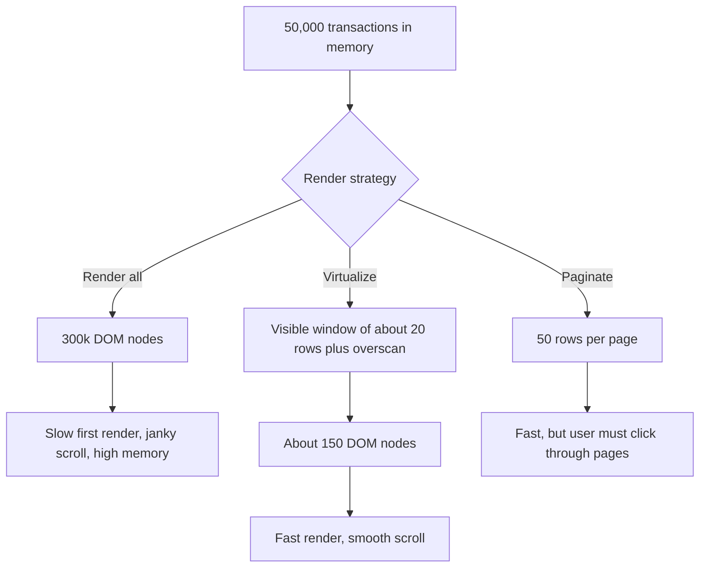
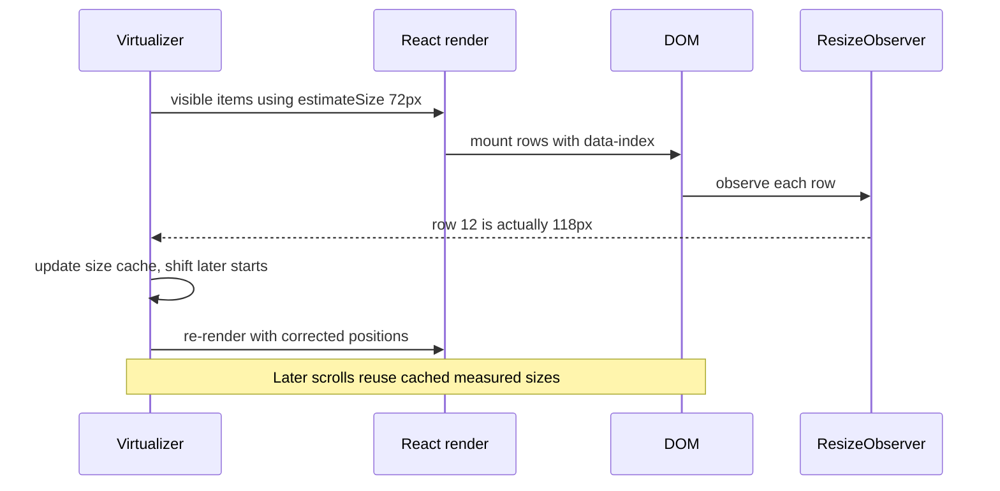
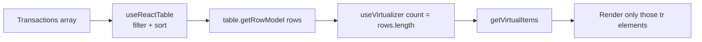

## 1. What it is

**TanStack Virtual is a headless virtualization library: given the number of items and a scroll container, it tells you which items are currently visible and where to position them, so you only render those.**

Think of a long train seen through a small window. You never see all 50,000 carriages at once, only the six in front of you. Virtualization builds only those six carriages, and as you "move", it takes away the ones that left the window and builds the ones coming in. To make the scrollbar feel right, it puts an invisible spacer as long as the whole train behind them.

The problem it solves: browsers slow down badly when the DOM contains tens of thousands of nodes. A transaction list with 50,000 rows and 6 cells each is 300,000+ elements. Layout, style calculation, memory and React reconciliation all scale with that number. Virtualization keeps the DOM to a few dozen rows no matter how large the data is.

## 2. Core concepts

### [Beginner] Why rendering 50k DOM rows is slow

Every DOM element costs work in several places:

- **React**: creating and diffing 50k component instances on every update.
- **Style and layout**: the browser computes CSS and geometry for every node, even off-screen ones.
- **Memory**: each node holds styles, event listeners and layout boxes. Low-end laptops and phones run out.
- **Paint and scrolling**: more layers and nodes mean more work per frame, so scrolling stutters.

```tsx
// The naive version: fine for 100 rows, painful for 50,000
function TransactionList({ transactions }: { transactions: Transaction[] }) {
  return (
    <div style={{ height: 600, overflow: 'auto' }}>
      {transactions.map((tx) => (
        <TransactionRow key={tx.id} tx={tx} /> // 50,000 rows mounted at once
      ))}
    </div>
  );
}
```



> **Why:** Data in a JavaScript array is cheap. 50,000 objects is a few megabytes. DOM nodes are expensive. Virtualization keeps the cheap part (all data) and limits the expensive part (DOM).

### [Beginner] The windowing model

A virtual list has three layers:

1. **Scroll container**: a fixed-height element with `overflow: auto`. The user scrolls this.
2. **Inner spacer**: one element with height equal to the total height of all items. It makes the scrollbar size and position correct.
3. **Visible items**: absolutely positioned inside the spacer, moved down to where they would be if everything were rendered.

```ts
// The core math for fixed-size rows (the library also handles variable sizes)
const firstVisible = Math.floor(scrollTop / rowHeight);
const visibleCount = Math.ceil(containerHeight / rowHeight);
const offsetY = firstVisible * rowHeight;   // translateY for the first rendered row
const totalHeight = itemCount * rowHeight;  // spacer height: 50,000 x 40px = 2,000,000px
```

### [Beginner] useVirtualizer: the minimum example

```tsx
import { useRef } from 'react';
import { useVirtualizer } from '@tanstack/react-virtual';

export function VirtualTransactionList({ transactions }: { transactions: Transaction[] }) {
  const parentRef = useRef<HTMLDivElement>(null);

  const virtualizer = useVirtualizer({
    count: transactions.length,                 // how many items exist
    getScrollElement: () => parentRef.current,  // which element scrolls
    estimateSize: () => 48,                     // px height per row (exact for fixed rows)
    overscan: 8,                                // extra rows rendered above and below
  });

  return (
    // 1. Scroll container: MUST have a fixed height and overflow
    <div ref={parentRef} style={{ height: 600, overflow: 'auto' }}>
      {/* 2. Spacer: total height of all rows */}
      <div style={{ height: virtualizer.getTotalSize(), position: 'relative', width: '100%' }}>
        {/* 3. Only visible rows, positioned absolutely */}
        {virtualizer.getVirtualItems().map((item) => {
          const tx = transactions[item.index];
          return (
            <div
              key={item.key}
              style={{
                position: 'absolute',
                top: 0,
                left: 0,
                width: '100%',
                height: item.size,
                transform: `translateY(${item.start}px)`,
              }}
            >
              <TransactionRow tx={tx} />
            </div>
          );
        })}
      </div>
    </div>
  );
}
```

Each `VirtualItem` has:

| Field | Meaning |
|---|---|
| `index` | Position in your data array |
| `key` | Stable React key (index by default, or `getItemKey`) |
| `start` | Pixel offset from the top of the list |
| `size` | Height (or width when horizontal) |
| `end` | `start + size` |
| `lane` | Column index when using `lanes` (masonry) |

> **Why `translateY` instead of `top`:** Transforms are handled by the compositor and do not trigger layout of siblings. Changing `top` on many elements during scroll forces layout recalculation and costs frames.

> **Gotcha:** The scroll container must have a constrained height (fixed, `max-height`, or flex child with `min-height: 0`). If it grows to fit its content, it never scrolls, the virtualizer sees everything as visible and renders all rows.

### [Beginner] getScrollElement, estimateSize, overscan

- **`getScrollElement`** is a function, not an element, because on the first render the ref is still `null`. The virtualizer calls it after mount.
- **`estimateSize(index)`** returns a pixel size per item. For fixed rows it is the exact height. For dynamic rows it is a guess used until the real size is measured. Overestimating slightly is better than underestimating (fewer jumps).
- **`overscan`** (default `1`) renders extra items beyond the viewport. Higher values reduce blank flashes during fast scrolling but render more DOM.

```ts
useVirtualizer({
  count: rows.length,
  getScrollElement: () => parentRef.current,
  estimateSize: (index) => (rows[index].type === 'dateHeader' ? 32 : 56), // per-index estimates
  overscan: 10,
  getItemKey: (index) => rows[index].id, // stable keys survive inserts and sorts
  paddingStart: 8,                        // px before the first item
  paddingEnd: 8,                          // px after the last item
  gap: 4,                                 // px between items
});
```

> **Gotcha:** Without `getItemKey`, keys are indexes. When new transactions are prepended (a fresh payment posts at the top), every row's key shifts and React remounts or mismatches row state, such as an open menu.

### [Intermediate] Dynamic sizes with measureElement

When rows have different heights (wrapped descriptions, expandable details), estimates are not enough. Attach `measureElement` as a ref and set `data-index`. The virtualizer measures each rendered item with a `ResizeObserver` and corrects positions.

```tsx
export function DynamicActivityFeed({ items }: { items: ActivityItem[] }) {
  const parentRef = useRef<HTMLDivElement>(null);

  const virtualizer = useVirtualizer({
    count: items.length,
    getScrollElement: () => parentRef.current,
    estimateSize: () => 72,                 // a reasonable average
    overscan: 6,
    getItemKey: (i) => items[i].id,
  });

  const virtualItems = virtualizer.getVirtualItems();

  return (
    <div ref={parentRef} style={{ height: 640, overflowY: 'auto', contain: 'strict' }}>
      <div style={{ height: virtualizer.getTotalSize(), position: 'relative', width: '100%' }}>
        {/* Translate one wrapper by the first item's start, let the rest flow naturally */}
        <div style={{ position: 'absolute', top: 0, left: 0, width: '100%',
                      transform: `translateY(${virtualItems[0]?.start ?? 0}px)` }}>
          {virtualItems.map((vi) => (
            <div
              key={vi.key}
              data-index={vi.index}                 // REQUIRED: tells the virtualizer which item this is
              ref={virtualizer.measureElement}      // measures real height
            >
              <ActivityCard item={items[vi.index]} />
            </div>
          ))}
        </div>
      </div>
    </div>
  );
}
```



> **Why the single translated wrapper:** With dynamic sizes, positioning each row absolutely requires knowing its exact start before measurement. Translating one wrapper by the first item's `start` and letting rows stack in normal flow avoids overlap while measurement settles.

> **Gotcha:** Forgetting `data-index` breaks measurement silently: the virtualizer cannot map the element to an index, rows overlap or leave gaps.

> **Gotcha:** Scrolling **upward** into unmeasured rows can make content jump, because the real sizes differ from the estimates above the viewport. A closer `estimateSize` reduces it. The library adjusts scroll position to compensate in most cases, but not perfectly.

### [Intermediate] Scrolling programmatically

```tsx
// Jump to a specific transaction (e.g. from a search result or deep link)
const index = transactions.findIndex((t) => t.id === targetId);
virtualizer.scrollToIndex(index, { align: 'center' }); // 'start' | 'center' | 'end' | 'auto'

// Back to top when filters change
virtualizer.scrollToOffset(0);

// Know if the user is actively scrolling (e.g. defer expensive cell content)
virtualizer.isScrolling;
```

### [Intermediate] Window scrolling

When the page itself scrolls (no inner scroll box), use `useWindowVirtualizer`. `scrollMargin` is the list's distance from the top of the document.

```tsx
import { useWindowVirtualizer } from '@tanstack/react-virtual';

function StatementLines({ lines }: { lines: StatementLine[] }) {
  const listRef = useRef<HTMLDivElement>(null);
  const virtualizer = useWindowVirtualizer({
    count: lines.length,
    estimateSize: () => 44,
    overscan: 10,
    scrollMargin: listRef.current?.offsetTop ?? 0,
  });

  return (
    <div ref={listRef}>
      <div style={{ height: virtualizer.getTotalSize(), position: 'relative' }}>
        {virtualizer.getVirtualItems().map((item) => (
          <div key={item.key} style={{ position: 'absolute', top: 0, width: '100%', height: item.size,
               transform: `translateY(${item.start - virtualizer.options.scrollMargin}px)` }}>
            <LineRow line={lines[item.index]} />
          </div>
        ))}
      </div>
    </div>
  );
}
```

### [Advanced] Combining with TanStack Table

TanStack Table computes the rows (sorted, filtered). TanStack Virtual decides which of those rows to put in the DOM. The virtualizer's `count` is the table's row count.



```tsx
export function VirtualTransactionsTable({ data }: { data: Transaction[] }) {
  const [sorting, setSorting] = useState<SortingState>([]);
  const table = useReactTable({
    data,
    columns,
    state: { sorting },
    onSortingChange: setSorting,
    getRowId: (r) => r.id,
    getCoreRowModel: getCoreRowModel(),
    getSortedRowModel: getSortedRowModel(),
  });

  const { rows } = table.getRowModel();
  const parentRef = useRef<HTMLDivElement>(null);

  const virtualizer = useVirtualizer({
    count: rows.length,
    getScrollElement: () => parentRef.current,
    estimateSize: () => 40,
    overscan: 12,
    getItemKey: (i) => rows[i].id,
  });

  return (
    <div ref={parentRef} style={{ height: 640, overflow: 'auto' }}>
      {/* display:grid lets rows be absolutely positioned while columns stay aligned */}
      <table style={{ display: 'grid' }}>
        <thead style={{ display: 'grid', position: 'sticky', top: 0, zIndex: 1 }}>
          {table.getHeaderGroups().map((hg) => (
            <tr key={hg.id} style={{ display: 'flex', width: '100%' }}>
              {hg.headers.map((h) => (
                <th key={h.id} style={{ display: 'flex', width: h.getSize() }}
                    onClick={h.column.getToggleSortingHandler()}>
                  {flexRender(h.column.columnDef.header, h.getContext())}
                </th>
              ))}
            </tr>
          ))}
        </thead>
        <tbody style={{ display: 'grid', height: virtualizer.getTotalSize(), position: 'relative' }}>
          {virtualizer.getVirtualItems().map((vi) => {
            const row = rows[vi.index];
            return (
              <tr
                key={row.id}
                data-index={vi.index}
                style={{ display: 'flex', position: 'absolute', width: '100%',
                         transform: `translateY(${vi.start}px)`, height: vi.size }}
              >
                {row.getVisibleCells().map((cell) => (
                  <td key={cell.id} style={{ display: 'flex', width: cell.column.getSize() }}>
                    {flexRender(cell.column.columnDef.cell, cell.getContext())}
                  </td>
                ))}
              </tr>
            );
          })}
        </tbody>
      </table>
    </div>
  );
}
```

An alternative that keeps native table layout: render spacer rows above and below the visible rows.

```tsx
const items = virtualizer.getVirtualItems();
const paddingTop = items.length ? items[0].start : 0;
const paddingBottom = items.length ? virtualizer.getTotalSize() - items[items.length - 1].end : 0;

<tbody>
  {paddingTop > 0 && <tr><td style={{ height: paddingTop }} colSpan={colCount} /></tr>}
  {items.map((vi) => <BodyRow key={rows[vi.index].id} row={rows[vi.index]} />)}
  {paddingBottom > 0 && <tr><td style={{ height: paddingBottom }} colSpan={colCount} /></tr>}
</tbody>
```

> **Why `display: grid` on the table:** Absolutely positioned `<tr>` elements are removed from the table layout algorithm, so columns lose alignment. Making the table, head, body and rows grid/flex with explicit column widths (`column.getSize()`) keeps headers and cells aligned. The spacer-row approach avoids that, but column widths can shift as different rows scroll in.

> **Finance tip:** Use fixed column widths and `font-variant-numeric: tabular-nums` for amount columns. Otherwise column widths change as wider amounts scroll into view and the table visibly wobbles.

### [Advanced] Horizontal and grid virtualization

`horizontal: true` virtualizes columns instead of rows. Two virtualizers together virtualize a grid (wide tables with many columns, such as a month-by-day cash-flow matrix).

```tsx
function CashFlowGrid({ rows, columns }: { rows: AccountRow[]; columns: DayColumn[] }) {
  const parentRef = useRef<HTMLDivElement>(null);

  const rowV = useVirtualizer({
    count: rows.length,
    getScrollElement: () => parentRef.current,
    estimateSize: () => 36,
    overscan: 6,
  });

  const colV = useVirtualizer({
    horizontal: true,                     // measures width and uses scrollLeft
    count: columns.length,
    getScrollElement: () => parentRef.current,
    estimateSize: () => 110,
    overscan: 3,
  });

  return (
    <div ref={parentRef} style={{ height: 500, width: '100%', overflow: 'auto' }}>
      <div style={{ height: rowV.getTotalSize(), width: colV.getTotalSize(), position: 'relative' }}>
        {rowV.getVirtualItems().map((r) =>
          colV.getVirtualItems().map((c) => (
            <div
              key={`${r.key}-${c.key}`}
              style={{ position: 'absolute', top: 0, left: 0, width: c.size, height: r.size,
                       transform: `translate(${c.start}px, ${r.start}px)` }}
            >
              <MoneyCell amountCents={rows[r.index].dailyNetCents[columns[c.index].date]} />
            </div>
          ))
        )}
      </div>
    </div>
  );
}
```

`lanes: n` lays items into n columns (masonry style), with `item.lane` telling you which column.

## 3. Why it's used in this project

- **Long transaction histories** in a single scrollable list ("All activity since account opening") without pagination clicks.
- **Back-office screens** (reconciliation, exception queues) that load 10k-100k rows into TanStack Table for client-side sort and filter.
- **Large dropdowns** such as a payee picker, security search or merchant category list with thousands of options.
- **Statement line views** that scroll with the page using `useWindowVirtualizer`.
- **Low-end devices**: customer laptops and call-center thin clients stay responsive.
- **Headless fit**: same reasons as TanStack Table: our markup, our design system, ~5 KB gzip.

> **Finance tip:** Virtualized rows are not in the DOM, so browser Ctrl+F cannot find them and printing shows only visible rows. Provide an in-app search and a "Download CSV/PDF" option for statements and audit exports.

## 4. Setup & configuration

```bash
npm install @tanstack/react-virtual
```

```ts
// src/hooks/useTransactionVirtualizer.ts
import { useVirtualizer } from '@tanstack/react-virtual';

export function useRowVirtualizer<T extends { id: string }>(
  items: T[],
  scrollRef: React.RefObject<HTMLElement>,
  rowHeight = 48
) {
  return useVirtualizer({
    count: items.length,                        // total number of items
    getScrollElement: () => scrollRef.current,  // the overflow:auto element
    estimateSize: () => rowHeight,              // exact for fixed rows, guess for dynamic
    overscan: 8,                                // rows outside viewport to pre-render
    getItemKey: (i) => items[i].id,             // stable keys across inserts and sorts
    paddingStart: 0,                            // px before the first row (e.g. sticky header height)
    paddingEnd: 0,                              // px after the last row
    gap: 0,                                     // px between rows
    // horizontal: false,                       // true for column virtualization
    // lanes: 1,                                // >1 for masonry layouts
    // scrollMargin: 0,                         // offset when list does not start at scroll top
    // initialRect: { width: 0, height: 600 },  // used for SSR / tests before measurement
    // enabled: true,                           // false pauses the virtualizer
  });
}
```

```css
/* The scroll container needs a bounded height */
.virtual-scroll {
  height: 600px;            /* or max-height, or flex: 1 with min-height: 0 */
  overflow: auto;
  contain: strict;          /* tells the browser this box's layout is isolated: cheaper scroll */
  overscroll-behavior: contain;
}
```

> **Gotcha:** In jsdom tests, elements have zero size, so the virtualizer renders nothing. Provide `initialRect`, mock `getBoundingClientRect`/`offsetHeight`, or test with a real browser (Playwright, Vitest browser mode).

## 5. Key features we use

### [Intermediate] Infinite loading at the end of the list

```tsx
const items = virtualizer.getVirtualItems();
const last = items[items.length - 1];

useEffect(() => {
  if (!last) return;
  if (last.index >= allRows.length - 1 - 10 && hasNextPage && !isFetchingNextPage) {
    fetchNextPage(); // TanStack Query useInfiniteQuery
  }
}, [last?.index, allRows.length, hasNextPage, isFetchingNextPage, fetchNextPage]);
```

### [Advanced] Accessibility for virtual tables

```tsx
<table aria-rowcount={rows.length + 1 /* + header row */}>
  {/* ... */}
  <tr aria-rowindex={vi.index + 2 /* 1-based, after header */}>
```

> **Why:** Screen readers otherwise announce "table with 25 rows" when there are 50,000. `aria-rowcount` and `aria-rowindex` tell assistive tech the true size and position.

## 6. Interview questions

#### Q: What is virtualization (windowing), and why is it faster?

It renders only the items in (or near) the viewport, plus a spacer element sized to the full list so the scrollbar is correct. Visible items are positioned with `transform: translateY(start)`. Because DOM nodes, not array items, are the expensive part (style, layout, memory, React reconciliation), keeping the DOM to a few dozen rows makes render and scroll cost constant regardless of whether there are 1,000 or 100,000 items.

#### Q: Walk through the main options of useVirtualizer.

`count` (number of items), `getScrollElement` (a function returning the scroll container, because the ref is null on first render), `estimateSize(index)` (pixel size, exact for fixed rows, a guess for dynamic ones), `overscan` (extra items rendered outside the viewport to avoid blank flashes), `getItemKey` (stable keys). The instance gives `getVirtualItems()` (each with `index`, `key`, `start`, `size`, `end`), `getTotalSize()` for the spacer, `scrollToIndex`, and `measureElement` for dynamic sizes.

#### Q: How do you handle rows with variable heights?

Give a reasonable `estimateSize`, render items with `ref={virtualizer.measureElement}` and `data-index={item.index}`. The virtualizer measures actual sizes with `ResizeObserver`, caches them and recalculates offsets. Common layout: translate a wrapper by the first visible item's `start` and let items flow normally. Caveats: content can jump when scrolling up into unmeasured rows, so keep estimates close to reality.

#### Q: How do you combine TanStack Virtual with TanStack Table?

The table computes the final rows (`table.getRowModel().rows`, already sorted and filtered). The virtualizer gets `count: rows.length`, and you render only `getVirtualItems()` by indexing into `rows`. To keep columns aligned with absolutely positioned rows, use `display: grid/flex` on table elements with explicit widths from `column.getSize()`, or use top/bottom spacer rows in a normal table. Use `getRowId` and `getItemKey` with real IDs, and a sticky `thead`.

#### Q: What are the downsides of virtualization?

Off-screen content is not in the DOM: browser find (Ctrl+F) and print miss it, screen readers need `aria-rowcount`/`aria-rowindex`, and SEO crawlers do not see it. The scroll container needs a bounded height. Dynamic heights can cause scroll jumps. Tests in jsdom render nothing without mocked sizes. Focus can be lost when a focused row scrolls out and unmounts. For moderate lists, pagination or CSS `content-visibility: auto` may be simpler.

## 7. Drawbacks & pain points

- **Headless means more markup**: spacer, positioning, keys, measurement wiring.
- **Find-in-page, print and copy-all** miss unrendered rows.
- **Accessibility** requires manual ARIA and careful focus handling.
- **Dynamic height jitter** when estimates are far off.
- **Testing** in jsdom needs size mocks.
- **Table layout** with absolute rows needs flex/grid workarounds and fixed widths.

Gotchas that trip devs up:

```tsx
// 1. Unbounded container: renders everything, virtualization does nothing
<div ref={parentRef} style={{ overflow: 'auto' }}>        {/* BAD: no height */}
<div ref={parentRef} style={{ height: 600, overflow: 'auto' }}> {/* GOOD */}

// 2. Passing the element instead of a function
getScrollElement: parentRef.current,        // BAD: null on first render
getScrollElement: () => parentRef.current,  // GOOD

// 3. Using measureElement without data-index
<div ref={virtualizer.measureElement}>      // BAD
<div ref={virtualizer.measureElement} data-index={vi.index}> // GOOD

// 4. Index keys with prepended data: rows remount and lose state
key={vi.index}   // BAD when data changes order
key={vi.key}     // GOOD with getItemKey returning a stable id

// 5. Focused row scrolls away and unmounts: keyboard users lose focus
// Fix: keep the focused index in the range via rangeExtractor, or move focus deliberately
```

## 8. Better alternatives

TanStack Virtual is one of the leading headless options. **react-window** (Brian Vaughn) is the long-time standard for simple fixed or variable lists; a v2 with a revised API was released in 2025 (hedge: check its current API). **react-virtuoso** offers a batteries-included component with automatic dynamic sizing, grouped lists and chat-style reverse scrolling. For moderate lists, the browser's **CSS `content-visibility: auto`** skips rendering off-screen content without removing it from the DOM, which keeps find-in-page and accessibility intact. Full grids (AG Grid, MUI DataGrid) virtualize internally.

| Option | Bundle (gzip) | Boilerplate | Dynamic sizes | Learning curve | TypeScript | Popularity | When it wins |
|---|---|---|---|---|---|---|---|
| TanStack Virtual v3 | ~5 KB | Medium | Yes (measureElement) | Medium | Excellent | High | Custom tables/grids, pairing with TanStack Table |
| react-window | ~6 KB | Low | Limited | Low | Good | Very high (legacy installs) | Simple fixed-size lists |
| react-virtuoso | ~15-20 KB | Very low | Automatic | Low | Good | High | Feeds, chat, grouped lists with variable heights |
| CSS content-visibility | 0 KB | Very low | Native | Low | n/a | Growing | Hundreds to a few thousand items, keep DOM searchable |
| AG Grid / MUI DataGrid | 100-300+ KB | Low | Built-in | Medium | Good | High | Full data grid features needed anyway |

```css
/* content-visibility: browser skips layout/paint for off-screen rows, but they stay in the DOM */
.transaction-row {
  content-visibility: auto;
  contain-intrinsic-size: auto 48px; /* placeholder size before first render */
}
```

## 9. When NOT to use it

- **Lists under a few hundred items**: the complexity is not worth it; render normally.
- **Paginated server data** of 25-50 rows per page: there is nothing to virtualize.
- **Content users must find with Ctrl+F or print** (statements, legal disclosures): render fully or provide exports.
- **SEO-relevant lists** on public pages.
- **When `content-visibility: auto` is enough** for moderate sizes and you want native accessibility.
- **Full grid already chosen** (AG Grid): it virtualizes for you.

## Cheatsheet

| API | Purpose |
|---|---|
| `useVirtualizer({ count, getScrollElement, estimateSize })` | Element-scrolling virtualizer |
| `useWindowVirtualizer({ count, estimateSize, scrollMargin })` | Page-scrolling virtualizer |
| `overscan` (default 1) | Extra items outside viewport |
| `getItemKey(index)` | Stable keys |
| `horizontal: true` | Virtualize columns |
| `lanes`, `gap`, `paddingStart`, `paddingEnd` | Layout tuning |
| `getVirtualItems()` | Items to render: `index`, `key`, `start`, `size`, `end`, `lane` |
| `getTotalSize()` | Spacer height/width |
| `measureElement` + `data-index` | Dynamic size measurement |
| `scrollToIndex(i, { align })` | Jump to item |
| `scrollToOffset(px)` | Jump to pixel |
| `isScrolling` | True while user scrolls |
| `rangeExtractor` | Customize rendered indexes (sticky items) |

```tsx
const ref = useRef<HTMLDivElement>(null);
const v = useVirtualizer({ count: rows.length, getScrollElement: () => ref.current,
  estimateSize: () => 48, overscan: 8, getItemKey: (i) => rows[i].id });

<div ref={ref} style={{ height: 600, overflow: 'auto' }}>
  <div style={{ height: v.getTotalSize(), position: 'relative' }}>
    {v.getVirtualItems().map((it) => (
      <div key={it.key} data-index={it.index} ref={v.measureElement}
           style={{ position: 'absolute', top: 0, width: '100%', transform: `translateY(${it.start}px)` }}>
        <Row row={rows[it.index]} />
      </div>
    ))}
  </div>
</div>
```
