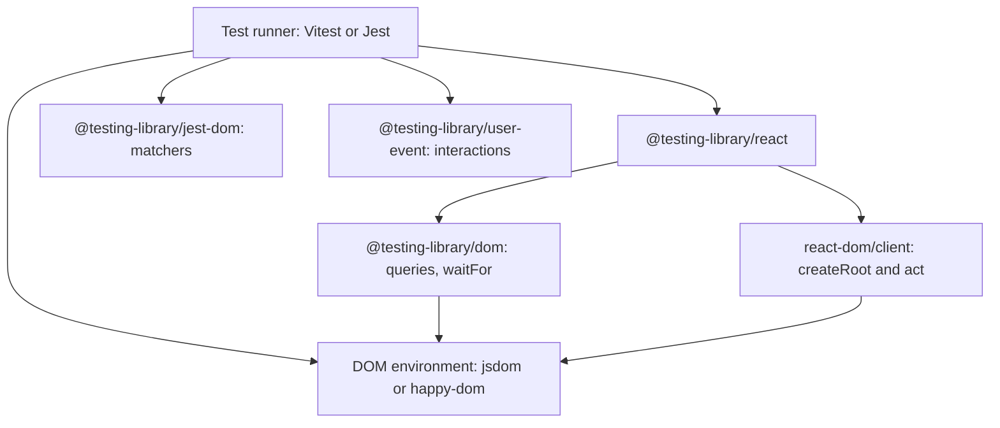
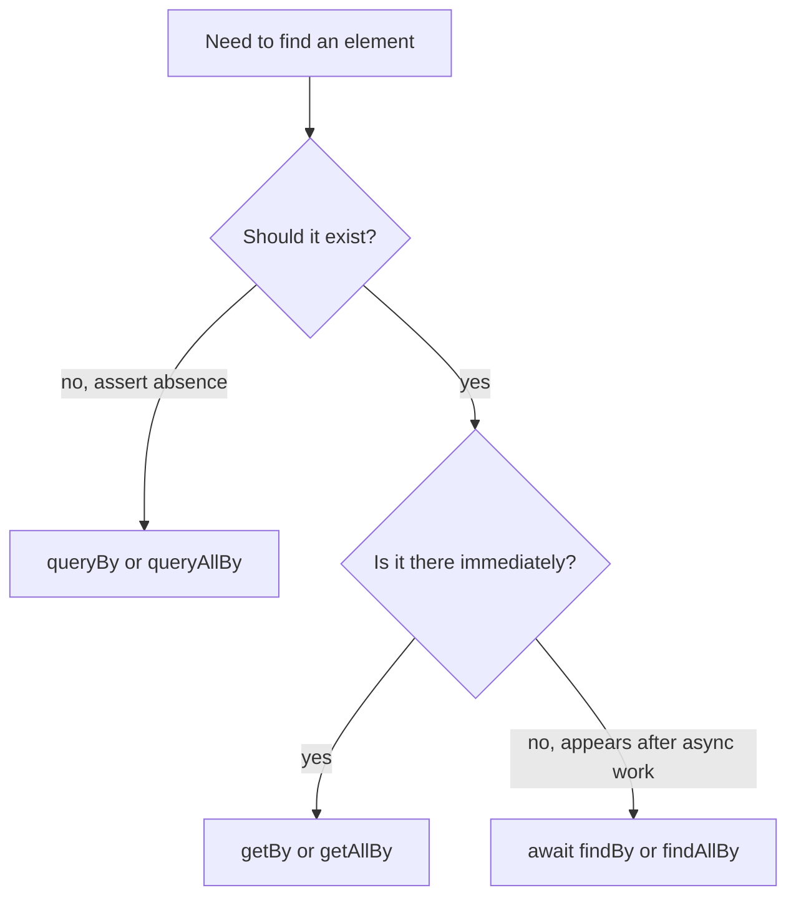
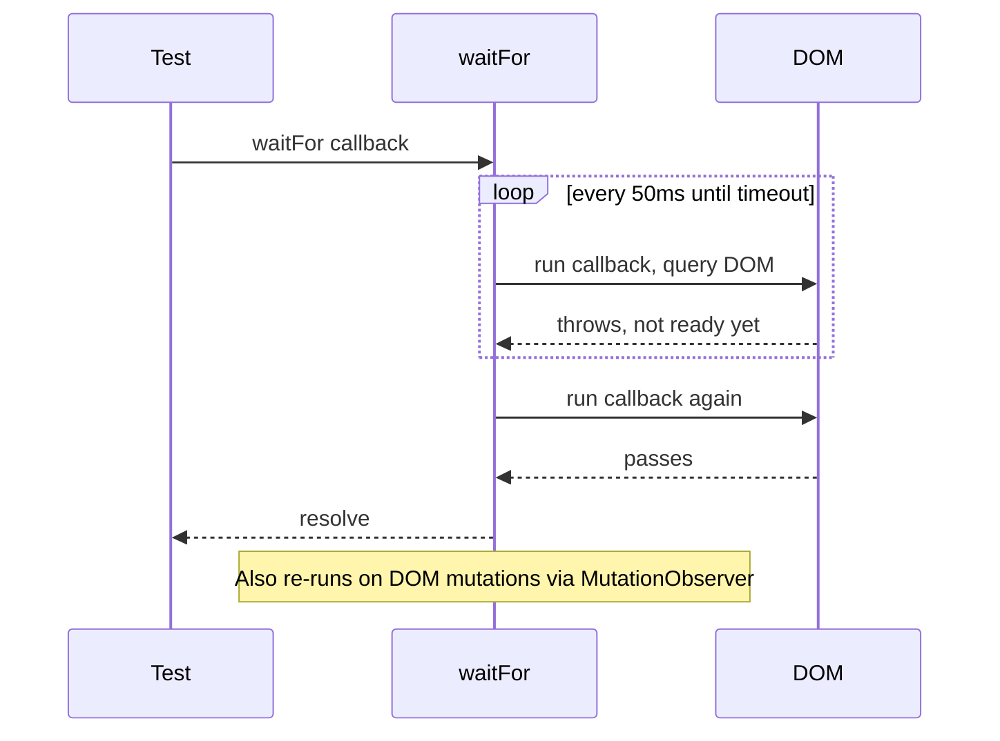
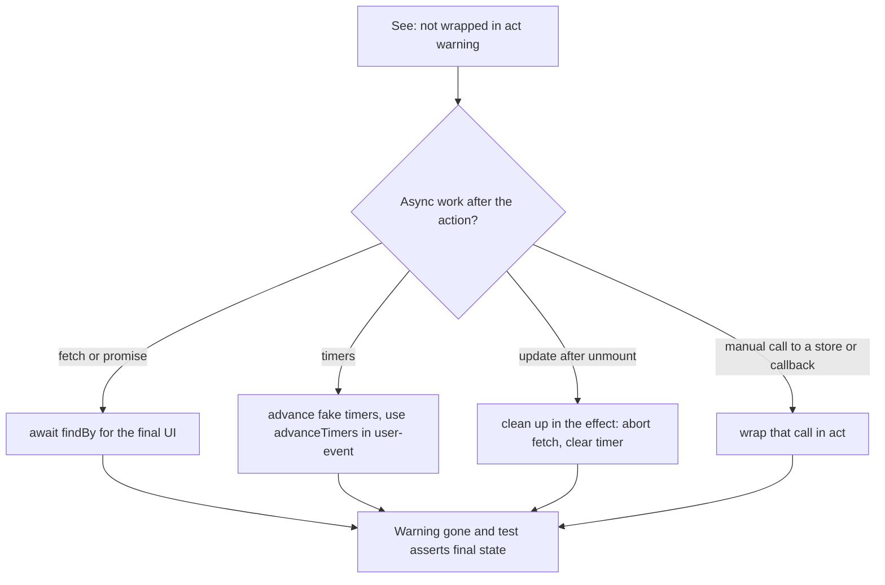
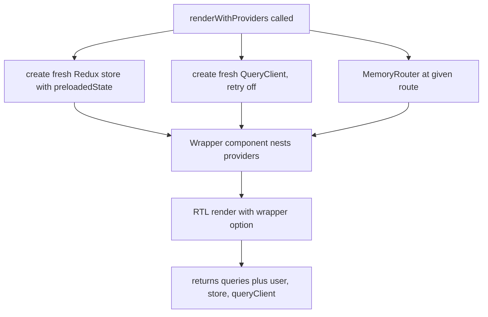
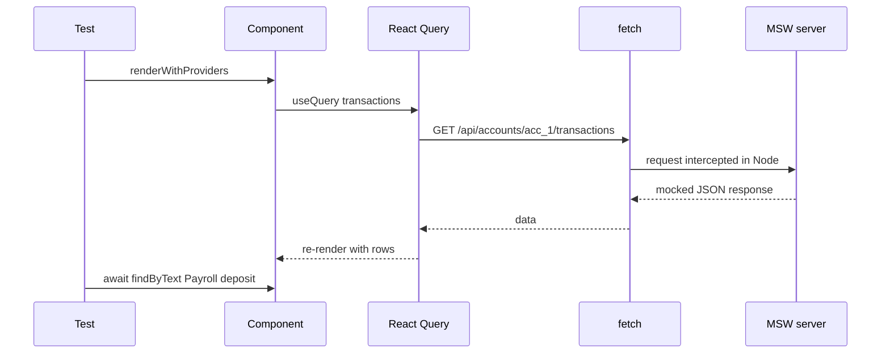

## 1. What it is

**React Testing Library (RTL) renders React components into a simulated DOM and gives you queries that find elements the way a user finds them: by role, label and visible text.**

Think of a mystery shopper. A mystery shopper does not walk into the kitchen to check how the chef stores the onions. They sit at a table, read the menu, order, and judge what arrives. RTL makes your tests behave like that shopper. The test reads labels, clicks buttons and checks what appears on the screen. It never looks at component state, props or hooks directly.

The problem it solves: older tools (Enzyme) let tests reach into component internals, such as `wrapper.state('balance')`. Those tests broke every time you refactored, even when the app still worked, and they passed even when the app was broken for real users. RTL removes those escape hatches, so a passing test means "a user can do this", and a refactor that keeps behavior the same keeps tests green.

## 2. Core concepts

### [Beginner] The guiding principle

The library is built on one sentence from its author, Kent C. Dodds:

> "The more your tests resemble the way your software is used, the more confidence they can give you."

Your software has two kinds of users:

1. **End users** who see the screen, click, type and use assistive tech such as screen readers.
2. **Developers** who render the component with props.

Your tests should only use what these two users can use: props in, DOM out. Internal state, private functions, class names chosen for styling, and hook internals are **implementation details**. If a test depends on them, it is testing *how* the code works instead of *what* it does.

```tsx
// BAD: implementation detail. Breaks if you rename state or switch to useReducer.
// (Enzyme style, shown only to contrast)
// expect(wrapper.state('isOpen')).toBe(true);

// GOOD: behavior. Survives any refactor that keeps the UI the same.
import { render, screen } from '@testing-library/react';
import userEvent from '@testing-library/user-event';
import { AccountMenu } from './AccountMenu';

test('opens the account menu', async () => {
  const user = userEvent.setup();
  render(<AccountMenu accountId="acc_123" />);

  await user.click(screen.getByRole('button', { name: /account options/i }));

  expect(screen.getByRole('menuitem', { name: /download statement/i })).toBeInTheDocument();
});
```

> **Why:** A test has two jobs: fail when users are broken (no false negatives) and pass when users are fine (no false positives). Implementation-detail tests fail at both. They break on safe refactors and miss real bugs, like a button that exists in state but is hidden by CSS.

### [Beginner] How RTL fits in the test stack

RTL is not a test runner. It is a small layer on top of other tools.



- **Vitest/Jest** finds test files, runs them, and gives you `test`, `expect`, mocks.
- **jsdom** is a JavaScript implementation of the browser DOM that runs in Node. No real pixels, no layout.
- **@testing-library/dom** holds the queries (`getByRole` and friends). It works with any framework.
- **@testing-library/react** adds `render`, `renderHook`, automatic cleanup and `act` wrapping for React.

> **Gotcha:** jsdom has no layout engine. `getBoundingClientRect()` returns zeros, CSS media queries do not apply, and charts that measure their container render nothing. Test those visually in Storybook or with Playwright instead.

### [Beginner] `render` and `screen`

`render` mounts a component into a `<div>` appended to `document.body`. `screen` is an object with every query pre-bound to `document.body`.

```tsx
import { render, screen } from '@testing-library/react';
import { BalanceCard } from './BalanceCard';

test('shows the formatted balance', () => {
  render(<BalanceCard balanceCents={123456} currency="USD" />);

  // screen queries search the whole document.body
  expect(screen.getByText('$1,234.56')).toBeInTheDocument();
});
```

`render` also returns things you sometimes need:

```tsx
const { rerender, unmount, container, asFragment } = render(
  <BalanceCard balanceCents={100} currency="USD" />,
);

rerender(<BalanceCard balanceCents={200} currency="USD" />); // new props, same component instance
unmount();                                                   // test cleanup logic, e.g. timers cleared
```

> **Why use `screen` instead of destructuring queries from `render`?** You do not have to keep the return value in sync as the test grows, and editors autocomplete `screen.` well. It also matches reality: users see the whole screen, including portals like modals that render outside your component's container.

> **Gotcha:** Avoid `container.querySelector('.balance')`. It is an escape hatch that ties the test to markup and class names. If you need it, ask first whether the element is missing an accessible role or label.

### [Beginner] Query types: getBy, queryBy, findBy

Every query comes in three flavors (plus an `All` version of each). The flavor decides what happens when the element is missing and whether the query waits.

| Flavor | 0 matches | 1 match | 2+ matches | Async? | Use when |
|---|---|---|---|---|---|
| `getBy...` | throws | returns element | throws | no | element should be there now |
| `queryBy...` | returns `null` | returns element | throws | no | asserting something is NOT there |
| `findBy...` | rejects after timeout | resolves element | rejects | yes, returns Promise | element appears later (after fetch, timer) |
| `getAllBy...` | throws | array | array | no | several elements expected now |
| `queryAllBy...` | `[]` | array | array | no | count may be zero |
| `findAllBy...` | rejects | array | array | yes | several elements appear later |

```tsx
// getBy: it must be there right now
expect(screen.getByRole('heading', { name: /portfolio/i })).toBeInTheDocument();

// queryBy: proving absence. getBy would throw before expect runs.
expect(screen.queryByRole('alert')).not.toBeInTheDocument();

// findBy: waits (default 1000 ms) for async UI, e.g. data loaded from an API
expect(await screen.findByText('Checking ••••4821')).toBeInTheDocument();

// *AllBy: lists
const rows = screen.getAllByRole('row');
expect(rows).toHaveLength(1 + 3); // header row + 3 transactions
```



> **Why do getBy errors matter?** When `getBy` fails it prints the current DOM and a list of accessible roles. That message is often all you need to debug. `queryBy` + `expect(...).toBeInTheDocument()` gives a worse message, so only use `queryBy` for absence.

> **Interview tip:** Say "getBy throws, queryBy returns null, findBy returns a promise and retries". Then add that `findBy` is just `waitFor` + `getBy` combined.

### [Beginner] Query priority and why accessibility drives it

The official priority list, from best to worst:

1. **Accessible to everyone**
   - `ByRole` — buttons, links, headings, textboxes, rows, dialogs. Filter by `name`.
   - `ByLabelText` — form fields by their `<label>`.
   - `ByPlaceholderText` — only if there is no label (a placeholder is not a label).
   - `ByText` — non-interactive text: paragraphs, divs, spans.
   - `ByDisplayValue` — current value of an input, select or textarea.
2. **Semantic queries**
   - `ByAltText` — images.
   - `ByTitle` — the `title` attribute (poorly announced by screen readers).
3. **Test IDs**
   - `ByTestId` — `data-testid`. Invisible to users. Last resort.

```tsx
// Best: role + accessible name
screen.getByRole('button', { name: 'Transfer funds' });
screen.getByRole('textbox', { name: /amount/i });
screen.getByRole('heading', { level: 2, name: 'Recent transactions' });
screen.getByRole('checkbox', { name: /save as payee/i, checked: false });

// Good for forms
screen.getByLabelText('Routing number');

// Last resort: no user can see a test id
screen.getByTestId('portfolio-chart-canvas');
```

**Why this order?** `ByRole` uses the same information a screen reader uses: the element's ARIA role and its computed accessible name. If `getByRole('button', { name: 'Transfer funds' })` cannot find your button, then a blind user cannot find it either. Your test becomes a free accessibility check. A `<div onClick>` styled to look like a button will fail the query, which is correct, because it is also not focusable and not announced as a button.

```tsx
// This passes getByTestId but fails getByRole. The test is telling you the truth.
<div data-testid="submit" className="btn" onClick={submit}>Submit</div>

// Fix the component, not the test:
<button type="submit">Submit</button>
```

> **Finance tip:** Financial apps often have legal accessibility requirements (ADA in the US, the European Accessibility Act in force since June 2025). ByRole-first tests catch missing labels on amount fields, unlabeled icon buttons ("download statement"), and tables without headers before an audit does.

> **Gotcha:** `getByRole` is the slowest query because it computes accessibility for many elements. On a huge table it can take hundreds of milliseconds. Scope it with `within(row)`, or pass `{ hidden: true }` only when you mean it. Speed is rarely worth switching to test IDs.

### [Intermediate] Text matching: strings, regex, functions

Queries accept a string (exact, after trimming and collapsing whitespace), a regex, or a function.

```tsx
screen.getByText('Pending');                 // exact full-string match
screen.getByText(/pending/i);                // substring, case-insensitive
screen.getByText('Pend', { exact: false });  // substring, case-insensitive

// Function matcher: when text is split across elements, e.g. <span>$</span><span>1,234</span>
screen.getByText((_content, element) =>
  element?.textContent === '$1,234.00' && element.tagName === 'P',
);
```

> **Gotcha:** `Intl.NumberFormat` output can contain non-breaking spaces (`'1.234,56 €'` in `de-DE`). The default normalizer collapses whitespace, including NBSP, so `getByText('1.234,56 €')` usually works. A plain `expect(el.textContent).toBe('1.234,56 €')` does not. Prefer RTL queries or jest-dom matchers over raw string equality.

### [Intermediate] `within`: scoping queries to part of the page

`within(element)` returns the same queries, bound to that element. Use it when the same text appears several times, such as a "Cancel" button in every row.

```tsx
import { render, screen, within } from '@testing-library/react';

test('shows status per transaction row', () => {
  render(<TransactionTable transactions={fixtures} />);

  const row = screen.getByRole('row', { name: /coffee shop/i });
  expect(within(row).getByRole('cell', { name: '-$4.50' })).toBeInTheDocument();
  expect(within(row).getByText(/pending/i)).toBeInTheDocument();
});

test('confirm dialog', async () => {
  const user = userEvent.setup();
  render(<TransferForm />);
  await user.click(screen.getByRole('button', { name: /review transfer/i }));

  const dialog = screen.getByRole('dialog', { name: /confirm transfer/i });
  await user.click(within(dialog).getByRole('button', { name: /confirm/i }));
});
```

> **Why:** Without scoping you would write `getAllByText('Pending')[2]`. Index-based tests break when sort order changes and say nothing about which row you meant.

### [Intermediate] `waitFor` and async UI

Most real components fetch data, debounce input, or animate. `waitFor(callback)` runs the callback repeatedly (every 50 ms by default) until it stops throwing or the timeout (1000 ms default) is reached.

```tsx
import { render, screen, waitFor, waitForElementToBeRemoved } from '@testing-library/react';

test('loads holdings', async () => {
  render(<Holdings portfolioId="pf_1" />);

  // Wait for the spinner to go away
  await waitForElementToBeRemoved(() => screen.queryByRole('progressbar'));

  // Or wait for an assertion to become true
  await waitFor(() => {
    expect(screen.getAllByRole('row')).toHaveLength(4);
  });
});
```



Rules for `waitFor`:

```tsx
// BAD: side effect inside waitFor. It may click 20 times.
await waitFor(async () => {
  await user.click(button);
  expect(screen.getByText('Saved')).toBeInTheDocument();
});

// BAD: empty callback. It passes immediately and waits for nothing.
await waitFor(() => {});

// BAD: many assertions. If the first fails, you wait the whole timeout before seeing why.
// GOOD: one assertion inside, the rest after.
await user.click(button);
await waitFor(() => expect(saveTransaction).toHaveBeenCalledTimes(1));
expect(screen.getByRole('status')).toHaveTextContent('Saved');

// BETTER when waiting for an element: findBy
expect(await screen.findByRole('status')).toHaveTextContent('Saved');
```

> **Interview tip:** Say "Put only assertions inside waitFor, never side effects, and prefer findBy when waiting for an element to appear."

### [Intermediate] `act` and the "not wrapped in act" warning

React batches state updates and runs effects later. `act()` tells React: "flush every pending update and effect before you return". Then the DOM is in its final state when you assert.

RTL already wraps `render`, `rerender`, `fireEvent`, user-event interactions, `waitFor` and `findBy` in `act`. So you almost never call `act` yourself.

The famous warning:

```
Warning: An update to TransactionList inside a test was not wrapped in act(...).
```

It means a state update happened **after** your test finished looking, outside any `act`. Usually: a fetch resolved, a timer fired, or a promise settled after your last assertion. The test may pass while asserting on stale UI.

```tsx
// Causes the warning: the fetch resolves after the test ends
test('renders list', () => {
  render(<TransactionList accountId="acc_1" />);
  expect(screen.getByText(/loading/i)).toBeInTheDocument();
  // test ends, then fetch resolves and calls setState -> warning
});

// Fix: wait for the final state the user would see
test('renders list', async () => {
  render(<TransactionList accountId="acc_1" />);
  expect(screen.getByText(/loading/i)).toBeInTheDocument();
  expect(await screen.findByText('Payroll deposit')).toBeInTheDocument();
});
```



When you really need `act` (calling something outside React's event system):

```tsx
import { act } from 'react'; // React 18.3+ and 19. Old path: react-dom/test-utils (deprecated)

act(() => {
  sessionStore.getState().expire(); // a Zustand/Redux store update triggered directly
});
expect(screen.getByRole('dialog', { name: /session expired/i })).toBeInTheDocument();
```

> **Outdated:** `import { act } from 'react-dom/test-utils'` is deprecated since React 18.3 (it logs a warning), and React 19 removed every other `test-utils` export. Import `act` from `react`, or use the one RTL re-exports.

> **Gotcha:** Do not silence the warning by wrapping everything in `act`. The warning is telling you the test does not wait for what the user eventually sees.

### [Intermediate] `renderHook` for custom hooks

`renderHook` mounts a tiny test component that calls your hook. Use it for reusable hooks with no UI, like `useCurrencyFormatter` or `useDebouncedValue`. It moved into RTL in v13.1; the separate `@testing-library/react-hooks` package is deprecated.

```tsx
import { renderHook, act } from '@testing-library/react';
import { useRunningBalance } from './useRunningBalance';

test('adds transactions to the running balance', () => {
  const { result, rerender } = renderHook(
    ({ startingCents }) => useRunningBalance(startingCents),
    { initialProps: { startingCents: 10_000 } },
  );

  expect(result.current.balanceCents).toBe(10_000);

  act(() => {
    result.current.apply({ id: 'tx_1', amountCents: -2_500 });
  });
  expect(result.current.balanceCents).toBe(7_500);

  rerender({ startingCents: 0 }); // change hook arguments
});
```

> **Why `result.current`?** The hook re-runs on every render and returns a new value each time. `result.current` always points to the latest return value. Do not destructure it at the top of the test, or you keep a stale snapshot.

> **Gotcha:** If a hook is only used by one component, test it through that component. Hook tests are closer to implementation details.

### [Advanced] Custom render with providers

Real components need context: React Query's `QueryClient`, a router, a Redux store, a theme, an auth provider. Instead of repeating providers in every test, create one `renderWithProviders` helper.

```tsx
// src/test/render.tsx
import type { ReactElement, ReactNode } from 'react';
import { render, type RenderOptions } from '@testing-library/react';
import { QueryClient, QueryClientProvider } from '@tanstack/react-query';
import { MemoryRouter } from 'react-router'; // React Router v7 package name
import { Provider } from 'react-redux';
import { configureStore } from '@reduxjs/toolkit';
import userEvent from '@testing-library/user-event';
import { rootReducer, type RootState } from '@/store';

interface ExtendedOptions extends Omit<RenderOptions, 'wrapper'> {
  preloadedState?: Partial<RootState>;
  route?: string;
}

export function createTestQueryClient() {
  return new QueryClient({
    defaultOptions: {
      queries: { retry: false, gcTime: Infinity }, // no retries: failures surface immediately
      mutations: { retry: false },
    },
  });
}

export function renderWithProviders(
  ui: ReactElement,
  { preloadedState, route = '/', ...options }: ExtendedOptions = {},
) {
  const store = configureStore({ reducer: rootReducer, preloadedState });
  const queryClient = createTestQueryClient(); // NEW client per test: no cache leaks between tests

  function Wrapper({ children }: { children: ReactNode }) {
    return (
      <Provider store={store}>
        <QueryClientProvider client={queryClient}>
          <MemoryRouter initialEntries={[route]}>{children}</MemoryRouter>
        </QueryClientProvider>
      </Provider>
    );
  }

  return {
    user: userEvent.setup(),
    store,
    queryClient,
    ...render(ui, { wrapper: Wrapper, ...options }),
  };
}

// Re-export everything so tests import from one place
export * from '@testing-library/react';
```

Using it:

```tsx
import { renderWithProviders, screen } from '@/test/render';
import { AccountPage } from './AccountPage';

test('shows the selected account from Redux and the route', async () => {
  const { user } = renderWithProviders(<AccountPage />, {
    route: '/accounts/acc_123',
    preloadedState: { session: { userId: 'u_1', currency: 'EUR' } },
  });

  expect(await screen.findByRole('heading', { name: /checking/i })).toBeInTheDocument();
  await user.click(screen.getByRole('tab', { name: /statements/i }));
});
```



> **Gotcha:** Creating the `QueryClient` at module level shares cache between tests. Test B then sees Test A's data and passes or fails depending on order. Always create it inside the helper.

> **Gotcha:** React Query retries failed queries 3 times with backoff by default. In a test that checks an error state, that means seconds of waiting and a `findBy` timeout. Set `retry: false`.

> **Finance tip:** If routes are protected by Okta (`@okta/okta-react` `SecureRoute` or a custom guard), do not run the real OAuth flow in component tests. Provide a fake auth context in the wrapper with an authenticated user, and write one separate test for the unauthenticated redirect.

### [Advanced] Testing async data with MSW

Mocking `fetch` or your API module with `vi.mock` makes tests know about your data layer. **Mock Service Worker (MSW)** intercepts requests at the network level instead. Your component, React Query, Axios and interceptors all run for real. Only the server is fake.

```ts
// src/test/handlers.ts  (MSW v2 API)
import { http, HttpResponse, delay } from 'msw';

export const handlers = [
  http.get('/api/accounts/:accountId/transactions', async ({ params, request }) => {
    const url = new URL(request.url);
    const page = Number(url.searchParams.get('page') ?? '1');
    await delay(50);
    return HttpResponse.json({
      accountId: params.accountId,
      page,
      items: [
        { id: 'tx_1', description: 'Payroll deposit', amountCents: 250_000, currency: 'USD' },
        { id: 'tx_2', description: 'Rent', amountCents: -120_000, currency: 'USD' },
      ],
    });
  }),
];
```

```ts
// src/test/server.ts
import { setupServer } from 'msw/node';
import { handlers } from './handlers';
export const server = setupServer(...handlers);
```

```ts
// src/test/setup.ts
import '@testing-library/jest-dom/vitest';
import { afterAll, afterEach, beforeAll } from 'vitest';
import { cleanup } from '@testing-library/react';
import { server } from './server';

beforeAll(() => server.listen({ onUnhandledRequest: 'error' })); // fail on any unmocked call
afterEach(() => {
  server.resetHandlers(); // remove per-test overrides
  cleanup();
});
afterAll(() => server.close());
```

Overriding per test, for errors and edge cases:

```tsx
import { http, HttpResponse } from 'msw';
import { server } from '@/test/server';

test('shows an error when transactions fail to load', async () => {
  server.use(
    http.get('/api/accounts/:accountId/transactions', () =>
      HttpResponse.json({ message: 'Upstream ledger unavailable' }, { status: 503 }),
    ),
  );

  renderWithProviders(<TransactionList accountId="acc_1" />);

  expect(await screen.findByRole('alert')).toHaveTextContent(/could not load transactions/i);
});
```



> **Why MSW over `vi.mock('./api')`?** With a module mock, a bug in your API client (wrong URL, missing auth header, wrong query string) never shows up. With MSW the real client runs. Bonus: the same handlers power Storybook and local development.

> **Gotcha:** MSW mocks are your guess at the API. If the backend renames `amountCents` to `amount`, MSW tests stay green and production breaks. Contract tests (Pact) close that gap.

### [Advanced] Debugging tools

When a query fails, look at what the test actually sees.

```tsx
import { render, screen, logRoles, prettyDOM } from '@testing-library/react';

render(<TransferForm />);

screen.debug();                                 // pretty-prints document.body (truncated at 7000 chars)
screen.debug(screen.getByRole('form'));         // print one element
screen.debug(undefined, 30_000);                // raise the limit for big trees

logRoles(document.body);                        // every role and accessible name, great for ByRole
console.log(prettyDOM(someElement, 2_000));     // same printer, returns a string

screen.logTestingPlaygroundURL();               // prints a link to testing-playground.com with your DOM
```

- **`logRoles`** answers "what role and name does my element actually have?" Output looks like `button: Name "Transfer funds"`.
- **Testing Playground** (testing-playground.com, also a browser extension) lets you click an element and suggests the best query by priority.
- Set `DEBUG_PRINT_LIMIT=20000` as an env var to increase the auto-printed DOM on errors.
- Run a single test with `test.only` or the Vitest UI (`vitest --ui`) to focus.

> **Interview tip:** Mentioning `logRoles` and Testing Playground signals you actually debug RTL tests rather than falling back to `data-testid`.

## 3. Why it's used in this project

Financial UIs are mostly forms, tables and states. RTL tests exactly those things from the user's side.

- **Money input forms.** Transfer and payment forms must label every field, show validation errors in an `alert` or with `aria-describedby`, and disable submit while pending. RTL with ByRole checks all of that at once.
- **Transaction tables.** Tests use `getByRole('row', { name: /payroll/i })` and `within(row)` to check amounts, signs, and status badges without depending on column order in the markup.
- **Loading and error states.** Ledger and market-data APIs are slow or flaky. MSW + `findBy` tests prove the spinner, the empty state ("No transactions in this period"), and the 503 error banner all render correctly.
- **Currency and locale formatting.** Render with `currency="EUR"` and a `de-DE` locale provider, assert `1.234,56 €`. These bugs are common and costly in finance.
- **Session timeouts.** Compliance often requires auto-logout after inactivity. With fake timers you can render the app, advance 14 minutes, assert the "Your session is about to expire" dialog, then advance more and assert the redirect.
- **PII masking.** Assert that an account number renders as `••••4821` and that `queryByText('123456784821')` is `null`. This is a cheap, permanent guard against leaking data on screen.
- **Role-based UI.** Render with a `viewer` vs `approver` user in the wrapper; assert the "Approve payment" button exists only for approvers.

> **Finance tip:** Write one test per regulated behavior (masking, timeout, confirmation step before money moves). When auditors ask how you ensure it, the test file is the evidence.

## 4. Setup & configuration

Install (Vite + Vitest project):

```bash
npm i -D vitest jsdom @testing-library/react @testing-library/dom \
  @testing-library/jest-dom @testing-library/user-event msw
```

> **Outdated:** Since RTL v16, `@testing-library/dom` is a **peer dependency**. You must install it yourself. Older setups only listed `@testing-library/react`.

`vitest.config.ts` (or the `test` key inside `vite.config.ts`):

```ts
import { defineConfig } from 'vitest/config';
import react from '@vitejs/plugin-react';
import path from 'node:path';

export default defineConfig({
  plugins: [react()],
  resolve: {
    alias: { '@': path.resolve(__dirname, 'src') }, // match tsconfig paths
  },
  test: {
    environment: 'jsdom',            // simulated browser DOM. 'happy-dom' is faster but less complete
    globals: true,                   // expose test/expect/afterEach globally. Lets RTL auto-cleanup
    setupFiles: ['./src/test/setup.ts'], // runs before each test file: matchers, MSW, cleanup
    css: false,                      // skip processing CSS: faster, jsdom ignores layout anyway
    restoreMocks: true,              // restore vi.spyOn mocks after each test
    clearMocks: true,                // reset call counts between tests
    coverage: {
      provider: 'v8',                // native V8 coverage, fast
      reporter: ['text', 'html', 'lcov'],
      include: ['src/**/*.{ts,tsx}'],
      exclude: ['src/**/*.stories.tsx', 'src/test/**'],
    },
  },
});
```

`src/test/setup.ts`:

```ts
import '@testing-library/jest-dom/vitest';   // adds toBeInTheDocument etc. + TS types
import { cleanup, configure } from '@testing-library/react';
import { afterAll, afterEach, beforeAll } from 'vitest';
import { server } from './server';

configure({
  asyncUtilTimeout: 2000,          // default findBy/waitFor timeout is 1000ms. CI machines are slower
  testIdAttribute: 'data-testid',  // change if your team uses data-test or data-qa
});

beforeAll(() => server.listen({ onUnhandledRequest: 'error' }));
afterEach(() => {
  server.resetHandlers();
  cleanup();                       // unmount rendered trees. Needed explicitly if globals: false
});
afterAll(() => server.close());
```

`tsconfig.json` (or a `tsconfig.test.json`) types:

```json
{
  "compilerOptions": {
    "types": ["vitest/globals", "@testing-library/jest-dom"]
  }
}
```

> **Gotcha:** RTL auto-cleanup works by calling `afterEach` if it exists globally. With Vitest and `globals: false`, it does not exist, so rendered components pile up across tests and you get "Found multiple elements" errors. Either set `globals: true` or call `cleanup()` in `afterEach`.

For Jest instead of Vitest: set `testEnvironment: 'jsdom'` (install `jest-environment-jsdom` separately since Jest 28), point `setupFilesAfterEnv: ['<rootDir>/src/test/setup.ts']` at the setup file, and import `@testing-library/jest-dom` without `/vitest`.

## 5. Key features we use

### [Beginner] Testing a form submit

```tsx
test('submits a transfer with amount in cents', async () => {
  const onSubmit = vi.fn();
  const { user } = renderWithProviders(<TransferForm onSubmit={onSubmit} />);

  await user.selectOptions(screen.getByLabelText(/from account/i), 'acc_checking');
  await user.type(screen.getByLabelText(/amount/i), '250.75');
  await user.click(screen.getByRole('button', { name: /review transfer/i }));

  expect(onSubmit).toHaveBeenCalledWith({
    fromAccountId: 'acc_checking',
    amountCents: 25_075,
    currency: 'USD',
  });
});
```

### [Beginner] Validation errors

```tsx
test('rejects an amount above the available balance', async () => {
  const { user } = renderWithProviders(<TransferForm availableCents={10_000} />);

  await user.type(screen.getByRole('textbox', { name: /amount/i }), '500');
  await user.click(screen.getByRole('button', { name: /review transfer/i }));

  const amount = screen.getByRole('textbox', { name: /amount/i });
  expect(amount).toHaveAccessibleErrorMessage(/exceeds available balance/i);
  expect(amount).toBeInvalid();
});
```

### [Intermediate] Absence and masking

```tsx
test('never shows the full account number', () => {
  render(<AccountSummary account={{ id: 'acc_1', number: '000123456784821', type: 'checking' }} />);

  expect(screen.getByText('••••4821')).toBeInTheDocument();
  expect(screen.queryByText(/000123456784821/)).not.toBeInTheDocument();
});
```

### [Intermediate] Session timeout with fake timers

```tsx
test('warns before the session expires', async () => {
  vi.useFakeTimers();
  const user = userEvent.setup({ advanceTimers: vi.advanceTimersByTime });
  renderWithProviders(<AppShell />);

  act(() => vi.advanceTimersByTime(14 * 60_000));
  expect(screen.getByRole('alertdialog', { name: /session expiring/i })).toBeInTheDocument();

  await user.click(screen.getByRole('button', { name: /stay signed in/i }));
  expect(screen.queryByRole('alertdialog')).not.toBeInTheDocument();

  vi.useRealTimers();
});
```

### [Intermediate] Table rows with `within`

```tsx
test('negative amounts are labelled as debits', async () => {
  renderWithProviders(<TransactionList accountId="acc_1" />);

  const rentRow = await screen.findByRole('row', { name: /rent/i });
  expect(within(rentRow).getByText('-$1,200.00')).toBeInTheDocument();
  expect(within(rentRow).getByText(/debit/i)).toBeInTheDocument();
});
```

### [Advanced] Asserting a request body with MSW

```tsx
test('sends an idempotency key with the payment', async () => {
  let captured: Request | undefined;
  server.use(
    http.post('/api/payments', async ({ request }) => {
      captured = request.clone();
      return HttpResponse.json({ id: 'pay_1', status: 'PENDING' }, { status: 201 });
    }),
  );

  const { user } = renderWithProviders(<PayBillForm />);
  await user.type(screen.getByLabelText(/amount/i), '42.00');
  await user.click(screen.getByRole('button', { name: /pay now/i }));

  expect(await screen.findByRole('status')).toHaveTextContent(/payment pending/i);
  expect(captured?.headers.get('Idempotency-Key')).toMatch(/^[0-9a-f-]{36}$/);
  expect(await captured?.json()).toMatchObject({ amountCents: 4200, currency: 'USD' });
});
```

> **Gotcha:** Asserting on the request is fine for things the user cannot see but must be correct (idempotency keys, amounts in cents). Do not use it as a substitute for checking what the user sees.

## 6. Interview questions

#### Q: What is the difference between getBy, queryBy and findBy?

- `getBy` is synchronous and throws if there are zero or more than one matches. Use it when the element must be present now.
- `queryBy` is synchronous and returns `null` for zero matches (still throws for multiple). Use it only to assert absence: `expect(screen.queryByRole('alert')).not.toBeInTheDocument()`.
- `findBy` returns a promise. It retries `getBy` until it succeeds or times out (1000 ms default). Use it for elements that appear after async work.
- Each has an `All` version returning arrays; `queryAllBy` returns `[]` instead of throwing.

#### Q: Why does RTL recommend getByRole over getByTestId?

`getByRole` finds elements by their ARIA role and accessible name, which is how assistive technology sees the page. If the query works, a screen-reader user can find the element too, so tests double as accessibility checks. It also ties tests to user-visible behavior, not markup. `data-testid` is invisible to users, gives no accessibility guarantee, and must be added to production code just for tests. Use it only when no accessible query works, such as a canvas chart.

#### Q: What does the "not wrapped in act(...)" warning mean and how do you fix it?

React saw a state update that happened outside `act`, typically after the test's last assertion: a fetch resolved, a timer fired, or a promise settled. It means the test did not wait for the final UI. Fix it by waiting for the user-visible result (`await screen.findBy...`), advancing fake timers, cleaning up effects on unmount (abort controllers, clearTimeout), or, for direct store updates outside React events, wrapping that call in `act`. Do not just wrap random code in `act` to hide it.

#### Q: How do you test a component that uses React Query, Redux and React Router?

Create a custom render helper that wraps the UI in all providers through RTL's `wrapper` option. Create a fresh `QueryClient` (with `retry: false`) and a fresh Redux store (with `preloadedState`) inside the helper on every call, so tests do not share cache or state. Use `MemoryRouter` with `initialEntries` to start at a route. Mock the network with MSW rather than mocking hooks, so the real data layer runs. Re-export RTL from the helper module so tests import from one place.

#### Q: When would you use renderHook, and what are its limits?

Use `renderHook` for reusable custom hooks with logic worth testing in isolation, such as a debounced search or a currency formatter. It returns `result.current` (the latest return value), `rerender(newProps)` and `unmount`. Wrap direct calls that change state in `act`. Accept a `wrapper` for providers. Limits: if the hook is only used by one component, test through the component instead. Hook tests can drift toward implementation details, and they say nothing about how the UI uses the hook.

#### Q: How do you handle async waiting correctly with waitFor?

Put only assertions inside `waitFor`, ideally one. Never put side effects like clicks inside it, because the callback may run many times. Do not pass an empty callback. Prefer `findBy` when waiting for an element to appear, and `waitForElementToBeRemoved` for disappearance. If timing is driven by timers, use fake timers instead of waiting real time.

#### Q: Why use MSW instead of mocking fetch or your API module?

MSW intercepts at the network layer, so your real API client, headers, query strings, serialization and React Query logic all run. Tests are less coupled to implementation: you can switch from Axios to fetch without touching tests. The same handlers work in tests, Storybook and the browser during development. Override handlers per test with `server.use` for errors and edge cases, and set `onUnhandledRequest: 'error'` so unmocked calls fail loudly.

#### Q: Your test says "Unable to find an element with the role button and name Submit". How do you debug it?

Read the error: RTL prints the DOM and accessible roles. Then use `logRoles(container)` or `screen.debug()` to see actual roles and names. Common causes: the element is not rendered yet (use `findBy`), the accessible name is different (an icon button without `aria-label`, or text like "Submit payment"), the element is hidden (`hidden: true` or `aria-hidden`), or it is a `div` instead of a `button`. Testing Playground suggests the right query. Fix the component if it lacks semantics.

## 7. Drawbacks & pain points

- **jsdom is not a browser.** No layout, no real CSS, no `IntersectionObserver`, `ResizeObserver` or `matchMedia` unless you polyfill. Virtualized tables (TanStack Virtual, react-window) render zero rows because heights are 0.
- **`getByRole` can be slow** on large DOMs. Big tables with hundreds of rows make tests take seconds.
- **Async flakiness.** Default 1000 ms timeouts fail on slow CI. Real timers + debounce = flaky.
- **Provider boilerplate.** Without a shared wrapper every test repeats five providers.
- **False confidence from mocks.** MSW handlers drift from the real API.
- **Learning curve on accessibility.** Developers must learn roles (`row`, `cell`, `combobox`, `alertdialog`) and accessible names to write good queries.

Gotchas that trip devs up:

```tsx
// 1. Forgetting await on async APIs: test passes before anything happens
user.click(button);                 // missing await
expect(onSubmit).toHaveBeenCalled(); // flaky or false failure

// 2. Using getBy to assert absence: throws before expect runs
expect(screen.getByText('Error')).not.toBeInTheDocument(); // throws "Unable to find"
expect(screen.queryByText('Error')).not.toBeInTheDocument(); // correct

// 3. Shared QueryClient: order-dependent tests
const queryClient = new QueryClient(); // module level - leaks cache between tests

// 4. Destructuring result.current in renderHook
const { balanceCents } = result.current; // stale after updates

// 5. Virtualized lists render nothing in jsdom
// Fix: mock the virtualizer to render all items, or give the scroll container a fixed size via a mock

// 6. findBy inside waitFor: double waiting, confusing timeouts
await waitFor(() => screen.findByText('Done')); // just: await screen.findByText('Done')
```

## 8. Better alternatives

RTL is still the standard for React component tests in 2026. The shift is not away from RTL, but toward running tests in **real browsers** for anything layout- or browser-API-dependent.

- **Vitest Browser Mode** (stable since Vitest 3, with Playwright as provider) runs component tests in real Chromium/Firefox/WebKit. Pair with `vitest-browser-react`, which offers a similar `render` + locator API. Fixes jsdom gaps (layout, virtualization, real CSS).
- **Playwright Component Testing** mounts components in a real browser using Playwright locators. Still marked experimental for a long time; check current status.
- **Cypress Component Testing** gives a visual runner with time travel. Heavier.
- **Storybook 8/9 interaction tests** (`play` functions using Testing Library queries) plus the Vitest addon, so stories become tests.
- **Enzyme** is dead. It never got an official React 18 adapter. Migrate.

| Tool | Runs in | Speed | Boilerplate | Devtools | Learning curve | TS support | Popularity | When it wins |
|---|---|---|---|---|---|---|---|---|
| RTL + Vitest/jsdom | Node, simulated DOM | very fast | low | screen.debug, playground | low | excellent | very high, default | most component and form logic |
| Vitest Browser Mode | real browser | fast | low-medium | browser devtools | low-medium | excellent | growing fast | layout, virtualization, real CSS |
| Playwright CT | real browser | medium | medium | trace viewer | medium | excellent | moderate | teams already on Playwright e2e |
| Cypress CT | real browser | medium-slow | medium | time-travel UI | medium | good | moderate, declining | visual debugging |
| Storybook interaction tests | real browser | medium | low if stories exist | Storybook UI | low-medium | good | high | design-system components |
| Enzyme | Node | fast | medium | none | medium | weak | dead | never for new code |

## 9. When NOT to use it

- **Layout, scrolling, sticky headers, responsive breakpoints.** jsdom cannot measure anything. Use Playwright or Vitest Browser Mode.
- **Canvas or SVG charts** (portfolio performance charts). Test the data transformation as a pure function and verify visuals with screenshot tests.
- **Full user journeys across pages with real auth** (Okta login, then transfer, then statement). That is e2e territory: Playwright.
- **Pure functions** like `formatCurrency(cents, 'EUR', 'de-DE')` or interest calculators. Plain unit tests are simpler and faster; no rendering needed.
- **Verifying the backend contract.** RTL + MSW cannot tell you the real API changed. Use contract tests.
- **Visual regression** (colors, spacing). Use Chromatic, Playwright screenshots, or Percy.

## Cheatsheet

| Need | API |
|---|---|
| Render | `render(<C />, { wrapper })` |
| Query whole page | `screen.getByRole('button', { name: /pay/i })` |
| Assert absence | `expect(screen.queryByText(/error/i)).not.toBeInTheDocument()` |
| Wait for element | `await screen.findByRole('row', { name: /rent/i })` |
| Wait for assertion | `await waitFor(() => expect(fn).toHaveBeenCalled())` |
| Wait for removal | `await waitForElementToBeRemoved(() => screen.queryByRole('progressbar'))` |
| Scope | `within(row).getByRole('cell', { name: '$5.00' })` |
| New props | `rerender(<C amountCents={200} />)` |
| Hook | `const { result } = renderHook(() => useX(), { wrapper })` |
| Manual flush | `act(() => store.dispatch(expire()))` (import from `react`) |
| Debug | `screen.debug()`, `logRoles(document.body)`, `screen.logTestingPlaygroundURL()` |
| Config | `configure({ asyncUtilTimeout: 2000, testIdAttribute: 'data-qa' })` |

```tsx
// Query priority: ByRole > ByLabelText > ByPlaceholderText > ByText > ByDisplayValue
//                 > ByAltText > ByTitle > ByTestId
// Variants: getBy (throw) | queryBy (null) | findBy (Promise) + AllBy versions
// ByRole options: name, level, checked, selected, pressed, expanded, hidden, description

import { renderWithProviders, screen, within } from '@/test/render';
import { http, HttpResponse } from 'msw';
import { server } from '@/test/server';

test('pattern', async () => {
  server.use(http.get('/api/accounts', () => HttpResponse.json([{ id: 'acc_1', name: 'Checking' }])));
  const { user } = renderWithProviders(<Accounts />, { route: '/accounts' });

  const row = await screen.findByRole('row', { name: /checking/i });
  await user.click(within(row).getByRole('button', { name: /details/i }));

  expect(screen.getByRole('heading', { name: /checking/i })).toBeInTheDocument();
  expect(screen.queryByRole('alert')).not.toBeInTheDocument();
});
```
