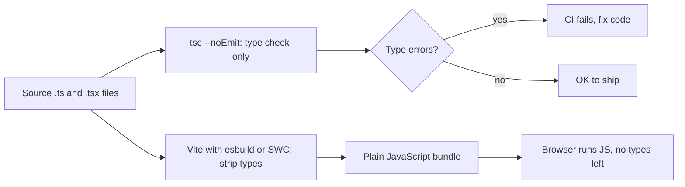
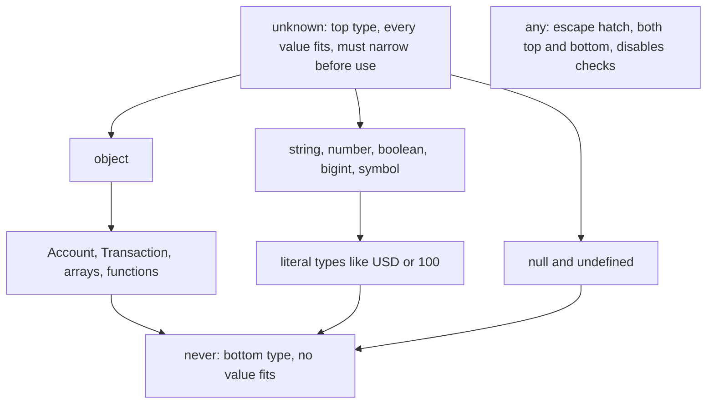
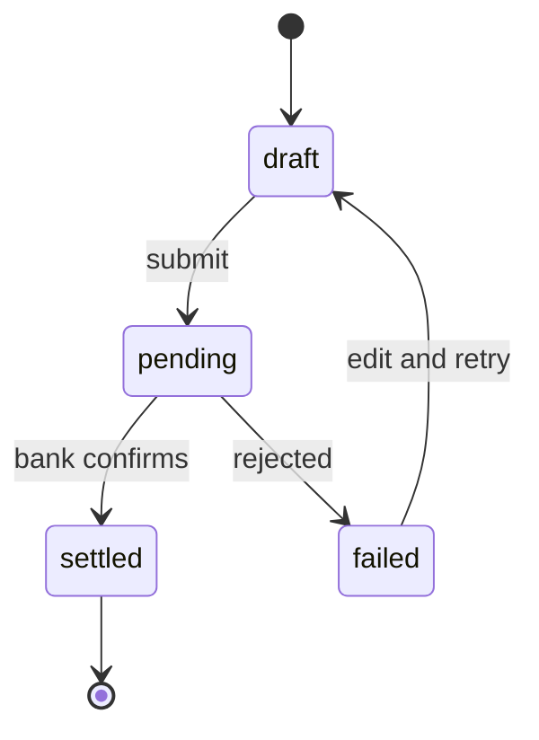
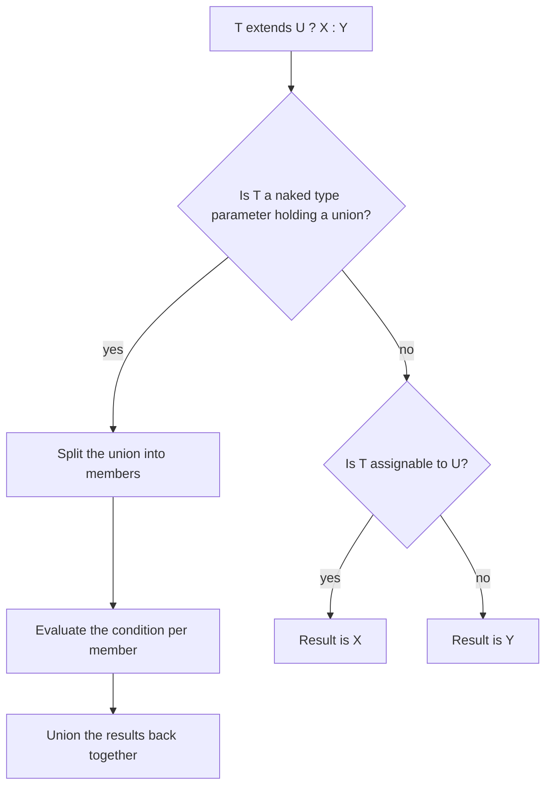
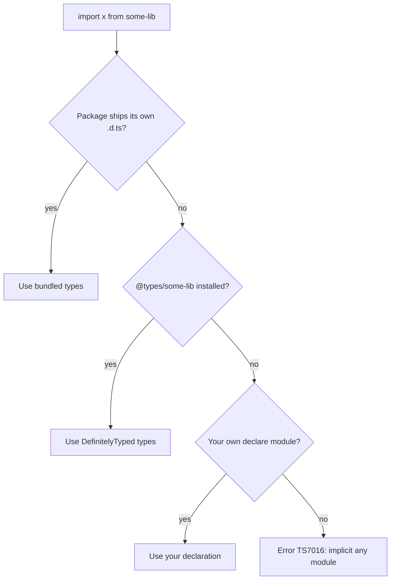
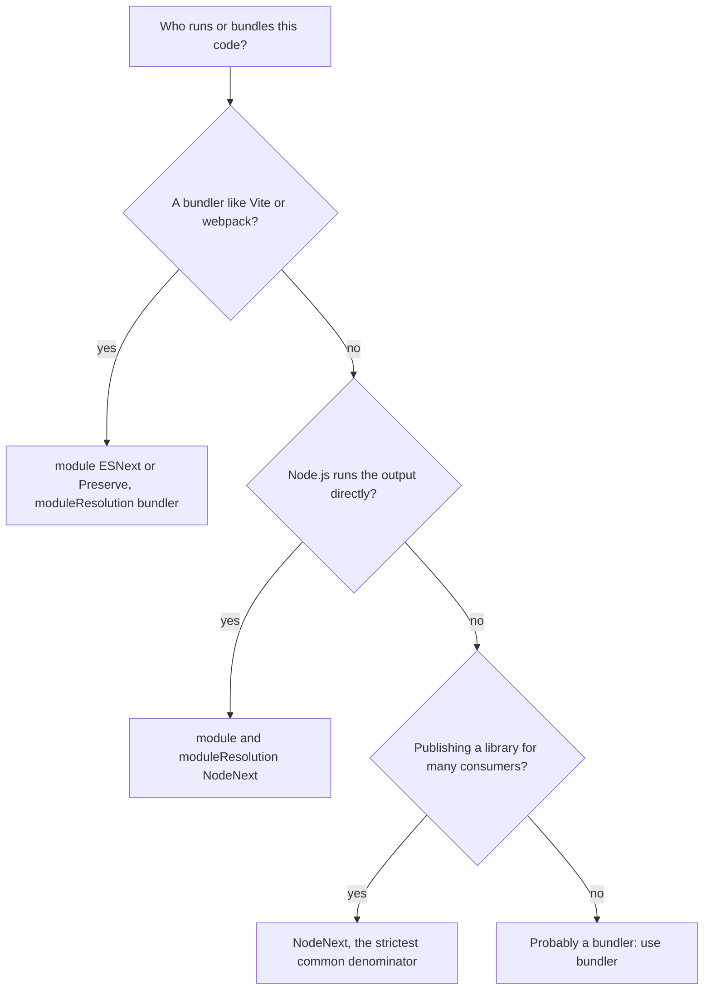

## 1. What it is

**TypeScript is JavaScript with static types: you describe the shape of your data, and a compiler checks every use of it before the code runs.**

Think of TypeScript as a very strict proofreader who reads your code while you type. JavaScript is the language that actually runs in the browser. TypeScript is a layer on top that adds labels like "this is an amount in cents" or "this account can be `open` or `frozen`, nothing else". The proofreader checks that every sentence matches the labels. When you ship, the labels are torn off and plain JavaScript is what the browser receives.

The problem it solves: JavaScript only finds mistakes when a line actually executes, often in production, often for one specific user. A typo in `transaction.amuontCents` returns `undefined` silently and a dashboard shows `NaN`. TypeScript moves that whole class of bugs to your editor, and it makes large codebases safe to refactor because the compiler tells you every place a change breaks.

## 2. Core concepts

### [Beginner] Types exist only at compile time (type erasure)

The single most important mental model: **types are erased**. The TypeScript compiler (or a bundler like Vite using esbuild/SWC) removes every type annotation and emits plain JavaScript. Nothing about your types exists at runtime.

```ts
// What you write
function formatCents(amountCents: number, currency: string): string {
  return `${(amountCents / 100).toFixed(2)} ${currency}`;
}

// What the browser receives (types stripped)
function formatCents(amountCents, currency) {
  return `${(amountCents / 100).toFixed(2)} ${currency}`;
}
```

> **Why:** TypeScript was designed as a superset of JavaScript that adds zero runtime cost. That means it cannot check data that arrives at runtime, like an API response. If the server sends `amountCents: "1200"` (a string), TypeScript will not notice. You need a runtime validator (for example Zod) at the boundary.



In a modern React project two tools do two jobs: the bundler strips types file by file (fast, no checking), and `tsc --noEmit` checks types across the whole project (slower, in your editor and CI). This split is why options like `isolatedModules` exist (see section 4).

### [Beginner] Primitive types and literal types

JavaScript has seven primitives, and TypeScript names each one: `string`, `number`, `boolean`, `bigint`, `symbol`, `null`, `undefined`. A **literal type** is a single exact value used as a type.

```ts
let accountName: string = "Checking";
let balanceCents: number = 125_000;     // number covers ints and floats
let isFrozen: boolean = false;
let bigLedgerTotal: bigint = 9_007_199_254_740_993n;

// Literal types: only these exact values are allowed
let currency: "USD" | "EUR" | "GBP" = "USD";
currency = "JPY"; // Error: Type '"JPY"' is not assignable to type '"USD" | "EUR" | "GBP"'

// const infers a literal type, let widens it
const side = "debit";   // type: "debit"
let side2 = "debit";    // type: string (it could be reassigned)
```

> **Why:** `let` widens because the variable may change later. `const` cannot be reassigned, so TypeScript keeps the narrowest type. This "widening" rule explains many surprising errors when passing objects to functions that want literal types.

### [Beginner] Object types, arrays, tuples, optional and readonly

```ts
type Account = {
  id: string;
  name: string;
  balanceCents: number;
  nickname?: string;            // optional: string | undefined, may be absent
  readonly openedAt: string;    // cannot be reassigned after creation
};

const balances: number[] = [100, 250];          // same as Array<number>
const frozenIds: readonly string[] = ["a1"];    // no push, no splice
// frozenIds.push("a2"); // Error: Property 'push' does not exist on type 'readonly string[]'

// Tuple: fixed length, each position has its own type
type ExchangeRate = [from: string, to: string, rate: number];
const eurUsd: ExchangeRate = ["EUR", "USD", 1.08];

```

> **Gotcha:** `readonly` is compile-time only. `Object.freeze` is the runtime equivalent. A `readonly` array can still be mutated by code that receives it typed as a normal array through an `as` cast.

### [Beginner] Inference vs annotation

TypeScript infers types from values. You annotate where inference cannot help: function parameters, public APIs, and empty containers.

```ts
const total = 100 + 250;                 // inferred: number
const ids = ["a1", "a2"];                // inferred: string[]

// Parameters are never inferred from usage, so annotate them
function sumCents(amounts: number[]): number {
  return amounts.reduce((acc, n) => acc + n, 0); // acc and n inferred
}

// Empty array: annotate, or it becomes any[] / never[]
const pending: Transaction[] = [];
```

> **Interview tip:** Say "annotate boundaries, infer the inside". Explicit return types on exported functions are good practice: they stop accidental API changes and make errors appear at the function, not at every caller.

### [Beginner] unknown vs any vs never

These three are the edges of the type system.

- `any` turns checking **off**. Anything goes in, anything comes out. It spreads silently.
- `unknown` is the safe "I do not know yet". Anything can be assigned to it, but you must narrow it before use.
- `never` is the empty type: no value can have it. It marks impossible code paths and functions that never return.

```ts
function parseLegacy(raw: any) {
  return raw.amount.toFixed(2); // compiles, may crash at runtime
}

function parseSafe(raw: unknown): number {
  // raw.amount;  // Error: 'raw' is of type 'unknown'
  if (typeof raw === "object" && raw !== null && "amountCents" in raw &&
      typeof raw.amountCents === "number") {
    return raw.amountCents;
  }
  throw new Error("Invalid payload");
}

function fail(message: string): never {
  throw new Error(message); // never returns normally
}
```



> **Why:** `unknown` is a "top type" (everything is assignable to it). `never` is a "bottom type" (it is assignable to everything, because no value ever exists). `any` breaks the rules by acting as both. Catch clause variables are `unknown` under `strict` for exactly this reason: anything can be thrown.

### [Beginner] Interfaces vs type aliases

Both describe object shapes. The differences are small but real.

```ts
interface AccountBase {
  id: string;
  name: string;
}
interface SavingsAccount extends AccountBase {
  interestRateBps: number; // basis points: 125 = 1.25%
}

type CardAccount = AccountBase & { creditLimitCents: number };

// Only type aliases can name unions, tuples, primitives, mapped types
type AccountStatus = "open" | "frozen" | "closed";
type Pair = [string, number];

// Only interfaces merge declarations (declaration merging)
interface Window { analyticsQueue: unknown[] }
interface Window { featureFlags: Record<string, boolean> }
// Window now has both properties
```

> **Interview tip:** A good answer is "Use `interface` for object shapes that others may extend or augment, `type` for everything else, and stay consistent within the codebase." Many teams simply use `type` everywhere. Interfaces with `extends` can be slightly faster to check than large intersections, because the compiler caches the relationship.

### [Beginner] Union and intersection types

A **union** `A | B` means "one of these". An **intersection** `A & B` means "all of these at once".

```ts
type PaymentMethod = "card" | "ach" | "wire";

type Timestamps = { createdAt: string; updatedAt: string };
type Audited = { createdBy: string; approvedBy?: string };
type AuditedTransaction = Transaction & Timestamps & Audited;

function describe(id: string | number) {
  // Only members common to string AND number are allowed here
  return id.toString();
  // id.toUpperCase(); // Error: does not exist on type 'number'
}
```

> **Why:** A union of types gives you **fewer** guaranteed members (only what all options share). An intersection gives you **more** members. It feels backwards until you think in sets of values: a union is a bigger set of values, so you know less about any single value.

> **Gotcha:** Intersecting incompatible properties yields `never`: `{ status: "open" } & { status: "closed" }` makes `status: never`, and the whole object becomes impossible to create.

### [Intermediate] Narrowing and type guards

Narrowing is how TypeScript refines a broad type to a specific one inside a branch. The compiler follows your control flow (`if`, `switch`, `return`, `throw`).

```ts
function toCents(input: string | number | null | undefined): number {
  if (input == null) return 0;                 // equality narrowing removes null and undefined
  if (typeof input === "number") return Math.round(input * 100); // typeof guard
  return Math.round(Number.parseFloat(input) * 100); // input is string here
}

class InsufficientFundsError extends Error {
  constructor(public shortfallCents: number) { super("Insufficient funds"); }
}

function handle(err: unknown) {
  if (err instanceof InsufficientFundsError) {   // instanceof guard
    console.warn(`Short by ${err.shortfallCents}`);
  } else if (err instanceof Error) {
    console.error(err.message);
  }
}

type Card = { kind: "card"; last4: string };
type Bank = { kind: "bank"; routingNumber: string };
function label(m: Card | Bank) {
  if ("last4" in m) return `Card ending ${m.last4}`;   // in guard
  return `Bank ${m.routingNumber}`;
}

// User-defined type guard: you promise the compiler what is true
function isTransaction(value: unknown): value is Transaction {
  return typeof value === "object" && value !== null &&
    "id" in value && "amountCents" in value;
}

// Assertion function: throws if false, narrows afterwards
function assertDefined<T>(value: T, msg: string): asserts value is NonNullable<T> {
  if (value === undefined || value === null) throw new Error(msg);
}
```

> **Gotcha:** A user-defined guard (`value is Transaction`) is trusted blindly. If the function body is wrong, the compiler believes the lie. Keep guards small, or generate them from a schema library.

> **Outdated:** Before TypeScript 5.5, `array.filter(x => x !== undefined)` still returned `(T | undefined)[]`. Since 5.5 the compiler infers type predicates from simple arrow functions, so the result is `T[]`.

### [Intermediate] Discriminated unions (perfect for transaction states)

A discriminated union is a union of object types that share one literal property (the "tag" or "discriminant"). Switching on that tag narrows to exactly one member. This is the most useful pattern in TypeScript for UI state.

```ts
type TransferState =
  | { status: "draft"; amountCents: number }
  | { status: "pending"; amountCents: number; submittedAt: string }
  | { status: "settled"; amountCents: number; settledAt: string; referenceId: string }
  | { status: "failed"; amountCents: number; reason: "insufficient_funds" | "limit_exceeded" | "network" };

function assertNever(x: never): never {
  throw new Error(`Unhandled state: ${JSON.stringify(x)}`);
}

function statusText(t: TransferState): string {
  switch (t.status) {
    case "draft":   return "Not submitted";
    case "pending": return `Submitted ${t.submittedAt}`;
    case "settled": return `Settled, ref ${t.referenceId}`; // referenceId only exists here
    case "failed":  return `Failed: ${t.reason}`;
    default:        return assertNever(t); // compile error if a new status is added and not handled
  }
}
```



> **Why:** Instead of one object with many optional fields (`settledAt?`, `reason?`, `referenceId?`) where any combination is possible, you list only the legal combinations. Impossible states, like "failed with a referenceId", cannot be represented. The `never` check gives you exhaustiveness: add `"reversed"` later and every unhandled `switch` turns red.

> **Finance tip:** Model async request state the same way: `{ status: "idle" } | { status: "loading" } | { status: "success"; data: Portfolio } | { status: "error"; error: string }`. You never render `data` while `loading` by accident.

### [Intermediate] Structural typing and excess property checks

TypeScript compares types by **shape**, not by name. If it has the right properties, it fits. This is called structural (or "duck") typing.

```ts
type Money = { amountCents: number; currency: string };
type Fee = { amountCents: number; currency: string };

const fee: Fee = { amountCents: 250, currency: "USD" };
const m: Money = fee; // fine: same shape, names do not matter

// Excess property check: only for fresh object literals
const bad: Money = { amountCents: 1, currency: "USD", note: "x" };
// Error: Object literal may only specify known properties

const withNote = { amountCents: 1, currency: "USD", note: "x" };
const ok: Money = withNote; // no error: not a fresh literal
```

> **Gotcha:** Structural typing means `Cents` and `Dollars` defined as `number` aliases are interchangeable. A `type Cents = number` gives no protection. Use branded types (see the advanced section) when mixing them would be a real bug.

### [Intermediate] Generics: functions, constraints and defaults

A generic is a type parameter: a placeholder filled in at each call site. It lets a function keep the relationship between input and output types.

```ts
// Without generics you lose information
function firstAny(items: any[]): any { return items[0]; }

// With a generic, the caller's type flows through
function first<T>(items: readonly T[]): T | undefined {
  return items[0];
}
const t = first(transactions); // Transaction | undefined

// Constraint: T must at least have an id
function indexById<T extends { id: string }>(items: T[]): Record<string, T> {
  return Object.fromEntries(items.map((i) => [i.id, i]));
}

// Two type parameters linked by keyof
function sumBy<T, K extends keyof T>(items: T[], key: K): number {
  return items.reduce((acc, item) => acc + Number(item[key]), 0);
}
sumBy(transactions, "amountCents");   // OK
// sumBy(transactions, "amount");     // Error: not a key of Transaction

// Default type parameter
type ApiResponse<TData = unknown, TError = { code: string; message: string }> =
  | { ok: true; data: TData }
  | { ok: false; error: TError };

const r: ApiResponse<Account[]> = { ok: true, data: [] };
```

> **Why:** Constraints (`extends`) are the minimum contract the function body needs. The body may only use what the constraint guarantees. The caller still gets the full specific type back.

### [Intermediate] Generic React components

Components are functions, so they can be generic. This is how a reusable `DataTable` knows the row type.

```tsx
type Column<T> = {
  key: keyof T & string;
  header: string;
  render?: (row: T) => React.ReactNode;
};

type DataTableProps<T> = {
  rows: T[];
  columns: Column<T>[];
  getRowId: (row: T) => string;
  onRowClick?: (row: T) => void;
};

export function DataTable<T>({ rows, columns, getRowId, onRowClick }: DataTableProps<T>) {
  return (
    <table>
      <thead>
        <tr>{columns.map((c) => <th key={c.key}>{c.header}</th>)}</tr>
      </thead>
      <tbody>
        {rows.map((row) => (
          <tr key={getRowId(row)} onClick={() => onRowClick?.(row)}>
            {columns.map((c) => (
              <td key={c.key}>{c.render ? c.render(row) : String(row[c.key])}</td>
            ))}
          </tr>
        ))}
      </tbody>
    </table>
  );
}

// Usage: T is inferred as Transaction
<DataTable
  rows={transactions}
  getRowId={(t) => t.id}
  columns={[
    { key: "postedAt", header: "Date" },
    { key: "amountCents", header: "Amount", render: (t) => formatMoney(t.amountCents, t.currency) },
  ]}
/>;

// Arrow function form in a .tsx file needs a trailing comma so <T> is not read as JSX
const Select = <T,>(props: { options: T[]; value: T; onChange: (v: T) => void }) => null;
```

> **Outdated:** Generic components wrapped in `forwardRef` lost their generics, which needed ugly casts. In React 19 `ref` is a normal prop for function components, so the problem disappears.

### [Intermediate] keyof, typeof and indexed access

These operators let you derive types from other types or from values, so you write the truth once.

```ts
type Transaction = {
  id: string;
  accountId: string;
  amountCents: number;
  currency: "USD" | "EUR";
  status: "pending" | "posted";
};

type TxKey = keyof Transaction;                  // "id" | "accountId" | "amountCents" | "currency" | "status"
type TxStatus = Transaction["status"];           // indexed access: "pending" | "posted"
type IdOrAmount = Transaction["id" | "amountCents"]; // string | number

// typeof (in a type position) reads the type of a value
const defaultFilters = { from: "2026-01-01", to: "2026-12-31", minCents: 0 };
type Filters = typeof defaultFilters;            // { from: string; to: string; minCents: number }

// Element type of an array
const CURRENCIES = ["USD", "EUR", "GBP"] as const;
type Currency = (typeof CURRENCIES)[number];     // "USD" | "EUR" | "GBP"
```

> **Why:** `typeof` in a type position is a TypeScript operator, different from the JavaScript runtime `typeof` that returns `"string"` or `"object"`. The same word means two things depending on where it appears.

### [Intermediate] Utility types

Built-in generic types that transform other types. Learn these by heart.

```ts
type Account = {
  id: string;
  name: string;
  balanceCents: number;
  ownerEmail?: string;
};

type AccountPatch = Partial<Account>;                 // all optional: for PATCH bodies
type CompleteAccount = Required<Account>;             // all required, ownerEmail too
type AccountSummary = Pick<Account, "id" | "name">;   // keep some keys
type NewAccount = Omit<Account, "id">;                // drop keys: for create forms
type BalancesById = Record<string, number>;           // object with given key and value types
type FrozenAccount = Readonly<Account>;               // all props readonly (shallow)

async function fetchAccount(id: string): Promise<Account> { /* ... */ return {} as Account; }
type FetchResult = ReturnType<typeof fetchAccount>;   // Promise<Account>
type FetchArgs = Parameters<typeof fetchAccount>;     // [id: string]
type Loaded = Awaited<ReturnType<typeof fetchAccount>>; // Account

type MaybeEmail = string | null | undefined;
type Email = NonNullable<MaybeEmail>;                 // string

type Status = "draft" | "pending" | "settled" | "failed";
type Terminal = Extract<Status, "settled" | "failed">; // "settled" | "failed"
type Active = Exclude<Status, "settled" | "failed">;   // "draft" | "pending"
```

> **Gotcha:** `Omit<T, K>` does not check that `K` is a real key of `T`. `Omit<Account, "idd">` compiles and silently omits nothing. `Pick` does check. Some teams define a strict `type StrictOmit<T, K extends keyof T> = Omit<T, K>`.

### [Intermediate] as const and satisfies

`as const` freezes a literal's type: every value becomes its literal type, every array becomes a readonly tuple, every property becomes readonly.

`satisfies` (TypeScript 4.9) checks that a value matches a type **without** changing the inferred type to that wider type.

```ts
// Without as const: { label: string; value: string }[]
const statuses = [
  { label: "Pending", value: "pending" },
  { label: "Posted", value: "posted" },
] as const;
type StatusValue = (typeof statuses)[number]["value"]; // "pending" | "posted"

type CurrencyConfig = Record<string, { symbol: string; minorUnits: number }>;

// Annotation: keys widen to string, so config.USD might be undefined
const config1: CurrencyConfig = { USD: { symbol: "$", minorUnits: 2 } };

// satisfies: checked against CurrencyConfig, but keys stay exactly "USD" | "JPY"
const config2 = {
  USD: { symbol: "$", minorUnits: 2 },
  JPY: { symbol: "¥", minorUnits: 0 },
} satisfies CurrencyConfig;

config2.JPY.minorUnits; // number, and the key is known to exist
// config2.EUR;         // Error: Property 'EUR' does not exist

// Combine both: literal types plus a shape check
const routes = {
  dashboard: "/dashboard",
  transactions: "/transactions",
} as const satisfies Record<string, `/${string}`>;
```

> **Interview tip:** Contrast the three: annotation (`: T`) **widens** to `T`; `satisfies T` **checks** but keeps the narrow inferred type; `as T` **overrides** the compiler and can hide bugs. Prefer them in that order of safety: `satisfies`, then annotation, and `as` only when you truly know more than the compiler.

### [Intermediate] Enums vs union literals

```ts
// TypeScript enum: generates a runtime object
enum TxStatusEnum { Pending = "PENDING", Posted = "POSTED" }
// Emits roughly: var TxStatusEnum = { Pending: "PENDING", Posted: "POSTED" }

// Union of string literals: zero runtime code
type TxStatus = "PENDING" | "POSTED";

// If you need a runtime list too, derive the type from a const object
export const TX_STATUS = { Pending: "PENDING", Posted: "POSTED" } as const;
export type TxStatusValue = (typeof TX_STATUS)[keyof typeof TX_STATUS]; // "PENDING" | "POSTED"

function isPosted(s: TxStatusValue) { return s === TX_STATUS.Posted; }
isPosted("POSTED"); // OK, a plain string literal works
```

> **Why:** Enums are one of the few TypeScript features that are not "just types": they generate JavaScript. That breaks the "strip the types and you have JS" model, which matters for Node's built-in type stripping and the `erasableSyntaxOnly` flag (TypeScript 5.8). Numeric enums are also unsafe: any number is assignable to them in older versions, and they create a reverse mapping. `const enum` is inlined, but breaks with `isolatedModules`.

> **Outdated:** Enums were popular in Angular-era codebases. The industry default in 2026 is union literals plus an `as const` object when a runtime value is needed.

### [Advanced] Mapped types

A mapped type loops over keys and builds a new object type. Most utility types are mapped types.

```ts
// How Partial is defined
type MyPartial<T> = { [K in keyof T]?: T[K] };

// Every field becomes a validation error message or undefined
type FormErrors<T> = { [K in keyof T]?: string };
type NewTransferForm = { fromAccountId: string; toAccountId: string; amountCents: number };
const errors: FormErrors<NewTransferForm> = { amountCents: "Amount must be positive" };

// Modifiers: remove readonly and optional with a minus sign
type Mutable<T> = { -readonly [K in keyof T]: T[K] };
type Concrete<T> = { [K in keyof T]-?: T[K] };

// Key remapping with "as" (TS 4.1+)
type Getters<T> = {
  [K in keyof T as `get${Capitalize<string & K>}`]: () => T[K];
};
type AccountGetters = Getters<{ balanceCents: number; name: string }>;
// { getBalanceCents: () => number; getName: () => string }

// Filter keys: keep only number fields
type NumericKeys<T> = { [K in keyof T as T[K] extends number ? K : never]: T[K] };
type Amounts = NumericKeys<Transaction>; // { amountCents: number }
```

### [Advanced] Conditional types and distribution

A conditional type is a type-level `if`: `T extends U ? X : Y`. "extends" here means "is assignable to".

```ts
type IsString<T> = T extends string ? true : false;
type A = IsString<"USD">; // true
type B = IsString<100>;   // false

// Distribution: a naked type parameter spreads over unions
type ToArray<T> = T extends unknown ? T[] : never;
type C = ToArray<string | number>; // string[] | number[]  (not (string | number)[])

// Wrap in a tuple to stop distribution
type ToArrayNonDist<T> = [T] extends [unknown] ? T[] : never;
type D = ToArrayNonDist<string | number>; // (string | number)[]

```



> **Gotcha:** `never` is an empty union, so a distributive conditional over `never` returns `never`, not your "false" branch. `IsString<never>` is `never`. Use `[T] extends [never]` to test for never.

### [Advanced] infer

Inside the `extends` clause of a conditional type, `infer X` declares a type variable that TypeScript fills in by pattern matching.

```ts
type ElementOf<T> = T extends readonly (infer E)[] ? E : never;
type Tx = ElementOf<Transaction[]>; // Transaction

type MyReturnType<F> = F extends (...args: any[]) => infer R ? R : never;
type MyAwaited<T> = T extends PromiseLike<infer V> ? MyAwaited<V> : T; // recursive unwrap

// Extract the data type from an API helper
type ApiData<T> = T extends (...args: any[]) => Promise<{ data: infer D }> ? D : never;
declare function getPortfolio(id: string): Promise<{ data: { holdings: unknown[] } }>;
type PortfolioData = ApiData<typeof getPortfolio>; // { holdings: unknown[] }

```

> **Interview tip:** If asked "how is `ReturnType` built?", write the `MyReturnType` line above. It shows you understand conditional types and `infer` together.

### [Advanced] Template literal types

Template literal types build string types from other string types, using the same backtick syntax as JavaScript.

```ts
type Currency = "USD" | "EUR";
type Side = "debit" | "credit";

type LedgerKey = `${Lowercase<Currency>}_${Side}`;
// "usd_debit" | "usd_credit" | "eur_debit" | "eur_credit"

type AccountRoute = `/accounts/${string}`;
const r1: AccountRoute = "/accounts/acc_123"; // OK
// const r2: AccountRoute = "/acct/1";         // Error

type EventName<T extends string> = `on${Capitalize<T>}`;
type Handlers = { [E in "submit" | "cancel" as EventName<E>]: () => void };
// { onSubmit: () => void; onCancel: () => void }

```

Built-in string helpers: `Uppercase`, `Lowercase`, `Capitalize`, `Uncapitalize`. Libraries such as React Router v7 use template literal types with `infer` to type route params like `:accountId`.

### [Advanced] Branded types for money and IDs

Because typing is structural, `type AccountId = string` and `type TransactionId = string` are interchangeable, and so are cents and dollars. A **brand** adds a fake, compile-time-only property so the types stop being compatible.

```ts
declare const brand: unique symbol;
type Brand<T, B extends string> = T & { readonly [brand]: B };

export type Cents = Brand<number, "Cents">;
export type AccountId = Brand<string, "AccountId">;
export type TransactionId = Brand<string, "TransactionId">;

// The only way in is a "smart constructor" that validates
export function toCents(value: number): Cents {
  if (!Number.isSafeInteger(value)) throw new Error(`Cents must be a safe integer, got ${value}`);
  return value as Cents;
}
export const accountId = (raw: string): AccountId => {
  if (!raw.startsWith("acc_")) throw new Error("Invalid account id");
  return raw as AccountId;
};

function transfer(from: AccountId, to: AccountId, amount: Cents) { /* ... */ }

const from = accountId("acc_1");
const to = accountId("acc_2");
transfer(from, to, toCents(12_550));   // OK
// transfer(from, to, 125.5);          // Error: number is not Cents
// transfer(txId, to, toCents(100));   // Error: TransactionId is not AccountId

const total = toCents(a + b); // arithmetic returns plain number, re-brand after checking
```

> **Finance tip:** Brands catch the classic bug of passing dollars where cents are expected, or a transaction ID where an account ID is expected. They cost nothing at runtime. Zod supports this directly with `.brand<"Cents">()` after validation.

### [Advanced] Declaration files (.d.ts) and module augmentation

A `.d.ts` file contains only types, no implementation. It describes JavaScript that exists elsewhere: a plain-JS library, browser globals, or files the bundler handles (CSS, SVG).

```ts
// src/types/legacy-charts.d.ts: types for an untyped JS library
declare module "legacy-charts" {
  export interface ChartOptions { series: number[]; currency?: string }
  export function renderChart(el: HTMLElement, options: ChartOptions): void;
}

// src/types/assets.d.ts: let TypeScript import CSS modules
declare module "*.module.css" {
  const classes: Readonly<Record<string, string>>;
  export default classes;
}

// src/types/global.d.ts: augment the global Window
export {}; // makes this file a module so "declare global" is allowed
declare global {
  interface Window {
    dataLayer?: unknown[];
  }
}

// src/vite-env.d.ts: type your environment variables
/// <reference types="vite/client" />
interface ImportMetaEnv {
  readonly VITE_API_BASE_URL: string;
  readonly VITE_OKTA_ISSUER: string;
}
interface ImportMeta { readonly env: ImportMetaEnv }
```

Where types come from, in order: the package's own `types` field (or `exports` condition `"types"`), then `@types/<package>` from DefinitelyTyped, then your own `declare module`.



### [Advanced] Decorators: TC39 standard vs legacy

A decorator is a function that wraps a class or class member, written as `@name`. TypeScript has two incompatible implementations:

- **Legacy decorators** (`"experimentalDecorators": true`): the old TypeScript-specific version, often with `emitDecoratorMetadata`. Used by Angular, NestJS, TypeORM, older MobX. Supports parameter decorators.
- **Standard decorators** (TypeScript 5.0+, no flag): follow the TC39 stage 3 proposal. Different signature: they receive `(value, context)`. No parameter decorators, no metadata emit (a separate metadata proposal exists).

```ts
// TC39 standard method decorator (TS 5.0+, no flag needed)
function logged<This, Args extends unknown[], R>(
  target: (this: This, ...args: Args) => R,
  context: ClassMethodDecoratorContext<This, (this: This, ...args: Args) => R>,
) {
  return function (this: This, ...args: Args): R {
    console.info(`calling ${String(context.name)}`);
    return target.apply(this, args);
  };
}

class LedgerService {
  @logged
  post(amountCents: number) { return amountCents; }
}
```

> **Outdated:** If you see `experimentalDecorators` in a React project tsconfig, it is probably left over from MobX or a backend template. React apps almost never need decorators: React moved to functions and hooks. Native browser support for decorators was still rolling out at the time of writing, so bundlers transpile them.

## 3. Why it's used in this project

Financial UIs are full of data whose shape must never be wrong. TypeScript earns its keep in concrete ways:

- **Money correctness.** Branded `Cents` types stop dollars-vs-cents mix-ups. A `Money = { amountCents: Cents; currency: CurrencyCode }` type makes it impossible to format an amount without its currency.
- **Transaction lifecycles.** Discriminated unions model `draft | pending | settled | failed | reversed` so the UI cannot show a settlement reference on a failed transfer, and adding `reversed` forces every screen to handle it.
- **API contracts.** Types generated from OpenAPI (for example with `openapi-typescript`) keep the frontend in sync with the backend. When a field is renamed, the build fails instead of the dashboard showing blanks.
- **Large tables.** A generic `DataTable<Transaction>` gives typed columns, typed sort keys and typed row handlers for 10k-row transaction lists.
- **Forms.** React Hook Form plus Zod infers the form type from one schema, so validation and types never drift.
- **Auth and compliance.** Typing Okta claims (`groups`, `sub`), roles and permission strings as unions means a typo in `"approve:transfer"` is a compile error, not an access-control hole.
- **PII masking.** A `MaskedAccountNumber` brand that only a `mask()` function can produce makes it hard to render a raw account number by accident.
- **Refactoring safety.** Audit-heavy codebases live for years. The compiler is the cheapest regression test you have.

> **Finance tip:** `noUncheckedIndexedAccess` is worth turning on in money code. `ratesByCurrency[code]` really can be undefined, and a silent `undefined * amount` is `NaN` on a statement.

## 4. Setup & configuration

Install in a Vite React project (already present in the `react-ts` template):

```bash
npm install -D typescript @types/react @types/react-dom
npx tsc --noEmit        # type check the whole project
```

A recommended 2026 `tsconfig.json` for a React app built by Vite (tsconfig allows comments):

```jsonc
{
  "compilerOptions": {
    /* Language and environment */
    "target": "ES2022",                 // JS syntax level to emit; bundler handles the real output
    "lib": ["ES2023", "DOM", "DOM.Iterable"], // which built-in APIs exist (toSorted needs ES2023)
    "jsx": "react-jsx",                 // automatic runtime: no "import React" needed
    "useDefineForClassFields": true,    // standard class field semantics

    /* Modules */
    "module": "ESNext",                 // keep import/export as-is for the bundler
    "moduleResolution": "bundler",      // resolve imports the way Vite/esbuild do
    "moduleDetection": "force",         // treat every file as a module
    "resolveJsonModule": true,          // allow import data from "./rates.json"
    "allowImportingTsExtensions": true, // allow "./money.ts" in imports (requires noEmit)
    "paths": { "@/*": ["./src/*"] },    // import "@/lib/money" instead of "../../lib/money"
    "types": ["vite/client"],           // only load these global @types packages

    /* Emit: the bundler emits, tsc only checks */
    "noEmit": true,
    "isolatedModules": true,            // every file must be compilable on its own
    "verbatimModuleSyntax": true,       // import type is erased, plain import is kept, no guessing
    "erasableSyntaxOnly": true,         // TS 5.8+: forbid enums, namespaces, parameter properties

    /* Type checking */
    "strict": true,                     // the whole strict family (listed below)
    "noUncheckedIndexedAccess": true,   // obj[key] and arr[i] include undefined
    "exactOptionalPropertyTypes": true, // optional means "absent", not "may be undefined" (opt-in, strict)
    "noImplicitOverride": true,         // subclasses must write "override"
    "noImplicitReturns": true,
    "noFallthroughCasesInSwitch": true,
    "noUnusedLocals": true,
    "noUnusedParameters": true,

    /* Performance */
    "skipLibCheck": true                // do not type check .d.ts files in node_modules
  },
  "include": ["src"]
}
```

### [Beginner] target

`target` sets which JavaScript syntax the compiler outputs: `ES5`, `ES2015` ... `ES2024`, `ESNext`. With a lower target, modern syntax like `?.` or `class` fields is rewritten into older forms. In a Vite project the bundler does the real downleveling (Vite's `build.target`), so `target` mainly affects what syntax TypeScript considers valid and how it types class fields.

> **Outdated:** `target: "ES5"` is deprecated in TypeScript 6.0. Every browser that matters supports ES2020+.

### [Beginner] lib

`lib` lists which built-in type declarations exist. It does not add polyfills. If you set `lib: ["ES2020"]`, then `array.toSorted()` is an error even if the browser supports it. If you set `ES2023` but target an old browser, it compiles and then crashes at runtime. `lib` is a promise about the runtime, not a feature switch.

### [Beginner] module and moduleResolution

`module` decides the output module format (`ESNext`, `CommonJS`, `NodeNext`, `Preserve`). `moduleResolution` decides **how an import string is turned into a file**.

- `bundler`: for code processed by Vite, webpack, esbuild. Supports `package.json` `exports`, allows extensionless relative imports (`./money`). This is the right choice for a React app.
- `nodenext` / `node16`: for code Node runs directly. Requires real file extensions in relative imports (`./money.js`) and follows Node's ESM vs CommonJS rules exactly. Use for libraries and Node backends.
- `node10` (formerly `node`) and `classic`: legacy. Ignores `exports`. Deprecated in TypeScript 6.0.



> **Why:** Node and bundlers resolve imports differently. Node ESM refuses `import "./money"` without the extension; Vite accepts it. If TypeScript resolved differently from the real tool, it would say "fine" for imports that fail at runtime, or vice versa.

### [Intermediate] The strict family, flag by flag

`"strict": true` turns on a group of flags. New flags are added to the group over time, so upgrading TypeScript can introduce new errors. Each one can be turned off individually after `strict`.

| Flag | What it does | Why it matters |
| --- | --- | --- |
| `noImplicitAny` | Error when a type would silently become `any` (e.g. an unannotated parameter) | Without it, type checking quietly stops at function boundaries |
| `strictNullChecks` | `null` and `undefined` are separate types, not members of every type | The single most valuable flag. Without it `account.owner.name` never warns |
| `strictFunctionTypes` | Function-type parameters are checked contravariantly | Stops passing a handler for `SavingsAccount` where any `Account` may arrive |
| `strictBindCallApply` | `fn.call`, `fn.apply`, `fn.bind` check arguments | Otherwise these return `any` |
| `strictPropertyInitialization` | Class fields must be assigned in the constructor or marked `!`/optional | Prevents reading undefined fields |
| `noImplicitThis` | Error when `this` would be `any` | Catches detached method bugs |
| `alwaysStrict` | Emits `"use strict"` and parses in strict mode | ES modules are strict anyway |
| `useUnknownInCatchVariables` | `catch (e)` gives `e: unknown` instead of `any` | Anything can be thrown, not just `Error` |
| `strictBuiltinIteratorReturn` | Built-in iterators return `undefined` instead of `any` when done (TS 5.6) | Fewer hidden `any` values |

```ts
// strictNullChecks
function ownerName(a: { owner?: { name: string } }) {
  return a.owner.name;  // Error: 'a.owner' is possibly 'undefined'
  // return a.owner?.name ?? "Unknown";
}

// strictFunctionTypes
type AccountHandler = (a: Account) => void;
const savingsOnly = (a: SavingsAccount) => console.log(a.interestRateBps);
const h: AccountHandler = savingsOnly; // Error: Account lacks interestRateBps

// Note: method shorthand syntax stays bivariant (unsafe) for historical reasons
type Loose = { handle(a: Account): void };   // not checked strictly
type Strict = { handle: (a: Account) => void }; // checked strictly

// useUnknownInCatchVariables
try { await submitTransfer(); }
catch (e) {
  const msg = e instanceof Error ? e.message : String(e);
}
```

> **Outdated:** For years `strict` was off by default and every project had to opt in. TypeScript 6.0 changed the default so `strict` is on. Any tsconfig that still sets `"strict": false` is a red flag in review.

### [Intermediate] noUncheckedIndexedAccess and exactOptionalPropertyTypes

Neither is part of `strict`, but both close real holes.

```ts
const fxRates: Record<string, number> = { EUR: 1.08 };

// Default: rate is number (a lie for unknown keys)
// With noUncheckedIndexedAccess: rate is number | undefined
const rate = fxRates["JPY"];
const converted = amountCents * rate; // Error: 'rate' is possibly 'undefined'

const txs: Transaction[] = [];
const latest = txs[0];  // Transaction | undefined: forces a check on empty lists

// exactOptionalPropertyTypes
type Filter = { accountId?: string };
const f: Filter = { accountId: undefined }; // Error with the flag: absent is not the same as undefined
```

> **Gotcha:** With `noUncheckedIndexedAccess`, even `for (let i = 0; i < arr.length; i++) arr[i]` is `T | undefined`. Use `for...of` or `.map`, which do not have that problem.

### [Intermediate] paths

`paths` maps import aliases to folders. It only tells **TypeScript** how to resolve; it does not rewrite the output. The bundler must know the same alias.

```ts
// tsconfig: "paths": { "@/*": ["./src/*"] }
import { formatMoney } from "@/lib/money";

// vite.config.ts must mirror it (or use the vite-tsconfig-paths plugin)
import { fileURLToPath, URL } from "node:url";
export default defineConfig({
  resolve: { alias: { "@": fileURLToPath(new URL("./src", import.meta.url)) } },
});
```

> **Outdated:** `baseUrl` used to be required alongside `paths`. Since TypeScript 4.1 it is not, and TypeScript 6.0 deprecates `baseUrl`. Paths are resolved relative to the tsconfig file.

### [Intermediate] isolatedModules and verbatimModuleSyntax

esbuild and SWC compile **one file at a time** without looking at other files. Some TypeScript features need cross-file knowledge, so those tools cannot handle them correctly.

- `isolatedModules: true` makes TypeScript report code that a single-file compiler would get wrong. Example: re-exporting a type with `export { Account } from "./types"`. A single-file tool cannot know `Account` is only a type, so it keeps the export and the runtime import fails.
- `verbatimModuleSyntax: true` (TS 5.0) makes the rule simple: anything imported with `import type` is removed, everything else is kept exactly as written. No guessing.

```ts
import type { Account } from "./types";          // erased entirely
import { type Transaction, formatMoney } from "./money"; // only formatMoney stays
export type { Account };                          // type-only re-export
```

### [Beginner] skipLibCheck

`skipLibCheck: true` skips type checking of all `.d.ts` files (mostly in `node_modules`). Your code is still checked against them. It makes `tsc` much faster and avoids errors from two libraries shipping conflicting global types. Nearly every app enables it. The cost: a broken declaration in a dependency will not be reported directly.

### [Beginner] jsx

- `react-jsx`: the automatic runtime (React 17+). JSX compiles to `jsx()` calls from `react/jsx-runtime`. No `import React` needed.
- `react-jsxdev`: same, with dev-only debugging info.
- `preserve`: leave JSX in the output for another tool.
- `react`: the classic `React.createElement` transform. Requires `React` in scope.

## 5. Key features we use

### [Beginner] Typing component props and events

```tsx
type AmountInputProps = {
  valueCents: number;
  currency: CurrencyCode;
  onChange: (cents: number) => void;
  disabled?: boolean;
} & Omit<React.ComponentPropsWithoutRef<"input">, "value" | "onChange">;

export function AmountInput({ valueCents, currency, onChange, ...rest }: AmountInputProps) {
  const handleChange = (e: React.ChangeEvent<HTMLInputElement>) => {
    const cents = Math.round(Number.parseFloat(e.target.value || "0") * 100);
    if (Number.isFinite(cents)) onChange(cents);
  };
  return <input {...rest} inputMode="decimal" defaultValue={valueCents / 100} onChange={handleChange} aria-label={`Amount in ${currency}`} />;
}
```

### [Intermediate] Inferring types from a Zod schema

```ts
import { z } from "zod";

export const TransactionSchema = z.object({
  id: z.string(),
  accountId: z.string(),
  amountCents: z.number().int(),
  currency: z.enum(["USD", "EUR", "GBP"]),
  status: z.enum(["pending", "posted", "reversed"]),
  postedAt: z.iso.datetime(), // Zod 4 top-level format; Zod 3 used z.string().datetime()
});
export type Transaction = z.infer<typeof TransactionSchema>;

export async function getTransactions(accountId: string): Promise<Transaction[]> {
  const res = await fetch(`/api/accounts/${accountId}/transactions`);
  if (!res.ok) throw new Error(`HTTP ${res.status}`);
  return z.array(TransactionSchema).parse(await res.json()); // runtime check at the boundary
}
```

### [Intermediate] A typed Money module

```ts
export type CurrencyCode = "USD" | "EUR" | "GBP" | "JPY";
export type Money = Readonly<{ amountCents: Cents; currency: CurrencyCode }>;

export function addMoney(a: Money, b: Money): Money {
  if (a.currency !== b.currency) throw new Error(`Currency mismatch: ${a.currency} vs ${b.currency}`);
  return { amountCents: toCents(a.amountCents + b.amountCents), currency: a.currency };
}

export function formatMoney({ amountCents, currency }: Money, locale = "en-US"): string {
  const nf = new Intl.NumberFormat(locale, { style: "currency", currency });
  const digits = nf.resolvedOptions().maximumFractionDigits ?? 2;
  return nf.format(amountCents / 10 ** digits);
}
```

## 6. Interview questions

#### Q: What is the difference between an interface and a type alias, and which do you use?

Both can describe object shapes, and for most object types they are interchangeable.

- Only `type` can name unions, tuples, primitives, mapped and conditional types: `type Status = "open" | "closed"`.
- Only `interface` supports **declaration merging**: two `interface Window` declarations combine. This is how you augment library and global types.
- `interface` uses `extends`, `type` uses `&`. Extending an interface reports conflicts clearly; intersecting conflicting types silently produces `never` properties.
- Interfaces get cached by name, which can make very large codebases check slightly faster.

My default: `type` for unions and derived types, `interface` for public object contracts or anything meant to be extended or augmented. Consistency inside the codebase matters more than the choice.

#### Q: Explain any, unknown and never. When would you use each?

- `any` disables type checking for that value and everything it touches. Use only as a temporary migration escape hatch, ideally banned by lint (`@typescript-eslint/no-explicit-any`).
- `unknown` is the type-safe "could be anything". You can assign anything to it but cannot use it until you narrow it with `typeof`, `instanceof`, `in`, a type guard or a schema parse. Use it for API responses, `JSON.parse` results, and `catch` variables.
- `never` has no values. It is the return type of functions that always throw or loop forever, the result of impossible intersections, and the key tool for exhaustiveness checks: `default: assertNever(state)` fails to compile if a union member is unhandled.

```ts
function parse(json: string): Transaction {
  const data: unknown = JSON.parse(json);
  return TransactionSchema.parse(data); // narrows unknown via runtime validation
}
```

#### Q: What does "strict": true actually enable, and what would you add on top for a finance app?

`strict` is a bundle: `noImplicitAny`, `strictNullChecks`, `strictFunctionTypes`, `strictBindCallApply`, `strictPropertyInitialization`, `noImplicitThis`, `alwaysStrict`, `useUnknownInCatchVariables`, and `strictBuiltinIteratorReturn`. The most important is `strictNullChecks`, which makes `null`/`undefined` explicit so "possibly undefined" bugs become compile errors.

On top I would add:
- `noUncheckedIndexedAccess`: record lookups (`rates[currency]`) and array indexing include `undefined`. A missing FX rate otherwise becomes `NaN` on a statement.
- `exactOptionalPropertyTypes`: distinguishes "field absent" from "field explicitly undefined", which matters for PATCH payloads.
- `noFallthroughCasesInSwitch`, `noImplicitReturns`, `noImplicitOverride`.
- Lint rules banning `any` and non-null assertions (`!`) in money code.

#### Q: How would you model the states of a payment so the UI cannot render invalid combinations?

Use a discriminated union with a literal `status` tag, where each state carries only the fields that exist in that state:

```ts
type Payment =
  | { status: "draft"; amountCents: Cents }
  | { status: "pending"; amountCents: Cents; submittedAt: string }
  | { status: "settled"; amountCents: Cents; settledAt: string; referenceId: string }
  | { status: "failed"; amountCents: Cents; reason: string };
```

Switching on `payment.status` narrows to one member, so `referenceId` is only accessible in the `settled` branch. A `default: assertNever(payment)` makes the switch exhaustive: adding a `"reversed"` state turns every unhandled switch into a compile error. Compared with one object full of optional fields, this removes impossible states like "failed but has a settlement reference", and it documents the state machine in the type itself.

#### Q: What are generics and constraints? Write a typed groupBy.

A generic is a type parameter that the caller fills in, so the function preserves type relationships instead of collapsing to `any`. A constraint (`extends`) limits what types are allowed and tells the body what it can rely on.

```ts
function groupBy<T, K extends PropertyKey>(items: readonly T[], getKey: (item: T) => K): Partial<Record<K, T[]>> {
  const out: Partial<Record<K, T[]>> = {};
  for (const item of items) {
    const key = getKey(item);
    (out[key] ??= []).push(item);
  }
  return out;
}

const byCurrency = groupBy(transactions, (t) => t.currency);
// Partial<Record<"USD" | "EUR", Transaction[]>>
```

`K extends PropertyKey` (string, number or symbol) is needed because only those can be object keys. `Partial` is honest: a currency with no transactions has no key. In modern runtimes `Object.groupBy` does this natively.

#### Q: What is the difference between satisfies, a type annotation, and as?

- `const x: T = value` checks the value against `T` and then **widens** `x` to `T`. You lose the specific literal information.
- `const x = value satisfies T` checks the value against `T` but **keeps the inferred type**. You get validation and precise types (exact keys, literal values).
- `value as T` is an assertion. It **overrides** the compiler and only fails if the types are completely unrelated. It can hide real bugs.

```ts
const limits = { daily: 500_000, perTx: 100_000 } satisfies Record<string, number>;
limits.daily;   // known key, no undefined
// limits.weekly; // Error, which an annotation with Record<string, number> would not catch
```

Rule of thumb: prefer `satisfies` for config objects, annotations for function boundaries, and `as` only after a runtime check you cannot express to the compiler, like a branded type constructor.

#### Q: How do you stop developers from passing dollars where cents are expected, or a transaction ID where an account ID is expected?

TypeScript is structural, so `type Cents = number` is just `number`. I use **branded types**: intersect the base type with a unique phantom property that never exists at runtime.

```ts
declare const brand: unique symbol;
type Brand<T, B> = T & { readonly [brand]: B };
type Cents = Brand<number, "Cents">;
type AccountId = Brand<string, "AccountId">;

const toCents = (n: number): Cents => {
  if (!Number.isSafeInteger(n)) throw new Error("Cents must be an integer");
  return n as Cents;
};
```

The only way to create a `Cents` is through the validating constructor (or a Zod `.brand()`), so the type proves validation happened. Function signatures like `transfer(from: AccountId, to: AccountId, amount: Cents)` then reject raw numbers and the wrong ID kind. Zero runtime cost. Trade-off: arithmetic returns plain `number`, so you re-brand after operations, usually inside a small money module.

#### Q: TypeScript says an API response is a Transaction[]. Can you trust it at runtime?

No. Types are erased at compile time. `res.json()` returns `any`, and annotating it as `Transaction[]` is just a promise to the compiler. If the backend sends `amountCents` as a string, or omits a field, TypeScript cannot know.

At trust boundaries (network, `localStorage`, URL params, `postMessage`, third-party scripts) treat data as `unknown` and validate it with a schema library such as Zod, Valibot or ArkType. Infer the static type from the schema (`z.infer<typeof Schema>`) so there is one source of truth. For large internal APIs, generate types from the OpenAPI spec to keep compile-time types aligned, and validate the money-critical responses at runtime anyway.

> **Interview tip:** Mentioning "type erasure" and "validate at the boundary, trust inside" signals real-world experience.

## 7. Drawbacks & pain points

- **No runtime guarantees.** Types vanish. External data must still be validated.
- **Complex types become unreadable.** Deep conditional and mapped types produce error messages dozens of lines long. Type-level cleverness is a maintenance cost.
- **Slow type checking on large projects.** `tsc` can take minutes in monorepos and editors lag. TypeScript 7 (the Go-native compiler) targets roughly 10x faster checks, but tooling that depends on the old JavaScript compiler API may lag behind.
- **Config sprawl.** Many interacting options (`module`, `moduleResolution`, `paths`, project references). Wrong combinations cause "works in the editor, fails in the build".
- **Types of third-party libraries can be wrong** or lag behind the JavaScript, especially `@types/*` packages.
- **Escape hatches are easy.** `any`, `as`, `!` and `@ts-ignore` silently remove safety. Lint them.

Gotchas that trip devs up:

```ts
// 1. Object.keys returns string[], not (keyof T)[]
const acct = { checking: 100, savings: 200 };
Object.keys(acct).forEach((k) => acct[k]); // Error: string cannot index the object
// Why: an object can have extra keys at runtime (structural typing), so TS refuses to promise

// 2. Non-null assertion hides real bugs
const el = document.getElementById("balance")!; // crashes later if the id changes

// 3. as lies without complaint
const tx = {} as Transaction; // compiles, every field is undefined at runtime

// 4. Optional chaining returns undefined, which then spreads
const total = account?.balanceCents + pendingCents; // Error under strict: possibly undefined

// 5. Array index without noUncheckedIndexedAccess
const first = transactions[0]; // typed Transaction even when the array is empty
```

## 8. Better alternatives

TypeScript has effectively won. The question in 2026 is less "TypeScript or not" and more "which toolchain and how strict".

Trends:
- **TypeScript 7, the native Go compiler** (`tsgo`, project "Corsa") reached release in 2026, with large speedups for type checking and editor responsiveness. TypeScript 6.0 (March 2026) was the last JavaScript-based release and mainly a bridge: new defaults and deprecations to prepare for 7.0. Check your tooling (typescript-eslint, framework plugins) for compatibility before switching.
- **Type stripping in runtimes.** Node.js (22.18+ and 23.6+) can run `.ts` files directly by erasing types; Deno and Bun run TypeScript natively. This is why `erasableSyntaxOnly` and avoiding enums matter.
- **Schema-first types.** Zod 4, Valibot and ArkType define runtime validators and infer types from them.
- **JSDoc types** in plain `.js` files (checked by `tsc` with `checkJs`) are used by some library authors who want no build step.
- **Types as comments** is a TC39 proposal (stage 1) to let browsers ignore type annotations natively. It is far from shipping.

| Option | Runtime size | Boilerplate | Devtools | Learning curve | TS support | Popularity | When it wins |
| --- | --- | --- | --- | --- | --- | --- | --- |
| TypeScript (tsc 5.x/6.0) | 0 KB (erased) | Medium | Excellent | Medium to steep | Native | Very high | Default for any team app |
| TypeScript 7 (tsgo) | 0 KB | Same as TS | Excellent, much faster | Same | Native | Growing fast | Large codebases with slow checks |
| JS + JSDoc + checkJs | 0 KB | High (verbose comments) | Good | Medium | Uses TS engine | Niche | Libraries wanting no build step |
| Flow | 0 KB | Medium | Weak outside Meta | Medium | None | Low, declining | Legacy Meta-style codebases only |
| ReScript / Elm | ~small runtime | Medium | Good | Steep | Interop only | Low | Teams wanting a sound type system |
| Plain JavaScript | 0 KB | Low | Basic | Low | None | High for scripts | Prototypes and tiny scripts |

## 9. When NOT to use it

- **One-off scripts and quick prototypes** where setup time outweighs bug prevention.
- **When the team treats it as decoration**: a codebase full of `any` and `as` gets the build cost without the safety. Fix the culture first or keep it JS.
- **Type-level programming for its own sake**: if a type needs a comment longer than the function, simplify the type or the API.
- **As a replacement for runtime validation**: never rely on types alone for API payloads, user input, or money amounts from outside the app.
- **For enums, namespaces and decorators in new React code**: they are TypeScript features you should usually avoid, not reasons to use TypeScript.

## Cheatsheet

| Need | Syntax |
| --- | --- |
| Union / intersection | `A \| B` / `A & B` |
| Optional / readonly prop | `name?: string` / `readonly id: string` |
| Literal list type from array | `const X = ["a","b"] as const; type T = (typeof X)[number]` |
| Keys / value type | `keyof T` / `T[K]` |
| Type of a value | `typeof value` |
| Check without widening | `value satisfies T` |
| Narrow unknown | `typeof`, `instanceof`, `in`, `x is T`, `asserts x is T` |
| Exhaustive switch | `default: assertNever(x)` |
| Generic with constraint | `function f<T extends { id: string }>(x: T): T` |
| Default type param | `type Res<T = unknown> = { data: T }` |
| Mapped type | `{ [K in keyof T]?: T[K] }` |
| Key remap | `` { [K in keyof T as `get${Capitalize<K & string>}`]: () => T[K] } `` |
| Conditional / infer | `T extends (infer E)[] ? E : never` |
| Branded type | `type Cents = number & { readonly [brand]: "Cents" }` |
| Type-only import | `import type { Account } from "./types"` |

```ts
// Utility types at a glance
Partial<T>  Required<T>  Readonly<T>  Pick<T, K>  Omit<T, K>  Record<K, V>
ReturnType<F>  Parameters<F>  Awaited<P>  NonNullable<T>  Extract<T, U>  Exclude<T, U>

// tsconfig essentials for a Vite React app
// target ES2022, lib ES2023+DOM, module ESNext, moduleResolution bundler, jsx react-jsx,
// strict, noUncheckedIndexedAccess, isolatedModules, verbatimModuleSyntax, skipLibCheck, noEmit

// Commands
// npx tsc --noEmit        type check
// npx tsc -b              build project references (Vite template)
// npx tsc --showConfig    print the resolved config
```
