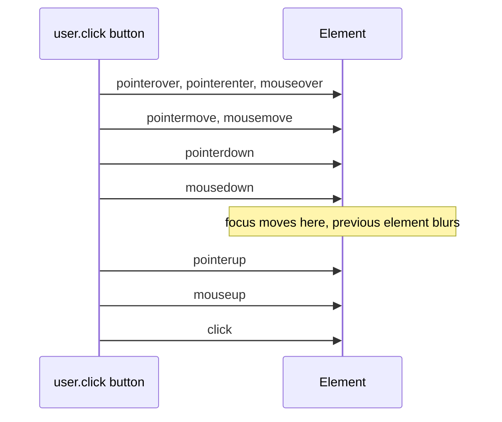
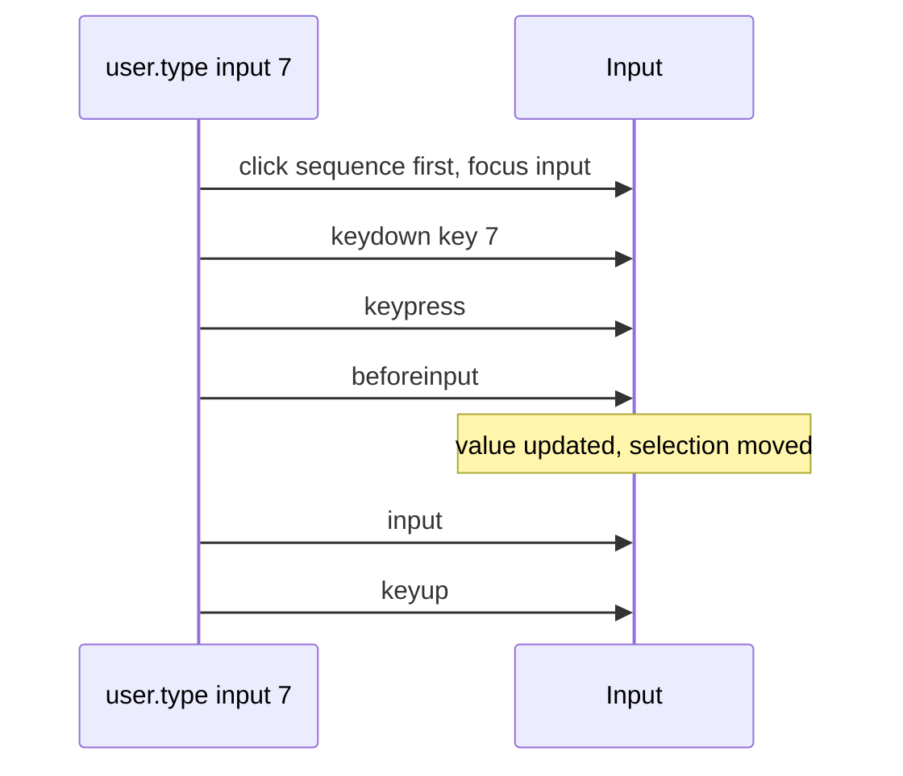
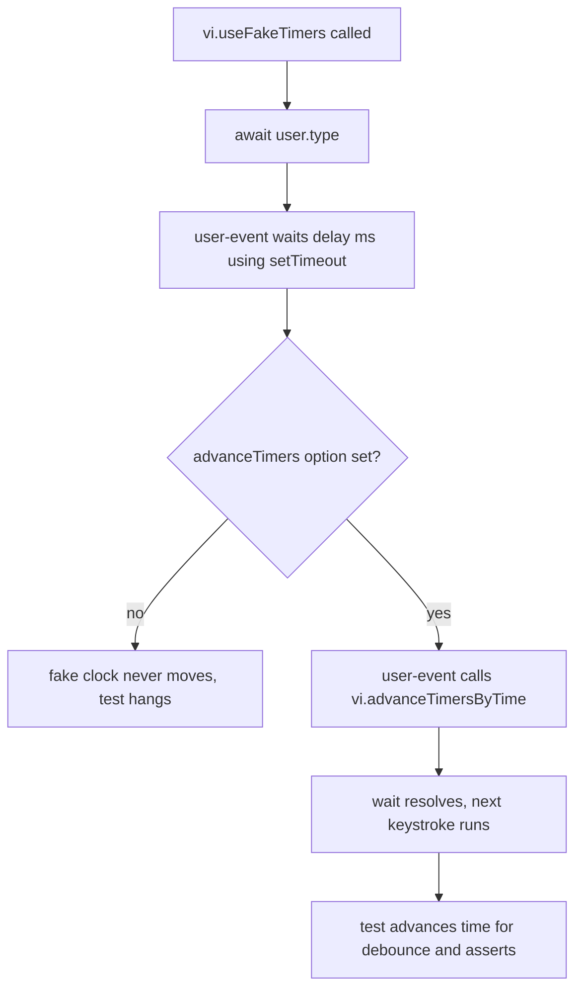

## 1. What it is

**user-event simulates full user interactions (click, type, tab, select, upload) by dispatching the same sequence of browser events a real user would trigger.**

Imagine testing a vending machine. `fireEvent` is reaching inside and pressing the "dispense" relay directly. `user-event` is walking up, pressing the button with your finger, which first touches the button, then pushes it, then releases it, and the machine reacts to each step. If the machine only listens for the "release" step, only the finger test will catch that.

The problem it solves: a real click is not one event. It is `pointerdown`, `mousedown`, focus moving, `pointerup`, `mouseup`, then `click`. Typing one character is `keydown`, `keypress`, `beforeinput`, `input`, `keyup`. Components often depend on the earlier events (focus handlers, keydown shortcuts, `onBlur` validation). Firing a single synthetic event skips all of that, so tests pass for UIs that are broken for real users.

## 2. Core concepts

### [Beginner] fireEvent vs userEvent

`fireEvent` (from `@testing-library/react`) dispatches **exactly one** DOM event. `userEvent` dispatches the **whole sequence**, checks whether the interaction is even possible (disabled, `pointer-events: none`), and moves focus and selection like a browser.

```tsx
import { render, screen, fireEvent } from '@testing-library/react';
import userEvent from '@testing-library/user-event';

// fireEvent: one 'change'-style input event, value set instantly.
// No focus, no keydown, no blur. maxLength is ignored. A disabled input still "changes".
fireEvent.change(screen.getByLabelText(/amount/i), { target: { value: '250' } });

// userEvent: click into the field, then for each character:
// keydown -> keypress -> beforeinput -> input -> keyup
const user = userEvent.setup();
await user.type(screen.getByLabelText(/amount/i), '250');
```





> **Why:** A transfer form that validates on `blur` or blocks letters on `keydown` behaves differently under `fireEvent.change`. userEvent exercises those paths, so the test reflects reality.

> **Interview tip:** "fireEvent dispatches a single event. userEvent simulates the interaction, the full event sequence including focus, and respects disabled and pointer-events. Prefer userEvent; use fireEvent only for events userEvent does not cover, like `scroll` or a custom event."

### [Beginner] v14: `userEvent.setup()` and the async API

In v14 every method returns a Promise. You create a `user` instance with `setup()`, then `await` each action.

```tsx
test('submits the transfer', async () => {
  const user = userEvent.setup();                 // call BEFORE render is recommended
  render(<TransferForm onSubmit={vi.fn()} />);

  await user.type(screen.getByLabelText(/amount/i), '100');
  await user.click(screen.getByRole('button', { name: /review/i }));
});
```

**Why async?** Real interactions take time. Browsers let the event loop run between keystrokes, so React can re-render and effects can run. v14 yields to the event loop between steps (controlled by `delay`, default 0 ms) to mimic that. That is also why it needs special handling with fake timers.

**Why `setup()`?** The `user` instance keeps state across calls, like a real person: which keys are held down (Shift), where the pointer is, the clipboard contents. Calling `userEvent.click()` directly still works (it creates a one-off setup internally), but state does not carry between calls.

> **Outdated:** v13 APIs were synchronous: `userEvent.type(el, 'abc')` with no `await`. Code copied from older posts that omits `await` will run assertions before the interaction finishes.

### [Beginner] The everyday methods

```tsx
const user = userEvent.setup();

await user.click(screen.getByRole('button', { name: /pay now/i }));
await user.dblClick(screen.getByText('Checking ••••4821'));

await user.type(screen.getByLabelText(/memo/i), 'September rent');
await user.clear(screen.getByLabelText(/memo/i));                 // select all + delete

await user.selectOptions(screen.getByLabelText(/from account/i), 'acc_savings'); // by value
await user.selectOptions(screen.getByLabelText(/from account/i), 'Savings ••••1102'); // or by label
await user.deselectOptions(screen.getByLabelText(/tags/i), ['travel']);           // multi-select

await user.tab();                    // focus next tabbable element
await user.tab({ shift: true });     // previous

await user.hover(screen.getByRole('button', { name: /fee info/i }));   // tooltips
await user.unhover(screen.getByRole('button', { name: /fee info/i }));

const file = new File(['date,amount\n2026-09-01,-45.00'], 'transactions.csv', { type: 'text/csv' });
await user.upload(screen.getByLabelText(/import csv/i), file);

await user.paste('1234.56');         // pastes into the focused element
```

> **Gotcha:** `user.type` clicks the element first, which places the cursor at the end of existing text. If the input already has `0.00`, typing `25` produces `0.0025`. Call `user.clear(input)` first, or pass `{ initialSelectionStart: 0, initialSelectionEnd: input.value.length }` to replace.

### [Intermediate] `keyboard` and special keys

`user.keyboard` types into whatever is focused. Curly braces name keys by `key`, square brackets by `code`. A `>` after the name holds it down, `/` releases it.

```tsx
await user.keyboard('{Enter}');                  // submit
await user.keyboard('{Escape}');                 // close dialog
await user.keyboard('{ArrowDown}{ArrowDown}{Enter}'); // pick 2nd option in a combobox
await user.keyboard('{Shift>}{Tab}{/Shift}');    // shift+tab manually
await user.keyboard('{Control>}a{/Control}{Backspace}'); // select all + delete
await user.keyboard('[ShiftLeft>]');             // hold by physical code

// Inside user.type, the same syntax works:
await user.type(screen.getByLabelText(/search payees/i), 'water{Enter}');

// Literal braces/brackets must be doubled
await user.type(screen.getByLabelText(/note/i), 'ref {{INV-42}');  // types "ref {INV-42}"
```

> **Gotcha:** `{` and `[` are special. Typing a JSON memo or a template string without doubling them throws "Expected key descriptor but found ...".

### [Intermediate] Checks userEvent does for you

userEvent refuses interactions a user could not perform:

```tsx
// Disabled button: no click event, no handler call
render(<button disabled onClick={pay}>Pay</button>);
await user.click(screen.getByRole('button', { name: 'Pay' }));
expect(pay).not.toHaveBeenCalled();

// pointer-events: none (e.g. an overlay or a "loading" button style)
// -> throws: Unable to perform pointer interaction as the element has `pointer-events: none`
```

You can relax these when a library hides inputs behind styled elements:

```ts
const user = userEvent.setup({ pointerEventsCheck: PointerEventsCheckLevel.Never });
// import { PointerEventsCheckLevel } from '@testing-library/user-event'
```

> **Why:** If the user cannot click it, your test should not be able to either. A loading overlay that blocks the "Confirm" button is a real bug to catch.

### [Advanced] Fake timers: the `advanceTimers` option

Debounced search, session timeout warnings and auto-save use timers. With fake timers, time only moves when you move it. But user-event itself waits between steps with `setTimeout`. Under fake timers that wait never finishes, and the test hangs until timeout.



```tsx
import { act, render, screen } from '@testing-library/react';
import userEvent from '@testing-library/user-event';

beforeEach(() => vi.useFakeTimers());
afterEach(() => vi.useRealTimers());

test('searches payees after a 300ms debounce', async () => {
  const user = userEvent.setup({ advanceTimers: vi.advanceTimersByTime }); // Jest: jest.advanceTimersByTime
  const onSearch = vi.fn();
  render(<PayeeSearch onSearch={onSearch} />);

  await user.type(screen.getByRole('searchbox', { name: /payee/i }), 'city');
  expect(onSearch).not.toHaveBeenCalled();

  act(() => vi.advanceTimersByTime(300));
  expect(onSearch).toHaveBeenCalledWith('city');
});
```

Alternative: `userEvent.setup({ delay: null })` skips the waits entirely. It is simpler but less realistic, since React does not get a macrotask between keystrokes.

> **Gotcha:** Fake timers also freeze `Date`. A "transactions from today" filter will use the faked date. Set it explicitly with `vi.setSystemTime(new Date('2026-10-01T09:00:00Z'))` so tests do not depend on when CI runs.

### [Advanced] Typing into currency inputs

Money inputs usually reformat as you type: `1234.5` becomes `1,234.5`, a `$` prefix appears, or the value is stored in cents. Typing character by character exercises the formatter on every keystroke, which is exactly where bugs live (lost cursor, double decimal points, rejected digits).

```tsx
// CurrencyInput: controlled, formats with Intl, calls onValueChange(cents)
test('formats as the user types and reports cents', async () => {
  const user = userEvent.setup();
  const onValueChange = vi.fn();
  render(<CurrencyInput label="Amount" currency="USD" onValueChange={onValueChange} />);

  const input = screen.getByRole('textbox', { name: 'Amount' });
  await user.type(input, '1234.56');

  expect(input).toHaveValue('$1,234.56');
  expect(onValueChange).toHaveBeenLastCalledWith(123_456);
});

test('ignores a second decimal point and letters', async () => {
  const user = userEvent.setup();
  render(<CurrencyInput label="Amount" currency="USD" onValueChange={vi.fn()} />);
  const input = screen.getByRole('textbox', { name: 'Amount' });

  await user.type(input, '12.3.4x5');
  expect(input).toHaveValue('$12.34'); // assuming the component caps at 2 decimals
});

test('replaces a pre-filled amount', async () => {
  const user = userEvent.setup();
  render(<CurrencyInput label="Amount" currency="USD" defaultCents={5000} onValueChange={vi.fn()} />);
  const input = screen.getByRole('textbox', { name: 'Amount' });

  await user.clear(input);
  await user.type(input, '75');
  expect(input).toHaveValue('$75');
});

test('pasting a formatted amount', async () => {
  const user = userEvent.setup();
  render(<CurrencyInput label="Amount" currency="USD" onValueChange={vi.fn()} />);
  await user.click(screen.getByRole('textbox', { name: 'Amount' }));
  await user.paste('$2,500.00');
  expect(screen.getByRole('textbox', { name: 'Amount' })).toHaveValue('$2,500.00');
});
```

> **Gotcha:** When a component rewrites the value (adds a comma), jsdom moves the cursor to the end, just like most browsers do for programmatic value changes. If your formatter tries to preserve cursor position mid-string, test that in a real browser too.

> **Gotcha:** Do not use `<input type="number">` for money. It rejects commas, allows `e`, and `toHaveValue` returns a number. Use `type="text"` with `inputMode="decimal"`.

> **Finance tip:** Always assert the **stored** value (cents from the callback or the submitted payload), not just the displayed string. `$1,234.56` on screen with `123456.00000001` in the payload is the bug that matters.

## 3. Why it's used in this project

- **Transfer and payment forms** validate on blur, block invalid keys on keydown, and reformat on input. Only a full event sequence tests all three.
- **Keyboard accessibility** is a compliance requirement. `user.tab()` and `user.keyboard('{Enter}')` prove a user can complete a transfer without a mouse.
- **Debounced search** over payees or transactions uses timers; `advanceTimers` makes those tests fast and deterministic.
- **CSV / statement import** uses file inputs; `user.upload` respects the `accept` attribute (by default `applyAccept: true` in v14), so a `.xlsx` file into an `accept=".csv"` input is filtered out like in a browser.
- **Double-submit protection.** Clicking "Pay now" twice must create one payment. userEvent respects `disabled`, so the test proves the button disables after the first click.

## 4. Setup & configuration

```bash
npm i -D @testing-library/user-event @testing-library/dom
```

A shared factory keeps options consistent:

```ts
// src/test/user.ts
import userEvent, { PointerEventsCheckLevel } from '@testing-library/user-event';

export function setupUser(options: Parameters<typeof userEvent.setup>[0] = {}) {
  return userEvent.setup({
    delay: 0,                       // ms between steps. 0 still yields to the event loop. null = no waiting
    skipHover: false,               // true: click without the hover/pointermove events first
    pointerEventsCheck: PointerEventsCheckLevel.EachApiCall, // check pointer-events once per API call
    applyAccept: true,              // upload() filters files by the input's accept attribute
    // advanceTimers: vi.advanceTimersByTime, // set ONLY when the test uses fake timers
    // writeToClipboard: true,      // copy/cut also write to navigator.clipboard
    ...options,
  });
}
```

In tests:

```tsx
const user = setupUser();
const fakeTimerUser = setupUser({ advanceTimers: vi.advanceTimersByTime });
```

> **Gotcha:** user-event depends on `@testing-library/dom`. Keep one copy in `node_modules` (check with `npm ls @testing-library/dom`). Two copies cause odd failures, such as events not triggering act correctly.

## 5. Key features we use

```tsx
// Keyboard-only transfer flow
const user = userEvent.setup();
render(<TransferForm onSubmit={onSubmit} />);
await user.tab();                                   // focus "From account"
await user.keyboard('{ArrowDown}');                 // native select or combobox
await user.tab();                                   // focus "Amount"
await user.keyboard('50');
await user.keyboard('{Enter}');
expect(onSubmit).toHaveBeenCalledTimes(1);

// Blur validation
await user.type(screen.getByLabelText(/routing number/i), '123');
await user.tab(); // blur triggers validation
expect(screen.getByLabelText(/routing number/i)).toHaveAccessibleErrorMessage(/9 digits/i);

// Double-click protection
await user.dblClick(screen.getByRole('button', { name: /pay now/i }));
expect(createPayment).toHaveBeenCalledTimes(1);

// Upload with accept filtering
const xlsx = new File(['...'], 'export.xlsx', {
  type: 'application/vnd.openxmlformats-officedocument.spreadsheetml.sheet',
});
await user.upload(screen.getByLabelText(/import csv/i), xlsx);
expect(screen.getByLabelText(/import csv/i)).toHaveProperty('files.length', 0); // rejected by accept=".csv"
```

## 6. Interview questions

#### Q: What is the difference between fireEvent and userEvent?

`fireEvent` dispatches one DOM event with whatever properties you give it. `userEvent` simulates the full interaction: for a click it fires pointer and mouse events, moves focus, then `click`; for typing it fires `keydown`, `keypress`, `beforeinput`, `input`, `keyup` per character and updates selection. userEvent also refuses impossible interactions (disabled elements, `pointer-events: none`) and respects attributes like `maxLength` and `accept`. Prefer userEvent; use fireEvent for events with no user-event equivalent.

#### Q: Why is the v14 API async and why call setup()?

Real interactions span multiple event-loop ticks, and React needs those ticks to re-render and run effects between steps. v14 awaits between steps (the `delay` option) to model that, so every method returns a Promise. `setup()` creates an instance that keeps interaction state (held keys, pointer position, clipboard) across calls and applies shared options. Call it at the start of the test, before or right after render.

#### Q: Your user-event test hangs when you use fake timers. Why, and how do you fix it?

user-event waits between steps with `setTimeout`. Fake timers freeze that `setTimeout`, so the wait never resolves. Pass `advanceTimers: vi.advanceTimersByTime` (or `jest.advanceTimersByTime`) to `setup()` so user-event advances the fake clock itself. Alternatively set `delay: null` to skip waits.

#### Q: How would you test a formatted currency input?

Type the raw digits with `user.type` so the formatter runs on each keystroke. Assert the displayed value (`toHaveValue('$1,234.56')`) and, more importantly, the stored value from the change callback or submitted payload (`123456` cents). Cover edge cases: second decimal point, letters, more than two decimals, clearing a pre-filled value with `user.clear`, and pasting a formatted string with `user.paste`. Remember to double `{` and `[` if typing literal braces.

#### Q: How do you test keyboard accessibility of a form?

Use `user.tab()` to move focus and `expect(el).toHaveFocus()` to verify the order. Use `user.keyboard('{Enter}')`, `'{Escape}'`, `'{ArrowDown}'` to operate controls. Verify that the form can be submitted, a dialog closes on Escape and returns focus to the trigger, and no focus trap exists. This catches `div` buttons and missing `tabIndex` issues.

## 7. Drawbacks & pain points

- **Slower than fireEvent.** Typing 50 characters fires ~250+ events and yields 50 times. Long fixtures in `type` add up. Use `paste` for long strings when keystroke behavior is not the point.
- **Fake timer friction.** Forgetting `advanceTimers` causes silent hangs that end in a confusing test timeout.
- **jsdom gaps still apply.** No real layout, so drag-and-drop by coordinates and hover menus based on CSS `:hover` cannot be tested realistically.
- **Third-party components** that hide native inputs with `pointer-events: none` or `opacity: 0` overlays need `pointerEventsCheck` tweaks.

Gotchas that trip devs up:

```tsx
// 1. Missing await: assertions run before typing finishes
user.type(input, '100');                 // no await
expect(input).toHaveValue('100');        // fails or flaky

// 2. Appending to an existing value
await user.type(amountInput, '25');      // "0.00" -> "0.0025"
await user.clear(amountInput); await user.type(amountInput, '25'); // correct

// 3. Literal braces
await user.type(memo, '{ref}');          // throws: treated as key descriptor
await user.type(memo, '{{ref}');         // types "{ref}"

// 4. Fake timers without advanceTimers -> hang
vi.useFakeTimers();
const user = userEvent.setup();          // add { advanceTimers: vi.advanceTimersByTime }

// 5. Mixing direct API and instance: held keys do not carry over
await user.keyboard('{Shift>}');
await userEvent.click(row);              // different instance, Shift not held
```

## 8. Better alternatives

user-event is the standard for jsdom-based React tests and has no real competitor there. The trend is toward **real browser events** for interaction-heavy UI:

- **Vitest Browser Mode** provides `userEvent` from `@vitest/browser/context` (or `vitest/browser` in newer versions) that drives the real browser through Playwright or WebdriverIO, using genuine OS-level events.
- **Playwright** `locator.click()`, `fill()`, `pressSequentially()` act on real layout, real `:hover`, real drag-and-drop.
- **fireEvent** remains useful for low-level events (`scroll`, `resize`, custom events).

| Option | Event realism | Speed | Boilerplate | Devtools | Learning curve | TS support | Popularity | When it wins |
|---|---|---|---|---|---|---|---|---|
| user-event v14 | simulated full sequence | fast | low | via screen.debug | low | built in | very high | jsdom component tests |
| fireEvent | single event | fastest | low | same | very low | built in | high | events with no user-event API |
| Vitest Browser userEvent | real browser, CDP events | medium | low-medium | browser devtools | low-medium | built in | growing | layout, hover, drag |
| Playwright actions | real browser | medium | medium | trace viewer | medium | built in | very high | e2e flows |

## 9. When NOT to use it

- **Scroll, resize, or custom events** with no user-event method: use `fireEvent`.
- **Drag-and-drop with coordinates** (reordering watchlist rows) or CSS `:hover` menus: use a real browser.
- **Long text where keystrokes do not matter**: `user.paste` or setting a default value is faster.
- **Pure logic tests** (reducers, formatters, cent conversion): no DOM, no events needed.

## Cheatsheet

| Action | Code |
|---|---|
| Create instance | `const user = userEvent.setup()` |
| Click / double / triple | `await user.click(el)`, `dblClick`, `tripleClick` |
| Type (clicks first) | `await user.type(el, '250.00')` |
| Type without click | `await user.type(el, 'x', { skipClick: true })` |
| Replace value | `await user.clear(el); await user.type(el, '75')` |
| Special keys | `await user.keyboard('{Enter}')`, `'{Escape}'`, `'{ArrowDown}'` |
| Hold modifier | `await user.keyboard('{Shift>}{Tab}{/Shift}')` |
| Literal brace | `'{{'` types `{`, `'[['` types `[` |
| Tab focus | `await user.tab()`, `await user.tab({ shift: true })` |
| Select | `await user.selectOptions(select, 'acc_savings')` |
| Upload | `await user.upload(input, file)` or `[file1, file2]` |
| Hover | `await user.hover(el)`, `await user.unhover(el)` |
| Paste | `await user.paste('1234.56')` |
| Fake timers | `userEvent.setup({ advanceTimers: vi.advanceTimersByTime })` |
| No waits | `userEvent.setup({ delay: null })` |

```tsx
import userEvent from '@testing-library/user-event';

test('pattern', async () => {
  const user = userEvent.setup();
  render(<TransferForm onSubmit={onSubmit} />);

  await user.selectOptions(screen.getByLabelText(/from/i), 'acc_checking');
  await user.type(screen.getByRole('textbox', { name: /amount/i }), '1234.56');
  await user.tab();
  await user.keyboard('{Enter}');

  expect(onSubmit).toHaveBeenCalledWith(expect.objectContaining({ amountCents: 123_456 }));
});
```
