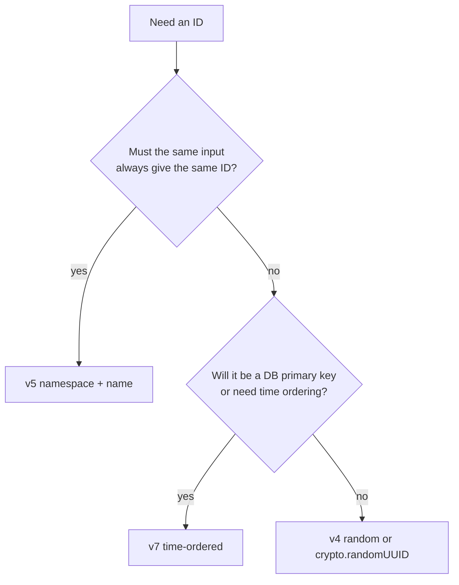
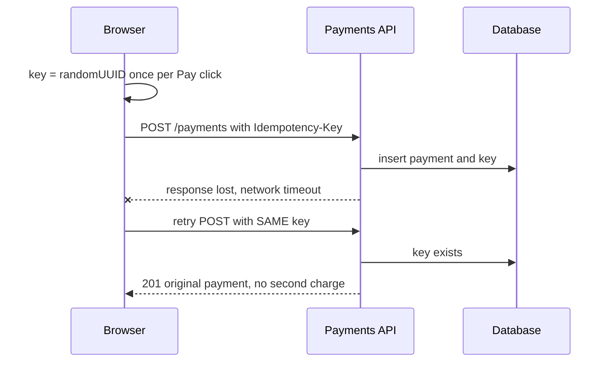

## 1. What it is

**A UUID (Universally Unique Identifier) is a 128-bit ID, written as 36 characters like `9b2f1c3e-4a5d-4e6f-8a7b-1c2d3e4f5a6b`, that you can create anywhere with practically zero chance of a collision.**

Think of a UUID like a lottery ticket number drawn from a pool so huge that no two people in history would ever draw the same one. You do not need a central office handing out numbers; everyone draws their own and they still never clash.

The problem it solves: auto-increment IDs (1, 2, 3...) need one central counter, usually the database. A browser creating a new transaction row, or a payment request being retried, cannot wait for that counter. UUIDs let any machine, including the client, create an ID up front that is safe to send to the server, store, and dedupe on.

## 2. Core concepts

### [Beginner] Anatomy of a UUID

```ts
// 8-4-4-4-12 hex digits = 32 hex = 128 bits
//            version digit ┐    ┌ variant bits (8, 9, a or b)
const id = '9b2f1c3e-4a5d-4e6f-8a7b-1c2d3e4f5a6b';
//                         ^    ^
// 3rd group starts with the version (4 here), 4th group starts with the variant.
```

> **Why:** Six of the 128 bits are fixed to record the version and variant, so a v4 UUID has 122 random bits. That is still about 5.3 x 10^36 possible values.

### [Beginner] The versions that matter

| Version | How it is built | Sortable by time? | Typical use |
|---|---|---|---|
| v1 | timestamp + MAC address | partly | legacy; leaks machine identity |
| v4 | 122 random bits | no | default choice for general IDs |
| v5 | SHA-1 hash of namespace + name | no | same input always gives same ID |
| v7 | 48-bit Unix ms timestamp + random | yes | database primary keys |

```ts
import { v4, v5, v7 } from 'uuid';

v4(); // '3d6f0a4e-...' random
v7(); // '019a2b3c-...' starts with time, so later IDs sort after earlier ones

const NS = '6ba7b811-9dad-11d1-80b4-00c04fd430c8'; // standard URL namespace
v5('https://bank.example/accounts/123', NS); // deterministic: same every time
```



> **Why:** v7 is popular for primary keys because databases store B-tree indexes in sorted order. Random v4 keys insert all over the index, causing page splits and poor cache use. v7 keys arrive in increasing order, appending near the end like an auto-increment. v7 was standardized in RFC 9562 (2024).

### [Beginner] Native: crypto.randomUUID

```ts
const id: string = crypto.randomUUID(); // v4, built into browsers and Node 19+ global
```

> **Gotcha:** `crypto.randomUUID()` only exists in **secure contexts** (HTTPS or `localhost`). On a plain `http://` internal test server it is `undefined` and your code throws. The `uuid` package works everywhere `crypto.getRandomValues` exists.

### [Intermediate] Collision math intuition

The birthday paradox says collisions become likely around the square root of the number of possible values. For 122 random bits that is about 2^61, roughly 2.3 x 10^18 IDs.

```ts
// Rough probability of at least one collision: p ~ n^2 / (2 * 2^122)
const p = (n: number) => (n * n) / (2 * 2 ** 122);
p(1e9);  // ~ 9.4e-20  (a billion IDs)
p(1e12); // ~ 9.4e-14  (a trillion IDs)
```

> **Why:** You are far more likely to hit a bug in your own code, a cosmic-ray bit flip, or a bad random number generator than a real v4 collision. The real risk is a weak RNG, which is why `uuid` and `crypto.randomUUID` use the cryptographically secure `crypto.getRandomValues`, never `Math.random`.

### [Intermediate] validate and version

```ts
import { validate, version, NIL } from 'uuid';

validate('9b2f1c3e-4a5d-4e6f-8a7b-1c2d3e4f5a6b'); // true
validate('not-a-uuid');                            // false
version('9b2f1c3e-4a5d-4e6f-8a7b-1c2d3e4f5a6b');  // 4
NIL;                                               // '00000000-0000-0000-0000-000000000000'

// Route guard: reject garbage before hitting the API
function parseAccountId(raw: string): string {
  if (!validate(raw)) throw new Error('Invalid account id');
  return raw;
}
```

### [Advanced] Idempotency keys for payments

A network request can fail after the server processed it. If the client retries, the payment could happen twice. An idempotency key is a UUID generated ONCE per user intent and sent with every retry; the server stores it and returns the original result for repeats.



```tsx
function PayButton({ draft }: { draft: PaymentDraft }) {
  // One key per payment attempt, stable across re-renders and retries
  const keyRef = useRef<string>(crypto.randomUUID());

  const pay = useMutation({
    mutationFn: () =>
      api.post('/payments', draft, { headers: { 'Idempotency-Key': keyRef.current } }),
    retry: 3,
    onSuccess: () => { keyRef.current = crypto.randomUUID(); }, // next payment gets new key
  });

  return <button onClick={() => pay.mutate()} disabled={pay.isPending}>Pay</button>;
}
```

> **Gotcha:** Generating the key inside `mutationFn` creates a new key per retry, which defeats the purpose. Generate it per user intent, not per HTTP call.

> **Finance tip:** Stripe, Adyen and most payment APIs support an `Idempotency-Key` header. Interviewers in fintech love this topic.

### [Advanced] React keys for client-created rows

```tsx
interface DraftLine { id: string; payee: string; amountCents: number }

function SplitPayment() {
  const [lines, setLines] = useState<DraftLine[]>([]);
  const add = () => setLines((l) => [...l, { id: crypto.randomUUID(), payee: '', amountCents: 0 }]);
  const remove = (id: string) => setLines((l) => l.filter((x) => x.id !== id));

  return (
    <>
      {lines.map((line) => (
        <LineEditor key={line.id} line={line} onRemove={() => remove(line.id)} />
      ))}
      <button onClick={add}>Add line</button>
    </>
  );
}
```

> **Why not index keys?** React uses `key` to match elements between renders. With `key={index}`, deleting row 0 makes the old row 1 become index 0, so React reuses row 0's component and its internal state (input focus, uncontrolled input values) for the wrong data. A stable UUID created once when the row is created follows the row wherever it moves.

> **Gotcha:** Never write `key={crypto.randomUUID()}` in JSX. That creates a new key every render, so React unmounts and remounts every row each time, losing focus and state.

## 3. Why it's used in this project

- **Payment and transfer idempotency**: every "Submit transfer" generates one key so retries never double-charge.
- **Client-created rows**: split payments, budget lines, and bulk upload previews need stable React keys before the server assigns IDs.
- **Optimistic updates**: a new transaction shows instantly in the list with a client UUID; the server accepts the same ID so no remapping is needed.
- **Correlation IDs**: an `X-Request-Id` UUID on each API call ties browser logs to backend logs for audit trails and incident review.
- **Upload IDs**: statement or receipt uploads get a UUID filename so user-provided names (which can contain PII) never reach storage paths.

## 4. Setup & configuration

```bash
npm install uuid
# uuid v10+ ships its own TypeScript types; @types/uuid is not needed
```

```ts
// Named ESM imports (tree-shakeable)
import { v4 as uuidv4, v7 as uuidv7, validate, version } from 'uuid';

// Prefer the native API when only v4 is needed in a secure context
export const newId = (): string =>
  typeof crypto !== 'undefined' && 'randomUUID' in crypto
    ? crypto.randomUUID()           // HTTPS / localhost
    : uuidv4();                     // fallback for non-secure contexts or older runtimes
```

> **Outdated:** Old code imports `const uuid = require('uuid/v4')`. Deep imports were removed in uuid v8. Use named imports.

> **Gotcha:** Recent major versions of `uuid` have dropped CommonJS and old Node versions (check the changelog of your installed major). In Jest with CJS transforms you may need `transformIgnorePatterns` to include `uuid`; Vitest handles ESM natively.

## 5. Key features we use

### [Beginner] Create an ID

```ts
const txnId = crypto.randomUUID();
```

### [Beginner] Validate route params

```ts
const { accountId } = useParams();
if (!accountId || !validate(accountId)) return <NotFound />;
```

### [Intermediate] Correlation ID per request

```ts
api.interceptors.request.use((config) => {
  config.headers['X-Request-Id'] = crypto.randomUUID();
  return config;
});
```

### [Intermediate] Time-ordered IDs for a local outbox

```ts
import { v7 } from 'uuid';
const outbox: { id: string; payload: Transfer }[] = [];
outbox.push({ id: v7(), payload }); // sorting by id = sorting by creation time
```

## 6. Interview questions

#### Q: What is the difference between UUID v4 and v7, and when would you pick each?

v4 is 122 random bits: unpredictable, no information leaked, but unordered. v7 puts a millisecond Unix timestamp in the first 48 bits followed by random bits, so IDs sort by creation time. Pick v7 for database primary keys (better index locality) or when ordering by ID matters. Pick v4 for general-purpose IDs or when you do not want creation time visible in the ID.

#### Q: Should you use crypto.randomUUID or the uuid package?

For v4 in modern browsers and Node, `crypto.randomUUID()` is built in, fast, and needs no dependency. It requires a secure context (HTTPS or localhost) in browsers. Use the `uuid` package when you need other versions (v5, v7), `validate`/`version` helpers, or must run in a non-secure context.

#### Q: What is an idempotency key and why does a payment form need one?

It is a unique value, usually a UUID, generated once per user action and sent with every attempt of that request. If a response is lost and the client retries, the server sees the same key and returns the stored result instead of processing the payment again. It must be created per user intent, not per HTTP attempt, or retries would each get a new key.

#### Q: Why not use the array index as a React key for rows the user can add and remove?

React matches elements across renders by key. When a row is removed or reordered, indexes shift, so React reuses the wrong component instance and its state (focus, uncontrolled input values, local state) attaches to the wrong row. A UUID assigned once when the row is created stays with that row. Generating a new UUID in render is also wrong because it remounts everything.

#### Q: Can two UUIDs collide? How worried should you be?

In theory yes. With 122 random bits you would need on the order of 10^18 IDs before a collision becomes likely. In practice the risk comes from a bad random source (for example `Math.random`-based generators), not the math. Use a CSPRNG-backed generator and still keep a unique constraint in the database as a safety net.

## 7. Drawbacks & pain points

- 36 characters is long in URLs and logs; 16 bytes vs 4-8 for an integer key.
- Random v4 primary keys fragment database indexes (use v7 or let the DB generate keys).
- Not human-friendly: users cannot read a UUID over the phone to support. Use a separate short reference like `TXN-48213` for display.
- v1 leaks MAC address and time; v7 leaks creation time.
- `crypto.randomUUID` is missing on non-HTTPS origins.

Gotchas that trip devs up:

```tsx
// 1. New key every render: remounts all rows
{rows.map((r) => <Row key={crypto.randomUUID()} row={r} />)}

// 2. New idempotency key per retry: double charges possible
mutationFn: () => api.post('/pay', d, { headers: { 'Idempotency-Key': crypto.randomUUID() } })

// 3. Case sensitivity: UUIDs are case-insensitive by spec, strings are not
'ABC...' === 'abc...'; // false -- normalize with toLowerCase() before comparing

// 4. Math.random-based "uuid" snippets from old blog posts are not cryptographically random
```

## 8. Better alternatives

The direction: native `crypto.randomUUID` for v4, v7 for database keys, and shorter IDs (nanoid) where length matters.

- **nanoid**: 21-character URL-safe IDs (`V1StGXR8_Z5jdHi6B-myT`) with about 126 bits of randomness, tiny (~120 bytes gzip for the core), customizable alphabet. Not a UUID format, so DB columns typed `uuid` will reject it.
- **ULID**: 26-character, time-sortable, Crockford base32. Similar goals to v7; v7 is now the standardized option.
- **cuid2**: collision-resistant, not time-ordered, designed to hide creation time.
- **Database-generated IDs**: `gen_random_uuid()` in Postgres, or identity columns, when the client does not need the ID up front.

| Option | Bundle (gzip) | Length | Sortable | TypeScript | Popularity | When it wins |
|---|---|---|---|---|---|---|
| crypto.randomUUID | 0 KB | 36 | no | built in | universal | default v4 in browsers |
| uuid package | ~<1 KB per fn | 36 | v7 yes | bundled types | very high | v5/v7, validate, non-secure contexts |
| nanoid | ~0.1-0.2 KB | 21 default | no | bundled | very high | short URL-safe IDs |
| ULID | ~1 KB | 26 | yes | bundled | moderate | sortable IDs in legacy systems |
| DB-generated | 0 KB | varies | depends | n/a | universal | server owns ID creation |

## 9. When NOT to use it

- For human-facing references (statement numbers, support ticket IDs): use short readable codes.
- As a secret or session token: a UUID is unique, not a security credential with guaranteed entropy semantics; use a dedicated token generator.
- As a React key generated in render.
- When the database already assigns IDs and the client never needs one before saving.
- When ID length matters (short URLs, QR codes): nanoid.

## Cheatsheet

| Task | Code |
|---|---|
| Random v4 (native) | `crypto.randomUUID()` |
| Random v4 (package) | `import { v4 } from 'uuid'; v4()` |
| Time-ordered | `import { v7 } from 'uuid'; v7()` |
| Deterministic | `v5(name, namespaceUuid)` |
| Validate | `validate(str)` |
| Which version | `version(str)` |
| Nil UUID | `NIL` |
| Short ID | `import { nanoid } from 'nanoid'; nanoid()` |

```ts
// Rules of thumb
const rowId = crypto.randomUUID();            // once, when row is created -> key={row.id}
const idemKey = useRef(crypto.randomUUID());  // once per payment intent, reuse on retries
const pk = v7();                              // DB primary key, sortable
if (!validate(param)) throw new Error('bad id');
```
