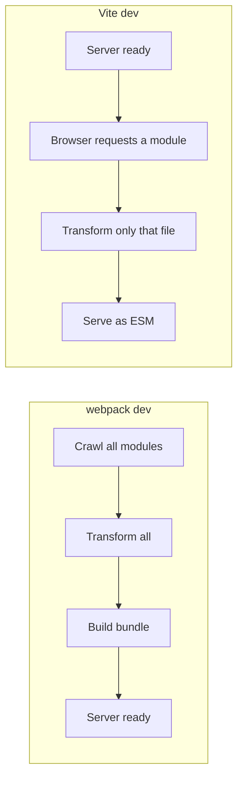
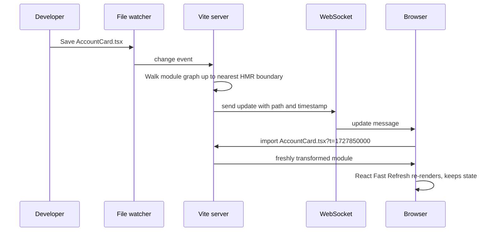
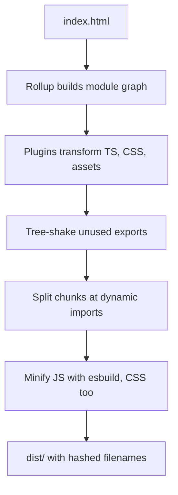
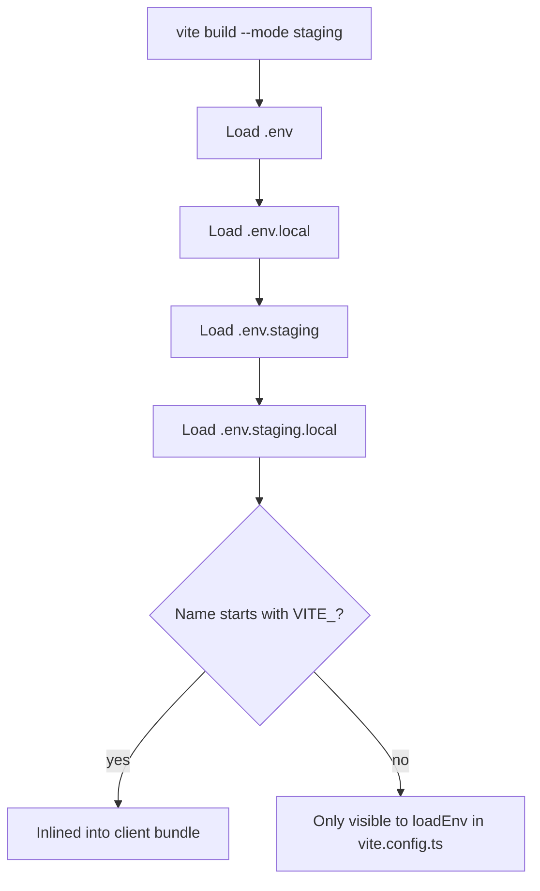

## 1. What it is

**Vite is a frontend build tool: a dev server that serves source files as native ES modules, plus a production bundler built on Rollup (moving to Rolldown).**

Think of a restaurant. Webpack is a kitchen that cooks every dish on the menu before it opens the doors, so the first customer waits a long time. Vite opens the doors immediately and cooks each dish only when a customer orders it. The browser is the customer: it asks for `main.tsx`, Vite transforms just that file, the browser sees `import './Dashboard'`, asks for that, and so on. Nothing that is not requested gets cooked.

The problem it solves: as apps grew to thousands of modules, bundler-based dev servers took tens of seconds to start and seconds to reflect each edit. Vite makes dev startup roughly constant regardless of app size, and makes Hot Module Replacement (HMR) fast because it only re-processes the one file you changed. For production it still bundles, because shipping thousands of tiny files over the network is slow.

## 2. Core concepts

### [Beginner] Native ES modules in the browser

Modern browsers understand `import`/`export` natively. A `<script type="module">` can import other files by URL. Vite leans on this: in dev it does not bundle your app code at all.

```html
<!-- index.html is the entry point in Vite (not a JS file) -->
<!doctype html>
<html lang="en">
  <head><title>Portfolio Dashboard</title></head>
  <body>
    <div id="root"></div>
    <!-- The browser fetches /src/main.tsx; Vite transforms TSX to JS on the fly -->
    <script type="module" src="/src/main.tsx"></script>
  </body>
</html>
```

```ts
// src/main.tsx -- the browser will request ./App.tsx next, then App's imports, etc.
import { createRoot } from 'react-dom/client';
import { App } from './App';

createRoot(document.getElementById('root')!).render(<App />);
```

> **Why:** `index.html` is the entry because Vite treats your app like a real web page. It parses the HTML, finds module scripts, and follows imports from there. Webpack instead starts from a JS entry and generates the HTML.

### [Beginner] Why unbundled dev is fast compared to webpack

A bundler-based dev server (webpack) must crawl the whole dependency graph, transform every file, and build a bundle before it can serve the first page. Cost grows with app size.

Vite splits the work in two:

- **Dependencies** (`react`, `date-fns`, `recharts`) rarely change. Vite pre-bundles them once with esbuild and caches them.
- **Source code** (your `.tsx`) changes constantly. Vite serves it on demand and only transforms files the browser actually requests for the current route.



> **Interview tip:** Say "Vite shifts work from startup to request time, and only for modules the current page needs." That is the core insight.

### [Beginner] Transforms: Vite strips types, it does not type-check

Vite uses esbuild (or SWC via a plugin) to turn TS/TSX into JS. esbuild just deletes type annotations per file. It never checks types.

```ts
// src/lib/money.ts
export function formatCents(amountCents: number, currency: string): string {
  return new Intl.NumberFormat('en-US', { style: 'currency', currency }).format(amountCents / 100);
}

// Elsewhere: formatCents('100', 'USD')
// Vite dev server: works, no error shown. Types are just stripped.
// tsc --noEmit: error TS2345: Argument of type 'string' is not assignable to 'number'.
```

```json
// package.json -- type-check separately
{
  "scripts": {
    "dev": "vite",
    "build": "tsc -b && vite build",
    "typecheck": "tsc --noEmit"
  }
}
```

> **Gotcha:** "It builds, so the types are fine" is wrong with Vite. Run `tsc` in CI and in the build script, or use `vite-plugin-checker` for in-browser type errors during dev.

### [Intermediate] Dependency pre-bundling with esbuild

When you start the dev server, Vite scans your source for bare imports (`import { format } from 'date-fns'`) and pre-bundles those packages with esbuild into `node_modules/.vite/deps`. Two reasons:

1. **CommonJS to ESM.** Many packages still ship CommonJS. Browsers cannot run `require()`. esbuild converts them.
2. **Request count.** `lodash-es` is hundreds of files. Unbundled, the browser would fire hundreds of requests. Pre-bundling turns it into one file.

```ts
// vite.config.ts
import { defineConfig } from 'vite';

export default defineConfig({
  optimizeDeps: {
    // Force-include deps that are imported dynamically or discovered late,
    // to avoid a mid-session "new dependencies optimized, reloading" full reload.
    include: ['recharts', 'decimal.js'],
    // Exclude a linked local package you are actively editing.
    exclude: ['@acme/ui-kit'],
  },
});
```

Pre-bundled deps are served with `Cache-Control: max-age=31536000, immutable`, keyed by a hash of your lockfile and config. Change the lockfile and Vite re-bundles.

> **Gotcha:** If deps look stale after switching branches, run `vite --force` or delete `node_modules/.vite`.

### [Intermediate] How HMR works

HMR swaps a changed module in the running page without a full reload, so React state (an open modal, a half-filled transfer form) survives.



Key ideas:

- Vite keeps a **module graph**: who imports whom.
- An **HMR boundary** is a module that accepts updates (calls `import.meta.hot.accept`). The React plugin injects this into every component module automatically (React Fast Refresh).
- If the change propagates up to the root with no boundary, Vite does a full page reload.
- Cost is proportional to the one changed file, not app size.

```ts
// Manual HMR API (plugins/framework code normally do this for you)
if (import.meta.hot) {
  import.meta.hot.accept((newModule) => {
    // swap in newModule's exports
  });
  import.meta.hot.dispose(() => {
    // clean up timers, sockets (e.g. a live price feed) before replacement
  });
}
```

> **Gotcha:** Fast Refresh only preserves state if a file exports **only React components**. Export a constant or helper alongside a component and Vite falls back to a full reload for that file. `eslint-plugin-react-refresh` warns about this.

### [Intermediate] Production build with Rollup

`vite build` bundles for production. Unbundled ESM is great on localhost but bad over real networks: deep import chains cause request waterfalls. So production uses a real bundler with tree-shaking, code splitting, minification and hashed filenames.



```ts
// Dynamic import creates a separate chunk, loaded only when the route is visited
const ReportsPage = lazy(() => import('./pages/ReportsPage'));
```

Hashed filenames (`ReportsPage-3f9a1c.js`) let the CDN cache forever: content changes means a new name.

> **Why two tools?** Historically esbuild was fastest at transforms but weaker at chunk splitting and plugin flexibility; Rollup produced better production output. Using both caused subtle dev/prod differences.

### [Advanced] Rolldown: one bundler for dev and prod

Rolldown is a Rust port of Rollup's API built by the Vite team (VoidZero), with esbuild-level speed. The direction: replace both esbuild and Rollup with Rolldown (plus Oxc for transforms), giving one consistent pipeline and much faster builds. It shipped as the `rolldown-vite` drop-in package during Vite 7 and is the default bundler in Vite 8 (verify the exact status for your version).

```json
// Trying Rolldown on Vite 7 via package alias (as documented by the Vite team)
{
  "devDependencies": {
    "vite": "npm:rolldown-vite@latest"
  }
}
```

> **Outdated:** Advice like "esbuild for dev, Rollup for prod" describes Vite 2 through 7. Check your major version. Most `build.rollupOptions` stay compatible because Rolldown mirrors Rollup's API, though some options are renamed (for example `rolldownOptions`) in newer versions.

### [Advanced] The plugin API

Vite plugins are Rollup plugins plus Vite-only hooks. A plugin is an object with a `name` and hooks.

```ts
// plugins/build-info.ts -- inject a build stamp, useful for support tickets
import type { Plugin } from 'vite';

export function buildInfo(): Plugin {
  const virtualId = 'virtual:build-info';
  const resolvedId = '\0' + virtualId; // \0 prefix = "not a real file" convention

  return {
    name: 'acme:build-info',
    enforce: 'pre', // run before core plugins
    resolveId(id) {
      if (id === virtualId) return resolvedId;
    },
    load(id) {
      if (id === resolvedId) {
        return `export const builtAt = ${JSON.stringify(new Date().toISOString())};`;
      }
    },
    transform(code, id) {
      if (!id.endsWith('.tsx')) return null;
      // return { code, map } to modify source; null = unchanged
      return null;
    },
    // Vite-only hooks:
    configureServer(server) {
      server.middlewares.use('/__health', (_req, res) => res.end('ok'));
    },
    transformIndexHtml(html) {
      return html.replace('</head>', '<meta name="robots" content="noindex"></head>');
    },
  };
}
```

| Hook | From | Runs |
| --- | --- | --- |
| `config`, `configResolved` | Vite | once, to modify/read config |
| `configureServer` | Vite | dev only, add middleware |
| `transformIndexHtml` | Vite | dev and build |
| `handleHotUpdate` | Vite | dev, custom HMR |
| `resolveId`, `load`, `transform` | Rollup | per module, dev and build |
| `generateBundle` | Rollup | build only |

`apply: 'build'` or `apply: 'serve'` restricts a plugin to one mode.

## 3. Why it's used in this project

- **Big app, fast feedback.** A financial dashboard has many routes (accounts, transactions, portfolio, reports, settings). Dev startup stays fast because only the current route's modules are transformed.
- **HMR keeps form state.** When tweaking a multi-step account-opening form or a money input, Fast Refresh keeps what you typed instead of resetting the wizard.
- **API proxy.** `server.proxy` forwards `/api` to the backend so the browser sees one origin. No CORS hacks in dev, and Okta cookies or tokens behave like production.
- **Code splitting heavy pages.** Charting and PDF/CSV export libraries are large. `manualChunks` and `lazy()` keep them out of the login and dashboard bundle.
- **Safe env handling.** The `VITE_` prefix stops server secrets from leaking into a bundle that every customer downloads.
- **Sourcemaps for error tracking** (Sentry/Datadog) without exposing source publicly, using `sourcemap: 'hidden'`.

> **Finance tip:** Everything in the client bundle is public. An Okta client ID and issuer URL are fine to expose. A client secret, database URL or internal API key is not, and must never use the `VITE_` prefix.

## 4. Setup & configuration

```bash
# Scaffold (pick react-ts or react-swc-ts)
npm create vite@latest portfolio-web -- --template react-ts
cd portfolio-web && npm install && npm run dev
```

```ts
// vite.config.ts
import { defineConfig, loadEnv } from 'vite';
import react from '@vitejs/plugin-react';
import { fileURLToPath, URL } from 'node:url';

// Function form gives access to the mode ('development', 'production', 'staging'...)
export default defineConfig(({ mode, command }) => {
  // loadEnv reads .env files for this mode. Third arg '' = load ALL vars, not just VITE_.
  // Only use non-VITE_ values here in Node config; they never reach the client.
  const env = loadEnv(mode, process.cwd(), '');

  return {
    // Plugins run in array order (subject to `enforce`)
    plugins: [react()],

    resolve: {
      alias: {
        // import { formatCents } from '@/lib/money'
        '@': fileURLToPath(new URL('./src', import.meta.url)),
      },
    },

    server: {
      port: 5173,          // default dev port
      strictPort: true,    // fail instead of silently picking another port (Okta redirect URIs are exact)
      open: false,
      proxy: {
        // /api/accounts -> https://api-dev.internal/accounts
        '/api': {
          target: env.API_PROXY_TARGET ?? 'http://localhost:8080',
          changeOrigin: true, // rewrite Host header to the target
          secure: false,      // allow self-signed certs in dev
          rewrite: (path) => path.replace(/^\/api/, ''),
        },
      },
    },

    preview: { port: 4173 }, // `vite preview` serves dist/ locally

    define: {
      // Literal text replacement at build time. Values must be JSON-stringified.
      __APP_VERSION__: JSON.stringify(process.env.npm_package_version),
    },

    build: {
      outDir: 'dist',
      target: 'es2022',     // syntax level of output (Vite 7 default: 'baseline-widely-available')
      sourcemap: mode === 'production' ? 'hidden' : true, // 'hidden' = emit .map, no //# sourceMappingURL comment
      chunkSizeWarningLimit: 600, // kB, just a warning threshold
      rollupOptions: {
        output: {
          // Split stable vendor code into long-cached chunks
          manualChunks: {
            react: ['react', 'react-dom', 'react-router'],
            charts: ['recharts'],
            okta: ['@okta/okta-auth-js', '@okta/okta-react'],
          },
        },
      },
    },

    // Only VITE_-prefixed vars are exposed to client code (this is the default)
    envPrefix: 'VITE_',
  };
});
```

```ts
// src/vite-env.d.ts -- type your env vars and globals
/// <reference types="vite/client" />

interface ImportMetaEnv {
  readonly VITE_OKTA_ISSUER: string;
  readonly VITE_OKTA_CLIENT_ID: string;
  readonly VITE_API_BASE_URL: string;
}
interface ImportMeta {
  readonly env: ImportMetaEnv;
}
declare const __APP_VERSION__: string;
```

```json
// tsconfig.json -- keep the alias in sync for the type checker and editor
{
  "compilerOptions": {
    "baseUrl": ".",
    "paths": { "@/*": ["src/*"] }
  }
}
```

> **Gotcha:** `resolve.alias` only teaches Vite. TypeScript needs `paths` too, or the editor shows red squiggles while the app runs fine. `vite-tsconfig-paths` can derive aliases from tsconfig instead.

## 5. Key features we use

### [Beginner] Environment variables and the VITE_ prefix

Vite statically replaces `import.meta.env.X` at build time. It is text replacement, not a runtime lookup.

```ts
// src/config.ts
export const oktaConfig = {
  issuer: import.meta.env.VITE_OKTA_ISSUER,
  clientId: import.meta.env.VITE_OKTA_CLIENT_ID,
  redirectUri: `${window.location.origin}/login/callback`,
};

// Built-in values
import.meta.env.MODE; // 'development' | 'production' | custom mode
import.meta.env.DEV;  // boolean
import.meta.env.PROD; // boolean
import.meta.env.BASE_URL; // from `base` config
```

**Why the prefix?** `.env` files often hold server secrets (`DB_PASSWORD`, `STRIPE_SECRET_KEY`) shared with backend tooling. If Vite exposed every variable, one `import.meta.env.DB_PASSWORD` typo would ship a secret to every browser. The prefix is an explicit opt-in: "I declare this value public."

### [Beginner] .env files and modes

```text
.env                  # loaded in all modes
.env.local            # all modes, git-ignored, local overrides
.env.[mode]           # e.g. .env.staging, only in that mode
.env.[mode].local     # mode-specific, git-ignored
```

Priority: `.env.[mode].local` > `.env.[mode]` > `.env.local` > `.env`. Variables already set in the shell win over all files.

```bash
vite                    # mode = development
vite build              # mode = production
vite build --mode staging   # loads .env.staging
```



> **Gotcha:** Because values are baked in at build time, one build artifact cannot be promoted from staging to production with different env values. Teams that need "build once, deploy many" load a runtime `config.json` (or inject `window.__CONFIG__` from the server) instead.

### [Intermediate] Proxy to avoid CORS in dev

```ts
server: {
  proxy: {
    '/api': { target: 'http://localhost:8080', changeOrigin: true },
    // WebSocket for live prices
    '/ws': { target: 'ws://localhost:8080', ws: true },
  },
},
```

```ts
// Client code always uses relative URLs; same code works behind prod reverse proxy
const res = await fetch(`/api/accounts/${accountId}/transactions?limit=50`);
```

### [Intermediate] manualChunks as a function

```ts
build: {
  rollupOptions: {
    output: {
      manualChunks(id) {
        if (id.includes('node_modules')) {
          if (id.includes('recharts') || id.includes('d3-')) return 'charts';
          if (id.includes('@okta')) return 'auth';
          return 'vendor';
        }
      },
    },
  },
},
```

> **Gotcha:** A single giant `vendor` chunk defeats caching: any dependency bump invalidates the whole thing. Group by change frequency, and do not force lazy-only libraries into an eagerly loaded chunk.

### [Intermediate] Static assets and glob imports

```ts
import logoUrl from './assets/logo.svg';          // URL string, hashed in build
import csvTemplate from './templates/tx.csv?raw'; // file contents as string
import Worker from './workers/parse-statement?worker'; // Web Worker constructor

// Eagerly import all locale files
const locales = import.meta.glob('./locales/*.json', { eager: true });
```

Files in `public/` are copied as-is and referenced by absolute path (`/favicon.ico`), never hashed.

### [Intermediate] @vitejs/plugin-react vs @vitejs/plugin-react-swc

| | `@vitejs/plugin-react` | `@vitejs/plugin-react-swc` |
| --- | --- | --- |
| Dev transform | esbuild, Babel only if you add Babel plugins | SWC (Rust) |
| Fast Refresh | via Babel | via SWC |
| Speed | fast | faster, especially big projects |
| Custom Babel plugins | yes (`babel: { plugins: [...] }`) | no, SWC plugins only (less mature) |
| React Compiler | yes, via `babel-plugin-react-compiler` | needs Babel path |
| Pick when | you need Babel plugins or the React Compiler | you want max speed, no Babel needs |

```ts
// Babel variant with React Compiler
import react from '@vitejs/plugin-react';
export default defineConfig({
  plugins: [react({ babel: { plugins: ['babel-plugin-react-compiler'] } })],
});
```

```ts
// SWC variant
import react from '@vitejs/plugin-react-swc';
export default defineConfig({ plugins: [react()] });
```

> **Outdated:** Newer `@vitejs/plugin-react` versions can use Oxc instead of Babel when no Babel plugins are configured, narrowing the speed gap. Check your plugin version's changelog.

### [Advanced] Library mode and Vitest share the config

```ts
// vitest reads vite.config.ts, so aliases and plugins apply to tests too
/// <reference types="vitest/config" />
export default defineConfig({
  plugins: [react()],
  test: { environment: 'jsdom', setupFiles: ['./src/test/setup.ts'] },
});
```

## 6. Interview questions

#### Q: Why is Vite's dev server faster than webpack's?

Webpack bundles the whole app before serving, so startup and rebuild cost grow with app size. Vite does not bundle source code in dev. It serves files as native ES modules and transforms each one only when the browser requests it, so only the current page's modules are processed. Dependencies are pre-bundled once with esbuild (written in Go, very fast) and cached with immutable headers. HMR is fast because Vite only re-transforms the one changed file and walks the module graph to the nearest HMR boundary, independent of total app size.

#### Q: Why does Vite pre-bundle dependencies?

Two reasons. First, many npm packages are CommonJS, which browsers cannot execute, so esbuild converts them to ESM. Second, some ESM packages are made of hundreds of internal files; serving them unbundled would cause hundreds of HTTP requests and a slow page load. Pre-bundling collapses each dependency into one module. The result is cached in `node_modules/.vite` and invalidated when the lockfile or relevant config changes.

#### Q: Why do client env vars need the VITE_ prefix, and is a VITE_ variable secret?

`import.meta.env.X` is replaced with a literal string at build time, so the value ends up in the JS file that every user downloads. The prefix is an allow-list so that server secrets in the same `.env` file cannot leak by accident. A `VITE_` variable is never secret. Treat it as public. Secrets must stay on a backend.

#### Q: Why does Vite use a different tool for production than for dev?

Unbundled ESM over a real network causes request waterfalls and many round trips, so production needs bundling, tree-shaking, code splitting, minification and content-hashed filenames. Vite has used Rollup for this because of its mature output and plugin ecosystem, while esbuild handled dev transforms for speed. The mismatch could cause dev/prod inconsistencies, which is why Vite is moving to Rolldown, a Rust bundler with a Rollup-compatible API, to use one engine for both.

#### Q: How do you split a large vendor bundle, and what are the trade-offs?

Use route-level `lazy(() => import(...))` first, because it splits by what the user actually needs. Then use `build.rollupOptions.output.manualChunks` to group stable vendor code (React, auth SDK, charts) into separate long-cached chunks. Trade-offs: too many chunks means more requests; one giant vendor chunk means any dependency update busts the whole cache; forcing a lazy library into an eager chunk makes initial load heavier. Measure with `rollup-plugin-visualizer`.

## 7. Drawbacks & pain points

- **No type-checking in the pipeline.** Builds succeed with type errors unless you run `tsc`.
- **Dev and prod can differ** (unbundled vs bundled, esbuild vs Rollup). Always check `vite build && vite preview` before release.
- **Big apps can be slow on first load in dev.** Thousands of unbundled modules mean thousands of requests. `server.warmup` helps.
- **Build-time env vars** block "build once, deploy everywhere".
- **CommonJS edge cases.** Some old packages break in pre-bundling and need `optimizeDeps.include` or `build.commonjsOptions`.
- **Plugin incompatibility** across major versions and during the Rolldown transition.

Gotchas that trip devs up:

```ts
// 1. Destructuring import.meta.env breaks static replacement in builds
const { VITE_API_BASE_URL } = import.meta.env; // may be undefined in production
const apiBase = import.meta.env.VITE_API_BASE_URL; // correct: full static expression

// 2. define does raw text replacement; forgetting JSON.stringify injects code
define: { __ENV__: 'production' }                 // becomes the identifier production -> ReferenceError
define: { __ENV__: JSON.stringify('production') } // correct

// 3. process.env does not exist in browser code
const url = process.env.REACT_APP_API_URL; // CRA habit -> ReferenceError
```

```ts
// 4. Mixing component and non-component exports breaks Fast Refresh
export const DEFAULT_CURRENCY = 'USD'; // move to constants.ts
export function AccountCard() { /* ... */ }
```

> **Gotcha:** `base` must be set when the app is served from a sub-path (`/portal/`). Otherwise asset URLs point to the domain root and 404 in production only.

## 8. Better alternatives

Vite is the industry default for client-side React apps in 2026 and the base of many frameworks (React Router v7 framework mode, Remix, Vitest, Storybook's Vite builder, Astro, SvelteKit, Nuxt). Create React App is deprecated (officially sunset in early 2025). The real choices are mostly "Vite or a framework", or a different bundler for specific needs.

| Tool | Dev speed | Prod build speed | Config boilerplate | Ecosystem | Learning curve | When it wins |
| --- | --- | --- | --- | --- | --- | --- |
| Vite (Rollup) | ~instant start | moderate | low | huge | low | default SPA choice |
| Vite + Rolldown | ~instant start | ~several times faster | low | huge, mostly compatible | low | large apps wanting faster builds |
| webpack 5 | slow on big apps | slow | high | huge, oldest | high | legacy apps, Module Federation |
| Rspack / Rsbuild | fast | fast | medium, webpack-compatible | growing | medium | migrating big webpack apps |
| Turbopack (Next.js) | fast | fast | hidden by Next | Next only | low inside Next | Next.js apps |
| Parcel 2 | fast | moderate | ~zero | small | lowest | tiny zero-config projects |
| esbuild direct | very fast | very fast | manual | small | medium | libraries, scripts |
| Create React App | slow | slow | low | dead | low | never for new work |

> **Outdated:** Create React App (`react-scripts`) is deprecated. React's docs recommend a framework or a build tool like Vite. Migrating CRA means replacing `process.env.REACT_APP_*` with `import.meta.env.VITE_*` and moving `index.html` to the project root.

## 9. When NOT to use it

- You need **server rendering, server components and routing conventions** out of the box: use a framework (Next.js, React Router v7 framework mode) rather than hand-rolling SSR on raw Vite.
- A huge legacy **webpack app relying on Module Federation** or custom loaders where migration cost is high: consider Rspack as a drop-in first.
- Publishing a **small TS library** with no CSS or assets: `tsup`/`tsdown` or plain `tsc` is simpler than Vite library mode.
- **Node backend services**: Vite targets browser apps; use `tsc`, `tsx` or esbuild.
- Environments that **require one artifact deployed to many environments** with build-time env vars: possible, but only with a runtime config pattern on top.

## Cheatsheet

| Task | How |
| --- | --- |
| Start dev | `vite` (or `npm run dev`) |
| Build | `vite build` (`--mode staging`) |
| Preview build | `vite preview` |
| Force dep re-bundle | `vite --force` |
| Client env var | `import.meta.env.VITE_X` |
| Built-in env | `MODE`, `DEV`, `PROD`, `BASE_URL`, `SSR` |
| Env in config | `loadEnv(mode, process.cwd(), '')` |
| Alias | `resolve.alias: { '@': '/src' }` + tsconfig `paths` |
| Proxy | `server.proxy: { '/api': { target, changeOrigin: true } }` |
| Compile-time constant | `define: { __X__: JSON.stringify(v) }` |
| Vendor split | `build.rollupOptions.output.manualChunks` |
| Private sourcemaps | `build.sourcemap: 'hidden'` |
| Sub-path deploy | `base: '/portal/'` |
| Raw file | `import s from './f.txt?raw'` |
| Worker | `import W from './w.ts?worker'` |
| Glob | `import.meta.glob('./x/*.ts', { eager: true })` |

```ts
// Minimal plugin skeleton
export const myPlugin = (): Plugin => ({
  name: 'my-plugin',
  enforce: 'pre',          // or 'post'
  apply: 'build',          // or 'serve'
  config(cfg, { mode }) {},
  configureServer(server) {},
  resolveId(id) {},
  load(id) {},
  transform(code, id) { return null; },
  transformIndexHtml(html) { return html; },
});
```
