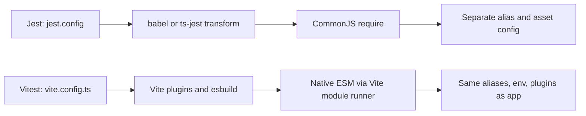
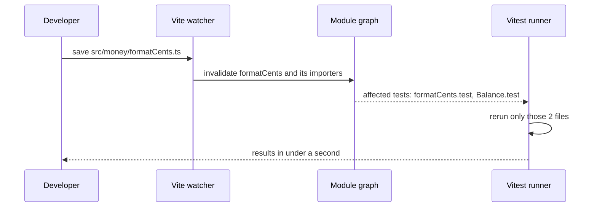
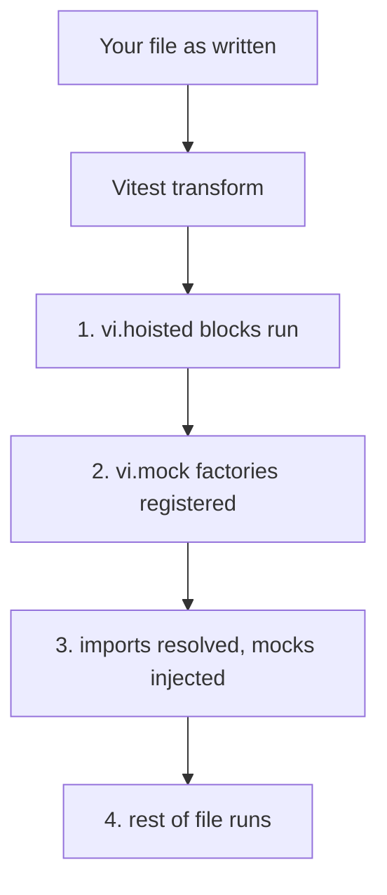

## 1. What it is

**Vitest is a test runner powered by Vite, with a Jest-compatible API and native ES module support.**

Imagine your app is built in a kitchen (Vite) with specific knives, ovens, and recipes (plugins, aliases, TypeScript handling). Jest is a separate kitchen down the street: to test a dish you must copy every recipe and tool over, and they drift apart. Vitest tests the dish in the same kitchen it was cooked in. Same config, same transforms, same aliases.

The problem it solves: Vite apps use ES modules, `import.meta.env`, path aliases, and Vite plugins (SVG as components, CSS modules). Jest does not understand any of these without extra Babel plugins and `moduleNameMapper` entries. Vitest reads your `vite.config.ts`, so tests compile exactly like the app. It is also faster in watch mode because it reuses Vite's module graph to rerun only affected tests.

## 2. Core concepts

### [Beginner] Same test anatomy as Jest, explicit imports

The `describe` / `it` / `expect` shape is identical to Jest. The visible difference: by default you **import** them from `vitest`. There are no magic globals unless you turn them on.

```ts
// src/money/applyFee.ts
export function applyFee(amountCents: number, feeBps: number): number {
  // bps = basis points, 1 bps = 0.01%
  return amountCents + Math.round((amountCents * feeBps) / 10_000);
}

// src/money/applyFee.test.ts
import { describe, it, expect } from 'vitest';
import { applyFee } from './applyFee';

describe('applyFee', () => {
  it('adds 25 bps to a transfer', () => {
    expect(applyFee(100_000, 25)).toBe(100_250);
  });

  it.each([
    [0, 25, 0],
    [1, 25, 1],      // rounds 0.0025 down
    [200, 25, 201],  // 0.5 rounds UP with Math.round - is that your bank's rule?
  ])('applyFee(%i, %i) = %i', (amount, bps, expected) => {
    expect(applyFee(amount, bps)).toBe(expected);
  });
});
```

> **Why:** Explicit imports mean TypeScript knows the types with no `@types/jest` global pollution, and your editor can jump to definitions. Globals are still available via the `globals: true` option for easier Jest migration.

### [Beginner] How Vitest differs from Jest under the hood



Key differences:

1. **Shares Vite config and transforms.** Aliases, `define`, plugins (React, SVGR, CSS modules) apply to tests automatically.
2. **Native ESM.** Code runs as ES modules. ESM-only packages in `node_modules` just work. `import.meta.env` works.
3. **TypeScript without Babel.** Vite strips types with esbuild (very fast). Like Babel and SWC, it does **not** type-check. Run `tsc --noEmit` separately, or use `vitest --typecheck` for type tests.
4. **Smart watch mode.** Vite already knows which module imports which (the module graph). When you save `formatCents.ts`, Vitest reruns only test files that import it, directly or transitively. It feels like HMR for tests.



> **Why:** Jest's `--watch` asks git which files changed and then uses its own dependency resolver (haste map). Vitest reuses the graph Vite already maintains for the dev server, so the work is already done.

### [Beginner] Mock functions with vi.fn

`vi` is Vitest's equivalent of the `jest` object. The mock function API is nearly identical.

```ts
import { describe, it, expect, vi } from 'vitest';

type Account = { id: string; balanceCents: number };

async function loadTotal(fetchAccounts: () => Promise<Account[]>) {
  const accounts = await fetchAccounts();
  return accounts.reduce((s, a) => s + a.balanceCents, 0);
}

describe('loadTotal', () => {
  it('sums balances', async () => {
    const fetchAccounts = vi.fn<() => Promise<Account[]>>().mockResolvedValue([
      { id: 'chk', balanceCents: 5_000 },
      { id: 'sav', balanceCents: 15_000 },
    ]);

    await expect(loadTotal(fetchAccounts)).resolves.toBe(20_000);
    expect(fetchAccounts).toHaveBeenCalledOnce(); // Vitest extra matcher
  });

  it('propagates errors', async () => {
    const fetchAccounts = vi.fn().mockRejectedValue(new Error('503'));
    await expect(loadTotal(fetchAccounts)).rejects.toThrow('503');
  });
});
```

> **Gotcha:** The generic is different from `@types/jest`. Vitest takes the **whole function type**: `vi.fn<(id: string) => Promise<Account>>()`. Jest's `@types/jest` takes return type and args separately: `jest.fn<Promise<Account>, [string]>()`.

### [Intermediate] vi.mock and hoisting

`vi.mock(path, factory?)` replaces a module for the test file. Like Jest, it is **hoisted** to the top of the file so it runs before imports. Vitest does this with its own code transform rather than a Babel plugin.

```ts
import { describe, it, expect, vi } from 'vitest';
import { getNetWorthCents } from './netWorth';
import { fetchAccounts } from '../api/accounts';

vi.mock('../api/accounts'); // automock: exports become vi.fn()

describe('getNetWorthCents', () => {
  it('sums accounts', async () => {
    vi.mocked(fetchAccounts).mockResolvedValue([{ id: 'a', balanceCents: 42 }]);
    await expect(getNetWorthCents()).resolves.toBe(42);
  });
});
```

Partial mocks use `importOriginal` (async, because ESM imports are async):

```ts
vi.mock('../utils/fx', async (importOriginal) => {
  const actual = await importOriginal<typeof import('../utils/fx')>();
  return {
    ...actual,
    getRate: vi.fn(() => 1.1), // replace only this export
  };
});
```

### [Intermediate] vi.hoisted: sharing variables with a hoisted factory

Because `vi.mock` is hoisted above everything, a factory cannot see `const` variables declared normally in the file. Jest solves this with the `mock` prefix rule. Vitest has no such rule. Instead you wrap the variable in `vi.hoisted`, which is **also** hoisted, and runs first.

```ts
import { it, expect, vi } from 'vitest';
import { submitTransfer } from './transferService';

const { mockPost } = vi.hoisted(() => ({
  mockPost: vi.fn(),
}));

vi.mock('../api/http', () => ({
  http: { post: mockPost },
}));

it('posts amount in cents', async () => {
  mockPost.mockResolvedValue({ status: 202, data: { id: 'tr_9' } });
  await submitTransfer({ fromAccountId: 'chk', toAccountId: 'sav', amountCents: 2_500 });
  expect(mockPost).toHaveBeenCalledWith('/transfers', {
    fromAccountId: 'chk',
    toAccountId: 'sav',
    amountCents: 2_500,
  });
});
```



> **Gotcha:** You cannot use imported values inside `vi.hoisted`, because it runs before imports. Only `vi` itself (which Vitest handles specially) and literals are safe.

### [Intermediate] vi.spyOn and fake timers

```ts
import { afterEach, beforeEach, describe, expect, it, vi } from 'vitest';
import { auditLog } from '../lib/auditLog';
import { closeAccount } from './closeAccount';
import { startSessionTimer } from './session';

afterEach(() => {
  vi.restoreAllMocks();
});

it('writes an audit event', () => {
  const spy = vi.spyOn(auditLog, 'write').mockImplementation(() => {});
  closeAccount('acc_1');
  expect(spy).toHaveBeenCalledWith(expect.objectContaining({ type: 'ACCOUNT_CLOSED' }));
});

describe('idle logout', () => {
  beforeEach(() => {
    vi.useFakeTimers();
    vi.setSystemTime(new Date('2026-10-01T09:00:00Z'));
  });
  afterEach(() => vi.useRealTimers());

  it('logs out after 15 minutes', () => {
    const onExpire = vi.fn();
    startSessionTimer(onExpire);
    vi.advanceTimersByTime(15 * 60_000);
    expect(onExpire).toHaveBeenCalledOnce();
  });
});
```

> **Gotcha:** In ESM, module namespace objects are frozen. `vi.spyOn(fxModule, 'getRate')` on `import * as fxModule` may throw "Cannot spy on export". Use `vi.mock` for module exports and `vi.spyOn` for methods on plain objects or classes.

### [Intermediate] Environments: node, jsdom, happy-dom

The default environment is `node` (no `document`). Component tests need a simulated DOM.

| Environment | What it is | Trade-off |
|---|---|---|
| `node` | Plain Node.js | Fastest. Use for money math, selectors, API clients. |
| `jsdom` | Mature, spec-focused DOM implementation | Slower, more complete, most compatible. |
| `happy-dom` | Lighter DOM implementation | Often noticeably faster, but some APIs are missing or behave differently. |

You can set it globally or per file with a docblock comment:

```ts
// @vitest-environment jsdom
import { render, screen } from '@testing-library/react';
import { it, expect } from 'vitest';
import { BalanceCard } from './BalanceCard';

it('shows the formatted balance', () => {
  render(<BalanceCard balanceCents={123_456} currency="USD" />);
  expect(screen.getByText('$1,234.56')).toBeInTheDocument();
});
```

### [Advanced] In-source testing

Vitest can run tests written **inside** the source file. They are stripped from production builds via `define`. Useful for tiny pure helpers where the test is the best documentation.

```ts
// src/money/roundHalfEven.ts
export function roundHalfEven(value: number): number {
  const floor = Math.floor(value);
  const diff = value - floor;
  if (diff > 0.5) return floor + 1;
  if (diff < 0.5) return floor;
  return floor % 2 === 0 ? floor : floor + 1; // banker's rounding
}

if (import.meta.vitest) {
  const { it, expect } = import.meta.vitest;
  it('rounds .5 to even', () => {
    expect(roundHalfEven(2.5)).toBe(2);
    expect(roundHalfEven(3.5)).toBe(4);
    expect(roundHalfEven(2.6)).toBe(3);
  });
}
```

Config needed: `test.includeSource: ['src/**/*.ts']` and `define: { 'import.meta.vitest': 'undefined' }` so the bundler removes the block as dead code. Add `"types": ["vitest/importMeta"]` to tsconfig for typing.

### [Advanced] Browser mode

Browser mode runs your tests in a **real browser** (Chromium, Firefox, WebKit) driven by Playwright or WebdriverIO, instead of a simulated DOM. Layout, `getBoundingClientRect`, `IntersectionObserver`, CSS, and real events all work.

```ts
// vitest.config.ts  (Vitest 4 style; providers are separate packages)
import { defineConfig } from 'vitest/config';
import react from '@vitejs/plugin-react';
import { playwright } from '@vitest/browser-playwright';

export default defineConfig({
  plugins: [react()],
  test: {
    browser: {
      enabled: true,
      provider: playwright(),
      headless: true,
      instances: [{ browser: 'chromium' }],
    },
  },
});
```

```tsx
// VirtualTransactionList.browser.test.tsx
import { render } from 'vitest-browser-react';
import { page } from 'vitest/browser'; // Vitest 3: '@vitest/browser/context'
import { expect, it } from 'vitest';
import { VirtualTransactionList } from './VirtualTransactionList';

it('renders only visible rows of 10k transactions', async () => {
  const txs = Array.from({ length: 10_000 }, (_, i) => ({ id: `tx_${i}`, amountCents: i }));
  await render(<VirtualTransactionList transactions={txs} height={400} rowHeight={40} />);
  await expect.element(page.getByText('tx_0')).toBeVisible();
  expect(document.querySelectorAll('[role="row"]').length).toBeLessThan(30);
});
```

> **Outdated:** In Vitest 3, browser mode was marked experimental and used `provider: 'playwright'` as a string with imports from `@vitest/browser/context`. Vitest 4 (late 2025) declared browser mode stable and moved providers into packages like `@vitest/browser-playwright`. Check the version in your `package.json` before copying config.

## 3. Why it's used in this project

Our financial React apps are built with Vite. Using Vitest means:

- **One config.** The `@/` alias, `import.meta.env.VITE_OKTA_ISSUER`, SVG icon imports, and CSS modules all work in tests with no `moduleNameMapper` duplication. Fewer "works in the app, breaks in tests" surprises.
- **Fast feedback on money logic.** Fee, FX, and interest helpers rerun in milliseconds on save thanks to module-graph watch mode. Developers actually keep the watcher open.
- **ESM-only dependencies.** Modern libraries (some charting packages, `nanoid`, recent `@faker-js/faker`) ship ESM only. They need no `transformIgnorePatterns` hacks.
- **Mixed environments.** Pure calculation tests run in `node` (fast); `TransactionTable` component tests run in `jsdom`; the virtualized 10k-row list and sticky report headers run in browser mode, where real layout exists.
- **Compliance flows.** Idle-session logout and token refresh are tested with `vi.useFakeTimers()`. Audit logging is verified with `vi.spyOn`.
- **Coverage gates.** `coverage.thresholds` can demand 100% branches on `src/money/**` while staying lenient on UI.

> **Finance tip:** Use Vitest's `projects` option to split "unit" (node), "dom" (jsdom), and "browser" suites. CI can run the fast unit suite on every push and the browser suite on merge.

## 4. Setup & configuration

### [Beginner] Install

```bash
npm i -D vitest @vitest/coverage-v8 jsdom
npm i -D @testing-library/react @testing-library/jest-dom @testing-library/user-event
# optional
npm i -D @vitest/ui happy-dom
```

### [Intermediate] Option A: test block inside vite.config.ts

```ts
/// <reference types="vitest/config" />
// The reference line types the "test" key. Older guides used <reference types="vitest" />.
import { defineConfig } from 'vite';
import react from '@vitejs/plugin-react';
import path from 'node:path';

export default defineConfig({
  plugins: [react()],
  resolve: { alias: { '@': path.resolve(__dirname, 'src') } }, // shared by app and tests
  define: { 'import.meta.vitest': 'undefined' },               // strips in-source tests from builds
  test: {
    environment: 'jsdom',                   // 'node' | 'jsdom' | 'happy-dom'
    globals: false,                         // true = describe/it/expect/vi without imports
    setupFiles: ['./test/setupTests.ts'],   // runs before each test file (like Jest setupFilesAfterEnv)
    include: ['src/**/*.test.{ts,tsx}'],    // which files are tests
    includeSource: ['src/**/*.ts'],         // enable in-source tests
    css: false,                             // skip processing CSS for speed (default)
    clearMocks: true,                       // wipe mock.calls before each test
    restoreMocks: true,                     // restore spies before each test
    testTimeout: 10_000,
    coverage: {
      provider: 'v8',                       // or 'istanbul'
      include: ['src/**/*.{ts,tsx}'],
      exclude: ['src/**/*.stories.tsx', 'src/main.tsx'],
      reporter: ['text', 'html', 'lcov'],
      thresholds: {
        lines: 85,
        branches: 80,
        'src/money/**': { lines: 100, branches: 100, functions: 100, statements: 100 },
      },
    },
  },
});
```

### [Intermediate] Option B: separate vitest.config.ts

Use this when test settings would clutter the app config, or when tests need different plugins. `mergeConfig` keeps the app's aliases and plugins.

```ts
// vitest.config.ts  (takes priority over vite.config.ts when both exist)
import { defineConfig, mergeConfig } from 'vitest/config';
import viteConfig from './vite.config';

export default mergeConfig(
  viteConfig,
  defineConfig({
    test: {
      projects: [
        { extends: true, test: { name: 'unit', environment: 'node', include: ['src/**/*.unit.test.ts'] } },
        { extends: true, test: { name: 'dom', environment: 'jsdom', include: ['src/**/*.test.tsx'] } },
      ],
    },
  }),
);
```

> **Outdated:** Before Vitest 3.2, multiple suites were defined in a separate `vitest.workspace.ts` file. The `workspace` option was deprecated in favor of `test.projects` and removed in Vitest 4.

### [Beginner] Setup file and globals

```ts
// test/setupTests.ts
import '@testing-library/jest-dom/vitest'; // registers matchers on Vitest's expect
import { cleanup } from '@testing-library/react';
import { afterEach } from 'vitest';

afterEach(() => cleanup()); // needed when globals: false, RTL cannot auto-register it
```

If you enable `globals: true`, add types to tsconfig:

```json
{ "compilerOptions": { "types": ["vitest/globals", "@testing-library/jest-dom"] } }
```

> **Why:** Testing Library auto-cleans the DOM after each test only if it finds a global `afterEach`. With `globals: false` there is none, so you call `cleanup` yourself. Forgetting this makes elements from one test leak into the next.

### [Beginner] Scripts

```json
{
  "scripts": {
    "test": "vitest",
    "test:run": "vitest run",
    "test:ui": "vitest --ui",
    "test:coverage": "vitest run --coverage"
  }
}
```

`vitest` alone starts watch mode in a terminal, and runs once in CI (it detects `process.env.CI`).

## 5. Key features we use

### [Beginner] Extra matchers and expect.soft

```ts
import { expect, it, vi } from 'vitest';

it('validates a statement totals block', () => {
  const totals = { openingCents: 10_000, creditsCents: 5_000, debitsCents: 2_000, closingCents: 13_000 };
  // soft assertions keep going and report all failures at the end
  expect.soft(totals.closingCents).toBe(totals.openingCents + totals.creditsCents - totals.debitsCents);
  expect.soft(totals.creditsCents).toBeGreaterThan(0);
});

it('has once-style call matchers', () => {
  const notify = vi.fn();
  notify('LOW_BALANCE');
  expect(notify).toHaveBeenCalledOnce();
  expect(notify).toHaveBeenCalledExactlyOnceWith('LOW_BALANCE');
});
```

### [Intermediate] Mocking env variables and globals

```ts
import { afterEach, expect, it, vi } from 'vitest';
import { getOktaConfig } from './oktaConfig';

afterEach(() => {
  vi.unstubAllEnvs();
  vi.unstubAllGlobals();
});

it('reads the issuer from env', () => {
  vi.stubEnv('VITE_OKTA_ISSUER', 'https://bank.okta.test/oauth2/default');
  expect(getOktaConfig().issuer).toBe('https://bank.okta.test/oauth2/default');
});

it('handles missing matchMedia', () => {
  vi.stubGlobal('matchMedia', vi.fn(() => ({ matches: false, addEventListener: vi.fn(), removeEventListener: vi.fn() })));
  expect(window.matchMedia('(prefers-color-scheme: dark)').matches).toBe(false);
});
```

### [Intermediate] Concurrent tests and filtering

```ts
import { describe, it, expect } from 'vitest';
import { convert } from './fx';

describe.concurrent('pure FX conversions', () => {
  it('USD to EUR', async () => expect(await convert(100, 'USD', 'EUR')).toBe(92));
  it('USD to GBP', async () => expect(await convert(100, 'USD', 'GBP')).toBe(79));
});
```

> **Gotcha:** Concurrent tests share module state. With `.concurrent`, use the `expect` from the test context (`it('x', async ({ expect }) => ...)`) so snapshot and assertion counting is attributed to the right test.

### [Beginner] CLI

```bash
npx vitest                      # watch mode
npx vitest run src/money        # run once, filtered by path
npx vitest -t "idle logout"     # filter by test name
npx vitest --project unit       # one project only
npx vitest --ui                 # browser dashboard of results
npx vitest related src/money/fx.ts --run  # tests affected by a file
```

### [Intermediate] Migration from Jest

| Jest | Vitest | Note |
|---|---|---|
| `jest.fn()` | `vi.fn()` | Generic is the whole function type |
| `jest.mock(path, factory)` | `vi.mock(path, factory)` | Factory may be async |
| `jest.requireActual(path)` | `await vi.importActual(path)` or `importOriginal()` | Async in ESM |
| `mock`-prefixed variables | `vi.hoisted(() => ...)` | No prefix rule |
| `jest.spyOn` | `vi.spyOn` | Same |
| `jest.mocked(fn)` | `vi.mocked(fn)` | Same |
| `jest.useFakeTimers()` | `vi.useFakeTimers()` | Same API names |
| `jest.setTimeout(ms)` | `vi.setConfig({ testTimeout: ms })` or config | |
| `setupFilesAfterEnv` | `test.setupFiles` | |
| `testEnvironment` | `test.environment` | |
| `moduleNameMapper` | `resolve.alias` | Usually already in vite config |
| `transform` + ts-jest | Not needed | esbuild via Vite |
| `coverageThreshold` | `coverage.thresholds` | |
| `@types/jest` | `vitest/globals` types, if `globals: true` | |
| `done` callback | Not supported, return a promise | |

```bash
# rough migration steps
npm rm jest ts-jest babel-jest @types/jest jest-environment-jsdom
npm i -D vitest jsdom @vitest/coverage-v8
# replace jest. with vi. and add imports from 'vitest' (or enable globals)
```

> **Gotcha:** `mockReset` semantics differ slightly. In Vitest 3+, `mockReset()` restores the implementation originally passed to `vi.fn(impl)` rather than making it return `undefined` as Jest does. Tests that relied on Jest's behaviour may change.

## 6. Interview questions

#### Q: Why choose Vitest over Jest for a Vite React app?

Vitest reuses `vite.config.ts`, so aliases, plugins, `define`, and `import.meta.env` work in tests without duplicating them in Jest's `moduleNameMapper` and Babel config. It runs native ESM, so ESM-only dependencies work. TypeScript is transpiled by esbuild without a separate transformer. Watch mode uses Vite's module graph to rerun only affected tests, which is very fast. The API is Jest-compatible, so the team's knowledge transfers.

#### Q: What does vi.hoisted solve?

`vi.mock` calls are hoisted above imports so the mock is registered before modules load. That means a normal `const mockPost = vi.fn()` declared in the file does not exist yet when the factory runs. `vi.hoisted(() => ({ mockPost: vi.fn() }))` is also hoisted, before `vi.mock`, so the factory can safely reference its return value. It replaces Jest's "variables must start with mock" convention with an explicit API.

#### Q: jsdom vs happy-dom vs browser mode: how do you choose?

`node` for anything without DOM. `jsdom` is the safest default for component tests: mature and spec-focused. `happy-dom` is lighter and usually faster but implements less, so some tests behave differently. Neither does layout, so anything depending on sizes, scroll, `IntersectionObserver`, or real CSS needs browser mode, which runs tests in real Chromium or Firefox via Playwright. Browser mode is slower to start, so reserve it for the tests that need it.

#### Q: Does Vitest type-check my tests?

No. Like Babel and SWC, Vite's esbuild transform strips types without checking them. A test with a type error still runs. Run `tsc --noEmit` in CI, or use `vitest --typecheck` with `*.test-d.ts` files and `expectTypeOf` for dedicated type tests.

#### Q: What are honest downsides of Vitest compared to Jest?

Jest has a longer track record, a larger ecosystem of custom environments and reporters, and first-class support in React Native and in many existing Next.js setups. Some Jest-specific libraries assume the `jest` global. Vitest's subtle differences (async `importActual`, `mockReset` semantics, no `done` callback, frozen ESM namespaces for spying) can break migrated tests. Vitest has moved fast, with config changes between major versions (workspace to projects, browser provider packages), so docs and blog posts age quickly.

## 7. Drawbacks & pain points

- **Fast-moving config.** Vitest 2, 3, and 4 each changed some config shape. Blog posts from a year ago may not work.
- **Not a type checker.** Type errors do not fail tests by default.
- **ESM strictness exposes bugs.** Spying on module exports fails because ESM namespaces are immutable. Code that relied on CJS mutability must change.
- **Non-Vite projects get less benefit.** In a webpack or Next.js app you still maintain a separate config for aliases and assets.
- **Isolation cost remains.** Each file still gets a fresh module graph by default. Huge suites can still be slow; `pool` and `isolate` settings trade safety for speed.
- **Browser mode is heavier.** Needs Playwright browsers in CI and a different render package.

Gotchas that trip devs up:

```ts
// 1. Forgetting cleanup with globals: false -> DOM leaks across tests
// Fix: afterEach(() => cleanup()) in setup file

// 2. Using imports inside vi.hoisted
import { buildAccount } from './factories';
const { mockAccount } = vi.hoisted(() => ({ mockAccount: buildAccount() })); // ReferenceError

// 3. Spying on an ESM export
import * as fx from './fx';
vi.spyOn(fx, 'getRate'); // may throw: cannot redefine property
// Fix: vi.mock('./fx', async (orig) => ({ ...(await orig()), getRate: vi.fn() }))

// 4. jest-dom import path
import '@testing-library/jest-dom';        // works with globals: true
import '@testing-library/jest-dom/vitest'; // correct entry for Vitest without globals
```

## 8. Better alternatives

For Vite projects Vitest **is** the direction the industry has moved. The comparison is mostly about where each tool still wins.

| Tool | Install size | Boilerplate | Devtools / UI | Learning curve | TypeScript | Popularity | When it wins |
|---|---|---|---|---|---|---|---|
| Vitest 3/4 | ~15-20 MB | Low, reuses Vite | Vitest UI, browser mode, VS Code extension | Low | Native, no type-check | High, growing | Vite apps, ESM code, fast watch |
| Jest 30 | ~30 MB | Medium | CLI, IDE plugins | Low | Via transformer | Very high installed base | React Native, legacy CRA or webpack, Jest-only plugins |
| node:test | 0 | Low | Minimal | Low | Via Node type stripping | Growing | Libraries, zero-dependency utils |
| Bun test | Bundled with Bun | Low | Minimal | Low | Native | Niche but rising | Projects already on Bun runtime |
| Playwright CT | ~browsers ~300 MB | Medium | Trace viewer, UI mode | Medium | Native | Medium | Components needing true browser layout |

Honest trade-off summary: choose **Vitest** when the app is built with Vite or you want ESM without friction. Keep **Jest** when the suite is large, stable, and not on Vite, or when you are in React Native. A migration only pays off if config drift or ESM pain is actually costing time.

## 9. When NOT to use it

- React Native projects: the RN preset and ecosystem assume Jest.
- A huge, stable Jest suite in a webpack app with no ESM pain: migration cost may outweigh gains.
- End-to-end flows across pages, Okta login redirects, and real backends: use Playwright E2E.
- When you need type checking as part of the test step and cannot add `tsc` to CI.
- Visual regression of dashboards and charts: use Playwright screenshots or a visual testing service.

## Cheatsheet

| Need | API |
|---|---|
| Imports | `import { describe, it, expect, vi, beforeEach, afterEach } from 'vitest'` |
| Mock fn | `vi.fn<(a: string) => number>()`, `.mockReturnValue`, `.mockResolvedValue`, `.mockImplementation` |
| Module mock | `vi.mock('./m')`, `vi.mock('./m', async (importOriginal) => ({ ...(await importOriginal()), x: vi.fn() }))` |
| Hoisted vars | `const { m } = vi.hoisted(() => ({ m: vi.fn() }))` |
| Typed mock | `vi.mocked(fn)` |
| Spy | `vi.spyOn(obj, 'method')`, `vi.restoreAllMocks()` |
| Timers | `vi.useFakeTimers()`, `vi.advanceTimersByTime(ms)`, `vi.advanceTimersByTimeAsync(ms)`, `vi.runAllTimers()`, `vi.setSystemTime(d)`, `vi.useRealTimers()` |
| Env / globals | `vi.stubEnv('K', 'v')`, `vi.stubGlobal('name', value)`, `vi.unstubAllEnvs()` |
| Extra matchers | `toHaveBeenCalledOnce()`, `toHaveBeenCalledExactlyOnceWith()`, `expect.soft()` |
| Per-file env | `// @vitest-environment jsdom` |
| In-source | `if (import.meta.vitest) { const { it, expect } = import.meta.vitest }` |

```ts
// vite.config.ts minimal test block
/// <reference types="vitest/config" />
import { defineConfig } from 'vite';
import react from '@vitejs/plugin-react';

export default defineConfig({
  plugins: [react()],
  test: {
    environment: 'jsdom',
    setupFiles: ['./test/setupTests.ts'],
    restoreMocks: true,
    coverage: { provider: 'v8', thresholds: { lines: 85 } },
  },
});
```
