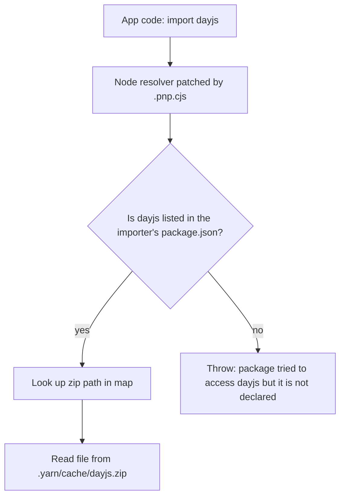
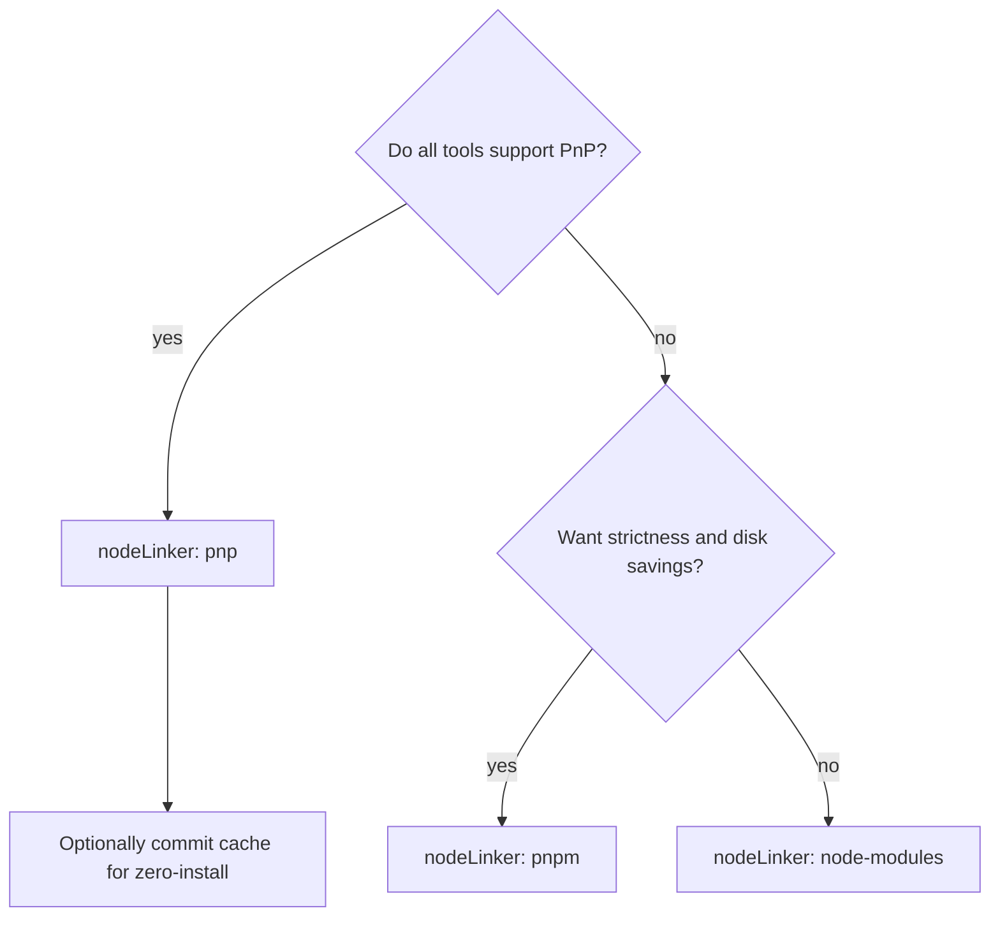
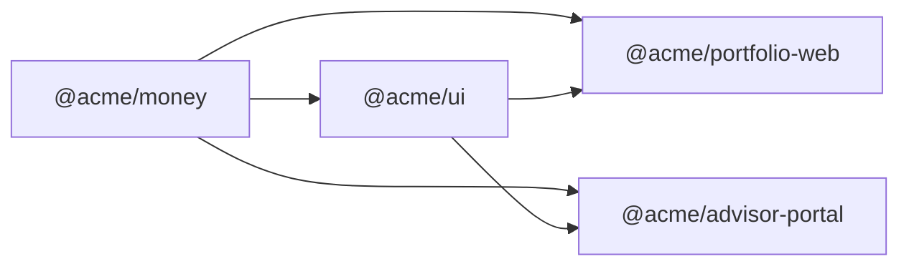

## 1. What it is

**Yarn Berry (v2 and later, currently v4) is a JavaScript package manager rewritten from Yarn 1, featuring Plug'n'Play (PnP) installs, built-in workspaces, a project-local Yarn binary, and strict dependency resolution.**

Analogy: npm's `node_modules` is a giant warehouse where every box is dumped on open shelves. Anyone can grab any box, even boxes they never ordered. Yarn PnP replaces the shelves with a catalogue (`.pnp.cjs`) that says exactly which package may use which other package, and keeps packages zipped in one place. Faster to set up, and nobody can take a box they did not order.

The problem it solves: `node_modules` is huge (hundreds of thousands of files), slow to write to disk, and lets code import packages it never declared ("phantom dependencies"), which works on your machine and breaks elsewhere. Berry makes installs faster and dependency graphs honest, and makes monorepos first-class.

## 2. Core concepts

### [Beginner] Classic vs Berry

| | Yarn 1 (Classic) | Yarn 2+ (Berry) |
| --- | --- | --- |
| Status | maintenance only, frozen | active, v4 current |
| Install layout | `node_modules` | PnP by default (or `node_modules`, `pnpm`) |
| Config | `.yarnrc` | `.yarnrc.yml` |
| Binary | global install | per-project, pinned via `packageManager` |
| Plugins | no | yes (many built into v4) |
| Lockfile | `yarn.lock` (old format) | `yarn.lock` (YAML-ish, new format) |

```bash
yarn --version     # 1.22.x = Classic. 4.x = Berry.
```

> **Outdated:** Tutorials with `yarn global add`, `.yarnrc`, or `yarn install --frozen-lockfile` are Yarn 1. In Berry use `yarn dlx`, `.yarnrc.yml`, and `yarn install --immutable`.

### [Beginner] Corepack and the packageManager field

Yarn Berry is not installed globally per machine. The project declares which version it uses, and Corepack (ships with Node) fetches that exact version.

```json
// package.json
{
  "name": "portfolio-web",
  "packageManager": "yarn@4.5.0"
}
```

```bash
corepack enable                 # once per machine: creates yarn/pnpm shims
yarn set version stable         # writes packageManager (and .yarn/releases if configured)
yarn install
```

> **Why:** Every developer and CI job runs the identical Yarn version, so lockfile format and resolution never drift between machines.

> **Gotcha:** Node maintainers decided to stop bundling Corepack in future Node versions (from Node 25). On those, install it with `npm i -g corepack`. Check your Node version.

### [Beginner] Plug'n'Play: how it works

With PnP there is no `node_modules`. Yarn writes:

- `.yarn/cache/*.zip` — each package as one zip file.
- `.pnp.cjs` — a map from "package X at version Y" to "where its files are" and "which dependencies it may require".
- `.pnp.loader.mjs` — the ESM loader hook.

Node is told to load `.pnp.cjs` first; it patches `require` and `import` resolution to read from the map.



```bash
yarn node scripts/seed-accounts.js   # run Node with the PnP hook loaded
yarn run build                       # scripts get the hook automatically
```

### [Intermediate] Why the strictness matters

In `node_modules`, hoisting puts transitive deps at the top level, so this works even though you never installed `lodash`:

```ts
// src/lib/group.ts
import groupBy from 'lodash/groupBy'; // lodash came in via some other package
```

It is a time bomb: when the other package drops lodash, your build breaks. PnP refuses at resolve time:

```text
Error: Your application tried to access lodash, but it isn't declared in your dependencies;
this makes the require call ambiguous and unsound.
```

Fix: `yarn add lodash`. For a third-party package that forgot to declare a dependency, patch its metadata:

```yaml
# .yarnrc.yml
packageExtensions:
  "legacy-chart-lib@*":
    dependencies:
      prop-types: "^15.8.1"
    peerDependencies:
      react: "*"
```

### [Intermediate] nodeLinker options

```yaml
# .yarnrc.yml
nodeLinker: pnp            # default: no node_modules, strictest, fastest
# nodeLinker: pnpm         # symlinked node_modules into a content store, like pnpm
# nodeLinker: node-modules # classic flat node_modules, maximum compatibility
```



> **Interview tip:** Many teams use Berry with `nodeLinker: node-modules`. They get Berry's speed, workspaces, constraints and pinned binary without PnP compatibility pain. Saying this shows practical judgement.

### [Intermediate] Workspaces and monorepos

```json
// package.json at repo root
{
  "name": "acme-finance",
  "private": true,
  "packageManager": "yarn@4.5.0",
  "workspaces": ["apps/*", "packages/*"]
}
```

```text
acme-finance/
  apps/portfolio-web/package.json     "@acme/portfolio-web"
  apps/advisor-portal/package.json    "@acme/advisor-portal"
  packages/money/package.json         "@acme/money"   (formatCents, Decimal helpers)
  packages/ui/package.json            "@acme/ui"
```

```json
// apps/portfolio-web/package.json
{
  "dependencies": {
    "@acme/money": "workspace:^",
    "@acme/ui": "workspace:*"
  }
}
```

`workspace:` means "always link the local package, never fetch from the registry". On `yarn npm publish` it is replaced by the real version (`^1.4.0`).

```bash
yarn workspace @acme/portfolio-web add recharts
yarn workspaces foreach -A --topological run build   # build all, deps first
yarn workspaces foreach -A --parallel run test
yarn workspaces focus @acme/portfolio-web            # install only what this app needs (CI)
```



### [Advanced] Zero-install

Commit `.yarn/cache` and `.pnp.cjs` to git. A fresh clone or CI checkout can run immediately with no install step, because every dependency is already in the repo as zips.

```gitignore
# .gitignore for zero-install
.yarn/*
!.yarn/cache
!.yarn/patches
!.yarn/plugins
!.yarn/releases
!.yarn/sdks
!.yarn/versions
# not zero-install? also ignore .pnp.* and .yarn/cache
```

```yaml
# .yarnrc.yml
enableGlobalCache: false   # keep zips in project .yarn/cache so they can be committed
```

> **Why zips?** Thousands of packages as zips is a few thousand files git can handle. The same packages unzipped in `node_modules` is hundreds of thousands of files.

> **Gotcha:** Repo size grows with every dependency bump, and packages with native builds (postinstall) still need a build step. Many teams skip zero-install and just cache `.yarn/cache` in CI.

### [Advanced] Constraints

Constraints enforce rules across all workspaces. In Yarn 4 they are written in JavaScript in `yarn.config.cjs` (older versions used Prolog).

```js
// yarn.config.cjs
/** @type {import('@yarnpkg/types')} */
const { defineConfig } = require('@yarnpkg/types');

module.exports = defineConfig({
  async constraints({ Yarn }) {
    // 1. Every workspace uses the same version of each dependency
    for (const dep of Yarn.dependencies()) {
      for (const other of Yarn.dependencies({ ident: dep.ident })) {
        if (other.type === 'peerDependencies') continue;
        dep.update(other.range);
      }
    }
    // 2. Every workspace must declare a license
    for (const ws of Yarn.workspaces()) {
      ws.set('license', 'UNLICENSED');
    }
  },
});
```

```bash
yarn constraints        # report violations
yarn constraints --fix  # auto-fix
```

> **Finance tip:** Use constraints to forbid two versions of `decimal.js` or `@okta/okta-auth-js` across apps. Two money libraries or two auth SDKs in one bundle is a correctness and security risk.

## 3. Why it's used in this project

- **Monorepo of finance apps.** Customer portal, advisor portal, and shared `@acme/money` and `@acme/ui` packages live together. `workspace:` links keep them in sync without publishing.
- **Reproducible builds for audits.** `packageManager` pins Yarn, `yarn install --immutable` fails if the lockfile would change. Auditors can tie a release to an exact dependency set.
- **No phantom dependencies.** PnP strictness catches undeclared imports before production.
- **Supply-chain controls.** `yarn npm audit`, `npmRegistryServer` pointed at an internal Artifactory/Nexus mirror, and `enableScripts: false` reduce the risk from malicious install scripts.
- **Fast CI.** Cached zips and `workspaces focus` cut install time on every pull request.

## 4. Setup & configuration

```bash
corepack enable
yarn init -2                 # new Berry project (or: yarn set version stable in an existing one)
yarn install
yarn dlx @yarnpkg/sdks vscode   # editor support for PnP (see below)
```

```yaml
# .yarnrc.yml -- every key commented
yarnPath: .yarn/releases/yarn-4.5.0.cjs   # optional: commit the binary instead of relying on Corepack

nodeLinker: node-modules         # pnp | pnpm | node-modules

npmRegistryServer: "https://artifactory.acme.internal/api/npm/npm/"  # internal mirror
npmScopes:
  acme:
    npmRegistryServer: "https://artifactory.acme.internal/api/npm/acme-npm/"
    npmAlwaysAuth: true
    npmAuthToken: "${ACME_NPM_TOKEN}"   # read from env, never commit tokens

enableGlobalCache: true          # share zip cache across projects on this machine (false for zero-install)
enableTelemetry: false           # opt out of anonymous usage stats
enableScripts: false             # block postinstall scripts by default (supply-chain safety)

compressionLevel: mixed          # zip compression; 0 = faster installs, larger cache

pnpMode: strict                  # strict | loose (loose warns instead of failing on phantom deps)

packageExtensions:               # fix third-party packages with missing dependency declarations
  "some-legacy-lib@*":
    dependencies:
      "prop-types": "^15.8.1"

npmMinimalAgeGate: 0             # newer Yarn: minimum age before a published version can be installed (verify availability)
```

```json
// package.json
{
  "packageManager": "yarn@4.5.0",
  "workspaces": ["apps/*", "packages/*"],
  "scripts": {
    "build": "yarn workspaces foreach -A --topological run build",
    "lint": "eslint ."
  },
  "dependenciesMeta": {
    "esbuild": { "built": true }   // allow this package's build script even with enableScripts: false
  }
}
```

### [Intermediate] Editor SDKs for PnP

Without `node_modules`, VS Code's TypeScript cannot find packages. Yarn generates wrapper SDKs that teach the editor PnP.

```bash
yarn dlx @yarnpkg/sdks vscode   # writes .yarn/sdks and .vscode/settings.json
```

Then in VS Code: "TypeScript: Select TypeScript Version" and pick "Use Workspace Version". The SDK covers TypeScript, ESLint and Prettier.

## 5. Key features we use

### [Beginner] Daily commands

```bash
yarn                         # install (same as yarn install)
yarn add date-fns            # dependency
yarn add -D vitest           # devDependency
yarn remove moment           # uninstall
yarn up react react-dom      # upgrade to latest within registry
yarn up -i                   # interactive upgrade
yarn why decimal.js          # who depends on this?
yarn dedupe                  # collapse duplicate versions in lockfile
yarn install --immutable     # CI: fail if lockfile would change
```

### [Beginner] dlx: run a package without installing

```bash
yarn dlx create-vite portfolio-web --template react-ts
yarn dlx npm-check-updates
```

Like `npx`, but it always runs in a temporary isolated project.

### [Intermediate] Patching a dependency

```bash
yarn patch legacy-chart-lib          # extracts to a temp folder, prints path
# edit the files there
yarn patch-commit -s /tmp/xfs-1234/user   # writes .yarn/patches/*.patch and updates package.json
```

```json
{ "resolutions": { "legacy-chart-lib@npm:2.1.0": "patch:legacy-chart-lib@npm%3A2.1.0#~/.yarn/patches/legacy-chart-lib.patch" } }
```

### [Intermediate] Resolutions to force a version

```json
// Force a patched version of a vulnerable transitive dependency
{ "resolutions": { "follow-redirects": "^1.15.6" } }
```

### [Advanced] Release workflow

```bash
yarn version patch          # bump this workspace
yarn version check -i       # (version plugin) ensure changed workspaces declare bumps
yarn npm publish --access restricted
```

## 6. Interview questions

#### Q: What is Plug'n'Play and why does Yarn use it?

PnP replaces `node_modules` with a single generated file, `.pnp.cjs`, that maps every package to its location (a zip in `.yarn/cache`) and lists which dependencies each package may access. Node's resolver is patched to read this map. Benefits: installs are faster because Yarn writes one file instead of hundreds of thousands, resolution is a lookup instead of walking directories, and undeclared imports (phantom dependencies) fail immediately instead of working by accident through hoisting.

#### Q: What is a phantom dependency and how do different package managers handle it?

It is a package your code imports without declaring it, which only works because hoisting placed it in top-level `node_modules`. npm and Yarn Classic allow it. pnpm prevents it with a symlinked layout where only declared deps are visible at the top level. Yarn PnP prevents it with the resolution map and throws a clear error. Fix by declaring the dependency, or with `packageExtensions` for broken third-party packages.

#### Q: What is zero-install, and what are the trade-offs?

Committing `.yarn/cache` (zipped packages) and `.pnp.cjs` so a fresh checkout runs without `yarn install`. Pros: no network at CI install time, identical dependencies everywhere, switching branches changes deps instantly. Cons: repo grows with every bump, PR diffs include binary zips, and native packages still need building. Many teams prefer CI caching instead.

#### Q: How does Yarn ensure every developer uses the same version?

The `packageManager` field in `package.json` (for example `yarn@4.5.0`) is read by Corepack, which downloads and runs that exact version. Alternatively `yarnPath` in `.yarnrc.yml` points to a committed binary in `.yarn/releases`. Either way, the global install does not matter.

#### Q: Compare Yarn Berry, npm, pnpm and Bun.

npm is the default and most compatible, with a flat hoisted `node_modules` and workspaces support. pnpm uses a global content-addressable store with hard links and symlinks, saving disk and preventing phantom deps, and has strong monorepo filtering, which is why it became the most popular choice for monorepos. Yarn Berry offers PnP, zero-install, constraints and a plugin system, with the strictest model but more compatibility friction. Bun is a runtime with a very fast built-in installer and `bun.lock`, great for speed, but less mature for complex enterprise monorepos. Pick by team needs: compatibility (npm), monorepo and disk efficiency (pnpm), strict governance (Yarn), raw speed (Bun).

## 7. Drawbacks & pain points

- **Tool compatibility.** Some tools assume `node_modules` exists (old Jest setups, some React Native tooling, scripts that read `node_modules/x/file`). PnP breaks them.
- **Editor setup.** PnP needs SDKs; forgetting this causes red squiggles everywhere.
- **Debugging is harder.** You cannot just open `node_modules/lib/index.js` to add a `console.log`. Use `yarn unplug lib` to extract it.
- **Learning curve.** Classic tutorials and Stack Overflow answers often do not apply.
- **Corepack changes** in newer Node versions add setup friction.
- **Popularity.** pnpm has taken much of the monorepo mindshare.

Gotchas that trip devs up:

```bash
# Running a script with plain node bypasses PnP
node scripts/migrate.js      # Error: Cannot find module 'zod'
yarn node scripts/migrate.js # correct
```

```bash
# Yarn 1 flags do not exist in Berry
yarn install --frozen-lockfile   # deprecated alias; use --immutable
yarn global add serve            # removed; use yarn dlx serve
```

```ts
// Reading a file inside a package by path breaks under PnP
fs.readFileSync('node_modules/@acme/ui/dist/tokens.json'); // no node_modules
// correct:
fs.readFileSync(require.resolve('@acme/ui/dist/tokens.json'));
```

> **Gotcha:** Mixing package managers (someone runs `npm install` in a Yarn repo) creates `package-lock.json` and a `node_modules` that disagrees with `yarn.lock`. Add `"engines"` checks or a `preinstall` guard, and delete stray lockfiles in review.

## 8. Better alternatives

| Manager | Install speed | Disk use | Strictness | Monorepo tooling | Compatibility | Popularity | When it wins |
| --- | --- | --- | --- | --- | --- | --- | --- |
| npm 10/11 | ~baseline | high | loose | basic workspaces | best | highest | simple apps, max compatibility |
| Yarn 1 Classic | ~similar to npm | high | loose | basic | high | declining, frozen | never for new work |
| Yarn 4 Berry (pnp) | fast | low, zips | strictest | strong, constraints | medium | moderate | governed monorepos |
| Yarn 4 Berry (node-modules) | fast | high | loose | strong | high | moderate | Berry features without PnP pain |
| pnpm 9/10 | fast | lowest, shared store | strict | strong, `--filter` | high | high, growing | monorepos in 2026 |
| Bun | ~fastest | medium | loose | workspaces | good, improving | growing | speed-first teams on Bun |

> **Outdated:** Yarn 1 is frozen and should be migrated. Migration path: `yarn set version stable`, then `nodeLinker: node-modules` first, then optionally try PnP.

## 9. When NOT to use it

- **PnP with tools that assume node_modules** (React Native, some legacy Jest or Electron setups): use `nodeLinker: node-modules` or another manager.
- **Small single-package app** where npm is fine and the team does not know Berry.
- **Team already standardized on pnpm** across other repos; consistency beats marginal features.
- **Zero-install in a repo with huge binary deps** (Playwright browsers, native modules): repo bloat outweighs the benefit.
- **Onboarding-heavy teams** where editor SDK setup will cause constant confusion.

## Cheatsheet

| Task | Command |
| --- | --- |
| Enable Corepack | `corepack enable` |
| Pin Yarn | `yarn set version stable` |
| Install | `yarn` |
| CI install | `yarn install --immutable` |
| Add / dev | `yarn add x` / `yarn add -D x` |
| Upgrade | `yarn up x` / `yarn up -i` |
| Why | `yarn why x` |
| One-off run | `yarn dlx pkg` |
| Run in workspace | `yarn workspace @acme/app run build` |
| All workspaces | `yarn workspaces foreach -A --topological run build` |
| CI subset | `yarn workspaces focus @acme/app` |
| Constraints | `yarn constraints --fix` |
| Patch dep | `yarn patch x` then `yarn patch-commit -s <dir>` |
| Extract for debug | `yarn unplug x` |
| Editor SDK | `yarn dlx @yarnpkg/sdks vscode` |
| Audit | `yarn npm audit -A -R` |

```yaml
# .yarnrc.yml essentials
nodeLinker: pnp        # or node-modules / pnpm
enableScripts: false
npmRegistryServer: "https://registry.npmjs.org"
packageExtensions: {}
```
