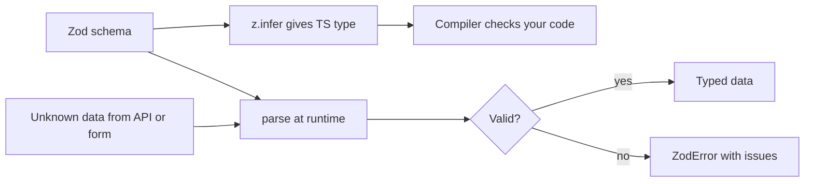
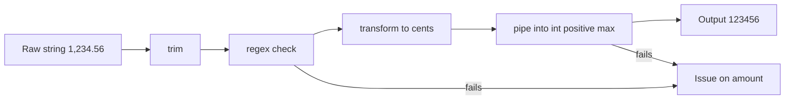
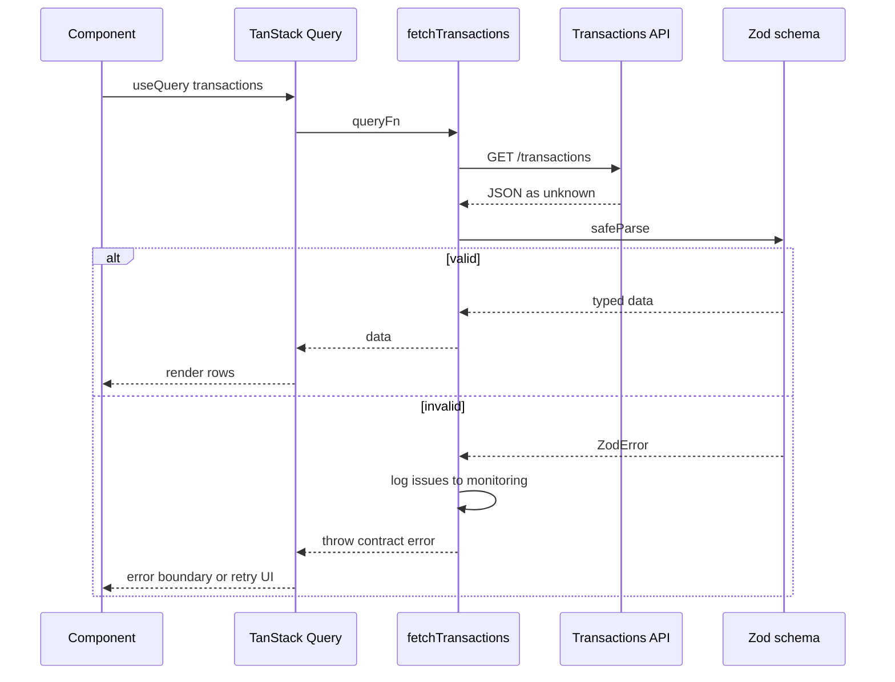

## 1. What it is

**Zod is a TypeScript-first schema library: you build a schema object that describes valid data, call `parse` to check unknown data at runtime, and use `z.infer` to get the matching static type for free.**

Analogy: TypeScript types are a building's blueprint. They help the architects (you and the compiler), but they are gone once the building is open (at runtime, types are erased). Zod is the security guard at the door who actually checks every visitor's ID. And because the guard's checklist is written in code, TypeScript can read the checklist and generate the blueprint from it.

The problem it solves: TypeScript only checks code you wrote. It cannot check JSON from an API, values from a form, `localStorage`, URL params or environment variables. Those arrive as `unknown` and you usually lie with `as Transaction`. Zod checks the data for real, returns typed data or a structured list of errors, and keeps the type and the runtime check from drifting apart because both come from one schema.

> **Why:** "Schema as single source of truth" means you never write `interface Transaction` and a separate `validateTransaction()` that can disagree. Change the schema, and both the type and the validation change together.

## 2. Core concepts

### [Beginner] Your first schema, parse, and z.infer

```ts
import { z } from 'zod';

const AccountSchema = z.object({
  accountId: z.string().min(1),
  name: z.string().min(1).max(100),
  currency: z.enum(['USD', 'EUR', 'GBP']),
  balanceCents: z.number().int(),
  isActive: z.boolean(),
});

// Static type derived from the schema. No separate interface needed.
type Account = z.infer<typeof AccountSchema>;
// { accountId: string; name: string; currency: 'USD' | 'EUR' | 'GBP'; balanceCents: number; isActive: boolean }

const data: unknown = await (await fetch('/api/accounts/ACC-001')).json();
const account = AccountSchema.parse(data); // typed as Account, or throws ZodError
```



> **Why both:** The type helps while you write code. The `parse` helps when the code runs against real data. Without `parse`, a backend change that renames `balanceCents` to `balance` silently produces `undefined` deep in your UI.

### [Beginner] Primitives and common checks

```ts
z.string();                 // any string
z.string().min(1, 'Required');
z.string().max(140);
z.string().regex(/^\d{9}$/, 'Routing number must be 9 digits');
z.string().trim();          // transforms: trims whitespace before checks that follow
z.email();                  // Zod 4 top-level format (z.string().email() is deprecated)
z.uuid();
z.url();
z.iso.date();               // "2026-10-02"
z.iso.datetime();           // "2026-10-02T09:30:00Z"

z.number();                 // finite number (Zod 4 rejects Infinity)
z.number().int().nonnegative();
z.number().positive().max(1_000_000);
z.int();                    // Zod 4 shorthand for safe integers

z.boolean();
z.date();                   // a Date instance (not a string)
z.bigint();
z.literal('USD');
z.enum(['checking', 'savings', 'brokerage']);
z.null(); z.undefined(); z.unknown(); z.any(); z.never();
```

> **Finance tip:** Model money as **integer cents** (`z.number().int()`) or as a **decimal string** (`z.string().regex(/^-?\d+(\.\d{1,2})?$/)`), never as a float with decimals. Floats cannot represent most decimal fractions exactly.

### [Beginner] Objects, arrays and composition

```ts
const TransactionSchema = z.object({
  id: z.uuid(),
  accountId: z.string(),
  postedAt: z.iso.datetime(),
  description: z.string(),
  amountCents: z.number().int(),
  currency: z.enum(['USD', 'EUR', 'GBP']),
  category: z.string().optional(),
});

const TransactionListSchema = z.object({
  items: z.array(TransactionSchema),
  nextCursor: z.string().nullable(),
});

// Derive related schemas instead of copying
const NewTransactionSchema = TransactionSchema.omit({ id: true, postedAt: true });
const TransactionPatchSchema = TransactionSchema.pick({ description: true, category: true }).partial();
const TaggedTransactionSchema = TransactionSchema.extend({ tags: z.array(z.string()).max(10) });
```

Object behavior for unknown keys:

```ts
z.object({ a: z.string() }).parse({ a: 'x', extra: 1 });       // { a: 'x' }  extra is STRIPPED (default)
z.strictObject({ a: z.string() }).parse({ a: 'x', extra: 1 });  // throws: unrecognized key
z.looseObject({ a: z.string() }).parse({ a: 'x', extra: 1 });   // { a: 'x', extra: 1 } kept
```

> **Outdated:** In Zod 3 you wrote `.strict()`, `.passthrough()` and `.merge()`. Zod 4 prefers `z.strictObject`, `z.looseObject` and `.extend()`. The old methods still exist but are deprecated.

### [Beginner] optional, nullable, nullish, default

```ts
z.string().optional();   // string | undefined   (key may be missing)
z.string().nullable();   // string | null        (key present, may be null)
z.string().nullish();    // string | null | undefined
z.string().default('USD'); // if input is undefined, output is 'USD'
z.number().catch(0);     // if parsing fails for ANY reason, output 0 (use sparingly)
```

> **Gotcha:** APIs often send `null`, not a missing key. `z.string().optional()` rejects `null`. Match the real API: use `.nullable()` for `null`, `.optional()` for missing.

### [Intermediate] parse vs safeParse

```ts
// parse: throws ZodError. Good when invalid data is a bug (API contract).
const account = AccountSchema.parse(json);

// safeParse: never throws, returns a discriminated result. Good for user input.
const result = AccountSchema.safeParse(json);
if (!result.success) {
  console.log(result.error.issues);
  // [{ code: 'invalid_type', path: ['balanceCents'], message: 'Invalid input: expected number, received string', ... }]
} else {
  result.data.balanceCents; // typed
}

// Async versions are required if any refine/transform is async
await AccountSchema.parseAsync(json);
await AccountSchema.safeParseAsync(json);
```

> **Interview tip:** "parse for trust boundaries where invalid data is exceptional, safeParse where invalid data is expected (forms)." That distinction is what interviewers want.

### [Intermediate] Unions and discriminated unions

```ts
// Plain union: tries each option in order
const IdSchema = z.union([z.string(), z.number()]);

// Discriminated union: picks the option by a literal "tag" field
const PaymentMethodSchema = z.discriminatedUnion('type', [
  z.object({
    type: z.literal('ach'),
    routingNumber: z.string().regex(/^\d{9}$/),
    accountNumber: z.string().min(4).max(17),
  }),
  z.object({
    type: z.literal('card'),
    cardToken: z.string().startsWith('tok_'), // never raw card numbers in your frontend state
    last4: z.string().length(4),
  }),
  z.object({
    type: z.literal('wire'),
    swiftBic: z.string().regex(/^[A-Z0-9]{8}([A-Z0-9]{3})?$/),
    iban: z.string().min(15).max(34),
  }),
]);

type PaymentMethod = z.infer<typeof PaymentMethodSchema>;

function describe(pm: PaymentMethod) {
  switch (pm.type) {
    case 'ach': return `ACH ****${pm.accountNumber.slice(-4)}`; // narrowed
    case 'card': return `Card ****${pm.last4}`;
    case 'wire': return `Wire ${pm.swiftBic}`;
  }
}
```



```mermaid
flowchart TD
  A["Input object"] --> B{"Read type field"}
  B -->|"ach"| C["Validate ACH shape"]
  B -->|"card"| D["Validate card shape"]
  B -->|"wire"| E["Validate wire shape"]
  B -->|"other"| F["Error: invalid discriminator"]
  C --> G["Typed PaymentMethod"]
  D --> G
  E --> G
```

> **Why discriminated:** A plain union tries every member and, on failure, reports errors from all of them, which is confusing. A discriminated union jumps straight to the right member using the tag, so errors are precise and it is faster.

### [Intermediate] refine and superRefine (cross-field rules)

`refine(fn, options)` adds a custom check. Returning `false` adds an issue. Use `path` to attach the error to a specific field, which forms need.

```ts
const StatementRangeSchema = z
  .object({
    accountId: z.string().min(1),
    startDate: z.iso.date(),
    endDate: z.iso.date(),
  })
  .refine((v) => v.endDate >= v.startDate, {
    error: 'End date must be on or after start date', // Zod 3: `message`
    path: ['endDate'],
  });
```

ISO `YYYY-MM-DD` strings compare correctly as strings, which is one reason to keep dates as ISO strings in forms.

`superRefine` lets you add **multiple** issues with full control.

```ts
const TransferSchema = z
  .object({
    fromAccountId: z.string().min(1),
    toAccountId: z.string().min(1),
    amountCents: z.number().int().positive(),
    availableCents: z.number().int(),
  })
  .superRefine((v, ctx) => {
    if (v.fromAccountId === v.toAccountId) {
      ctx.addIssue({ code: 'custom', path: ['toAccountId'], message: 'Choose a different account' });
    }
    if (v.amountCents > v.availableCents) {
      ctx.addIssue({ code: 'custom', path: ['amountCents'], message: 'Exceeds available balance' });
    }
  });
```

> **Gotcha:** Object-level refinements only run after the object's own shape is valid. If `startDate` is empty, the "end after start" check never runs, so the user fixes one error and then sees a new one. Zod 4 adds a `when` option on refinements to control this; check the docs for your version.

> **Outdated:** Zod 4 docs steer you to `.check()` as the low-level replacement for `.superRefine()`. `superRefine` still works, and most codebases still use it.

### [Intermediate] transform and pipe

`transform` changes the output value (and the output type). `pipe` feeds one schema's output into another schema for further validation.

```ts
// "1,234.56" -> 123456 (cents), validated at each step
const MoneyInputSchema = z
  .string()
  .trim()
  .regex(/^\d{1,3}(,?\d{3})*(\.\d{1,2})?$/, 'Enter an amount like 1,234.56')
  .transform((s) => {
    const [whole, frac = ''] = s.replace(/,/g, '').split('.');
    return Number(whole) * 100 + Number(frac.padEnd(2, '0'));
  })
  .pipe(z.number().int().positive().max(100_000_000, 'Amount too large'));

type MoneyIn = z.input<typeof MoneyInputSchema>;  // string
type MoneyOut = z.output<typeof MoneyInputSchema>; // number  (same as z.infer)

MoneyInputSchema.parse('1,234.56'); // 123456
```



> **Why `z.input` vs `z.output`:** With transforms, what you put in is not what comes out. Forms hold the **input** type (strings). Your API call uses the **output** type (cents). `z.infer` is the output type.

### [Intermediate] coerce and preprocess

`z.coerce.*` runs the JavaScript constructor (`Number(x)`, `String(x)`, `new Date(x)`, `Boolean(x)`) before validating. Useful for query strings and form inputs that are always strings.

```ts
const QuerySchema = z.object({
  page: z.coerce.number().int().min(1).default(1),
  from: z.coerce.date(),
});
QuerySchema.parse({ page: '3', from: '2026-01-01' }); // { page: 3, from: Date }
```

> **Gotcha:** `z.coerce.number()` turns `''` into `0` and `z.coerce.boolean()` turns `'false'` into `true` (non-empty string). For empty form fields, `0` passes `.int()` and may be a wrong "valid" amount. Use `z.stringbool()` (Zod 4) for "true"/"false" strings and `preprocess` for empty handling.

`z.preprocess(fn, schema)` runs any function before validation.

```ts
const OptionalAmount = z.preprocess(
  (v) => (v === '' || v == null ? undefined : Number(v)),
  z.number().positive().optional(),
);
```

### [Advanced] Error formatting

A `ZodError` has an `issues` array. Each issue has `code`, `path`, `message` and code-specific fields. Zod 4 ships helpers to reshape them.

```ts
const r = TransferSchema.safeParse(input);
if (!r.success) {
  // 1. Flat: best for simple, one-level forms
  const flat = z.flattenError(r.error);
  // { formErrors: string[], fieldErrors: { amountCents?: string[], toAccountId?: string[] } }

  // 2. Tree: mirrors nested structure
  const tree = z.treeifyError(r.error);
  // { errors: [], properties: { amountCents: { errors: ['Exceeds available balance'] } } }

  // 3. Human-readable string for logs
  console.error(z.prettifyError(r.error));
  // Multi-line text listing each message and the path it applies to (amountCents)
}
```

Customizing messages globally or per schema:

```ts
// Per check
z.string().min(1, { error: 'Required' });

// Per schema, with a function (Zod 4 unified "error" param)
z.number({ error: (iss) => (iss.input === undefined ? 'Required' : 'Must be a number') });

// Locale
z.config(z.locales.en());
```

> **Outdated:** Zod 3's `error.format()`, `error.flatten()`, `errorMap` and `invalid_type_error` / `required_error` are replaced in Zod 4 by `z.treeifyError`, `z.flattenError` and the single `error` option. `error.errors` is gone; use `error.issues`.

### [Advanced] Integration with React Final Form

Final Form expects `validate(values)` to return a nested errors object mirroring the values. Write a small adapter that converts Zod issues into that shape using Final Form's `setIn`.

```ts
import { setIn, getIn, ValidationErrors } from 'final-form';
import { z } from 'zod';

export function zodValidate<S extends z.ZodType>(schema: S) {
  return (values: z.input<S>): ValidationErrors => {
    const result = schema.safeParse(values);
    if (result.success) return {};
    let errors: object = {};
    for (const issue of result.error.issues) {
      // ['beneficiaries', 0, 'fullName'] -> 'beneficiaries[0].fullName'
      const path = issue.path
        .map((p, i) => (typeof p === 'number' ? `[${p}]` : `${i === 0 ? '' : '.'}${String(p)}`))
        .join('');
      if (!path) continue; // root issue: handle as form-level if needed
      if (getIn(errors, path) === undefined) {
        errors = setIn(errors, path, issue.message); // keep the first message per field
      }
    }
    return errors;
  };
}

// Usage
const PaymentFormSchema = z.object({
  payeeName: z.string().trim().min(1, 'Required'),
  amount: z.string().regex(/^\d+(\.\d{1,2})?$/, 'Use up to 2 decimals'),
  reference: z.string().max(18, 'Max 18 characters').optional(),
});

<Form onSubmit={onPay} validate={zodValidate(PaymentFormSchema)} render={/* ... */} />;
```

> **Why `safeParse` here:** Invalid input is the normal case in a form. Throwing on every keystroke would be wasteful and noisy.

### [Advanced] Integration with react-hook-form (zodResolver)

```tsx
import { useForm } from 'react-hook-form';
import { zodResolver } from '@hookform/resolvers/zod';

const TransferFormSchema = z.object({
  toAccountId: z.string().min(1, 'Required'),
  amount: MoneyInputSchema, // string in, cents out
});

type TransferIn = z.input<typeof TransferFormSchema>;   // { toAccountId: string; amount: string }
type TransferOut = z.output<typeof TransferFormSchema>; // { toAccountId: string; amount: number }

export function TransferForm() {
  const { register, handleSubmit, formState: { errors, isSubmitting } } =
    useForm<TransferIn, unknown, TransferOut>({ resolver: zodResolver(TransferFormSchema) });

  const onSubmit = async (data: TransferOut) => {
    await api.post('/transfers', { toAccountId: data.toAccountId, amountCents: data.amount });
  };

  return (
    <form onSubmit={handleSubmit(onSubmit)} noValidate>
      <input {...register('toAccountId')} />
      {errors.toAccountId && <span role="alert">{errors.toAccountId.message}</span>}
      <input {...register('amount')} inputMode="decimal" />
      {errors.amount && <span role="alert">{errors.amount.message}</span>}
      <button disabled={isSubmitting}>Transfer</button>
    </form>
  );
}
```

> **Gotcha:** `@hookform/resolvers` v5+ is needed for Zod 4 schemas and for the input/output generics shown above. Older versions only understand Zod 3.

### [Advanced] Validating API responses



```ts
export async function fetchTransactions(accountId: string, cursor?: string) {
  const res = await fetch(`/api/accounts/${accountId}/transactions?cursor=${cursor ?? ''}`);
  if (!res.ok) throw new Error(`HTTP ${res.status}`);
  const json: unknown = await res.json();
  const parsed = TransactionListSchema.safeParse(json);
  if (!parsed.success) {
    reportToMonitoring('transactions_contract_violation', z.prettifyError(parsed.error));
    throw new Error('Unexpected response from transactions service');
  }
  return parsed.data;
}
```

> **Finance tip:** A response contract violation in money data must never render silently. Showing `NaN` or `$undefined` as a balance is worse than showing an error. Validate at the boundary, log the issues (without PII), and fail visibly.

> **Gotcha:** Parsing 10,000 transactions with a deep schema costs real CPU on slow devices. Zod 4 is several times faster than Zod 3, but measure. Options: validate the envelope strictly and items loosely, or validate in a Web Worker.

### [Advanced] Branded types and recursive schemas

```ts
// Brand: a string that has been validated, distinct from plain strings at compile time
const AccountId = z.string().regex(/^ACC-\d{3,}$/).brand<'AccountId'>();
type AccountId = z.infer<typeof AccountId>;

function loadAccount(id: AccountId) { /* ... */ }
loadAccount('ACC-001');                 // compile error: plain string
loadAccount(AccountId.parse('ACC-001')); // ok

// Recursive (category tree) with a getter (Zod 4 style)
const Category = z.object({
  name: z.string(),
  get children() {
    return z.array(Category);
  },
});
```

## 3. Why it's used in this project

- **API contracts.** Every response from accounts, transactions and portfolio services is parsed before it reaches the UI. A backend rename fails loudly in one place.
- **Forms.** One schema per form drives both validation messages and the submitted payload type, used through a React Final Form adapter or `zodResolver`.
- **Money parsing.** Transforms turn user strings like `"1,234.56"` into integer cents with validation at each step.
- **Cross-field rules.** Statement date ranges, "from" and "to" accounts differ, beneficiary shares total 100.
- **Environment config.** `VITE_OKTA_ISSUER`, `VITE_API_BASE_URL` are validated at startup so a missing variable fails fast instead of breaking login later.
- **Discriminated unions** model payment methods and transaction types (`debit`, `credit`, `fee`, `transfer`) with exhaustive `switch` statements.

```ts
const Env = z.object({
  VITE_API_BASE_URL: z.url(),
  VITE_OKTA_ISSUER: z.url(),
  VITE_OKTA_CLIENT_ID: z.string().min(1),
  VITE_SESSION_TIMEOUT_MINUTES: z.coerce.number().int().min(1).max(60).default(15),
});
export const env = Env.parse(import.meta.env);
```

## 4. Setup & configuration

```bash
npm install zod
# for react-hook-form
npm install react-hook-form @hookform/resolvers
```

```ts
// schemas/config.ts
import { z } from 'zod';

// Optional: set the default locale for error messages once at app start
z.config(z.locales.en());

// Optional: a project-wide custom error map (Zod 4 "customError")
z.config({
  customError: (iss) => {
    if (iss.code === 'invalid_type' && iss.input === undefined) return 'Required';
    return undefined; // fall back to the default message
  },
});
```

```jsonc
// tsconfig.json: Zod requires strict mode for correct inference
{
  "compilerOptions": {
    "strict": true,               // required, otherwise optional fields infer wrong
    "exactOptionalPropertyTypes": false // true makes .optional() stricter; optional
  }
}
```

> **Outdated:** In early Zod 4 releases you imported from `zod/v4`. Since 4.0 shipped, `import { z } from 'zod'` gives Zod 4, and `zod/v3` gives the old API for gradual migration. `zod/mini` is a functional, tree-shakable variant for size-sensitive bundles.

## 5. Key features we use

### [Beginner] Reusable field schemas

```ts
export const money = z.string().regex(/^\d+(\.\d{1,2})?$/, 'Enter a valid amount');
export const required = (label: string) => z.string().trim().min(1, `${label} is required`);
export const currency = z.enum(['USD', 'EUR', 'GBP']);
```

### [Beginner] Enum values for UI options

```ts
const AccountType = z.enum(['checking', 'savings', 'brokerage']);
AccountType.options; // ['checking', 'savings', 'brokerage'] for a <select>
```

### [Intermediate] Masking PII in transforms

```ts
const CustomerView = z.object({
  name: z.string(),
  ssn: z.string().regex(/^\d{3}-?\d{2}-?\d{4}$/).transform((s) => `***-**-${s.slice(-4)}`),
});
```

### [Intermediate] Typed date range with ISO strings

```ts
const DateRange = z
  .object({ start: z.iso.date(), end: z.iso.date() })
  .refine((r) => r.end >= r.start, { error: 'End before start', path: ['end'] });
```

### [Advanced] JSON Schema export (for docs or backend sharing)

```ts
const jsonSchema = z.toJSONSchema(TransactionSchema); // Zod 4 built-in
```

## 6. Interview questions

#### Q: Why use Zod if you already have TypeScript?

TypeScript types are erased at runtime, so they cannot check data from APIs, forms, storage or env variables. Zod performs real runtime validation and also produces the static type via `z.infer`, so the check and the type come from one source and cannot drift apart.

#### Q: When do you use parse vs safeParse?

`parse` throws a `ZodError` and is good where invalid data is exceptional, such as API contracts or config at startup. `safeParse` returns `{ success, data | error }` and is good where invalid data is expected, such as form validation. Use the async versions if any refinement or transform is async.

#### Q: How do you validate that an end date is after a start date and show the error on the end date field?

Use `.refine` (or `superRefine`) on the object, compare the values, and pass `path: ['endDate']` so the issue attaches to that field. Note the refinement only runs once the base object shape is valid, which can make errors appear in stages.

#### Q: What is the difference between z.input, z.output and z.infer?

When a schema has transforms, defaults or coercion, input and output types differ. `z.input` is what you can pass in (e.g. string from a form), `z.output` is what parse returns (e.g. cents as number). `z.infer` is the same as `z.output`. Forms should be typed with the input type, API calls with the output type.

#### Q: What changed in Zod 4 that matters day to day?

Much faster parsing and smaller types (better TS performance). String formats became top-level (`z.email()`, `z.uuid()`, `z.iso.date()`). Error customization unified under one `error` option. New error helpers (`z.treeifyError`, `z.flattenError`, `z.prettifyError`) replace `.format()`/`.flatten()`. `z.strictObject`/`z.looseObject` replace `.strict()`/`.passthrough()`. `.merge()` is deprecated in favor of `.extend()`. Built-in JSON Schema export and a tree-shakable `zod/mini` exist. `z.record` requires both key and value schemas. Number schemas reject infinite values.

## 7. Drawbacks & pain points

- **Bundle size.** Full Zod is ~13 kB+ gzip and does not tree-shake well. `zod/mini` or Valibot are smaller.
- **Runtime cost** on very large payloads.
- **Staged errors** from object refinements that only run after the base shape passes.
- **Coercion surprises** (`''` to `0`, `'false'` to `true`).
- **Migration churn** between Zod 3 and 4 (error options, method names, resolver versions).
- **Complex types** can slow the TypeScript language server in huge schemas (much improved in Zod 4).

Gotchas that trip devs up:

```ts
// 1. optional vs nullable
z.object({ memo: z.string().optional() }).parse({ memo: null }); // throws

// 2. Stripping unknown keys silently
z.object({ amountCents: z.number() }).parse({ amountCents: 1, accountId: 'A' }); // accountId removed!

// 3. Default does not apply to null
z.string().default('USD').parse(null); // throws; default only for undefined

// 4. Number from a text input
z.number().parse('42'); // throws: it is a string. Use coerce, preprocess, or a string schema.

// 5. Mixing Zod 3 resolver with Zod 4 schemas
// zodResolver from an old @hookform/resolvers version will not type-check or behave correctly.
```

## 8. Better alternatives

Zod is still the most popular choice in 2026. The landscape has converged on the **Standard Schema** interface, so libraries like TanStack Form, tRPC and React Hook Form resolvers can accept Zod, Valibot or ArkType interchangeably. The choice is now mostly about bundle size and ergonomics.

| Library | Bundle (gzip) | Boilerplate | Devtools | Learning curve | TypeScript | Popularity | When it wins |
| --- | --- | --- | --- | --- | --- | --- | --- |
| Zod 4 | ~13 kB full, ~2-4 kB with zod/mini | Low | N/A | Low | Excellent | Very high | Default choice, huge ecosystem |
| Valibot | ~1-3 kB (tree-shaken) | Low-medium (pipe style) | N/A | Low-medium | Excellent | Growing | Bundle-sensitive apps |
| Yup | ~12 kB | Low | N/A | Low | Good (types weaker) | High, legacy | Existing Formik codebases |
| ArkType | ~30 kB+ | Low (TS-like string syntax) | N/A | Medium | Excellent, very fast | Niche, growing | Performance-critical validation |
| TypeBox | ~10 kB | Medium | N/A | Medium | Excellent | Medium | JSON Schema first, backend sharing |

```ts
// Same schema in Valibot
import * as v from 'valibot';
const Account = v.object({ accountId: v.pipe(v.string(), v.minLength(1)), balanceCents: v.pipe(v.number(), v.integer()) });

// Same in ArkType
import { type } from 'arktype';
const Account2 = type({ accountId: 'string > 0', balanceCents: 'number.integer' });
```

> **Outdated:** Yup was the classic pairing with Formik. It is still maintained, but new projects pick Zod or Valibot for better type inference.

## 9. When NOT to use it

- Hot loops validating huge datasets on every frame or every keystroke; validate once at the boundary.
- Data you fully control in memory and already typed (internal function arguments); TypeScript is enough.
- Tiny bundle budgets (embeddable widgets) where Valibot or hand-written checks are smaller.
- When the backend already publishes OpenAPI and you generate types and validators from it; do not hand-write duplicate schemas.
- As a replacement for server-side validation; the server must validate again.

## Cheatsheet

| Need | Zod 4 |
| --- | --- |
| Type from schema | `type T = z.infer<typeof S>` / `z.input` / `z.output` |
| Strings | `z.string().min(1).max(100).regex(re).trim()` |
| Formats | `z.email()`, `z.uuid()`, `z.url()`, `z.iso.date()`, `z.iso.datetime()` |
| Numbers | `z.number().int().positive().max(n)`, `z.int()` |
| Enum / literal | `z.enum(['A','B'])`, `z.literal('A')` |
| Object | `z.object({...})`, `z.strictObject`, `z.looseObject` |
| Derive | `.extend()`, `.pick()`, `.omit()`, `.partial()`, `.required()` |
| Array | `z.array(S).min(1).max(10)` |
| Union | `z.union([A, B])`, `z.discriminatedUnion('type', [A, B])` |
| Optional | `.optional()`, `.nullable()`, `.nullish()`, `.default(v)`, `.catch(v)` |
| Check | `.refine(fn, { error, path })`, `.superRefine((v, ctx) => ctx.addIssue(...))` |
| Change | `.transform(fn)`, `.pipe(S2)`, `z.preprocess(fn, S)` |
| Coerce | `z.coerce.number()`, `z.coerce.date()`, `z.stringbool()` |
| Run | `S.parse(x)`, `S.safeParse(x)`, `parseAsync`, `safeParseAsync` |
| Errors | `err.issues`, `z.flattenError`, `z.treeifyError`, `z.prettifyError` |
| Brand | `.brand<'AccountId'>()` |
| RHF | `useForm({ resolver: zodResolver(S) })` |

```ts
import { z } from 'zod';

const TransferForm = z
  .object({
    from: z.string().min(1, 'Required'),
    to: z.string().min(1, 'Required'),
    amount: z.string().regex(/^\d+(\.\d{1,2})?$/, 'Invalid amount')
      .transform((s) => Math.round(Number(s) * 100)) // simple; use string math for exactness
      .pipe(z.number().int().positive()),
    executeOn: z.iso.date(),
  })
  .refine((v) => v.from !== v.to, { error: 'Choose a different account', path: ['to'] });

type TransferIn = z.input<typeof TransferForm>;
type TransferOut = z.output<typeof TransferForm>;

const r = TransferForm.safeParse(formValues);
if (!r.success) console.log(z.flattenError(r.error).fieldErrors);
else await api.post('/transfers', r.data);
```
