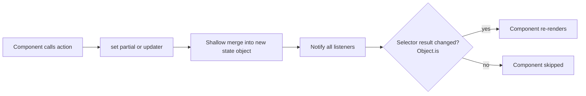
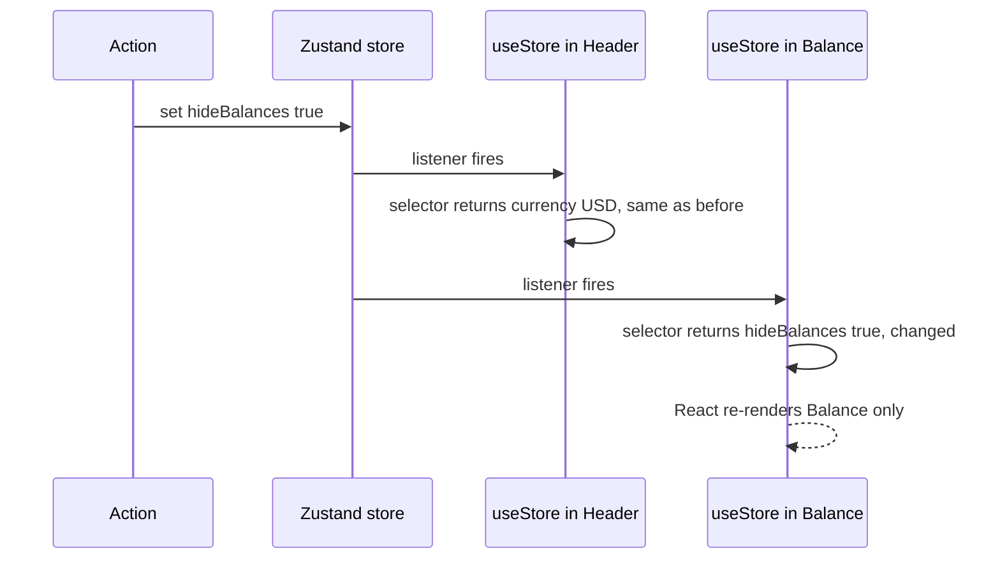
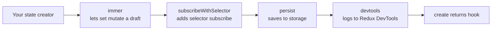
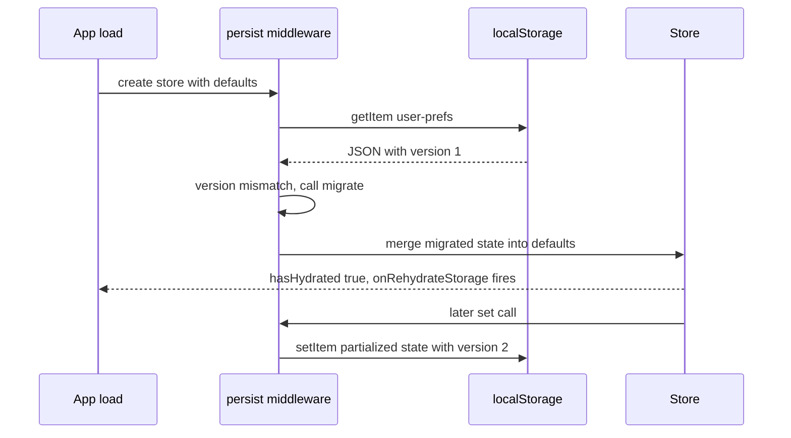

## 1. What it is

**Zustand is a small (~1 KB) hook-based state library: you create a store once, and any component subscribes to just the slice of it that it needs.**

Think of a store as a whiteboard on the office wall. Anyone can walk up and read it. Anyone allowed can change it. But instead of everyone staring at the whole board all day, each person only watches one corner, say "today's FX rate". When someone erases and rewrites a different corner, you do not even look up. That "only watch your corner" idea is the selector, and it is the whole reason Zustand is fast.

The problem it solves: React's built-in tools for sharing state across distant components are prop drilling (tedious) and Context (re-renders every consumer whenever the value changes). Redux solves this but asks for actions, reducers, a Provider and more ceremony. Zustand gives you a global store with fine-grained subscriptions, no Provider, and almost no boilerplate.

## 2. Core concepts

### [Beginner] The store is a hook created by `create`

`create` takes a function that receives `set` and `get` and returns your initial state plus the functions that change it. It returns a React hook.

```ts
import { create } from 'zustand';

type Currency = 'USD' | 'EUR' | 'GBP';

interface PreferencesState {
  displayCurrency: Currency;
  hideBalances: boolean;
  setDisplayCurrency: (c: Currency) => void;
  toggleHideBalances: () => void;
}

// Note the curried form create<T>()(...) — needed for correct TS inference.
export const usePreferencesStore = create<PreferencesState>()((set) => ({
  displayCurrency: 'USD',
  hideBalances: false,
  setDisplayCurrency: (c) => set({ displayCurrency: c }),
  toggleHideBalances: () => set((s) => ({ hideBalances: !s.hideBalances })),
}));
```

> **Why:** The store lives in a JavaScript module, outside React. Modules are singletons, so every component that imports the hook talks to the same store. No Provider is needed because there is nothing to inject: the hook already closes over the store.

> **Why the curried `create<T>()(...)`:** TypeScript cannot partially infer generics. The extra `()` lets you pass `T` explicitly while middleware types are still inferred. Without it, middleware like `devtools` loses type information.

### [Beginner] Reading state with a selector

You call the hook with a selector function: "give me this piece".

```tsx
function CurrencyBadge() {
  const currency = usePreferencesStore((s) => s.displayCurrency);
  return <span className="badge">{currency}</span>;
}

function HideBalancesToggle() {
  const hide = usePreferencesStore((s) => s.hideBalances);
  const toggle = usePreferencesStore((s) => s.toggleHideBalances);
  return <button onClick={toggle}>{hide ? 'Show' : 'Hide'} balances</button>;
}
```

`CurrencyBadge` re-renders only when `displayCurrency` changes. Toggling `hideBalances` does not touch it.

> **Gotcha:** `usePreferencesStore()` with no selector returns the entire state. The component then re-renders on every change to any field. It works, but it throws away Zustand's main advantage.

### [Beginner] `set` merges, `get` reads

`set` does a **shallow merge** at the top level: you pass only the keys you change. `get` returns the current state, useful inside actions.

```ts
interface CartState {
  transferAmountCents: number;
  feeCents: number;
  setAmount: (cents: number) => void;
  totalCents: () => number;
}

export const useTransferStore = create<CartState>()((set, get) => ({
  transferAmountCents: 0,
  feeCents: 150,
  setAmount: (cents) => set({ transferAmountCents: cents }), // feeCents kept
  totalCents: () => get().transferAmountCents + get().feeCents,
}));
```



> **Gotcha:** The merge is only one level deep. `set({ filters: { status: 'posted' } })` replaces the whole `filters` object and drops other filter keys. Spread nested objects yourself or use the `immer` middleware.

> **Why updater functions:** `set((s) => ...)` reads the latest state at the moment of update. Using a value captured earlier in a closure can be stale if two updates happen close together.

### [Beginner] State must be treated as immutable

Zustand detects change with `Object.is` (reference equality). If you mutate an array in place, the reference does not change, so nobody re-renders.

```ts
interface WatchlistState {
  symbols: string[];
  add: (sym: string) => void;
}

export const useWatchlist = create<WatchlistState>()((set) => ({
  symbols: [],
  // WRONG: mutates, same array reference, UI will not update
  // add: (sym) => set((s) => { s.symbols.push(sym); return s; }),

  // RIGHT: new array
  add: (sym) => set((s) => ({ symbols: [...s.symbols, sym] })),
}));
```

### [Intermediate] Why selectors prevent re-renders

Under the hood, the hook uses React's `useSyncExternalStore`. On every store change, Zustand runs your selector on the new state and compares the result with the previous result using `Object.is`. Only if they differ does React re-render that component.



So the rule is: **select the smallest primitive you need.** Primitives (strings, numbers, booleans) compare by value, so they are always safe.

```tsx
// Good: re-renders only when this one account's balance changes
const balance = useAccountsStore((s) => s.byId[accountId]?.balanceCents);
```

### [Intermediate] Selecting several values: `useShallow`

If a selector returns a **new object or array every time**, `Object.is` always says "changed".

```tsx
// In Zustand 5 this can cause "Maximum update depth exceeded"
// because the selector creates a new object on every call.
const { currency, hide } = usePreferencesStore((s) => ({
  currency: s.displayCurrency,
  hide: s.hideBalances,
}));
```

`useShallow` wraps the selector and compares the result one level deep (each key / each array item with `Object.is`). If all items are equal, it returns the previous reference.

```tsx
import { useShallow } from 'zustand/react/shallow';

const { currency, hide } = usePreferencesStore(
  useShallow((s) => ({ currency: s.displayCurrency, hide: s.hideBalances })),
);

// Arrays work too
const [currency2, hide2] = usePreferencesStore(
  useShallow((s) => [s.displayCurrency, s.hideBalances]),
);

// Derived lists: keys of a map
const accountIds = useAccountsStore(useShallow((s) => Object.keys(s.byId)));
```

> **Outdated:** In Zustand 4 you passed `shallow` as a second argument: `useStore(selector, shallow)`. Zustand 5 removed the equality-function argument from `create`. Use `useShallow`, or `createWithEqualityFn` from `zustand/traditional` if you must keep the old style.

> **Alternative:** Call the hook several times, one primitive each. This is often the clearest option and needs no helper.

### [Intermediate] Actions can live in the store (and should be stable)

Functions defined inside `create` are created once, so their reference never changes. Selecting them never causes re-renders. A common pattern is to group them under `actions`.

```ts
interface AccountsState {
  byId: Record<string, Account>;
  selectedId: string | null;
  actions: {
    select: (id: string) => void;
    upsert: (a: Account) => void;
  };
}

export const useAccountsStore = create<AccountsState>()((set) => ({
  byId: {},
  selectedId: null,
  actions: {
    select: (id) => set({ selectedId: id }),
    upsert: (a) => set((s) => ({ byId: { ...s.byId, [a.id]: a } })),
  },
}));

// Export narrow hooks so components cannot accidentally subscribe to everything
export const useSelectedAccountId = () => useAccountsStore((s) => s.selectedId);
export const useAccountActions = () => useAccountsStore((s) => s.actions);
```

### [Intermediate] Async actions are just async functions

There is no thunk concept. An action can `await` and call `set` whenever it wants.

```ts
interface FxState {
  rates: Record<string, number>;
  status: 'idle' | 'loading' | 'error';
  loadRates: (base: string) => Promise<void>;
}

export const useFxStore = create<FxState>()((set) => ({
  rates: {},
  status: 'idle',
  loadRates: async (base) => {
    set({ status: 'loading' });
    try {
      const res = await fetch(`/api/fx?base=${base}`);
      if (!res.ok) throw new Error(res.statusText);
      set({ rates: await res.json(), status: 'idle' });
    } catch {
      set({ status: 'error' });
    }
  },
}));
```

> **Gotcha:** Just because you can fetch inside Zustand does not mean you should. Caching, deduping, retries and refetch-on-focus are hard. For server data, TanStack Query or RTK Query is usually the better home; keep Zustand for client state.

### [Intermediate] Using the store outside React

The hook also exposes `getState`, `setState`, `subscribe` and `getInitialState`. These work anywhere: API clients, event handlers, timers, tests.

```ts
// api/client.ts — attach auth context outside components
export async function apiFetch(path: string, init: RequestInit = {}) {
  const { displayCurrency } = usePreferencesStore.getState();
  return fetch(path, {
    ...init,
    headers: { ...init.headers, 'X-Display-Currency': displayCurrency },
  });
}

// Reacting to changes outside React
const unsubscribe = usePreferencesStore.subscribe((state, prev) => {
  if (state.displayCurrency !== prev.displayCurrency) {
    analytics.track('currency_changed', { to: state.displayCurrency });
  }
});
```

> **Gotcha:** `getState()` inside a component body is a snapshot, not a subscription. The component will not re-render when that value changes. Use the hook for rendering; use `getState()` in callbacks.

### [Intermediate] Slices pattern with TypeScript

One big store gets unwieldy. Split it into slice creators and combine them. Each slice is typed with `StateCreator<FullStore, Mutators, [], Slice>` so it can read and write the other slices.

```ts
import { create, StateCreator } from 'zustand';

interface SessionSlice {
  userId: string | null;
  lastActivityAt: number;
  touch: () => void;
  logout: () => void;
}

interface UiSlice {
  sidebarOpen: boolean;
  toggleSidebar: () => void;
}

type AppStore = SessionSlice & UiSlice;

const createSessionSlice: StateCreator<AppStore, [], [], SessionSlice> = (set) => ({
  userId: null,
  lastActivityAt: Date.now(),
  touch: () => set({ lastActivityAt: Date.now() }),
  // A slice can reset fields that belong to another slice
  logout: () => set({ userId: null, sidebarOpen: false }),
});

const createUiSlice: StateCreator<AppStore, [], [], UiSlice> = (set) => ({
  sidebarOpen: true,
  toggleSidebar: () => set((s) => ({ sidebarOpen: !s.sidebarOpen })),
});

export const useAppStore = create<AppStore>()((...a) => ({
  ...createSessionSlice(...a),
  ...createUiSlice(...a),
}));
```

When middleware wraps the combined store, the slice types must declare the mutators so `set` has the right signature:

```ts
import { devtools } from 'zustand/middleware';

const createUiSliceDt: StateCreator<
  AppStore,
  [['zustand/devtools', never]], // mutators applied outside
  [],
  UiSlice
> = (set) => ({
  sidebarOpen: true,
  // devtools adds a 3rd arg: the action name shown in Redux DevTools
  toggleSidebar: () => set((s) => ({ sidebarOpen: !s.sidebarOpen }), false, 'ui/toggleSidebar'),
});
```

> **Why:** Apply middleware once, on the combined store, not inside each slice. Wrapping slices individually leads to confusing types and duplicated devtools instances.

### [Advanced] Middleware: how it composes

Middleware are functions that wrap the state creator and enhance `set`, `get` or the store API. They nest like function calls, so order matters: the outermost runs first.



```ts
import { create } from 'zustand';
import { devtools, persist, subscribeWithSelector, createJSONStorage } from 'zustand/middleware';
import { immer } from 'zustand/middleware/immer';

export const useDraftStore = create<DraftState>()(
  devtools(                       // outermost: sees final actions
    persist(
      subscribeWithSelector(
        immer((set) => ({ /* ... */ })),
      ),
      { name: 'draft-transfer', storage: createJSONStorage(() => sessionStorage) },
    ),
    { name: 'DraftStore', enabled: import.meta.env.DEV },
  ),
);
```

> **Interview tip:** Recommended practice is to put `devtools` last (outermost) so it sees every change other middleware make, including persist rehydration.

### [Advanced] `devtools`

Connects the store to the Redux DevTools browser extension: you get an action log, state diffs and time travel.

```ts
const useLedgerStore = create<LedgerState>()(
  devtools(
    (set) => ({
      pending: [],
      addPending: (t: Transaction) =>
        set((s) => ({ pending: [...s.pending, t] }), false, { type: 'ledger/addPending', t }),
    }),
    { name: 'Ledger', enabled: import.meta.env.DEV },
  ),
);
```

The third argument to `set` names the action. Without it, every entry shows as "anonymous".

> **Finance tip:** Disable devtools in production (`enabled: import.meta.env.DEV`). Otherwise anyone with the extension can inspect store contents, which may include account numbers or balances.

### [Advanced] `persist` with `partialize`, `version` and `migrate`

`persist` saves the store to storage (localStorage by default) and rehydrates on load.

```ts
interface PrefsV2 {
  displayCurrency: Currency;
  dateFormat: 'ISO' | 'US' | 'EU';
  hideBalances: boolean;
  draftMemo: string; // should NOT be persisted
  setDateFormat: (f: PrefsV2['dateFormat']) => void;
}

export const usePrefs = create<PrefsV2>()(
  persist(
    (set) => ({
      displayCurrency: 'USD',
      dateFormat: 'ISO',
      hideBalances: false,
      draftMemo: '',
      setDateFormat: (f) => set({ dateFormat: f }),
    }),
    {
      name: 'user-prefs',                                   // storage key
      storage: createJSONStorage(() => localStorage),       // or sessionStorage, or a custom async store
      // Only save what you need. Functions are never saved anyway.
      partialize: (s) => ({
        displayCurrency: s.displayCurrency,
        dateFormat: s.dateFormat,
        hideBalances: s.hideBalances,
      }),
      version: 2,                                           // bump when the saved shape changes
      migrate: (persisted, fromVersion) => {
        const old = persisted as Record<string, unknown>;
        if (fromVersion < 2) {
          // v1 stored `usDates: boolean`; v2 uses dateFormat
          return {
            ...old,
            dateFormat: old.usDates ? 'US' : 'ISO',
          };
        }
        return old as Partial<PrefsV2>;
      },
      onRehydrateStorage: () => (state, error) => {
        if (error) console.error('Prefs rehydrate failed', error);
      },
    },
  ),
);

// Hydration helpers
usePrefs.persist.hasHydrated();
usePrefs.persist.rehydrate();
usePrefs.persist.clearStorage(); // e.g. on logout
```



> **Finance tip:** Never persist tokens, account numbers, balances or PII to localStorage. It is readable by any script on the page (XSS) and survives logout. Persist preferences only, and call `clearStorage()` on logout.

> **Gotcha:** With localStorage, hydration is synchronous, but with an async storage (IndexedDB) the first render sees defaults. With SSR, server HTML uses defaults and the client then rehydrates, causing a hydration mismatch. Use `skipHydration: true` and call `rehydrate()` in an effect, or gate rendering on `hasHydrated()`.

### [Advanced] `immer` middleware

Lets you write "mutating" code that Immer turns into immutable updates. Great for deeply nested state. Requires installing `immer`.

```ts
import { immer } from 'zustand/middleware/immer';

interface PortfolioState {
  portfolios: Record<string, { name: string; holdings: { symbol: string; qty: number }[] }>;
  addShares: (pid: string, symbol: string, qty: number) => void;
}

export const usePortfolio = create<PortfolioState>()(
  immer((set) => ({
    portfolios: {},
    addShares: (pid, symbol, qty) =>
      set((draft) => {
        const p = draft.portfolios[pid];
        if (!p) return;
        const h = p.holdings.find((x) => x.symbol === symbol);
        if (h) h.qty += qty;
        else p.holdings.push({ symbol, qty });
      }),
  })),
);
```

> **Why:** Immer gives you a Proxy "draft". It records your mutations and produces a new object, structurally sharing every untouched branch. References change only on the path you touched, so selectors on other branches stay stable.

### [Advanced] `subscribeWithSelector`

Plain `subscribe` fires on every change. This middleware adds a selector-based overload with optional equality and `fireImmediately`.

```ts
import { subscribeWithSelector } from 'zustand/middleware';
import { shallow } from 'zustand/shallow';

export const useSessionStore = create<SessionSlice>()(
  subscribeWithSelector((set) => ({
    userId: null,
    lastActivityAt: Date.now(),
    touch: () => set({ lastActivityAt: Date.now() }),
    logout: () => set({ userId: null }),
  })),
);

// Restart the idle-logout timer only when lastActivityAt changes
let timer: ReturnType<typeof setTimeout>;
useSessionStore.subscribe(
  (s) => s.lastActivityAt,
  (last) => {
    clearTimeout(timer);
    timer = setTimeout(() => useSessionStore.getState().logout(), 15 * 60_000);
  },
  { fireImmediately: true },
);

// Watch two fields with shallow equality
useSessionStore.subscribe((s) => [s.userId, s.lastActivityAt], console.log, { equalityFn: shallow });
```

### [Advanced] Vanilla stores and scoped stores via Context

`createStore` from `zustand/vanilla` creates a store with no React. `useStore(store, selector)` binds it to React. This is how you get **per-instance** stores (e.g. one store per open account modal), and how you avoid shared state between SSR requests.

```tsx
import { createStore } from 'zustand/vanilla';
import { useStore } from 'zustand';
import { createContext, useContext, useState, type ReactNode } from 'react';

interface TxTableState {
  sortBy: 'date' | 'amount';
  selected: Set<string>;
  setSort: (k: TxTableState['sortBy']) => void;
}

const createTxTableStore = (initial?: Partial<TxTableState>) =>
  createStore<TxTableState>()((set) => ({
    sortBy: 'date',
    selected: new Set(),
    setSort: (k) => set({ sortBy: k }),
    ...initial,
  }));

type TxTableStore = ReturnType<typeof createTxTableStore>;
const TxTableContext = createContext<TxTableStore | null>(null);

export function TxTableProvider({ children }: { children: ReactNode }) {
  const [store] = useState(createTxTableStore); // created once per mount
  return <TxTableContext.Provider value={store}>{children}</TxTableContext.Provider>;
}

export function useTxTable<T>(selector: (s: TxTableState) => T): T {
  const store = useContext(TxTableContext);
  if (!store) throw new Error('useTxTable must be inside TxTableProvider');
  return useStore(store, selector);
}
```

> **Why Context here?** Context only passes the store reference, which never changes. Components still subscribe through selectors, so you keep fine-grained re-renders. This is very different from putting the state itself in Context.

### [Advanced] Testing and resetting stores

Module singletons leak state between tests. Reset in `beforeEach`. Every store has `getInitialState()`.

```ts
// prefs.test.ts (Vitest)
import { beforeEach, expect, test } from 'vitest';
import { usePreferencesStore } from './preferencesStore';

beforeEach(() => {
  // `true` = replace instead of merge, so stray keys are dropped
  usePreferencesStore.setState(usePreferencesStore.getInitialState(), true);
});

test('toggles hideBalances', () => {
  usePreferencesStore.getState().toggleHideBalances();
  expect(usePreferencesStore.getState().hideBalances).toBe(true);
});
```

For many stores, the Zustand docs show a `__mocks__/zustand.ts` that wraps `create` and records every store's initial state so all are reset after each test. In component tests, prefer setting state via `setState` before rendering rather than mocking the hook.

A common app-level pattern is a `reset` action for logout:

```ts
const initial = { userId: null, sidebarOpen: true };
export const useApp = create<typeof initial & { reset: () => void }>()((set) => ({
  ...initial,
  reset: () => set(initial),
}));
```

## 3. Why it's used in this project

- **Cross-cutting UI state with no Provider.** Display currency, "hide balances" privacy mode, selected account, sidebar state and theme are needed by headers, tables and charts in different subtrees. A Zustand store is one import away.
- **Performance on heavy screens.** A transactions grid with 10k rows plus a live price ticker cannot afford Context-style "everyone re-renders". With selectors, a row subscribed to `s.selected.has(txId)` re-renders only when its own checkbox flips.
- **Session timeout for compliance.** Idle-logout timers live outside React. `subscribeWithSelector` plus `getState()` lets a plain module watch `lastActivityAt` and call `logout()` without any component being mounted.
- **Multi-step forms and wizards.** A "new transfer" wizard keeps its draft in a store (optionally `persist` to sessionStorage so a refresh does not lose it, never localStorage).
- **Using state in non-React code.** The API client reads the current account or display currency with `getState()`; the Okta auth callback calls `useSession.setState(...)`.
- **Easy debugging.** `devtools` in development gives an action log similar to Redux without Redux's boilerplate.

> **Finance tip:** Server data such as balances and transaction lists should still come from a server-cache library (TanStack Query or RTK Query) so it can be refetched, invalidated after a payment, and kept fresh. Zustand holds what the client owns: selections, filters, drafts, preferences.

## 4. Setup & configuration

```bash
npm install zustand
# optional, only if you use the immer middleware
npm install immer
```

Zustand 5 requires React 18 or newer (it uses React's native `useSyncExternalStore`). It ships its own TypeScript types.

A typical project layout:

```
src/
  stores/
    preferencesStore.ts
    sessionStore.ts
    transferDraftStore.ts
    index.ts           # re-export narrow hooks only
```

A fully commented production store:

```ts
// src/stores/preferencesStore.ts
import { create } from 'zustand';
import { devtools, persist, createJSONStorage } from 'zustand/middleware';
import { useShallow } from 'zustand/react/shallow';

export type Currency = 'USD' | 'EUR' | 'GBP' | 'NPR';

interface PreferencesState {
  displayCurrency: Currency;
  hideBalances: boolean;
  locale: string;
  actions: {
    setDisplayCurrency: (c: Currency) => void;
    toggleHideBalances: () => void;
    setLocale: (l: string) => void;
    reset: () => void;
  };
}

const initialState = {
  displayCurrency: 'USD' as Currency,
  hideBalances: false,
  locale: 'en-US',
};

export const usePreferencesStore = create<PreferencesState>()(
  devtools(
    persist(
      (set) => ({
        ...initialState,
        actions: {
          // 3rd arg to set = action name shown in Redux DevTools
          setDisplayCurrency: (c) => set({ displayCurrency: c }, false, 'prefs/setCurrency'),
          toggleHideBalances: () =>
            set((s) => ({ hideBalances: !s.hideBalances }), false, 'prefs/toggleHide'),
          setLocale: (l) => set({ locale: l }, false, 'prefs/setLocale'),
          reset: () => set(initialState, false, 'prefs/reset'),
        },
      }),
      {
        name: 'prefs',                                    // localStorage key
        storage: createJSONStorage(() => localStorage),   // default; explicit for clarity
        version: 1,                                       // bump + add migrate when shape changes
        // actions object must not be persisted; it would be overwritten on rehydrate
        partialize: ({ actions, ...rest }) => rest,
        // merge persisted state with current; default is shallow merge (fine here)
        // skipHydration: true,                           // enable for SSR, then call rehydrate()
      },
    ),
    {
      name: 'Preferences',              // instance name in DevTools
      enabled: import.meta.env.DEV,     // never in production
    },
  ),
);

// Public, narrow hooks. Components never import usePreferencesStore directly.
export const useDisplayCurrency = () => usePreferencesStore((s) => s.displayCurrency);
export const useHideBalances = () => usePreferencesStore((s) => s.hideBalances);
export const usePreferenceActions = () => usePreferencesStore((s) => s.actions);
export const useFormatPrefs = () =>
  usePreferencesStore(useShallow((s) => ({ currency: s.displayCurrency, locale: s.locale })));
```

> **Gotcha:** If you persist without `partialize`, the persisted `actions` object (serialized as `{}`) can be merged over your real actions on rehydrate in some setups. Always exclude functions and transient fields.

## 5. Key features we use

### [Beginner] Masked balance with a primitive selector

```tsx
import { useHideBalances, useFormatPrefs } from '@/stores/preferencesStore';

export function Money({ amountCents, currency }: { amountCents: number; currency: string }) {
  const hide = useHideBalances();
  const { locale } = useFormatPrefs();
  if (hide) return <span aria-label="hidden amount">••••</span>;
  return (
    <span>
      {new Intl.NumberFormat(locale, { style: 'currency', currency }).format(amountCents / 100)}
    </span>
  );
}
```

### [Intermediate] Row-level selection in a large table

```ts
interface SelectionState {
  selectedIds: Record<string, true>;
  toggle: (id: string) => void;
  clear: () => void;
}

export const useTxSelection = create<SelectionState>()((set) => ({
  selectedIds: {},
  toggle: (id) =>
    set((s) => {
      const next = { ...s.selectedIds };
      if (next[id]) delete next[id];
      else next[id] = true;
      return { selectedIds: next };
    }),
  clear: () => set({ selectedIds: {} }),
}));

// Each row subscribes to a boolean: only the toggled row re-renders
export const useIsSelected = (id: string) => useTxSelection((s) => !!s.selectedIds[id]);
export const useSelectedCount = () => useTxSelection((s) => Object.keys(s.selectedIds).length);
```

### [Intermediate] Session timeout outside React

```ts
// src/session/idleWatcher.ts
import { useSessionStore } from '@/stores/sessionStore';

export function startIdleWatcher(timeoutMs = 15 * 60_000) {
  let timer: ReturnType<typeof setTimeout> | undefined;
  const reset = () => {
    clearTimeout(timer);
    timer = setTimeout(() => useSessionStore.getState().logout('idle'), timeoutMs);
  };
  const unsub = useSessionStore.subscribe(
    (s) => s.lastActivityAt,
    reset,
    { fireImmediately: true },
  );
  return () => { unsub(); clearTimeout(timer); };
}
```

### [Intermediate] Transfer wizard draft persisted to sessionStorage

```ts
export const useTransferDraft = create<TransferDraft>()(
  persist(
    (set) => ({
      step: 1,
      fromAccountId: null,
      toAccountId: null,
      amountCents: 0,
      next: () => set((s) => ({ step: s.step + 1 })),
      update: (patch: Partial<TransferDraft>) => set(patch),
      discard: () => {
        set({ step: 1, fromAccountId: null, toAccountId: null, amountCents: 0 });
        useTransferDraft.persist.clearStorage();
      },
    }),
    {
      name: 'transfer-draft',
      storage: createJSONStorage(() => sessionStorage), // cleared when tab closes
      partialize: ({ step, fromAccountId, toAccountId, amountCents }) =>
        ({ step, fromAccountId, toAccountId, amountCents }),
    },
  ),
);
```

### [Advanced] Logout resets every store

```ts
// src/stores/resetAll.ts
import { usePreferencesStore } from './preferencesStore';
import { useTxSelection } from './selectionStore';
import { useTransferDraft } from './transferDraftStore';

export function resetAllStores() {
  useTxSelection.setState(useTxSelection.getInitialState(), true);
  useTransferDraft.getState().discard();
  // keep preferences across sessions, but drop hideBalances override if required by policy
}
```

## 6. Interview questions

#### Q: How does Zustand decide whether a component should re-render?

The hook subscribes through `useSyncExternalStore`. On every `set`, the store notifies all listeners. For each subscribed component, Zustand runs the selector against the new state and compares the result with the previous one using `Object.is`. If equal, React skips the render; if different, it re-renders. That is why selecting a primitive (`s.balanceCents`) is cheap, and why selecting a freshly built object (`s => ({ a: s.a })`) re-renders every time (or loops in v5) unless you wrap it with `useShallow`.

#### Q: What does `useShallow` do and when do you need it?

It wraps a selector that returns an object or array. It compares the new result with the previous one key by key (or index by index) using `Object.is`. If every entry matches, it returns the **previous reference**, so the outer `Object.is` check passes and no re-render happens. You need it whenever the selector builds a new container: picking several fields, `Object.keys(...)`, `.map(...)`, `.filter(...)`. It does not deep-compare, so nested new objects inside still count as changed.

#### Q: Zustand vs Redux Toolkit — when would you choose each?

- **Zustand:** small to medium apps, or as the client-state layer next to TanStack Query. Minimal boilerplate, no Provider, ~1 KB, easy store-outside-React access.
- **Redux Toolkit:** large teams that benefit from strict conventions (slices, actions as events), strong DevTools time travel, middleware for cross-cutting effects (listener middleware), RTK Query built in, and many existing Redux codebases.

Both use a single external store with selector subscriptions, so performance is similar. The difference is structure and ecosystem. A good answer mentions that in many modern apps most "global state" is actually server cache, which neither should own directly.

#### Q: How do you persist a store safely and handle schema changes?

Use the `persist` middleware. Use `partialize` to save only safe, durable fields (preferences, not tokens or balances). Set a `version`, and when the saved shape changes, bump it and write `migrate(persisted, fromVersion)` that upgrades old data. Choose storage deliberately: sessionStorage for drafts, localStorage for preferences, nothing for secrets. For SSR or async storage, use `skipHydration` and `rehydrate()` or check `hasHydrated()` to avoid hydration mismatches. Clear storage on logout.

#### Q: Why might a global Zustand store be a problem with SSR or with multiple instances of a component, and how do you fix it?

A store created at module level is shared by everything that imports it. On a server rendering multiple requests, that means one user's state could leak into another's response. With multiple widget instances, they all share one state. The fix is to create the store per request or per instance with `createStore` from `zustand/vanilla`, hold it in `useState` or `useRef`, pass it through React Context, and read it with `useStore(store, selector)`. Context carries only the stable store reference, so selector-based re-render control is kept.

## 7. Drawbacks & pain points

- **Too much freedom.** No enforced structure. Without team conventions, stores become grab bags with async fetching, derived data and UI flags mixed together.
- **Selector discipline is on you.** Forgetting a selector or returning new objects silently costs performance (v4) or crashes with an update loop (v5).
- **Server state temptation.** Writing fetch logic in stores re-invents caching, dedupe, invalidation and loading states badly.
- **Devtools are basic.** Works via the Redux DevTools extension, but action names require manual third `set` argument.
- **TypeScript with middleware and slices is verbose.** The `StateCreator` mutator tuple types are confusing at first.
- **Module singletons and tests.** State leaks between tests unless you reset every store.

Gotchas that trip devs up:

```ts
// 1. New object in selector -> re-render every time / infinite loop in v5
const data = useStore((s) => ({ a: s.a, b: s.b }));            // BAD
const data2 = useStore(useShallow((s) => ({ a: s.a, b: s.b }))); // GOOD

// 2. Derived array created in selector
const posted = useStore((s) => s.txs.filter((t) => t.status === 'posted')); // BAD: new array each time
// GOOD: select the source, derive with useMemo
const txs = useStore((s) => s.txs);
const posted2 = useMemo(() => txs.filter((t) => t.status === 'posted'), [txs]);

// 3. Nested set overwrites siblings
set({ filters: { status: 'posted' } });                        // drops filters.dateRange
set((s) => ({ filters: { ...s.filters, status: 'posted' } })); // keeps it

// 4. Mutating state
set((s) => { s.txs.push(tx); return s; });                     // same reference, no update

// 5. setState(x, true) replaces the WHOLE state, including actions
useStore.setState({ count: 0 }, true);                         // actions are now gone
```

> **Gotcha:** A fallback like `useStore((s) => s.byId[id] ?? {})` creates a new `{}` every call when the item is missing. Hoist a constant: `const EMPTY = {}` and return `EMPTY`.

## 8. Better alternatives

Zustand is itself one of the "moved toward" options; it is the most downloaded lightweight React state library as of 2026. The broader industry trend is to **split server state from client state**: TanStack Query (or RTK Query) for anything from an API, and a small client store (Zustand, Jotai) or plain `useState`/URL for the rest.

| Library | Bundle (gzip) | Boilerplate | Devtools | Learning curve | TS support | Community | When it wins |
|---|---|---|---|---|---|---|---|
| Zustand | ~1 KB | Very low | Redux DevTools via middleware | Low | Good (curried generics) | Very large | Simple global client state, store outside React |
| Redux Toolkit + React Redux | ~14 KB + ~5 KB | Medium | Best in class | Medium-high | Excellent | Very large, enterprise | Big teams, strict patterns, complex event flows |
| Jotai | ~3-4 KB | Low | Jotai DevTools | Low-medium | Excellent | Large | Many small independent atoms, derived graphs |
| Valtio | ~3 KB | Very low | Redux DevTools via util | Low | Good | Medium | Mutable-proxy style, quick prototypes |
| MobX | ~16 KB | Low-medium | MobX DevTools | Medium | Good | Medium, declining | Complex observable domain models |
| TanStack Query | ~13 KB | Low | Excellent | Medium | Excellent | Very large | Any server data, caching, invalidation |
| Context + useReducer | 0 KB | Medium | React DevTools only | Low | Good | Built in | Rarely changing values: theme, auth user |

## 9. When NOT to use it

- **State used by one component or a small subtree.** `useState` or lifting state up is simpler and keeps the data near its use.
- **Server data** (accounts, transactions, positions). Use TanStack Query or RTK Query for caching, background refresh and invalidation after mutations.
- **State that belongs in the URL** (active tab, filters, page number, selected account in a deep link). Use the router's search params so links are shareable and back/forward works.
- **Form field values.** React Hook Form or the form library handles validation, dirty and touched state far better.
- **A team that already standardized on Redux Toolkit.** Two global store libraries side by side confuses ownership.
- **Secrets or PII persistence.** Do not use `persist` for tokens, full account numbers or balances.
- **Server-rendered per-request data** with a module-level store. Use a vanilla store per request instead.

## Cheatsheet

| Task | Code |
|---|---|
| Create store (TS) | `const useS = create<S>()((set, get) => ({ ... }))` |
| Read one value | `const v = useS((s) => s.v)` |
| Read several | `useS(useShallow((s) => ({ a: s.a, b: s.b })))` |
| Merge update | `set({ a: 1 })` |
| Updater | `set((s) => ({ n: s.n + 1 }))` |
| Replace whole state | `set(next, true)` / `useS.setState(next, true)` |
| Read outside React | `useS.getState().v` |
| Write outside React | `useS.setState({ v: 1 })` |
| Subscribe | `const unsub = useS.subscribe((s, prev) => {})` |
| Selector subscribe | `subscribeWithSelector` then `useS.subscribe(sel, cb, { equalityFn, fireImmediately })` |
| Initial state | `useS.getInitialState()` |
| Vanilla store | `createStore<S>()(...)` + `useStore(store, sel)` |
| Persist | `persist(fn, { name, storage, partialize, version, migrate, skipHydration })` |
| Persist API | `useS.persist.rehydrate() / hasHydrated() / clearStorage()` |
| Devtools | `devtools(fn, { name, enabled })`, `set(x, false, 'action/name')` |
| Immer | `immer((set) => ({ inc: () => set((d) => { d.n++ }) }))` |
| Slice type | `StateCreator<Full, [['zustand/devtools', never]], [], Slice>` |
| Legacy equality fn | `createWithEqualityFn` from `zustand/traditional` |

```ts
import { create } from 'zustand';
import { createStore } from 'zustand/vanilla';
import { useShallow } from 'zustand/react/shallow';
import { shallow } from 'zustand/shallow';
import { devtools, persist, createJSONStorage, subscribeWithSelector } from 'zustand/middleware';
import { immer } from 'zustand/middleware/immer';

const useS = create<{ n: number; inc: () => void }>()(
  devtools(persist((set) => ({ n: 0, inc: () => set((s) => ({ n: s.n + 1 })) }), { name: 'n' })),
);
const n = useS((s) => s.n);              // primitive: safe
const inc = useS((s) => s.inc);          // stable function: safe
```
